.. note::

    Hello, welcome to the SunFounder Raspberry Pi & Arduino & ESP32 Enthusiasts Community on Facebook! Dive deeper into Raspberry Pi, Arduino, and ESP32 with fellow enthusiasts.

    **Why Join?**

    - **Expert Support**: Solve post-sale issues and technical challenges with help from our community and team.
    - **Learn & Share**: Exchange tips and tutorials to enhance your skills.
    - **Exclusive Previews**: Get early access to new product announcements and sneak peeks.
    - **Special Discounts**: Enjoy exclusive discounts on our newest products.
    - **Festive Promotions and Giveaways**: Take part in giveaways and holiday promotions.

    👉 Ready to explore and create with us? Click [|link_sf_facebook|] and join today!

1.2 What's Included in Your Kit
======================================

Inside our kit, you'll find a variety of components and parts you'll use throughout this course to build circuits. Here's a quick guide to what's included.

Basic Components
-----------------

**1 x Original Arduino Uno R3**

A microcontroller board that's the brain of your circuits. It has everything needed to support the microcontroller; simply connect it to your computer with a USB cable or power it with an AC-to-DC adapter or battery to get started.

.. image:: img/1_uno_r3.png
    :width: 400
    :align: center

**1 x Multimeter with Red & Black Leads**

This is a versatile multimeter capable of measuring voltage, current, and resistance, as well as performing other electrical tests, making it an indispensable tool for electronics and electrical work.

.. image:: img/multimeter_pic.png
    :width: 200
    :align: center

**1 x RAB Holder**

Designed for both Arduino and Raspberry Pi users, it ensures stability for all your devices. Beyond holding, it's a tool for innovation, suitable for everyone.

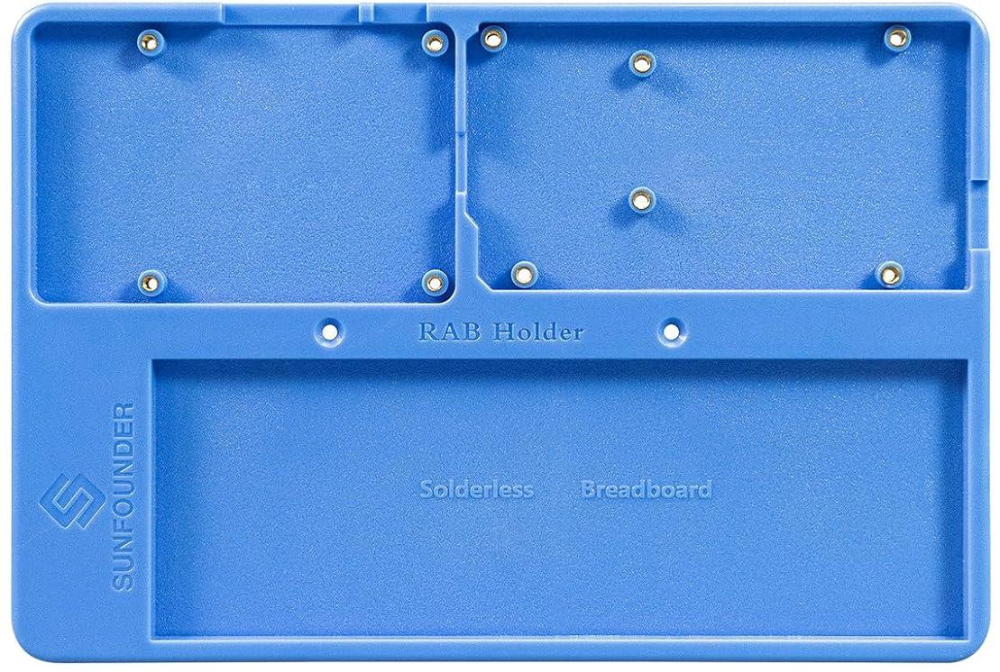

**1 x 830-hole Breadboard**

A solderless board that lets you easily build electronic circuits. It's filled with rows of holes for connecting wires and components.

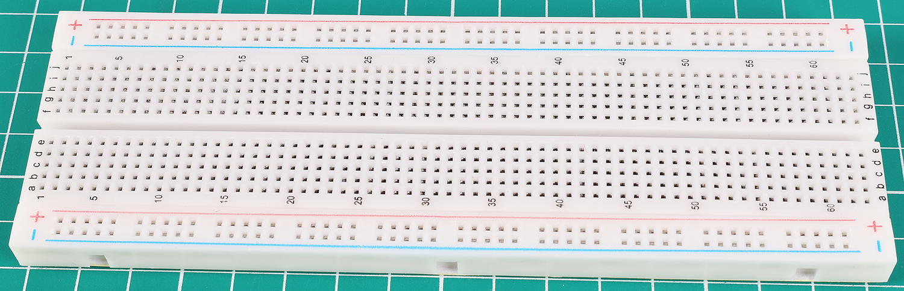

**1 x Breadboard Power Module**

The breadboard power module is a handy accessory for prototyping, providing a stable 3.3V or 5V power supply from a DC adapter or USB. It fits standard breadboards, plugs into power rails, and includes an on/off switch and voltage regulators for consistent output, making it essential for electronics projects.

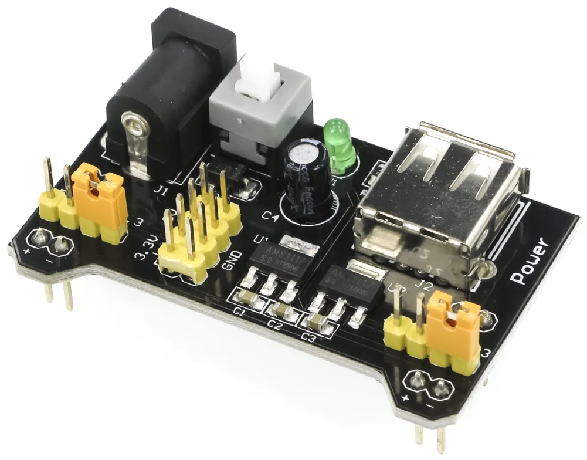

**120 x Resistors (10 of each, 30 of 220Ω resistor)**

A resistor is a component that obstructs the flow of electric power, thereby altering the voltage and current within a circuit. The value of a resistor is measured in ohms, symbolized by the Greek letter omega (Ω). The colored stripes on a resistor indicate its resistance value and tolerance.

.. image:: img/2_all_resistor.png
    :align: center

**2 x 9V Battery**

This is a non-rechargeable alkaline 9V battery. You need to install it in the multimeter, or use battery cable to power the Arduino Uno R3 or the breadboard power module.

.. image:: img/1_9v_battery.png
    :width: 300
    :align: center

**1 x Battery Cable**

This cable connects a 9V battery to the DC input of a breadboard power module or an Arduino Uno R3. It provides a convenient and portable power source for your electronic projects.

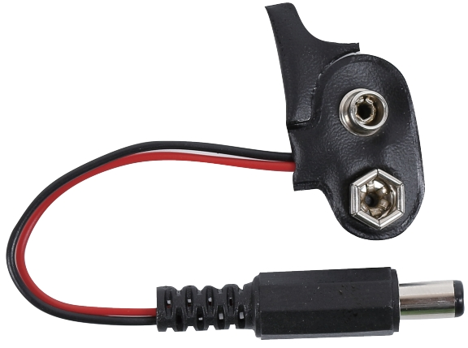

**65 x Jumper Wires**

Connect components on the breadboard to each other and to the Arduino board.

.. image:: img/2_wire_color.jpg
    :width: 400
    :align: center

**20 x Male-to-female DuPont Wires**

Male-to-female DuPont wires are specifically designed for connecting modules with male pin headers, like ultrasonic module, to breadboard. These wires are essential for interfacing different components in electronic projects, where breadboard-compatible male-to-female connections are needed.

.. image:: img/1_dupont_wire.JPG
    :width: 400
    :align: center

**1 x USB Cable**

Connects the Arduino board to a computer. Allows you to write, compile, and transfer programs to the Arduino board. Also powers the board.

.. image:: img/1_usb_cable.png
    :width: 400
    :align: center

Displays
-------------

**25 x LEDs (5 of each color)**

This colorful LED selection includes five colors: red, green, blue, yellow, and white, meeting various lighting and signaling needs. Suitable for applications ranging from simple status indicators to complex decorative lighting projects, these LEDs offer a rich color choice to enhance the visual appeal of any electronic project.

.. image:: img/2_led_color.png
    :align: center

**1 x RGB LED**

Combines red, green, and blue LEDs in one casing. It can display various colors by adjusting the input voltage, creating millions of colors.

.. image:: img/12_rgb_led.jpg
    :width: 200
    :align: center

**1 x 74HC595 Chip**

The 74HC594 is a shift register that is used to expand the input/output ports of digital circuits by converting serial input into parallel output, thus reducing the number of connection pins needed. This chip is suitable for controlling a large number of output devices, such as 7-segment Display, without occupying too many microcontroller pins.

.. image:: img/24_74hc595.png
    :width: 300
    :align: center

**1 x 7-segment Display (Common Cathode)**

A 7-segment display is an 8-shaped component which packages 7 LEDs. Each LED is called a segment - when energized, one segment forms part of a numeral to be displayed.

.. image:: img/23_7_segment.png
    :width: 300
    :align: center

**1 x 4-digit 7-segment Display (Common Cathode)**

A 4-digit display combines four 7-segment displays, each representing a single digit. To reduce the number of pins needed, the segments of each display are multiplexed, meaning each segment pin is connected to all corresponding segment pins of the other displays.

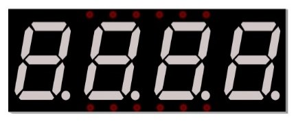

**1 x I2C LCD1602**

The I2C LCD1602 is a 16x2 character display module that uses the I2C communication protocol. This module is perfect for displaying text, such as sensor data or status messages, in your projects.

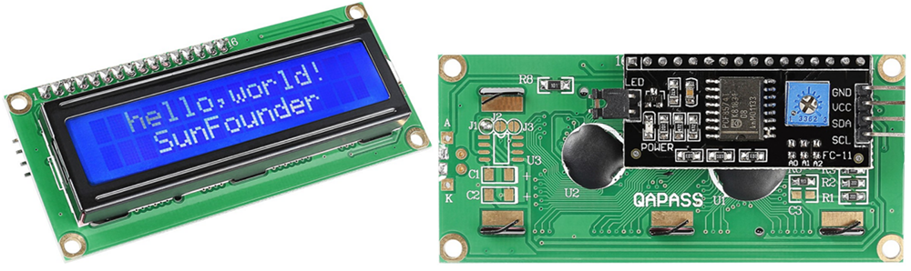

Actuators
-------------

**1 x L293D Chip**

The L293D is a dual H-bridge motor driver IC that allows you to control the speed and direction of two DC motors simultaneously. It is ideal for robotics and automation projects, providing reliable and efficient motor control.

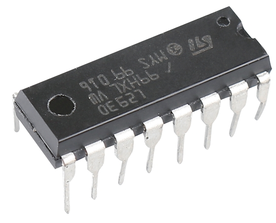

**1 x Motor**

The 3V motor is a compact and efficient DC motor designed for low-voltage applications. It is ideal for small electronics projects, toys, and hobbyist robotics, providing reliable performance with low power consumption. 

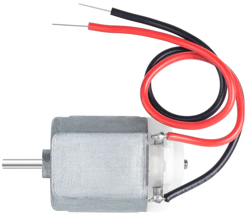

**1 x 3-leaf Fan Blade**

The soft 3-leaf fan blade is a flexible and safe fan accessory designed for use with 3V motors. Made from soft, durable materials, it minimizes the risk of injury.

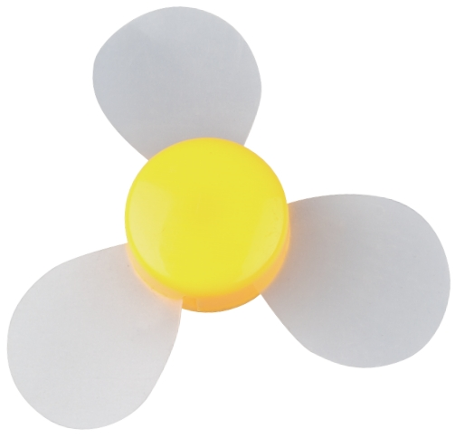

**1 x Servo**

A servo is a precise and versatile motor used for accurate control of angular or linear position, velocity, and acceleration. Commonly used in robotics, automation, and remote control systems, it ensures reliable and smooth movement for various applications.

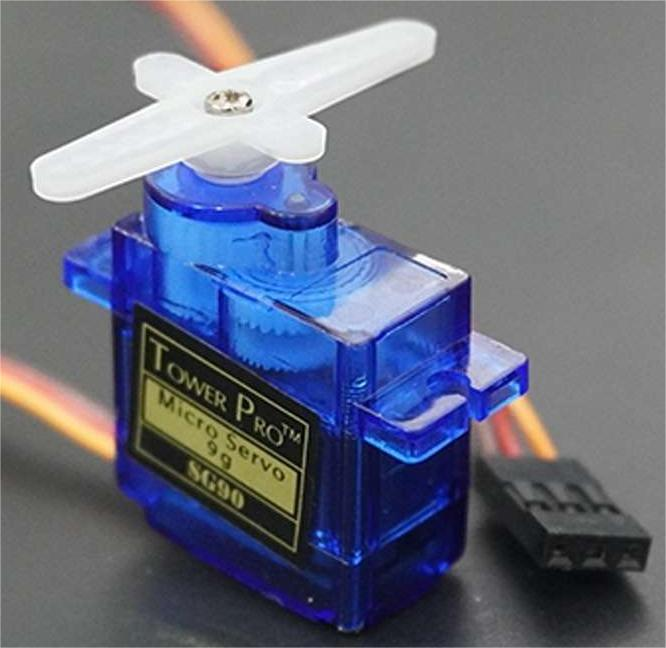

**1 x Pump**

This is the DC 2.5-6V mini submersible water pump, ideal for small-scale projects like tabletop fountains, aquariums, and hydroponic systems. This pump employs centrifugal mechanics, using an electric motor to convert rotational energy into fluid dynamic energy, efficiently moving water through its system.

.. image:: img/20_despenser_pump.png
    :width: 200
    :align: center

**1 x Tube**

This is a 20cm long, 6mm diameter clear tube used to direct water from the outlet of a water pump.

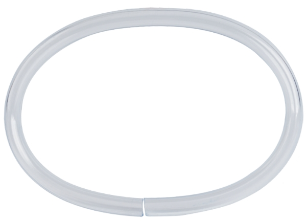

**1 x Stepper Motor**

The 28BYJ-48 is a 5-wire unipolar stepper motor that operates at 5V. It is ideal for applications requiring precise control of rotation, such as robotics, 3D printers, and automation projects.

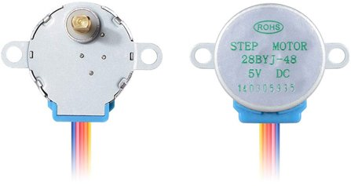

**1 x ULN2003 Module**

The ULN2003 module is a high-voltage, high-current Darlington transistor array used to drive stepper motors, relays, and other inductive loads. It features seven open-collector Darlington pairs, making it ideal for interfacing with TTL and CMOS logic levels in various control applications.

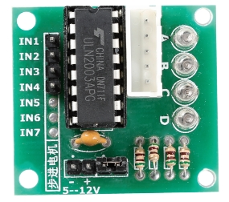

Sounds
---------------

**1 x Active Buzzer & 1 x Passive Buzzer**

A buzzer, available in active and passive types, is an audio signaling device that emits sound when electric current is applied. It is commonly used in alarms, timers, and notification systems.

.. image:: img/7_beep_2.png
    :width: 600
    :align: center

Sensors
-----------

**1 x Photoresistor**

A photoresistor is a light-sensitive component that changes its resistance based on the intensity of light it is exposed to, ideal for creating light-activated controls and sensors in electronic projects.

.. image:: img/17_photoresistor.png
    :width: 100
    :align: center

**1 x NTC Thermistor**

A thermistor is a resistor sensitive to temperature changes. NTC thermistors decrease resistance as temperature rises, while PTC thermistors increase resistance with temperature.

.. image:: img/1_thermistor.png
    :width: 100
    :align: center

**1 x Potentiometer**

A potentiometer is a variable resistor with three pins. Two pins connect to the ends of a resistor, while the middle pin attaches to a movable wiper, dividing the resistor into two parts. Potentiometers, often used to adjust voltage in circuits, are like the volume knobs on radios.

.. image:: img/9_dimmer_pot.png
    :width: 200
    :align: center

**10 x Small Buttons**

A small push-button is used to provide a physical response when pressed, commonly used in electronic devices to initiate actions or input commands.

.. image:: img/1_button.png
    :width: 200
    :align: center

**1 x Ultrasonic Module**

This is an ultrasonic module that uses ultrasonic waves to measure distances, accurately detecting and measuring the position and distance of objects. Widely used in robotics, obstacle avoidance systems, and automatic control fields, it is a key component for environmental perception and spatial navigation.

.. image:: img/19_ultrasonic_pic.png
    :width: 300
    :align: center

**1 x Joystick Module**

A joystick module, also known as a joystick sensor, is an input device that measures the movement of a knob in two directions, horizontal (X-axis) and vertical (Y-axis).

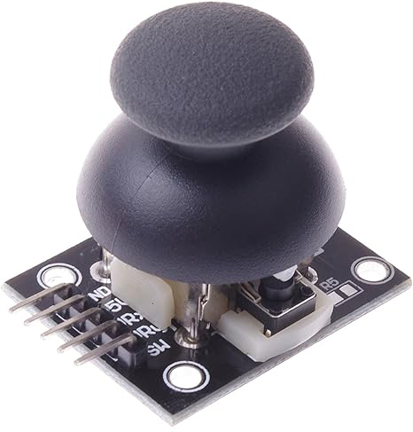

**1 x Soil Moisture Module**

A capacitive sensor for detecting soil moisture, corrosion-resistant, and operates at 3.3V to 5.5V. Outputs moisture value, with wetter soil giving a smaller analog value.

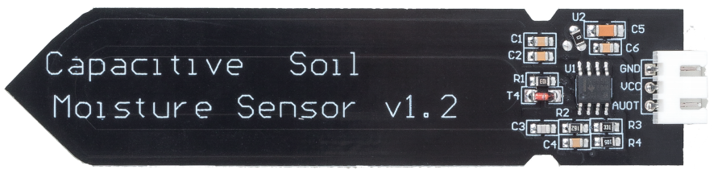

**1 x RC522-RFID Module with a Tag and a White Card**

The RC522 RFID reader module, operating at a frequency of 13.56MHz, is designed to communicate with RFID tags adhering to the ISO 14443A standard. This compact and versatile device is ideal for applications in access control, inventory tracking, and contactless payment systems due to its ability to interface with microcontrollers via a 4-pin SPI connection, supporting data rates up to 10 Mbps.

.. image:: img/33_rfid_module.png
    :width: 300
    :align: center

Others
------------

**1 x Relay Module**

A relay module enables microcontrollers to control high-voltage devices by providing an electrically isolated switch. It is ideal for applications requiring the control of AC or high-current loads from low-voltage digital signals.

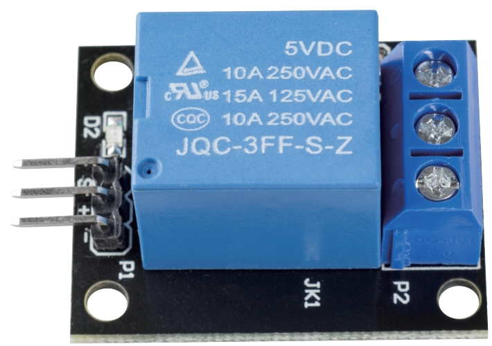

**1 x IR Receiver**

The SL838 infrared receiver is a component that receives infrared signals and can independently receive infrared rays and output signals compatible with TTL level. It is similar in size to a normal plastic-packaged transistor and is suitable for all kinds of infrared remote control and infrared transmission.

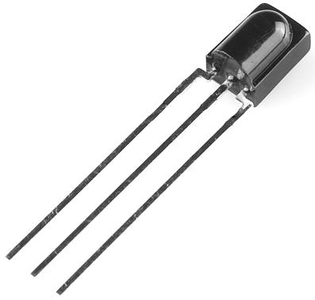

**1 x Remote Control**

This 21-key remote, compact at 85x39x6mm, has an 8-meter range and is powered by a 3V lithium battery. With a 38KHz infrared frequency and durable PET surface, it ensures over 20,000 uses, making it perfect for various devices.

.. image:: img/22_receiver_remote_control.jpeg
    :width: 500
    :align: center