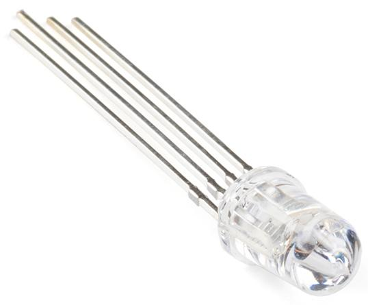

.. note::

    Hallo und herzlich willkommen in der SunFounder Raspberry Pi & Arduino & ESP32 Enthusiasten-Community auf Facebook! Tauche gemeinsam mit anderen Enthusiasten tiefer in die Welt von Raspberry Pi, Arduino und ESP32 ein.

    **Warum beitreten?**

    - **Expertenunterstützung**: Lösen Sie nach dem Kauf auftretende Probleme und technische Herausforderungen mit Hilfe unserer Community und unseres Teams.
    - **Lernen & Teilen**: Tauschen Sie Tipps und Tutorials aus, um Ihre Fähigkeiten zu verbessern.
    - **Exklusive Vorschauen**: Erhalten Sie frühzeitigen Zugang zu neuen Produktankündigungen und ersten Einblicken.
    - **Spezielle Rabatte**: Genießen Sie exklusive Rabatte auf unsere neuesten Produkte.
    - **Festliche Aktionen und Verlosungen**: Nehmen Sie an Verlosungen und Sonderaktionen während der Feiertage teil.

    👉 Bereit, mit uns zu entdecken und zu kreieren? Klicken Sie auf [|link_sf_facebook|] und treten Sie noch heute bei!

1.2 Was ist in Ihrem Kit enthalten
========================================

In unserem Kit finden Sie eine Vielzahl von Komponenten und Teilen, die Sie während dieses Kurses zum Bau von Schaltungen verwenden werden. Hier ist eine kurze Übersicht über den Inhalt.

Grundlegende Komponenten
-----------------------------

**1 x Original Arduino Uno R3**

Eine Mikrocontroller-Platine, die das Gehirn Ihrer Schaltungen ist. Sie enthält alles, was benötigt wird, um den Mikrocontroller zu unterstützen; schließen Sie sie einfach mit einem USB-Kabel an Ihren Computer an oder versorgen Sie sie mit einem AC-DC-Adapter oder einer Batterie, um loszulegen.

.. image:: img/1_uno_r3.png
    :width: 400
    :align: center

**1 x Multimeter mit roten und schwarzen Messleitungen**

Ein vielseitiges Multimeter, das Spannung, Strom und Widerstand messen sowie andere elektrische Tests durchführen kann, und somit ein unverzichtbares Werkzeug für Elektronik- und Elektroarbeiten ist.

.. image:: img/multimeter_pic.png
    :width: 200
    :align: center

**1 x RAB Halter**

Entwickelt für Arduino- und Raspberry Pi-Benutzer, sorgt dieser Halter für Stabilität all Ihrer Geräte. Darüber hinaus ist er ein Werkzeug für Innovationen und für jeden geeignet.

**1 x Breadboard mit 830 Löchern**

Ein lötfreies Board, mit dem Sie elektronische Schaltungen einfach aufbauen können. Es ist mit Reihen von Löchern gefüllt, um Drähte und Komponenten zu verbinden.

.. image:: img/2_breadboard_full+.png
    :width: 500
    :align: center

**1 x Breadboard-Strommodul**

Das Breadboard-Strommodul ist ein praktisches Zubehör zum Prototyping, das eine stabile 3,3V oder 5V Stromversorgung von einem DC-Adapter oder USB bietet. Es passt auf Standard-Breadboards, wird an die Stromschienen angeschlossen und verfügt über einen Ein/Aus-Schalter sowie Spannungsregler für eine konstante Ausgabe. Es ist unverzichtbar für Elektronikprojekte.

.. image:: img/1_breadboard_power_module.png
    :width: 300
    :align: center

**120 x Widerstände (10 von jedem, 30 x 220Ω Widerstände)**

Ein Widerstand ist eine Komponente, die den Stromfluss behindert und dadurch die Spannung und den Strom in einer Schaltung verändert. Der Wert eines Widerstands wird in Ohm gemessen und durch das griechische Zeichen Omega (Ω) symbolisiert. Die farbigen Streifen auf einem Widerstand geben seinen Widerstandswert und seine Toleranz an.

.. image:: img/2_all_resistor.png
    :align: center

**2 x 9V Batterie**

Eine nicht wiederaufladbare alkalische 9V Batterie. Sie müssen sie im Multimeter installieren oder ein Batteriekabel verwenden, um das Arduino Uno R3 oder das Breadboard-Strommodul mit Strom zu versorgen.

.. image:: img/1_9v_battery.png
    :width: 300
    :align: center

**1 x Batteriekabel**

Dieses Kabel verbindet eine 9V Batterie mit dem DC-Eingang eines Breadboard-Strommoduls oder eines Arduino Uno R3. Es bietet eine bequeme und tragbare Stromquelle für Ihre Elektronikprojekte.

.. image:: img/1_battery_cable.png
    :width: 300
    :align: center

**65 x Jumperkabel**

Verbinden Sie Komponenten auf dem Breadboard miteinander und mit der Arduino-Platine.

.. image:: img/2_wire_color.jpg
    :width: 400
    :align: center

**20 x DuPont-Kabel (Männlich-zu-Weiblich)**

Männlich-zu-Weiblich DuPont-Kabel sind speziell dafür ausgelegt, Module mit männlichen Pin-Headern, wie z. B. ein Ultraschallmodul, mit einem Breadboard zu verbinden. Diese Kabel sind unverzichtbar für die Verbindung verschiedener Komponenten in Elektronikprojekten, bei denen Breadboard-kompatible Männlich-zu-Weiblich-Verbindungen benötigt werden.

.. image:: img/1_dupont_wire.jpg
    :width: 400
    :align: center

**1 x USB-Kabel**

Verbindet die Arduino-Platine mit einem Computer. Ermöglicht das Schreiben, Kompilieren und Übertragen von Programmen auf die Arduino-Platine und versorgt sie außerdem mit Strom.

.. image:: img/1_usb_cable.png
    :width: 400
    :align: center

Displays
----------------

**25 x LEDs (5 von jeder Farbe)**

Diese bunte LED-Auswahl umfasst fünf Farben: Rot, Grün, Blau, Gelb und Weiß und erfüllt verschiedene Beleuchtungs- und Signalanforderungen. Geeignet für Anwendungen von einfachen Statusanzeigen bis hin zu komplexen dekorativen Beleuchtungsprojekten bieten diese LEDs eine reiche Farbwahl, um die visuelle Attraktivität jedes Elektronikprojekts zu steigern.

.. image:: img/2_led_color.png
    :align: center

**1 x RGB-LED**

Kombiniert rote, grüne und blaue LEDs in einem Gehäuse. Sie kann durch Anpassung der Eingangsspannung verschiedene Farben anzeigen und Millionen von Farben erzeugen.

**1 x 74HC595-Chip**

Der 74HC595 ist ein Schieberegister, das zur Erweiterung der Ein-/Ausgabepins digitaler Schaltungen verwendet wird, indem serielle Eingaben in parallele Ausgaben umgewandelt werden und somit die Anzahl der benötigten Verbindungsstifte reduziert wird. Dieser Chip eignet sich zur Steuerung einer großen Anzahl von Ausgangsgeräten, wie z. B. 7-Segment-Displays, ohne dabei zu viele Mikrocontroller-Pins zu belegen.

.. image:: img/24_74hc595.png
    :width: 300
    :align: center

**1 x 7-Segment-Display (gemeinsamer Kathode)**

Ein 7-Segment-Display ist eine 8-förmige Komponente, die 7 LEDs enthält. Jede LED wird als Segment bezeichnet – wenn sie mit Strom versorgt wird, bildet ein Segment einen Teil einer Zahl, die angezeigt werden soll.

.. image:: img/23_7_segment.png
    :width: 300
    :align: center

**1 x 4-stelliges 7-Segment-Display (gemeinsamer Kathode)**

Ein 4-stelliges Display kombiniert vier 7-Segment-Displays, von denen jedes eine einzelne Ziffer darstellt. Um die Anzahl der benötigten Pins zu reduzieren, werden die Segmente jedes Displays multiplexiert, was bedeutet, dass jeder Segment-Pin mit allen entsprechenden Segment-Pins der anderen Displays verbunden ist.

.. image:: img/32_stopwatch_4_digit.png
    :width: 300
    :align: center

**1 x I2C LCD1602**

Das I2C LCD1602 ist ein 16x2 Zeichen-Display-Modul, das das I2C-Kommunikationsprotokoll verwendet. Dieses Modul eignet sich perfekt zum Anzeigen von Text, wie z. B. Sensordaten oder Statusmeldungen, in Ihren Projekten.

.. image:: img/17_lcd_i2c_lcd1602.png
    :width: 600
    :align: center

Aktuatoren
---------------

**1 x L293D-Chip**

Der L293D ist ein Dual-H-Brücken-Motortreiber-IC, der es ermöglicht, die Geschwindigkeit und Richtung von zwei Gleichstrommotoren gleichzeitig zu steuern. Er ist ideal für Robotik- und Automatisierungsprojekte geeignet und bietet zuverlässige und effiziente Motorsteuerung.

.. image:: img/16_motor_l293d_pic.png
    :width: 200
    :align: center

**1 x Motor**

Der 3V-Motor ist ein kompakter und effizienter Gleichstrommotor, der für Niederspannungsanwendungen entwickelt wurde. Er ist ideal für kleine Elektronikprojekte, Spielzeug und Hobby-Roboter und bietet eine zuverlässige Leistung bei geringem Stromverbrauch.

.. image:: img/16_motor_pic.png
    :width: 300
    :align: center

**1 x 3-Blatt Lüfter**

Das weiche 3-Blatt-Lüfterrad ist ein flexibles und sicheres Lüfterzubehör, das für die Verwendung mit 3V-Motoren entwickelt wurde. Es besteht aus weichen, langlebigen Materialien und minimiert das Verletzungsrisiko.

**1 x Servo**

Ein Servo ist ein präziser und vielseitiger Motor, der zur genauen Steuerung von Winkel- oder Linearposition, Geschwindigkeit und Beschleunigung verwendet wird. Häufig in der Robotik, Automatisierung und Fernsteuerungssystemen eingesetzt, sorgt er für zuverlässige und sanfte Bewegungen in verschiedenen Anwendungen.

**1 x Pumpe**

Dies ist die Mini-Tauchwasserpumpe DC 2,5-6V, ideal für kleine Projekte wie Tischbrunnen, Aquarien und Hydrokultursysteme. Diese Pumpe verwendet Zentrifugalmechanik, bei der ein Elektromotor Rotationsenergie in Flüssigkeitsdynamik umwandelt und somit Wasser effizient durch das System bewegt.

.. image:: img/20_despenser_pump.png
    :width: 200
    :align: center

**1 x Schlauch**

Dies ist ein 20 cm langer, 6 mm Durchmesser klarer Schlauch, der das Wasser vom Auslass einer Wasserpumpe leitet.

**1 x Schrittmotor**

Der 28BYJ-48 ist ein 5-Draht-Unipolar-Schrittmotor, der mit 5V betrieben wird. Er ist ideal für Anwendungen, die eine präzise Steuerung der Rotation erfordern, wie z. B. in der Robotik, in 3D-Druckern und in Automatisierungsprojekten.

.. image:: img/34_step_stepper.png
    :width: 600
    :align: center

**1 x ULN2003-Modul**

Das ULN2003-Modul ist ein Hochspannungs-Hochstrom-Darlington-Transistor-Array, das zum Ansteuern von Schrittmotoren, Relais und anderen induktiven Lasten verwendet wird. Es verfügt über sieben Open-Collector-Darlington-Paare und ist ideal für die Schnittstelle mit TTL- und CMOS-Logikpegeln in verschiedenen Steuerungsanwendungen.

.. image:: img/34_step_uln2003.png
    :width: 300
    :align: center

Töne
---------------

**1 x Aktiver Buzzer & 1 x Passiver Buzzer**

Ein Buzzer, erhältlich in aktiver und passiver Ausführung, ist ein akustisches Signalgerät, das bei Anlegen eines elektrischen Stroms einen Ton erzeugt. Er wird häufig in Alarmen, Timern und Benachrichtigungssystemen verwendet.

.. image:: img/7_beep_2.png
    :width: 600
    :align: center

Sensoren
-----------

**1 x Fotowiderstand**

Ein Fotowiderstand ist eine lichtempfindliche Komponente, die ihren Widerstand in Abhängigkeit von der Lichtintensität ändert, der sie ausgesetzt ist. Ideal für die Erstellung von lichtaktivierten Steuerungen und Sensoren in Elektronikprojekten.

.. image:: img/17_photoresistor.png
    :width: 100
    :align: center

**1 x NTC-Thermistor**

Ein Thermistor ist ein widerstandsempfindlicher Temperaturfühler. NTC-Thermistoren verringern den Widerstand bei steigender Temperatur, während PTC-Thermistoren den Widerstand bei steigender Temperatur erhöhen.

.. image:: img/1_thermistor.png
    :width: 100
    :align: center

**1 x Potentiometer**

Ein Potentiometer ist ein verstellbarer Widerstand mit drei Pins. Zwei Pins sind mit den Enden eines Widerstands verbunden, während der mittlere Pin mit einem beweglichen Schleifer verbunden ist, der den Widerstand in zwei Teile teilt. Potentiometer, die oft zur Spannungsanpassung in Schaltungen verwendet werden, sind wie die Lautstärkeregler bei Radios.

.. image:: img/9_dimmer_pot.png
    :width: 200
    :align: center

**10 x Kleine Taster**

Ein kleiner Druckknopf, der bei Betätigung eine physische Rückmeldung gibt und häufig in elektronischen Geräten verwendet wird, um Aktionen zu initiieren oder Befehle einzugeben.

.. image:: img/1_button.png
    :width: 200
    :align: center

**1 x Ultraschallmodul**

Dies ist ein Ultraschallmodul, das mit Ultraschallwellen Entfernungen misst und die Position und Entfernung von Objekten präzise erkennt. Weit verbreitet in der Robotik, in Hindernisvermeidungssystemen und in der automatischen Steuerung, ist es ein Schlüsselelement für die Umgebungswahrnehmung und räumliche Navigation.

.. image:: img/19_ultrasonic_pic.png
    :width: 300
    :align: center

**1 x Joystick-Modul**

Ein Joystick-Modul, auch Joystick-Sensor genannt, ist ein Eingabegerät, das die Bewegung eines Knopfes in zwei Richtungen misst: horizontal (X-Achse) und vertikal (Y-Achse).

.. image:: img/11_joystick_module.jpg
    :width: 300
    :align: center

**1 x Bodenfeuchtigkeitsmodul**

Ein kapazitiver Sensor zur Erkennung der Bodenfeuchtigkeit, korrosionsbeständig und arbeitet mit 3,3V bis 5,5V. Gibt einen Feuchtigkeitswert aus, wobei nasserer Boden einen kleineren Analogwert erzeugt.

.. image:: img/29_plant_soil_mositure.png
    :width: 600
    :align: center

**1 x RC522-RFID-Modul mit einem Tag und einer weißen Karte**

Das RC522 RFID-Lesemodul, das mit einer Frequenz von 13,56 MHz arbeitet, ist für die Kommunikation mit RFID-Tags ausgelegt, die dem ISO 14443A-Standard entsprechen. Dieses kompakte und vielseitige Gerät ist aufgrund seiner Fähigkeit, über eine 4-Pin-SPI-Verbindung mit Mikrocontrollern zu interagieren und Datenraten von bis zu 10 Mbps zu unterstützen, ideal für Anwendungen in der Zugangskontrolle, der Bestandsverfolgung und in kontaktlosen Bezahlsystemen.

.. image:: img/33_rfid_module.png
    :width: 300
    :align: center

Sonstiges
------------

**1 x Relaismodul**

Ein Relaismodul ermöglicht es Mikrocontrollern, Hochspannungsgeräte zu steuern, indem es einen elektrisch isolierten Schalter bereitstellt. Es ist ideal für Anwendungen, bei denen Lasten mit Wechselstrom oder hohen Strömen von Niederspannungs-Digitalsignalen gesteuert werden müssen.

**1 x IR-Empfänger**

Der SL838 Infrarotempfänger ist eine Komponente, die Infrarotsignale empfängt und Infrarotstrahlen unabhängig empfangen und Signale ausgeben kann, die mit TTL-Pegeln kompatibel sind. Er ist in seiner Größe ähnlich einem normalen Transistor in Kunststoffverpackung und eignet sich für alle Arten von Infrarot-Fernbedienungen und Infrarotübertragungen.

.. image:: img/1_ir_receiver.jpg
    :width: 300
    :align: center

**1 x Fernbedienung**

Diese 21-Tasten-Fernbedienung ist kompakt mit 85x39x6mm und hat eine Reichweite von 8 Metern. Sie wird mit einer 3V Lithiumbatterie betrieben. Mit einer Infrarotfrequenz von 38KHz und einer strapazierfähigen PET-Oberfläche gewährleistet sie über 20.000 Einsätze und ist somit perfekt für verschiedene Geräte geeignet.

.. image:: img/22_receiver_remote_control.jpeg
    :width: 500
    :align: center
