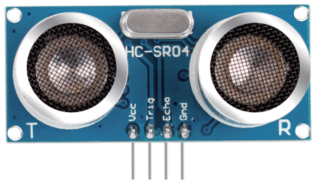
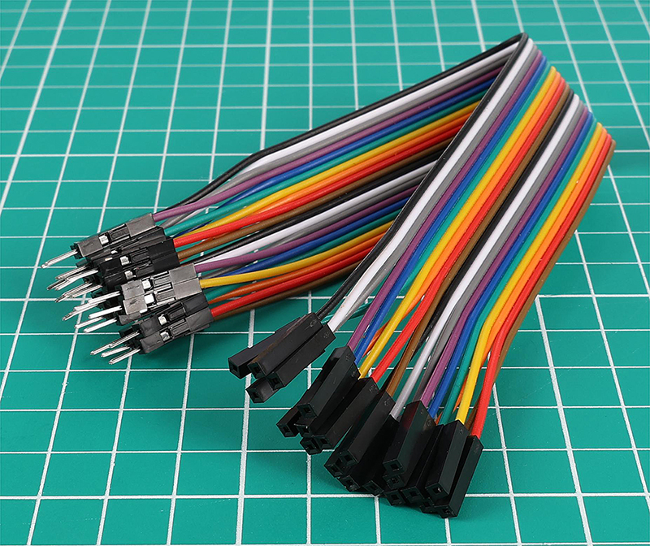

.. note::

    Hello, welcome to the SunFounder Raspberry Pi & Arduino & ESP32 Enthusiasts Community on Facebook! Dive deeper into Raspberry Pi, Arduino, and ESP32 with fellow enthusiasts.

    **Why Join?**

    - **Expert Support**: Solve post-sale issues and technical challenges with help from our community and team.
    - **Learn & Share**: Exchange tips and tutorials to enhance your skills.
    - **Exclusive Previews**: Get early access to new product announcements and sneak peeks.
    - **Special Discounts**: Enjoy exclusive discounts on our newest products.
    - **Festive Promotions and Giveaways**: Take part in giveaways and holiday promotions.

    👉 Ready to explore and create with us? Click [|link_sf_facebook|] and join today!

1.2 What's Included in Your Kit
======================================

Inside our kit, you'll find a variety of components and parts you'll use throughout this course to build circuits. Here's a quick guide to what's included.

**1 x Original Arduino Uno R3**

A microcontroller board that's the brain of your circuits. It has everything needed to support the microcontroller; simply connect it to your computer with a USB cable or power it with an AC-to-DC adapter or battery to get started.

.. image:: img/1_uno_r3.png
    :width: 500
    :align: center

**1 x 400-hole Breadboard**

A solderless board that lets you easily build electronic circuits. It's filled with rows of holes for connecting wires and components.

.. image:: img/2_breadboard_half.png
    :width: 500
    :align: center

**120 x Resistors (10 of each, 30 of 220Ω resistor)**

A resistor is a component that obstructs the flow of electric power, thereby altering the voltage and current within a circuit. The value of a resistor is measured in ohms, symbolized by the Greek letter omega (Ω). The colored stripes on a resistor indicate its resistance value and tolerance.

.. image:: img/2_all_resistor.png
    :align: center

**25 x LEDs (5 of each color)**

This colorful LED selection includes five colors: red, green, blue, yellow, and white, meeting various lighting and signaling needs. Suitable for applications ranging from simple status indicators to complex decorative lighting projects, these LEDs offer a rich color choice to enhance the visual appeal of any electronic project.

.. image:: img/2_led_color.png
    :align: center

**2 x RGB LEDs**

Combines red, green, and blue LEDs in one casing. It can display various colors by adjusting the input voltage, creating millions of colors.

.. image:: img/12_rgb_led.jpg
    :width: 300
    :align: center

**1 x Photoresistor**

A photoresistor is a light-sensitive component that changes its resistance based on the intensity of light it is exposed to, ideal for creating light-activated controls and sensors in electronic projects.

.. image:: img/17_photoresistor.png
    :width: 100
    :align: center

**1 x NTC Thermistor**

A thermistor is a resistor sensitive to temperature changes. NTC thermistors decrease resistance as temperature rises, while PTC thermistors increase resistance with temperature.

.. image:: img/1_thermistor.png
    :width: 100
    :align: center

**1 x Active Buzzer & 1 x Passive Buzzer**

A buzzer, available in active and passive types, is an audio signaling device that emits sound when electric current is applied. It is commonly used in alarms, timers, and notification systems.

.. image:: img/7_beep_2.png
    :align: center

**1 x Potentiometer**

A potentiometer is a variable resistor with three pins. Two pins connect to the ends of a resistor, while the middle pin attaches to a movable wiper, dividing the resistor into two parts. Potentiometers, often used to adjust voltage in circuits, are like the volume knobs on radios.

.. image:: img/9_dimmer_pot.png
    :width: 200
    :align: center

**10 x Small Buttons**

A small push-button is used to provide a physical response when pressed, commonly used in electronic devices to initiate actions or input commands.

.. image:: img/1_button.png
    :width: 200
    :align: center

**1 x 74HC595 Chip**

The 74HC594 is a shift register that is used to expand the input/output ports of digital circuits by converting serial input into parallel output, thus reducing the number of connection pins needed. This chip is suitable for controlling a large number of output devices, such as 7-segment Display, without occupying too many microcontroller pins.

.. image:: img/24_74hc595.png
    :width: 300
    :align: center

**1 x 7-segment Display**

A 7-segment display is an 8-shaped component which packages 7 LEDs. Each LED is called a segment - when energized, one segment forms part of a numeral to be displayed.

.. image:: img/23_7_segment.png
    :width: 300
    :align: center

**1 x Ultrasonic Module**

This is an ultrasonic module that uses ultrasonic waves to measure distances, accurately detecting and measuring the position and distance of objects. Widely used in robotics, obstacle avoidance systems, and automatic control fields, it is a key component for environmental perception and spatial navigation.

**65 x Jumper Wires**

Connect components on the breadboard to each other and to the Arduino board.

.. image:: img/2_wire_color.jpg
    :width: 400
    :align: center

**10 x Male-to-female DuPont Wires**

Male-to-female DuPont wires are specifically designed for connecting modules with male pin headers, like ultrasonic module, to breadboard. These wires are essential for interfacing different components in electronic projects, where breadboard-compatible male-to-female connections are needed.

**1 x USB Cable**

Connects the Arduino board to a computer. Allows you to write, compile, and transfer programs to the Arduino board. Also powers the board.

.. image:: img/1_usb_cable.png
    :width: 400
    :align: center

**1 x 9V Battery**

This is a non-rechargeable alkaline 9V battery. You need to install it on the multimeter.

.. image:: img/1_9v_battery.png
    :width: 200
    :align: center

**1 x Multimeter with Red & Black Leads**

This is a versatile multimeter capable of measuring voltage, current, and resistance, as well as performing other electrical tests, making it an indispensable tool for electronics and electrical work.

.. image:: img/multimeter_pic.png
    :width: 200
    :align: center