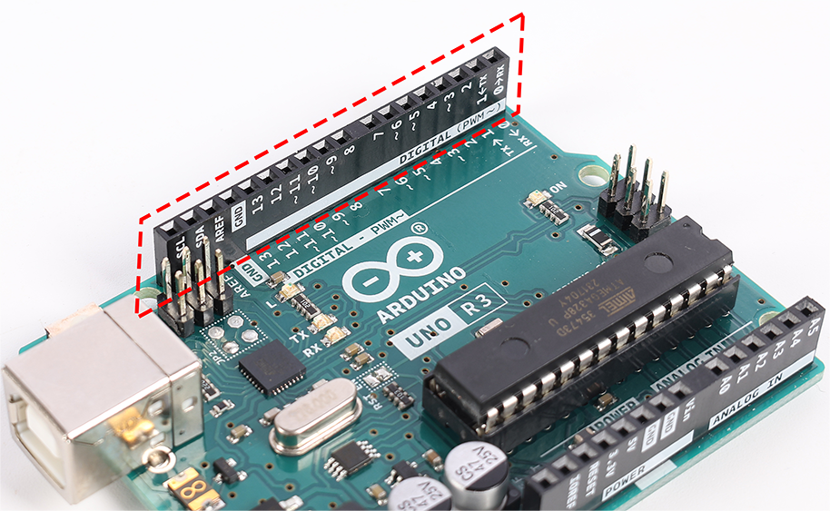
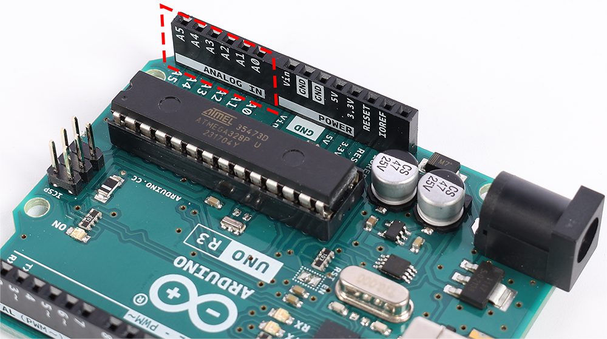

.. note::

    こんにちは！SunFounder Raspberry Pi & Arduino & ESP32 Enthusiasts Communityへようこそ！FacebookでRaspberry Pi、Arduino、ESP32についてさらに深く学び、仲間たちと交流しましょう。

    **参加する理由は？**

    - **専門家によるサポート**: コミュニティやチームの助けを借りて、購入後の問題や技術的な課題を解決しましょう。
    - **学びと共有**: スキル向上のためのヒントやチュートリアルを交換しましょう。
    - **限定プレビュー**: 新製品の発表や先行情報に早期アクセスできます。
    - **特別割引**: 最新製品に対する限定割引をお楽しみください。
    - **季節のプロモーションとプレゼント**: ギブアウェイやホリデープロモーションに参加しましょう。

    👉 さあ、一緒に探求し、創造しませんか？[|link_sf_facebook|]をクリックして、今すぐ参加しましょう！

1.3 Arduinoボードの理解
=============================

Arduinoの旅の次のステップへようこそ！あなたの手にあるのは、アイデアを現実のプロジェクトに変えるためのツール、Arduinoボードです。他のボードと少し見た目が違うかもしれませんが、機能は同じです。Arduinoコミュニティはシェアを大切にしており、このボードも誰もが利用できるオープンソースの設計に基づいて作られています。

ミニロボットやカスタムゲーム、部屋用のスマートデバイスなど、素晴らしいプロジェクトを作ることを考えてみてください。Arduinoは、これらのアイデアを実現するためのプラットフォームです。コンパクトながらも可能性に満ちたこのボードとその部品を知り、創造を始めましょう。

.. image:: img/1_introduce_board.png
    :width: 800
    :align: center

コア: マイクロコントローラ
------------------------------

マイクロコントローラは、Arduinoのメインチップであり、ボードの「脳」と言えます。ここで全ての処理が行われ、ピンを制御して、LEDやモーター、センサーと連携します。

.. image:: img/1_uno_mcu.png
    :width: 500
    :align: center

ピン: 接続と制御
----------------------

**電源ピン**

これらのピンは、プロジェクトに電力を供給します。「3.3V」、「5V」、「GND」といったラベルがあり、それぞれ異なる電力レベルを提供します。「リセット」ピンは、すべてを最初に戻すリスタートボタンのような役割を果たします。

.. image:: img/1_uno_power_pin.png
    :width: 500
    :align: center

**デジタルピン**

デジタルピンは、オンオフのスイッチのようなものです。これらは、LEDの制御やボタンの押下を検知するために使用します。いくつかのピンは、送信する電力の量を制御することもでき、これによりライトを暗くしたり、モーターの速度を調整することができます。

**アナログピン**

これらのピンは、異なるレベルの電力を読み取ることができ、センサーからの入力を読み取るのに適しています。光の明るさや温度、圧力の強さなどを測定することができます。

**ICSPヘッダー**

このピンセットは、Arduinoを特別な方法でプログラムするための「秘密の通路」のようなものです。普段はあまり使われませんが、必要な場合に利用できます。

.. image:: img/1_uno_icsp_header.png
    :width: 500
    :align: center

ポート: ボードの接続
-------------------------

**USB接続**

このポートは、Arduinoをコンピュータに接続し、プログラムをアップロードしてボードに指示を伝える役割を果たします。

.. image:: img/1_uno_usb_port.png
    :width: 500
    :align: center

**電源ジャック**

ここに外部電源（バッテリーなど）を接続すると、コンピュータを使わずにArduinoを動作させることができます。

.. image:: img/1_uno_power_jack.png
    :width: 500
    :align: center

その他の主要コンポーネント
----------------------------------

**5V電圧レギュレータ**

この部品は、Arduinoに適切な電力が供給されるようにし、すべてがスムーズに動作するようにします。

.. image:: img/1_uno_voltage_regulator.png
    :width: 500
    :align: center

**リセットスイッチ**

リセットボタンを押すと、プログラムが最初からやり直しになり、すぐに再スタートできます。

.. image:: img/1_uno_reset_switch.png
    :width: 500
    :align: center

**USBインターフェースチップ**

これはUSBポートと通信を行い、コンピュータとArduinoが相互に理解できるようにします。

.. image:: img/1_uno_usb_chip.png
    :width: 500
    :align: center

これらの部品を理解することで、Arduinoボードを最大限に活用することができます。それでは、一緒に学びの冒険を始めましょう！
