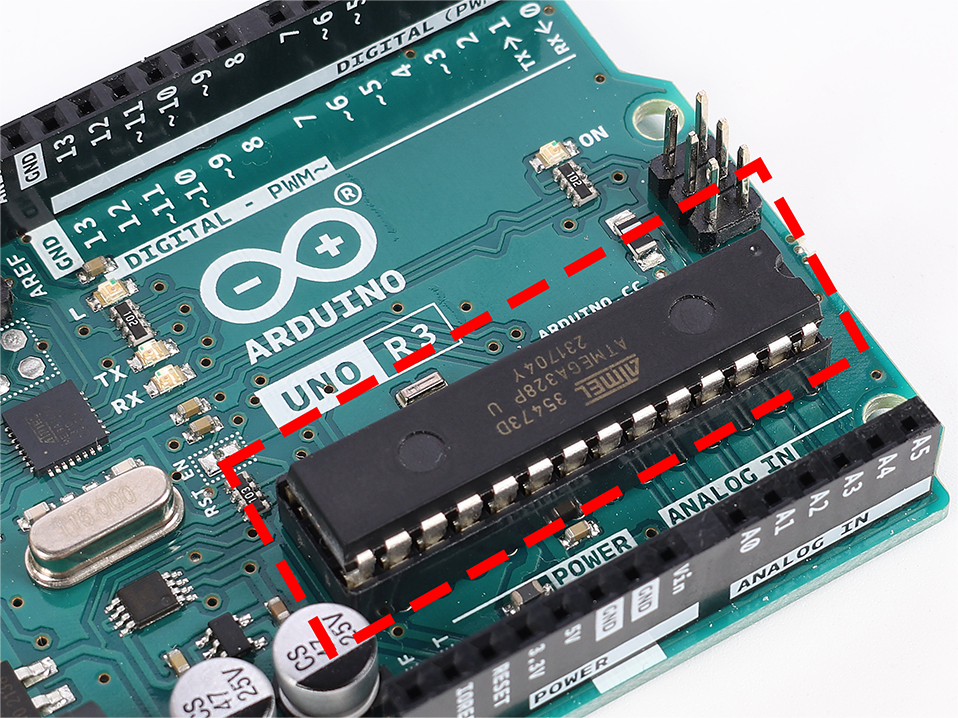

.. note::

    Hello, welcome to the SunFounder Raspberry Pi & Arduino & ESP32 Enthusiasts Community on Facebook! Dive deeper into Raspberry Pi, Arduino, and ESP32 with fellow enthusiasts.

    **Why Join?**

    - **Expert Support**: Solve post-sale issues and technical challenges with help from our community and team.
    - **Learn & Share**: Exchange tips and tutorials to enhance your skills.
    - **Exclusive Previews**: Get early access to new product announcements and sneak peeks.
    - **Special Discounts**: Enjoy exclusive discounts on our newest products.
    - **Festive Promotions and Giveaways**: Take part in giveaways and holiday promotions.

    👉 Ready to explore and create with us? Click [|link_sf_facebook|] and join today!

1.3 Getting to Know Your Arduino Board
========================================

Welcome to your next step in the Arduino journey! In your hands is an Arduino board, a tool that will help you turn your clever ideas into real projects. Although this board may look a little different from others, it functions just the same. The Arduino community loves to share, which means this board was made following open-source blueprints available to everyone.

Think of the amazing projects you can create—whether it's a mini robot, a custom-made game, or a smart device for your room. Arduino is all about making those ideas possible. It's a compact platform filled with big possibilities. Let's get to know the board and all its parts so you can start creating.

.. image:: img/1_introduce_board.png

The Core: Microcontroller
-------------------------------

The microcontroller is the main chip on your Arduino. Think of it as the board's brain where all the thinking happens. It processes your commands and controls the pins, which interact with lights, motors, and sensors.

Pins: Connecting and Controlling
-------------------------------------

**Power Pins**

These pins supply power to your creations. They have labels like "3.3V," "5V," and "GND," each providing different power levels for your projects. The "Reset" pin acts like a restart button, resetting everything back to the beginning.

.. image:: img/1_uno_power_pin.png

**Digital Pins**

Digital pins act like little switches that can be turned on and off. You'll use them to control things like LEDs or to read button presses. Some of them can even control how much power they send, which is useful for dimming lights or controlling motor speeds.

.. image:: img/1_uno_digital_pin.png

**Analog Pins**

These pins can read different levels of power, which means they're great for reading from sensors. They can measure how bright a light is, how warm something is, or how much pressure you're applying.

.. image:: img/1_uno_analog_pin.png

**ICSP Header**

This set of pins is a bit like a secret passage for programming your Arduino in a special way. It's not commonly used, but it's there if you need it.

.. image:: img/1_uno_icsp_header.png

Ports: Connecting Your Board
--------------------------------

**USB Connection**

This port connects your Arduino to your computer, allowing you to upload programs and let your board know what you want it to do.

.. image:: img/1_uno_usb_port.png

**Power Jack**

This is where you can plug in an external power source, like a battery, to make your Arduino work without a computer.

.. image:: img/1_uno_power_jack.png

Other Key Components
----------------------------------

**5-volt Voltage Regulator**

This part makes sure your Arduino gets just the right amount of power, keeping everything running smoothly.

.. image:: img/1_uno_voltage_regulator.png

**Reset Switch**

The reset button lets you start your program over, right from the beginning, with just a push.

.. image:: img/1_uno_reset_switch.png

**USB Interface Chip**

This is what talks to the USB port, helping your computer and Arduino understand each other.

.. image:: img/1_uno_usb_chip.png

Understanding these parts will help you get the most out of your Arduino board. So let's get started on this learning adventure together!
