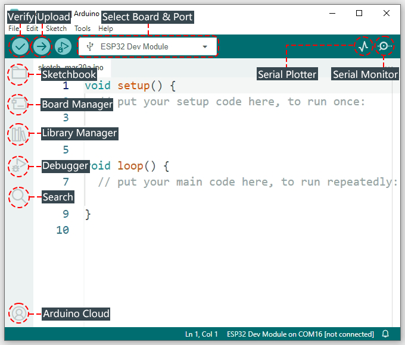
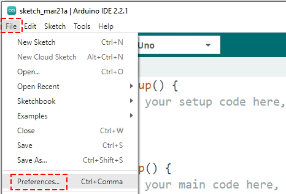
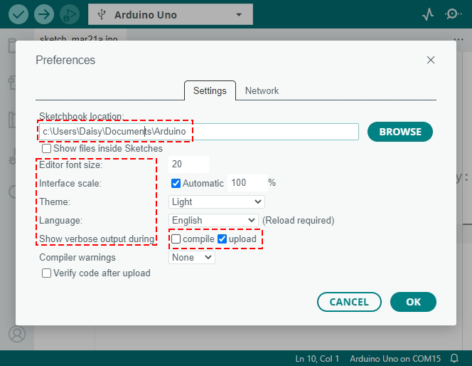

.. note::

    Hello, welcome to the SunFounder Raspberry Pi & Arduino & ESP32 Enthusiasts Community on Facebook! Dive deeper into Raspberry Pi, Arduino, and ESP32 with fellow enthusiasts.

    **Why Join?**

    - **Expert Support**: Solve post-sale issues and technical challenges with help from our community and team.
    - **Learn & Share**: Exchange tips and tutorials to enhance your skills.
    - **Exclusive Previews**: Get early access to new product announcements and sneak peeks.
    - **Special Discounts**: Enjoy exclusive discounts on our newest products.
    - **Festive Promotions and Giveaways**: Take part in giveaways and holiday promotions.

    👉 Ready to explore and create with us? Click [|link_sf_facebook|] and join today!

1.5 Discovering the Arduino Playground (IDE)
==============================================

Introduce the Arduino IDE
---------------------------

Welcome to the Arduino IDE, your special tool for creating cool electronics projects. This program is where you write the instructions, also known as code, that tells your Arduino what to do.

Here are some of the things you can do with the Arduino IDE:

* **Verify / Upload**: These check your code and send it to the Arduino board.
* **Select Board & Port**: This helps your computer find your Arduino board. It shows where your board is connected so your code goes to the right place.
* **Sketchbook**: A place to find all your previous codes and projects.
* **Boards Manager**: Adds new Arduino boards for coding.
* **Library Manager**: Offers additional code for more functions in your projects.
* **Debugger:** Assists in fixing code issues.
* **Search**: Quickly locate specific code segments.
* **Serial Monitor**: Opens the serial monitor for communicating with the Arduino board.
* **Serial Plotter**: Creates graphs from data, like light levels.

For more detailed information about these features, please refer to |link_docs_ide|.

Basic Settings
----------------

Next, let's peek into the Arduino IDE's basic settings. In the menu bar at the top, click on **File**, then find and click on **Preferences**.

.. raw:: html

     

First up, you'll see the default location for storing your projects, known as sketches. These sketches live in a place called the sketchbook. You can choose to keep the default location or pick a spot that works best for you.

.. raw:: html

     

Then, feel free to tweak the Arduino IDE to your liking:

* Adjust **font sizes**, **interface scale**, **themes**, and even the **language** displayed.
* In **Show verbose output during**, check **compile** or **upload** to get detailed feedback on errors during these processes.

Customize the Arduino IDE to make it as comfortable as possible for you. Once you're happy with your settings, click **OK** to save them.

Congratulations! You've successfully installed and configured the Arduino IDE. You've taken an important first step into the world of Arduino programming.
