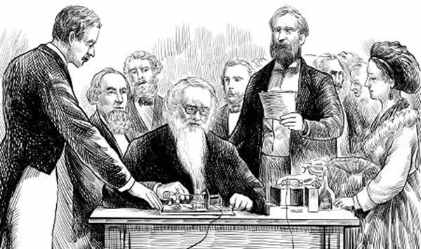
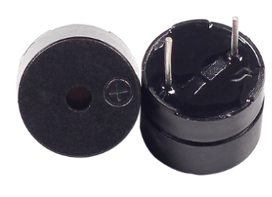
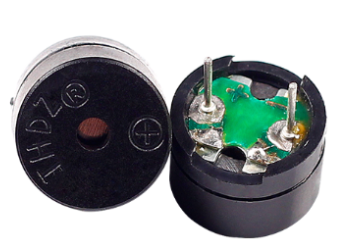

.. note::

    こんにちは！SunFounderのRaspberry Pi & Arduino & ESP32 Enthusiasts Communityへようこそ！Facebookで仲間と一緒にRaspberry Pi、Arduino、ESP32についてもっと深く学びましょう。

    **参加のメリット**

    - **エキスパートサポート**: アフターセールスの問題や技術的な課題をコミュニティやチームの助けを借りて解決。
    - **学びと共有**: スキルを向上させるためのヒントやチュートリアルを交換しましょう。
    - **独占プレビュー**: 新製品発表やプレビューをいち早くチェック。
    - **特別割引**: 最新製品に関する特別割引をお楽しみください。
    - **フェスティブプロモーションとプレゼント**: プレゼントやホリデープロモーションに参加しましょう。

    👉 さあ、私たちと一緒に新しいことを探求し、創造を楽しみましょう！[|link_sf_facebook|] をクリックして今すぐ参加してください！

.. _ar_morse_code:

10. モールス信号
===========================

モールス信号は、1840年代にサミュエル・モールスによって発明された、ドット（.）とダッシュ（-）を使った秘密の言語のようなものです。これは、電信を使って長距離のメッセージを送るために作られました。アルファベットの各文字や数字は、これらの信号のユニークな組み合わせで表されます。たとえば、最も有名なモールス信号のメッセージは「SOS」（··· ––– ···）で、これは国際的な助けを求める信号です。電話やインターネットが発明される前は、モールス信号は通信に不可欠なもので、特に船や飛行機の操縦士に人気がありました。今日では、友達に秘密のメッセージを送る方法として学ぶのも楽しいですよ！

.. raw:: html

    <video controls style = "max-width:90%">
        <source src="_static/video/10_morse_code.mp4" type="video/mp4">
        Your browser does not support the video tag.
    </video>

このレッスンでは、次のことを学びます:

* アクティブブザーの仕組みを理解する。
* モールス信号でSOS信号をコード化し、ブザーを使ってモールス信号を送信できるようになる。

モールス信号の魔法！
--------------------

ドットとダッシュだけを使って秘密のメッセージを送る方法を発明するなんて、想像してみてください！これは1836年にサミュエル・モールスがモールス信号でやったことです。もともとは画家だったモールスは、船旅の中でインスピレーションを得て、後に友人のアルフレッド・ベイルと共に、メッセージを電線で送るための電信機を作りました。

モールス信号では、ドット（短い信号）とダッシュ（長い信号）を使って文字や数字を表します。最初のモールス信号のメッセージは、「神のなされたこと」（What hath God wrought）で、1844年にワシントンD.C.からボルチモアへ送信され、電信時代の幕開けを告げました。

今日、モールス信号はあまり使われなくなりましたが、航空業界やアマチュア無線愛好家の間では今でも使われています。では、Arduinoとブザーを使ってモールス信号の仕組みを探り、このコミュニケーションの歴史の一片を楽しみましょう！

回路を作成する
-----------------------

**必要なコンポーネント**

.. list-table:: 
   :widths: 25 25 25 25
   :header-rows: 0

   * - 1 * Arduino Uno R3
     - 1 * アクティブブザー
     - 1 * ブレッドボード
     - ジャンパーワイヤー
   * - |list_uno_r3| 
     - |list_active_buzzer| 
     - |list_breadboard| 
     - |list_wire| 
   * - 1 * USBケーブル
     -
     - 
     - 
   * - |list_usb_cable| 
     -
     - 
     - 

**ステップバイステップの作成手順**

1. フロントに白いステッカーが貼られ、バックが密閉されたアクティブブザーを見つけましょう。

.. image:: img/7_beep_2.png

ブザーは電子音響デバイスとして、19世紀にさかのぼる豊かな歴史を持っています。現代のブザーの前身は、1831年にマイケル・ファラデーが電磁誘導を発見し、電磁ブザーの動作原理の基礎を形成したことに由来します。ファラデーの画期的な発見の後、多くの科学者や発明家が電磁理論を実用的なデバイスに応用する方法を模索しました。今日、ブザーはアクティブブザーとパッシブブザーに分類されます。

**アクティブブザー**

バックが密閉されたアクティブブザーは、電源が供給されると内部オシレーターが作動し、単一トーンのビープ音を発します。

**パッシブブザー**

バックが開いているパッシブブザーは、音を生成するためにマイクロコントローラーから外部周波数信号を必要とし、さまざまなトーンを生成できます。

1. アクティブブザーも極性デバイスです。フロントには正端子（アノード）を示す「+」マークがあり、これは長いピンでもあります。ブザーをブレッドボードに挿入し、アノードを15F、カソードを18Fの穴に挿入します。

.. image:: img/16_morse_code_buzzer.png
    :width: 500
    :align: center

2. カソードをArduino Uno R3のGNDピンに接続します。

.. image:: img/16_morse_code_gnd.png
    :width: 500
    :align: center

3. ブザーのアノードをArduino Uno R3の5Vピンに接続すると、アクティブブザーが直接音を発するのを聞くことができます。もちろん、この方法でブザーが正しいかどうかを確認することもできます。パッシブブザーは、電源に直接接続しても音を発しません。

.. image:: img/16_morse_code_5v.png
    :width: 500
    :align: center

4. 5Vピンに挿入されたワイヤを取り外し、Arduino Uno R3のピン9に挿入して、コードでブザーを制御できるようにします。

.. image:: img/16_morse_code.png
    :width: 500
    :align: center

コード作成 - ブザーを鳴らす
-----------------------------------------------
1. Arduino IDEを開き、「ファイル」メニューから「新規スケッチ」を選択して新しいプロジェクトを開始します。
2. スケッチを ``Lesson10_Beep`` として保存します（ ``Ctrl + S`` を押すか、「保存」をクリック）。

3. まず、 ``buzzerPin`` という定数を作成し、ピン9に設定します。

.. code-block:: Arduino
    :emphasize-lines: 1

    const int buzzerPin = 9;   // ブザー用の定数としてピン9を割り当てます

    void setup() {
        // ここに一度だけ実行されるセットアップコードを記述します
    }

4. ピンを初期化します。 ``void setup()`` 関数で、ブザーピンを出力モードに設定します。

.. code-block:: Arduino
    :emphasize-lines: 5

    const int buzzerPin = 9;   // ブザー用の定数としてピン9を割り当てます

    void setup() {
        // ここに一度だけ実行されるセットアップコードを記述します
        pinMode(buzzerPin, OUTPUT);  // ピン9を出力に設定
    }

5. アクティブブザーを鳴らすには、LEDを点灯させるのと同じくらい簡単です。ピン9をハイまたはローに設定し、「digitalWrite()」と「delay()」を使ってタイミングを制御します。

.. code-block:: Arduino
    :emphasize-lines: 10-13

    const int buzzerPin = 9;   // ブザー用の定数としてピン9を割り当てます

    void setup() {
        // ここに一度だけ実行されるセットアップコードを記述します
        pinMode(buzzerPin, OUTPUT);  // ピン9を出力に設定
    }

    void loop() {
        // ここに繰り返し実行されるメインコードを記述します
        digitalWrite(buzzerPin, HIGH);  // ブザーをONにする
        delay(250);                     // ビープ音の長さ：250ミリ秒
        digitalWrite(buzzerPin, LOW);   // ブザーをOFFにする
        delay(250);                     // 信号間の間隔：250ミリ秒
    }

6. コードをArduino Uno R3にアップロードすると、「ビープビープ」という音が聞こえるはずです。

コード作成 - "SOS"
--------------------------
次に、モールス信号でブザーを鳴らすコードを書きます。

モールス信号では、メッセージが正確に受信され理解されるために、ドット（短い信号）、ダッシュ（長い信号）、および信号間の間隔に関する伝統的なタイミングルールがあります。基本的なルールは次のとおりです：

    * ドットの長さ：基本単位の時間。
    * ダッシュの長さ：ドットの3倍。
    * ドット間の間隔：ドット1つ分の長さ。
    * 文字内の間隔（文字や数字のドットとダッシュの間）：ドット1つ分の長さ。
    * 文字間の間隔（例：2つの文字の間）：ドット3つ分の長さ。
    * 単語間の間隔（例：2つの単語の間）：ドット7つ分の長さ。

1. Arduino IDEを開き、「ファイル」メニューから「新規スケッチ」を選択して新しいプロジェクトを開始します。
2. スケッチを ``Lesson10_Morse_Code`` として保存します ``Ctrl + S`` を押すか、「保存」をクリック）。

3. まず、ブザーに接続されているピンを初期化します。

.. code-block:: Arduino
    :emphasize-lines: 5

    const int buzzerPin = 9;   // ブザー用の定数としてピン9を割り当てます

    void setup() {
        // ここに一度だけ実行されるセットアップコードを記述します
        pinMode(buzzerPin, OUTPUT);  // ピン9を出力に設定
    }

4. 次に、ドット（短い信号）を出力するための関数を作成しましょう。これまでのコーディングで ``pinMode()`` 、 ``digitalWrite()`` 、 ``delay()`` などのArduinoの組み込み関数を使ってきましたが、今回はカスタム関数を作成します。カスタム関数を作成することで、コードを簡潔かつ論理的に整理しやすくなります。

関数を作成するには、スケッチの ``void loop()`` ブレースの後に追加します。 ``void setup()`` や ``void loop()`` と同様に、関数は「void」から始まり、その後に任意の名前が続きます。関数の命名ルールは、変数や定数と同じです。Arduino IDEでキーワードでない名前を選び、そのコマンドを波括弧で囲みます。

.. code-block:: Arduino
    :emphasize-lines: 9,10

    void loop() {
        // put your main code here, to run repeatedly:
        digitalWrite(buzzerPin, HIGH);  // Turn buzzer ON
        delay(250);                     // Beep duration: 250 milliseconds
        digitalWrite(buzzerPin, LOW);   // Turn buzzer OFF
        delay(250);                     // Interval between signals: 250 milliseconds
    }

    void dot() {
    }

5. 作成した関数 `void dot()` で、ドットの時間間隔を250ミリ秒に設定します。

.. code-block:: Arduino
    :emphasize-lines: 9-14

    void loop() {
        // put your main code here, to run repeatedly:
        digitalWrite(buzzerPin, HIGH);  // Turn buzzer ON
        delay(250);                     // Beep duration: 250 milliseconds
        digitalWrite(buzzerPin, LOW);   // Turn buzzer OFF
        delay(250);                     // Interval between signals: 250 milliseconds
    }

    void dot() {
        digitalWrite(buzzerPin, HIGH);
        delay(250);  // Short duration for a dot
        digitalWrite(buzzerPin, LOW);
        delay(250);  // Interval between signals
    }

6. 次に、ダッシュ（長い信号）を出力する関数を作成します。モールス信号の基本ルールに従い、ダッシュの時間間隔をドットの3倍（750ミリ秒）に設定します。

.. code-block:: Arduino
    :emphasize-lines: 8-13

    void dot() {
        digitalWrite(buzzerPin, HIGH);
        delay(250);  // Short duration for a dot
        digitalWrite(buzzerPin, LOW);
        delay(250);  // Interval between signals
    }

    void dash() {
        digitalWrite(buzzerPin, HIGH);
        delay(750);  // ダッシュの長い時間
        digitalWrite(buzzerPin, LOW);
        delay(250);  // 信号間の間隔
    }

7. これでモールス信号を送信できます。例えば、 "SOS" (... --- ...) を送信するには、モールス信号の'S'は3つのドット、'O'は3つのダッシュで構成されるので、ドットとダッシュの関数をそれぞれ3回呼び出すだけです。

.. code-block:: Arduino
    :emphasize-lines: 2-11

    void loop() {
        dot();
        dot();
        dot();  // S: ...
        dash();
        dash();
        dash();  // O: ---
        dot();
        dot();
        dot();       // S: ...
        delay(750);  // 一定期間後に繰り返し
    }

8. これが完成したコードです。「アップロード」をクリックしてコードをArduino Uno R3にアップロードすると、「SOS」（... --- ...）のモールス信号が聞こえるはずです。

.. code-block:: Arduino

    const int buzzerPin = 9;   // ブザー用の定数としてピン9を割り当てます
    
    void setup() {
        // ここに一度だけ実行されるセットアップコードを記述します
        pinMode(buzzerPin, OUTPUT);  // ピン9を出力に設定
    }

    void loop() {
        dot();
        dot();
        dot();  // S: ...
        dash();
        dash();
        dash();  // O: ---
        dot();
        dot();
        dot();       // S: ...
        delay(750);  // 一定期間後に繰り返し
    }

    void dot() {
        digitalWrite(buzzerPin, HIGH);
        delay(250);  // ドットの短い時間
        digitalWrite(buzzerPin, LOW);
        delay(250);  // 信号間の間隔
    }

    void dash() {
        digitalWrite(buzzerPin, HIGH);
        delay(750);  // ダッシュの長い時間
        digitalWrite(buzzerPin, LOW);
        delay(250);  // 信号間の間隔
    }

9. 最後に、コードを保存し、作業スペースを整理することを忘れないでください。

**まとめ**

このレッスンでは、1840年代にサミュエル・モールスによって開発されたユニークな通信方法であるモールス信号の基本について学びました。また、アクティブブザーを使用して、世界的に認識されているSOSのモールス信号を送信する方法を学びました。このレッスンでは、アクティブブザーの設定とコーディング方法だけでなく、モールス信号が通信史において果たした歴史的な役割についても理解を深めました。これらのスキルを使って、友達にモールス信号で秘密のメッセージを送ったり、現代のデバイスでの応用をさらに探求することができます。

このレッスンでは、「S」と「O」のモールス信号のみを使用しました。以下は、モールス信号の26文字のアルファベットと10個の数字のチャートです。

.. list-table::
    :widths: 8 8 8 8 8 8 8 8
    :header-rows: 1

    * - 文字
      - コード
      - 文字
      - コード
      - 文字
      - コード
      - 文字
      - コード
    * - A
      - \.-
      - B
      - \-...
      - C
      - \-.\-.
      - D
      - \-..
    * - E
      - \.
      - F
      - \..-.
      - G
      - \-\-.
      - H
      - \....
    * - I
      - \..
      - J
      - \.\-\-\-
      - K
      - \-.-
      - L
      - \.-..
    * - M
      - \--
      - N
      - \-.
      - O
      - \-\-\-
      - P
      - \.-\-.
    * - Q
      - \-\-.-
      - R
      - \.-.
      - S
      - \...
      - T
      - \-
    * - U
      - \..-
      - V
      - \...-
      - W
      - \.-\-
      - X
      - \-..-
    * - Y
      - \-.-\-
      - Z
      - \-\-..
      - 1
      - \.\-\-\-\-
      - 2
      - \..\-\-\-
    * - 3
      - \...-\-
      - 4
      - \....-
      - 5
      - \.....
      - 6
      - \-....
    * - 7
      - \-\-...
      - 8
      - \-\-\-..
      - 9
      - \-\-\-\-.
      -
      -
  

**質問**

提供されたモールス信号の表を使って、「Hello」を送信するコードを書いてください。

