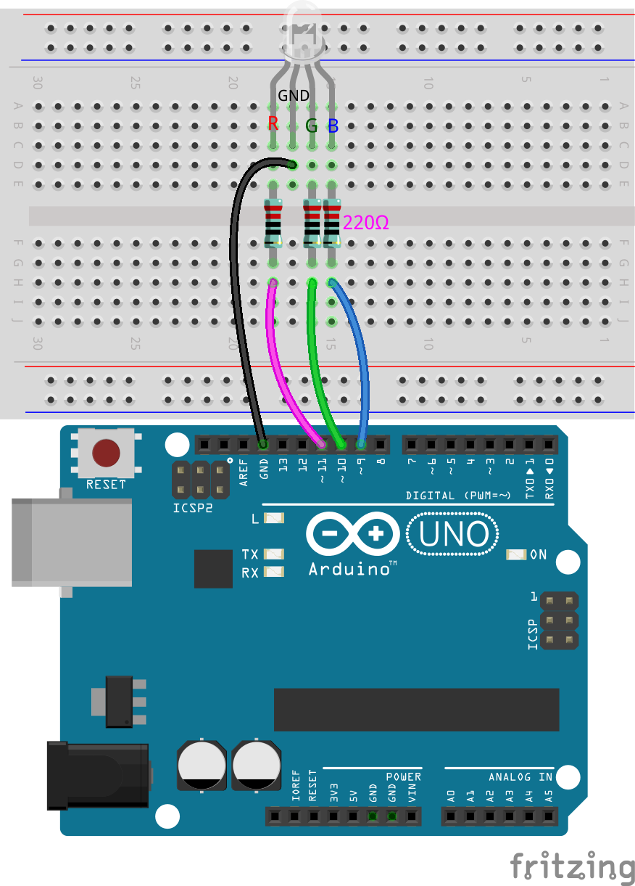
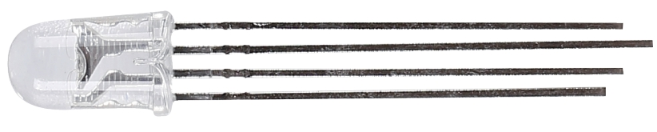
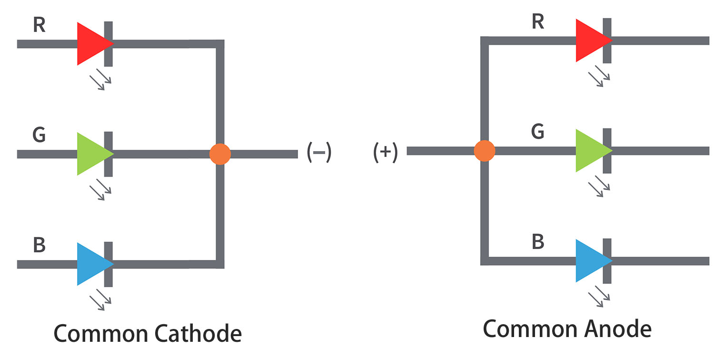
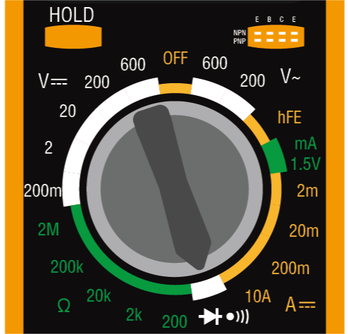
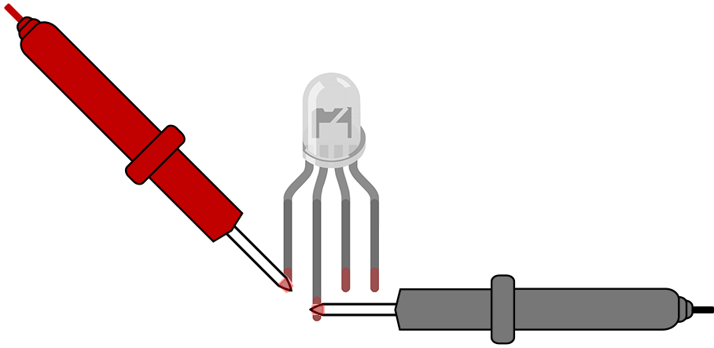
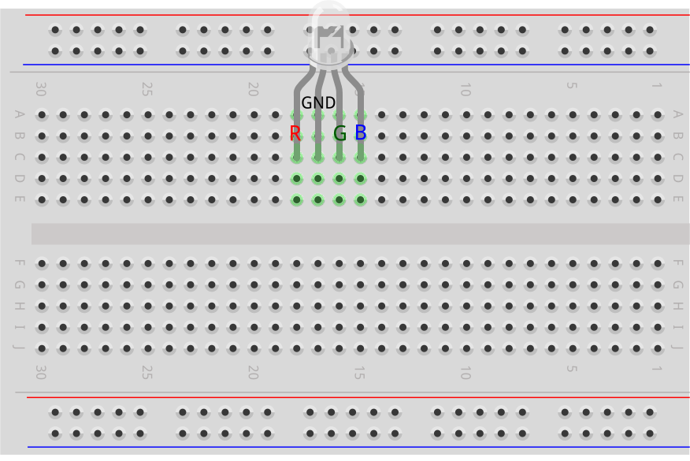
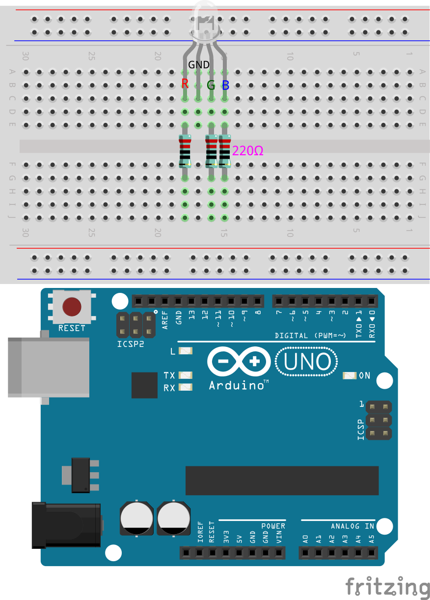
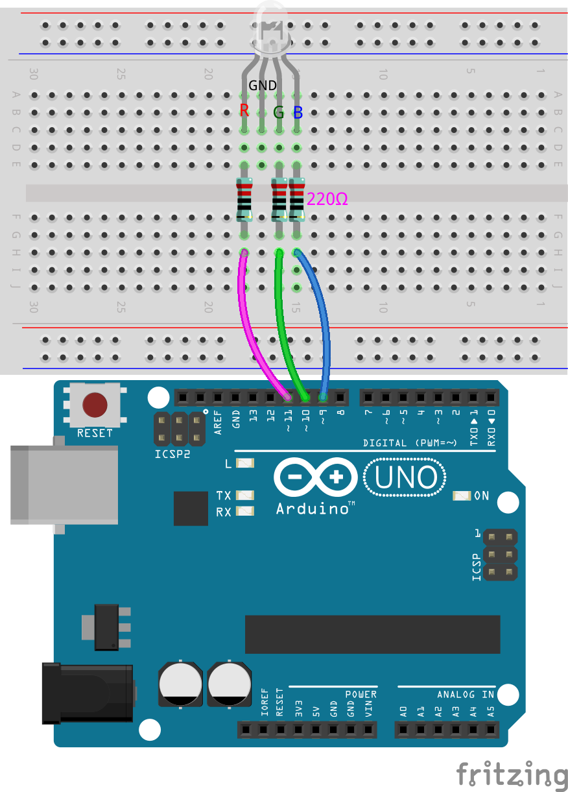
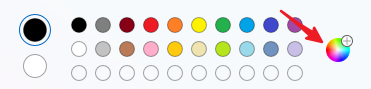
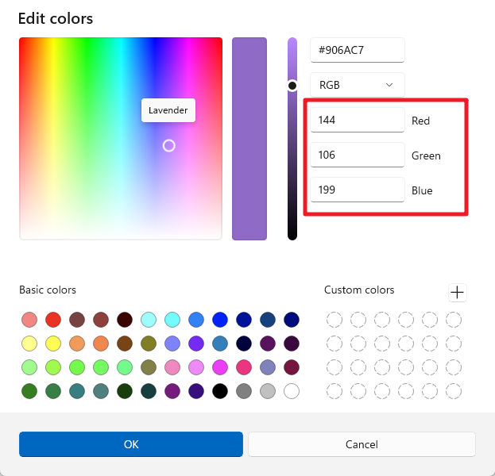

.. note::

    Hello, welcome to the SunFounder Raspberry Pi & Arduino & ESP32 Enthusiasts Community on Facebook! Dive deeper into Raspberry Pi, Arduino, and ESP32 with fellow enthusiasts.

    **Why Join?**

    - **Expert Support**: Solve post-sale issues and technical challenges with help from our community and team.
    - **Learn & Share**: Exchange tips and tutorials to enhance your skills.
    - **Exclusive Previews**: Get early access to new product announcements and sneak peeks.
    - **Special Discounts**: Enjoy exclusive discounts on our newest products.
    - **Festive Promotions and Giveaways**: Take part in giveaways and holiday promotions.

    👉 Ready to explore and create with us? Click [|link_sf_facebook|] and join today!

11. The Colors of the Rainbow
=======================================
Imagine if you could paint with light, blending red, green, and blue to create every hue imaginable—just like mixing paints on a palette but with beams of light.

.. .. image:: img/12_rgb_mix.png
..     :width: 300
..     :align: center

.. raw:: html

    <video width="600" loop autoplay muted>
        <source src="_static/video/11_rainbow_color.mp4" type="video/mp4">
        Your browser does not support the video tag.
    </video>

Welcome to this lesson, where you will explore the captivating world of RGB LEDs and discover how the combination of primary colors can create a vibrant spectrum of hues. This hands-on course will guide you through the principles of RGB LED functionality and introduce you to the practical applications of programming and circuit building.

In this lesson, you will learn:

* Understand the operational principles of RGB LEDs.
* Learn to create and utilize functions in your code to simplify tasks and enhance readability.
* Explore the impact of different color combinations by manipulating the RGB LED.
* Learn to use Pulse Width Modulation (PWM) for nuanced color mixing with RGB LED.
* Enhance your coding efficiency and clarity by creating functions that take parameters in Arduino.

Building the Circuit
-----------------------

**Components Needed**

.. list-table:: 
   :widths: 25 25 25 25
   :header-rows: 0

   * - 1 * Arduino Uno R3
     - 1 * RGB LED
     - 3 * 220Ω Resistor
     - Jumper Wires
   * - |components_uno_r3| 
     - |components_rgb_led| 
     - |components_220ohm| 
     - |components_wire| 
   * - 1 * USB Cable
     - 1 * Breadboard
     - 1 * Multimeter
     -
   * - |components_usb_cable| 
     - |components_breadboard| 
     - |components_meter|
     -
     
**Step-by-Step Building Instructions**

Follow the wiring diagram or these steps to construct the circuit.

1. Start with an RGB LED.

RGB LEDs emit light in various colors by integrating red, green, and blue LEDs within a single package. By varying the voltage input on the three pins, these LEDs can combine to produce up to 16,777,216 different colors.

Depending on their design, RGB LEDs can be either common anode or common cathode. For this project, we use a **common cathode** RGB LED, where all three LEDs share a negative connection.

* Common cathode RGB LEDs have a shared negative connection.
* Common anode RGB LEDs have a shared positive connection.

An RGB LED typically has 4 pins; the longest one is the ground. When placing the RGB LED, ensure the longest lead is second from the left, configuring the pins as Red, GND, Green, and Blue from left to right.

.. image:: img/12_mix_color_rgb_1.jpg
    :width: 200
    :align: center

You can also use a multimeter in Diode Test mode to identify the color each pin emits.

Set the multimeter to the **Continuity** setting for resistance measurement.

Touch the black lead of the multimeter to the RGB LED's longest pin, and touch the red lead to the other pins individually. You will see the RGB LED light up in red, green, or blue accordingly.

2. Insert the RGB LED into the breadboard with the longest pin going into hole 17D, and the other three pins into 18D, 16D, and 15D, respectively.

3. Insert three 220ohm resistors as shown from holes 15E to 15G, 16E to 16G, and 18E to 18G.

4. Connect these resistors to pins 9, 10, and 11 on the Arduino Uno R3 with jumper wires as illustrated.

5. Connect the longest pin of the RGB LED to breadboard's negative rail using a jumper wire.

Code Creation - Lighting Up an RGB LED
----------------------------------------
1. Open the Arduino IDE and start a new project by selecting “New Sketch” from the “File” menu.
2. Save your sketch as ``Lesson11_Rainbow_Color`` using ``Ctrl + S`` or by clicking “Save”.

3. Create three variables to store the three pins of the RGB LED and set them as OUTPUT.

.. code-block:: Arduino
    :emphasize-lines: 3-5

    const int redPin = 11;
    const int greenPin = 10;
    const int bluePin = 9;

    void setup() {
        // put your setup code here, to run once:
        pinMode(bluePin, OUTPUT);   // Set Blue pin of RGB LED as output
        pinMode(greenPin, OUTPUT);  // Set Green pin of RGB LED as output
        pinMode(redPin, OUTPUT);  // Set Red pin of RGB LED as output
    }

    void loop() {
        // put your main code here, to run repeatedly:
    }

4. Now in the ``void loop()`` set the RGB LED's red pin to ``HIGH``, and the other two pins to ``LOW``.

.. note::

    Since we are using PWM pins 9, 10, and 11, you have the option to use either ``digitalWrite()`` or ``analogWrite()`` to output a high or low level. 
    
    For this lesson, as we are simply setting the pins to high or low, we'll use ``digitalWrite()``.

.. code-block:: Arduino
    :emphasize-lines: 10-12

    void setup() {
        // put your setup code here, to run once:
        pinMode(bluePin, OUTPUT);   // Set Blue pin of RGB LED as output
        pinMode(greenPin, OUTPUT);  // Set Green pin of RGB LED as output
        pinMode(redPin, OUTPUT);  // Set Red pin of RGB LED as output
    }

    void loop() {
        // put your main code here, to run repeatedly:
        digitalWrite(bluePin, LOW);    // Turn off the Blue pin of RGB LED
        digitalWrite(greenPin, LOW);   // Turn off the Green pin of RGB LED
        digitalWrite(redPin, HIGH);  // Turn on the Red pin of RGB LED
    }

5. Save the code and click “Upload” to send it to your Arduino Uno R3. Let's see what happens.

6. You will see the RGB LED light up red. But what if you want to light up green and blue too? How should you modify the code?

Now copy the three ``digitalWrite()`` commands twice more. Set the pin you want to display as ``HIGH`` and the others as ``LOW``. Each color lighting up should be given a second to shine.

.. code-block:: Arduino
    :emphasize-lines: 14-21

    const int redPin = 11;
    const int greenPin = 10;
    const int bluePin = 9;

    void setup() {
        // put your setup code here, to run once:
        pinMode(bluePin, OUTPUT);   // Set Blue pin of RGB LED as output
        pinMode(greenPin, OUTPUT);  // Set Green pin of RGB LED as output
        pinMode(redPin, OUTPUT);  // Set Red pin of RGB LED as output
    }

    void loop() {
        // put your main code here, to run repeatedly:
        digitalWrite(bluePin, LOW);    // Turn off the Blue pin of RGB LED
        digitalWrite(greenPin, LOW);   // Turn off the Green pin of RGB LED
        digitalWrite(redPin, HIGH);  // Turn on the Red pin of RGB LED
        delay(1000);              //Wait for 1 second
        digitalWrite(bluePin, LOW);    // Turn off the Blue pin of RGB LED
        digitalWrite(greenPin, HIGH);  // Turn on the Green pin of RGB LED
        digitalWrite(redPin, LOW);   // Turn off the Red pin of RGB LED
        delay(1000);              //Wait for 1 second
        digitalWrite(bluePin, HIGH);   // Turn on the Blue pin of RGB LED
        digitalWrite(greenPin, LOW);   // Turn off the Green pin of RGB LED
        digitalWrite(redPin, LOW);   // Turn off the Red pin of RGB LED
        delay(1000);              //Wait for 1 second
    }

7. Upload the code again to see the effects. You will find the RGB LED cycles through red, green, and blue.

**Questions**:

1. If you want other colors, what should you do? Refer to the diagram below and fill in your ideas in your handbook.

.. image:: img/12_rgb_mix.png
    :width: 300
    :align: center

.. list-table::
   :widths: 20 20 20 20
   :header-rows: 1

   * - Color
     - Red Pin
     - Green Pin
     - Blue Pin
   * - Red
     - *HIGH*
     - *LOW*
     - *LOW*
   * - Green
     - *LOW*
     - *HIGH*
     - *LOW*
   * - Blue
     - *LOW*
     - *LOW*
     - *HIGH*
   * - Yellow
     -
     -
     -
   * - Pink
     -
     -
     -
   * - Cyan
     - 
     -
     -
   * - White
     -
     -
     -

Code Creation - Displaying Colors
------------------------------------

In our journey to master the control of RGB LEDs, we've seen how using ``digitalWrite()`` can light up the LED in basic colors. To further explore and unlock the full spectrum of colors that an RGB LED can produce, we'll now delve into using ``analogWrite()`` to send PWM (Pulse Width Modulation) signals, allowing us to achieve a wide range of hues.

Let's see how we can implement this with code.

1. Open the Arduino IDE and start a new project by selecting “New Sketch” from the “File” menu.
2. Save your sketch as ``Lesson11_PWM_Color_Mixing`` using ``Ctrl + S`` or by clicking “Save”.

3. Create three variables to store the three pins of the RGB LED and set them as OUTPUT.

.. code-block:: Arduino
    :emphasize-lines: 3-5

    const int redPin = 11;
    const int greenPin = 10;
    const int bluePin = 9;

    void setup() {
        // Set up code to run once:
        pinMode(bluePin, OUTPUT);   // Set Blue pin of RGB LED as output
        pinMode(greenPin, OUTPUT);  // Set Green pin of RGB LED as output
        pinMode(redPin, OUTPUT);  // Set Red pin of RGB LED as output
    }

4. Use ``analogWrite()`` to send PWM values to the RGB LED. From Lesson 9, we know that PWM values can change an LED's brightness, and the PWM range is 0-255. To display red, we set the PWM value of the RGB LED's red pin to 255, and the other two pins to 0.

.. code-block:: Arduino
    :emphasize-lines: 14-16

    const int redPin = 11;
    const int greenPin = 10;
    const int bluePin = 9;

    void setup() {
        // Set up code to run once:
        pinMode(bluePin, OUTPUT);   // Set Blue pin of RGB LED as output
        pinMode(greenPin, OUTPUT);  // Set Green pin of RGB LED as output
        pinMode(redPin, OUTPUT);  // Set Red pin of RGB LED as output
    }

    void loop() {
        // Main code to run repeatedly:
        analogWrite(bluePin, 0);    // Set the PWM value of Blue pin to 0
        analogWrite(greenPin, 0);   // Set the PWM value of Green pin to 0
        analogWrite(redPin, 255);  // Set the PWM value of Red pin to 255
    }

5. With this setup, after uploading the code to the Arduino Uno R3, you will see the RGB LED display red.

6. The ``analogWrite()`` function allows the RGB LED to display not only the seven basic colors but many other different hues. Now you can adjust the values of pins 9, 10, and 11 separately, and record the observed colors in your handbook.

.. list-table::
    :widths: 20 20 20 40
    :header-rows: 1

    *   - Red Pin    
        - Green Pin  
        - Blue Pin
        - Color
    *   - 0
        - 128
        - 128
        - 
    *   - 128
        - 0
        - 255
        - 
    *   - 128
        - 128
        - 255
        - 
    *   - 255
        - 128
        - 0
        -     

Code Creation - Parameterized Functions
------------------------------------------------

Using the ``analogWrite()`` function to display different colors can make your code lengthy if you want to display many colors simultaneously. Therefore, we need to create functions.

Unlike the previous lesson, we are preparing to create a function with parameters. 

A parameterized function allows you to pass specific values into the function, which can then use these values to perform its tasks. This is incredibly useful for adjusting properties like color intensity on the fly. It makes your code more flexible and easier to read.

When defining a parameterized function, you specify what values it needs to operate through parameters listed in parentheses right after the function name. These parameters act like placeholders that get replaced by actual values when the function is called.

Here's how to define a parameterized function for setting the color of an RGB LED:

1. Open the sketch you saved earlier, ``Lesson11_PWM_Color_Mixing``. Hit “Save As...” from the “File” menu, and rename it to ``Lesson11_PWM_Color_Mixing_Function``. Click "Save".

2. Start by declaring the function after the ``void loop()`` with the keyword ``void``, followed by the function name and parameters in parentheses. For our ``setColor`` function, we'll use three parameters— ``red``, ``green``, and ``blue``—each representing the intensity of the corresponding color component of the RGB LED.

.. code-block:: Arduino
    :emphasize-lines: 5,6

    void loop() {
        // put your main code here, to run repeatedly:
    }

    void setColor(int red, int green, int blue) {
    }

   
3. Within the function body, use the ``analogWrite()`` command to send PWM signals to the RGB LED pins. The values passed to ``setColor`` will determine the brightness of each color. The parameters ``red``, ``green``, and ``blue`` are used here to directly control the intensity of each LED pin.

.. code-block:: Arduino

    // Function to set the color of the RGB LED
    void setColor(int red, int green, int blue) {
        // Write PWM value for red, green, and blue to the RGB LED
        analogWrite(redPin, red);
        analogWrite(greenPin, green);
        analogWrite(bluePin, blue);
    }

4. Now you can call your newly created ``setColor()`` function in the ``void loop()``. Since you created a function with parameters, you need to fill in the arguments in the ``()`` such as ``(255, 0, 0)``. Remember to write comments.

.. code-block:: Arduino
    :emphasize-lines: 3

    void loop() {
        // put your main code here, to run repeatedly:
        setColor(255, 0, 0); // Display red color
    }

    // Function to set the color of the RGB LED
    void setColor(int red, int green, int blue) {
        // Write PWM value for red, green, and blue to the RGB LED
        analogWrite(redPin, red);
        analogWrite(greenPin, green);
        analogWrite(bluePin, blue);
    }

5. We already know that by providing different values to the three pins of the RGB LED, we can light up different colors of light. So, how do we make the RGB LED light up exactly the color we want? This requires the aid of a color palette. Open **Paint** (this software comes with Windows) or any drawing software on your personal computer.

6. Choose a color you like, record its RGB values.

.. note::

    Note that before you select a color, adjust the lumens to the proper position.

7. Fill in the color you selected into the ``setColor()`` function in the ``void loop()``, use the ``delay()`` function to specify the display time for each color.

.. code-block:: Arduino

    void loop() {
        // put your main code here, to run repeatedly:
        setColor(255, 0, 0);      // Display red color
        delay(1000);              // Wait for 1 second
        setColor(0, 128, 128);    // Display teal color
        delay(1000);              // Wait for 1 second
        setColor(128, 0, 255);    // Display purple color
        delay(1000);              // Wait for 1 second
        setColor(128, 128, 255);  // Display Light blue color
        delay(1000);              // Wait for 1 second
        setColor(255, 128, 0);    // Display orange color
        delay(1000);              // Wait for 1 second
    }

8. Below is the complete code; you can click "Upload" to upload the code to the Arduino Uno R3 to see the effects.

.. code-block:: Arduino

    const int redPin = 11;
    const int greenPin = 10;
    const int bluePin = 9;

    void setup() {
        // put your setup code here, to run once:
        pinMode(bluePin, OUTPUT);   // Set Blue pin of RGB LED as output
        pinMode(greenPin, OUTPUT);  // Set Green pin of RGB LED as output
        pinMode(redPin, OUTPUT);  // Set Red pin of RGB LED as output
    }

    void loop() {
        // put your main code here, to run repeatedly:
        setColor(255, 0, 0);      // Display red color
        delay(1000);              // Wait for 1 second
        setColor(0, 128, 128);    // Display teal color
        delay(1000);              // Wait for 1 second
        setColor(128, 0, 255);    // Display purple color
        delay(1000);              // Wait for 1 second
        setColor(128, 128, 255);  // Display Light blue color
        delay(1000);              // Wait for 1 second
        setColor(255, 128, 0);    // Display orange color
        delay(1000);              // Wait for 1 second
    }

    // Function to set the color of the RGB LED
    void setColor(int red, int green, int blue) {
        // Write PWM value for red, green, and blue to the RGB LED
        analogWrite(redPin, red);
        analogWrite(greenPin, green);
        analogWrite(bluePin, blue);
    }

9. Finally, remember to save your code and tidy up your workspace.

**Summary**

Through a series of coding exercises, you will write sketches that dynamically change the color of the RGB LED. Starting with basic commands to control each color, you will then refactor your code to use functions, making your setup more modular and maintainable. This approach not only makes the code cleaner but also teaches you about the importance of function in programming.

