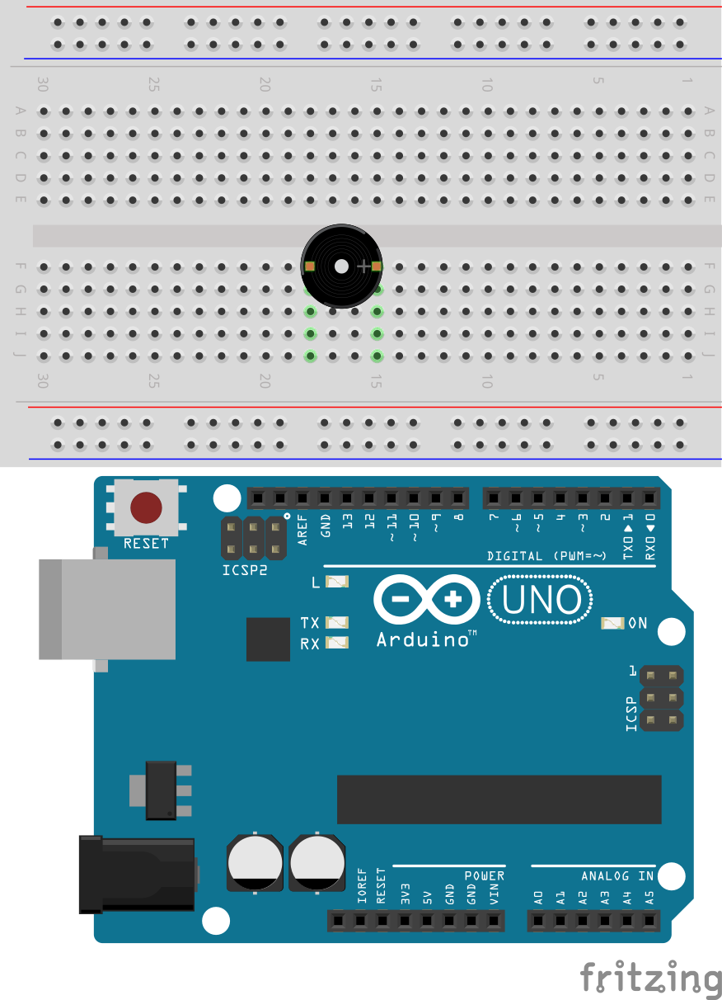
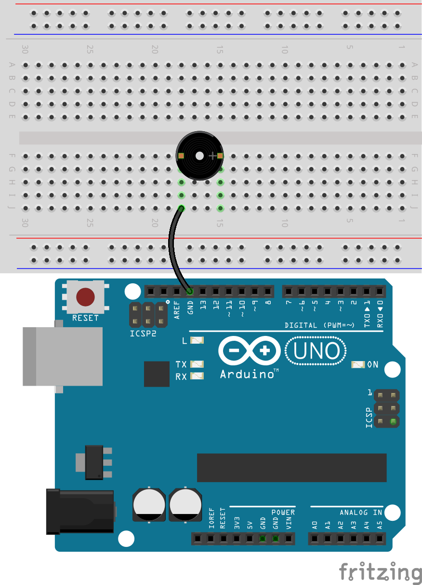
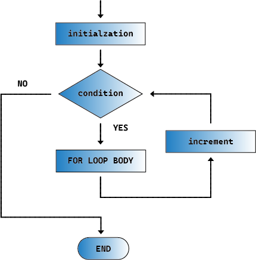

.. note::

    Hallo, willkommen in der SunFounder Raspberry Pi & Arduino & ESP32 Enthusiasten-Community auf Facebook! Tauche tiefer in die Welt von Raspberry Pi, Arduino und ESP32 ein, gemeinsam mit anderen Enthusiasten.

    **Warum beitreten?**

    - **Expertenunterstützung**: Lösen Sie Probleme nach dem Kauf und technische Herausforderungen mit Hilfe unserer Community und unseres Teams.
    - **Lernen & Teilen**: Tauschen Sie Tipps und Tutorials aus, um Ihre Fähigkeiten zu verbessern.
    - **Exklusive Vorschauen**: Erhalten Sie frühzeitigen Zugang zu neuen Produktankündigungen und exklusiven Einblicken.
    - **Spezielle Rabatte**: Genießen Sie exklusive Rabatte auf unsere neuesten Produkte.
    - **Festliche Aktionen und Gewinnspiele**: Nehmen Sie an Gewinnspielen und festlichen Aktionen teil.

    👉 Bereit, mit uns zu entdecken und zu erschaffen? Klicken Sie auf [|link_sf_facebook|] und treten Sie noch heute bei!

.. _ar_siren_sound:

12. Sirenensound
=========================

In diesem Arduino-Projekt werden wir erforschen, wie man durch Programmierung und Integration von elektronischer Hardware ein Sirenensystem erstellt.

Sirenenklänge verwenden ein bestimmtes Frequenz- und Tonmuster, das durch schnelle Anstiege und Abfälle in der Tonhöhe gekennzeichnet ist, was sie nicht nur leicht erkennbar, sondern auch unverwechselbar von anderen Alltagsgeräuschen macht.
Diese Tonhöhenänderungen können ein Gefühl der Dringlichkeit hervorrufen, da sie oft mit Warnsignalen oder gefährlichen Situationen in der Natur in Verbindung gebracht werden.

Durch das Anpassen der Frequenz eines passiven Buzzers können wir die charakteristischen auf- und absteigenden Tonhöhen eines Sirenensounds simulieren.

.. raw:: html

    <video controls style = "max-width:90%">
        <source src="_static/video/12_siren_sound.mp4" type="video/mp4">
        Ihr Browser unterstützt das Video-Tag nicht.
    </video>

In dieser Lektion lernen Sie:

* Wie passive Buzzer funktionieren
* Wie man einen passiven Buzzer mit der tone()-Funktion ansteuert
* Wie man die for-Schleife in der Programmierung verwendet
* Wie man einen Sirenensound implementiert

Verständnis der Klangeigenschaften
-----------------------------------------

Schall ist ein Wellenphänomen, das sich als Schwingungsenergie durch Medien wie Luft, Wasser oder feste Stoffe ausbreitet. Das Verständnis der physikalischen Eigenschaften von Schall hilft uns, besser zu verstehen und zu kontrollieren, wie sich Schall in verschiedenen Umgebungen verhält.
Hier sind einige wichtige physikalische Eigenschaften von Schall:

**Frequenz**

Die Frequenz bezieht sich auf die Anzahl der Schwingungszyklen pro Zeiteinheit, typischerweise in Hertz (Hz) angegeben.
Die Frequenz bestimmt die Tonhöhe des Schalls: Höhere Frequenzen klingen höher, niedrigere Frequenzen klingen tiefer. Der für den Menschen hörbare Bereich liegt ungefähr zwischen 20 Hz und 20.000 Hz.

**Amplitude**
Die Amplitude ist die Stärke der Schwingung einer Schallwelle und bestimmt die Lautstärke des Tons.
Eine größere Amplitude bedeutet einen lauteren Ton, eine kleinere Amplitude einen leiseren Ton.
In der Physik ist die Amplitude normalerweise direkt mit der Energie einer Schallwelle verbunden, während im alltäglichen Sprachgebrauch häufig Dezibel (dB) zur Beschreibung der Lautstärke verwendet werden.

**Klangfarbe**
Die Klangfarbe beschreibt die Textur oder den "Farbton" des Klangs, der es uns ermöglicht, Klänge von verschiedenen Quellen zu unterscheiden, selbst wenn sie die gleiche Tonhöhe und Lautstärke haben.
Zum Beispiel können wir, selbst wenn eine Geige und ein Klavier denselben Ton spielen, sie durch ihre Klangfarbe unterscheiden.

In diesem Projekt erforschen wir nur den Einfluss der Frequenz auf den Klang.

Schaltungsaufbau
-----------------------

**Benötigte Komponenten**

.. list-table:: 
   :widths: 25 25 25 25
   :header-rows: 0

   * - 1 * Arduino Uno R3
     - 1 * Steckbrett
     - 1 * Passiver Buzzer
     - Jumper-Kabel
   * - |list_uno_r3| 
     - |list_breadboard| 
     - |list_passive_buzzer| 
     - |list_wire| 
   * - 1 * USB-Kabel
     -
     - 
     - 
   * - |list_usb_cable| 
     -
     - 
     - 

**Schritt-für-Schritt Aufbau**

In den vorherigen Lektionen haben wir einen aktiven Buzzer verwendet. In dieser Lektion verwenden wir einen passiven Buzzer. Der Schaltkreis ist derselbe, aber die Programmierung zur Steuerung unterscheidet sich.

1. Finde einen passiven Buzzer, der eine freiliegende Platine auf der Rückseite hat.

.. image:: img/7_beep_2.png

2. Obwohl ein '+'-Zeichen auf dem passiven Buzzer ist, handelt es sich nicht um ein polarisiertes Bauteil. Setze es in beliebiger Richtung in die Löcher 15F und 18F des Steckbretts ein.

3. Verbinde einen Pin des passiven Buzzers mit dem GND-Pin des Arduino Uno R3.

4. Verbinde den anderen Pin des passiven Buzzers mit dem 5V-Pin des Arduino Uno R3. Der Buzzer wird keinen Ton von sich geben, was ihn von einem aktiven Buzzer unterscheidet, der bei dieser Verbindung einen Ton erzeugen würde.

5. Entferne nun das Kabel, das in den 5V-Pin gesteckt ist, und stecke es in den Pin 9 des Arduino Uno R3, damit der Buzzer per Code gesteuert werden kann.

.. image:: img/16_morse_code.png
    :width: 500
    :align: center

Codeerstellung - Passiven Buzzer zum Klingen bringen
--------------------------------------------------------

Wie wir beim Anschließen gelernt haben, reicht es nicht aus, einfach eine hohe und niedrige Spannung auf einen passiven Buzzer anzulegen, um ihn zum Klingen zu bringen. In der Arduino-Programmierung wird die Funktion ``tone()`` verwendet, um einen passiven Buzzer oder andere Audioausgabegeräte zu steuern und einen Ton mit einer bestimmten Frequenz zu erzeugen.

    * ``tone()``: Erzeugt eine Rechteckwelle mit der angegebenen Frequenz (und einem Tastverhältnis von 50%) auf einem Pin. Eine Dauer kann angegeben werden, andernfalls wird die Welle fortgesetzt, bis ein Aufruf an ``noTone()`` erfolgt.

    **Syntax**

        * ``tone(pin, frequency)``
        * ``tone(pin, frequency, duration)``

    **Parameter**

        * ``pin``: der Arduino-Pin, auf dem der Ton erzeugt wird.
        * ``frequency``: die Frequenz des Tons in Hertz. Erlaubte Datentypen: unsigned int.
        * ``duration``: die Dauer des Tons in Millisekunden (optional). Erlaubte Datentypen: unsigned long.

    **Rückgabewert**
        Nichts

1. Öffne die Arduino IDE und starte ein neues Projekt, indem du im Menü „Datei“ „Neues Sketch“ auswählst.
2. Speichere dein Sketch als ``Lesson12_Tone`` mit ``Strg + S`` oder durch Klicken auf „Speichern“.

3. Definiere zuerst den Buzzer-Pin.

.. code-block:: Arduino

    const int buzzerPin = 9;  // Weist Pin 9 der Konstante für den Buzzer zu

    void setup() {
        // Setup-Code, der einmal ausgeführt wird:
    }

4. Um die Verwendung der ``tone()``-Funktion vollständig zu verstehen, schreiben wir sie in die ``void setup()``, damit der Buzzer einen Ton mit einer bestimmten Frequenz für eine festgelegte Dauer erzeugt.

.. code-block:: Arduino
    :emphasize-lines: 5

    const int buzzerPin = 9;  // Weist Pin 9 der Konstante für den Buzzer zu

    void setup() {
        // Setup-Code, der einmal ausgeführt wird:
        tone(buzzerPin, 1000, 100);  // Schaltet den Buzzer bei 1000 Hz mit einer Dauer von 100 Millisekunden ein
    }

    void loop() {
        // Hauptcode, der wiederholt ausgeführt wird:
    }

5. Nun kannst du den Code auf das Arduino Uno R3 hochladen, und du wirst einen kurzen "Piep"-Ton vom passiven Buzzer hören, bevor er wieder still wird.

**Fragen**

1. Wenn Sie den Code und die Schaltungspins auf 7 oder 8 ändern, die keine PWM-Pins sind, wird der Buzzer dann trotzdem einen Ton erzeugen? Sie können dies testen und dann Ihre Antwort in das Handbuch schreiben.

2. Um zu erkunden, wie die ``frequency`` und ``duration`` in der Funktion ``tone(pin, frequency, duration)`` den Ton des Buzzers beeinflussen, ändern Sie bitte den Code unter zwei Bedingungen und tragen Sie die beobachteten Phänomene in Ihr Handbuch ein:

* Halten Sie ``frequency`` bei 1000 und erhöhen Sie ``duration`` schrittweise von 100 auf 500 und 1000. Wie verändert sich der Ton des Buzzers und warum?

* Halten Sie ``duration`` bei 100 und erhöhen Sie ``frequency`` schrittweise von 1000 auf 2000 und 5000. Wie verändert sich der Ton des Buzzers und warum?

Codeerstellung - Sirenenton erzeugen
-----------------------------------------

Wir haben zuvor gelernt, wie man einen Buzzer zum Tönen bringt, und verstanden, wie die Frequenz und die Dauer den Ton beeinflussen. Wenn wir nun möchten, dass der Buzzer einen Sirenenton erzeugt, der von tiefen zu hohen Tönen ansteigt, wie sollten wir vorgehen?

Aus unseren früheren Erkundungen wissen wir, dass die Verwendung der ``tone(pin, frequency)``-Funktion es ermöglicht, einen passiven Buzzer zum Tönen zu bringen. Eine allmähliche Erhöhung der ``frequency`` lässt den Ton des passiven Buzzers höher klingen. Lassen Sie uns dies nun im Code umsetzen.

1. Öffnen Sie das zuvor gespeicherte Sketch ``Lesson12_Tone``. Wählen Sie „Speichern unter...“ im Menü „Datei“ und benennen Sie es in ``Lesson12_Siren_Sound`` um. Klicken Sie auf „Speichern“.

2. Schreiben Sie die ``tone()``-Funktion in die ``void loop()`` und legen Sie drei verschiedene Frequenzen fest. Um die Unterschiede in den Frequenztönen deutlich zu hören, verwenden Sie die ``delay()``-Funktion, um sie zu trennen.

.. code-block:: Arduino

    const int buzzerPin = 9;  // Weist Pin 9 der Konstante für den Buzzer zu

    void setup() {
        // Setup-Code, der einmal ausgeführt wird:
    }

    void loop() {
        // Hauptcode, der wiederholt ausgeführt wird:
        tone(buzzerPin, 100);  // Schaltet den Buzzer bei 100 Hz ein
        delay(500);
        tone(buzzerPin, 300);  // Schaltet den Buzzer bei 300 Hz ein
        delay(500);
        tone(buzzerPin, 600);  // Schaltet den Buzzer bei 600 Hz ein
        delay(500);
    }

3. Zu diesem Zeitpunkt können Sie den Code auf das Arduino Uno R3 hochladen, und Sie werden hören, wie der Buzzer drei verschiedene Töne wiederholt.

4. Um einen sanfteren Tonanstieg zu erreichen, sollten wir kürzere Intervalle für die ``frequency`` festlegen, z.B. ein Intervall von 10, beginnend bei 100, 110, 120... bis 1000. Wir können den folgenden Code schreiben.

.. code-block:: Arduino

    void loop() {
        // Hauptcode, der wiederholt ausgeführt wird:
        tone(buzzerPin, 100);  // Schaltet den Buzzer bei 1000 Hz ein
        delay(500);
        tone(buzzerPin, 110);  // Schaltet den Buzzer bei 1000 Hz ein
        delay(500);
        tone(buzzerPin, 120);  // Schaltet den Buzzer bei 1000 Hz ein
        delay(500);
        tone(buzzerPin, 130);  // Schaltet den Buzzer bei 1000 Hz ein
        delay(500);
        tone(buzzerPin, 140);  // Schaltet den Buzzer bei 1000 Hz ein
        delay(500);
        tone(buzzerPin, 150);  // Schaltet den Buzzer bei 1000 Hz ein
        delay(500);
        tone(buzzerPin, 160);  // Schaltet den Buzzer bei 1000 Hz ein
        delay(500);
        ...
    }

5. Sie werden feststellen, dass der Code über zweihundert Zeilen lang wäre, wenn Sie wirklich bis 1000 schreiben wollten. An dieser Stelle können Sie die ``for``-Anweisung verwenden, die verwendet wird, um einen Block von Anweisungen in geschweiften Klammern zu wiederholen.

    * ``for``: Die ``for``-Schleife ist nützlich für jede wiederholte Operation und wird oft in Kombination mit Arrays verwendet, um Sammlungen von Daten/Pins zu bearbeiten. Ein Inkrementzähler wird normalerweise verwendet, um die Schleife zu inkrementieren und zu beenden.

    **Syntax**

    .. code-block::

        for (initialization; condition; increment) {
            // Anweisung(en);
        }

    **Parameter**

        * ``initialization``: wird zuerst und genau einmal ausgeführt.
        * ``condition``: bei jedem Durchlauf der Schleife wird die Bedingung getestet; wenn sie wahr ist, werden der Anweisungsblock und das Inkrement ausgeführt, und die Bedingung wird erneut getestet. Wenn die Bedingung falsch wird, endet die Schleife.
        * ``increment``: wird jedes Mal durch die Schleife ausgeführt, wenn die Bedingung wahr ist.

6. Ändern Sie nun die Funktion ``void loop()`` wie unten gezeigt, wobei ``freq`` bei 100 beginnt und um 10 bis 1000 zunimmt.

.. code-block:: Arduino
    :emphasize-lines: 3-6

    void loop() {
        // Erhöht die Tonhöhe allmählich
        for (int freq = 100; freq <= 1000; freq += 10) {
            tone(buzzerPin, freq);  // Erzeugt einen Ton
            delay(20);              // Wartet vor dem Ändern der Frequenz
        }
    }

7. Lassen Sie als Nächstes ``freq`` bei 1000 beginnen und um 10 bis 100 abnehmen, damit Sie hören können, wie der Ton des Buzzers von tief nach hoch und dann von hoch nach tief geht und so einen Sirenenton simuliert.

.. code-block:: Arduino
    :emphasize-lines: 9-12

    void loop() {
        // Erhöht die Tonhöhe allmählich
        for (int freq = 100; freq <= 1000; freq += 10) {
            tone(buzzerPin, freq);  // Erzeugt einen Ton
            delay(20);              // Wartet vor dem Ändern der Frequenz
        }

        // Verringert die Tonhöhe allmählich
        for (int freq = 1000; freq >= 100; freq -= 10) {
            tone(buzzerPin, freq);  // Erzeugt einen Ton
            delay(20);              // Wartet vor dem Ändern der Frequenz
        }
    }

8. Hier ist Ihr vollständiger Code. Sie können jetzt auf "Hochladen" klicken, um den Code auf das Arduino Uno R3 zu laden.

.. code-block:: Arduino

    const int buzzerPin = 9;  // Weist Pin 9 der Konstante für den Buzzer zu

    void setup() {
        // Setup-Code, der einmal ausgeführt wird:
    }

    void loop() {
        // Erhöht die Tonhöhe allmählich
        for (int freq = 100; freq <= 1000; freq += 10) {
            tone(buzzerPin, freq);  // Erzeugt einen Ton
            delay(20);              // Wartet vor dem Ändern der Frequenz
        }

        // Verringert die Tonhöhe allmählich
        for (int freq = 1000; freq >= 100; freq -= 10) {
            tone(buzzerPin, freq);  // Erzeugt einen Ton
            delay(20);              // Wartet vor dem Ändern der Frequenz
        }
    }

9. Vergessen Sie schließlich nicht, Ihren Code zu speichern und Ihren Arbeitsplatz aufzuräumen.

**Zusammenfassung**

In dieser Lektion haben wir erforscht, wie man mit einem Arduino und einem passiven Buzzer einen Sirenenton simuliert. Durch die Diskussion der grundlegenden physikalischen Eigenschaften von Schall, wie Frequenz und Tonhöhe, haben wir gelernt, wie diese Elemente die Wahrnehmung und Wirkung von Schall beeinflussen. Durch praktische Übungen haben wir nicht nur den Aufbau von Schaltungen erlernt, sondern auch das Programmieren mit der ``tone()``-Funktion auf Arduino, um die Frequenz und Dauer von Schall zu steuern und so die Simulation eines Sirenentons zu erreichen, der in der Tonhöhe ansteigt und abfällt.
