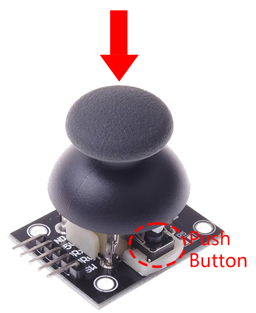
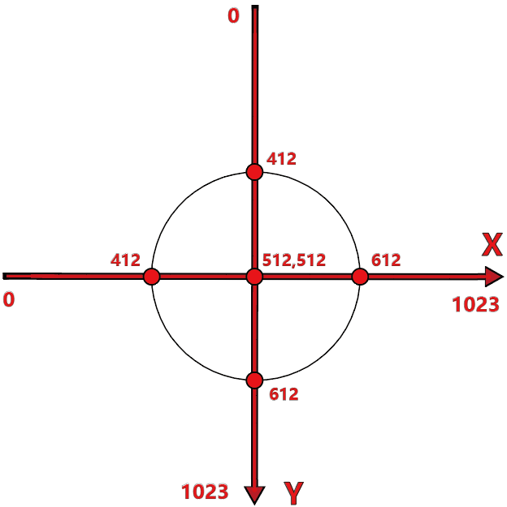

.. note::

    Hello, welcome to the SunFounder Raspberry Pi & Arduino & ESP32 Enthusiasts Community on Facebook! Dive deeper into Raspberry Pi, Arduino, and ESP32 with fellow enthusiasts.

    **Why Join?**

    - **Expert Support**: Solve post-sale issues and technical challenges with help from our community and team.
    - **Learn & Share**: Exchange tips and tutorials to enhance your skills.
    - **Exclusive Previews**: Get early access to new product announcements and sneak peeks.
    - **Special Discounts**: Enjoy exclusive discounts on our newest products.
    - **Festive Promotions and Giveaways**: Take part in giveaways and holiday promotions.

    👉 Ready to explore and create with us? Click [|link_sf_facebook|] and join today!

13. Joystick LED Navigator
===================================================

When you think of a thumb joystick, a game controller likely comes to mind. However, beyond gaming, these versatile devices are excellent for various DIY electronics projects. They can be used to control robots or rovers, or even manage camera movements.

In this project-based course, you will learn how to interface a joystick with an Arduino to control LEDs according to the joystick's movements. We'll explore the working principles of the joystick, utilize the Serial Monitor to read and debug outputs, and develop control logic to activate LEDs in specified directions. This course emphasizes practical applications, making it directly applicable to real-life scenarios where precise directional control is crucial.

.. raw:: html

    <video muted controls style = "max-width:90%">
        <source src="_static/video/13_joystick_led.mp4" type="video/mp4">
        Your browser does not support the video tag.
    </video>

By the end of this course, you will be able to:

* Understand the working principle of a joystick and its various outputs (X, Y, and SW).
* Use the Serial Monitor to read and debug sensor values in Arduino.
* Write and understand conditional statements (``if-else if``) to control hardware based on input values.

Build the Circuit
------------------------------------

**Components Needed**

.. list-table:: 
   :widths: 25 25 25 25
   :header-rows: 0

   * - 1 * Arduino Uno R3
     - 4 * LEDs with different colors
     - 4 * 220Ω Resistor
     - 1 * Joystick Module
   * - |list_uno_r3| 
     - |list_red_led| 
     - |list_220ohm| 
     - |list_joystick_module| 
   * - 1 * USB Cable
     - 1 * Breadboard
     - Jumper Wires
     - 
   * - |list_usb_cable| 
     - |list_breadboard| 
     - |list_wire| 
     - 
     
**Building Steps**

Follow the wiring diagram, or the steps below to build your circuit.

.. image:: img/11_joystick_circuit.png
    :width: 700
    :align: center

1. Find a Joystick module.

A joystick module, also known as a joystick sensor, is an input device that measures the movement of a knob in two directions, horizontal (X-axis) and vertical (Y-axis).

.. image:: img/11_joystick_module.jpg
    :width: 300
    :align: center

* **GND**: Connects to ground.
* **+5V**: Powers the module, compatible with 3.3V to 5V.
* **VRX**: Outputs analog values representing the X-axis position.
* **VRY**: Outputs analog values representing the Y-axis position.
* **SW**: Provides a digital output when the joystick button is pressed. For reliable operation, use an external pull-up resistor, which keeps the SW pin high when idle and low when pressed.

Joystick operates based on the resistance change of two potentiometers (usually 10-kilo ohms). By changing resistance in x and y directions, Arduino receives varying voltages which are interpreted to x and y coordinates. The processor needs an ADC unit to change the joystick's analog values into digital values and perform necessary processing.

Arduino boards have six 10-bits ADC channels. It means the Arduino's reference voltage (5 volts) is divided to 1024 segments. When joystick moves along the x-axis, the ADC value rises from 0 to 1023, with the value 512 in the middle. The image below displays the ADC approximate value based on the joystick position.

The joystick also features an inward press function, like a button, useful for selecting menu options or other interactive elements.

2. Here is how to connect each pin of the joystick module to the Arduino Uno R3

.. list-table:: 
   :widths: 10 30
   :header-rows: 0

   * - Arduino Uno R3
     - Joystick
   * - GND
     - GND(negative rail of breadboard)
   * - +5v
     - 5v
   * - VRX
     - A0
   * - VRY
     - A1
   * - SW
     - 2

.. image:: img/11_joystick_circuit_joystick.png
    :width: 700
    :align: center

3. Insert four differently colored LEDs into the breadboard. Connect the cathode (short pin) of each LED to the breadboard's negative rail, and the anode (long pin) into specific ports (58A, 53A, 49A, and 45A).

4. Insert a 220-ohm resistor in the same row as each LED's anode, protecting the LEDs from excessive current.

.. image:: img/11_joystick_circuit_resistor.png
    :width: 700
    :align: center

5. Use a jumper wire to connect 58J hole on the breadboard to pin 11 on the Arduino, enabling control over the first LED.

.. image:: img/11_joystick_circuit_11.png
    :width: 700
    :align: center

6. Similarly, connect the other three LEDs to pins 10, 9, and 8 on the Arduino, respectively.

.. image:: img/11_joystick_circuit_8910.png
    :width: 700
    :align: center

7. Do not forget to ground your circuit. Connect the Arduino Uno R3's GND pin to the breadboard's negative rail and use a jumper wire to connect both negative rails on the breadboard.

.. image:: img/11_joystick_circuit.png
    :width: 700
    :align: center

Code Creation- Read from Joystick Module
-----------------------------------------------
Let's take a look at what the values from the joystick module's X-axis, Y-axis, and button look like. For this, we'll use a tool called the Serial Monitor.

The Serial Monitor is an essential tool when creating projects with Arduino. It can be used as a debugging tool, testing out concepts or to communicate directly with the Arduino board.

1. Open the Arduino IDE and start a new project by selecting “New Sketch” from the “File” menu.
2. Save your sketch as ``Lesson13_Joystick_Module`` using ``Ctrl + S`` or by clicking “Save”.

3. Create three variables to store the values from the three pins of the joystick module.

.. code-block:: Arduino
    :emphasize-lines: 1,2,3

    const int xPin = A0;  //the VRX attach to
    const int yPin = A1;  //the VRY attach to
    const int swPin = 2;  //the SW attach to

    void setup() {
        // put your main code here, to run repeatedly:

    }

4. Also, using the Arduino software pull-up feature, set the ``swPin`` as input while also enabling it as ``PULLUP``.

.. code-block:: Arduino
    :emphasize-lines: 7

    const int xPin = A0;  //the VRX attach to
    const int yPin = A1;  //the VRY attach to
    const int swPin = 2;  //the SW attach to

    void setup() {
        // put your main code here, to run repeatedly:
        pinMode(swPin, INPUT_PULLUP);  // Set sw Pin as input with an internal pull-up resistor
    }

5. To activate the Serial Monitor, you must initiate serial communication on your Arduino Uno R3. This is typically done in the ``void setup()`` section of your sketch with the command ``Serial.begin(baud)``. Here, ``baud`` indicates the data transfer rate per second between the computer and the Arduino Uno R3, with common rates being 9600 and 115200 bits per second.

.. code-block:: Arduino
    :emphasize-lines: 8

    const int xPin = A0;  //the VRX attach to
    const int yPin = A1;  //the VRY attach to
    const int swPin = 2;  //the SW attach to

    void setup() {
        // put your setup code here, to run once:
        pinMode(swPin, INPUT_PULLUP);  // Set sw Pin as input with an internal pull-up resistor
        Serial.begin(9600);        // Begin serial communication with a baud rate of 9600
    }

6. Now, create three variables ``xValue``, ``yValue``, and ``swValue`` to store the values from the X, Y, and SW pins respectively.

.. code-block:: Arduino
    :emphasize-lines: 4-6

    void loop() {

        // Read the joystick values
        int xValue = analogRead(xPin);
        int yValue = analogRead(yPin);
        int swValue = digitalRead(swPin);
    }

7. You are now ready to use the Serial Monitor to print data. You will utilize ``Serial.print()`` to display data and other texts.

Here's how to use it:

    * ``Serial.print(val)`` or ``Serial.print(val, format)``: Prints data to the serial port as human-readable ASCII text. 

    **Parameters**
        - ``Serial``: serial port object.
        - ``val``: the value to print. Allowed data types: any data type.

    **Returns**
        ``print()`` returns the number of bytes written, though reading that number is optional. Data type: size_t.

This command can represent various data types and formats, including numbers, floating points, bytes, and strings. For example:

.. code-block:: Arduino

    Serial.print(78);                // outputs "78"
    Serial.print(78, BIN);           // outputs "1001110"
    Serial.print(1.23456);           // outputs "1.23"
    Serial.print(1.23456, 0);        // outputs "1"
    Serial.print('N');               // outputs "N"
    Serial.print("Hello world.");    // outputs "Hello world."

8. Now, use this command to print a prompt indicating the data about to be printed. This is helpful when differentiating multiple data prints at once.

.. code-block:: Arduino
    :emphasize-lines: 8

    void loop() {

        // Read the joystick values
        int xValue = analogRead(xPin);
        int yValue = analogRead(yPin);
        int swValue = digitalRead(swPin);

        Serial.print("X: ");
    }

9. Next, print the value from the Joystick module's VRX pin.
    
.. code-block:: Arduino
    :emphasize-lines: 9

    void loop() {

        // Read the joystick values
        int xValue = analogRead(xPin);
        int yValue = analogRead(yPin);
        int swValue = digitalRead(swPin);

        Serial.print("X: ");
        Serial.print(xValue);  // print the value of VRX
    }

10. Use the same method to print the values from the VRY pin and SW pin.

.. note::

    * To ensure each output appears on a new line in the Serial Monitor, use ``Serial.println()`` for the SW pin value, which adds a newline character at the end of the print statement.
    * Using ``delay(100)`` ensures a time interval before the next set of data appears. It is recommended to add a delay when printing data to the Serial Monitor to prevent it from refreshing too quickly, which could cause it to crash.

.. code-block:: Arduino
    :emphasize-lines: 10-14

    void loop() {

        // Read the joystick values
        int xValue = analogRead(xPin);
        int yValue = analogRead(yPin);
        int swValue = digitalRead(swPin);
        
        Serial.print("X: ");
        Serial.print(xValue);  // print the value of VRX
        Serial.print(" | Y: ");
        Serial.print(yValue);  // print the value of VRX
        Serial.print(" | SW: ");
        Serial.println(swValue);  // print the value of SW
        delay(100);
    }

11. The complete code is shown below. You can now click **Upload** to transfer the code to your Arduino Uno R3.

.. code-block:: Arduino

    const int xPin = A0;  //the VRX attach to
    const int yPin = A1;  //the VRY attach to
    const int swPin = 2;  //the SW attach to

    void setup() {
        // put your setup code here, to run once:
        pinMode(swPin, INPUT_PULLUP);  // Set sw Pin as input with an internal pull-up resistor
        Serial.begin(9600);        // Begin serial communication with a baud rate of 9600
    }

    void loop() {

        // Read the joystick values
        int xValue = analogRead(xPin);
        int yValue = analogRead(yPin);
        int swValue = digitalRead(swPin);

        Serial.print("X: ");
        Serial.print(xValue);  // print the value of VRX
        Serial.print(" | Y: ");
        Serial.print(yValue);  // print the value of VRX
        Serial.print(" | SW: ");
        Serial.println(swValue);  // print the value of SW
        delay(100);
    }

12. Afterward, click on the "Serial Monitor" button in the top right corner of the Arduino IDE.

.. image:: img/11_joystick_serial_monitor.png
    :align: center

13. If you see garbled data displayed, you will need to adjust the baud rate to match the one set in your code.

.. image:: img/11_joystick_baud.png
    :align: center

14. Once uploaded, move the joystick around, and you'll notice the X and Y values fluctuate between 0 and 1023. Press and release the joystick, and observe the SW pin toggling between 0 and 1.

.. code-block::

    X: 617 | Y: 1022 | SW: 1
    X: 767 | Y: 1023 | SW: 1
    X: 1022 | Y: 1022 | SW: 1
    X: 516 | Y: 522 | SW: 1
    X: 516 | Y: 522 | SW: 1
    X: 517 | Y: 524 | SW: 1
    X: 517 | Y: 524 | SW: 1

15. Now that you know how to print data to the Serial Monitor, let's explore some buttons in the Serial Monitor:

.. image:: img/11_joystick_serial_button.png
        :align: center

* **Toggle Autoscroll**: This allows the data to scroll so you can always see the latest readings.
* **Toggle Timestamp**: Turn on timestamps to see data stamped with the exact time to the second.
* **Clear Output**: This is used to clear the data currently displayed on the screen.

**Questions**

The X and Y axes of the joystick module return analog values, while the SW pin returns a digital value. In previous steps, we've already seen these values on the Serial Monitor.

Please summarize the differences between digital and analog values in Arduino programming.

Code Creation - Controlling LEDs Based on Joystick Movements
-------------------------------------------------------------------------

This tutorial outlines how to program LEDs to respond to the movements of a joystick.

Setup each LED to indicate the direction of joystick movement:

* **Up Indicator**: Connect an LED to pin 10. It lights up when the joystick is pushed up (Y-axis value decreases).
* **Down Indicator**: Connect an LED to pin 9. It lights up when the joystick is pushed down (Y-axis value increases).
* **Left Indicator**: Connect an LED to pin 11. It lights up when the joystick is pushed left (X-axis value decreases).
* **Right Indicator**: Connect an LED to pin 8. It lights up when the joystick is pushed right (X-axis value increases).

This raises a question: How does the Arduino Uno R3 know which direction you are moving the joystick?

Ideally, when the joystick is centered, the values should be (1024/2=512). Therefore, to determine if the joystick is pushing up, down, left, or right, we simply check if the values are greater than or less than 512.

However, due to possible design inaccuracies in the module or resistance in the connections, the values might deviate from 512 even when the joystick is centered. This could lead to misinterpretations by the Arduino Uno R3, such as mistakenly lighting the left indicator LED if the X value is already less than 512 without actual movement.

Therefore, a threshold around the midpoint (512±100) is used:

* **Up**: Y-axis value less than 412.
* **Down**: Y-axis value greater than 612.
* **Left**: X-axis value less than 412.
* **Right**: X-axis value greater than 612.

1. Now start writing the sketch. Open the sketch you saved earlier, ``Lesson13_Joystick_Module``. Hit "Save As..." from the "File" menu, and rename it to ``Lesson13_Joystick_Module_LEDs``. Click "Save".

2. Initialize variables to define the four LEDs.

.. code-block:: Arduino
    :emphasize-lines: 2-5

    // Define pins for the LEDs
    const int ledLeft = 11;
    const int ledRight = 8;
    const int ledUp = 10;
    const int ledDown = 9;

    // Define pins for the joystick
    const int xPin = A0;  //the VRX attach to
    const int yPin = A1;  //the VRY attach to
    const int swPin = 2;  //the SW attach to

    void setup() {
        // put your main code here, to run repeatedly:

    }

3. Now in ``void setup()`` set all four LED pins to output.

.. code-block:: Arduino
    :emphasize-lines: 3-6

    void setup() {
        // Initialize LED pins as outputs
        pinMode(ledLeft, OUTPUT);
        pinMode(ledRight, OUTPUT);
        pinMode(ledUp, OUTPUT);
        pinMode(ledDown, OUTPUT);
        
        pinMode(swPin, INPUT_PULLUP);  // Set sw Pin as input with an internal pull-up resistor
        Serial.begin(9600);        // Begin serial communication with a baud rate of 9600
    }

4. In this project, we don't need to constantly check the joystick values, so select the five lines ``Serial.print()``, and press ``Ctrl + /`` to comment them out.

.. code-block:: Arduino
    :emphasize-lines: 7-12

    void loop() {
        // Read the joystick values
        int xValue = analogRead(xPin);
        int yValue = analogRead(yPin);
        int swValue = digitalRead(swPin);

        // Serial.print("X: ");
        // Serial.print(xValue);  // print the value of VRX
        // Serial.print(" | Y: ");
        // Serial.print(yValue);  // print the value of VRX
        // Serial.print(" | SW: ");
        // Serial.println(swValue);  // print the value of SW

        // Add a small delay to stabilize readings
        delay(100);
    }

5. Before lighting up the corresponding LED according to the movement of the joystick, first turn off all four LEDs.

.. code-block:: Arduino
    :emphasize-lines: 15-18

    void loop() {
        // Read the joystick values
        int xValue = analogRead(xPin);
        int yValue = analogRead(yPin);
        int swValue = digitalRead(swPin);

        // Serial.print("X: ");
        // Serial.print(xValue);  // print the value of VRX
        // Serial.print(" | Y: ");
        // Serial.print(yValue);  // print the value of VRX
        // Serial.print(" | SW: ");
        // Serial.println(swValue);  // print the value of SW

        // First, turn off all LEDs
        digitalWrite(ledLeft, LOW);
        digitalWrite(ledRight, LOW);
        digitalWrite(ledUp, LOW);
        digitalWrite(ledDown, LOW);

        // Add a small delay to stabilize readings
        delay(100);
    }

7. To sequentially light up each LED based on the X and Y values of the Joystick module, you will need multiple conditions. You can use ``if`` to specify actions for different ranges of potentiometer values:
  
* If the Y-axis value is less than 412, then the "up" indicator should be lit.
* If the Y-axis value is greater than 612, then the "down" indicator should be lit.
* If the X-axis value is less than 412, then the "left" indicator should be lit.
* If the X-axis value is greater than 612, then the "right" indicator should be lit.

However, managing these conditions separately can be inefficient, as Arduino needs to check each one in every loop cycle. 

To streamline this, utilize the ``if-else if`` structure:

.. code-block:: Arduino

    if (condition 1) {
        // Execute if condition 1 is true
    }
    else if (condition 2) {
        // Execute if condition 2 is true
    }
    else if (condition 3) {
        // Execute if condition 3 is true
    }
    else {
        // Execute if none of the conditions are true
    }

.. image:: img/if_else_if.png
    :width: 500
    :align: center

In an ``if-else if`` structure, the first condition is tested. If it's true, the associated commands are executed, and all other conditions are skipped (even if some of them are true). If the first condition is false, it tests the second condition in the structure. If the second condition is true, it executes the commands associated with this condition and then skips the others. If it is false, it tests the third condition, and so on. In some scenarios, there can be multiple true conditions. Therefore, the order of conditions is important. Only the first true condition will have its associated commands run.

8. First, when the ``yValue`` is less than 412, use the ``digitalWrite()`` function to set the "up" indicator light to ``HIGH`` to turn it on.

.. code-block:: Arduino
    :emphasize-lines: 8-11
    
    // First, turn off all LEDs
    digitalWrite(ledLeft, LOW);
    digitalWrite(ledRight, LOW);
    digitalWrite(ledUp, LOW);
    digitalWrite(ledDown, LOW);

    // Check joystick positions and set LEDs accordingly
    if (yValue < 412) {
        // Joystick up
        digitalWrite(ledUp, HIGH);
    }

9. Add an ``else if`` statement to light up the "down" indicator when the ``yValue`` exceeds 612.

.. code-block:: Arduino
    :emphasize-lines: 12-15
    
    // First, turn off all LEDs
    digitalWrite(ledLeft, LOW);
    digitalWrite(ledRight, LOW);
    digitalWrite(ledUp, LOW);
    digitalWrite(ledDown, LOW);

    // Check joystick positions and set LEDs accordingly
    if (yValue < 412) {
        // Joystick up
        digitalWrite(ledUp, HIGH);
    }
    else if (yValue > 612) {
        // Joystick down
        digitalWrite(ledDown, HIGH);
    } 

10. To light up the "left" indicator when the ``xValue`` is below 412, insert another ``else if`` condition like this:

.. code-block:: Arduino
    :emphasize-lines: 8-11
    
    // Check joystick positions and set LEDs accordingly
    if (yValue < 412) {
        // Joystick up
        digitalWrite(ledUp, HIGH);
    } else if (yValue > 612) {
        // Joystick down
        digitalWrite(ledDown, HIGH);
    } else if (xValue < 412) {
        // Joystick left
        digitalWrite(ledLeft, HIGH);
    }  

11. Similarly, add another ``else if`` condition to light up the right indicator when the ``xValue`` exceeds 612.

.. code-block:: Arduino
    :emphasize-lines: 11-14 

    // Check joystick positions and set LEDs accordingly
    if (yValue < 412) {
        // Joystick up
        digitalWrite(ledUp, HIGH);
    } else if (yValue > 612) {
        // Joystick down
        digitalWrite(ledDown, HIGH);
    } else if (xValue < 412) {
        // Joystick left
        digitalWrite(ledLeft, HIGH);
    } else if (xValue > 612) {
        // Joystick right
        digitalWrite(ledRight, HIGH);
    }

12. Finally, inside the ``else`` block to turn off all four LEDs using ``digitalWrite()``. This block contains commands that run when none of the other conditions are true.

.. code-block:: Arduino
    :emphasize-lines: 14-20

    // Check joystick positions and set LEDs accordingly
    if (yValue < 412) {
        // Joystick up
        digitalWrite(ledUp, HIGH);
    } else if (yValue > 612) {
        // Joystick down
        digitalWrite(ledDown, HIGH);
    } else if (xValue < 412) {
        // Joystick left
        digitalWrite(ledLeft, HIGH);
    } else if (xValue > 612) {
        // Joystick right
        digitalWrite(ledRight, HIGH);
    } else {
        // Joystick in the middle, turn off all LEDs
        digitalWrite(ledLeft, LOW);
        digitalWrite(ledRight, LOW);
        digitalWrite(ledUp, LOW);
        digitalWrite(ledDown, LOW);
    }

13. Your complete code is as follows. Click "Upload" to send the code to your Arduino Uno R3.

.. code-block:: Arduino

    // Define pins for the LEDs
    const int ledLeft = 11;
    const int ledRight = 8;
    const int ledUp = 10;
    const int ledDown = 9;

    // Define pins for the joystick
    const int xPin = A0;  //the VRX attach to
    const int yPin = A1;  //the VRY attach to
    const int swPin = 2;  //the SW attach to

    void setup() {
        // Initialize LED pins as outputs
        pinMode(ledLeft, OUTPUT);
        pinMode(ledRight, OUTPUT);
        pinMode(ledUp, OUTPUT);
        pinMode(ledDown, OUTPUT);

        pinMode(swPin, INPUT_PULLUP);  // Set sw Pin as input with an internal pull-up resistor
        Serial.begin(9600);        // Begin serial communication with a baud rate of 9600
    }

    void loop() {
        // Read the joystick values
        int xValue = analogRead(xPin);
        int yValue = analogRead(yPin);
        int swValue = digitalRead(swPin);

        // Serial.print("X: ");
        // Serial.print(xValue);  // print the value of VRX
        // Serial.print(" | Y: ");
        // Serial.print(yValue);  // print the value of VRX
        // Serial.print(" | SW: ");
        // Serial.println(swValue);  // print the value of SW

        // First, turn off all LEDs
        digitalWrite(ledLeft, LOW);
        digitalWrite(ledRight, LOW);
        digitalWrite(ledUp, LOW);
        digitalWrite(ledDown, LOW);

        // Check joystick positions and set LEDs accordingly
        if (yValue < 412) {
            // Joystick up
            digitalWrite(ledUp, HIGH);
        } else if (yValue > 612) {
            // Joystick down
            digitalWrite(ledDown, HIGH);
        } else if (xValue < 412) {
            // Joystick left
            digitalWrite(ledLeft, HIGH);
        } else if (xValue > 612) {
            // Joystick right
            digitalWrite(ledRight, HIGH);
        } else {
            // Joystick in the middle, turn off all LEDs
            digitalWrite(ledLeft, LOW);
            digitalWrite(ledRight, LOW);
            digitalWrite(ledUp, LOW);
            digitalWrite(ledDown, LOW);
        }
        // Add a small delay to stabilize readings
        delay(100);
    }

14. Now wiggle the joystick, and you will see the corresponding directional LEDs light up.

* **Up Indicator** lights up when the joystick is pushed up (Y-axis value decreases).
* **Down Indicator** lights up when the joystick is pushed down (Y-axis value increases).
* **Left Indicator** lights up when the joystick is pushed left (X-axis value decreases).
* **Right Indicator** lights up when the joystick is pushed right (X-axis value increases).

**Question**

1. In the last code, we controlled the corresponding LEDs based on the X and Y values of the joystick. How would you modify the code to adjust the brightness of these LEDs while they are lit?

2. What is the difference in behavior of the LED connected to pin 8 compared to those on other pins, and why?

**Summary**

In this lesson, you learned about the operational principles of the Joystick module and utilized the Serial Monitor tool to read X, Y, and SW values from the joystick. You gained an understanding of the differences between analog and digital values in Arduino programming. Additionally, you mastered the use of advanced conditional statements, specifically if-else if constructs, to control hardware based on input values.
