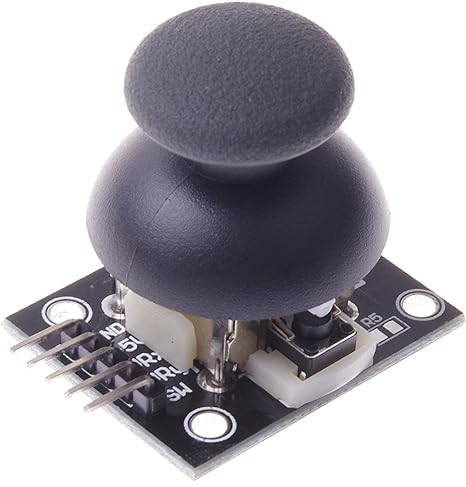
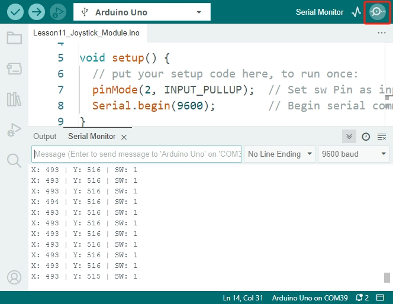

.. note::

    Hallo, willkommen in der SunFounder Raspberry Pi & Arduino & ESP32 Enthusiasten-Community auf Facebook! Tauche tiefer in Raspberry Pi, Arduino und ESP32 zusammen mit anderen Enthusiasten ein.

    **Warum beitreten?**

    - **Expertenunterstützung**: Löse nach dem Kauf auftretende Probleme und technische Herausforderungen mit Hilfe unserer Community und unseres Teams.
    - **Lernen & Teilen**: Tausche Tipps und Tutorials aus, um deine Fähigkeiten zu verbessern.
    - **Exklusive Vorschauen**: Erhalte vorab Zugang zu neuen Produktankündigungen und Einblicken.
    - **Spezielle Rabatte**: Genieße exklusive Rabatte auf unsere neuesten Produkte.
    - **Festliche Aktionen und Gewinnspiele**: Nimm an Gewinnspielen und Feiertagspromotionen teil.

    👉 Bereit, mit uns zu entdecken und zu kreieren? Klicke [|link_sf_facebook|] und tritt noch heute bei!

13. Joystick-LED-Navigator
===================================================

Wenn du an einen Daumen-Joystick denkst, kommt dir wahrscheinlich ein Game-Controller in den Sinn. Allerdings sind diese vielseitigen Geräte nicht nur fürs Gaming geeignet, sondern auch für verschiedene DIY-Elektronikprojekte. Sie können verwendet werden, um Roboter oder Rover zu steuern oder sogar Kamerabewegungen zu verwalten.

In diesem praxisorientierten Kurs lernst du, wie du einen Joystick mit einem Arduino verbindest, um LEDs entsprechend den Bewegungen des Joysticks zu steuern. Wir werden die Funktionsweise des Joysticks untersuchen, den seriellen Monitor nutzen, um Ausgaben zu lesen und zu debuggen, und Kontrolllogik entwickeln, um LEDs in bestimmte Richtungen zu aktivieren. Dieser Kurs legt Wert auf praktische Anwendungen, die direkt auf reale Szenarien anwendbar sind, bei denen präzise Richtungssteuerung entscheidend ist.

.. raw:: html

    <video muted controls style = "max-width:90%">
        <source src="_static/video/13_joystick_led.mp4" type="video/mp4">
        Dein Browser unterstützt das Video-Tag nicht.
    </video>

Am Ende dieses Kurses wirst du in der Lage sein:

* Die Funktionsweise eines Joysticks und dessen verschiedene Ausgaben (X, Y und SW) zu verstehen.
* Den seriellen Monitor zu verwenden, um Sensorwerte in Arduino zu lesen und zu debuggen.
* Bedingte Anweisungen (``if-else if``) zu schreiben und zu verstehen, um Hardware basierend auf Eingabewerten zu steuern.

Baue die Schaltung
------------------------------------

**Benötigte Komponenten**

.. list-table:: 
   :widths: 25 25 25 25
   :header-rows: 0

   * - 1 * Arduino Uno R3
     - 4 * LEDs in verschiedenen Farben
     - 4 * 220Ω Widerstände
     - 1 * Joystick-Modul
   * - |list_uno_r3| 
     - |list_red_led| 
     - |list_220ohm| 
     - |list_joystick_module| 
   * - 1 * USB-Kabel
     - 1 * Steckbrett
     - Verbindungskabel
     - 
   * - |list_usb_cable| 
     - |list_breadboard| 
     - |list_wire| 
     - 
     
**Bauanleitung**

Folge dem Schaltplan oder den folgenden Schritten, um deine Schaltung zu bauen.

.. image:: img/11_joystick_circuit.png
    :width: 700
    :align: center

1. Finde ein Joystick-Modul.

Ein Joystick-Modul, auch als Joystick-Sensor bekannt, ist ein Eingabegerät, das die Bewegung eines Knopfes in zwei Richtungen misst, horizontal (X-Achse) und vertikal (Y-Achse).

* **GND**: Verbindet mit Masse.
* **+5V**: Versorgt das Modul mit Strom, kompatibel mit 3,3V bis 5V.
* **VRX**: Gibt analoge Werte aus, die die Position der X-Achse darstellen.
* **VRY**: Gibt analoge Werte aus, die die Position der Y-Achse darstellen.
* **SW**: Gibt ein digitales Signal aus, wenn der Joystick-Knopf gedrückt wird. Für einen zuverlässigen Betrieb sollte ein externer Pull-up-Widerstand verwendet werden, der den SW-Pin im Ruhezustand auf High hält und bei Betätigung auf Low setzt.

Der Joystick arbeitet auf Basis des Widerstandswechsels zweier Potentiometer (normalerweise 10 Kiloohm). Durch Ändern des Widerstands in X- und Y-Richtung empfängt der Arduino unterschiedliche Spannungen, die in X- und Y-Koordinaten umgewandelt werden. Der Prozessor benötigt eine ADC-Einheit, um die analogen Werte des Joysticks in digitale Werte umzuwandeln und die notwendige Verarbeitung durchzuführen.

Arduino-Boards verfügen über sechs 10-Bit-ADC-Kanäle. Das bedeutet, dass die Referenzspannung des Arduino (5 Volt) in 1024 Segmente unterteilt wird. Wenn sich der Joystick entlang der X-Achse bewegt, steigt der ADC-Wert von 0 auf 1023, wobei der Wert 512 in der Mitte liegt. Das Bild unten zeigt den ungefähren ADC-Wert basierend auf der Joystick-Position.

.. image:: img/11_joystick_xy_range.jpg
    :width: 500
    :align: center

Der Joystick verfügt außerdem über eine Druckfunktion nach innen, ähnlich einem Knopf, die sich zum Auswählen von Menüoptionen oder anderen interaktiven Elementen eignet.

.. image:: img/11_joystick_module_button.jpg
    :width: 300
    :align: center

2. Hier ist, wie du jeden Pin des Joystick-Moduls mit dem Arduino Uno R3 verbindest:

.. list-table:: 
   :widths: 10 30
   :header-rows: 0

   * - Arduino Uno R3
     - Joystick
   * - GND
     - GND (Masseanschluss des Steckbretts)
   * - +5V
     - +5V
   * - VRX
     - A0
   * - VRY
     - A1
   * - SW
     - Pin 2

.. image:: img/11_joystick_circuit_joystick.png
    :width: 700
    :align: center

3. Setze vier unterschiedlich farbige LEDs in das Steckbrett ein. Verbinde die Kathode (kurzer Pin) jeder LED mit der Masseleitung des Steckbretts und die Anode (langer Pin) in bestimmte Ports (58A, 53A, 49A und 45A).

.. image:: img/11_joystick_circuit_led.png
    :width: 700
    :align: center

4. Setze einen 220-Ohm-Widerstand in die gleiche Reihe wie die Anode jeder LED ein, um die LEDs vor übermäßigem Strom zu schützen.

5. Verwende ein Verbindungskabel, um das Loch 58J auf dem Steckbrett mit Pin 11 des Arduino zu verbinden, damit die erste LED gesteuert werden kann.

.. image:: img/11_joystick_circuit_11.png
    :width: 700
    :align: center

6. Verbinde entsprechend die anderen drei LEDs mit den Pins 10, 9 und 8 des Arduino.

7. Vergiss nicht, deine Schaltung zu erden. Verbinde den GND-Pin des Arduino Uno R3 mit der Masseleitung des Steckbretts und verwende ein Verbindungskabel, um beide Masseleitungen auf dem Steckbrett zu verbinden.

.. image:: img/11_joystick_circuit.png
    :width: 700
    :align: center

Code-Erstellung - Werte vom Joystick-Modul lesen
----------------------------------------------------
Schauen wir uns an, welche Werte die X-Achse, Y-Achse und der Button des Joystick-Moduls ausgeben. Dafür verwenden wir ein Tool namens Serial Monitor.

Der Serial Monitor ist ein unverzichtbares Werkzeug beim Erstellen von Arduino-Projekten. Er kann als Debugging-Tool verwendet werden, um Konzepte zu testen oder direkt mit der Arduino-Platine zu kommunizieren.

1. Öffne die Arduino IDE und starte ein neues Projekt, indem du im Menü „Datei“ die Option „Neuer Sketch“ auswählst.
2. Speichere deinen Sketch unter dem Namen ``Lesson13_Joystick_Module`` mit ``Strg + S`` oder durch Klicken auf „Speichern“.

3. Erstelle drei Variablen, um die Werte von den drei Pins des Joystick-Moduls zu speichern.

.. code-block:: Arduino
    :emphasize-lines: 1,2,3

    const int xPin = A0;  // Verbindung zu VRX
    const int yPin = A1;  // Verbindung zu VRY
    const int swPin = 2;  // Verbindung zu SW

    void setup() {
        // Hauptcode hier, der wiederholt ausgeführt wird:
    }

4. Verwende außerdem die Pull-up-Funktion der Arduino-Software, um den ``swPin`` als Eingang festzulegen und ihn gleichzeitig als ``PULLUP`` zu aktivieren.

.. code-block:: Arduino
    :emphasize-lines: 7

    const int xPin = A0;  // Verbindung zu VRX
    const int yPin = A1;  // Verbindung zu VRY
    const int swPin = 2;  // Verbindung zu SW

    void setup() {
        // Hauptcode hier, der wiederholt ausgeführt wird:
        pinMode(swPin, INPUT_PULLUP);  // swPin als Eingang mit internem Pull-up-Widerstand festlegen
    }

5. Um den Serial Monitor zu aktivieren, musst du die serielle Kommunikation auf deinem Arduino Uno R3 einrichten. Dies geschieht normalerweise im Abschnitt ``void setup()`` deines Sketches mit dem Befehl ``Serial.begin(baud)``. Hierbei gibt ``baud`` die Übertragungsrate pro Sekunde zwischen dem Computer und dem Arduino Uno R3 an, wobei übliche Raten 9600 und 115200 Bits pro Sekunde sind.

.. code-block:: Arduino
    :emphasize-lines: 8

    const int xPin = A0;  // Verbindung zu VRX
    const int yPin = A1;  // Verbindung zu VRY
    const int swPin = 2;  // Verbindung zu SW

    void setup() {
        // Code zum einmaligen Ausführen
        pinMode(swPin, INPUT_PULLUP);  // swPin als Eingang mit internem Pull-up-Widerstand festlegen
        Serial.begin(9600);            // Serielle Kommunikation mit einer Baudrate von 9600 starten
    }

6. Erstelle nun drei Variablen ``xValue``, ``yValue`` und ``swValue``, um die Werte von den X-, Y- und SW-Pins zu speichern.

.. code-block:: Arduino
    :emphasize-lines: 4-6

    void loop() {

        // Joystick-Werte auslesen
        int xValue = analogRead(xPin);
        int yValue = analogRead(yPin);
        int swValue = digitalRead(swPin);
    }

7. Du bist jetzt bereit, den Serial Monitor zu verwenden, um Daten auszugeben. Du verwendest ``Serial.print()``, um Daten und andere Texte anzuzeigen.

Hier ist, wie es geht:

    * ``Serial.print(val)`` oder ``Serial.print(val, format)``: Gibt Daten als menschenlesbaren ASCII-Text an den seriellen Port aus.

    **Parameter**
        - ``Serial``: serielle Portobjekt.
        - ``val``: der zu druckende Wert. Erlaubte Datentypen: jeder Datentyp.

    **Rückgabewert**
        ``print()`` gibt die Anzahl der geschriebenen Bytes zurück, das Lesen dieser Zahl ist jedoch optional. Datentyp: size_t.

Dieser Befehl kann verschiedene Datentypen und Formate darstellen, darunter Zahlen, Gleitkommazahlen, Bytes und Zeichenketten. Zum Beispiel:

.. code-block:: Arduino

    Serial.print(78);                // gibt "78" aus
    Serial.print(78, BIN);           // gibt "1001110" aus
    Serial.print(1.23456);           // gibt "1.23" aus
    Serial.print(1.23456, 0);        // gibt "1" aus
    Serial.print('N');               // gibt "N" aus
    Serial.print("Hello world.");    // gibt "Hello world." aus

8. Verwende nun diesen Befehl, um eine Eingabeaufforderung auszugeben, die angibt, welche Daten gedruckt werden. Dies ist hilfreich, um mehrere Datendrucke gleichzeitig zu unterscheiden.

.. code-block:: Arduino
    :emphasize-lines: 8

    void loop() {

        // Joystick-Werte auslesen
        int xValue = analogRead(xPin);
        int yValue = analogRead(yPin);
        int swValue = digitalRead(swPin);

        Serial.print("X: ");
    }

9. Gib als nächstes den Wert des VRX-Pins des Joystick-Moduls aus.

.. code-block:: Arduino
    :emphasize-lines: 9

    void loop() {

        // Joystick-Werte auslesen
        int xValue = analogRead(xPin);
        int yValue = analogRead(yPin);
        int swValue = digitalRead(swPin);

        Serial.print("X: ");
        Serial.print(xValue);  // Wert von VRX ausgeben
    }

10. Verwende dieselbe Methode, um die Werte der VRY- und SW-Pins auszugeben.

.. note::

    * Um sicherzustellen, dass jede Ausgabe im Serial Monitor in einer neuen Zeile erscheint, verwende ``Serial.println()`` für den SW-Pin-Wert, der ein Zeilenumbruchzeichen am Ende der Druckanweisung hinzufügt.
    * Mit ``delay(100)`` wird ein Zeitintervall festgelegt, bevor die nächste Datenmenge erscheint. Es wird empfohlen, beim Drucken von Daten an den Serial Monitor eine Verzögerung hinzuzufügen, um zu verhindern, dass er zu schnell aktualisiert wird und möglicherweise abstürzt.

.. code-block:: Arduino
    :emphasize-lines: 10-14

    void loop() {

        // Joystick-Werte auslesen
        int xValue = analogRead(xPin);
        int yValue = analogRead(yPin);
        int swValue = digitalRead(swPin);
        
        Serial.print("X: ");
        Serial.print(xValue);  // Wert von VRX ausgeben
        Serial.print(" | Y: ");
        Serial.print(yValue);  // Wert von VRY ausgeben
        Serial.print(" | SW: ");
        Serial.println(swValue);  // Wert von SW ausgeben
        delay(100);
    }

11. Der vollständige Code wird unten angezeigt. Du kannst nun auf **Hochladen** klicken, um den Code auf dein Arduino Uno R3 zu übertragen.

.. code-block:: Arduino

    const int xPin = A0;  // Verbindung zu VRX
    const int yPin = A1;  // Verbindung zu VRY
    const int swPin = 2;  // Verbindung zu SW

    void setup() {
        // Einmaliger Setup-Code:
        pinMode(swPin, INPUT_PULLUP);  // Setze swPin als Eingang mit internem Pull-up-Widerstand
        Serial.begin(9600);        // Starte serielle Kommunikation mit einer Baudrate von 9600
    }

    void loop() {

        // Joystick-Werte auslesen
        int xValue = analogRead(xPin);
        int yValue = analogRead(yPin);
        int swValue = digitalRead(swPin);

        Serial.print("X: ");
        Serial.print(xValue);  // Wert von VRX ausgeben
        Serial.print(" | Y: ");
        Serial.print(yValue);  // Wert von VRY ausgeben
        Serial.print(" | SW: ");
        Serial.println(swValue);  // Wert von SW ausgeben
        delay(100);
    }

12. Klicke anschließend auf die Schaltfläche "Serial Monitor" oben rechts in der Arduino IDE.

13. Wenn du unleserliche Daten siehst, musst du die Baudrate anpassen, um sie mit der im Code eingestellten Baudrate abzugleichen.

14. Nachdem der Code hochgeladen wurde, bewege den Joystick, und du wirst bemerken, dass sich die X- und Y-Werte zwischen 0 und 1023 ändern. Drücke und lasse den Joystick los und beobachte, wie der SW-Pin zwischen 0 und 1 wechselt.

.. code-block::

    X: 617 | Y: 1022 | SW: 1
    X: 767 | Y: 1023 | SW: 1
    X: 1022 | Y: 1022 | SW: 1
    X: 516 | Y: 522 | SW: 1
    X: 516 | Y: 522 | SW: 1
    X: 517 | Y: 524 | SW: 1
    X: 517 | Y: 524 | SW: 1

15. Jetzt, da du weißt, wie man Daten im Serial Monitor ausgibt, lassen uns einige Schaltflächen im Serial Monitor erkunden:

* **Autoscroll umschalten**: Dadurch wird das Scrollen der Daten aktiviert, sodass du immer die neuesten Messwerte siehst.
* **Zeitstempel umschalten**: Aktiviere Zeitstempel, um die Daten mit der genauen Uhrzeit in Sekunden zu versehen.
* **Ausgabe löschen**: Dies dient dazu, die aktuell angezeigten Daten auf dem Bildschirm zu löschen.

**Fragen**

Die X- und Y-Achsen des Joystick-Moduls geben analoge Werte zurück, während der SW-Pin einen digitalen Wert zurückgibt. In den vorherigen Schritten haben wir diese Werte bereits im Serial Monitor gesehen.

Bitte fasse die Unterschiede zwischen digitalen und analogen Werten in der Arduino-Programmierung zusammen.

Code-Erstellung - LEDs basierend auf Joystick-Bewegungen steuern
-------------------------------------------------------------------------

In diesem Tutorial wird beschrieben, wie man LEDs programmiert, um auf die Bewegungen eines Joysticks zu reagieren.

.. image:: img/11_joystick_xy_range.jpg
    :width: 500
    :align: center

Richte jede LED so ein, dass sie die Richtung der Joystick-Bewegung anzeigt:

* **Hoch-Anzeige**: Verbinde eine LED mit Pin 10. Sie leuchtet auf, wenn der Joystick nach oben gedrückt wird (Y-Achsen-Wert sinkt).
* **Runter-Anzeige**: Verbinde eine LED mit Pin 9. Sie leuchtet auf, wenn der Joystick nach unten gedrückt wird (Y-Achsen-Wert steigt).
* **Links-Anzeige**: Verbinde eine LED mit Pin 11. Sie leuchtet auf, wenn der Joystick nach links gedrückt wird (X-Achsen-Wert sinkt).
* **Rechts-Anzeige**: Verbinde eine LED mit Pin 8. Sie leuchtet auf, wenn der Joystick nach rechts gedrückt wird (X-Achsen-Wert steigt).

Dies wirft die Frage auf: Wie weiß der Arduino Uno R3, in welche Richtung du den Joystick bewegst?

Idealerweise sollten die Werte, wenn der Joystick zentriert ist, (1024/2=512) betragen. Um also festzustellen, ob der Joystick nach oben, unten, links oder rechts gedrückt wird, prüfen wir einfach, ob die Werte größer oder kleiner als 512 sind.

Aufgrund möglicher Konstruktionsungenauigkeiten im Modul oder Widerstände in den Verbindungen können die Werte jedoch auch dann von 512 abweichen, wenn der Joystick zentriert ist. Dies könnte dazu führen, dass der Arduino Uno R3 die linke LED fälschlicherweise aktiviert, wenn der X-Wert bereits unter 512 liegt, ohne dass eine tatsächliche Bewegung stattgefunden hat.

Daher wird ein Schwellenwert um den Mittelpunkt (512±100) verwendet:

.. image:: img/11_joystick_xy_200.png
    :width: 400
    :align: center

* **Hoch**: Y-Achsen-Wert kleiner als 412.
* **Runter**: Y-Achsen-Wert größer als 612.
* **Links**: X-Achsen-Wert kleiner als 412.
* **Rechts**: X-Achsen-Wert größer als 612.

1. Beginne nun mit dem Schreiben des Sketches. Öffne den zuvor gespeicherten Sketch ``Lesson13_Joystick_Module``. Wähle im Menü „Datei“ die Option „Speichern unter...“ und benenne ihn in ``Lesson13_Joystick_Module_LEDs`` um. Klicke auf „Speichern“.

2. Initialisiere Variablen, um die vier LEDs zu definieren.

.. code-block:: Arduino
    :emphasize-lines: 2-5

    // Definiere Pins für die LEDs
    const int ledLeft = 11;
    const int ledRight = 8;
    const int ledUp = 10;
    const int ledDown = 9;

    // Definiere Pins für den Joystick
    const int xPin = A0;  // Verbindung zu VRX
    const int yPin = A1;  // Verbindung zu VRY
    const int swPin = 2;  // Verbindung zu SW

    void setup() {
        // Hauptcode hier, der wiederholt ausgeführt wird:
    }

3. Setze nun im ``void setup()`` alle vier LED-Pins auf Ausgang.

.. code-block:: Arduino
    :emphasize-lines: 3-6

    void setup() {
        // Initialisiere LED-Pins als Ausgänge
        pinMode(ledLeft, OUTPUT);
        pinMode(ledRight, OUTPUT);
        pinMode(ledUp, OUTPUT);
        pinMode(ledDown, OUTPUT);
        
        pinMode(swPin, INPUT_PULLUP);  // Setze swPin als Eingang mit internem Pull-up-Widerstand
        Serial.begin(9600);        // Starte serielle Kommunikation mit einer Baudrate von 9600
    }

4. In diesem Projekt müssen wir die Joystick-Werte nicht ständig überprüfen, also wähle die fünf Zeilen ``Serial.print()`` aus und drücke ``Strg + /``, um sie zu kommentieren.

.. code-block:: Arduino
    :emphasize-lines: 7-12

    void loop() {
        // Joystick-Werte auslesen
        int xValue = analogRead(xPin);
        int yValue = analogRead(yPin);
        int swValue = digitalRead(swPin);

        // Serial.print("X: ");
        // Serial.print(xValue);  // Wert von VRX ausgeben
        // Serial.print(" | Y: ");
        // Serial.print(yValue);  // Wert von VRY ausgeben
        // Serial.print(" | SW: ");
        // Serial.println(swValue);  // Wert von SW ausgeben

        // Füge eine kleine Verzögerung hinzu, um die Messwerte zu stabilisieren
        delay(100);
    }

5. Bevor du die entsprechende LED gemäß der Bewegung des Joysticks einschaltest, schalte zuerst alle vier LEDs aus.

.. code-block:: Arduino
    :emphasize-lines: 15-18

    void loop() {
        // Joystick-Werte auslesen
        int xValue = analogRead(xPin);
        int yValue = analogRead(yPin);
        int swValue = digitalRead(swPin);

        // Serial.print("X: ");
        // Serial.print(xValue);  // Wert von VRX ausgeben
        // Serial.print(" | Y: ");
        // Serial.print(yValue);  // Wert von VRY ausgeben
        // Serial.print(" | SW: ");
        // Serial.println(swValue);  // Wert von SW ausgeben

        // Zuerst schalte alle LEDs aus
        digitalWrite(ledLeft, LOW);
        digitalWrite(ledRight, LOW);
        digitalWrite(ledUp, LOW);
        digitalWrite(ledDown, LOW);

        // Füge eine kleine Verzögerung hinzu, um die Messwerte zu stabilisieren
        delay(100);
    }

7. Um jede LED nacheinander basierend auf den X- und Y-Werten des Joystick-Moduls zu aktivieren, benötigst du mehrere Bedingungen. Du kannst ``if`` verwenden, um Aktionen für verschiedene Bereiche der Potentiometerwerte festzulegen:

* Wenn der Y-Achsen-Wert kleiner als 412 ist, sollte die "Up"-Anzeige leuchten.
* Wenn der Y-Achsen-Wert größer als 612 ist, sollte die "Down"-Anzeige leuchten.
* Wenn der X-Achsen-Wert kleiner als 412 ist, sollte die "Left"-Anzeige leuchten.
* Wenn der X-Achsen-Wert größer als 612 ist, sollte die "Right"-Anzeige leuchten.

Das getrennte Verwalten dieser Bedingungen kann jedoch ineffizient sein, da Arduino bei jedem Schleifendurchlauf jede einzelne Bedingung überprüfen muss.

Um dies zu optimieren, verwende die ``if-else if``-Struktur:

.. code-block:: Arduino

    if (Bedingung 1) {
        // Ausführen, wenn Bedingung 1 wahr ist
    }
    else if (Bedingung 2) {
        // Ausführen, wenn Bedingung 2 wahr ist
    }
    else if (Bedingung 3) {
        // Ausführen, wenn Bedingung 3 wahr ist
    }
    else {
        // Ausführen, wenn keine der Bedingungen wahr ist
    }

.. image:: img/if_else_if.png
    :width: 500
    :align: center

In einer ``if-else if``-Struktur wird die erste Bedingung geprüft. Wenn sie wahr ist, werden die zugehörigen Befehle ausgeführt und alle anderen Bedingungen übersprungen (selbst wenn einige davon ebenfalls wahr sind). Ist die erste Bedingung falsch, wird die zweite Bedingung geprüft. Ist diese wahr, werden die zugehörigen Befehle ausgeführt, und die restlichen Bedingungen werden übersprungen. Wenn sie falsch ist, wird die nächste Bedingung geprüft und so weiter. In einigen Szenarien können mehrere Bedingungen gleichzeitig wahr sein. Daher ist die Reihenfolge der Bedingungen wichtig. Nur die erste wahre Bedingung wird ausgeführt.

8. Zuerst, wenn der ``yValue`` kleiner als 412 ist, verwende die ``digitalWrite()``-Funktion, um die "Up"-Anzeige auf ``HIGH`` zu setzen und einzuschalten.

.. code-block:: Arduino
    :emphasize-lines: 8-11
    
    // Zuerst alle LEDs ausschalten
    digitalWrite(ledLeft, LOW);
    digitalWrite(ledRight, LOW);
    digitalWrite(ledUp, LOW);
    digitalWrite(ledDown, LOW);

    // Joystick-Positionen prüfen und LEDs entsprechend setzen
    if (yValue < 412) {
        // Joystick nach oben
        digitalWrite(ledUp, HIGH);
    }

9. Füge eine ``else if``-Anweisung hinzu, um die "Down"-Anzeige zu aktivieren, wenn der ``yValue`` 612 überschreitet.

.. code-block:: Arduino
    :emphasize-lines: 12-15
    
    // Zuerst alle LEDs ausschalten
    digitalWrite(ledLeft, LOW);
    digitalWrite(ledRight, LOW);
    digitalWrite(ledUp, LOW);
    digitalWrite(ledDown, LOW);

    // Joystick-Positionen prüfen und LEDs entsprechend setzen
    if (yValue < 412) {
        // Joystick nach oben
        digitalWrite(ledUp, HIGH);
    }
    else if (yValue > 612) {
        // Joystick nach unten
        digitalWrite(ledDown, HIGH);
    } 

10. Um die "Left"-Anzeige zu aktivieren, wenn der ``xValue`` unter 412 liegt, füge eine weitere ``else if``-Bedingung ein:

.. code-block:: Arduino
    :emphasize-lines: 8-11
    
    // Joystick-Positionen prüfen und LEDs entsprechend setzen
    if (yValue < 412) {
        // Joystick nach oben
        digitalWrite(ledUp, HIGH);
    } else if (yValue > 612) {
        // Joystick nach unten
        digitalWrite(ledDown, HIGH);
    } else if (xValue < 412) {
        // Joystick nach links
        digitalWrite(ledLeft, HIGH);
    }  

11. Füge ähnlich eine weitere ``else if``-Bedingung hinzu, um die "Right"-Anzeige zu aktivieren, wenn der ``xValue`` 612 überschreitet.

.. code-block:: Arduino
    :emphasize-lines: 11-14 

    // Joystick-Positionen prüfen und LEDs entsprechend setzen
    if (yValue < 412) {
        // Joystick nach oben
        digitalWrite(ledUp, HIGH);
    } else if (yValue > 612) {
        // Joystick nach unten
        digitalWrite(ledDown, HIGH);
    } else if (xValue < 412) {
        // Joystick nach links
        digitalWrite(ledLeft, HIGH);
    } else if (xValue > 612) {
        // Joystick nach rechts
        digitalWrite(ledRight, HIGH);
    }
    
12. Schließlich soll im ``else``-Block mithilfe von ``digitalWrite()`` alle vier LEDs ausgeschaltet werden. Dieser Block enthält die Befehle, die ausgeführt werden, wenn keine der anderen Bedingungen zutrifft.

.. code-block:: Arduino
    :emphasize-lines: 14-20

    // Joystick-Positionen prüfen und LEDs entsprechend setzen
    if (yValue < 412) {
        // Joystick nach oben
        digitalWrite(ledUp, HIGH);
    } else if (yValue > 612) {
        // Joystick nach unten
        digitalWrite(ledDown, HIGH);
    } else if (xValue < 412) {
        // Joystick nach links
        digitalWrite(ledLeft, HIGH);
    } else if (xValue > 612) {
        // Joystick nach rechts
        digitalWrite(ledRight, HIGH);
    } else {
        // Joystick in der Mitte, alle LEDs ausschalten
        digitalWrite(ledLeft, LOW);
        digitalWrite(ledRight, LOW);
        digitalWrite(ledUp, LOW);
        digitalWrite(ledDown, LOW);
    }

13. Dein vollständiger Code sieht wie folgt aus. Klicke auf "Upload", um den Code auf dein Arduino Uno R3 zu übertragen.

.. code-block:: Arduino

    // Pins für die LEDs definieren
    const int ledLeft = 11;
    const int ledRight = 8;
    const int ledUp = 10;
    const int ledDown = 9;

    // Pins für den Joystick definieren
    const int xPin = A0;  // VRX angeschlossen an
    const int yPin = A1;  // VRY angeschlossen an
    const int swPin = 2;  // SW angeschlossen an

    void setup() {
        // LED-Pins als Ausgänge initialisieren
        pinMode(ledLeft, OUTPUT);
        pinMode(ledRight, OUTPUT);
        pinMode(ledUp, OUTPUT);
        pinMode(ledDown, OUTPUT);

        pinMode(swPin, INPUT_PULLUP);  // Setze den SW-Pin als Eingang mit internem Pull-Up-Widerstand
        Serial.begin(9600);  // Beginne serielle Kommunikation mit einer Baudrate von 9600
    }

    void loop() {
        // Joystick-Werte lesen
        int xValue = analogRead(xPin);
        int yValue = analogRead(yPin);
        int swValue = digitalRead(swPin);

        // Serial.print("X: ");
        // Serial.print(xValue);  // Wert von VRX ausgeben
        // Serial.print(" | Y: ");
        // Serial.print(yValue);  // Wert von VRY ausgeben
        // Serial.print(" | SW: ");
        // Serial.println(swValue);  // Wert von SW ausgeben

        // Zuerst alle LEDs ausschalten
        digitalWrite(ledLeft, LOW);
        digitalWrite(ledRight, LOW);
        digitalWrite(ledUp, LOW);
        digitalWrite(ledDown, LOW);

        // Joystick-Positionen prüfen und LEDs entsprechend setzen
        if (yValue < 412) {
            // Joystick nach oben
            digitalWrite(ledUp, HIGH);
        } else if (yValue > 612) {
            // Joystick nach unten
            digitalWrite(ledDown, HIGH);
        } else if (xValue < 412) {
            // Joystick nach links
            digitalWrite(ledLeft, HIGH);
        } else if (xValue > 612) {
            // Joystick nach rechts
            digitalWrite(ledRight, HIGH);
        } else {
            // Joystick in der Mitte, alle LEDs ausschalten
            digitalWrite(ledLeft, LOW);
            digitalWrite(ledRight, LOW);
            digitalWrite(ledUp, LOW);
            digitalWrite(ledDown, LOW);
        }
        // Kleine Verzögerung einfügen, um die Stabilität der Messungen zu verbessern
        delay(100);
    }

14. Bewege jetzt den Joystick, und du wirst sehen, dass die entsprechenden Richtungs-LEDs aufleuchten.

* **Up-Indikator** leuchtet, wenn der Joystick nach oben gedrückt wird (Y-Achsen-Wert sinkt).
* **Down-Indikator** leuchtet, wenn der Joystick nach unten gedrückt wird (Y-Achsen-Wert steigt).
* **Left-Indikator** leuchtet, wenn der Joystick nach links gedrückt wird (X-Achsen-Wert sinkt).
* **Right-Indikator** leuchtet, wenn der Joystick nach rechts gedrückt wird (X-Achsen-Wert steigt).

**Fragen**

1. Im letzten Code haben wir die LEDs entsprechend den X- und Y-Werten des Joysticks gesteuert. Wie würdest du den Code anpassen, um die Helligkeit dieser LEDs zu regulieren, während sie leuchten?

2. Was ist der Unterschied im Verhalten der an Pin 8 angeschlossenen LED im Vergleich zu denen an den anderen Pins und warum?

**Zusammenfassung**

In dieser Lektion hast du die Funktionsweise des Joystick-Moduls kennengelernt und das Serial Monitor-Tool verwendet, um X-, Y- und SW-Werte vom Joystick auszulesen. Du hast die Unterschiede zwischen analogen und digitalen Werten in der Arduino-Programmierung verstanden. Zusätzlich hast du den Einsatz fortgeschrittener bedingter Anweisungen, insbesondere der if-else if-Konstrukte, zur Steuerung von Hardware basierend auf Eingabewerten gemeistert.
