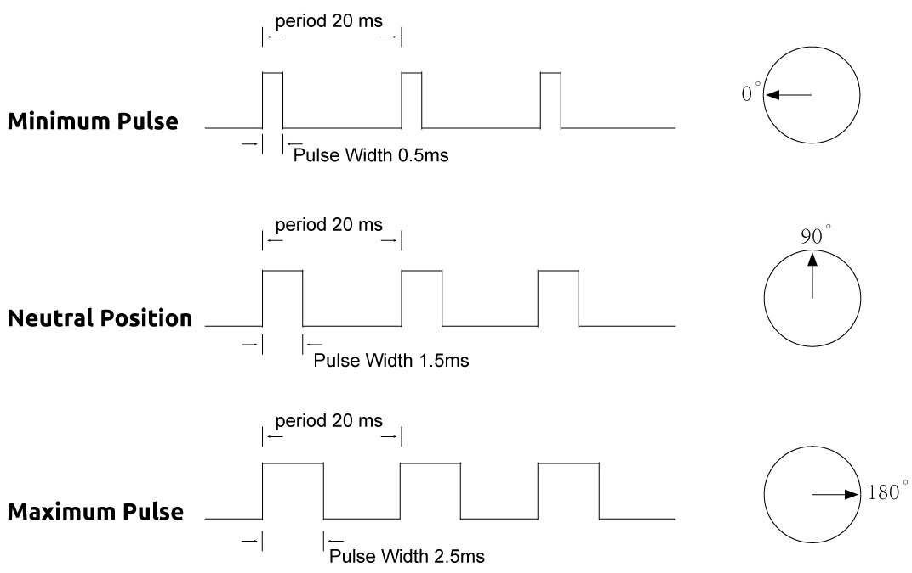

.. note::

    Hello, welcome to the SunFounder Raspberry Pi & Arduino & ESP32 Enthusiasts Community on Facebook! Dive deeper into Raspberry Pi, Arduino, and ESP32 with fellow enthusiasts.

    **Why Join?**

    - **Expert Support**: Solve post-sale issues and technical challenges with help from our community and team.
    - **Learn & Share**: Exchange tips and tutorials to enhance your skills.
    - **Exclusive Previews**: Get early access to new product announcements and sneak peeks.
    - **Special Discounts**: Enjoy exclusive discounts on our newest products.
    - **Festive Promotions and Giveaways**: Take part in giveaways and holiday promotions.

    👉 Ready to explore and create with us? Click [|link_sf_facebook|] and join today!

14. Play Dinosaur Game
=========================

Ever tried your hand at the addictive Dinosaur game on Chrome when offline? Many have spent countless minutes trying to beat their own high scores, relying solely on quick reflexes. But what if you could engineer a way to smash those high scores without breaking a sweat? 

This lesson will transform how you play the game by integrating simple electronics like photoresistor and servo to automate gameplay. It's not just about playing the game; it's about rewriting the rules!

.. raw:: html

    <video width="600" loop autoplay>
        <source src="_static/video/14_dinosaur_game.mp4" type="video/mp4">
        Your browser does not support the video tag.
    </video>

By the end of this lesson, you will be able to:

* Identify and describe the functions of servo and photoresistor.
* Construct a basic circuit using Arduino, integrating servos and photoresistors effectively.
* Write and upload Arduino code that controls servo movements based on photoresistor readings.
* Use the assembled circuit and programmed Arduino to automatically play the Chrome Dinosaur game.

1. Components Needed
-----------------------

.. list-table:: 
   :widths: 25 25 25 25
   :header-rows: 0

   * - 1 * Arduino Uno R3
     - 1 * Photoresistor
     - 1 * 10KΩ Resistor
     - 1 * Servo
   * - |components_uno_r3| 
     - |components_photoresistor| 
     - |components_10kohm| 
     - |components_servo| 
   * - 1 * USB Cable
     - 1 * Breadboard
     - Jumper Wires
     - 1 * Multimeter
   * - |components_usb_cable| 
     - |components_breadboard| 
     - |components_wire| 
     - |components_meter|
   * - 1 * Breadboard Power Module
     - 1 * 9V Battery
     - 1 * Battery Cable
     - 
   * - |components_breadboard_power_module| 
     - |components_9v_battery| 
     - |components_battery_cable| 
     -

.. _ar_servo_usage:

2. Prepare the Servo
-----------------------

**1. Introduce the Servo**

.. image:: img/14_servo_pic.jpg
    :width: 300
    :align: center

A servo is generally composed of the following parts: case, shaft, gear system, potentiometer, DC motor, and embedded board.

It works like this: 

* The microcontroller sends out PWM signals to the servo, and then the embedded board in the servo receives the signals through the signal pin and controls the motor inside to turn. 
* As a result, the motor drives the gear system and then moves the shaft after deceleration. 
* The shaft and potentiometer of the servo are connected together. When the shaft rotates, it drives the potentiometer, so the potentiometer outputs a voltage signal to the embedded board. 
* Then the board determines the direction and speed of rotation based on the current position, so it can stop exactly at the right position as defined and hold there.

.. image:: img/14_servo_internal.png
    :width: 500
    :align: center

Servo positioning is controlled through Pulse Width Modulation (PWM):

* The servo receives a pulse every 20 ms, with the pulse duration determining the motor's rotation.
* A 1.5ms pulse aligns the motor at the 90-degree neutral position.
* Pulses shorter than 1.5 ms rotate the servo counterclockwise from neutral, while longer pulses rotate it clockwise.
* Pulse widths typically range from 0.5 ms (minimum) to 2.5 ms (maximum) to command valid servo positions.

**2. Building the Circuit**

Now let's start building the circuit. 

* First, insert the breadboard power module into the breadboard, then use a jumper wire to connect the negative rail of the breadboard to the GND of the Arduino Uno R3 to achieve a common ground.

.. image:: img/14_dinosaur_power_module.png
    :width: 400
    :align: center

.. note::

    The order of the positive and negative terminals on the breadboard in the wiring diagram is reversed compared to the breadboard provided in the kit.

    In actual wiring, you need to insert the breadboard power module from the higher number side (60~65) so that the "-" of the power module goes into the negative rail "-" of the breadboard, and the "+" into the positive rail "+".

    .. image:: img/14_dinosaur_plug_power_module.png
        :width: 400
        :align: center

* Use three short jumper wires to extend the three wires of your servo: connect the yellow wire to pin 9 of the Arduino Uno R3, the red wire to the positive rail of the breadboard, and the brown wire to the negative rail of the breadboard.

.. image:: img/14_dinosaur_servo.png
    :width: 600
    :align: center

**3. Writing the Code**

Now let's write the code to see how to drive the servo.

1. Open the Arduino IDE and start a new project by selecting “New Sketch” from the “File” menu.
2. Save your sketch as ``Lesson14_Servo`` using ``Ctrl + S`` or by clicking “Save”.

3. Include the Servo Library.

In Arduino programming, there are some functions that are built into the core Arduino environment and can be used directly, such as ``pinMode()``, ``digitalWrite()``, ``analogWrite()`` that we have used in previous lessons.

However, some specialized functions are part of libraries that need to be included before you can use them. For example, ``Servo``, ``LiquidCrystal``, ``Stepper``, etc., which you can find on the Arduino website's |link_arduino_lib_page| page.

To control the servo, we need to include the ``Servo`` library, which provides functions to control the motor.

.. code-block:: Arduino
    :emphasize-lines: 1

    #include <Servo.h>

    void setup() {
        // put your setup code here, to run once:

    }

4. Create an instance of the ``Servo`` class to control the servo and define the pin for the Servo.

.. code-block:: Arduino
    :emphasize-lines: 3,5

    #include <Servo.h>

    Servo myServo;  // Create a Servo object

    const int servoPin = 9;         // servo connected to digital pin 9

5. In the ``void setup()`` function, use the ``attach()`` function from the ``Servo`` library to attach the servo object to the specified pin.

* ``servo.attach(pin)``: Attach the Servo variable to a pin.

    **Parameters**

    * ``servo``: a variable of type Servo.
    * ``pin``: the number of the pin that the servo is attached to.

.. code-block:: Arduino
    :emphasize-lines: 2,3

    void setup() {
        myServo.attach(servoPin);  // Attach the Servo object to the specified pin
    }

6. Set the initial position of the servo to 0 degrees with ``write()`` in Servo library. 

* ``servo.write(angle)``: Writes a value to the servo, controlling the shaft accordingly.

    Parameters

    * ``servo``: a variable of type Servo.
    * ``angle``: the value to write to the servo, from 0 to 180.

.. code-block:: Arduino
    :emphasize-lines: 9

    #include <Servo.h>

    Servo myServo;  // Create a Servo object

    const int servoPin = 9;         // servo connected to digital pin 9

    void setup() {
        myServo.attach(servoPin);  // Attach the Servo object to the specified pin
        myServo.write(0);          // Initial position set to 0 degrees
    }

    void loop() {
        // put your main code here, to run repeatedly:

    }

7. Now that the code is complete, click the Upload button to transfer the code to your Arduino Uno R3 board. Locate a two-sided servo arm in your servo package and attach it so that it is parallel to the servo.

.. image:: img/14_servo_arm.png
    :width: 600
    :align: center

**3. Adjusting the Servo Angle**

Since the servo arm needs to press the space bar on the keyboard, you need to attach the servo in a specific position and then use code to control the servo arm to press the space bar.

1. Tape the servo next to your keyboard, with the servo shaft above the space bar. Use strong tape to ensure the servo does not loosen when the shaft moves.

.. image:: img/14_attach_servo.png
    :width: 500
    :align: center

2. Continue with the above code. In the ``void loop()`` function, use the ``write()`` function to set the servo to 30 degrees.

.. code-block:: Arduino
    :emphasize-lines: 14

    #include <Servo.h>

    Servo myServo;  // Create a Servo object

    const int servoPin = 9;         // servo connected to digital pin 9

    void setup() {
        myServo.attach(servoPin);  // Attach the Servo object to the specified pin
        myServo.write(0);          // Initial position set to 0 degrees
    }

    void loop() {
        // put your main code here, to run repeatedly:
        myServo.write(30);          // Set to 30 degrees
    }

3. Now upload the code to the Arduino board. Observe the angle of the servo shaft to see if it presses the space bar and that the servo body is not lifted.

.. note::

    Everyone's keyboard height varies, so you need to adjust accordingly. After each adjustment, upload the code to make it effective.
    
    * If the space bar is not pressed, increase the servo angle.
    * If the space bar is pressed but the servo body is lifted, decrease the angle.

.. image:: img/14_servo_30.png
    :width: 500
    :align: center

4. Now write the code to make the servo repeatedly move between 0 and 30 degrees.

.. code-block:: Arduino
    :emphasize-lines: 13-16

    #include <Servo.h>

    Servo myServo;  // Create a Servo object

    const int servoPin = 9;         // servo connected to digital pin 9

    void setup() {
        myServo.attach(servoPin);  // Attach the Servo object to the specified pin
        myServo.write(0);          // Initial position set to 0 degrees
    }

    void loop() {
        myServo.write(30);  // Set servo to 30 degrees
        delay(100);         // delay 100ms
        myServo.write(0);   // Set servo at 0 degrees
        delay(100);         // delay 100ms
    }

5. After uploading the code, check if the servo can press the space bar every time. If it can, the servo is ready.

.. raw:: html

    <video width="600" loop autoplay>
        <source src="_static/video/14_servo_range.mp4" type="video/mp4">
        Your browser does not support the video tag.
    </video>

.. _ar_photoresistor:

3. Ready the Photoresistor
--------------------------------

**1. Introduction and Measurement of the Photoresistor**

1. Start with a Photoresistor.

.. image:: img/17_photoresistor.png
    :width: 100
    :align: center

A photoresistor or photocell is a light-controlled variable resistor. The resistance of a photoresistor decreases with increasing incident light intensity; in other words, it exhibits photoconductivity.

Photoresistors can be used as resistive semiconductors in light-sensitive detector circuits and in light-activated and dark-activated switching circuits. In darkness, the resistance of a photoresistor can be as high as several megaohms (MΩ), while in lighted conditions, it can drop to a few hundred ohms.

The kit includes a resistor rated at 10K at 25°C. Now, use a multimeter to measure the resistance of the photoresistor under normal light, illuminated, and dark conditions.

2. You need to use two DuPont wires to extend the photoresistor.

.. image:: img/14_pho_wire.png
    :width: 500
    :align: center

If you are not sure how to connect it, you can watch the following video.

.. raw:: html

    <video width="600" loop muted>
        <source src="_static/video/14_pho_wire.mp4" type="video/mp4">
        Your browser does not support the video tag.
    </video>

3. Since the rated resistance of the photoresistor is 10K, set the multimeter to measure resistance in the 20 kilo-ohm (20K) range.

.. image:: img/multimeter_20k.png
    :width: 300
    :align: center

4. Insert the photoresistor into the breadboard. The pins are non-directional and can be inserted freely.

5. Now, touch the two pins of the photoresistor with the red and black test leads of the multimeter.

.. image:: img/14_dinosaur_pho_multimeter.png
    :width: 600
    :align: center

6. Read the resistance value under the current ambient light and record it in the table below.

.. list-table::
   :widths: 20 20
   :header-rows: 1

   * - Environment
     - Resistance (kilohm)
   * - Normal Light
     - *5.48*
   * - Bright Light
     -
   * - Darkness
     -

7. Now, have a friend help by shining a flashlight or another light source directly on the photoresistor, record the resistance value, which might be just a few hundred ohms. Therefore, you might need to set the multimeter to 2K, or even to 200 ohms for a more precise reading.

.. note::

    We've set the resistance unit in the table to kilohms. 1 kilohm (kΩ) = 1000 ohms.

    If you chose the 200 ohm range and got a reading of 164.5 ohms, convert it to 0.16 kilohms (rounding recommended to two decimal places), and enter the converted value in the table.

.. list-table::
   :widths: 20 20
   :header-rows: 1

   * - Environment
     - Resistance (kilohm)
   * - Normal Light
     - *≈5.48*
   * - Bright Light
     - *≈0.16*
   * - Darkness
     - 

8. For dark conditions, the resistance of the photoresistor can reach several megaohms, so we need to set the multimeter to the 2 megaohm position.

.. image:: img/multimeter_2mΩ.png
    :width: 300
    :align: center

9. Completely cover the photoresistor with a black object, then record the measured resistance in the table.

.. note::
    We have set the resistance unit in the table to kilohms. 1 megohm (MΩ) = 1000 kilohms.

    If you chose the 2 megaohm range and obtained a reading of 1.954 megohms, convert it to 1954 kilohms, which is the value you should enter.

    If the reading is directly higher than 2MΩ, it will display "1.", at which point you can directly enter 2 megohms, or you might consider using a more precise multimeter to measure the exact value.

.. list-table::
   :widths: 20 20
   :header-rows: 1

   * - Environment
     - Resistance (kilohm)
   * - Normal Light
     - *≈5.48*
   * - Bright Light
     - *≈0.16*
   * - Darkness
     - *≈1954*

From the measurements, we have confirmed the photoconductive properties of the photoresistor: the stronger the light, the lower the resistance; the dimmer the light, the higher the resistance, which can reach several megaohms.

**2. Build the Circuit**

1. Continue building the circuit. Connect one pin of the photoresistor to the negative terminal of the breadboard and the other pin to the A0 pin on the Arduino Uno R3.

2. Insert a 10K resistor in the same row as the photoresistor's connection to A0.

.. image:: img/14_dinosaur_resistor.png
    :width: 600
    :align: center

In this circuit, the 10K resistor and the photoresistor are connected in series, and the current passing through them is the same. The 10K resistor acts as a protection, and the A0 pin reads the value after the voltage conversion of the photoresistor.

When the light is enhanced, the resistance of the photoresistor decreases, then its voltage decreases, so the value from the A0 pin will decrease; if the light is strong enough, the resistance of the photoresistor will be close to 0, and the value of the A0 pin will be close to 0. At this time, the 10K resistor plays a protective role, preventing a short circuit by keeping the 5V and GND from being directly connected.

If you place the photoresistor in a dark situation, the value of the A0 pin will increase. In a dark enough situation, the resistance of the photoresistor will be infinite, and its voltage will be close to 5V (the 10K resistor becomes negligible), and the value of the A0 pin will be close to 1023.

3. Connect the other pin of the 10K resistor to the positive terminal of the breadboard.

**3. Writing the Code**

Here, you need to read the photoresistor values.

1. Open the sketch you saved earlier, ``Lesson14_Servo``. Hit “Save As...” from the “File” menu, and rename it to ``Lesson14_Photoresistor``. Click "Save".

2. First, initialize the pin for the photoresistor.

.. code-block:: Arduino
    :emphasize-lines: 6

    #include <Servo.h>

    Servo myServo;  // Create a Servo object

    const int servoPin = 9;         // Servo motor connected to digital pin 9
    const int lightSensorPin = A0;  // Light sensor connected to analog pin A0

3. We need to use the serial monitor to print the values from the photoresistor, so initialize serial communication at a baud rate of 9600 in ``void setup()``.

.. code-block:: Arduino
    :emphasize-lines: 9

    #include <Servo.h>

    Servo myServo;  // Create a Servo object

    const int servoPin = 9;  // servo connected to digital pin 9
    const int lightSensorPin = A0;  // Light sensor connected to analog pin A0

    void setup() {
        Serial.begin(9600);        // Start serial communication
        myServo.attach(servoPin);  // Attach the Servo object to the specified pin
        myServo.write(0);          // Initial position set to 0 degrees
    }

4. Now, in ``void loop()``, create a variable ``lightValue`` to store the read value from the photoresistor, then print it to the serial monitor.

.. note::

    To avoid interference from the servo, you can comment out the servo-related code using ``Ctrl+/``.

    Keep a ``delay(100)`` to see the data printed in the serial monitor.

.. code-block:: Arduino
    :emphasize-lines: 15-17,22

    #include <Servo.h>

    Servo myServo;  // Create a Servo object

    const int servoPin = 9;  // servo connected to digital pin 9
    const int lightSensorPin = A0;  // Light sensor connected to analog pin A0
    
    void setup() {
        Serial.begin(9600);        // Start serial communication
        myServo.attach(servoPin);  // Attach the Servo object to the specified pin
        myServo.write(0);          // Initial position set to 0 degrees
    }

    void loop() {
        int lightValue = analogRead(lightSensorPin);  // Read the value from the light sensor
        Serial.print("Light Sensor Value: ");
        Serial.println(lightValue);  // Print the light sensor value to the Serial Monitor

        // myServo.write(30);  // Set servo to 30 degrees
        // delay(100);         // delay 100ms
        // myServo.write(0);   // Set servo at 0 degrees
        delay(100);         // delay 100ms
    }

5. Now, upload the code to the Arduino Uno R3 to see the printed data.

**4. Viewing the Data**

You need to open the Dinosaur Game on Chrome's offline page and use the photoresistor to detect the difference in data between the blank space and the black cactus icon to set a threshold. This way, you can determine whether a black cactus is detected by comparing the value to the threshold.

Open Google Chrome, enter ``chrome://dino/``. You will see a prompt saying “Press space to play”. Press the space bar and let the dinosaur hit a black cactus to get a stable screen.

.. image:: img/14_dinosaur_google.png
    :width: 600
    :align: center

2. Open Google Chrome and Arduino IDE side by side.

.. image:: img/14_dinosaur_google_arduino.png
    :width: 600
    :align: center

3. Now, place the breadboard on the computer screen and use the photoresistor to detect the value printed in the serial monitor on the white space. Mine is around 268.

.. note::

    * Ensure the photoresistor is fully against the computer screen.
    * It is recommended to set the screen brightness to the maximum for the best contrast value.

.. image:: img/14_dinosaur_read_pho_white.png

4. Now, move the photoresistor to the place where the dinosaur is and record the printed value. Mine is around 355.

.. image:: img/14_dinosaur_read_pho_black.png

5. You can press the space bar to let the game run and test several times to see the values you get in the blank space and on the black cactus.

.. note::

    * Based on my test results, I would set the threshold to 310(Any value between 268 and 355 is acceptable, but it is best to set a median value.). 
    * If the value from the photoresistor is greater than 310, it means it detects the black cactus icon; otherwise, it detects the blank space.

Now the photoresistor is ready, and you can proceed to the next step of combining the servo and the photoresistor to play the dinosaur game.

4. Play Dinosaur Game
--------------------------
Here, we need to attach the photoresistor in a suitable position on the computer screen and then write code to make the servo turn based on the value of the photoresistor. For example, when the value of the photoresistor exceeds 310, the servo should turn to 30 degrees; otherwise, it should remain at 0 degrees.

Let's see how to do it.

**1. Writing the Code**

Open the sketch you saved earlier, ``Lesson14_Photoresistor``. Hit “Save As...” from the “File” menu, and rename it to ``Lesson14_Dinosaur_Game``. Click "Save".

In ``void loop()``, use an ``if else`` statement to set the conditions for the servo's movement.

As determined in the previous step, when the photoresistor value exceeds 310, indicating a black cactus icon is detected, the servo needs to turn to 30 degrees to press the space bar and make the dinosaur jump over the cactus.

.. code-block:: Arduino
    :emphasize-lines: 19-24

    #include <Servo.h>

    Servo myServo;  // Create a Servo object

    const int servoPin = 9;         // Servo motor connected to digital pin 9
    const int lightSensorPin = A0;  // Light sensor connected to analog pin A0

    void setup() {
        Serial.begin(9600);        // Start serial communication
        myServo.attach(servoPin);  // Attach the Servo object to the specified pin
        myServo.write(0);          // Initial position set to 0 degrees
    }

    void loop() {
        int lightValue = analogRead(lightSensorPin);  // Read the value from the light sensor
        // Serial.print("Light Sensor Value: ");
        // Serial.println(lightValue);  // Print the light sensor value to the Serial Monitor

        if (lightValue > 310) {
            myServo.write(30);  // If the light sensor value is greater than 310, move the servo to 30 degrees
            delay(50);
        } else {
            myServo.write(0);  // Otherwise, keep the servo at 0 degrees
        }
    }

3. Now you can upload the code to the Arduino Uno R3.

**2. Attaching the Photoresistor**

The position of the photoresistor will affect the gaming experience.

* If it's too close to the dinosaur, the cactus is detected too late, and the dinosaur doesn't have enough time to jump.
* If it's too far from the dinosaur, it jumps too early after detecting the cactus.
* The height from the horizontal line affects the sensitivity of detecting the black cactus.

Now attach the photoresistor in a position using tape. Press the space bar to start the game and see if the dinosaur can jump over the black cactus. If it doesn't jump over, move the breadboard a bit to the right; if it jumps too early, move it a bit to the left. Adjust back and forth multiple times to find the best position.

Now you can press the space bar to start playing the Dinosaur Game.

.. raw:: html

    <video width="600" loop>
        <source src="_static/video/14_dinosaur_game.mp4" type="video/mp4">
        Your browser does not support the video tag.
    </video>

**Summary**

In this engaging lesson, we embarked on a journey from understanding the basics of servos and photoresistors to creating a setup that plays the Chrome Dinosaur game on its own. We learned to assemble a circuit that interprets light signals with a photoresistor and commands a servo to react accordingly. Our final setup not only tackled the game but adapted to its challenges, marking a fantastic fusion of simple gaming and the basics of electronic automation. By automating the Dinosaur game, we've stepped into the basics of robotic controls and sensors, paving the way for more complex and exciting projects in the future.

