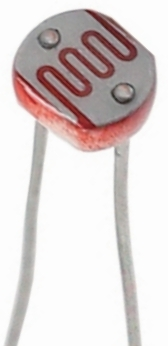

.. note::

    こんにちは、SunFounderのRaspberry Pi & Arduino & ESP32 Enthusiasts Community（Facebook）へようこそ！このコミュニティで、Raspberry Pi、Arduino、ESP32について他のエンスージアストと共にさらに深く学びましょう。

    **参加する理由**

    - **専門家のサポート**：購入後の問題や技術的な課題を、コミュニティやチームの助けを借りて解決しましょう。
    - **学びと共有**：スキルを向上させるためのヒントやチュートリアルを交換しましょう。
    - **限定プレビュー**：新製品の発表や先行公開にいち早くアクセスできます。
    - **特別割引**：最新製品に対する限定割引をお楽しみください。
    - **フェスティバルプロモーションとギブアウェイ**：ギブアウェイやホリデープロモーションに参加しましょう。

    👉 私たちと一緒に探求し、創造する準備ができましたか？[|link_sf_facebook|]をクリックして、今日参加しましょう！

14. 恐竜ゲームをプレイ
=========================

オフライン時にChromeで楽しむ中毒性のある恐竜ゲームをプレイしたことがありますか？多くの人が自分のハイスコアを超えるために、素早い反射神経を駆使して数分を費やしてきました。しかし、汗をかかずにハイスコアを叩き出す方法をエンジニアリングできたらどうでしょう？

このレッスンでは、フォトレジスタやサーボなどの簡単なエレクトロニクスを組み合わせて、ゲームプレイを自動化する方法を紹介します。ただゲームをプレイするだけでなく、ルールを再定義するのです！

.. raw:: html

     <video controls style = "max-width:90%">
        <source src="_static/video/14_dinosaur_game.mp4" type="video/mp4">
        Your browser does not support the video tag.
    </video>

このレッスンを終える頃には、以下のことができるようになっています：

* サーボとフォトレジスタの機能を識別し、説明することができる。
* Arduinoを使用して、サーボとフォトレジスタを効果的に統合した基本的な回路を構築できる。
* フォトレジスタの読み取りに基づいてサーボの動きを制御するArduinoコードを書いてアップロードできる。
* 組み立てた回路とプログラム済みのArduinoを使って、Chromeの恐竜ゲームを自動的にプレイできる。

1. 必要なコンポーネント
-----------------------

.. list-table:: 
   :widths: 25 25 25 25
   :header-rows: 0

   * - 1 * Arduino Uno R3
     - 1 * フォトレジスタ
     - 1 * 10KΩ抵抗
     - 1 * サーボモーター
   * - |list_uno_r3| 
     - |list_photoresistor| 
     - |list_10kohm| 
     - |list_servo| 
   * - 1 * USBケーブル
     - 1 * ブレッドボード
     - ジャンパーワイヤー
     - 1 * マルチメーター
   * - |list_usb_cable| 
     - |list_breadboard| 
     - |list_wire| 
     - |list_meter|
   * - 1 * ブレッドボードパワーモジュール
     - 1 * 9Vバッテリー
     - 1 * バッテリーケーブル
     - 
   * - |list_power_module| 
     - |list_battery| 
     - |list_bat_cable| 
     -

.. _ar_servo_usage:

2. サーボの準備
-----------------------

**1. サーボの紹介**

.. image:: img/14_servo_pic.jpg
    :width: 300
    :align: center

サーボは通常、ケース、シャフト、ギアシステム、ポテンショメータ、DCモーター、および埋め込みボードで構成されています。

動作の仕組みは次のとおりです：

* マイクロコントローラがサーボにPWM信号を送信し、サーボ内の埋め込みボードが信号ピンを通じて信号を受信し、内部のモーターを制御して回転させます。
* その結果、モーターがギアシステムを駆動し、減速後にシャフトを動かします。
* サーボのシャフトとポテンショメータは一緒に接続されており、シャフトが回転するとポテンショメータを駆動し、ポテンショメータは埋め込みボードに電圧信号を出力します。
* 次に、ボードは現在の位置に基づいて回転の方向と速度を決定し、定義された位置で正確に停止してそこに保持されます。

.. image:: img/14_servo_internal.png
    :width: 500
    :align: center

サーボの位置制御はパルス幅変調（PWM）を通じて行われます：

* サーボは20msごとにパルスを受信し、パルスの長さがモーターの回転を決定します。
* 1.5msのパルスはモーターを90度のニュートラル位置に合わせます。
* 1.5ms未満のパルスはニュートラルから反時計回りに回転させ、長いパルスは時計回りに回転させます。
* 通常、パルス幅は0.5ms（最小）から2.5ms（最大）の範囲で、これにより有効なサーボの位置が指示されます。

.. image:: img/14_servo_duty.png
    :width: 600
    :align: center

**2. 回路の構築**

さあ、回路を作り始めましょう。

* まず、ブレッドボードにパワーモジュールを挿入し、ジャンパーワイヤーを使用してブレッドボードの負のレールをArduino Uno R3のGNDに接続して、共通のグランドを確保します。

.. image:: img/14_dinosaur_power_module.png
    :width: 400
    :align: center

.. note::

    配線図のブレッドボード上の正負端子の順序は、キットに含まれるブレッドボードとは逆になっています。

    実際の配線では、ブレッドボードのパワーモジュールを番号の高い側（60～65）から挿入し、パワーモジュールの"-"がブレッドボードの負のレール"-"に、"+"が正のレール"+"に入るようにします。

    .. raw:: html

        <video controls style = "max-width:100%">
            <source src="_static/video/about_power_module.mp4" type="video/mp4">
            Your browser does not support the video tag.
        </video>

* サーボの3本のワイヤーを短いジャンパーワイヤーで延長し、黄色いワイヤーをArduino Uno R3のピン9に、赤いワイヤーをブレッドボードの正のレールに、茶色いワイヤーをブレッドボードの負のレールに接続します。

.. image:: img/14_dinosaur_servo.png
    :width: 600
    :align: center

**3. コードの作成**

では、サーボを駆動するためのコードを書いてみましょう。

1. Arduino IDEを開き、「ファイル」メニューから「新しいスケッチ」を選択して、新しいプロジェクトを開始します。
2. スケッチを ``Ctrl + S`` で保存するか、「保存」をクリックして ``Lesson14_Servo`` として保存します。

3. サーボライブラリをインクルードします。

Arduinoプログラミングでは、 ``pinMode()`` , ``digitalWrite()``, ``analogWrite()`` など、コアのArduino環境に組み込まれている関数があり、これらは直接使用できますが、特殊な機能を提供するいくつかの関数はライブラリの一部であり、それらを使用する前にインクルードする必要があります。例えば、 ``Servo`` , ``LiquidCrystal`` , ``Stepper`` などがあり、これらはArduinoの公式サイトの |link_arduino_lib_page| ページで見つけることができます。

サーボを制御するためには、モーターを制御するための関数を提供する ``Servo`` ライブラリをインクルードする必要があります。

.. code-block:: Arduino
    :emphasize-lines: 1

    #include <Servo.h>

    void setup() {
        // 初期設定をここに記述します。最初に一度だけ実行されます。

    }

4. ``Servo`` クラスのインスタンスを作成し、サーボを制御するピンを定義します。

.. code-block:: Arduino
    :emphasize-lines: 3,5

    #include <Servo.h>

    Servo myServo;  // サーボオブジェクトを作成します。

    const int servoPin = 9;  // サーボをデジタルピン9に接続します。

5. ``void setup()`` 関数内で、 ``Servo`` ライブラリの ``attach()`` 関数を使用して、サーボオブジェクトを指定したピンに接続します。

* ``servo.attach(pin)`` : サーボ変数をピンに接続します。

    **パラメータ**

    * ``servo`` : Servo型の変数。
    * ``pin`` : サーボが接続されているピン番号。

.. code-block:: Arduino
    :emphasize-lines: 2,3

    void setup() {
        myServo.attach(servoPin);  // Attach the Servo object to the specified pin
    }

6. Servoライブラリの ``write()`` を使用して、サーボの初期位置を0度に設定します。

* ``servo.write(angle)`` : サーボに値を書き込み、シャフトを対応する角度に制御します。

    **パラメータ**

    * ``servo`` : Servo型の変数。
    * ``angle`` : サーボに書き込む値（0～180）。

.. code-block:: Arduino
    :emphasize-lines: 9

    #include <Servo.h>

    Servo myServo;  // サーボオブジェクトを作成します。

    const int servoPin = 9;  // サーボをデジタルピン9に接続します。

    void setup() {
        myServo.attach(servoPin);  // 指定したピンにサーボオブジェクトを接続します。
        myServo.write(0);  // 初期位置を0度に設定します。
    }

    void loop() {
        // 繰り返し実行されるメインコードをここに記述します。

    }

7. コードが完成したら、Uploadボタンをクリックして、コードをArduino Uno R3ボードに転送します。サーボパッケージに付属の両面サーボアームを取り付け、サーボに対して平行になるようにしてください。

**質問**

サーボがArduinoのピン8または他のPWM非対応のピンに接続されている場合、それでも正しく動作しますか？その理由を説明してください。

最初にテストしてから回答してください。

**3. サーボ角度の調整**

サーボアームがキーボードのスペースキーを押す必要があるため、特定の位置にサーボを取り付け、コードでサーボアームを制御してスペースキーを押すようにします。

1. サーボシャフトをスペースキーの上に置き、キーボードの横にサーボをテープで固定します。シャフトが動いてもサーボが緩まないように強力なテープを使用してください。

2. 上記のコードを続行します。 ``void loop()`` 関数内で、 ``write()`` 関数を使用して、サーボを30度に設定します。

.. code-block:: Arduino
    :emphasize-lines: 14

    #include <Servo.h>

    Servo myServo;  // Create a Servo object

    const int servoPin = 9;         // servo connected to digital pin 9

    void setup() {
        myServo.attach(servoPin);  // Attach the Servo object to the specified pin
        myServo.write(0);          // Initial position set to 0 degrees
    }

    void loop() {
        // put your main code here, to run repeatedly:
        myServo.write(30);          // Set to 30 degrees
    }

3. これでコードをArduinoボードにアップロードします。サーボシャフトの角度を観察し、それがスペースキーを押しているか、サーボ本体が持ち上がっていないかを確認してください。

.. note::

    キーボードの高さは人によって異なるため、適宜調整が必要です。調整後はコードをアップロードして有効にしてください。
    
    * スペースキーが押されていない場合は、サーボ角度を増やしてください。
    * スペースキーが押されているが、サーボ本体が持ち上がっている場合は、角度を減らしてください。

.. image:: img/14_servo_30.png
    :width: 500
    :align: center

4. 次に、サーボが0度から30度の間を繰り返し動作するコードを書きます。

.. code-block:: Arduino
    :emphasize-lines: 13-16

    #include <Servo.h>

    Servo myServo;  // Create a Servo object

    const int servoPin = 9;         // servo connected to digital pin 9

    void setup() {
        myServo.attach(servoPin);  // Attach the Servo object to the specified pin
        myServo.write(0);          // Initial position set to 0 degrees
    }

    void loop() {
        myServo.write(30);  // Set servo to 30 degrees
        delay(100);         // delay 100ms
        myServo.write(0);   // Set servo at 0 degrees
        delay(100);         // delay 100ms
    }

5. コードをアップロードした後、サーボが毎回スペースキーを押せるかどうか確認してください。押せるならば、サーボの準備は完了です。

.. .. raw:: html

..     <video width="600" loop autoplay>
..         <source src="_static/video/14_servo_range.mp4" type="video/mp4">
..         Your browser does not support the video tag.
..     </video>

.. _ar_photoresistor:

3. 光抵抗器の準備
--------------------------------

**1. 光抵抗器の紹介と測定**

1. 光抵抗器から始めましょう。

光抵抗器またはフォトセルは、光制御型の可変抵抗器です。光抵抗器の抵抗値は、入射光の強度が増加するにつれて減少します。つまり、光導電性を示します。

光抵抗器は、光感知検出回路や光作動および暗作動スイッチ回路の中で抵抗性半導体として使用できます。暗い環境では、光抵抗器の抵抗は数メガオーム（MΩ）に達することがあり、明るい環境では数百オームまで低下します。

キットには、25°Cで10KΩの抵抗が含まれています。次に、マルチメータを使用して、通常の光、照明された状態、暗い状態での光抵抗器の抵抗を測定します。

2. 光抵抗器を拡張するために、2本のデュポンワイヤーを使用する必要があります。

接続方法が不明な場合は、以下のビデオをご覧ください。

.. raw:: html

    <video width="600" loop muted>
        <source src="_static/video/14_pho_wire.mp4" type="video/mp4">
        Your browser does not support the video tag.
    </video>

3. 光抵抗器の公称抵抗値が10KΩなので、マルチメータを20キロオーム（20KΩ）範囲で抵抗を測定するように設定します。

.. image:: img/multimeter_20k.png
    :width: 300
    :align: center

4. 光抵抗器をブレッドボードに挿入します。ピンには方向性がないため、自由に挿入できます。

.. image:: img/14_dinosaur_pho.png
    :width: 600
    :align: center

5. 次に、光抵抗器の2本のピンに、マルチメータの赤と黒のテストリードを接触させます。

.. image:: img/14_dinosaur_pho_multimeter.png
    :width: 600
    :align: center

6. 現在の環境光下での抵抗値を読み取り、以下の表に記録します。

.. list-table::
   :widths: 20 20
   :header-rows: 1

   * - 環境
     - 抵抗値（キロオーム）
   * - 通常の光
     - *5.48*
   * - 明るい光
     -
   * - 暗闇
     -

7. 友人に手伝ってもらい、懐中電灯や他の光源を直接光抵抗器に照射し、抵抗値を記録します。この値は数百オームに過ぎないかもしれません。そのため、マルチメータを2KΩ、またはさらに200Ωに設定して、より正確な測定を行う必要があるかもしれません。

.. note::

    表の抵抗単位をキロオームに設定しました。1キロオーム（kΩ）= 1000オームです。

    200Ωの範囲を選択し、164.5Ωの読み取り値を得た場合、これを0.16キロオームに変換し（小数点以下2桁に丸めることを推奨）、変換した値を表に入力してください。

.. list-table::
   :widths: 20 20
   :header-rows: 1

   * - 環境
     - 抵抗値（キロオーム）
   * - 通常の光
     - *≈5.48*
   * - 明るい光
     - *≈0.16*
   * - 暗闇
     - 

8. 暗い環境では、フォトレジスタの抵抗値が数メガオームに達することがあるため、マルチメータを2メガオームの位置に設定する必要があります。

.. image:: img/multimeter_2mΩ.png
    :width: 300
    :align: center

9. フォトレジスタを黒い物体で完全に覆い、その後、測定された抵抗値を表に記録します。

.. note::
    表の抵抗単位をキロオームに設定しました。1メガオーム（MΩ）= 1000キロオームです。

    2メガオームの範囲を選択し、1.954メガオームの読み取り値を得た場合、それを1954キロオームに変換して、この値を入力してください。

    読み取り値が2MΩを超えて「1.」と表示された場合は、直接2メガオームと入力するか、より正確な値を測定するために、より精密なマルチメータを使用することを検討してください。

.. list-table::
   :widths: 20 20
   :header-rows: 1

   * - 環境
     - 抵抗値（キロオーム）
   * - 通常の光
     - *≈5.48*
   * - 明るい光
     - *≈0.16*
   * - 暗闇
     - *≈1954*

これらの測定から、フォトレジスタの光導電特性を確認しました。光が強くなるほど抵抗値は低くなり、光が弱くなるほど抵抗値は高くなり、数メガオームに達することがあります。

**2. 回路の構築**

1. 回路の構築を続けます。フォトレジスタの片方のピンをブレッドボードの負端子に、もう片方のピンをArduino Uno R3のA0ピンに接続します。

.. image:: img/14_dinosaur_pho_gnd_5v.png
    :width: 600
    :align: center

2. フォトレジスタがA0に接続されているのと同じ列に10KΩ抵抗を挿入します。

この回路では、10KΩ抵抗とフォトレジスタが直列に接続されており、流れる電流は同じです。10KΩ抵抗は保護として機能し、A0ピンはフォトレジスタの電圧変換後の値を読み取ります。

光が強くなると、フォトレジスタの抵抗値が下がり、それに伴い電圧も下がるため、A0ピンの値も下がります。光が十分に強い場合、フォトレジスタの抵抗はほぼ0に近くなり、A0ピンの値もほぼ0に近づきます。このとき、10KΩ抵抗が保護役を果たし、5VとGNDが直接接続されてショートするのを防ぎます。

フォトレジスタを暗い場所に置くと、A0ピンの値が上がります。十分に暗い場合、フォトレジスタの抵抗は無限大になり、その電圧は5Vに近づき（10KΩ抵抗は無視できる）、A0ピンの値は1023に近づきます。

3. 10KΩ抵抗のもう片方のピンをブレッドボードの正端子に接続します。

.. image:: img/14_dinosaur_resistor_vcc.png
    :width: 600
    :align: center

**3. コードの作成**

ここでは、フォトレジスタの値を読み取るコードを作成します。

1. 前に保存したスケッチを開き、 ``Lesson14_Servo`` を選択して「ファイル」メニューから「名前を付けて保存」を選び、 ``Lesson14_Photoresistor`` として保存します。「保存」をクリックします。

2. まず、フォトレジスタ用のピンを初期化します。

.. code-block:: Arduino
    :emphasize-lines: 6

    #include <Servo.h>

    Servo myServo;  // サーボオブジェクトを作成

    const int servoPin = 9;  // サーボモーターをデジタルピン9に接続
    const int lightSensorPin = A0;  // 光センサーをアナログピンA0に接続

3. フォトレジスタからの値を表示するために、 ``void setup()`` 内でシリアル通信を9600のボーレートで初期化します。

.. code-block:: Arduino
    :emphasize-lines: 9

    #include <Servo.h>

    Servo myServo;  // サーボオブジェクトを作成

    const int servoPin = 9;  // サーボをデジタルピン9に接続
    const int lightSensorPin = A0;  // 光センサーをアナログピンA0に接続

    void setup() {
        Serial.begin(9600);  // シリアル通信を開始
        myServo.attach(servoPin);  // 指定したピンにサーボオブジェクトを接続
        myServo.write(0);  // 初期位置を0度に設定
    }

4. ``void loop()`` 内で、フォトレジスタから読み取った値を格納する変数 ``lightValue`` を作成し、それをシリアルモニタに表示します。

.. note::

    サーボからの干渉を避けるために、サーボ関連のコードを ``Ctrl+/`` でコメントアウトできます。

    シリアルモニタに表示されるデータを見るために、 ``delay(100)`` を維持してください。

.. code-block:: Arduino
    :emphasize-lines: 15-17,22

    #include <Servo.h>

    Servo myServo;  // Create a Servo object

    const int servoPin = 9;  // servo connected to digital pin 9
    const int lightSensorPin = A0;  // Light sensor connected to analog pin A0
    
    void setup() {
        Serial.begin(9600);        // Start serial communication
        myServo.attach(servoPin);  // Attach the Servo object to the specified pin
        myServo.write(0);          // Initial position set to 0 degrees
    }

    void loop() {
        int lightValue = analogRead(lightSensorPin);  // Read the value from the light sensor
        Serial.print("Light Sensor Value: ");
        Serial.println(lightValue);  // Print the light sensor value to the Serial Monitor

        // myServo.write(30);  // Set servo to 30 degrees
        // delay(100);         // delay 100ms
        // myServo.write(0);   // Set servo at 0 degrees
        delay(100);         // delay 100ms
    }

5. それでは、コードをArduino Uno R3にアップロードして、データを確認しましょう。

**4. データの確認**

Chromeのオフラインページで恐竜ゲームを開き、フォトレジスタを使用して、白いスペースと黒いサボテンのアイコンとの間のデータの違いを検出し、閾値を設定します。これにより、フォトレジスタの値を閾値と比較することで、黒いサボテンが検出されたかどうかを判断できます。

Google Chromeを開き、 ``chrome://dino/`` と入力します。「スペースキーを押してゲームを開始」と表示されるプロンプトが表示されます。スペースキーを押し、恐竜が黒いサボテンに衝突するまでゲームを進め、画面を安定させます。

2. Google ChromeとArduino IDEを並べて開きます。

.. image:: img/14_dinosaur_google_arduino.png
    :width: 600
    :align: center

3. 次に、ブレッドボードをコンピュータの画面に置き、フォトレジスタを使用してシリアルモニタに表示される白いスペースの値を検出します。私の場合、約268でした。

.. note::

    * フォトレジスタをコンピュータの画面にしっかりと密着させてください。
    * 画面の明るさを最大に設定することで、コントラストが最大化され、最適な値を取得できます。

.. image:: img/14_dinosaur_read_pho_white.png

4. 次に、恐竜がいる場所にフォトレジスタを移動し、表示された値を記録します。私の場合、約355でした。

5. スペースキーを押してゲームを進め、白いスペースと黒いサボテンの上で得られる値を何度かテストしてください。

.. note::

    * テスト結果に基づき、閾値を310に設定することをお勧めします（268と355の間の任意の値で構いませんが、中央値を設定するのが最適です）。 
    * フォトレジスタの値が310を超える場合は、黒いサボテンアイコンが検出されたことを意味し、それ以下の場合は白いスペースが検出されたことを意味します。

フォトレジスタの準備が整ったので、次のステップでサーボとフォトレジスタを組み合わせて恐竜ゲームをプレイします。

4. 恐竜ゲームのプレイ
--------------------------
ここでは、フォトレジスタをコンピュータの画面の適切な位置に取り付け、その値に基づいてサーボが回転するコードを書きます。例えば、フォトレジスタの値が310を超えた場合、サーボは30度に回転してスペースキーを押し、恐竜がサボテンを飛び越えるようにします。それ以外の場合は0度の位置に保ちます。

やり方を見てみましょう。

**1. コードの作成**

前に保存したスケッチを開き、 ``Lesson14_Photoresistor`` を選択して「ファイル」メニューから「名前を付けて保存」を選び、 ``Lesson14_Dinosaur_Game`` として保存します。「保存」をクリックします。

``void loop()``内で、 ``if else`` 文を使用してサーボの動作条件を設定します。

前のステップで確認したように、フォトレジスタの値が310を超えた場合、黒いサボテンアイコンが検出されたことを示し、サーボは30度に回転してスペースキーを押し、恐竜をジャンプさせます。

.. code-block:: Arduino
    :emphasize-lines: 19-24

    #include <Servo.h>

    Servo myServo;  // Create a Servo object

    const int servoPin = 9;         // Servo motor connected to digital pin 9
    const int lightSensorPin = A0;  // Light sensor connected to analog pin A0

    void setup() {
        Serial.begin(9600);        // Start serial communication
        myServo.attach(servoPin);  // Attach the Servo object to the specified pin
        myServo.write(0);          // Initial position set to 0 degrees
    }

    void loop() {
        int lightValue = analogRead(lightSensorPin);  // Read the value from the light sensor
        // Serial.print("Light Sensor Value: ");
        // Serial.println(lightValue);  // Print the light sensor value to the Serial Monitor

        if (lightValue > 310) {
            myServo.write(30);  // If the light sensor value is greater than 310, move the servo to 30 degrees
            delay(50);
        } else {
            myServo.write(0);  // Otherwise, keep the servo at 0 degrees
        }
    }

3. これでコードをArduino Uno R3にアップロードできます。

**2. フォトレジスタの取り付け**

フォトレジスタの位置がゲーム体験に影響を与えます。

* 恐竜に近すぎると、サボテンが遅れて検出され、恐竜がジャンプする時間が足りなくなります。
* 恐竜から遠すぎると、サボテンを検出した後、ジャンプが早すぎます。
* 水平線からの高さが、黒いサボテンを検出する感度に影響を与えます。

テープを使って適切な位置にフォトレジスタを取り付けます。スペースキーを押してゲームを開始し、恐竜が黒いサボテンを飛び越えられるか確認します。飛び越えられない場合は、ブレッドボードを少し右に移動させ、早すぎる場合は少し左に移動させてください。何度も調整して、最適な位置を見つけてください。

これで、スペースキーを押して恐竜ゲームを開始できます。

.. raw:: html

    <video width="600" loop>
        <source src="_static/video/14_dinosaur_game.mp4" type="video/mp4">
        Your browser does not support the video tag.
    </video>

**まとめ**

この楽しいレッスンでは、サーボとフォトレジスタの基本を理解するところから始め、最終的には自動でChromeの恐竜ゲームをプレイする仕組みを作り上げました。光センサーを使用して信号を解釈し、それに応じてサーボを制御する回路を組み立てる方法を学びました。最終的なセットアップは、ゲームに挑戦するだけでなく、ゲームの課題に適応するものでした。これにより、簡単なゲームと電子自動化の基本が融合し、将来のより複雑でエキサイティングなプロジェクトへの道が開けました。

