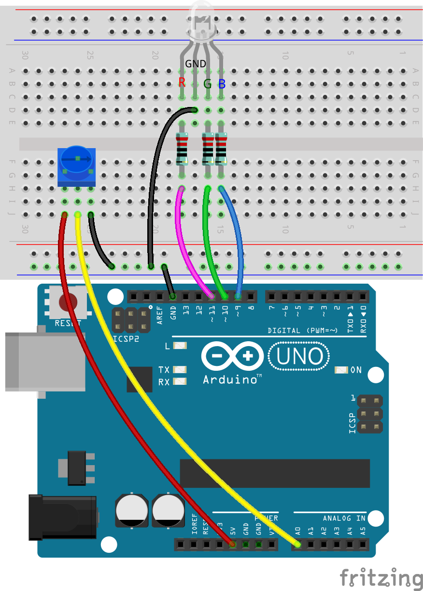
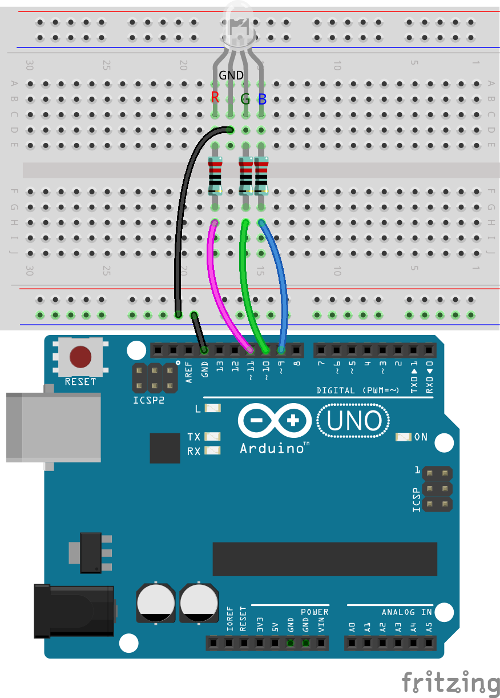
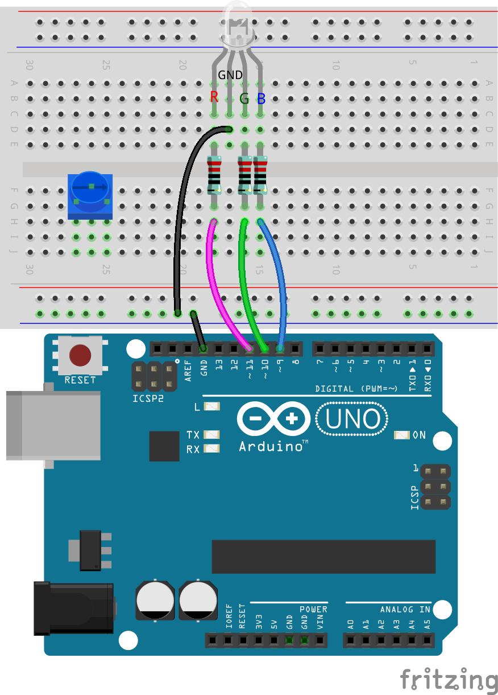
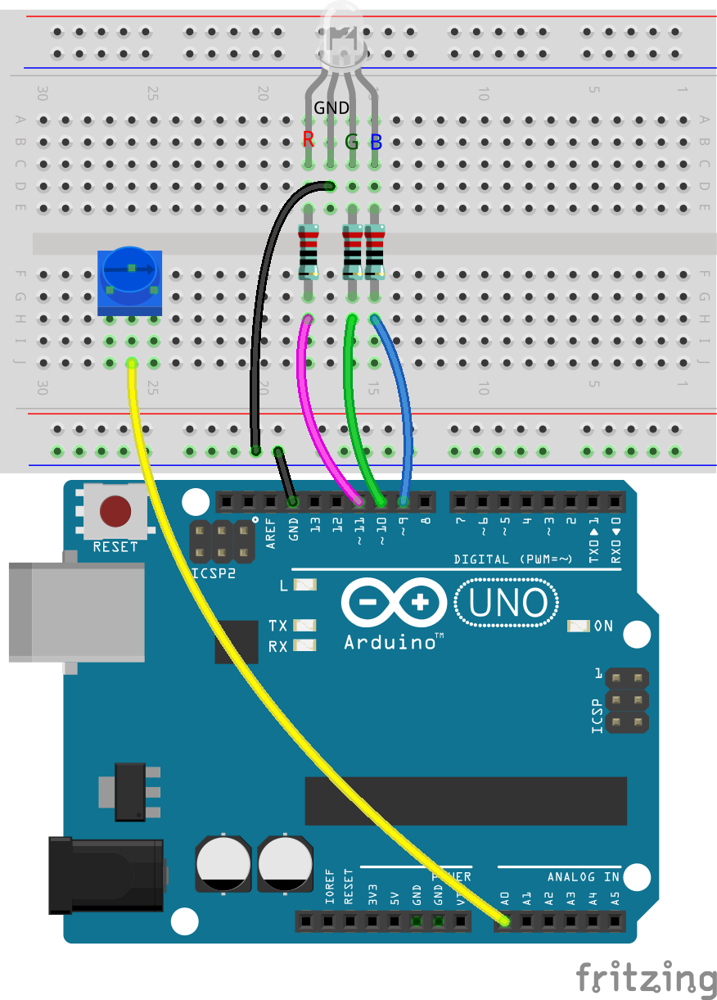
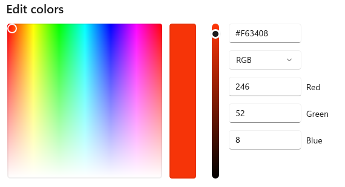
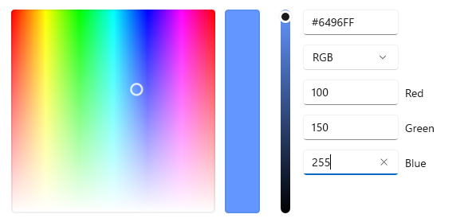
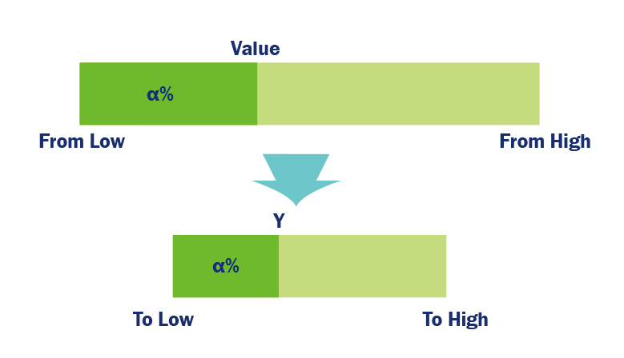

.. note::

    こんにちは、SunFounder Raspberry Pi & Arduino & ESP32 Enthusiasts Communityへようこそ！Facebookでラズベリーパイ、Arduino、ESP32についてさらに深く学び、同じ趣味を持つ仲間たちと一緒に楽しみましょう。

    **なぜ参加するべき？**

    - **専門家サポート**: 購入後の問題や技術的な課題をコミュニティやチームの助けを借りて解決しましょう。
    - **学びと共有**: スキルを向上させるためのヒントやチュートリアルを交換しましょう。
    - **限定プレビュー**: 新製品の発表や先行情報をいち早く入手しましょう。
    - **特別割引**: 最新製品に対する限定割引をお楽しみください。
    - **フェスティバルプロモーションとプレゼント**: プレゼント企画や季節ごとのプロモーションに参加しましょう。

    👉 準備はできましたか？ クリックして[|link_sf_facebook|]、今日から参加しましょう！

15. クールカラーとウォームカラー
====================================

色は視覚体験の一部であるだけでなく、私たちの感情や気持ちにも影響を与えます。このレッスンでは、色の心理的な影響に焦点を当て、RGB LEDを使って光の温度を変化させ、暖かい色と冷たい色を切り替える方法を学びます。

.. raw:: html

    <video muted controls style = "max-width:90%">
        <source src="_static/video/15_cool_warm_color.mp4" type="video/mp4">
        Your browser does not support the video tag.
    </video>

**概要**

クールカラーとウォームカラーの概念は、色が私たちの認識に与える心理的な影響に関連しています。赤、オレンジ、黄色、茶色は通常、温かさや興奮を感じさせ、ウォームカラーとして分類されます。一方、緑、青、紫はしばしば落ち着きやリフレッシュ、広がりの感覚を与え、クールカラーとされます。オレンジと青は、このウォーム・クールのスペクトラムの両極に位置しています。

自宅やリラックスした環境では、ライトイエローやオフホワイトの色調が好まれ、夕日やキャンドルの光を浴びているような居心地の良い雰囲気を作り出します。

図書館、教室、オフィス、病院などでは、集中力やフレッシュさを促進し、作業や学習に適した環境を作るため、よりクールな色調の照明が好まれます。

光の温かさや冷たさは、心理的な反応や視覚的な快適さに直接影響を与えます。デザイナーや照明技術者は、空間の機能や目的に応じた色温度を慎重に選び、美的にも実用的にも優れた照明環境を作り出しています。これらの原則を科学的に応用することで、生活や仕事の環境の質を向上させ、より健康的で快適な雰囲気を作り出すことができます。

このレッスンでは、照明技術者の役割を担い、色温度を切り替えることができる照明システムを構築します。

**学習目標**

- クールカラーとウォームカラーの心理的な影響を理解する。
- 光の温度が気分や環境に与える影響を探る。
- Arduinoを使ってRGB LEDの色を調整し、異なる色温度をシミュレートする方法を学ぶ。
- ``map()`` 関数を使用して色温度を変化させる実践的なスキルを習得する。

回路の構築
------------------------------------

**必要な部品**

.. list-table:: 
   :widths: 25 25 25 25
   :header-rows: 0

   * - 1 * Arduino Uno R3
     - 1 * RGB LED
     - 3 * 220Ω 抵抗
     - 1 * ポテンショメータ
   * - |list_uno_r3| 
     - |list_rgb_led| 
     - |list_220ohm| 
     - |list_potentiometer| 
   * - 1 * USB ケーブル
     - 1 * ブレッドボード
     - ジャンパーワイヤー
     -
   * - |list_usb_cable| 
     - |list_breadboard| 
     - |list_wire| 
     -

**構築手順**

この回路は、Lesson 12の回路にポテンショメータを追加したものです。

1. Arduino Uno R3のGNDピンからRGB LEDのGNDピンに接続されていたジャンパーワイヤーを取り外し、それをブレッドボードの負端子に挿入します。次に、ブレッドボードの負端子からRGB LEDのGNDピンにジャンパーワイヤーを接続します。

2. ポテンショメータをブレッドボードの25G、26F、27Gの穴に挿入します。

3. ポテンショメータの中央ピンをArduino Uno R3のA0ピンに接続します。

4. 最後に、ポテンショメータの左ピンをArduino Uno R3の5Vピンに、右ピンをブレッドボードの負端子に接続します。

Code Creation
---------------------

**暖色と寒色の理解**

色温度を調整する前に、暖色と寒色のRGB値の違いを理解する必要があります。

照明の暖かさの感じ方は主観的な要素もありますが、一般的に、暖色はオレンジから赤の範囲に傾き、寒色は青に傾くべきです。

1. **ペイント** や任意のカラーピッキングツールを開き、最も暖かい色と寒い色を見つけ、そのRGB値をハンドブックに記録してください。

.. note::

    カラーを選択する前に、適切なルーメンに調整することを忘れないでください。

.. list-table::
   :widths: 25 25 50 25
   :header-rows: 1

   * - 色のタイプ
     - 赤
     - 緑
     - 青
   * - 暖色
     -
     -
     -
   * - 寒色
     -
     -
     -

2. ここでは、暖色と寒色の例とそれに対応するRGB値を示します。

* 赤 (赤: 246, 緑: 52, 青: 8)

* ライトブルー (赤: 100, 緑: 150, 青: 255)

暖色と寒色の主な違いは、3つの基本色の強度の比率にあります。次に、これらの暖色と寒色のRGB値をスケッチに保存します。

3. 以前保存したスケッチ「 ``Lesson11_PWM_Color_Mixing`` 」を開き、「ファイル」メニューから「名前を付けて保存」を選択し、「 ``Lesson15_Cool_Warm_Color`` 」に名前を変更して保存してください。

4. ``void setup()`` の前に、これら2色のRGB値を保存するための6つの変数を宣言します。選択した色を使用してください。

.. code-block:: Arduino
    :emphasize-lines: 1-4,6-9

    // 暖色のRGB値
    int warm_r = 246;
    int warm_g = 52;
    int warm_b = 8;

    // 寒色のRGB値
    int cool_r = 100;
    int cool_g = 150;
    int cool_b = 255;

    void setup() {
        // 初期設定をここに記述します:
        pinMode(9, OUTPUT);   // RGB LEDの青色ピンを出力に設定
        pinMode(10, OUTPUT);  // RGB LEDの緑色ピンを出力に設定
        pinMode(11, OUTPUT);  // RGB LEDの赤色ピンを出力に設定
    }

**map()関数の使用**

暖色から寒色に変化させるには、赤の強度を減少させ、青の強度を増加させ、緑の強度を微調整する必要があります。

前のプロジェクトでは、ポテンショメータの回転に応じてLEDの明るさを変化させる方法を学びました。

しかし、このプロジェクトでは、ポテンショメータの回転によりRGBピンの強度が特定の範囲内で変化するため、単純な割り算では不十分です。そこで、 ``map()`` という新しい関数が必要になります。

Arduinoプログラミングにおいて、 ``map()`` 関数は非常に便利です。これは、ある数値の範囲を別の範囲にマッピング（変換）することができます。

以下にその使用方法を示します。

* ``map(value, fromLow, fromHigh, toLow, toHigh)`` : ある数値を1つの範囲から別の範囲にリマップします。つまり、 ``fromLow`` の値が ``toLow`` にマップされ、 ``fromHigh`` の値が ``toHigh`` にマップされ、その間の値も同様に変換されます。

    **パラメータ**
        * ``value`` : マッピングする数値。
        * ``fromLow`` : 現在の範囲の下限。
        * ``fromHigh`` : 現在の範囲の上限。
        * ``toLow`` : 変換後の範囲の下限。
        * ``toHigh`` : 変換後の範囲の上限。

    **戻り値**
        マッピングされた値。データ型: long。

``map()`` 関数は、ある範囲（fromLowからfromHighまで）から新しい範囲（toLowからtoHighまで）に数値をスケーリングします。最初に、 ``value`` が元の範囲内でどの位置にあるかを計算し、その位置を新しい範囲に同じ割合でスケーリングして適用します。

したがって、これは以下の式で表すことができます。

.. code-block::

    (value-fromLow)/(fromHigh-fromLow) = (y-toLow)/(toHigh-toLow)

代数学を使用して、この式を再配置し、 ``y`` を求めることができます。

.. code-block::

    y = (value-fromLow) * (toHigh-toLow) / (fromHigh-fromLow) + toLow

たとえば、 ``y = map(value, 0, 1023, 246, 100);`` を使用すると、 ``value`` が434の場合、 ``y = (434-0) * (100 - 246) / (1023-0) + 246`` となり、これは約152になります。

5. ``void loop()`` 内の元のコードを削除し、ポテンショメータの値を読み取り、それを変数``potValue``に保存するコードを記述します。

.. code-block:: Arduino

    void loop() {
        // put your main code here, to run repeatedly:
        int potValue = analogRead(A0);                         // Read value from potentiometer
    }

6. 次に、 ``map()`` 関数を使用して、ポテンショメータの値を範囲0~1023から範囲255（ ``warm_r`` ）~100（ ``cool_r`` ）にマッピングします。

.. code-block:: Arduino

    void loop() {
        // put your main code here, to run repeatedly:
        int potValue = analogRead(A0);                         // Read value from potentiometer
        int value_r = map(potValue, 0, 1023, warm_r, cool_r);  // Map pot value to red intensity
    }

7. ``map()`` 関数の理解を深めるために、 ``potValue`` とマッピングされた値 ``value_r`` をシリアルモニタで表示することができます。まず ``void setup()`` でシリアルモニタを開始します。

.. code-block:: Arduino
    :emphasize-lines: 6

    void setup() {
        // put your setup code here, to run once:
        pinMode(9, OUTPUT);   // Set Blue pin of RGB LED as output
        pinMode(10, OUTPUT);  // Set Green pin of RGB LED as output
        pinMode(11, OUTPUT);  // Set Red pin of RGB LED as output
        Serial.begin(9600);        // Serial communication setup at 9600 baud
    }

8. 変数 ``potValue`` と ``value_r`` を同じ行に「|」で区切って表示します。

.. code-block:: Arduino
    :emphasize-lines: 23-26

    // RGB values for a warm color
    int warm_r = 246;
    int warm_g = 52;
    int warm_b = 8;

    // RGB values for a cool color
    int cool_r = 100;
    int cool_g = 150;
    int cool_b = 255;

    void setup() {
        // put your setup code here, to run once:
        pinMode(9, OUTPUT);   // Set Blue pin of RGB LED as output
        pinMode(10, OUTPUT);  // Set Green pin of RGB LED as output
        pinMode(11, OUTPUT);  // Set Red pin of RGB LED as output
        Serial.begin(9600);        // Serial communication setup at 9600 baud
    }

    void loop() {
        // put your main code here, to run repeatedly:
        int potValue = analogRead(A0);                         // Read value from potentiometer
        int value_r = map(potValue, 0, 1023, warm_r, cool_r);  // Map pot value to red intensity
        Serial.print(potValue);
        Serial.print(" | ");
        Serial.println(value_r);
        delay(500);  // Wait for 500ms
    }

    // Function to set the color of the RGB LED
    void setColor(int red, int green, int blue) {
        analogWrite(11, red);    // Write PWM to red pin
        analogWrite(10, green);  // Write PWM to green pin
        analogWrite(9, blue);    // Write PWM to blue pin
    }

9. これでコードを検証してアップロードし、シリアルモニタを開くと、2つのデータ列が表示されます。

.. code-block::

    434 | 152
    435 | 152
    434 | 152
    434 | 152
    434 | 152
    434 | 152

このデータから、範囲0〜1023の値434の位置が、範囲246〜100の152の位置に対応していることがわかります。

**色温度の調整**

ここでは、 ``map()`` 関数を使用して、RGB LEDの3つのピンの強度がポテンショメータの回転に応じて、最も暖かい色から最も冷たい色に変化するようにします。
具体的には、提供された参照値を例に挙げると、ポテンショメータを回すことで、
RGB LEDのR値は246から100に、G値は8から150に（ただしG値の変化はあまり目立ちません）、B値は8から255に徐々に変化します。

10. 次に、シリアル印刷は一時的に不要であり、シリアル印刷はコード全体の処理に影響を与える可能性があるため、 ``Ctrl +/`` を使用して関連するコードをコメントアウトします。

    .. note::

        直接削除しない理由は、後で印刷が必要な場合、これらの行を選択して ``Ctrl+/`` を押すだけで、コメント解除できるからです。

.. code-block:: Arduino
    :emphasize-lines: 3,4

    void loop() {
        // put your main code here, to run repeatedly:
        int potValue = analogRead(A0);                         // Read value from potentiometer
        int value_r = map(potValue, 0, 1023, warm_r, cool_r);  // Map pot value to red intensity
        // Serial.print(potValue);
        // Serial.print(" | ");
        // Serial.println(value_r);
        // delay(500);  // Wait for 500ms
    }

11. ポテンショメータの値に基づいてマッピングされた ``value_g`` および ``value_b`` を取得するために、 ``map()`` 関数を呼び出し続けます。

.. code-block:: Arduino
    :emphasize-lines: 9,10

    void loop() {
        // put your main code here, to run repeatedly:
        int potValue = analogRead(A0);                         // Read value from potentiometer
        int value_r = map(potValue, 0, 1023, warm_r, cool_r);  // Map pot value to red intensity
        // Serial.print(potValue);
        // Serial.print(" | ");
        // Serial.println(value_r);
        // delay(500);  // Wait for 500ms
        int value_g = map(potValue, 0, 1023, warm_g, cool_g);  // Map pot value to green intensity
        int value_b = map(potValue, 0, 1023, warm_b, cool_b);  // Map pot value to blue intensity
    }

12. 最後に、 ``setColor()`` 関数を呼び出して、マッピングされたRGB値をRGB LEDに表示します。

.. code-block:: Arduino
    :emphasize-lines: 11,12

    void loop() {
        // put your main code here, to run repeatedly:
        int potValue = analogRead(A0);                         // Read value from potentiometer
        int value_r = map(potValue, 0, 1023, warm_r, cool_r);  // Map pot value to red intensity
        // Serial.print(potValue);
        // Serial.print(" | ");
        // Serial.println(value_r);
        // delay(500);  // Wait for 500ms
        int value_g = map(potValue, 0, 1023, warm_g, cool_g);  // Map pot value to green intensity
        int value_b = map(potValue, 0, 1023, warm_b, cool_b);  // Map pot value to blue intensity
        setColor(value_r, value_g, value_b);                   // Set LED color
        delay(500);
    }

13. 以下があなたの完成したコードです。アップロードボタンをクリックして、コードをArduino Uno R3にアップロードしてください。ポテンショメータを回すと、RGB LEDが冷色から暖色、または暖色から冷色へとゆっくりと変化するのがわかるでしょう。

.. code-block:: Arduino

    // 暖色のRGB値
    int warm_r = 246;
    int warm_g = 52;
    int warm_b = 8;

    // 寒色のRGB値
    int cool_r = 100;
    int cool_g = 150;
    int cool_b = 255;

    void setup() {
        // put your setup code here, to run once:
        pinMode(9, OUTPUT);   // Set Blue pin of RGB LED as output
        pinMode(10, OUTPUT);  // Set Green pin of RGB LED as output
        pinMode(11, OUTPUT);  // Set Red pin of RGB LED as output
    }

    void loop() {
        // put your main code here, to run repeatedly:
        int potValue = analogRead(A0);                         // Read value from potentiometer
        int value_r = map(potValue, 0, 1023, warm_r, cool_r);  // Map pot value to red intensity
        // Serial.print(potValue);
        // Serial.print(" | ");
        // Serial.println(value_r);
        // delay(500);  // Wait for 500ms
        int value_g = map(potValue, 0, 1023, warm_g, cool_g);  // Map pot value to green intensity
        int value_b = map(potValue, 0, 1023, warm_b, cool_b);  // Map pot value to blue intensity
        setColor(value_r, value_g, value_b);                   // Set LED color
        delay(500);                                            // Wait for 500ms
    }

    // Function to set the color of the RGB LED
    void setColor(int red, int green, int blue) {
        analogWrite(11, red);    // Write PWM to red pin
        analogWrite(10, green);  // Write PWM to green pin
        analogWrite(9, blue);    // Write PWM to blue pin
    }

14. 最後に、コードを保存し、作業スペースを整理するのを忘れないでください。

**ヒント**

実験中に、暖色と冷色の間の移行が画面で見たほどはっきりしないことに気づくかもしれません。たとえば、予想される暖色が白っぽく見えることがあります。これは正常です。RGB LEDの色の混合は、ディスプレイほど精緻ではないためです。

その場合、暖色のG値とB値を減らすことで、RGB LEDがより適切な色を表示できるように調整できます。

**質問**

「範囲の下限」は「上限」よりも大きくても小さくてもかまいません。そのため、 ``map(value, fromLow, fromHigh, toLow, toHigh)`` 関数を使用して、数値の範囲を逆にすることができます。たとえば、次のように使用します。

.. code-block::

    y = map(x, 1, 50, 50, 1);

この関数は負の数も適切に処理できるため、次の例も有効であり、うまく動作します。

.. code-block::

    y = map(x, 1, 50, 50, -100);

``y = map(x, 1, 50, 50, -100);`` の場合、 ``x`` が20なら、 ``y`` は何になるでしょうか？次の公式を参照して計算してみてください。

