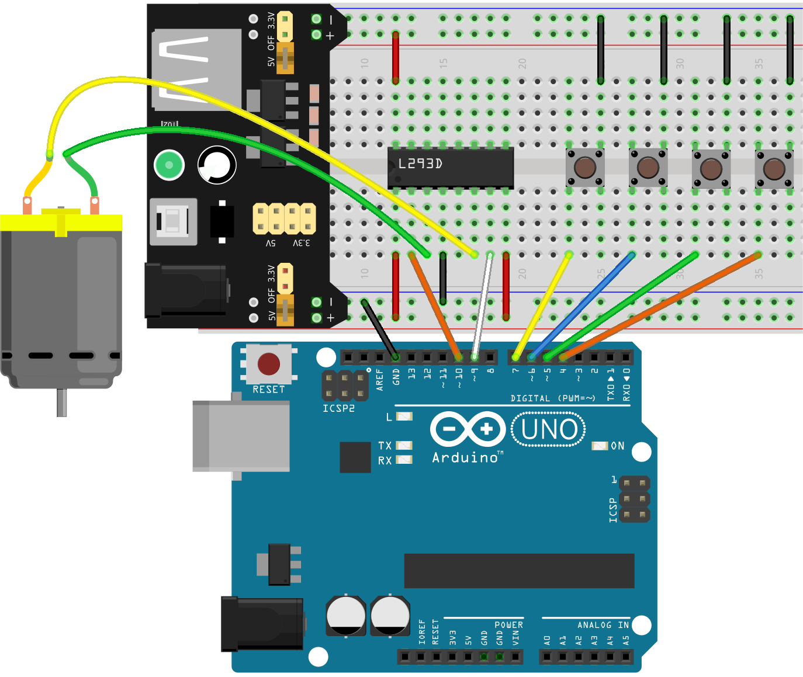
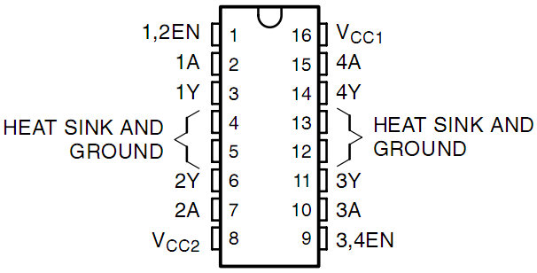
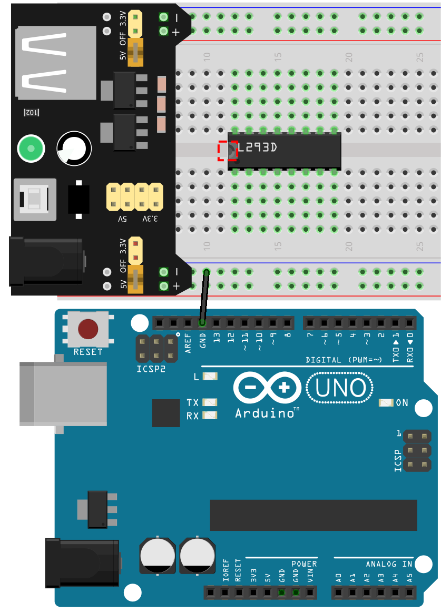
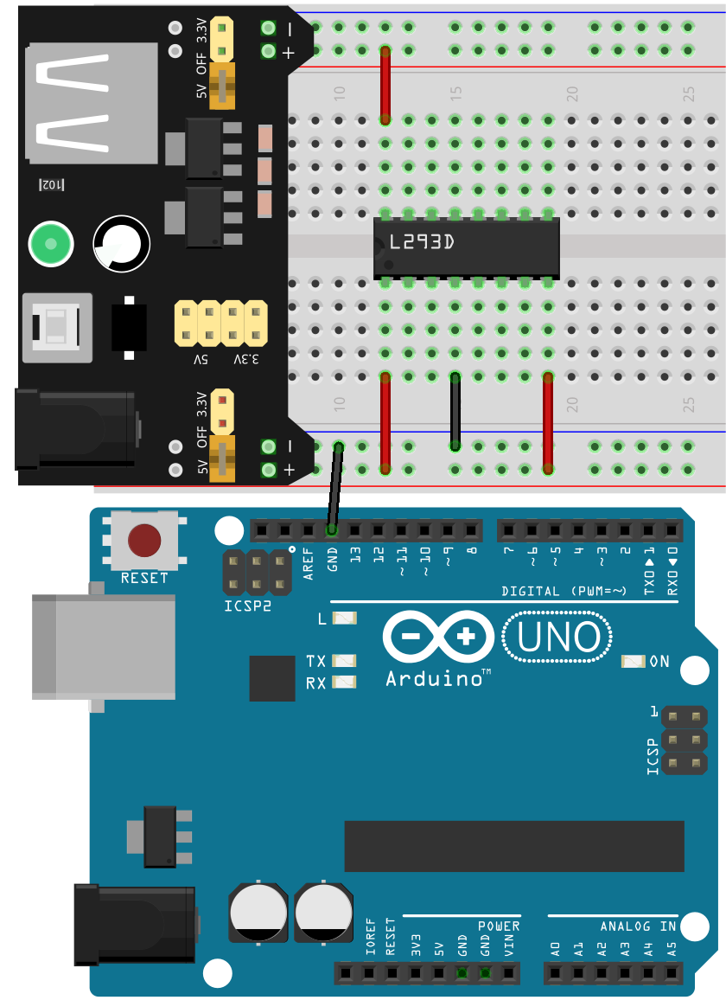
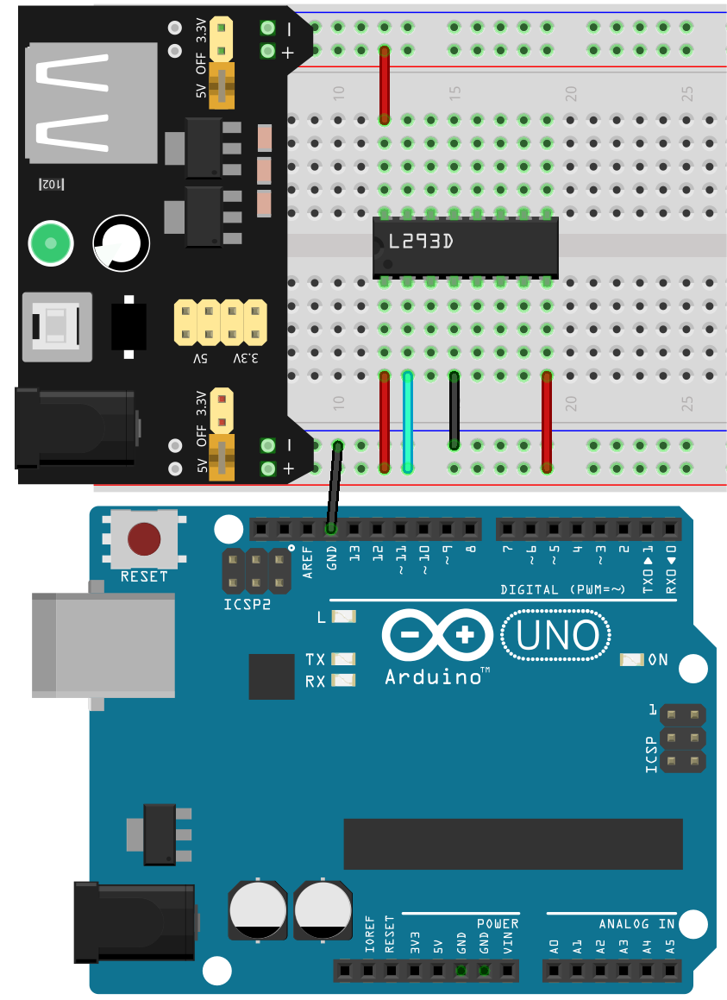
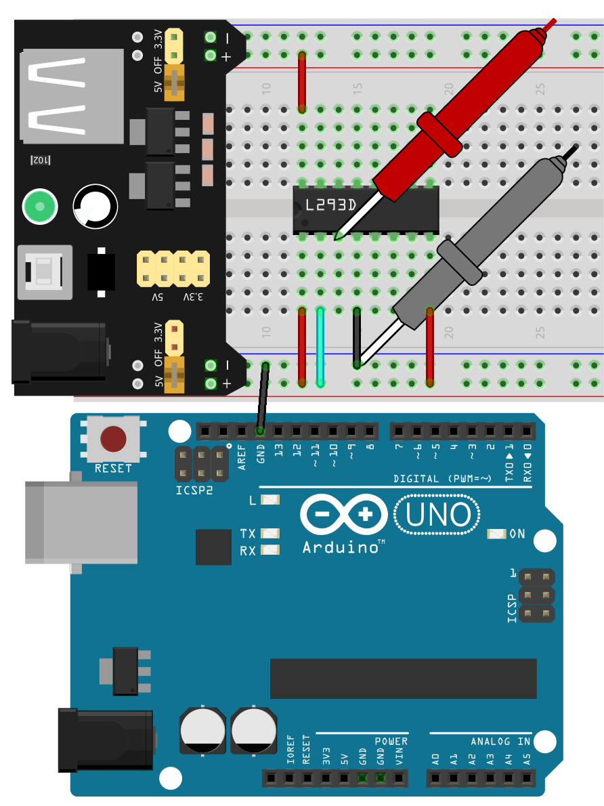
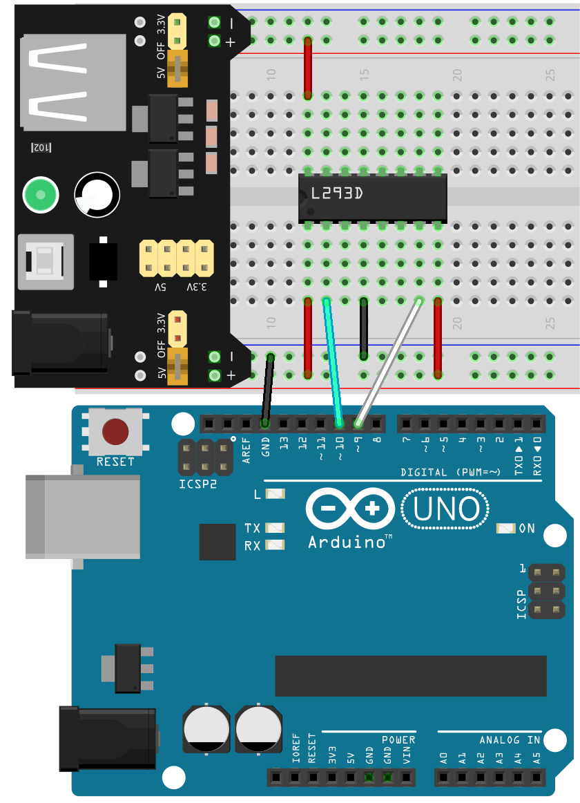
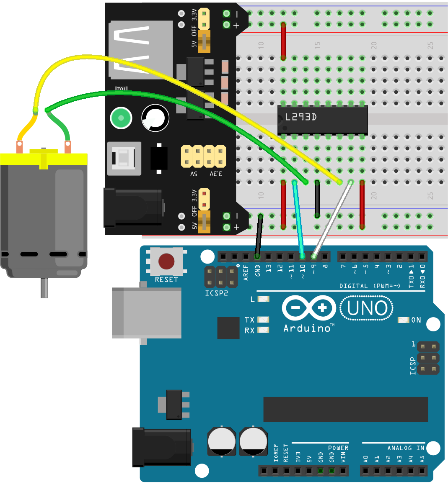
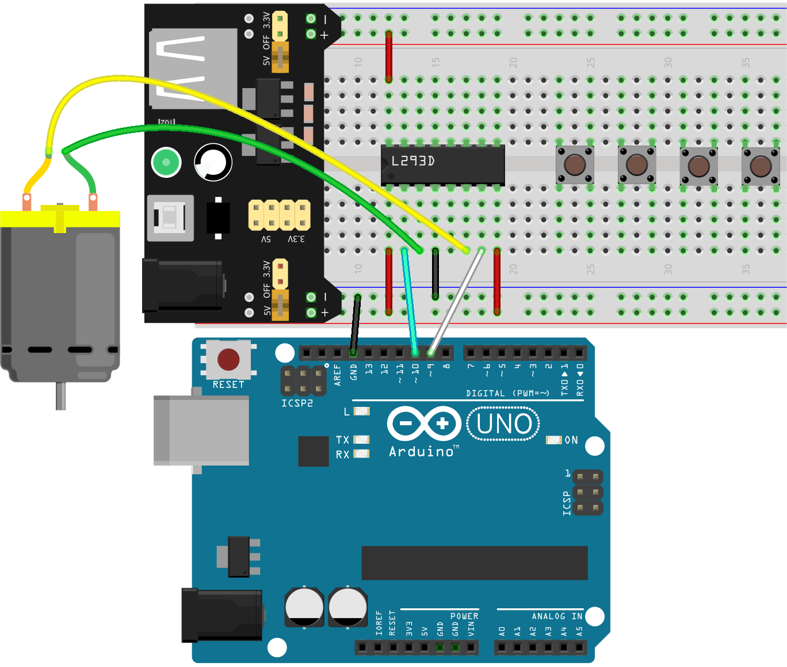

16. Summer Fan
===================

As summer approaches, it's the perfect time to dive into a fun and engaging project. In this lesson, you'll learn how to build a simple yet fascinating summer fan using Arduino. We'll explore the fundamentals of motor control, the importance of using a motor driver, and how to control motor speed and direction with buttons. By the end of this lesson, you'll be able to create a project that mimics a real-life fan, just in time to beat the summer heat!

.. raw:: html

    <video width="600" loop autoplay>
        <source src="_static/video/16_summer_fan.mp4" type="video/mp4">
        Your browser does not support the video tag.
    </video>
  
By the end of this lesson, you will be able to:

* Learn the purpose and functionality of the L293D chip.
* Build a circuit using an Arduino, motor, and motor driver.
* Write Arduino code to control motor speed and direction.
* Utilize buttons to adjust motor speed, simulating the controls of a fan.

Build the Circuit
------------------------------------

**Components Needed**

.. list-table:: 
   :widths: 25 25 25 25
   :header-rows: 0

   * - 1 * Arduino Uno R3
     - 1 * Motor
     - 4 * Button
     - 1 * L293D Chip
   * - |components_uno_r3|
     - |components_motor| 
     - |components_button|
     - |components_l293d|
   * - 1 * USB Cable
     - 1 * Breadboard
     - Jumper Wires
     - 1 * Multimeter
   * - |components_usb_cable|
     - |components_breadboard|
     - |components_wire|
     - |components_meter|
   * - 1 * Breadboard Power Module
     - 1 * 9V Battery
     - 1 * Battery Cable
     - 
   * - |components_breadboard_power_module| 
     - |components_9v_battery| 
     - |components_battery_cable| 
     -

**Building Steps**

Follow the wiring diagram, or the steps below to build your circuit.

**1. Connecting the L293D Chip**

Normally, connecting a motor's terminals directly to a battery or the GND and 5V pins on a control board will make it spin.

However, to control a motor programmatically, connect it to the signal pins on an Arduino board. These pins only output about 20mA, not enough for a motor, hence the need for a motor driver like the L293D.

The L293D is a 4-channel driver capable of handling high voltages and currents, suitable for driving DC and stepper motors among other inductive loads. It works with standard DTL, TTL logic levels.

* The L293D has two power supply pins, Vcc1 and Vcc2. Vcc2 powers the motor, while Vcc1 powers the chip itself. For a small-sized DC motor, connect both pins to +5V.
* Pin **EN** is an enable pin and only works with high level; **A** stands for input and **Y** for output. 
* When pin **EN** is High level, if **A** is High, **Y** outputs high level; if **A** is Low, **Y** outputs Low level. 
* When pin **EN** is Low level, the L293D does not work.

.. list-table:: 
   :widths: 25 25 25
   :header-rows: 0

   * - EN
     - A
     - Y
   * - H
     - H
     - H  
   * - H
     - L
     - L 
   * - L
     - X
     - X 

Let's now build a circuit to test this motor driver chip.

1. When using motors, servos, and other actuators, it's recommended to use an external power supply to avoid damaging the main board. Insert the breadboard power module into the breadboard, then use a jumper wire to connect the negative rail of the breadboard to the GND of the Arduino Uno R3 to achieve a common ground.

.. image:: img/14_dinosaur_power_module.png
    :width: 400
    :align: center

.. note::

    The order of the positive and negative terminals on the breadboard in the wiring diagram is reversed compared to the breadboard provided in the kit.

    In actual wiring, you need to insert the breadboard power module from the higher number side (60~65) so that the "-" of the power module goes into the negative rail "-" of the breadboard, and the "+" into the positive rail "+".

    .. image:: img/14_dinosaur_plug_power_module.png
        :width: 400
        :align: center

2. Insert the L293D chip across the middle notch of the breadboard. Make sure the notch on the chip faces left.

3. Connect the pins of the L293D chip as follows.

* **1(1,2EN)**: Connect to the positive rail of the breadboard to enable the chip.
* **4(GND)**: Connect to the negative rail of the breadboard to ground the chip.
* **8(VCC2)**: Connect to the positive rail of the breadboard to provide power to the motor.
* **16(VCC1)**: Connect to the positive rail of the breadboard to power the chip.

4. You can now connect the A pins of the chip (1A, 2A, 3A, 4A) to either 5V or GND to observe the voltage at the Y pins (1Y, 2Y, 3Y, 4Y). Use 1A and 1Y for testing, first connect 2(1A) to the positive rail of the breadboard.

5. Adjust the multimeter to the 20 volts DC setting.

.. image:: img/multimeter_dc_20v.png
    :width: 300
    :align: center
  
6. Touch the red lead of the multimeter to pin 3(1Y), and the black lead to any GND.

7. Record the voltage at pin 3(1Y) in the table below.

.. list-table:: 
   :widths: 25 25 25
   :header-rows: 0

   * - 1,2EN
     - 1A
     - 1Y
   * - 5V
     - 5V
     - *≈5.04V* 
   * - 5V
     - 0V
     - 

8. Now connect 2(1A) to the negative rail of the breadboard.

9. Similarly, measure the voltage at 3(1Y) using the multimeter, and fill in the results in the table.

.. list-table:: 
   :widths: 25 25 25
   :header-rows: 0

   * - 1,2EN
     - 1A
     - 1Y
   * - 5V
     - 5V
     - *≈5.04V* 
   * - 5V
     - 0V
     - *≈0V*  

From the above test results, it is evident that when EN is high, the L293D chip starts working, and if A pins (1A, 2A, 3A, 4A) on the chip are High, the Y pins (1Y, 2Y, 3Y, 4Y) output high level; if A pins (1A, 2A, 3A, 4A) are Low, the Y pins (1Y, 2Y, 3Y, 4Y) output Low level. 

10. Now insert pin 2 (1A) of the L293D chip into pin 10 of the Arduino Uno R3, and pin 7 (2A) into pin 9, thus controlling the input of channels 1 and 2 through pins 9 and 10.

**2. Connecting the Motor**

This is a 3V DC motor. When you give a high level and a low level to each of the 2 terminals, it will rotate.

.. image:: img/16_motor_pic.png
  :width: 300
  :align: center

Motors play an integral part in our daily lives. They're everywhere! From the electric fans that cool us on hot days, the mixers that help us make delicious cakes, to the electric cars that whizz by on the streets - motors make things move!

A motor is like the heart of a machine. It converts electrical energy into mechanical energy, making our toys, appliances, and even big vehicles come to life!

Here's how it works: when electricity is supplied to a motor, it generates a magnetic field. This magnetic field then interacts with other magnets within the motor, causing the motor to spin. This spin, like spinning a top, can then be used to move wheels, propellers, or any other moving parts of a machine.

.. image:: img/motor_rotate1.gif
  :align: center

Now connect the two terminals of the motor to pins 3 (1Y) and 6 (2Y) of the L293D chip.

The truth table for controlling the motor is as follows.

.. list-table:: 
   :widths: 25 25 25 25
   :header-rows: 0

   * - 1,2EN
     - 1A
     - 2A
     - Motor State
   * - H
     - H
     - L 
     - Motor rotates
   * - H
     - L
     - H 
     - Motor rotates in reverse
   * - H
     - L
     - L 
     - Motor inactive
   * - H
     - H
     - H 
     - Motor inactive

**3. Connecting 4 Buttons**

We need 4 buttons to control the motor speed, each button representing a speed setting.

1. Insert 4 buttons on the breadboard, each spanning the middle groove.

2. Connect the lower left pin of each button to Arduino pins 4, 5, 6, 7 respectively.

3. Finally, connect the upper right pin of each button to GND. We are not using pull-down resistors here; planning to use Arduino's internal pull-up for simpler wiring.

Code Creation - Making the Motor Move
---------------------------------------

Let's write the code to see how to drive a motor.

1. Open the Arduino IDE and start a new project by selecting “New Sketch” from the “File” menu.
2. Save your sketch as ``Lesson16_Motor`` using ``Ctrl + S`` or by clicking “Save”.

3. Initialize the motor control pins.

.. code-block:: Arduino
  :emphasize-lines: 2,3,7,8

  // Define motor control pins
  int motor1A = 10;
  int motor2A = 9;

  void setup() {
    // Set motor control pins as outputs
    pinMode(motor1A, OUTPUT);
    pinMode(motor2A, OUTPUT);
  }

4. In ``void loop()`` use the ``digitalWrite()`` function to write ``HIGH`` and ``LOW`` states to the two control pins of the motor, making the motor rotate.

.. code-block:: Arduino
  :emphasize-lines: 13,14

  // Define motor control pins
  int motor1A = 10;
  int motor2A = 9;

  void setup() {
    // Set motor control pins as outputs
    pinMode(motor1A, OUTPUT);
    pinMode(motor2A, OUTPUT);
  }

  void loop() {
    // Rotate the motor forward
    digitalWrite(motor1A, HIGH);
    digitalWrite(motor2A, LOW);
  }

5. At this point, you can upload the code to the Arduino, and you will find that the motor moves.

6. Next, let's see how to reverse the direction of the motor and stop it. To reverse the motor direction, simply swap the levels of the two control pins.

.. code-block:: Arduino
  :emphasize-lines: 7,8

  void loop() {
    // Rotate the motor forward
    digitalWrite(motor1A, HIGH);
    digitalWrite(motor2A, LOW);

    // Rotate the motor in reverse
    digitalWrite(motor1A, LOW);
    digitalWrite(motor2A, HIGH);
    delay(2000);  // Motor runs for 1 seconds
  }

7. To stop the motor, simply set both control pins to either ``HIGH`` or ``LOW``, which will stop the motor.

.. code-block:: Arduino
  :emphasize-lines: 23,24

  // Define motor control pins
  int motor1A = 10;
  int motor2A = 9;

  void setup() {
    // Set motor control pins as outputs
    pinMode(motor1A, OUTPUT);
    pinMode(motor2A, OUTPUT);
  }

  void loop() {
    // Rotate the motor forward
    digitalWrite(motor1A, HIGH);
    digitalWrite(motor2A, LOW);
    delay(2000);  // Motor runs for 1 seconds

    // Rotate the motor in reverse
    digitalWrite(motor1A, LOW);
    digitalWrite(motor2A, HIGH);
    delay(2000);  // Motor runs for 1 seconds

    // Stop the motor
    digitalWrite(motor1A, LOW);
    digitalWrite(motor2A, LOW);
    delay(3000);  // Motor stops for 2 second
  }

8. The code is complete, you can upload it to the Arduino board. Afterwards, you will notice the motor rotates forward for 2 seconds, reverses for 2 seconds, then stops for 3 seconds, and this cycle repeats.

Code Creation - Summer Fan
-----------------------------------
Let's explore how to use four buttons to control motor speed, similar to adjusting a fan's speed in real life.

1. Open the sketch you saved earlier, ``Lesson16_Motor``. Hit “Save As...” from the “File” menu, and rename it to ``Lesson16_Summer_Fan``. Click "Save".

2. Here we need to control the speed of the motor's rotation, so create a ``motorRotate()`` function to control its speed.

* In the function, use the ``analogWrite()`` function to write a PWM value to the ``motor1A`` pin, motor2A set to 0, thus the motor will rotate in one direction.
* The higher the ``speed`` value, the faster the motor rotates.

.. code-block:: Arduino
  :emphasize-lines: 12, 14-17

  // Define motor control pins
  int motor1A = 10;
  int motor2A = 9;

  void setup() {
    // Set motor control pins as outputs
    pinMode(motor1A, OUTPUT);
    pinMode(motor2A, OUTPUT);
  }

  void loop() {
    motorRotate(150);
  }

  void motorRotate(int speed) {
    analogWrite(motor1A, speed);  // Control motor speed
    analogWrite(motor2A, 0);      // Control motor speed
  }

3. After uploading the code to the Arduino board, you will find that the motor rotates in one direction. When you change the value of ``motorRotate(150)``, the motor speed changes, the higher the value, the faster the speed.

4. Now initialize four button pins.

.. code-block:: Arduino
  :emphasize-lines: 6-9

  // Define motor control pins
  const int motor1A = 10;
  const int motor2A = 9;

  // Define button pins
  const int button1 = 4;
  const int button2 = 5;
  const int button3 = 6;
  const int button4 = 7;

5. In ``void setup()`` set all four buttons to ``INPUT_PULLUP``.

.. code-block:: Arduino
  :emphasize-lines: 7-10

  void setup() {
    // Set motor control pins as outputs
    pinMode(motor1A, OUTPUT);
    pinMode(motor2A, OUTPUT);

    // Initialize button pins as INPUT_PULLUP
    pinMode(button1, INPUT_PULLUP);
    pinMode(button2, INPUT_PULLUP);
    pinMode(button3, INPUT_PULLUP);
    pinMode(button4, INPUT_PULLUP);
  }

6. Now write the main program part. When ``button1`` is read as ``LOW``, it means button1 is pressed, at this time the motor speed should be set to 0, i.e., turn it off.

.. code-block:: Arduino
  :emphasize-lines: 2-4

  void loop() {
    if (digitalRead(button1) == LOW) {         // Check if first button is pressed
      motorRotate(0);                          // Turn off the motor
    }
  }

7. Similarly, when ``button2`` is pressed, set the motor speed to 150.

.. code-block:: Arduino
  :emphasize-lines: 4-6

  void loop() {
    if (digitalRead(button1) == LOW) {         // Check if first button is pressed
      motorRotate(0);                          // Turn off the motor
    } else if (digitalRead(button2) == LOW) {  // Check if second button is pressed
      motorRotate(150);                        // Set speed for low
    }
  }

8. When ``button3`` is pressed, set the motor speed to 200.

.. code-block:: Arduino
  :emphasize-lines: 6-8

  void loop() {
    if (digitalRead(button1) == LOW) {         // Check if first button is pressed
      motorRotate(0);                          // Turn off the motor
    } else if (digitalRead(button2) == LOW) {  // Check if second button is pressed
      motorRotate(150);                        // Set speed for low
    } else if (digitalRead(button3) == LOW) {  // Check if third button is pressed
      motorRotate(200);                        // Set speed for medium
    } 
  }

9. Finally, if ``button4`` is pressed, set the motor speed to 250.

.. code-block:: Arduino
  :emphasize-lines: 8-10

  void loop() {
    if (digitalRead(button1) == LOW) {         // Check if first button is pressed
      motorRotate(0);                          // Turn off the motor
    } else if (digitalRead(button2) == LOW) {  // Check if second button is pressed
      motorRotate(150);                        // Set speed for low
    } else if (digitalRead(button3) == LOW) {  // Check if third button is pressed
      motorRotate(200);                        // Set speed for medium
    } else if (digitalRead(button4) == LOW) {  // Check if fourth button is pressed
      motorRotate(250);                        // Set speed for high
    }
  }

10. Here is your complete code. At this point, you can upload the code to your Arduino board and then press each of the 4 buttons to see if the motor speed changes.

.. code-block:: Arduino

  // Define motor control pins
  const int motor1A = 10;
  const int motor2A = 9;

  // Define button pins
  const int button1 = 4;
  const int button2 = 5;
  const int button3 = 6;
  const int button4 = 7;

  void setup() {
    // Set motor control pins as outputs
    pinMode(motor1A, OUTPUT);
    pinMode(motor2A, OUTPUT);

    // Initialize button pins as INPUT_PULLUP
    pinMode(button1, INPUT_PULLUP);
    pinMode(button2, INPUT_PULLUP);
    pinMode(button3, INPUT_PULLUP);
    pinMode(button4, INPUT_PULLUP);
  }

  void loop() {
    if (digitalRead(button1) == LOW) {         // Check if first button is pressed
      motorRotate(0);                          // Turn off the motor
    } else if (digitalRead(button2) == LOW) {  // Check if second button is pressed
      motorRotate(150);                        // Set speed for low
    } else if (digitalRead(button3) == LOW) {  // Check if third button is pressed
      motorRotate(200);                        // Set speed for medium
    } else if (digitalRead(button4) == LOW) {  // Check if fourth button is pressed
      motorRotate(250);                        // Set speed for high
    }
  }

  void motorRotate(int speed) {
    analogWrite(motor1A, speed);  // Control motor speed
    analogWrite(motor2A, 0);      // Control motor speed
  }

11. Finally, remember to save your code and tidy up your workspace.

**Summary**

In this lesson, we delved into the working principles of the L293D motor driver chip and the basic operation of motors. You learned how to make a motor rotate and how to control its direction using Arduino. Finally, we put it all together in a complete project that simulates a fan, using four buttons to control different motor speeds.

**Question**

In the ``Lesson16_Summer_Fan`` code, how should the code be modified if you want to control the motor's direction as well?

 