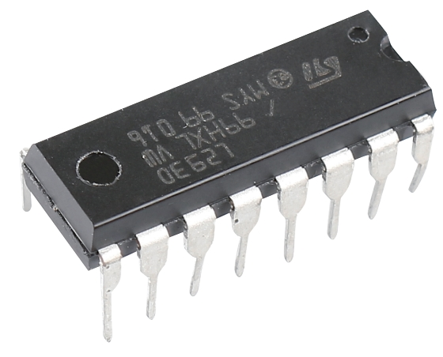
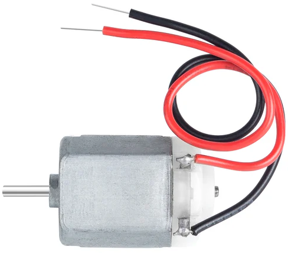

.. note::

    Hallo und herzlich willkommen in der SunFounder Raspberry Pi & Arduino & ESP32 Enthusiasten-Community auf Facebook! Tauche tiefer in die Welt von Raspberry Pi, Arduino und ESP32 ein, zusammen mit anderen Begeisterten.

    **Warum beitreten?**

    - **Expertenunterstützung**: Lösen Sie Probleme nach dem Kauf und technische Herausforderungen mit Hilfe unserer Community und unseres Teams.
    - **Lernen & Teilen**: Tauschen Sie Tipps und Tutorials aus, um Ihre Fähigkeiten zu verbessern.
    - **Exklusive Vorschauen**: Erhalten Sie frühzeitigen Zugang zu neuen Produktankündigungen und Sneak Peeks.
    - **Spezielle Rabatte**: Genießen Sie exklusive Rabatte auf unsere neuesten Produkte.
    - **Festliche Aktionen und Verlosungen**: Nehmen Sie an Verlosungen und Feiertagsaktionen teil.

    👉 Bereit, mit uns zu erkunden und zu kreieren? Klicken Sie auf [|link_sf_facebook|] und treten Sie noch heute bei!

16. Sommer Ventilator
==========================

Da der Sommer naht, ist es die perfekte Zeit, sich in ein spannendes Projekt zu stürzen. In dieser Lektion lernen Sie, wie man einen einfachen, aber faszinierenden Sommer-Ventilator mit Arduino baut. Wir werden die Grundlagen der Motorsteuerung, die Bedeutung eines Motortreibers und die Steuerung der Motorleistung und -richtung mit Tasten erkunden. Am Ende dieser Lektion sind Sie in der Lage, ein Projekt zu erstellen, das einen echten Ventilator nachahmt, genau rechtzeitig, um der Sommerhitze zu trotzen!

.. raw:: html

     <video muted controls style = "max-width:90%">
        <source src="_static/video/16_summer_fan.mp4" type="video/mp4">
        Your browser does not support the video tag.
    </video>
  
Am Ende dieser Lektion werden Sie in der Lage sein:

* Den Zweck und die Funktionsweise des L293D-Chips zu verstehen.
* Eine Schaltung mit Arduino, Motor und Motortreiber zu bauen.
* Arduino-Code zu schreiben, um die Motorleistung und -richtung zu steuern.
* Tasten zu nutzen, um die Motorgeschwindigkeit anzupassen und so die Steuerung eines Ventilators zu simulieren.

Baue die Schaltung
------------------------------------

**Benötigte Komponenten**

.. list-table:: 
   :widths: 25 25 25 25
   :header-rows: 0

   * - 1 * Arduino Uno R3
     - 1 * Motor
     - 4 * Taster
     - 1 * L293D Chip
   * - |list_uno_r3|
     - |list_motor| 
     - |list_button|
     - |list_l293d|
   * - 1 * USB-Kabel
     - 1 * Steckbrett
     - Steckbrücken
     - 1 * Multimeter
   * - |list_usb_cable|
     - |list_breadboard| 
     - |list_wire|
     - |list_meter|
   * - 1 * Steckbrett-Stromversorgungsmodul
     - 1 * 9V Batterie
     - 1 * Batterie-Kabel
     - 
   * - |list_power_module| 
     - |list_battery| 
     - |list_bat_cable| 
     -

**Bauanleitung**

Folgen Sie dem Schaltplan oder den unten aufgeführten Schritten, um Ihre Schaltung aufzubauen.

.. image:: img/16_motor_button_gnd.png
  :width: 500
  :align: center

**1. Anschließen des L293D-Chips**

Normalerweise führt das direkte Anschließen der Motoranschlüsse an eine Batterie oder die GND- und 5V-Pins einer Steuerplatine dazu, dass sich der Motor dreht.

Um den Motor jedoch programmatisch zu steuern, schließen Sie ihn an die Signalausgänge einer Arduino-Platine an. Diese Pins geben jedoch nur etwa 20 mA aus, was für einen Motor nicht ausreicht, daher benötigen wir einen Motortreiber wie den L293D.

Der L293D ist ein 4-Kanal-Treiber, der hohe Spannungen und Ströme handhaben kann, und eignet sich zum Ansteuern von Gleichstrom- und Schrittmotoren sowie anderen induktiven Lasten. Er arbeitet mit standardmäßigen DTL- und TTL-Logikpegeln.

.. image:: img/16_motor_l293d_pinout.png
  :align: center

* Der L293D verfügt über zwei Versorgungsspannungspins, Vcc1 und Vcc2. Vcc2 versorgt den Motor, während Vcc1 den Chip selbst mit Strom versorgt. Für einen kleinen Gleichstrommotor verbinden Sie beide Pins mit +5V.
* Pin **EN** ist ein Freigabepin und funktioniert nur bei hohem Pegel; **A** steht für Eingang und **Y** für Ausgang. 
* Wenn Pin **EN** auf hohem Pegel steht und **A** ebenfalls, gibt **Y** einen hohen Pegel aus; wenn **A** auf niedrigem Pegel steht, gibt **Y** einen niedrigen Pegel aus. 
* Wenn Pin **EN** auf niedrigem Pegel steht, funktioniert der L293D nicht.

.. list-table:: 
   :widths: 25 25 25
   :header-rows: 0

   * - EN
     - A
     - Y
   * - H
     - H
     - H  
   * - H
     - L
     - L 
   * - L
     - X
     - X 

Nun bauen wir eine Schaltung auf, um diesen Motortreiberchip zu testen.

1. Bei der Verwendung von Motoren, Servos und anderen Aktuatoren wird empfohlen, eine externe Stromversorgung zu verwenden, um die Hauptplatine nicht zu beschädigen. Stecken Sie das Steckbrett-Stromversorgungsmodul in das Steckbrett und verwenden Sie eine Steckbrücke, um die negative Schiene des Steckbretts mit dem GND des Arduino Uno R3 zu verbinden, um eine gemeinsame Masse zu erreichen.

.. image:: img/14_dinosaur_power_module.png
    :width: 400
    :align: center

.. note::

    Die Anordnung der positiven und negativen Klemmen auf dem Steckbrett im Verdrahtungsdiagramm ist im Vergleich zum mitgelieferten Steckbrett im Kit umgekehrt.

    Bei der tatsächlichen Verdrahtung müssen Sie das Steckbrett-Stromversorgungsmodul von der höheren Zahlenseite (60~65) einsetzen, sodass das "-" des Moduls in die negative Schiene des Steckbretts und das "+" in die positive Schiene geht.

    .. raw:: html

        <video controls style = "max-width:90%">
            <source src="_static/video/about_power_module.mp4" type="video/mp4">
            Ihr Browser unterstützt das Video-Tag nicht.
        </video>

2. Setzen Sie den L293D-Chip über die mittlere Kerbe des Steckbretts. Achten Sie darauf, dass die Kerbe des Chips nach links zeigt.

.. image:: img/16_motor_l293d.png
  :width: 500
  :align: center

3. Verbinden Sie die Pins des L293D-Chips wie folgt:

* **1(1,2EN)**: Verbinden Sie diesen mit der positiven Schiene des Steckbretts, um den Chip zu aktivieren.
* **4(GND)**: Verbinden Sie diesen mit der negativen Schiene des Steckbretts, um den Chip zu erden.
* **8(VCC2)**: Verbinden Sie diesen mit der positiven Schiene des Steckbretts, um den Motor mit Strom zu versorgen.
* **16(VCC1)**: Verbinden Sie diesen mit der positiven Schiene des Steckbretts, um den Chip mit Strom zu versorgen.

4. Sie können jetzt die A-Pins des Chips (1A, 2A, 3A, 4A) entweder mit 5V oder GND verbinden, um die Spannung an den Y-Pins (1Y, 2Y, 3Y, 4Y) zu beobachten. Verwenden Sie 1A und 1Y für den Test, und verbinden Sie zuerst 2(1A) mit der positiven Schiene des Steckbretts.

.. image:: img/16_motor_l293d_1a_5v.png
  :width: 500
  :align: center

5. Stellen Sie das Multimeter auf den 20-Volt-Gleichstrombereich ein.

.. image:: img/multimeter_dc_20v.png
    :width: 300
    :align: center
  
6. Berühren Sie mit der roten Leitung des Multimeters Pin 3(1Y) und mit der schwarzen Leitung irgendein GND.

.. image:: img/16_motor_l293d_1y.png
  :width: 500
  :align: center

7. Notieren Sie die Spannung an Pin 3(1Y) in der Tabelle unten.

.. list-table:: 
   :widths: 25 25 25
   :header-rows: 0

   * - 1,2EN
     - 1A
     - 1Y
   * - 5V
     - 5V
     - *≈5.04V* 
   * - 5V
     - 0V
     - 

8. Verbinden Sie nun Pin 2 (1A) mit der negativen Schiene des Steckbretts.

9. Messen Sie anschließend mit dem Multimeter die Spannung an Pin 3 (1Y) und tragen Sie die Ergebnisse in die Tabelle ein.

.. image:: img/16_motor_l293d_1y.png
  :width: 500
  :align: center

.. list-table:: 
   :widths: 25 25 25
   :header-rows: 0

   * - 1,2EN
     - 1A
     - 1Y
   * - 5V
     - 5V
     - *≈5.04V* 
   * - 5V
     - 0V
     - *≈0V*  

Aus den obigen Testergebnissen geht hervor, dass der L293D-Chip zu arbeiten beginnt, wenn EN auf hohem Pegel steht. Sind die A-Pins (1A, 2A, 3A, 4A) am Chip auf hohem Pegel, geben die Y-Pins (1Y, 2Y, 3Y, 4Y) einen hohen Pegel aus. Sind die A-Pins auf niedrigem Pegel, geben die Y-Pins einen niedrigen Pegel aus. 

10. Stecken Sie nun Pin 2 (1A) des L293D-Chips in Pin 10 des Arduino Uno R3 und Pin 7 (2A) in Pin 9. Damit steuern Sie den Eingang der Kanäle 1 und 2 über die Pins 9 und 10.

.. image:: img/16_motor_l293d_910.png
  :width: 500
  :align: center

**2. Anschluss des Motors**

Dies ist ein 3V-Gleichstrommotor. Wenn Sie an die beiden Anschlüsse einen hohen und einen niedrigen Pegel anlegen, beginnt er sich zu drehen.

Motoren spielen eine zentrale Rolle in unserem täglichen Leben. Sie sind überall! Vom Ventilator, der uns an heißen Tagen kühlt, über Mixer, die uns beim Kuchenbacken helfen, bis hin zu Elektroautos auf den Straßen - Motoren bringen die Dinge in Bewegung!

Ein Motor ist wie das Herz einer Maschine. Er wandelt elektrische Energie in mechanische Energie um und erweckt unsere Spielzeuge, Geräte und sogar große Fahrzeuge zum Leben!

So funktioniert es: Wenn einem Motor Strom zugeführt wird, erzeugt er ein Magnetfeld. Dieses Magnetfeld interagiert dann mit anderen Magneten im Motor und bringt ihn zum Drehen. Diese Drehbewegung kann dann genutzt werden, um Räder, Propeller oder andere bewegliche Teile einer Maschine in Bewegung zu setzen.

.. image:: img/motor_rotate1.gif
  :align: center

Verbinden Sie nun die beiden Anschlüsse des Motors mit den Pins 3 (1Y) und 6 (2Y) des L293D-Chips.

.. image:: img/16_motor_motor.png
  :width: 500
  :align: center

Die Wahrheitstabelle zur Steuerung des Motors lautet wie folgt:

.. list-table:: 
   :widths: 25 25 25 25
   :header-rows: 0

   * - 1,2EN
     - 1A
     - 2A
     - Motorzustand
   * - H
     - H
     - L 
     - Motor dreht
   * - H
     - L
     - H 
     - Motor dreht rückwärts
   * - H
     - L
     - L 
     - Motor inaktiv
   * - H
     - H
     - H 
     - Motor inaktiv

**3. Anschluss von 4 Tastern**

Wir benötigen 4 Taster zur Steuerung der Motorgeschwindigkeit, wobei jeder Taster eine Geschwindigkeitsstufe repräsentiert.

1. Stecken Sie 4 Taster auf das Steckbrett, jeweils über die mittlere Rille hinweg.

.. image:: img/16_motor_button.png
  :width: 700
  :align: center

2. Verbinden Sie den unteren linken Pin jedes Tasters mit den Arduino-Pins 4, 5, 6 und 7.

.. image:: img/16_motor_button_pin.png
  :width: 700
  :align: center

3. Verbinden Sie schließlich den oberen rechten Pin jedes Tasters mit GND. Wir verwenden hier keine Pull-Down-Widerstände, da wir planen, die internen Pull-Ups des Arduino zu verwenden, um die Verdrahtung zu vereinfachen.

.. image:: img/16_motor_button_gnd.png
  :width: 700
  :align: center
  
Code-Erstellung - Den Motor in Bewegung setzen
-----------------------------------------------------

Lass uns den Code schreiben, um zu sehen, wie ein Motor gesteuert werden kann.

1. Öffne die Arduino IDE und starte ein neues Projekt, indem du „New Sketch“ im Menü „File“ auswählst.
2. Speichere deinen Sketch als ``Lesson16_Motor`` durch Drücken von ``Ctrl + S`` oder Klicken auf „Save“.

3. Initialisiere die Steuerpins des Motors.

.. code-block:: Arduino
  :emphasize-lines: 2,3,7,8

  // Definiere die Steuerpins des Motors
  int motor1A = 10;
  int motor2A = 9;

  void setup() {
    // Setze die Steuerpins des Motors als Ausgang
    pinMode(motor1A, OUTPUT);
    pinMode(motor2A, OUTPUT);
  }

4. Nutze in ``void loop()`` die Funktion ``digitalWrite()``, um ``HIGH`` und ``LOW`` an die zwei Steuerpins des Motors zu schreiben, damit sich der Motor dreht.

.. code-block:: Arduino
  :emphasize-lines: 13,14

  // Definiere die Steuerpins des Motors
  int motor1A = 10;
  int motor2A = 9;

  void setup() {
    // Setze die Steuerpins des Motors als Ausgang
    pinMode(motor1A, OUTPUT);
    pinMode(motor2A, OUTPUT);
  }

  void loop() {
    // Motor vorwärts drehen
    digitalWrite(motor1A, HIGH);
    digitalWrite(motor2A, LOW);
  }

5. Jetzt kannst du den Code auf das Arduino hochladen und feststellen, dass sich der Motor bewegt.

6. Als Nächstes sehen wir uns an, wie man die Drehrichtung des Motors umkehrt und ihn stoppt. Um die Richtung zu ändern, tausche einfach die Pegel der beiden Steuerpins.

.. code-block:: Arduino
  :emphasize-lines: 7,8

  void loop() {
    // Motor vorwärts drehen
    digitalWrite(motor1A, HIGH);
    digitalWrite(motor2A, LOW);

    // Motor rückwärts drehen
    digitalWrite(motor1A, LOW);
    digitalWrite(motor2A, HIGH);
    delay(2000);  // Motor läuft 2 Sekunden
  }

7. Um den Motor zu stoppen, setze einfach beide Steuerpins auf entweder ``HIGH`` oder ``LOW``, was den Motor stoppt.

.. code-block:: Arduino
  :emphasize-lines: 23,24

  // Definiere die Steuerpins des Motors
  int motor1A = 10;
  int motor2A = 9;

  void setup() {
    // Setze die Steuerpins des Motors als Ausgang
    pinMode(motor1A, OUTPUT);
    pinMode(motor2A, OUTPUT);
  }

  void loop() {
    // Motor vorwärts drehen
    digitalWrite(motor1A, HIGH);
    digitalWrite(motor2A, LOW);
    delay(2000);  // Motor läuft 2 Sekunden

    // Motor rückwärts drehen
    digitalWrite(motor1A, LOW);
    digitalWrite(motor2A, HIGH);
    delay(2000);  // Motor läuft 2 Sekunden

    // Motor stoppen
    digitalWrite(motor1A, LOW);
    digitalWrite(motor2A, LOW);
    delay(3000);  // Motor stoppt für 3 Sekunden
  }

8. Der Code ist fertig. Lade ihn auf das Arduino-Board hoch. Danach wirst du feststellen, dass sich der Motor 2 Sekunden vorwärts dreht, 2 Sekunden rückwärts, dann 3 Sekunden stoppt, und dieser Zyklus wiederholt sich.

Code-Erstellung - Sommer-Ventilator
---------------------------------------
Lass uns erkunden, wie man mit vier Tastern die Motordrehzahl steuern kann, ähnlich wie bei einem Ventilator im echten Leben.

1. Öffne den zuvor gespeicherten Sketch ``Lesson16_Motor``. Klicke auf „Save As...“ im Menü „File“ und benenne ihn um in ``Lesson16_Summer_Fan``. Klicke auf „Save“.

2. Hier müssen wir die Drehgeschwindigkeit des Motors steuern, also erstelle eine Funktion ``motorRotate()``, um die Geschwindigkeit zu kontrollieren.

* In der Funktion verwenden wir die Funktion ``analogWrite()``, um einen PWM-Wert an den Pin ``motor1A`` zu schreiben, während ``motor2A`` auf 0 gesetzt wird, sodass sich der Motor in eine Richtung dreht.
* Je höher der Wert ``speed``, desto schneller dreht sich der Motor.

.. code-block:: Arduino
  :emphasize-lines: 12, 14-17

  // Definiere die Steuerpins des Motors
  int motor1A = 10;
  int motor2A = 9;

  void setup() {
    // Setze die Steuerpins des Motors als Ausgang
    pinMode(motor1A, OUTPUT);
    pinMode(motor2A, OUTPUT);
  }

  void loop() {
    motorRotate(150);
  }

  void motorRotate(int speed) {
    analogWrite(motor1A, speed);  // Steuert die Motorgeschwindigkeit
    analogWrite(motor2A, 0);      // Setzt den Motor in Bewegung
  }

3. Nach dem Hochladen des Codes auf das Arduino-Board wirst du feststellen, dass sich der Motor in eine Richtung dreht. Wenn du den Wert von ``motorRotate(150)`` änderst, ändert sich die Motorgeschwindigkeit; je höher der Wert, desto schneller dreht sich der Motor.

4. Jetzt initialisiere vier Taster-Pins.

.. code-block:: Arduino
  :emphasize-lines: 6-9

  // Definiere die Steuerpins des Motors
  const int motor1A = 10;
  const int motor2A = 9;

  // Definiere die Taster-Pins
  const int button1 = 4;
  const int button2 = 5;
  const int button3 = 6;
  const int button4 = 7;

5. Setze in ``void setup()`` alle vier Taster auf ``INPUT_PULLUP``.

.. code-block:: Arduino
  :emphasize-lines: 7-10

  void setup() {
    // Setze die Steuerpins des Motors als Ausgang
    pinMode(motor1A, OUTPUT);
    pinMode(motor2A, OUTPUT);

    // Initialisiere die Taster-Pins als INPUT_PULLUP
    pinMode(button1, INPUT_PULLUP);
    pinMode(button2, INPUT_PULLUP);
    pinMode(button3, INPUT_PULLUP);
    pinMode(button4, INPUT_PULLUP);
  }

6. Schreibe nun den Hauptteil des Programms. Wenn ``button1`` als ``LOW`` gelesen wird, bedeutet das, dass button1 gedrückt wurde. In diesem Fall sollte die Motorgeschwindigkeit auf 0 gesetzt werden, d.h. der Motor wird ausgeschaltet.

.. code-block:: Arduino
  :emphasize-lines: 2-4

  void loop() {
    if (digitalRead(button1) == LOW) {         // Überprüfe, ob der erste Taster gedrückt wurde
      motorRotate(0);                          // Schalte den Motor aus
    }
  }

7. In ähnlicher Weise, wenn ``button2`` gedrückt wird, setze die Motorgeschwindigkeit auf 150.

.. code-block:: Arduino
  :emphasize-lines: 4-6

  void loop() {
    if (digitalRead(button1) == LOW) {         // Überprüfe, ob der erste Taster gedrückt wurde
      motorRotate(0);                          // Schalte den Motor aus
    } else if (digitalRead(button2) == LOW) {  // Überprüfe, ob der zweite Taster gedrückt wurde
      motorRotate(150);                        // Setze die Geschwindigkeit auf niedrig
    }
  }

8. Wenn ``button3`` gedrückt wird, setze die Motorgeschwindigkeit auf 200.

.. code-block:: Arduino
  :emphasize-lines: 6-8

  void loop() {
    if (digitalRead(button1) == LOW) {         // Überprüfe, ob der erste Taster gedrückt wurde
      motorRotate(0);                          // Schalte den Motor aus
    } else if (digitalRead(button2) == LOW) {  // Überprüfe, ob der zweite Taster gedrückt wurde
      motorRotate(150);                        // Setze die Geschwindigkeit auf niedrig
    } else if (digitalRead(button3) == LOW) {  // Überprüfe, ob der dritte Taster gedrückt wurde
      motorRotate(200);                        // Setze die Geschwindigkeit auf mittel
    } 
  }

9. Schließlich, wenn ``button4`` gedrückt wird, setze die Motorgeschwindigkeit auf 250.

.. code-block:: Arduino
  :emphasize-lines: 8-10

  void loop() {
    if (digitalRead(button1) == LOW) {         // Überprüfe, ob der erste Taster gedrückt wurde
      motorRotate(0);                          // Schalte den Motor aus
    } else if (digitalRead(button2) == LOW) {  // Überprüfe, ob der zweite Taster gedrückt wurde
      motorRotate(150);                        // Setze die Geschwindigkeit auf niedrig
    } else if (digitalRead(button3) == LOW) {  // Überprüfe, ob der dritte Taster gedrückt wurde
      motorRotate(200);                        // Setze die Geschwindigkeit auf mittel
    } else if (digitalRead(button4) == LOW) {  // Überprüfe, ob der vierte Taster gedrückt wurde
      motorRotate(250);                        // Setze die Geschwindigkeit auf hoch
    }
  }

10. Hier ist dein vollständiger Code. An diesem Punkt kannst du den Code auf dein Arduino-Board hochladen und dann jeden der 4 Taster drücken, um zu sehen, ob sich die Motorgeschwindigkeit ändert.

.. code-block:: Arduino

  // Definiere die Steuerpins des Motors
  const int motor1A = 10;
  const int motor2A = 9;

  // Definiere die Taster-Pins
  const int button1 = 4;
  const int button2 = 5;
  const int button3 = 6;
  const int button4 = 7;

  void setup() {
    // Setze die Steuerpins des Motors als Ausgang
    pinMode(motor1A, OUTPUT);
    pinMode(motor2A, OUTPUT);

    // Initialisiere die Taster-Pins als INPUT_PULLUP
    pinMode(button1, INPUT_PULLUP);
    pinMode(button2, INPUT_PULLUP);
    pinMode(button3, INPUT_PULLUP);
    pinMode(button4, INPUT_PULLUP);
  }

  void loop() {
    if (digitalRead(button1) == LOW) {         // Überprüfe, ob der erste Taster gedrückt wurde
      motorRotate(0);                          // Schalte den Motor aus
    } else if (digitalRead(button2) == LOW) {  // Überprüfe, ob der zweite Taster gedrückt wurde
      motorRotate(150);                        // Setze die Geschwindigkeit auf niedrig
    } else if (digitalRead(button3) == LOW) {  // Überprüfe, ob der dritte Taster gedrückt wurde
      motorRotate(200);                        // Setze die Geschwindigkeit auf mittel
    } else if (digitalRead(button4) == LOW) {  // Überprüfe, ob der vierte Taster gedrückt wurde
      motorRotate(250);                        // Setze die Geschwindigkeit auf hoch
    }
  }

  void motorRotate(int speed) {
    analogWrite(motor1A, speed);  // Steuerung der Motorgeschwindigkeit
    analogWrite(motor2A, 0);      // Steuerung der Motorgeschwindigkeit
  }

11. Speichere deinen Code und räume deinen Arbeitsplatz auf.

**Frage**

Wie sollte der Code geändert werden, wenn du auch die Drehrichtung des Motors steuern möchtest?

**Zusammenfassung**

In dieser Lektion haben wir die Funktionsweise des L293D-Motortreiberchips und die grundlegende Bedienung von Motoren behandelt. Du hast gelernt, wie man einen Motor dreht und seine Drehrichtung mit Arduino steuert. Schließlich haben wir alles in einem vollständigen Projekt zusammengeführt, das einen Ventilator simuliert, bei dem vier Tasten verwendet werden, um verschiedene Motorgeschwindigkeiten zu steuern.
