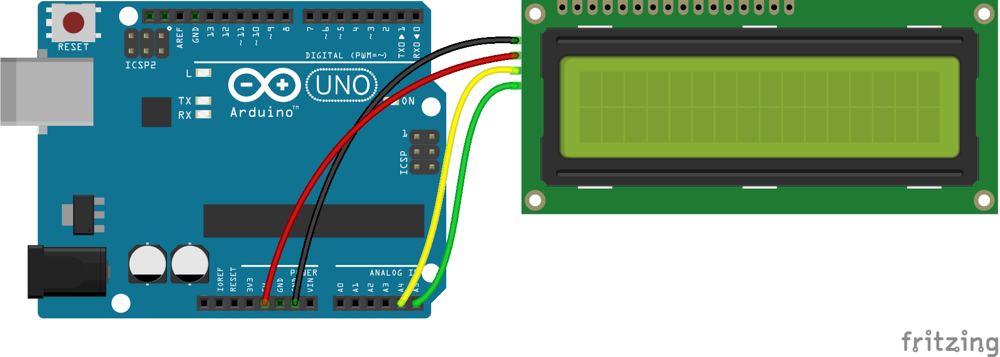
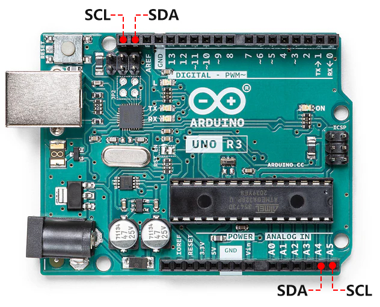
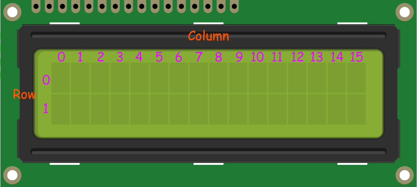

.. note::

    こんにちは、SunFounder Raspberry Pi & Arduino & ESP32 Enthusiasts Communityへようこそ！Facebook上でラズベリーパイ、アルドゥイーノ、ESP32に関心のある仲間と一緒にさらに深く探求しましょう。

    **参加する理由**

    - **専門家のサポート**: コミュニティとチームの助けを借りて、購入後の問題や技術的な課題を解決しましょう。
    - **学び、共有する**: スキルを向上させるためのヒントやチュートリアルを交換しましょう。
    - **限定プレビュー**: 新製品の発表やスニークピークにいち早くアクセスできます。
    - **特別割引**: 最新の製品に対する限定割引をお楽しみください。
    - **お祭りのプロモーションとプレゼント**: プレゼントやホリデープロモーションに参加しましょう。

    👉 私たちと一緒に探索し、創造する準備ができましたか？ [|link_sf_facebook|] をクリックして、今すぐ参加しましょう！

.. _ar_i2c_lcd1602:

17. I2C LCD1602ディスプレイの探求
================================================
  
I2C LCD1602の使用に関する実用ガイドへようこそ！このレッスンでは、この多機能ディスプレイモジュールの基本を解明します。I2C LCD1602をArduinoに接続し、その独自のI2Cアドレスを見つけ、必要なライブラリをインストールして動作させる方法を学びます。最後には、コマンドを送信し、コードを明確で読みやすい情報としてディスプレイに表示する方法を習得します。

.. raw:: html

    <video muted controls style = "max-width:90%">
        <source src="_static/video/17_i2c_lcd.mp4" type="video/mp4">
        Your browser does not support the video tag.
    </video>

このコースを修了すると、以下のことができるようになります：

* I2C LCD1602モジュールの基本機能を理解する。
* Arduino環境でデバイスのI2Cアドレスを取得する方法を学ぶ。
* Arduino IDEでのライブラリのインストールと使用をマスターする。
* I2C LCD1602にカスタムメッセージやデータを表示する方法を実装する。

回路の組み立て
------------------------------------

**必要なコンポーネント**

.. list-table:: 
   :widths: 25 25 25 25
   :header-rows: 0

   * - 1 * Arduino Uno R3
     - 1 * I2C LCD1602
     - 1 * ブレッドボード
     - 1 * USBケーブル
   * - |list_uno_r3|
     - |list_i2c_lcd1602| 
     - |list_breadboard|
     - |list_usb_cable|
   * - ジャンパーワイヤー
     - 
     - 
     - 
   * - |list_wire|
     - 
     - 
     - 

**組み立て手順**

配線図または以下の手順に従って、回路を組み立てます。

1. I2C LCD1602モジュールを見つけます。

.. image:: img/17_lcd_i2c_lcd1602.png
    :width: 600
    :align: center

* **GND**: グラウンド
* **VCC**: 電源、5V。
* **SDA**: シリアルデータライン。プルアップ抵抗を介してVCCに接続します。
* **SCL**: シリアルクロックライン。プルアップ抵抗を介してVCCに接続します。

ご存知の通り、LCDや他のディスプレイは人間と機械の対話を大幅に豊かにしますが、共通の弱点があります。それらをコントローラーに接続すると、複数のIOポートが占有され、外部ポートが限られたコントローラーでは他の機能が制限されてしまいます。

そこで、この問題を解決するためにI2Cモジュール付きのLCD1602が開発されました。I2CモジュールにはPCF8574 I2Cチップが内蔵されており、I2CシリアルデータをLCDディスプレイ用のパラレルデータに変換します。        

* `PCF8574 Datasheet <https://www.ti.com/lit/ds/symlink/pcf8574.pdf?ts=1627006546204&ref_url=https%253A%252F%252Fwww.google.com%252F>`_

**バックライト/コントラスト**

バックライトはジャンパーキャップで有効にできます。ジャンパーキャップを外すとバックライトが無効になります。背面の青いポテンショメータはコントラスト（最も明るい白と最も暗い黒の間の明るさの比率）を調整するために使用されます。

.. image:: img/17_lcd_back.jpg
    :width: 500
    :align: center

* **ショートキャップ**: このキャップでバックライトを有効にできます。キャップを外すとバックライトが無効になります。
* **ポテンショメータ**: 表示されるテキストの明瞭さを調整するために使用され、時計回りで明るさが増し、反時計回りで減少します。

2. Uno R3ボードには2セットのI2Cピンがあります。I2C LCD1602をいずれかのピンセットに接続できます。

3. では、I2C LCD1602をArduino Uno R3ボードに接続しましょう。

コード作成 - I2Cアドレスの取得
--------------------------------------------

I2Cデバイスを使用する前に、そのアドレスを確認する必要があります。次にその方法を見てみましょう。

1. Arduino IDEを開き、「ファイル」メニューから「新しいスケッチ」を選択して新しいプロジェクトを開始します。
2. スケッチを ``Lesson17_I2C_Scanner`` として保存します（ ``Ctrl + S`` または「保存」をクリックして行います）。

3. 新しいスケッチに次のコードをコピーして保存します。

.. code-block:: Arduino

    #include <Wire.h>

    void setup() {
        Wire.begin();
        Serial.begin(9600);
        while (!Serial); // Wait for the serial connection to be established
        Serial.println("\nI2C Scanner");
    }

    void loop() {
        byte error, address;
        int nDevices;

        Serial.println("Scanning...");

        nDevices = 0;
        for (address = 1; address < 127; address++) {
            Wire.beginTransmission(address);
            error = Wire.endTransmission();

            if (error == 0) {
                Serial.print("I2C device found at address 0x");
                if (address < 16) {
                    Serial.print("0");
                }
                Serial.println(address, HEX);

                nDevices++;
            }else if (error == 4) {
                Serial.print("Unknown error at address 0x");
                if (address < 16) {
                    Serial.print("0");
                }
                Serial.println(address, HEX);
            }
        }   
        if(nDevices == 0) {
            Serial.println("No I2C devices found\n");
        }else {
            Serial.println("done\n");
        }
        delay(5000); // Wait 5 seconds before scanning again
    }

4. アップロードボタンをクリックします。I2C LCD1602が正しく接続されている場合、情報が表示されます。デフォルトのアドレスは基本的に0x27で、場合によっては0x3Fであることもあります。

.. code-block::

    スキャン中...
    I2Cデバイスがアドレス0x27で見つかりました
    完了

コード作成 - メッセージの表示
--------------------------------------
それでは、I2C LCD1602に希望するメッセージを表示する方法を見てみましょう。

1. Arduino IDEを開き、「ファイル」メニューから「新しいスケッチ」を選択して新しいプロジェクトを開始します。
2. スケッチを ``Lesson17_I2C_Show`` として保存します（ ``Ctrl + S`` または「保存」をクリックして行います）。

3. I2C LCD1602モジュールを使用するには、適切なライブラリをインクルードする必要があります。しかし、以前使用した ``Servo`` ライブラリとは異なり、ArduinoにはI2C LCD1602用のライブラリが標準で含まれていません。Arduino IDEのライブラリマネージャから検索してインストールする必要があります。

「ライブラリマネージャ」で ``LiquidCrystal I2C`` を検索し、 **INSTALL** をクリックします。

    .. image:: img/17_lcd_install_lib.png

4. インストールが完了すると、通知が表示されます。通常、このライブラリには、機能の使い方を学ぶためのサンプルコードが含まれています。これらのサンプルは、 **ファイル** -> **サンプル** -> **LiquidCrystal I2C** をクリックして見つけることができます。3つのサンプルコードがあり、そのうちの1つを開き、Arduinoボードにアップロードしてみましょう。

5. では、コーディングを始めましょう。各ライブラリを使用する前に、スケッチにインクルードすることが重要です。

* ``Wire.h`` はI2C通信のために不可欠であり、LCDとのインターフェースを可能にします。
* ``LiquidCrystal_I2C.h`` は、I2Cバスを介して接続されたLCDディスプレイを管理するためのものです。

.. code-block:: Arduino
    :emphasize-lines: 1,2

    #include <Wire.h>               // Includes I2C communication library.
    #include <LiquidCrystal_I2C.h>  // Includes library for controlling the I2C LCD.

    void setup() {
        // put your setup code here, to run once:

    }

6. 次に、 ``LiquidCrystal_I2C`` クラスのインスタンスを ``lcd`` という名前で作成します。パラメータ (``0x27``, ``16``, ``2``) は、LCDのI2Cアドレス (``0x27``) と、ディスプレイが1行あたり16文字、2行のディスプレイであることを指定します。

.. code-block:: Arduino
    :emphasize-lines: 4

    #include <Wire.h>               // Includes I2C communication library.
    #include <LiquidCrystal_I2C.h>  // Includes library for controlling the I2C LCD.

    LiquidCrystal_I2C lcd(0x27, 16, 2);  // Initializes LCD at address 0x27 for a 16x2 display.

    void setup() {
        // put your setup code here, to run once:

    }

7. ``void setup()`` 関数内で、 ``lcd.init()`` を使ってLCDディスプレイを初期化し、その後 ``lcd.backlight()`` でバックライトをオンにします。これでディスプレイが見やすくなります。

.. code-block:: Arduino
    :emphasize-lines: 8,9

    #include <Wire.h>               // Includes I2C communication library.
    #include <LiquidCrystal_I2C.h>  // Includes library for controlling the I2C LCD.
    
    LiquidCrystal_I2C lcd(0x27, 16, 2);  // Initializes LCD at address 0x27 for a 16x2 display.

    void setup() {
        // put your setup code here, to run once:
        lcd.init();       // initialize the lcd
        lcd.backlight();  // Turns on the LCD backlight.
    }

8. I2C LCD1602の0行0列目（実際には1行目1列目）に「Let's count!」と表示します。 ``lcd.setCursor()`` 関数を使用してカーソルを0行0列目に配置し、次に ``lcd.print()`` を使用して希望の文字を表示します。テキストは二重引用符 ("") で囲むことを忘れないでください。

.. code-block:: Arduino
    :emphasize-lines: 2,3

    void loop() {
        lcd.setCursor(0, 0);       // Sets cursor to top-left corner.
        lcd.print("Let's count");  // Displays "Hello World".
    }

9. 次に、「Count」という文字とその後にカウント値を1行0列目（実際には2行目1列目）に表示します。文字列や文字を表示するには、二重引用符 ("") で囲みますが、変数を表示する場合は、括弧内に変数名を記述するだけです。

.. code-block:: Arduino
    :emphasize-lines: 4-6

    void loop() {
        lcd.setCursor(0, 0);       // Sets cursor to top-left corner.
        lcd.print("Let's count");  // Displays "Hello World".
        lcd.setCursor(0, 1);       // Moves cursor to second line.
        lcd.print("Count: ");      // Displays "Count".
        lcd.print(count);          // Prints current count next to "Count".
    }

10. 変数 ``count`` を毎秒 ``count++`` で1ずつ増加させます。これにより変数自体に1が加算されます。

.. code-block:: Arduino
    :emphasize-lines: 7,8

    void loop() {
        lcd.setCursor(0, 0);       // Sets cursor to top-left corner.
        lcd.print("Let's count");  // Displays "Hello World".
        lcd.setCursor(0, 1);       // Moves cursor to second line.
        lcd.print("Count: ");      // Displays "Count".
        lcd.print(count);          // Prints current count next to "Count".
        delay(1000);               // Pauses for one second.
        count++;                   // Increments counter.
    }

11. 最後に、 ``lcd.clear()`` でディスプレイをクリアし、次の数値を表示する準備をします。

.. code-block:: Arduino
    :emphasize-lines: 21

    #include <Wire.h>               // Includes I2C communication library.
    #include <LiquidCrystal_I2C.h>  // Includes library for controlling the I2C LCD.

    LiquidCrystal_I2C lcd(0x27, 16, 2);  // Initializes LCD at address 0x27 for a 16x2 display.

    int count = 0;  // Counter variable for tracking increments.

    void setup() {
        lcd.init();       // Initializes LCD display.
        lcd.backlight();  // Turns on LCD backlight for visibility.
    }

    void loop() {
        lcd.setCursor(0, 0);       // Sets cursor to top-left corner.
        lcd.print("Let's count");  // Displays "Hello World".
        lcd.setCursor(0, 1);       // Moves cursor to second line.
        lcd.print("Count: ");      // Displays "Count".
        lcd.print(count);          // Prints current count next to "Count".
        delay(1000);               // Pauses for one second.
        count++;                   // Increments counter.
        lcd.clear();               // Clears the display for next iteration.
    }

12. コードが完成したら、アップロードをクリックして結果を確認できます。I2C LCD1602の1行目には "Let's count!" が表示され、2行目には "Count: " とその後にカウント値が表示されるのが見えます。

.. note::

    配線が正しいにもかかわらず、LCDに文字が表示されない場合は、LCDを裏返し、青いポテンショメータを調整するためにドライバーを使用します。文字がはっきりと見えるように回転させ、背景が比較的暗くなれば、調整が成功したことを意味します。

.. image:: img/17_lcd_back.jpg
    :width: 500
    :align: center

13. 最後に、コードを保存し、作業スペースを整理することを忘れないでください。

**質問**

I2C LCD1602の1行目2列目に「Let's count」を表示したい場合、コードをどのように変更すればよいでしょうか？

**まとめ**

このレッスンでは、I2C LCD1602モジュールを使用してArduino Uno R3ボードと連携する方法を探りました。I2Cアドレスを取得し、Arduino IDEでLCDモジュールを駆動するために必要なライブラリをインストールする方法を学びました。コードを作成してアップロードすることで、LCDに文字やカウントデータを表示することに成功しました。これらの手順は、I2C通信プロトコルの理解を深めるだけでなく、ディスプレイデバイスの取り扱い能力を向上させることにも繋がりました。
