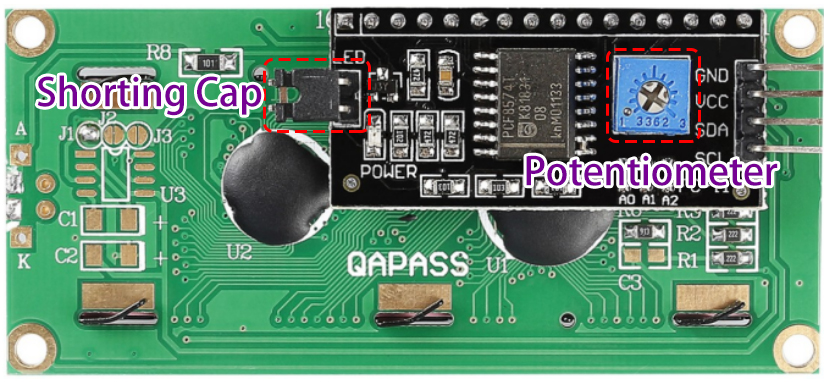

.. _ar_i2c_lcd1602:

17. Exploring the I2C LCD1602 Display
================================================
  
Welcome to our practical guide on using the I2C LCD1602! In this lesson, we'll uncover the essentials of working with this versatile display module. You'll learn how to set up the I2C LCD1602 with your Arduino, find its unique I2C address, and install the necessary libraries to get it up and running. By the end, you'll know how to send commands and display text, turning lines of code into clear, readable information on your screen.

.. raw:: html

    <video width="600" loop autoplay muted>
        <source src="_static/video/17_i2c_lcd.mp4" type="video/mp4">
        Your browser does not support the video tag.
    </video>

Upon completing this course, you will be able to:

* Understand the basic functions of the I2C LCD1602 module.
* Learn how to obtain the I2C address of devices within the Arduino environment.
* Master the installation and use of libraries in the Arduino IDE.
* Implement the display of custom messages and data on the I2C LCD1602.

Build the Circuit
------------------------------------

**Components Needed**

.. list-table:: 
   :widths: 25 25 25 25
   :header-rows: 0

   * - 1 * Arduino Uno R3
     - 1 * I2C LCD1602
     - 1 * Breadboard
     - 1 * USB Cable
   * - |components_uno_r3|
     - |components_i2c_lcd1602| 
     - |components_breadboard|
     - |components_usb_cable|
   * - Jumper Wires
     - 
     - 
     - 
   * - |components_wire|
     - 
     - 
     - 

**Building Steps**

Follow the wiring diagram, or the steps below to build your circuit.

.. image:: img/17_lcd_connect.png
    :width: 700
    :align: center

1. Locate the I2C LCD1602 module.

.. image:: img/17_lcd_i2c_lcd1602.png
    :width: 600
    :align: center

* **GND**: Ground
* **VCC**: Voltage supply, 5V.
* **SDA**: Serial data line. Connect to VCC through a pullup resistor.
* **SCL**: Serial clock line. Connect to VCC through a pullup resistor.

As we all know, though LCD and some other displays greatly enrich the man-machine interaction, they share a common weakness. When they are connected to a controller, multiple IOs will be occupied of the controller which has no so many outer ports. Also it restricts other functions of the controller. 

Therefore, LCD1602 with an I2C module is developed to solve the problem. The I2C module has a built-in PCF8574 I2C chip that converts I2C serial data to parallel data for the LCD display.        

* `PCF8574 Datasheet <https://www.ti.com/lit/ds/symlink/pcf8574.pdf?ts=1627006546204&ref_url=https%253A%252F%252Fwww.google.com%252F>`_

**Backlight/Contrast**

Backlight can be enabled by jumper cap, unplugg the jumper cap to disable the backlight. The blue potentiometer on the back is used to adjust the contrast (the ratio of brightness between the brightest white and the darkest black).

* **Shorting Cap**: Backlight can be enabled by this cap, unplugg this cap to disable the backlight.
* **Potentiometer**: It is used to adjust the contrast (the clarity of the displayed text), which is increased in the clockwise direction and decreased in the counterclockwise direction.

2. The Uno R3 board has two sets of I2C pins. You can connect the I2C LCD1602 to either set of pins.

.. image:: img/17_lcd_uno_i2c.jpg
    :width: 500
    :align: center

3. Now, let's connect the I2C LCD1602 to the Arduino Uno R3 board.

.. image:: img/17_lcd_connect.png
    :width: 700
    :align: center

Code Creation - Retrieving the I2C Address
--------------------------------------------

Before using an I2C device, you generally need to find out its address. Let's see how to do that.

1. Open the Arduino IDE and start a new project by selecting “New Sketch” from the “File” menu.
2. Save your sketch as ``Lesson17_I2C_Scanner`` using ``Ctrl + S`` or by clicking “Save”.

3. Copy the following code into your new sketch, then save it.

.. code-block:: Arduino

    #include <Wire.h>

    void setup() {
        Wire.begin();
        Serial.begin(9600);
        while (!Serial); // Wait for the serial connection to be established
        Serial.println("\nI2C Scanner");
    }

    void loop() {
        byte error, address;
        int nDevices;

        Serial.println("Scanning...");

        nDevices = 0;
        for (address = 1; address < 127; address++) {
            Wire.beginTransmission(address);
            error = Wire.endTransmission();

            if (error == 0) {
                Serial.print("I2C device found at address 0x");
                if (address < 16) {
                    Serial.print("0");
                }
                Serial.println(address, HEX);

                nDevices++;
            }else if (error == 4) {
                Serial.print("Unknown error at address 0x");
                if (address < 16) {
                    Serial.print("0");
                }
                Serial.println(address, HEX);
            }
        }   
        if(nDevices == 0) {
            Serial.println("No I2C devices found\n");
        }else {
            Serial.println("done\n");
        }
        delay(5000); // Wait 5 seconds before scanning again
    }

4. Click the Upload button. If your I2C LCD1602 is connected correctly, you will see information displayed. The default address is basically 0x27, in a few cases it may be 0x3F.

.. code-block::

    Scanning...
    I2C device found at address 0x27
    done

Code Creation - Displaying Messages
--------------------------------------
Now, let's look at how to display desired messages on the I2C LCD1602.

1. Open the Arduino IDE and start a new project by selecting “New Sketch” from the “File” menu.
2. Save your sketch as ``Lesson17_I2C_Show`` using ``Ctrl + S`` or by clicking “Save”.

3. To use the I2C LCD1602 module, you need to include the appropriate library. However, unlike the ``Servo`` library we used before, Arduino does not come with the necessary library for the I2C LCD1602. You need to search for and install it from the Library Manager in the Arduino IDE. 

Now, search for ``LiquidCrystal I2C`` on the **Library Manager**, then click **INSTALL**.

    .. image:: img/17_lcd_install_lib.png

4. After the installation is complete, you will receive a notification. Typically, the library includes some example code to help you learn how to use its functions. You can find these examples by clicking **File** -> **Examples** -> **LiquidCrystal I2C**. There are three example codes available; you can open one of them, upload it to your Arduino board, and see what happens.

5. Now, let's start coding. Before using each library, it is essential to include it in your sketch. 

* ``Wire.h`` is crucial for I2C communication, enabling the interface with the LCD. 
* ``LiquidCrystal_I2C.h`` is specifically designed for managing LCD displays that connect through the I2C bus.

.. code-block:: Arduino
    :emphasize-lines: 1,2

    #include <Wire.h>               // Includes I2C communication library.
    #include <LiquidCrystal_I2C.h>  // Includes library for controlling the I2C LCD.

    void setup() {
        // put your setup code here, to run once:

    }

6. Now, we create an instance of the ``LiquidCrystal_I2C`` class named ``lcd``. The parameters (``0x27``, ``16``, ``2``) specify the I2C address of the LCD (``0x27``) and that the display has 16 characters per line and 2 lines.

.. code-block:: Arduino
    :emphasize-lines: 4

    #include <Wire.h>               // Includes I2C communication library.
    #include <LiquidCrystal_I2C.h>  // Includes library for controlling the I2C LCD.

    LiquidCrystal_I2C lcd(0x27, 16, 2);  // Initializes LCD at address 0x27 for a 16x2 display.

    void setup() {
        // put your setup code here, to run once:

    }

7. In the ``void setup()`` function, initializes the LCD display with ``lcd.init()`` and then turns on the backlight with ``lcd.backlight()``. This makes the display visible.

.. code-block:: Arduino
    :emphasize-lines: 8,9

    #include <Wire.h>               // Includes I2C communication library.
    #include <LiquidCrystal_I2C.h>  // Includes library for controlling the I2C LCD.
    
    LiquidCrystal_I2C lcd(0x27, 16, 2);  // Initializes LCD at address 0x27 for a 16x2 display.

    void setup() {
        // put your setup code here, to run once:
        lcd.init();       // initialize the lcd
        lcd.backlight();  // Turns on the LCD backlight.
    }

8. Start by displaying “Let's count!” on row 0, column 0 of the I2C LCD1602 (which is actually the first row and first column). Use the ``lcd.setCursor()`` function to place the cursor at row 0, column 0, then use ``lcd.print()`` to print the desired characters. Remember to enclose the text in double quotes ("").

.. image:: img/17_lcd_row_column.png
    :width: 600
    :align: center

.. code-block:: Arduino
    :emphasize-lines: 2,3

    void loop() {
        lcd.setCursor(0, 0);       // Sets cursor to top-left corner.
        lcd.print("Let's count");  // Displays "Hello World".
    }

9. Next, print "Count" followed by the count value on row 1, column 0 (which is actually the second row and first column). Note that for printing characters and strings, enclose them in double quotes (""), but for variables, just write the variable name inside the brackets.

.. code-block:: Arduino
    :emphasize-lines: 4-6

    void loop() {
        lcd.setCursor(0, 0);       // Sets cursor to top-left corner.
        lcd.print("Let's count");  // Displays "Hello World".
        lcd.setCursor(0, 1);       // Moves cursor to second line.
        lcd.print("Count: ");      // Displays "Count".
        lcd.print(count);          // Prints current count next to "Count".
    }

10. Let the variable ``count`` increase by one every second using ``count++``, which adds 1 to the variable itself.

.. code-block:: Arduino
    :emphasize-lines: 7,8

    void loop() {
        lcd.setCursor(0, 0);       // Sets cursor to top-left corner.
        lcd.print("Let's count");  // Displays "Hello World".
        lcd.setCursor(0, 1);       // Moves cursor to second line.
        lcd.print("Count: ");      // Displays "Count".
        lcd.print(count);          // Prints current count next to "Count".
        delay(1000);               // Pauses for one second.
        count++;                   // Increments counter.
    }

11. Finally, clear the display with ``lcd.clear()`` to prepare for the next number to be displayed.

.. code-block:: Arduino
    :emphasize-lines: 21

    #include <Wire.h>               // Includes I2C communication library.
    #include <LiquidCrystal_I2C.h>  // Includes library for controlling the I2C LCD.

    LiquidCrystal_I2C lcd(0x27, 16, 2);  // Initializes LCD at address 0x27 for a 16x2 display.

    int count = 0;  // Counter variable for tracking increments.

    void setup() {
        lcd.init();       // Initializes LCD display.
        lcd.backlight();  // Turns on LCD backlight for visibility.
    }

    void loop() {
        lcd.setCursor(0, 0);       // Sets cursor to top-left corner.
        lcd.print("Let's count");  // Displays "Hello World".
        lcd.setCursor(0, 1);       // Moves cursor to second line.
        lcd.print("Count: ");      // Displays "Count".
        lcd.print(count);          // Prints current count next to "Count".
        delay(1000);               // Pauses for one second.
        count++;                   // Increments counter.
        lcd.clear();               // Clears the display for next iteration.
    }

12. Once you have finished the code, you can click Upload to see the results. You will see the first line of the I2C LCD1602 display "Let's count!", and the second line display "Count: " followed by the count value.

.. note::

    If your wiring is correct but no characters are displayed on the LCD, you can flip it over to the back and use a screwdriver to adjust the blue potentiometer. Rotate it until the characters are clearly visible and the background is relatively dim, which indicates a successful adjustment.

13. Finally, remember to save your code and tidy up your workspace.

**Summary**

In this lesson, we explored how to interact with the Arduino Uno R3 board using the I2C LCD1602 module. You are learned how to retrieve the I2C address and install the necessary libraries in the Arduino IDE to drive the LCD module. By writing and uploading code, You are successfully displayed characters and count data on the LCD. These steps not only deepened our understanding of the I2C communication protocol but also enhanced our ability to handle display devices.

**Question**

If you want to start displaying "Let's count" at the second column of the first row on the I2C LCD1602, how should you modify the code?
