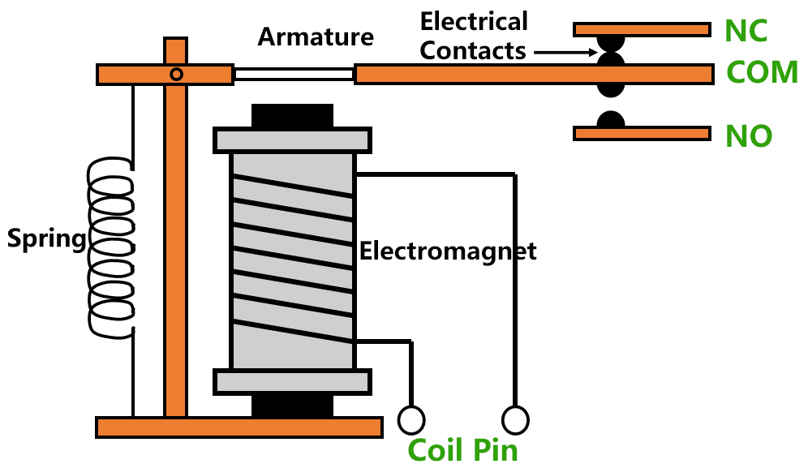
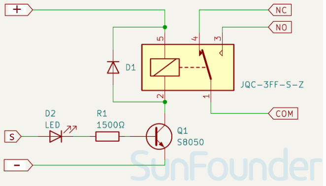
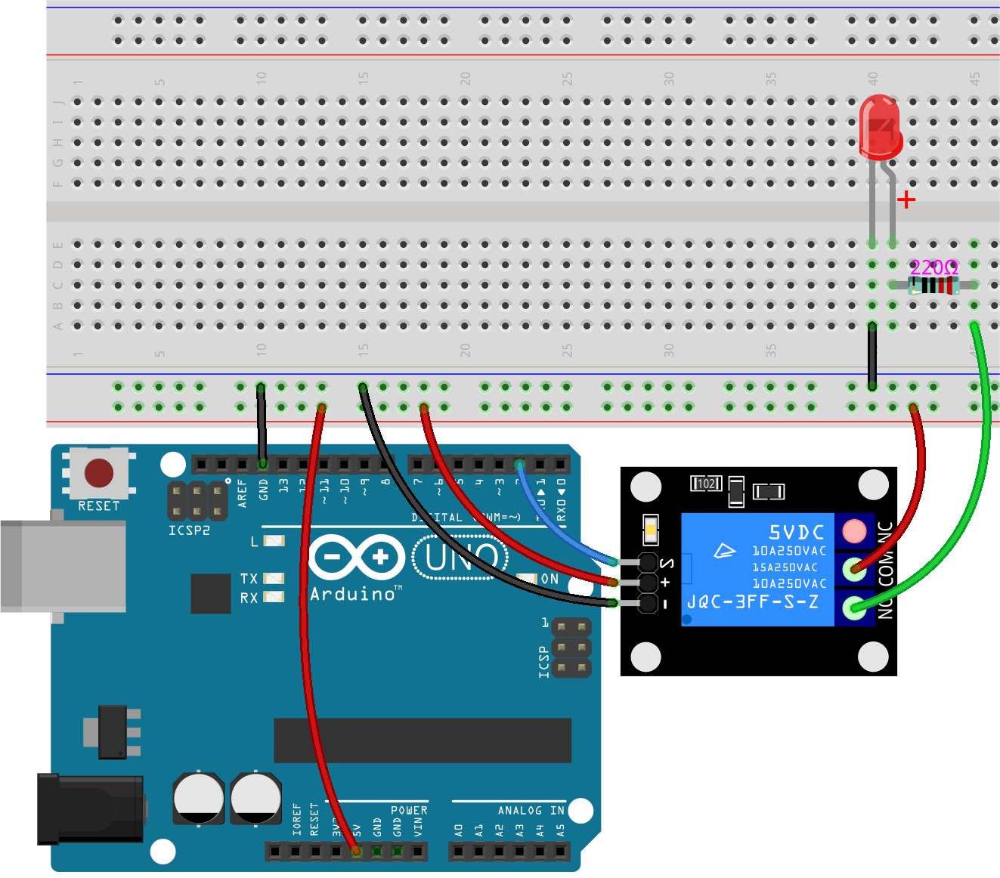
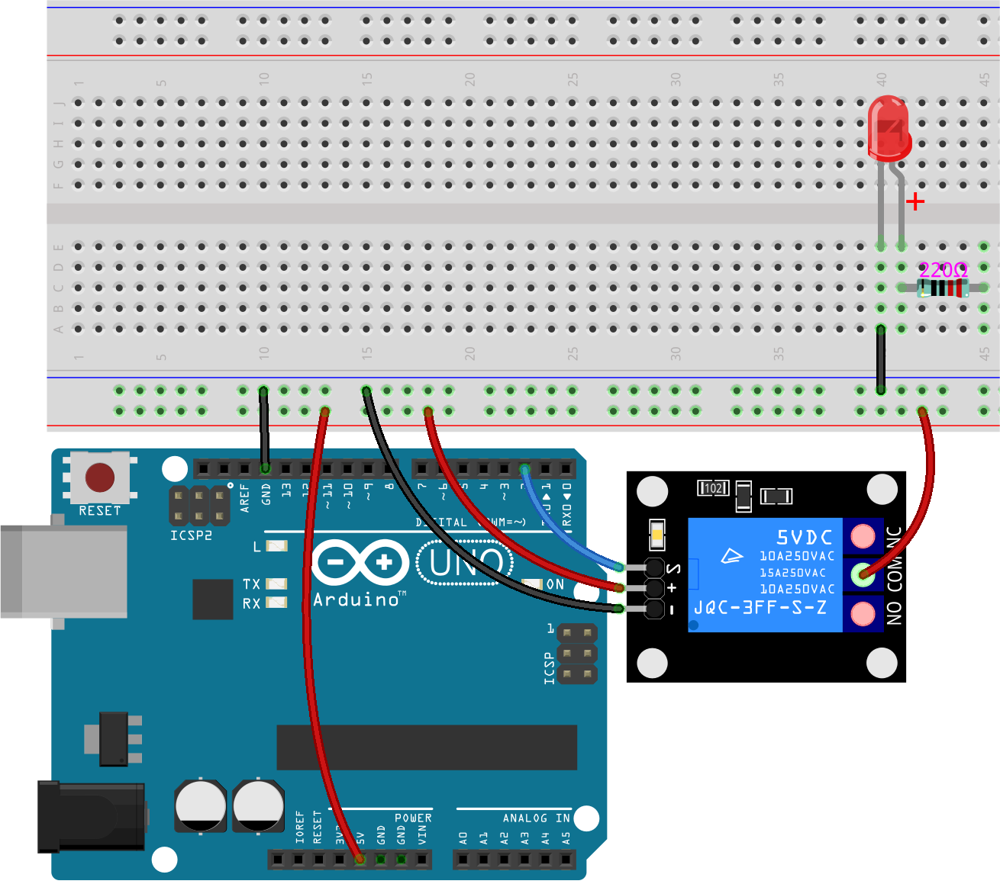
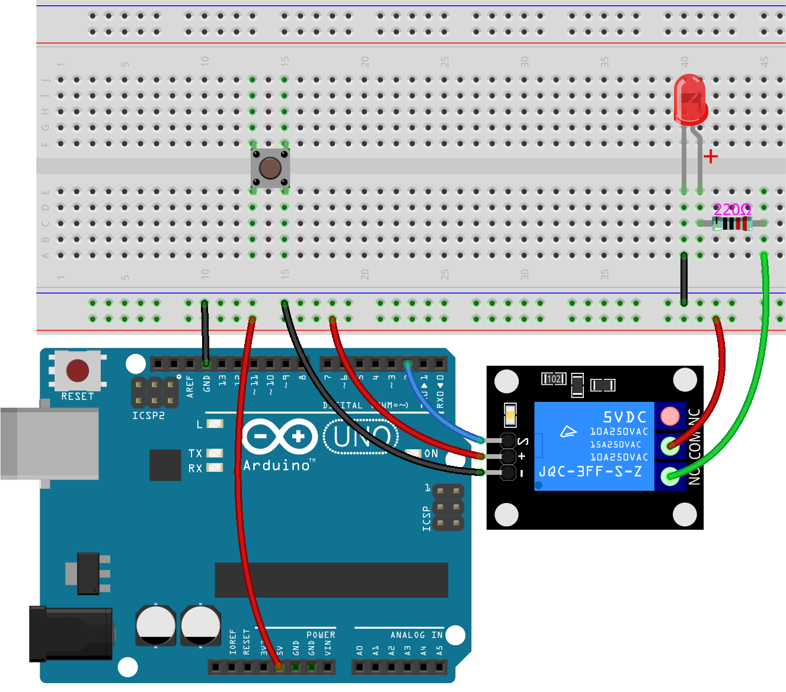
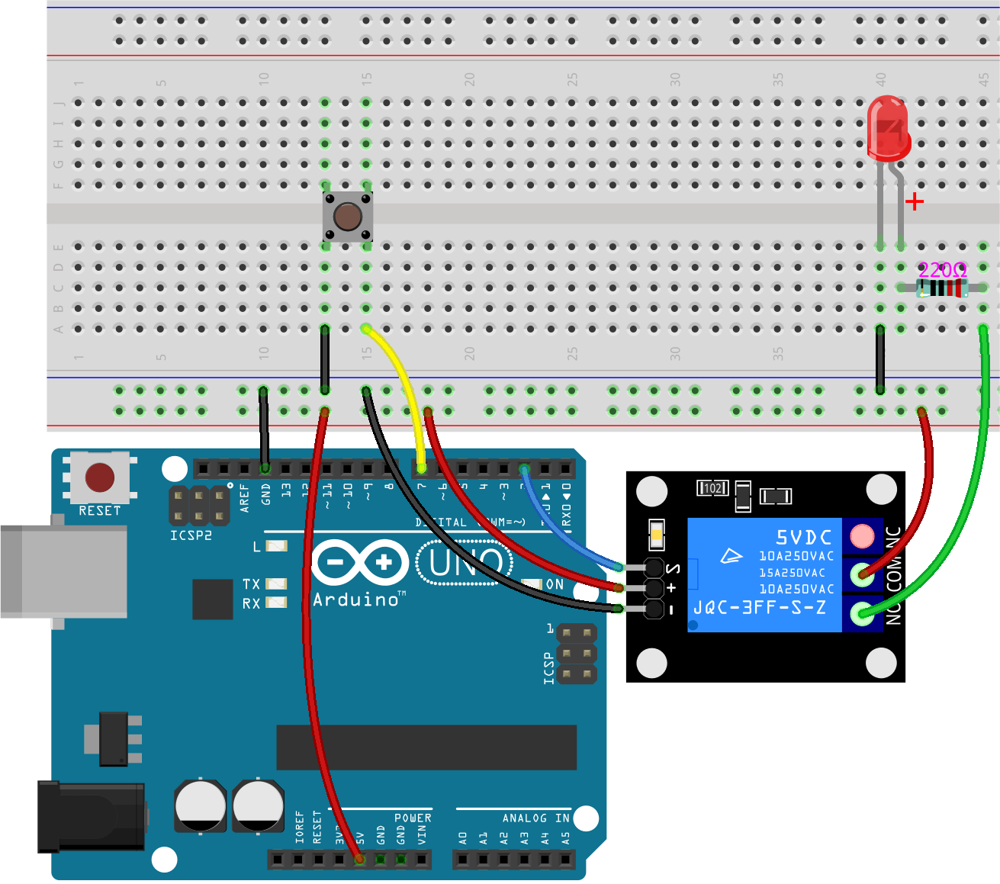
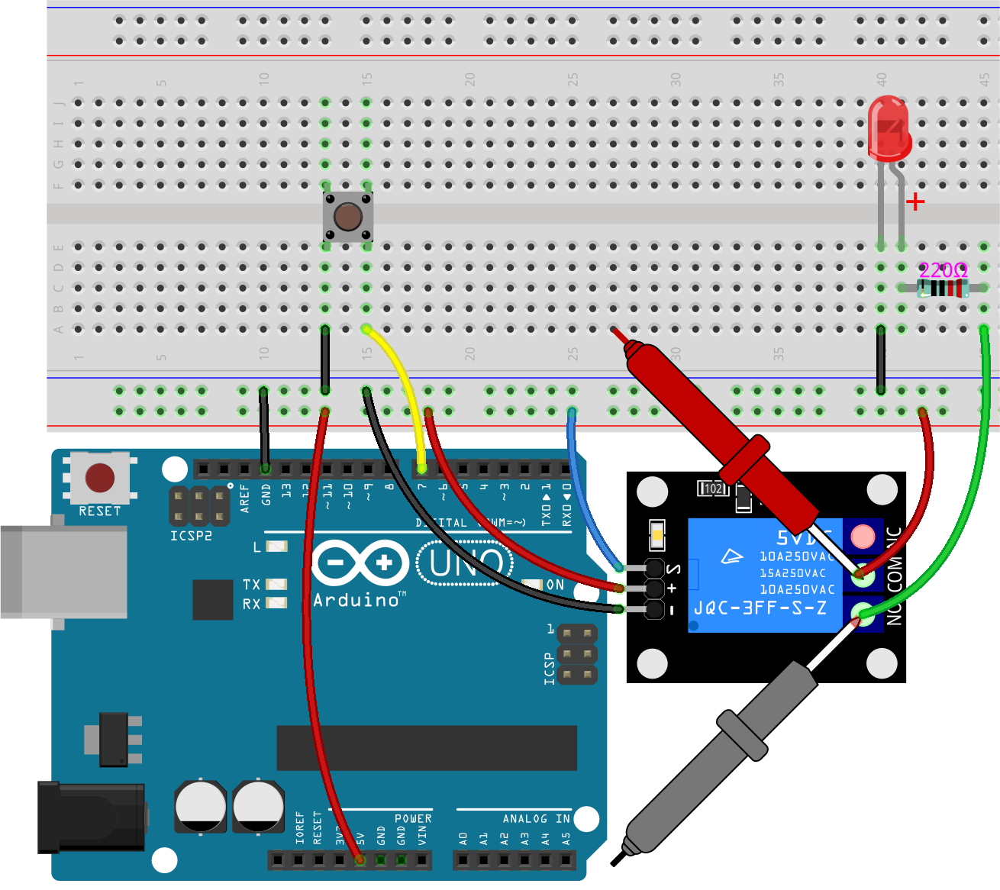

.. note::

    Hello, welcome to the SunFounder Raspberry Pi & Arduino & ESP32 Enthusiasts Community on Facebook! Dive deeper into Raspberry Pi, Arduino, and ESP32 with fellow enthusiasts.

    **Why Join?**

    - **Expert Support**: Solve post-sale issues and technical challenges with help from our community and team.
    - **Learn & Share**: Exchange tips and tutorials to enhance your skills.
    - **Exclusive Previews**: Get early access to new product announcements and sneak peeks.
    - **Special Discounts**: Enjoy exclusive discounts on our newest products.
    - **Festive Promotions and Giveaways**: Take part in giveaways and holiday promotions.

    👉 Ready to explore and create with us? Click [|link_sf_facebook|] and join today!

.. _onoff_desk_lamp:

18. ON/OFF Desk Lamp
====================================

Welcome to our hands-on tutorial where you will learn how to build a relay-controlled desk lamp using an Arduino Uno R3. This project simulates real-world applications of relays in controlling high-power devices through low-voltage control systems. 

.. .. image:: img/10_desk_lamp_button.jpg
..     :width: 500
..     :align: center

.. raw:: html

    <video width="600" loop autoplay muted>
        <source src="_static/video/18_on_off_lamp.mp4" type="video/mp4">
        Your browser does not support the video tag.
    </video>

For safety, we will not directly connect a high-power lamp to the relay's load end but will use an LED to simulate the operation of turning a lamp on and off by pressing the button.

By the end of this lesson, you will be able to:

* Understand and operate relay modules with Arduino.
* Implement safety measures for controlling high-current loads.
* Use ``INPUT_PULLUP`` mode for efficient button management.
* Detect changes in state to control outputs responsively.

Understanding the Relay Module
-------------------------------------------

Find the relay module.

Relays are electrically operated switches designed to allow a small current to control a much larger one. This capability makes them ideal for interfacing low-voltage control systems, such as those found in Arduino boards (typically operating between 3.3V and 5V), with high-voltage devices. In most residential and office environments, where standard voltages range from 110V to 240V, relay modules offer a practical solution for safely controlling these higher voltages.

.. image:: img/10_relay_module.png
    :width: 300
    :align: center

The construction of a relay typically includes an electromagnet, an armature, a spring, and a pair of contact points. The electromagnet is created by a coil wound around an iron core. When the coil is de-energized, the electromagnet loses its magnetism, releasing the armature and maintaining a connection between the Normally Closed (NC) and Common (COM) contact points.

* **NC**: Normally Closed. Connected to the COM pin by default when not energized.
* **COM**: Common pin
* **NO**: Normally Open. Disconnected from the COM pin by default when not energized.
* **Coil Pin**: These are the terminals at either end of the coil, with no directionality.

When the coil is energized, the electromagnet generates a magnetic field, attracting the armature and bringing the metal contact points between COM and NO together. Once the coil is de-energized, the spring tension pulls the COM and NC contacts back together.

.. image:: img/10_relay_no.jpg
    :width: 500
    :align: center

The relay module consists of a relay, transistor, LED, resistor, and three screw terminals mounted on a PCB. Here’s a brief description of the module’s pins:

.. image:: img/10_relay_pinout.jpg
    :width: 500
    :align: center

* **-**: GND
* **+**: VCC
* **S**: Signal pin, used to control this relay. Input high and the relay closes, input low and the relay opens.
* **COM**: Common pin
* **NC**: Normally Closed
* **NO**: Normally Open

The schematic of the module is as follows:

When a high signal is input to the **S** pin, it passes through the indicator light and current-limiting resistor, turning on the NPN transistor. This current energizes the relay's coil, generating a magnetic field that attracts the armature, causing a "click" sound and connecting the COM and NO terminals, thus completing the circuit.

Build the Circuit
------------------------------------
Now let's build a circuit to drive an LED and explore the working principle of the relay module.

**Components Needed**

.. list-table:: 
   :widths: 25 25 25 25
   :header-rows: 0

   * - 1 * Arduino Uno R3
     - 1 * Red LED
     - 1 * 220Ω Resistor
     - 1 * Relay Module
   * - |components_uno_r3| 
     - |components_red_led| 
     - |components_220ohm|  
     - |components_relay_module| 
   * - 1 * Button
     - 1 * USB Cable
     - 1 * Breadboard
     - Jumper Wires
   * - |components_button| 
     - |components_usb_cable| 
     - |components_breadboard| 
     - |components_wire|

**Building Steps**

Typically, you could use a relay to retrofit your home lamp to be controlled programmatically.

    .. warning::

        Do not attempt this modification without prior electrical knowledge, as it involves handling 220V voltage, which is extremely dangerous.

.. image:: img/10_relay_lamp.jpg
    :width: 600
    :align: center

For safety, in this course, we will use an LED to simulate a high-power load. Follow the wiring diagram or the steps below to build your circuit.

1. On the breadboard, connect the 5V of the Arduino Uno R3 to the positive rail of the breadboard, and GND to the negative rail.

.. image:: img/10_relay_led_power.png
    :width: 600
    :align: center

2. Connect the S pin of the relay module to pin 2 on the Arduino Uno R3. Connect the "+" and "-" pins to the positive and negative rails of the breadboard, respectively.

.. image:: img/10_relay_led_relay_module.png
    :width: 600
    :align: center

3. Typically, the COM terminal of the relay module connects to an external power source, but for this lesson, simply plug it into the positive rail of the breadboard to light up an LED.

.. image:: img/10_relay_led_relay_com.png
    :width: 600
    :align: center

4. Insert a red LED on the breadboard with the anode in hole 41E and the cathode in hole 40E.

.. image:: img/10_relay_led_led.png
    :width: 600
    :align: center

5. Now connect the cathode of the LED to GND.

.. image:: img/10_relay_led_gnd.png
    :width: 600
    :align: center

6. Insert a 220Ω resistor between holes 41C and 45C to serve as a current-limiting resistor for the LED's anode.

7. Connect hole 45A to the NO terminal of the relay module with a jumper wire.

8. Insert a button between holes 13E, 13F, 15E, and 15F on the breadboard.

9. Finally, connect a jumper wire from 13A to the negative rail and another from 15A to pin 7.

**Test Relay Module**

Now, use a multimeter to measure the continuity between the COM, NO, and NC to validate the working principle of the relay module.

1. Set the multimeter to **Continuity**, the setting with a diode symbol and a sound icon is used for measuring continuity.

.. image:: img/multimeter_diode.png
    :width: 300
    :align: center

2. Touch the multimeter test leads to the COM and NC terminals of the relay module, you will hear a "beep" sound from the multimeter, indicating that these two terminals are connected.

.. image:: img/10_relay_led_com_nc.png
    :width: 600
    :align: center

3. Record the measurement results in the table below.

.. list-table::
   :widths: 20 20
   :header-rows: 1

   * - State
     - Connection at COM terminal
   * - Default
     - *NC*
   * - S pin High
     - 

4. Connect the S pin of the relay module to the positive rail of the breadboard. You will hear a "click" sound, and the signal indicator on the relay module as well as the load LED will light up.

.. image:: img/10_relay_led_s_5v.png
    :width: 600
    :align: center

5. Again, touch the multimeter test leads to the COM and NO terminals of the relay module, you will hear a "beep" sound from the multimeter, indicating that these two terminals are connected.

6. Record the measurement results in the table below.

.. list-table::
   :widths: 20 20
   :header-rows: 1

   * - State
     - Connection at COM terminal
   * - Default
     - *NC*
   * - S pin High
     - *NO*

These tests confirm that the relay module is activated by a high signal. When the S pin receives a high signal, it causes the COM and NO terminals to connect, thereby allowing the circuit to control high-power loads effectively.

Code Creation
---------------------------------

Now let's write the code to toggle the relay module's state with a button press. This way, you can see the relay close and the LED light up when you press the button, and the relay open and the LED turn off when you press the button again, switching repeatedly.

1. Open the Arduino IDE and start a new project by selecting “New Sketch” from the “File” menu.
2. Save your sketch as ``Lesson18_Desk_Lamp_Relay`` using ``Ctrl + S`` or by clicking “Save”.

3. Initialize the pins connected to the button and the relay module. In Lesson 8, we used a button with a manually connected 10K pull-down resistor between GND and the button. However, in this circuit, we did not connect a resistor. Instead, we can use the Arduino software pull-up feature. You need to set the pin connected to the button as input while also setting it to ``PULLUP``.

.. code-block:: Arduino
    :emphasize-lines: 6

    int potValue = 0;

    void setup() {
        // put your setup code here, to run once:
        pinMode(2, OUTPUT);        // Set pin 2 as output
        pinMode(7, INPUT_PULLUP);  // Set pin 7 as input with an internal pull-up resistor
    }

4. Before entering the ``void loop()``, we also need to create two variables to initialize the states of the button and the Relay module. The initial state of the relay is LOW. Since the button uses an internal pull-up resistor, it will read as HIGH when not pressed.

.. code-block:: Arduino
    :emphasize-lines: 1,2

    int relayState = LOW;          // Initial state of the LED
    int lastButtonState = HIGH;  // the previous reading from the input pin

    void setup() {
        pinMode(2, OUTPUT);        // Set pin 2 as output
        pinMode(7, INPUT_PULLUP);  // Set pin 7 as input with an internal pull-up resistor
    }

5. Now, in the ``void loop()``, first read the state of the button using ``digitalRead()`` and store it in the variable ``buttonState``. 

.. code-block:: Arduino
    :emphasize-lines: 2

    void loop() {
        int buttonState = digitalRead(7);  // Read the state of the button
    }

6. Let's start with the core function that monitors the button press.

Previously, we learned how to determine if a button is pressed by reading its state as ``HIGH`` or ``LOW``. However, this lesson aims to respond to a single press without the need to keep the button held down. This requires us to detect a change in the button's state.

To achieve this, we use an ``if`` statement that compares the button's previous state (``lastButtonState``) with its current state (``buttonState``). The logical operator ``&&`` is used here, meaning both conditions must be true for the block of code within the ``if`` statement to execute.

.. code-block:: Arduino
    :emphasize-lines: 4

    void loop() {
        int buttonState = digitalRead(7);  // Read the state of the button
        // Check if button state has changed from the last loop iteration
        if (lastButtonState == HIGH && buttonState == LOW) {  // Button press detected
        }
    }

7. When the button is detected as pressed, we toggle the Relay's state. This means if the relay module was off, it turns on, and if it was on, it turns off. The ``!`` operator is used to invert the state of the ``relayState`` variable.

.. code-block:: Arduino
    :emphasize-lines: 5

    void loop() {
        int buttonState = digitalRead(7);  // Read the state of the button
        // Check if button state has changed from the last loop iteration
        if (lastButtonState == HIGH && buttonState == LOW) {  // Button press detected
            relayState = !relayState;                               // Toggle relay module state
        }
    }

8. Then use the ``digitalWrite()`` function to write ``relayState`` to pin 2.

.. code-block:: Arduino
    :emphasize-lines: 6

    void loop() {
        int buttonState = digitalRead(7);  // Read the state of the button
        // Check if button state has changed from the last loop iteration
        if (lastButtonState == HIGH && buttonState == LOW) {  // Button press detected
            relayState = !relayState;                               // Toggle relay module state
            digitalWrite(2, relayState);                        // Set the relay module state
        }
    }

9. After checking the button's state and updating the relay accordingly, we need to record the current state of the button as the new 'last known state'. This step is crucial for detecting the next state change.

.. code-block:: Arduino
    :emphasize-lines: 8,9

    void loop() {
        int buttonState = digitalRead(7);  // Read the state of the button
        // Check if button state has changed from the last loop iteration
        if (lastButtonState == HIGH && buttonState == LOW) {  // Button press detected
            relayState = !relayState;                           // Toggle relay module state
            digitalWrite(2, relayState);                        // Set the relay module state
        }
        lastButtonState = buttonState;  // Update lastButtonState to the current state
        delay(200);                     // Optional: Simple software debouncing
    }

10. Your complete code is as follows; you can click the **Upload** button to upload the code to the Arduino Uno R3. 

After the code is successfully uploaded, when you press the button, the relay closes with a "click" sound, and the indicator light on the relay module as well as the external LED light up. Press the button again, and you will hear the same "click" sound, the indicator light and LED turn off. This cycle repeats.

.. code-block:: Arduino

    int relayState = LOW;        // Initial state of the relay module
    int lastButtonState = HIGH;  // the previous reading from the input pin

    void setup() {
        pinMode(2, OUTPUT);        // Set pin 2 as output
        pinMode(7, INPUT_PULLUP);  // Set pin 7 as input with an internal pull-up resistor
    }

    void loop() {
        int buttonState = digitalRead(7);  // Read the state of the button
        // Check if button state has changed from the last loop iteration
        if (lastButtonState == HIGH && buttonState == LOW) {  // Button press detected
            relayState = !relayState;                           // Toggle relay module state
            digitalWrite(2, relayState);                        // Set the relay module state
        }
        lastButtonState = buttonState;  // Update lastButtonState to the current state
        delay(200);                     // Optional: Simple software debouncing
    }

11. Finally, remember to save your code and tidy up your workspace.

**Summary**

In this course, you engaged in building a relay-controlled circuit that simulates a desk lamp using an LED as a proxy for high-power loads. The project included setting up a circuit on a breadboard, wiring components, and programming an Arduino to control the relay based on button inputs. Through testing with a multimeter, you confirmed the functionality of the relay module and understood its operation under different signal conditions.

The code creation segment reinforced the concept of state changes and the use of conditional logic to control physical devices through programming. By completing this course, you've enhanced your understanding of both the theoretical and practical aspects of using relays in electronic projects, enabling you to apply these concepts to more complex and diverse applications in the future.

**Question**

1. What would happen if you set digital pin 7 to INPUT only? Why?

.. code-block::
    :emphasize-lines: 3

    void setup() {
        pinMode(9, OUTPUT);        // Set pin 9 as output
        pinMode(7, INPUT);  // Set pin 7 as input with an internal pull-up resistor
        Serial.begin(9600);        // Serial communication setup at 9600 baud
    }

2. If pin 7 is set only to ``INPUT``, what adjustments would need to be made to the circuit?