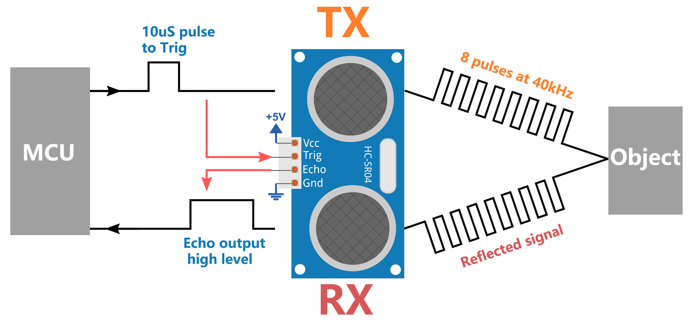
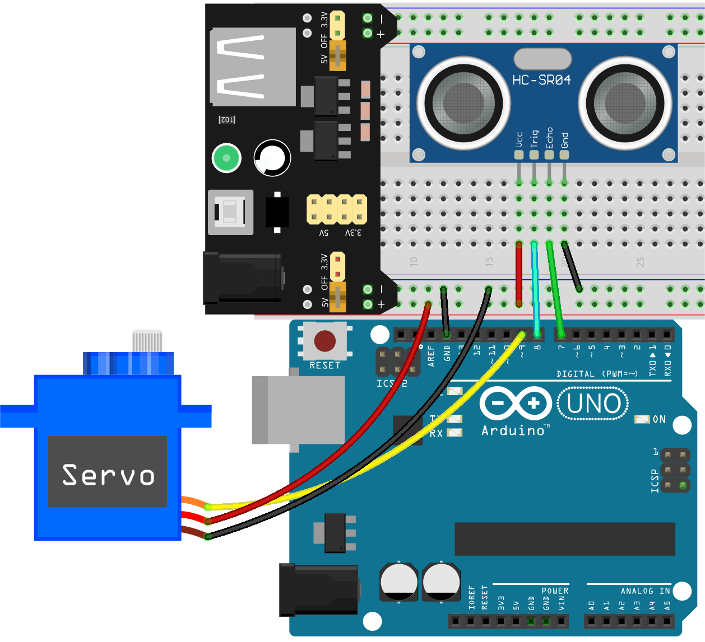
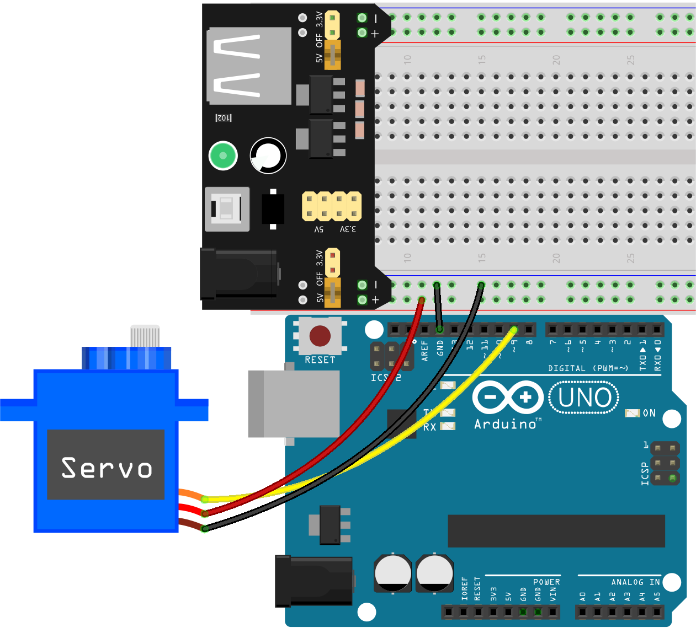
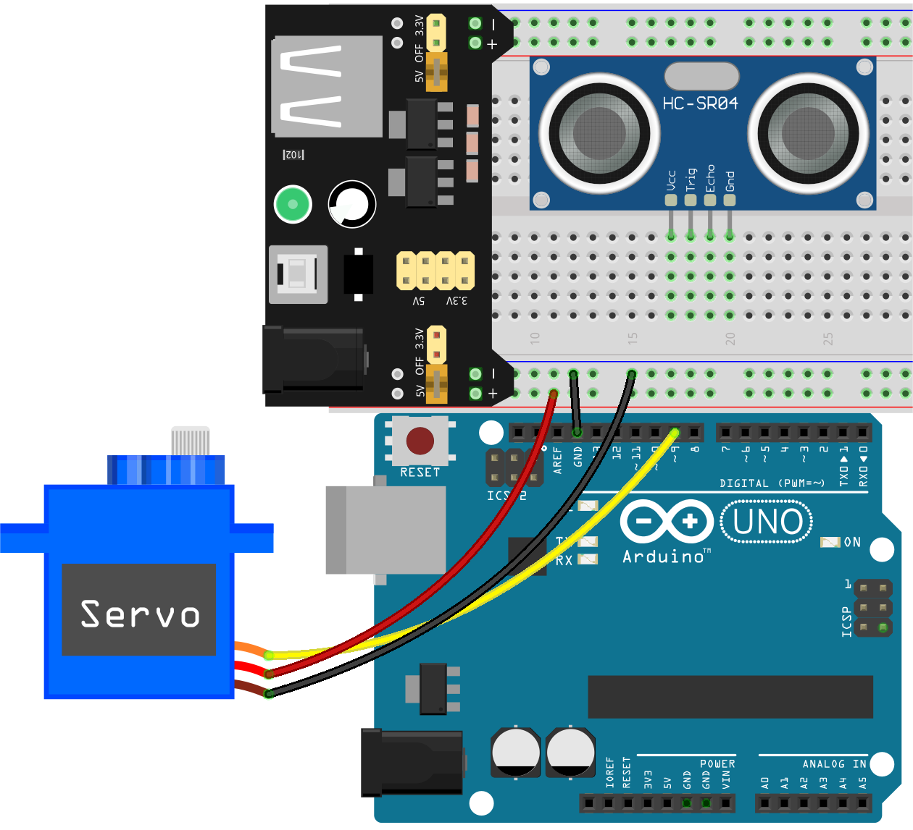

.. _ar_smart_trash_can:

19. Smart Trash Can
===========================

Welcome to our exciting project-based course where we'll be building a Smart Trash Can! This course offers a practical approach to integrating an ultrasonic sensor with a servo motor to create a trash can that responds to your presence. By the end of this course, you'll understand how to make everyday objects smarter and more interactive.

.. raw:: html

    <video muted controls style = "max-width:90%">
        <source src="_static/video/19_smart_trash_can.mp4" type="video/mp4">
        Your browser does not support the video tag.
    </video>

By the end of this lesson, you will be able to:

* Understand and utilize ultrasonic sensors for distance measurement.
* Integrate a servo to automate physical actions.
* Program an Arduino to control device behavior based on sensor inputs.

Learn the Ultrasonic Module
---------------------------------

Imagine you are in a dark room and can't see the objects around you. In this situation, you could clap your hands to produce a sound that travels outward. When this sound hits a wall or another object, it bounces back as an echo. If you listen carefully, you can hear this echo. By calculating the time it takes for the sound to travel out and the echo to return, you can roughly estimate how far away the wall or object is. Ultrasonic sensors work in a similar way to “see” the world around them.

.. image:: img/19_ultrasonic_pic.png
    :width: 400
    :align: center

* **TRIG**: Trigger Pulse Input
* **ECHO**: Echo Pulse Output
* **GND**: Ground
* **VCC**: 5V Supply

The HC-SR04 ultrasonic distance sensor, providing non-contact measurement from 2 cm to 400 cm with a range accuracy of up to 3 mm. Included on the module is an ultrasonic transmitter, a receiver and a control circuit.

You only need to connect 4 pins: VCC (power), Trig (trigger), Echo (receive) and GND (ground) to make it easy to use for your measurement projects.

**Principle**

The basic principles are as follows:

* Using IO trigger for at least 10us high level signal.
* The module sends an 8 cycle burst of ultrasound at 40 kHz and detects whether a pulse signal is received.
* Echo will output a high level if a signal is returned; the duration of the high level is the time from emission to return.
* Distance = (high level time x velocity of sound (340M/S)) / 2

.. note::

  This module should not be connected under power up, if necessary, let the module’s GND be connected first. Otherwise, it will affect the work of the module.

  The area of the object to be measured should be at least 0.5 square meters and as flat as possible. Otherwise, it will affect results.

Build the Circuit
------------------------------------

**Components Needed**

.. list-table:: 
   :widths: 25 25 25 25
   :header-rows: 0

   * - 1 * Arduino Uno R3
     - 1 * Servo
     - 1 * Ultrasonic Module
     - 1 * Breadboard Power Module 
   * - |list_uno_r3|
     - |list_servo| 
     - |list_ultrasonic|
     - |list_power_module|
   * - 1 * USB Cable
     - 1 * Breadboard
     - Jumper Wires
     -
   * - |list_usb_cable|
     - |list_breadboard|
     - |list_wire|
     -
   * - 1 * 9V Battery
     - 1 * Battery Cable
     - 
     -  
   * - |list_battery| 
     - |list_bat_cable| 
     -
     -

**Building Step-by-Step**

Follow the wiring diagram, or the steps below to build your circuit.

1. When using motors, servos, and other actuators, it's recommended to use an external power supply to avoid damaging the main board. Insert the breadboard power module into the breadboard, then use a jumper wire to connect the negative rail of the breadboard to the GND of the Arduino Uno R3 to achieve a common ground.

.. image:: img/14_dinosaur_power_module.png
    :width: 400
    :align: center

.. note::

    The order of the positive and negative terminals on the breadboard in the wiring diagram is reversed compared to the breadboard provided in the kit.

    In actual wiring, you need to insert the breadboard power module from the higher number side (60~65) so that the "-" of the power module goes into the negative rail "-" of the breadboard, and the "+" into the positive rail "+".

    .. raw:: html

        <video controls style = "max-width:100%">
            <source src="_static/video/about_power_module.mp4" type="video/mp4">
            Your browser does not support the video tag.
        </video>

2. Use three short jumper wires to extend the three wires of your servo: connect the yellow wire to pin 9 of the Arduino Uno R3, the red wire to the positive rail of the breadboard, and the brown wire to the negative rail of the breadboard.

4. Insert the ultrasonic module into the breadboard.

5. Connect the VCC pin of the ultrasonic module to the positive side of the breadboard, the Trig pin to pin 8 on the Arduino board, the Echo pin to pin 7, and the GND to the negative side of the breadboard.

.. _ar_read_distance:

Code Creation - Read the Distance
-----------------------------------------
Now, let's see how to get the distance measurements from the ultrasonic module.

1. Open the Arduino IDE and start a new project by selecting “New Sketch” from the “File” menu.
2. Save your sketch as ``Lesson19_Read_Distance`` using ``Ctrl + S`` or by clicking “Save”.

3. Firstly, we need to define the pins on the Arduino that are connected to the ultrasonic module.

.. code-block:: Arduino
  :emphasize-lines: 1,2

  #define TRIGGER_PIN  8
  #define ECHO_PIN     7

4. In the ``setup()`` function, we set the mode for each pin. The Trig pin needs to be set to output (as it sends the signal), the Echo pin is set to input (as it receives the signal).

.. code-block:: Arduino
  :emphasize-lines: 2,3
  
  void setup() {
    pinMode(TRIGGER_PIN, OUTPUT);  // Set the Trig pin as output
    pinMode(ECHO_PIN, INPUT);      // Set the Echo pin as input
    Serial.begin(9600);            // Start serial communication for debugging
  }

5. Writing the ``measureDistance()`` Function:

The ``measureDistance()`` function encapsulates the logic required to trigger the ultrasonic sensor and read the distance based on the echo received:

a. Triggering the Ultrasonic Pulse

  * Set the ``TRIGGER_PIN`` low initially to ensure a clean pulse.
  * A short delay of 2 microseconds ensures the line is clear.
  * Send a 10-microsecond high pulse to the ``TRIGGER_PIN``. This pulse tells the sensor to emit an ultrasonic sound wave.
  * Set the ``TRIGGER_PIN`` back to low to end the pulse.

  .. code-block:: Arduino

    long measureDistance() {
      digitalWrite(TRIGGER_PIN, LOW);  // Ensure Trig pin is low before a pulse
      delayMicroseconds(2);
      digitalWrite(TRIGGER_PIN, HIGH); // Send a high pulse
      delayMicroseconds(10);           // Pulse duration of 10 microseconds
      digitalWrite(TRIGGER_PIN, LOW);  // End the high pulse
    }

b. Reading the Echo

  * The ``pulseIn()`` function is used on the ``ECHO_PIN`` to measure the duration of the incoming pulse. This function waits for the pin to go ``HIGH``, times how long it stays ``HIGH``, and then returns the duration in microseconds.
  * This ``duration`` is the time taken for the ultrasonic pulse to travel to the object and back.

  .. code-block:: Arduino
    :emphasize-lines: 7

    long measureDistance() {
      digitalWrite(TRIGGER_PIN, LOW);  // Ensure Trig pin is low before a pulse
      delayMicroseconds(2);
      digitalWrite(TRIGGER_PIN, HIGH); // Send a high pulse
      delayMicroseconds(10);           // Pulse duration of 10 microseconds
      digitalWrite(TRIGGER_PIN, LOW);  // End the high pulse
      long duration = pulseIn(ECHO_PIN, HIGH);  // Measure the duration of high level on Echo pin
    }

c. Calculating the Distance

  * The speed of sound in air (approximately 340 m/s) is used here. The formula to calculate the distance is (duration * speed of sound) / 2. We divide by 2 because the sound wave travels to the object and back, so we only need half the distance for a one-way measurement.
  * In our code, 0.034 cm/us (speed of sound in cm/microsecond) is used as a conversion factor.

  .. code-block:: Arduino
    :emphasize-lines: 8,9

    long measureDistance() {
      digitalWrite(TRIGGER_PIN, LOW);  // Ensure Trig pin is low before a pulse
      delayMicroseconds(2);
      digitalWrite(TRIGGER_PIN, HIGH); // Send a high pulse
      delayMicroseconds(10);           // Pulse duration of 10 microseconds
      digitalWrite(TRIGGER_PIN, LOW);  // End the high pulse
      long duration = pulseIn(ECHO_PIN, HIGH);  // Measure the duration of high level on Echo pin
      long distance = duration * 0.034 / 2;     // Calculate the distance (in cm)
      return distance;
    }

6. In the ``loop()`` function, call the ``measureDistance()`` function to measure the distance, and then print it to the serial monitor.

.. code-block:: Arduino

  void loop() {
    long distance = measureDistance(); // Call the function to measure distance
    Serial.print("Distance: ");
    Serial.print(distance);
    Serial.println(" cm");

    delay(100);  // Delay between measurements
  }

.. note::

  In previous lessons, we worked with ``int`` and ``float`` types of variables or constants. Now, let's understand what ``long`` and ``unsigned long`` variables are about:

  * ``long``: A ``long`` integer is an extended version of an ``int``. It is used to store larger integer values that exceed the capacity of standard ``int``. A long typically occupies 32 or 64 bits of memory, which allows it to hold much larger values, both positive and negative.
  * ``unsigned long``: An ``unsigned long`` is similar to a ``long`` but can only represent non-negative values. It uses the bit normally reserved for the sign to extend the range of possible values it can hold, but strictly in the positive spectrum.

7. Here is your complete code. You can now click "Upload" to upload the code to the Arduino Uno R3.

.. code-block:: Arduino

  #define TRIGGER_PIN  8
  #define ECHO_PIN     7

  void setup() {
    pinMode(TRIGGER_PIN, OUTPUT);  // Set the Trig pin as output
    pinMode(ECHO_PIN, INPUT);      // Set the Echo pin as input
    Serial.begin(9600);            // Start serial communication for debugging
  }

  void loop() {
    long distance = measureDistance(); // Call the function to measure distance
    Serial.print("Distance: ");
    Serial.print(distance);
    Serial.println(" cm");

    delay(100);  // Delay between measurements
  }

  long measureDistance() {
    digitalWrite(TRIGGER_PIN, LOW);  // Ensure Trig pin is low before a pulse
    delayMicroseconds(2);
    digitalWrite(TRIGGER_PIN, HIGH); // Send a high pulse
    delayMicroseconds(10);           // Pulse duration of 10 microseconds
    digitalWrite(TRIGGER_PIN, LOW);  // End the high pulse

    long duration = pulseIn(ECHO_PIN, HIGH);  // Measure the duration of high level on Echo pin
    long distance = duration * 0.034 / 2;     // Calculate the distance (in cm)
    return distance;
  }

8. Open the serial monitor, and you will see the printed distance values. You can move the object in front of the ultrasonic sensor to see if the printed distance changes. If it does, this indicates that the ultrasonic module is functioning correctly.

.. code-block::

  Distance: 30 cm
  Distance: 29 cm
  Distance: 28 cm
  Distance: 27 cm
  Distance: 26 cm
  Distance: 25 cm
  Distance: 25 cm

9. Finally, remember to save your code and tidy up your workspace.

**Question**

If you want the distance detected by this device to be more accurate to decimals, how should you modify the code?

Code Creation - Smart Trash Can
-------------------------------------
We already know how to measure the distance to objects using an ultrasonic module. Now, let's write code to create a smart trash can. This trash can will automatically open its lid when the ultrasonic sensor detects an object closer than 20cm—indicating that you intend to dispose of trash. After the trash is thrown in, the lid will automatically close.

The lid's movement is controlled by a servo:

* At a servo angle of 90 degrees, the servo shaft is parallel to the servo, meaning the trash can lid is closed.
* At 0 degrees, the servo shaft is perpendicular to the servo, lifting the lid open via a rod attached to the shaft.

Let's explore how to implement this using code.

1. Open the sketch you saved earlier, ``Lesson19_Read_Distance``. Hit "Save As..." from the "File" menu, and rename it to ``Lesson19_Smart_Trashcan``. Click "Save".

2. To control the servo, we need to include the ``Servo`` library and create an instance of the ``Servo`` class to control the servo.

.. code-block:: Arduino
  :emphasize-lines: 1,3

  #include <Servo.h>

  Servo myServo;  // Create a Servo object

  #define TRIGGER_PIN 8
  #define ECHO_PIN 7

3. Let's start by defining the servo pin, and create two variables ``openAngle`` and ``closeAngle`` to store the angles for opening and closing the trash can lid respectively.

.. code-block:: Arduino
  :emphasize-lines: 9-11

  #include <Servo.h>

  Servo myServo;  // Create a Servo object

  #define TRIGGER_PIN 8
  #define ECHO_PIN 7

  // Set up the servo motor parameters
  const int servoPin = 9;
  const int openAngle = 0;
  const int closeAngle = 90;

4. In the ``void setup()`` function, attach the servo object to the specified pin.

.. code-block:: Arduino
  :emphasize-lines: 6

  void setup() {
    pinMode(TRIGGER_PIN, OUTPUT);  // Set the Trig pin as output
    pinMode(ECHO_PIN, INPUT);      // Set the Echo pin as input
    Serial.begin(9600);            // Start serial communication for debugging

    myServo.attach(servoPin);
  }

5. Now we've reached the main program. First, comment out the code for the three serial print statements to avoid interfering with the program's process.

.. code-block:: Arduino
  :emphasize-lines: 6

  void loop() {
    long distance = measureDistance();  // Call the function to measure distance
    // Serial.print("Distance: ");
    // Serial.print(distance);
    // Serial.println(" cm");
    delay(100);  // Delay between measurements
  }

6. As planned, if the ultrasonic sensor detects a distance less than 20cm, the servo should rotate to 0 degrees to open the trash can lid. Otherwise, the servo should remain at 90 degrees to keep the lid closed.

  * ``delay(2000);`` is used here to give you enough time to throw away the trash without the lid closing too quickly. You can adjust this timing as needed.
  * In ``if (distance > 2 && distance < 20)``, the condition ``distance > 2`` is used to filter out invalid values. The effective detection range of the ultrasonic sensor is from 2cm to 400cm. Distances that are too far or too close will return invalid values of -1 or 0.

.. code-block:: Arduino
  :emphasize-lines: 7-12

  void loop() {
    long distance = measureDistance();  // Call the function to measure distance
    // Serial.print("Distance: ");
    // Serial.print(distance);
    // Serial.println(" cm");

    if (distance > 2 && distance < 20) {
      myServo.write(openAngle);
      delay(2000);
    } else {
      myServo.write(closeAngle);
    }

    delay(100);  // Delay between measurements
  }

7. Your complete code is as follows. You can upload it and test to see if your trash can automatically opens and then closes after you've disposed of your trash.

.. code-block:: Arduino

  #include <Servo.h>

  Servo myServo;  // Create a Servo object

  #define TRIGGER_PIN 8
  #define ECHO_PIN 7

  // Set up the servo motor parameters
  const int servoPin = 9;
  const int openAngle = 0;
  const int closeAngle = 90;

  void setup() {
    pinMode(TRIGGER_PIN, OUTPUT);  // Set the Trig pin as output
    pinMode(ECHO_PIN, INPUT);      // Set the Echo pin as input
    Serial.begin(9600);            // Start serial communication for debugging

    myServo.attach(servoPin);
  }

  void loop() {
    long distance = measureDistance();  // Call the function to measure distance
    // Serial.print("Distance: ");
    // Serial.print(distance);
    // Serial.println(" cm");

    if (distance > 2 && distance < 20) {
      myServo.write(openAngle);
      delay(2000);
    } else {
      myServo.write(closeAngle);
    }

    delay(100);  // Delay between measurements
  }

  // Function to read the sensor data and calculate the distance
  long measureDistance() {
    digitalWrite(TRIGGER_PIN, LOW);  // Ensure Trig pin is low before a pulse
    delayMicroseconds(2);
    digitalWrite(TRIGGER_PIN, HIGH);  // Send a high pulse
    delayMicroseconds(10);            // Pulse duration of 10 microseconds
    digitalWrite(TRIGGER_PIN, LOW);   // End the high pulse

    long duration = pulseIn(ECHO_PIN, HIGH);  // Measure the duration of high level on Echo pin
    long distance = duration * 0.034 / 2;     // Calculate the distance (in cm)
    return distance;
  }

8. Finally, remember to save your code and tidy up your workspace.

**Summary**

Today, we successfully built a smart trash can that opens its lid automatically when an object is within 20 cm. We explored how ultrasonic sensors work, similar to echolocation, and applied this technology to control a servo motor. We also discussed best practices in wiring and provided tips for effective Arduino programming. The interactive nature of the project provided hands-on experience with real-world applications of sensors and servo motors.

