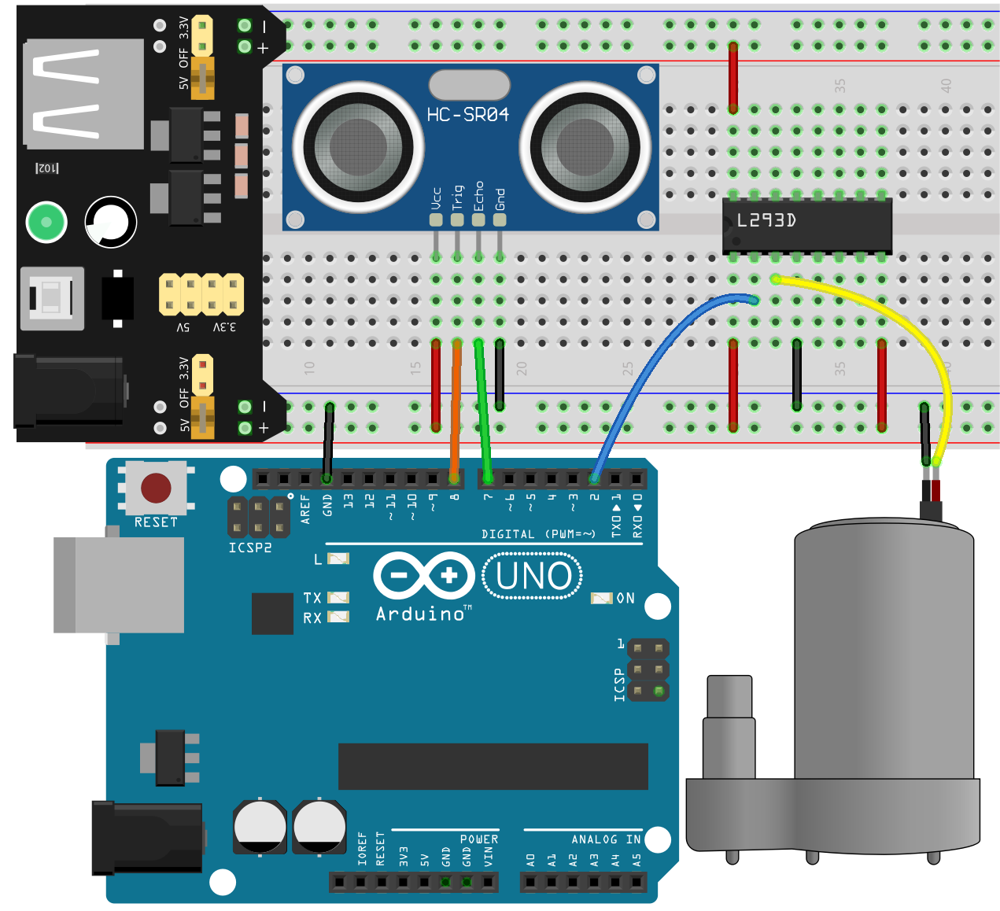
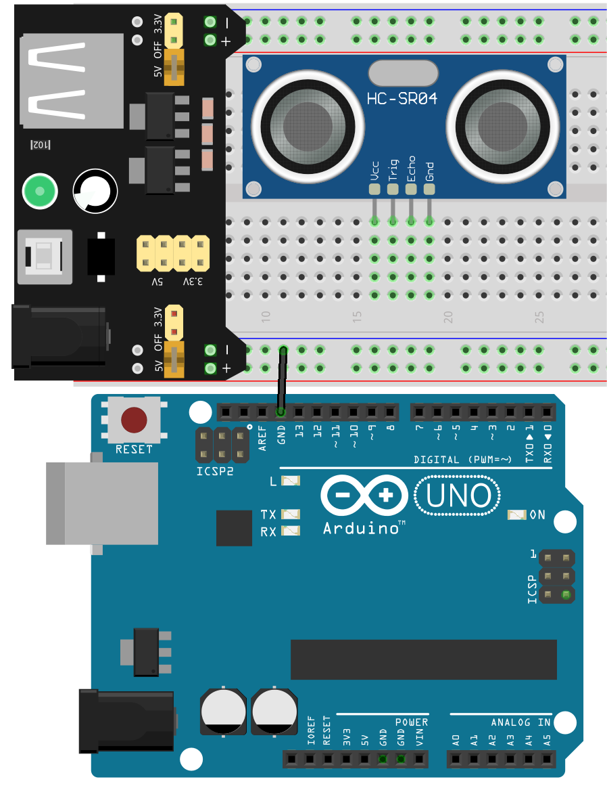
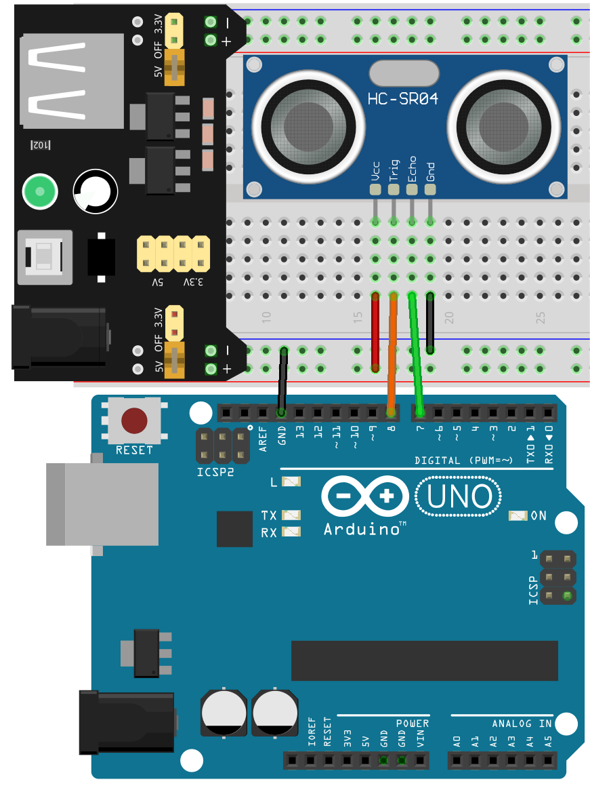
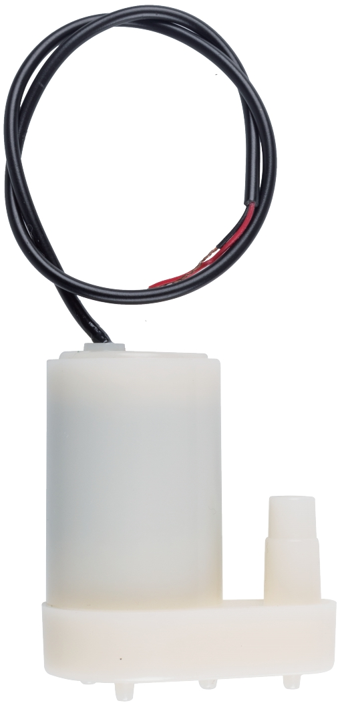
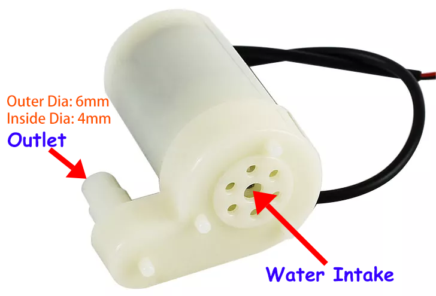
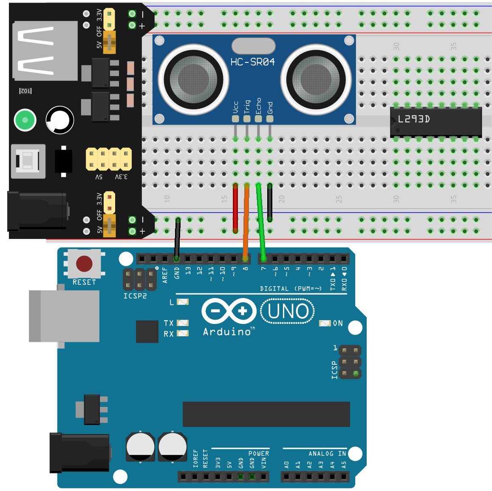
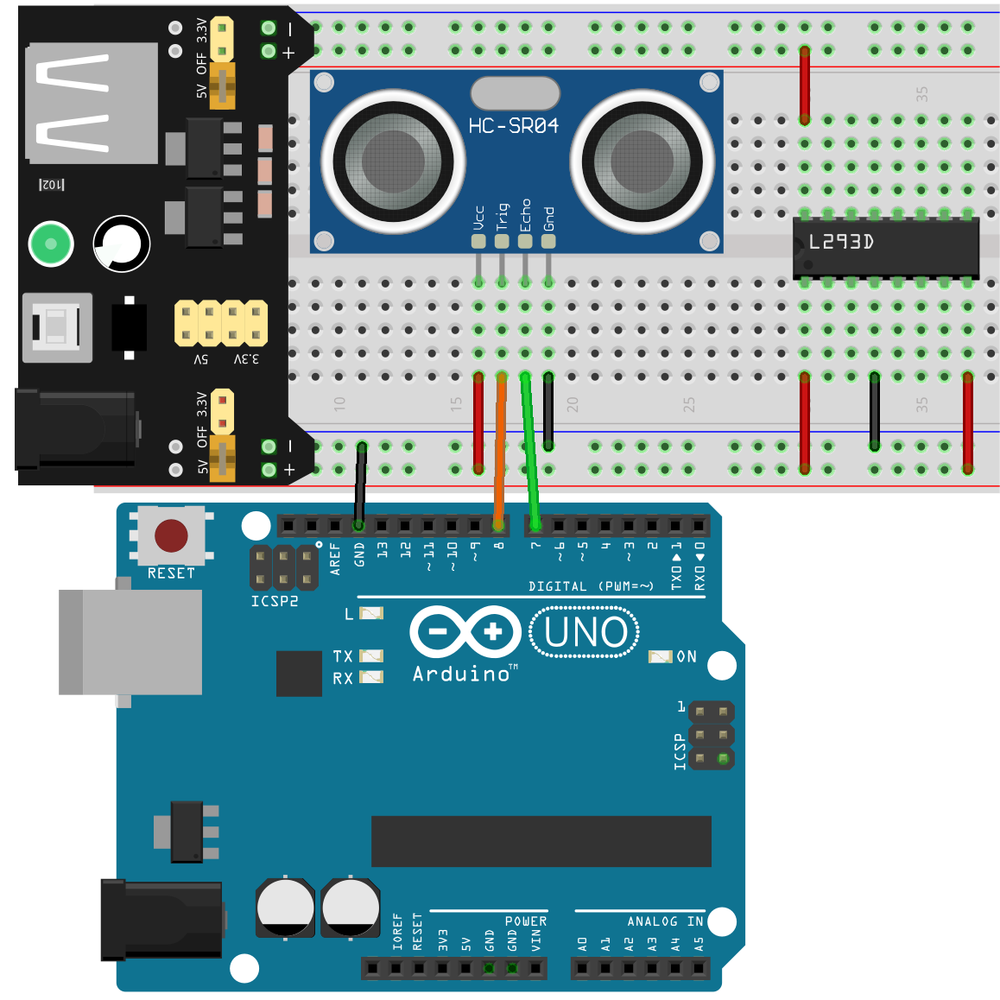
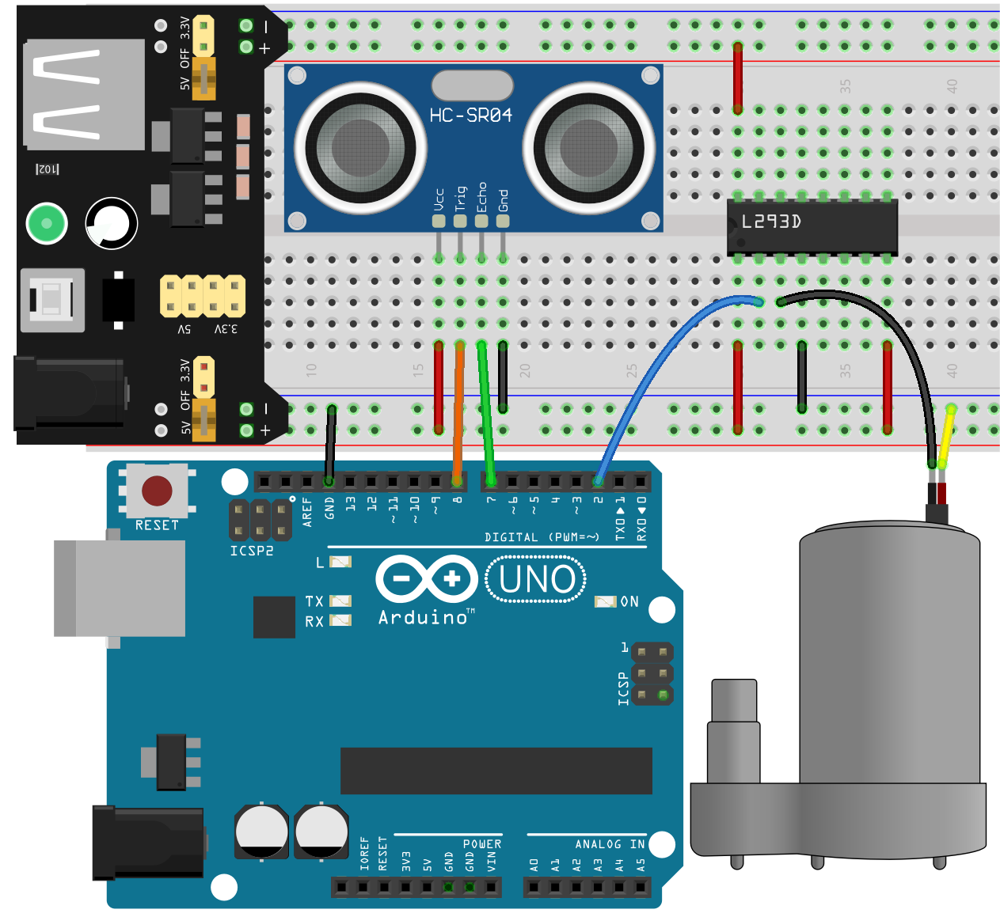

.. _automatic_soap_dispenser:

20. Automatic Soap Dispenser
================================

Welcome to our course on building an Automatic Soap Dispenser using Arduino technology! In this course, we will explore the fascinating world of automated systems and how simple electronics can greatly enhance everyday objects. Our focus will be on creating a device that senses the proximity of a hand and automatically dispenses soap.

.. raw:: html

    <video width="600" loop autoplay muted>
        <source src="_static/video/20_automatic_soap_dispenser.mp4" type="video/mp4">
        Your browser does not support the video tag.
    </video>

By the end of this lesson, you will be able to:

* Learn about the operational principles of water pump.
* Develop an automatic soap dispenser that responds to the proximity of your hand using distance measurements from an ultrasonic sensor.

Build the Circuit
------------------------------------

**Components Needed**

.. list-table:: 
   :widths: 25 25 25 25
   :header-rows: 0

   * - 1 * Arduino Uno R3
     - 1 * Pump
     - 1 * Ultrasonic Module
     - 1 * L293D Chip
   * - |list_uno_r3|
     - |list_pump| 
     - |list_ultrasonic|
     - |list_l293d|
   * - 1 * USB Cable
     - 1 * Breadboard
     - Jumper Wires
     - 1 * Breadboard Power Module
   * - |list_usb_cable|
     - |list_breadboard|
     - |list_wire|
     - |list_power_module|
   * - 1 * 9V Battery
     - 1 * Battery Cable
     - 
     -  
   * - |list_battery| 
     - |list_bat_cable| 
     -
     -

**Building Step-by-Step**

Follow the wiring diagram, or the steps below to build your circuit.

1. When using motors, servos, and other actuators, it's recommended to use an external power supply to avoid damaging the main board. Insert the breadboard power module into the breadboard, then use a jumper wire to connect the negative rail of the breadboard to the GND of the Arduino Uno R3 to achieve a common ground.

.. image:: img/14_dinosaur_power_module.png
    :width: 400
    :align: center

.. note::

    The order of the positive and negative terminals on the breadboard in the wiring diagram is reversed compared to the breadboard provided in the kit.

    In actual wiring, you need to insert the breadboard power module from the higher number side (60~65) so that the "-" of the power module goes into the negative rail "-" of the breadboard, and the "+" into the positive rail "+".

    .. raw:: html

        <video width="600" loop muted>
            <source src="_static/video/about_power_module.mp4" type="video/mp4">
            Your browser does not support the video tag.
        </video>

2. Insert the ultrasonic module into the breadboard.

3. Connect the VCC pin of the ultrasonic module to the positive side of the breadboard, the Trig pin to pin 8 on the Arduino board, the Echo pin to pin 7, and the GND to the negative side of the breadboard.

4. Find the water pump.

This is the DC 2.5-6V mini submersible water pump, ideal for small-scale projects like tabletop fountains, aquariums, and hydroponic systems.

This pump employs centrifugal mechanics, using an electric motor to convert rotational energy into fluid dynamic energy, efficiently moving water through its system. Easy to install and maintain, it's a reliable choice for DIY enthusiasts.

5. The water pump also requires a motor driver chip. Now, let's insert the L293D chip across the middle notch of the breadboard. Make sure the notch on the chip faces left.

6. Connect the pins of the L293D chip as follows.

* **1(1,2EN)**: Connect to the positive rail of the breadboard to enable the chip.
* **4(GND)**: Connect to the negative rail of the breadboard to ground the chip.
* **8(VCC2)**: Connect to the positive rail of the breadboard to provide power to the motor.
* **16(VCC1)**: Connect to the positive rail of the breadboard to power the chip.

7. Unlike motors, water pumps do not have a direction of rotation to distinguish. They just need a voltage difference across two pins to start pumping water. Therefore, connect pin 2 (1A) of the L293D to pin 2 on the Arduino Uno R3, and pin 3 (1Y) to the water pump, with the other pin of the water pump going to GND.

* By simply setting pin 2 to high, the water pump will start pumping water.

Code Creation - Making the Water Pump Work
---------------------------------------------

First, let's see how the water pump works. You will need a cup of water, make sure it's enough to completely submerge the pump, and another empty cup to collect the water pumped out.

1. Open the Arduino IDE and start a new project by selecting “New Sketch” from the “File” menu.
2. Save your sketch as ``Lesson20_Pump`` using ``Ctrl + S`` or by clicking “Save”.

3. Operating the water pump is as simple as lighting up an LED. Just initialize the pump control pin, set it as output, then write it high.

.. code-block:: Arduino

  #define PUMP_PIN     2  // pump control pin

  void setup() {
    pinMode(PUMP_PIN, OUTPUT);    // Set the pump control pin as output
  }

  void loop() {
    digitalWrite(PUMP_PIN, HIGH);       // Turn on the pump at full speed
  }

4. The code is complete. You can now upload it to the Arduino Uno R3 board. Afterward, you will see the water being transferred from the filled cup to the empty one through the pump's tubing.

**Question**

In this project, you connected the water pump using a specific driver and setup. What do you think would happen if you reversed the connections of the pump? Would the pump work in reverse, stop working, or something else? Try this out and reflect on the outcome.

Code Creation - Automatic Soap Dispenser
-------------------------------------------
Here, we are building an automatic soap dispenser powered by a water pump that extracts soap liquid. The dispenser is triggered by an ultrasonic sensor that detects the proximity of a hand. When the distance measured by the sensor is less than 10 cm, indicating that a hand is near, the dispenser will expel soap.

To economize on soap usage, the pump operates for 500 milliseconds to dispense the soap. If a hand is still detected after a 2-second pause, the pump will activate once more for 500 milliseconds to ensure an adequate amount of soap is dispensed. This setup efficiently manages soap dispensing while accommodating user needs.

1. Open the Arduino IDE and start a new project by selecting “New Sketch” from the “File” menu.
2. Save your sketch as ``Lesson20_Soap_Dispenser`` using ``Ctrl + S`` or by clicking “Save”.

3. Initialize the two pins for the ultrasonic sensor and the pump pin.

.. code-block:: Arduino
  :emphasize-lines: 1-3

  #define TRIGGER_PIN 8
  #define ECHO_PIN 7
  #define PUMP_PIN 2  // pump control pin

  void setup() {
    // put your setup code here, to run once:

  }

4. In ``void setup()`` function, set the modes for each pin used in the project and initialize serial communication at 9600 bps for debugging and monitoring sensor output.

.. code-block:: Arduino
  :emphasize-lines: 6-9

  #define TRIGGER_PIN 8
  #define ECHO_PIN 7
  #define PUMP_PIN 2  // pump control pin

  void setup() {
    pinMode(PUMP_PIN, OUTPUT);     // Set the pump control pin as output
    pinMode(TRIGGER_PIN, OUTPUT);  // Set the Trig pin as output
    pinMode(ECHO_PIN, INPUT);      // Set the Echo pin as input
    Serial.begin(9600);            // Start serial communication for debugging
  }

5. You will need a specific function to retrieve the distance measured by the ultrasonic module. You can see how this function is implemented by referring to :ref:`ar_read_distance`.

.. code-block:: Arduino
  :emphasize-lines: 7-17
  
  void loop() {
    // put your main code here, to run repeatedly:

  }

  // Function to read the sensor data and calculate the distance
  long measureDistance() {
    digitalWrite(TRIGGER_PIN, LOW);  // Ensure Trig pin is low before a pulse
    delayMicroseconds(2);
    digitalWrite(TRIGGER_PIN, HIGH);  // Send a high pulse
    delayMicroseconds(10);            // Pulse duration of 10 microseconds
    digitalWrite(TRIGGER_PIN, LOW);   // End the high pulse

    long duration = pulseIn(ECHO_PIN, HIGH);  // Measure the duration of high level on Echo pin
    long distance = duration * 0.034 / 2;     // Calculate the distance (in cm)
    return distance;
  }

6. Now, move to the ``void loop()`` function, call the function ``measureDistance()`` to store the measured distance into the variable ``distance``, and print it to the serial monitor.

.. code-block:: Arduino
  :emphasize-lines: 2-4

  void loop() {
    long distance = measureDistance();  // Call the function to measure distance
    Serial.println(distance);
    delay(100);  // Delay between measurements
  }

7. Next, based on the distance, decide the operational state of the pump. If the distance is between 2 and 10 cm, the pump is activated to dispense soap for 500 milliseconds, then turns off and waits for 2 seconds before another activation can occur.

.. code-block:: Arduino
  :emphasize-lines: 5-12

  void loop() {
    long distance = measureDistance();  // Call the function to measure distance
    Serial.println(distance);

    if (distance > 2 && distance < 10) {  // If distance is between 2-10cm
      digitalWrite(PUMP_PIN, HIGH);       // Turn on the pump
      delay(500);
      digitalWrite(PUMP_PIN, LOW);  // Turn off the pump
      delay(2000);
    } else {
      digitalWrite(PUMP_PIN, LOW);  // Turn off the pump
    }
    delay(100);  // Delay between measurements
  }

8. Your complete code is as follows. You can upload it to the Arduino Uno R3 board.

.. code-block:: Arduino

  #define TRIGGER_PIN 8
  #define ECHO_PIN 7
  #define PUMP_PIN 2  // pump control pin

  void setup() {
    pinMode(PUMP_PIN, OUTPUT);     // Set the pump control pin as output
    pinMode(TRIGGER_PIN, OUTPUT);  // Set the Trig pin as output
    pinMode(ECHO_PIN, INPUT);      // Set the Echo pin as input
    Serial.begin(9600);            // Start serial communication for debugging
  }

  void loop() {
    long distance = measureDistance();  // Call the function to measure distance
    Serial.println(distance);

    if (distance > 2 && distance < 10) {  // If distance is between 2-10cm
      digitalWrite(PUMP_PIN, HIGH);       // Turn on the pump
      delay(500);
      digitalWrite(PUMP_PIN, LOW);  // Turn off the pump
      delay(2000);
    } else {
      digitalWrite(PUMP_PIN, LOW);  // Turn off the pump
    }
    delay(100);  // Delay between measurements
  }

  // Function to read the sensor data and calculate the distance
  long measureDistance() {
    digitalWrite(TRIGGER_PIN, LOW);  // Ensure Trig pin is low before a pulse
    delayMicroseconds(2);
    digitalWrite(TRIGGER_PIN, HIGH);  // Send a high pulse
    delayMicroseconds(10);            // Pulse duration of 10 microseconds
    digitalWrite(TRIGGER_PIN, LOW);   // End the high pulse

    long duration = pulseIn(ECHO_PIN, HIGH);  // Measure the duration of high level on Echo pin
    long distance = duration * 0.034 / 2;     // Calculate the distance (in cm)
    return distance;
  }

9. Finally, remember to save your code and tidy up your workspace.

**Summary**

In today's lesson, we successfully built and programmed an automatic soap dispenser. We explored the use of ultrasonic sensors for proximity detection and learned how to control a water pump through Arduino programming. The skills acquired today not only enhance your understanding of electronic circuits but also open up a wide range of possibilities for future projects.

