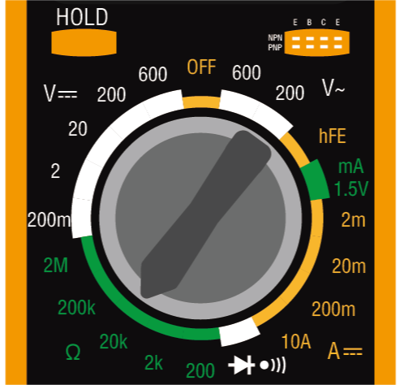

.. note::

    Hello, welcome to the SunFounder Raspberry Pi & Arduino & ESP32 Enthusiasts Community on Facebook! Dive deeper into Raspberry Pi, Arduino, and ESP32 with fellow enthusiasts.

    **Why Join?**

    - **Expert Support**: Solve post-sale issues and technical challenges with help from our community and team.
    - **Learn & Share**: Exchange tips and tutorials to enhance your skills.
    - **Exclusive Previews**: Get early access to new product announcements and sneak peeks.
    - **Special Discounts**: Enjoy exclusive discounts on our newest products.
    - **Festive Promotions and Giveaways**: Take part in giveaways and holiday promotions.

    👉 Ready to explore and create with us? Click [|link_sf_facebook|] and join today!

.. _ar_temperature:

21. Temperature Alarm
========================

In this lesson, we'll explore the critical role of temperature management in food safety. Not all foods need to be refrigerated or frozen; even shelf-stable items like chips, bread, and certain fruits require proper temperature storage to maintain quality and safety. By building a temperature monitoring system, we will learn how to keep foods within safe temperature ranges, triggering an alarm when temperatures deviate from these limits. This practical project not only helps protect food but also serves as an excellent introduction to environmental monitoring with real-world applications.

.. .. image:: img/16_temperature.jpg
..     :width: 400
..     :align: center

.. raw:: html

    <video muted controls style = "max-width:90%">
        <source src="_static/video/21_temp_alarm.mp4" type="video/mp4">
        Your browser does not support the video tag.
    </video>

By the end of this lesson, you will be able to:

* Understand the importance of temperature control in food safety.
* Build a circuit with a thermistor to monitor temperature changes.
* Write an Arduino program to read temperature data from a thermistor.
* Use logic in programming to trigger actions (like lighting an LED or sounding an alarm) based on temperature data.
* Apply concepts of electrical resistance and temperature conversion in practical scenarios.

Building the Circuit
-----------------------

**Components Needed**

.. list-table:: 
   :widths: 25 25 25 25
   :header-rows: 0

   * - 1 * Arduino Uno R3
     - 1 * RGB LED
     - 3 * 220Ω Resistor
     - 1 * 10KΩ Resistor
   * - |list_uno_r3| 
     - |list_rgb_led| 
     - |list_220ohm| 
     - |list_10kohm| 
   * - 1 * Thermistor
     - 1 * Breadboard
     - Jumper Wires
     - 1 * USB Cable
   * - |list_thermistor| 
     - |list_breadboard| 
     - |list_wire| 
     - |list_usb_cable| 
   * - 1 * Multimeter
     - 
     - 
     - 
   * - |list_meter| 
     - 
     - 
     - 

**Building Step-by-Step**

This circuit builds upon the one from Lesson 12 by adding a Thermistor.

.. image:: img/16_temperature_alarm.png
    :width: 500
    :align: center

1. Based on the circuit of lesson12, remove the jumper wire connecting the GND pin of the Arduino Uno R3 to the GND pin of the RGB LED and then insert it into the negative terminal of the breadboard. Then, connect a jumper wire from the negative terminal to the GND pin of the RGB LED.

.. image:: img/16_temperature_alarm_gnd.png
    :width: 500
    :align: center

2. Insert the Thermistor into holes 6E and 8E. The pins are non-directional and can be inserted freely.

.. image:: img/16_temperature_alarm_thermistor.png
    :width: 500
    :align: center

A thermistor is a special type of resistor whose resistance changes with temperature. This device is very useful as it helps us detect and measure temperature, thereby controlling it in various electronic projects and devices.

Here is the electronic symbol of thermistor.

.. image:: img/16_thermistor_symbol.png
    :width: 300
    :align: center

Thermistors are of two opposite fundamental types:

* **NTC thermistors**: Resistance decreases with rising temperature. Commonly used as temperature sensors or inrush current limiters in circuits.
* **PTC thermistors**: Resistance increases with rising temperature. Often used as resettable fuses in circuits to protect against overcurrent.

In this kit we use an **NTC** one. 

Now use a multimeter to measure the resistance of this thermistor to see if it indeed decreases with an increase in temperature.

3. Since the rated resistance of the thermistor is 10K, set the multimeter to measure resistance in the 20 kilo-ohm (20K) range.

4. Now, touch the two pins of the photoresistor with the red and black test leads of the multimeter.

.. image:: img/16_temperature_alarm_test.png
    :width: 500
    :align: center

5. Read the resistance value under the current temperature and record it in the table below.

.. list-table::
   :widths: 20 20
   :header-rows: 1

   * - Environment
     - Resistance (kilohm)
   * - Current temperature
     - *9.37*
   * - Higher temperature
     -
   * - Lower temperature
     -

6. Now you can find a friend to help you hold the thermistor, or use something else to raise the temperature around the thermistor (no water, no fire, safety first). Record the resistance value of the thermistor at this time in the table.

.. list-table::
   :widths: 20 20
   :header-rows: 1

   * - Environment
     - Resistance (kilohm)
   * - Current temperature
     - *9.37*
   * - Higher temperature
     - *6.10*
   * - Lower temperature
     -

7. You can place the thermistor outdoors, or fan it to lower the temperature around it. Record the resistance measured at this time in the table.

.. list-table::
   :widths: 20 20
   :header-rows: 1

   * - Environment
     - Resistance (kilohm)
   * - Current temperature
     - *9.37*
   * - Higher temperature
     - *6.10*
   * - Lower temperature
     - *12.49*

Through these measurements, we can see that the higher the ambient temperature, the lower the

8. Now you can continue building the circuit. Connect one end of the thermistor to a 10K resistor, and the other end of the 10K resistor to the negative terminal of the breadboard.

.. image:: img/16_temperature_alarm_resistor.png
    :width: 500
    :align: center

9. Connect the other end of the breadboard to the 5V pin of the Arduino Uno R3.

.. image:: img/16_temperature_alarm_5v.png
    :width: 500
    :align: center

10. Finally, connect the common pin of the photoresistor and the 10K resistor to the A0 pin of the Arduino Uno R3.

.. image:: img/16_temperature_alarm.png
    :width: 500
    :align: center

Understanding Temperature Calculation
----------------------------------------
**About the Temperature Formula**

The resistance of an NTC thermistor changes with temperature. This relationship is usually accurately described by the Steinhart-Hart Equation, as follows:

.. image:: img/16_format_steinhart.png
    :width: 400
    :align: center

Here, a, b, and c are called the Steinhart–Hart parameters, which must be specified for each device. T is the absolute temperature, and R is the resistance.

In addition to the Steinhart-Hart Equation, many practical applications also use a simplified formula based on the beta parameter (beta parameter) model to quickly calculate temperature. This model assumes that the relationship between resistance and temperature can be approximated by a simpler exponential relationship, thereby simplifying the calculation process and making it suitable for rapid temperature monitoring in engineering applications.

.. image:: img/16_format_3.png
    :width: 400
    :align: center

* **T** is the temperature of the thermistor in Kelvin.
* **T0** is a reference temperature, usually at 25°C (which is 273.15 + 25 in Kelvin).
* **B** is the beta parameter of the material, the beta coefficient of the NTC thermistor used in this kit is 3950.
* **R** is the resistance we measure.
* **R0** is the resistance at the reference temperature T0, the resistance of the NTC thermistor in this kit at 25°C is 10 kilohms.

After converting the above formulas, the Kelvin temperature is calculated as: ``T=1/(ln(R/R0)/B+1/T0)``, subtract 273.15 to convert it to Celsius.

**How to measure resistance?**

We connect the thermistor and a 10K resistor in series in our circuit.

.. image:: img/16_thermistor_sch.png
    :width: 200
    :align: center

The voltage at pin A0, which we measure, divided by the series resistor (the 10K resistor), tells us the current flowing through the circuit. This current can also be obtained by dividing the total voltage by the total resistance of the circuit (series resistor + thermistor):

.. image:: img/16_format_1.png
    :width: 400
    :align: center

* **Vsupply**: The voltage supplied to the circuit.
* **Rseries**: The resistance value of the series resistor.
* **Vmeasured**: The voltage across the 10K resistor, also the voltage at pin A0.

From these, we can rearrange the formula to find the resistance of the thermistor:

.. image:: img/16_format_2.png
    :width: 400
    :align: center

In our code, we use the ``analogRead()`` function to read the voltage at pin A0. The relationship between the voltage **Vmeasured** and the analog value read is:

.. code-block::

    (Analog value at A0) / 1023.0 = Vmeasured / Vsupply

Using the formula above, we calculate the thermistor's resistance:

.. code-block::

    R_thermistor =R_series x (1023.0 / (Analog value at A0) - 1)

.. note::

    If the formulas seem complicated, just remember the final ones here, and you're good to go!

    The resistance of the thermistor can be obtained through the following formula:

    .. code-block::

        R_thermistor =R_series x (1023.0 / (Analog value at A0) - 1)

    Then calculate the Kelvin temperature using the following formula:

    .. code-block::

        T=1/(ln(R/R0)/B+1/T0)

    * **T0**: 273.15 + 25.
    * **B**: 3950.
    * **R** is the resistance we measure.
    * **R0**: 10 kilohms.

    Finally, convert to Celsius using the following formula:

    .. code-block::

        Tc = T - 273.15

    
Code Creation
---------------

**Get the Temperature**

1. Open the Arduino IDE and start a new project by selecting “New Sketch” from the “File” menu.
2. Save your sketch as ``Lesson21_Temperature_Alarm`` using ``Ctrl + S`` or by clicking “Save”.

3. In previous lessons, we directly referenced the RGB LED pins in our code; here, we define them as constants.

.. code-block:: Arduino
    :emphasize-lines: 2-5

    // Pin configurations
    const int tempSensorPin = A0;  // NTC thermistor analog input
    const int redPin = 11;         // Red LED digital pin
    const int greenPin = 10;       // Green LED digital pin
    const int bluePin = 9;         // Blue LED digital pin

    void setup() {
        // put your setup code here, to run once:
    }

Using constants instead of variables, which remain unchanged throughout the program, provides clarity and simplifies maintenance. It allows meaningful names instead of numbers, and changes only need adjustments in declaration, not everywhere in the code. Constants follow the same naming rules as variables, avoiding any reserved keywords or commands from the Arduino IDE.

4. Before using the thermistor, we also need to define some more constants to store parameters related to the circuit.

.. note::

    You will see that there are ``int`` type constants and ``float`` type constants. So, what's the difference between these two types of constants?

  * ``const int``: An ``int`` (short for integer) constant holds whole numbers. This type does not support fractions or decimal points. It occupies typically 16 or 32 bits of memory, depending on the system.
  * ``const float``: A ``float`` (short for floating-point) constant holds numbers that can have fractional parts. It is used when more precision is needed, such as in measurements or calculations that require decimal values. A ``float`` typically occupies 32 bits of memory and can represent a wider range of numbers than ``int``.

.. code-block:: Arduino
    :emphasize-lines: 2-5

    // Pin configurations
    const int tempSensorPin = A0;  // NTC thermistor analog input
    const int redPin = 10;         // Red LED digital pin
    const int greenPin = 11;       // Green LED digital pin
    const int bluePin = 12;        // Blue LED digital pin

    // Constants for temperature calculation
    const float beta = 3950.0;               // NTC thermistor's Beta value
    const float seriesResistor = 10000;      // Series resistor value (ohms)
    const float roomTempResistance = 10000;  // NTC resistance at 25°C
    const float roomTemp = 25 + 273.15;      // Room temperature in Kelvin

5. In ``void setup()``, set the RGB LED pins as outputs and configure the serial communication baud rate to 9600.

.. code-block:: Arduino
    :emphasize-lines: 2-5

    void setup() {
        // Initialize LED pins as outputs
        pinMode(redPin, OUTPUT);
        pinMode(greenPin, OUTPUT);
        pinMode(bluePin, OUTPUT);
        
        // Start serial communication at 9600 baud
        Serial.begin(9600);
    }

6. First, you need to read the analog value of the pin A0 in ``void loop()``.

.. code-block:: Arduino
    :emphasize-lines: 2

    void loop() {
        int adcValue = analogRead(tempSensorPin);                     // Read thermistor value
    }

7. Next, calculate the resistance of the thermistor using the formula derived previously for converting analog values to voltage.

.. code-block:: Arduino
    :emphasize-lines: 3

    void loop() {
        int adcValue = analogRead(tempSensorPin);                     // Read thermistor value
        float resistance = (1023.0 / adcValue - 1) * seriesResistor;  // Calculate thermistor resistance
    }

8. Then, calculate the Kelvin temperature using the formula shown below:

.. code-block:: Arduino
    :emphasize-lines: 6

    void loop() {
        int adcValue = analogRead(tempSensorPin);                     // Read thermistor value
        float resistance = (1023.0 / adcValue - 1) * seriesResistor;  // Calculate thermistor resistance

        // Calculate temperature in Kelvin using Beta parameter equation
        float tempK = 1 / (log(resistance / roomTempResistance) / beta + 1 / roomTemp);
    }

9. Subtract 273.15 from the Kelvin temperature to convert it to Celsius, and then print the result to the serial monitor using the ``Serial.println()`` function.

.. code-block:: Arduino
    :emphasize-lines: 8,9

    void loop() {
        int adcValue = analogRead(tempSensorPin);                     // Read thermistor value
        float resistance = (1023.0 / adcValue - 1) * seriesResistor;  // Calculate thermistor resistance

        // Calculate temperature in Kelvin using Beta parameter equation
        float tempK = 1 / (log(resistance / roomTempResistance) / beta + 1 / roomTemp);
    
        float tempC = tempK - 273.15;  // Convert to Celsius
        Serial.println(tempC);           // Display temperature in Celsius on Serial Monitor
    }

10. At this point, you can upload the code to your Arduino Uno R3 and obtain the current Celsius temperature values.

.. code-block::

    26.28
    26.19
    26.19
    26.28
    26.28

**Change RGB LED Color**

Now, let's change the RGB LED color based on the temperature measured by the thermistor.

For example, we set three temperature ranges:

* Below 10 degrees, the RGB LED shows green, indicating the temperature is comfortable.
* Between 10 and 20 degrees, the RGB LED shows yellow, signaling caution with the current temperature.
* Above 21 degrees, the RGB LED shows red, indicating the temperature is too high and measures are needed.

11. For controlling the RGB LED, we'll use the function ``setColor()`` created in previous lessons.

.. code-block:: Arduino

    // Function to set the color of the RGB LED
    void setColor(int red, int green, int blue) {
        // Write PWM values for red, green, and blue to the RGB LED
        analogWrite(11, red);
        analogWrite(10, green);
        analogWrite(9, blue);
    }

12. Now, we use an ``if else if`` statement to control the RGB LED's color based on different temperatures.

.. code-block:: Arduino
    :emphasize-lines: 12-18

    void loop() {
        int adcValue = analogRead(tempSensorPin);                     // Read thermistor value
        float resistance = (1023.0 / adcValue - 1) * seriesResistor;  // Calculate thermistor resistance

        // Calculate temperature in Kelvin using Beta parameter equation
        float tempK = 1 / (log(resistance / roomTempResistance) / beta + 1 / roomTemp);
    
        float tempC = tempK - 273.15;  // Convert to Celsius
        Serial.println(tempC);           // Display temperature in Celsius on Serial Monitor

        // Adjust LED color based on temperature
        if (tempC < 10) {
            setColor(0, 0, 255);  // Cold: blue
        } else if (tempC >= 10 && tempC <= 21) {
            setColor(0, 255, 0);  // Comfortable: green
        } else if (tempC > 21) {
            setColor(255, 0, 0);  // Hot: red
        }
        delay(1000);  // Delay 1 second before next reading
    }

13. Your complete code is now ready. You can now upload the code to your Arduino Uno R3 to see the effects.

.. code-block:: Arduino

    // Pin configurations
    const int tempSensorPin = A0;  // NTC thermistor analog input
    const int redPin = 10;         // Red LED digital pin
    const int greenPin = 11;       // Green LED digital pin
    const int bluePin = 12;        // Blue LED digital pin

    // Constants for temperature calculation
    const float beta = 3950.0;               // NTC thermistor's Beta value
    const float seriesResistor = 10000;      // Series resistor value (ohms)
    const float roomTempResistance = 10000;  // NTC resistance at 25°C
    const float roomTemp = 25 + 273.15;      // Room temperature in Kelvin

    void setup() {
        // Initialize LED pins as outputs
        pinMode(redPin, OUTPUT);
        pinMode(greenPin, OUTPUT);
        pinMode(bluePin, OUTPUT);

        // Start serial communication at 9600 baud
        Serial.begin(9600);
    }

    void loop() {
        int adcValue = analogRead(tempSensorPin);                     // Read thermistor value
        float resistance = (1023.0 / adcValue - 1) * seriesResistor;  // Calculate thermistor resistance

        // Calculate temperature in Kelvin using Beta parameter equation
        float tempK = 1 / (log(resistance / roomTempResistance) / beta + 1 / roomTemp);

        float tempC = tempK - 273.15;  // Convert to Celsius
        Serial.println(tempC);           //Display temperature in Celsius on Serial Monitor

        // Adjust LED color based on temperature
        if (tempC < 10) {
            setColor(0, 0, 255);  // Cold: blue
        } else if (tempC >= 10 && tempC <= 21) {
            setColor(0, 255, 0);  // Comfortable: green
        } else if (tempC > 21) {
            setColor(255, 0, 0);  // Hot: red
        }
        delay(1000);  // Delay 1 second before next reading
    }

    // Function to set the color of the RGB LED
    void setColor(int red, int green, int blue) {
        // Write PWM value for red, green, and blue to the RGB LED
        analogWrite(11, red);
        analogWrite(10, green);
        analogWrite(9, blue);
    }

14. Finally, remember to save your code and tidy up your workspace.

**Question**

1. In the code, Kelvin and Celsius temperatures are calculated. If you also want to know the Fahrenheit temperature, what should you do?

2. Can you think of other situations or places where a temperature monitoring system like the one we built today could be useful?

**Summary**

In today's lesson, we built a temperature alarm system that uses a thermistor to monitor the temperature of a storage area for shelf-stable foods. We learned how to read and convert resistance values from the thermistor into temperature readings in Celsius. Through our programming, we also set up conditions to change the color of an RGB LED based on the temperature, providing a visual alert for temperatures that are too low, just right, or too high.

