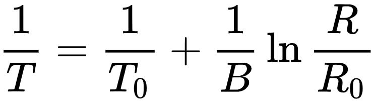

.. note::

    こんにちは、SunFounder Raspberry Pi & Arduino & ESP32 Enthusiasts Community（Facebook）へようこそ！仲間と一緒にRaspberry Pi、Arduino、ESP32についてもっと深く学びましょう。

    **参加する理由**

    - **エキスパートサポート**: コミュニティやチームの助けを借りて、購入後の問題や技術的な課題を解決。
    - **学びと共有**: スキル向上のためのヒントやチュートリアルを交換。
    - **限定プレビュー**: 新製品の発表や予告編をいち早く入手。
    - **特別割引**: 最新製品に対する限定割引を享受。
    - **フェスティブプロモーションとプレゼント**: ギブアウェイや休日プロモーションに参加。

    👉 私たちと一緒に探求し、創造を始める準備はできましたか？[|link_sf_facebook|]をクリックして、今すぐ参加してください！

.. _ar_temperature:

21. 温度アラーム
========================

このレッスンでは、食品の安全性における温度管理の重要性を探ります。すべての食品が冷蔵や冷凍を必要とするわけではありませんが、チップスやパン、特定の果物のような常温保存可能な食品でも、品質と安全性を維持するためには適切な温度で保管する必要があります。温度監視システムを構築することで、食品を安全な温度範囲内に保ち、この範囲を超えた場合にはアラームを鳴らす方法を学びます。この実践的なプロジェクトは、食品を保護するだけでなく、環境モニタリングの基礎を現実世界で応用するための優れた導入となります。

.. .. image:: img/16_temperature.jpg
..     :width: 400
..     :align: center

.. raw:: html

    <video muted controls style = "max-width:90%">
        <source src="_static/video/21_temp_alarm.mp4" type="video/mp4">
        Your browser does not support the video tag.
    </video>

このレッスンを終える頃には、次のことができるようになります:

* 食品安全における温度管理の重要性を理解する。
* 温度変化を監視するためのサーミスタを使用した回路を構築する。
* サーミスタから温度データを読み取るためのArduinoプログラムを作成する。
* 温度データに基づいてLEDを点灯させたりアラームを鳴らしたりするためのプログラムロジックを活用する。
* 電気抵抗と温度変換の概念を実際のシナリオに適用する。

回路の構築
-----------------------

**必要なコンポーネント**

.. list-table:: 
   :widths: 25 25 25 25
   :header-rows: 0

   * - 1 * Arduino Uno R3
     - 1 * RGB LED
     - 3 * 220Ω 抵抗器
     - 1 * 10KΩ 抵抗器
   * - |list_uno_r3| 
     - |list_rgb_led| 
     - |list_220ohm| 
     - |list_10kohm| 
   * - 1 * サーミスタ
     - 1 * ブレッドボード
     - ジャンパーワイヤー
     - 1 * USBケーブル
   * - |list_thermistor| 
     - |list_breadboard| 
     - |list_wire| 
     - |list_usb_cable| 
   * - 1 * マルチメーター
     - 
     - 
     - 
   * - |list_meter| 
     - 
     - 
     - 

**ステップバイステップの構築**

この回路は、レッスン12の回路にサーミスタを追加したものです。

.. image:: img/16_temperature_alarm.png
    :width: 500
    :align: center

1. レッスン12の回路に基づいて、Arduino Uno R3のGNDピンからRGB LEDのGNDピンに接続されているジャンパーワイヤーを取り外し、それをブレッドボードの負端子に挿入します。その後、負端子からRGB LEDのGNDピンにジャンパーワイヤーを接続します。

.. image:: img/16_temperature_alarm_gnd.png
    :width: 500
    :align: center

2. サーミスタを6Eと8Eの穴に挿入します。ピンには方向性がないため、自由に挿入できます。

.. image:: img/16_temperature_alarm_thermistor.png
    :width: 500
    :align: center

サーミスタは、温度によって抵抗が変化する特別な種類の抵抗器です。このデバイスは、温度を検出して測定し、さまざまな電子プロジェクトやデバイスで温度を制御するのに非常に役立ちます。

こちらがサーミスタの電子シンボルです。

サーミスタには、以下の2つの基本的なタイプがあります:

* **NTCサーミスタ** : 温度が上昇すると抵抗が減少します。主に温度センサーや突入電流リミッターとして回路で使用されます。
* **PTCサーミスタ** : 温度が上昇すると抵抗が増加します。通常、過電流保護用のリセット可能なヒューズとして回路で使用されます。

このキットでは、 **NTC** タイプのものを使用します。

次に、このサーミスタの抵抗が温度の上昇に伴って減少するかどうかを確認するために、マルチメーターを使用して抵抗を測定します。

3. サーミスタの定格抵抗が10Kであるため、マルチメーターを20キロオーム（20K）範囲で抵抗を測定するように設定します。

.. image:: img/multimeter_20k.png
    :width: 300
    :align: center

4. 次に、フォトレジスタの2本のピンをマルチメーターの赤と黒のテストリードで触れてください。

.. image:: img/16_temperature_alarm_test.png
    :width: 500
    :align: center

5. 現在の温度下での抵抗値を読み取り、以下の表に記録してください。

.. list-table::
   :widths: 20 20
   :header-rows: 1

   * - 環境
     - 抵抗値 (キロオーム)
   * - 現在の温度
     - *9.37*
   * - 高温
     -
   * - 低温
     -

6. 次に、友人にサーミスタを手で持ってもらうか、周囲の温度を上げるために他の方法（火や水は使用せず、安全を第一に）を使ってください。このときのサーミスタの抵抗値を表に記録します。

.. list-table::
   :widths: 20 20
   :header-rows: 1

   * - 環境
     - 抵抗値 (キロオーム)
   * - 現在の温度
     - *9.37*
   * - 高温
     - *6.10*
   * - 低温
     -

7. サーミスタを屋外に置いたり、ファンで冷やしたりして、周囲の温度を下げます。このときの抵抗値を表に記録してください。

.. list-table::
   :widths: 20 20
   :header-rows: 1

   * - 環境
     - 抵抗値 (キロオーム)
   * - 現在の温度
     - *9.37*
   * - 高温
     - *6.10*
   * - 低温
     - *12.49*

これらの測定により、環境温度が上がるほど抵抗が下がることがわかります。

8. 次に回路の構築を続けます。サーミスタの片端を10KΩの抵抗に接続し、もう一方の端をブレッドボードの負端子に接続します。

.. image:: img/16_temperature_alarm_resistor.png
    :width: 500
    :align: center

9. ブレッドボードのもう一方の端をArduino Uno R3の5Vピンに接続します。

.. image:: img/16_temperature_alarm_5v.png
    :width: 500
    :align: center

10. 最後に、フォトレジスタと10KΩの抵抗の共通ピンをArduino Uno R3のA0ピンに接続します。

.. image:: img/16_temperature_alarm.png
    :width: 500
    :align: center

温度計算の理解
----------------------------------------
**温度計算の公式について**

NTCサーミスタの抵抗は温度によって変化します。この関係は通常、シュタインハート・ハートの方程式で正確に記述されます。次のように表されます:

.. image:: img/16_format_steinhart.png
    :width: 400
    :align: center

ここで、a、b、cはシュタインハート・ハート係数と呼ばれ、それぞれのデバイスに対して指定される必要があります。Tは絶対温度、Rは抵抗です。

シュタインハート・ハート方程式に加え、実際のアプリケーションでは、温度を迅速に計算するために、ベータ係数モデルに基づく簡略化された式もよく使用されます。このモデルでは、抵抗と温度の関係が簡単な指数関数として近似され、計算プロセスが簡略化され、エンジニアリングの温度モニタリングに適しています。

* **T**: サーミスタの温度（ケルビン単位）
* **T0**: 基準温度（通常は25°C、ケルビンで273.15 + 25）
* **B**: 材料のベータ係数。このキットで使用されているNTCサーミスタのベータ係数は3950です。
* **R**: 我々が測定する抵抗値。
* **R0**: 基準温度T0での抵抗値。このキットに含まれているNTCサーミスタの25°Cでの抵抗値は10キロオームです。

これらの式を変換して、ケルビン温度を次のように計算します: ``T=1/(ln(R/R0)/B+1/T0)`` , これにより摂氏温度に変換するためには273.15を引きます。

**抵抗値を測定する方法は？**

回路内では、サーミスタと10KΩの抵抗を直列に接続しています。

.. image:: img/16_thermistor_sch.png
    :width: 200
    :align: center

測定するピンA0の電圧を直列抵抗（10KΩの抵抗）で割ることで、回路内を流れる電流が求められます。この電流は、回路の全抵抗（直列抵抗 + サーミスタ）で供給電圧を割ることで得ることもできます。

* **Vsupply** : 回路に供給される電圧。
* **Rseries** : 直列抵抗の抵抗値。
* **Vmeasured** : 10KΩの抵抗（A0ピンの電圧）にかかる電圧。

これらの式から、サーミスタの抵抗値を導出することができます。

.. image:: img/16_format_2.png
    :width: 400
    :align: center

私たちのコードでは、 ``analogRead()`` 関数を使用して、A0ピンの電圧を読み取ります。電圧 **Vmeasured** と読み取られたアナログ値の関係は次のとおりです。

.. code-block::

    (Analog value at A0) / 1023.0 = Vmeasured / Vsupply

上記の式を使用して、サーミスタの抵抗を計算します。

.. code-block::

    R_thermistor =R_series x (1023.0 / (Analog value at A0) - 1)

.. note::

    もしこれらの式が複雑に感じられる場合は、ここにある最終的な式だけを覚えておけば十分です。

    サーミスタの抵抗は次の式で求められます。

    .. code-block::

        R_thermistor =R_series x (1023.0 / (Analog value at A0) - 1)

    次に、以下の式を使用してケルビン温度を計算します。

    .. code-block::

        T=1/(ln(R/R0)/B+1/T0)

    * **T0**: 273.15 + 25
    * **B**: 3950
    * **R**: 測定した抵抗値
    * **R0**: 10キロオーム

    最後に、次の式を使用して摂氏に変換します。

    .. code-block::

        Tc = T - 273.15

    
コード作成
---------------

**温度の取得**

1. Arduino IDEを開き、「ファイル」メニューから「新規スケッチ」を選択して新しいプロジェクトを開始します。
2. ``Lesson21_Temperature_Alarm`` としてスケッチを保存し、 ``Ctrl + S`` または「保存」をクリックします。

3. 前回のレッスンでは、RGB LEDのピンを直接コード内で参照していましたが、ここではそれらを定数として定義します。

.. code-block:: Arduino
    :emphasize-lines: 2-5

    // ピンの設定
    const int tempSensorPin = A0;  // NTCサーミスタのアナログ入力
    const int redPin = 11;         // 赤色LEDのデジタルピン
    const int greenPin = 10;       // 緑色LEDのデジタルピン
    const int bluePin = 9;         // 青色LEDのデジタルピン

    void setup() {
        // ここに初期設定のコードを記述します
    }

変数の代わりに定数を使用することで、プログラム全体で変更されない値が提供され、メンテナンスが簡素化されます。これにより、数値の代わりに意味のある名前が使用され、コード内のどこでも変更が必要な場合に宣言部分だけを調整すれば済みます。定数は変数と同じ命名規則に従い、Arduino IDEの予約語やコマンドを避ける必要があります。

4. サーミスタを使用する前に、回路に関連するパラメータを格納するためのいくつかの定数も定義する必要があります。

.. note::

    ``int`` 型の定数と ``float`` 型の定数が存在することに気づくでしょう。それでは、これら二つの定数の違いは何でしょうか？

  * ``const int`` : ``int`` （整数）は整数を保持する定数です。この型は小数や小数点をサポートしません。システムによっては、通常16ビットまたは32ビットのメモリを占有します。
  * ``const float`` : ``float`` （浮動小数点）は小数部分を持つことができる定数です。測定値や計算で小数が必要な場合に使用されます。 ``float`` は通常32ビットのメモリを占有し、 ``int`` よりも広い範囲の数値を表すことができます。

.. code-block:: Arduino
    :emphasize-lines: 2-5

    // Pin configurations
    const int tempSensorPin = A0;  // NTC thermistor analog input
    const int redPin = 10;         // Red LED digital pin
    const int greenPin = 11;       // Green LED digital pin
    const int bluePin = 12;        // Blue LED digital pin

    // Constants for temperature calculation
    const float beta = 3950.0;               // NTC thermistor's Beta value
    const float seriesResistor = 10000;      // Series resistor value (ohms)
    const float roomTempResistance = 10000;  // NTC resistance at 25°C
    const float roomTemp = 25 + 273.15;      // Room temperature in Kelvin

5. ``void setup()`` では、RGB LEDピンを出力として設定し、シリアル通信ボーレートを9600に設定します。

.. code-block:: Arduino
    :emphasize-lines: 2-5

    void setup() {
        // Initialize LED pins as outputs
        pinMode(redPin, OUTPUT);
        pinMode(greenPin, OUTPUT);
        pinMode(bluePin, OUTPUT);
        
        // Start serial communication at 9600 baud
        Serial.begin(9600);
    }

6. まず、 ``void loop()`` でA0ピンのアナログ値を読み取ります。

.. code-block:: Arduino
    :emphasize-lines: 2

    void loop() {
        int adcValue = analogRead(tempSensorPin);                     // Read thermistor value
    }

7. 次に、アナログ値を電圧に変換するために以前導出した式を使用して、サーミスタの抵抗を計算します。

.. code-block:: Arduino
    :emphasize-lines: 3

    void loop() {
        int adcValue = analogRead(tempSensorPin);                     // Read thermistor value
        float resistance = (1023.0 / adcValue - 1) * seriesResistor;  // Calculate thermistor resistance
    }

8. 次に、以下の式を使用してケルビン温度を計算します。

.. code-block:: Arduino
    :emphasize-lines: 6

    void loop() {
        int adcValue = analogRead(tempSensorPin);                     // Read thermistor value
        float resistance = (1023.0 / adcValue - 1) * seriesResistor;  // Calculate thermistor resistance

        // Calculate temperature in Kelvin using Beta parameter equation
        float tempK = 1 / (log(resistance / roomTempResistance) / beta + 1 / roomTemp);
    }

9. ケルビン温度から273.15を引いて摂氏に変換し、 ``Serial.println()`` 関数を使用して結果をシリアルモニターに出力します。

.. code-block:: Arduino
    :emphasize-lines: 8,9

    void loop() {
        int adcValue = analogRead(tempSensorPin);                     // Read thermistor value
        float resistance = (1023.0 / adcValue - 1) * seriesResistor;  // Calculate thermistor resistance

        // Calculate temperature in Kelvin using Beta parameter equation
        float tempK = 1 / (log(resistance / roomTempResistance) / beta + 1 / roomTemp);
    
        float tempC = tempK - 273.15;  // Convert to Celsius
        Serial.println(tempC);           // Display temperature in Celsius on Serial Monitor
    }

10. この時点で、コードをArduino Uno R3にアップロードし、現在の摂氏温度を取得できます。

.. code-block::

    26.28
    26.19
    26.19
    26.28
    26.28

**RGB LEDの色を変更する**

それでは、サーミスタで測定した温度に基づいて、RGB LEDの色を変更してみましょう。

例えば、次のように3つの温度範囲を設定します：

* 10度以下では、RGB LEDが緑色に光り、快適な温度であることを示します。
* 10度から20度の間では、RGB LEDが黄色に光り、温度に注意が必要であることを示します。
* 21度以上では、RGB LEDが赤色に光り、温度が高すぎることを示し、対策が必要です。

11. RGB LEDを制御するために、以前のレッスンで作成した ``setColor()`` 関数を使用します。

.. code-block:: Arduino

    // Function to set the color of the RGB LED
    void setColor(int red, int green, int blue) {
        // Write PWM values for red, green, and blue to the RGB LED
        analogWrite(11, red);
        analogWrite(10, green);
        analogWrite(9, blue);
    }

12. それでは、 ``if else if`` 文を使って、異なる温度に応じてRGB LEDの色を制御します。

.. code-block:: Arduino
    :emphasize-lines: 12-18

    void loop() {
        int adcValue = analogRead(tempSensorPin);                     // Read thermistor value
        float resistance = (1023.0 / adcValue - 1) * seriesResistor;  // Calculate thermistor resistance

        // Calculate temperature in Kelvin using Beta parameter equation
        float tempK = 1 / (log(resistance / roomTempResistance) / beta + 1 / roomTemp);
    
        float tempC = tempK - 273.15;  // Convert to Celsius
        Serial.println(tempC);           // Display temperature in Celsius on Serial Monitor

        // Adjust LED color based on temperature
        if (tempC < 10) {
            setColor(0, 0, 255);  // Cold: blue
        } else if (tempC >= 10 && tempC <= 21) {
            setColor(0, 255, 0);  // Comfortable: green
        } else if (tempC > 21) {
            setColor(255, 0, 0);  // Hot: red
        }
        delay(1000);  // Delay 1 second before next reading
    }

13. 完成したコードがこちらです。コードをArduino Uno R3にアップロードして、結果を確認してください。

.. code-block:: Arduino

    // Pin configurations
    const int tempSensorPin = A0;  // NTC thermistor analog input
    const int redPin = 10;         // Red LED digital pin
    const int greenPin = 11;       // Green LED digital pin
    const int bluePin = 12;        // Blue LED digital pin

    // Constants for temperature calculation
    const float beta = 3950.0;               // NTC thermistor's Beta value
    const float seriesResistor = 10000;      // Series resistor value (ohms)
    const float roomTempResistance = 10000;  // NTC resistance at 25°C
    const float roomTemp = 25 + 273.15;      // Room temperature in Kelvin

    void setup() {
        // Initialize LED pins as outputs
        pinMode(redPin, OUTPUT);
        pinMode(greenPin, OUTPUT);
        pinMode(bluePin, OUTPUT);

        // Start serial communication at 9600 baud
        Serial.begin(9600);
    }

    void loop() {
        int adcValue = analogRead(tempSensorPin);                     // Read thermistor value
        float resistance = (1023.0 / adcValue - 1) * seriesResistor;  // Calculate thermistor resistance

        // Calculate temperature in Kelvin using Beta parameter equation
        float tempK = 1 / (log(resistance / roomTempResistance) / beta + 1 / roomTemp);

        float tempC = tempK - 273.15;  // Convert to Celsius
        Serial.println(tempC);           //Display temperature in Celsius on Serial Monitor

        // Adjust LED color based on temperature
        if (tempC < 10) {
            setColor(0, 0, 255);  // Cold: blue
        } else if (tempC >= 10 && tempC <= 21) {
            setColor(0, 255, 0);  // Comfortable: green
        } else if (tempC > 21) {
            setColor(255, 0, 0);  // Hot: red
        }
        delay(1000);  // Delay 1 second before next reading
    }

    // Function to set the color of the RGB LED
    void setColor(int red, int green, int blue) {
        // Write PWM value for red, green, and blue to the RGB LED
        analogWrite(11, red);
        analogWrite(10, green);
        analogWrite(9, blue);
    }

14. 最後に、コードを保存し、作業スペースを整理することを忘れないでください。

**質問**

1. このコードでは、ケルビン温度と摂氏温度が計算されています。華氏温度も知りたい場合は、どうすればよいでしょうか？

2. 今日作成したような温度監視システムが役立つ他の状況や場所を考えられますか？

**まとめ**

本日のレッスンでは、棚保存食品の保管エリアの温度を監視する温度アラームシステムを構築しました。サーミスタからの抵抗値を読み取り、それを摂氏温度に変換する方法を学びました。また、プログラミングを通じて、温度に応じてRGB LEDの色を変更する条件を設定し、低すぎる、適切、または高すぎる温度に対して視覚的なアラートを提供しました。

