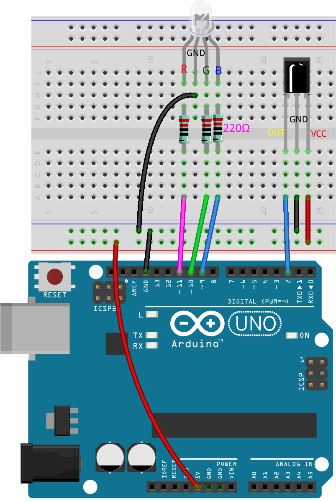
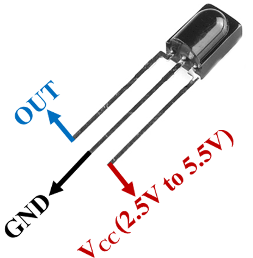
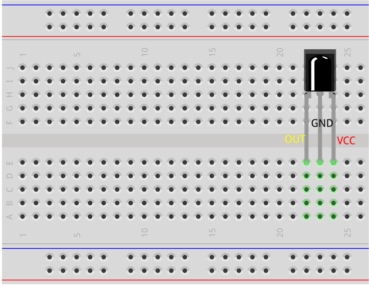
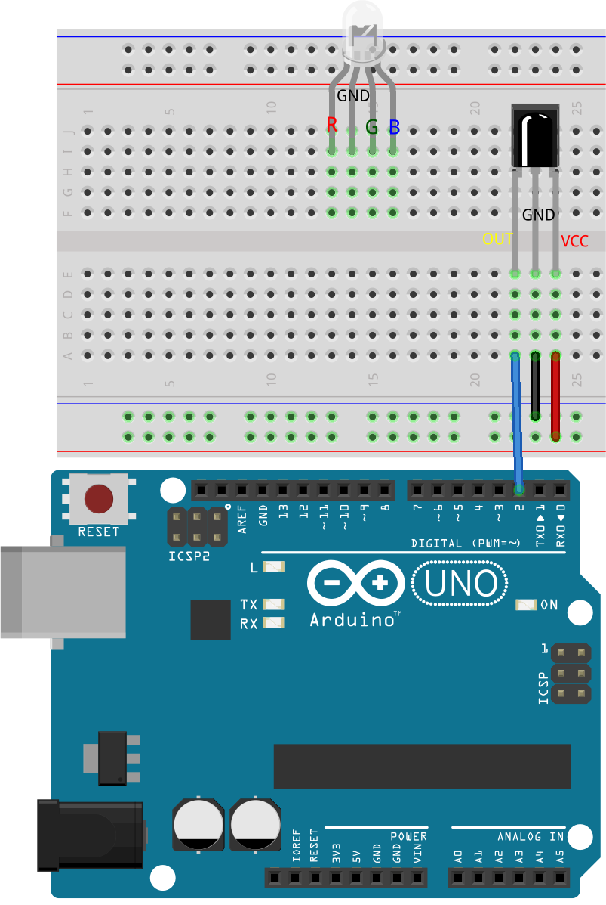
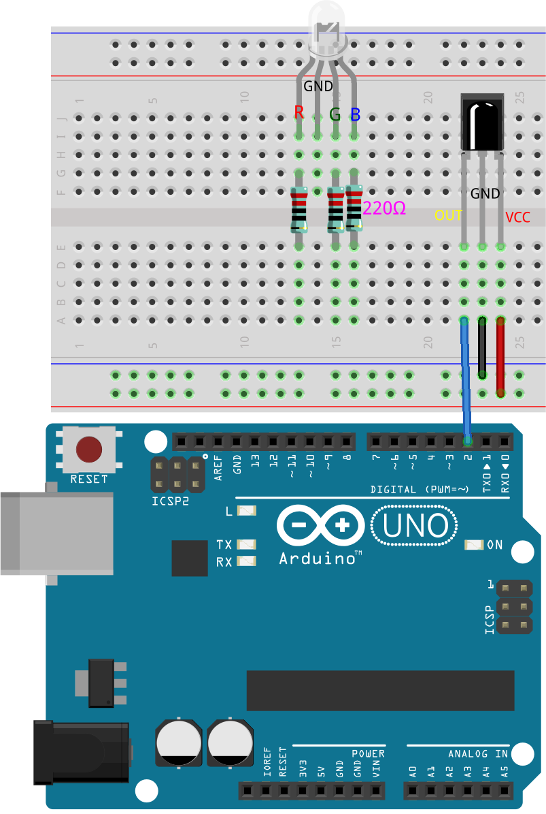
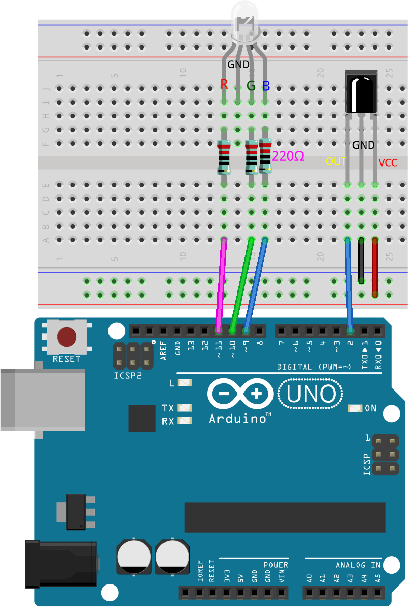
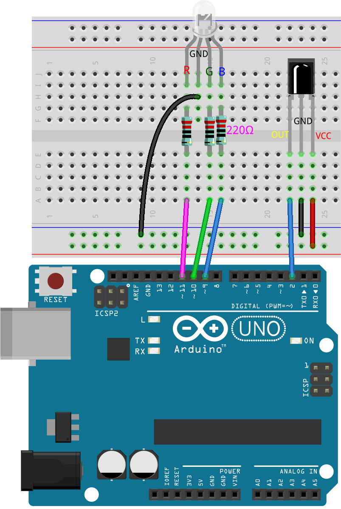
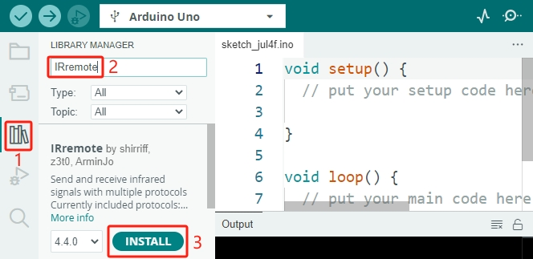

.. note::

    こんにちは、SunFounderのRaspberry Pi & Arduino & ESP32愛好者コミュニティへようこそ！Facebookでラズベリーパイ、Arduino、ESP32に関心を持つ仲間たちと一緒に、さらに深く掘り下げましょう。

    **参加する理由は？**

    - **専門家のサポート**: コミュニティやチームの助けを借りて、購入後の問題や技術的な課題を解決できます。
    - **学びと共有**: スキルを向上させるためのヒントやチュートリアルを交換しましょう。
    - **限定プレビュー**: 新製品の発表や先行プレビューにいち早くアクセスできます。
    - **特別割引**: 最新の製品を対象にした特別割引をお楽しみください。
    - **フェスティバルプロモーションとプレゼント**: プレゼントやホリデープロモーションに参加できます。

    👉 一緒に探求し、創造を楽しむ準備はできましたか？こちらをクリックして[|link_sf_facebook|]、今すぐ参加しましょう！

.. _ar_ir_receiver:

22. リモコン操作のカラフルライト
===================================================

クリスマスが近づくと、多くの人々が家をカラフルなライトで飾ります。自分でリモコン操作のカラフルライトを作ることを想像してみてください！このレッスンでは、Arduino、赤外線受信機、RGB LEDを使って、フェスティバルにぴったりのプログラム可能なライトディスプレイを作成します。

.. raw:: html

    <video muted controls style = "max-width:90%">
        <source src="_static/video/22_ir_rgb_led.mp4" type="video/mp4">
        Your browser does not support the video tag.
    </video>

このレッスンの終わりには、以下ができるようになります：

* 赤外線受信機の仕組みを理解する。
* リモコンからの赤外線信号をデコードする。
* デコードされた信号を使ってRGB LEDを操作し、さまざまな色や効果を表示する。

回路の構築
-----------------------

**必要なコンポーネント**

.. list-table:: 
   :widths: 25 25 25 25
   :header-rows: 0

   * - 1 * Arduino Uno R3
     - 1 * RGB LED
     - 3 * 220Ω 抵抗
     - 1 * IR 受信機
   * - |list_uno_r3| 
     - |list_rgb_led| 
     - |list_220ohm| 
     - |list_receiver| 
   * - 1 * リモコン
     - 1 * ブレッドボード
     - ジャンパーワイヤー
     - 1 * USB ケーブル
   * - |list_remote| 
     - |list_breadboard| 
     - |list_wire| 
     - |list_usb_cable| 

**ステップバイステップの構築**

配線図に従うか、以下の手順に従って回路を構築してください。

1. 赤外線受信機を見つけてください。

* **OUT**: 信号出力
* **GND**: グランド
* **VCC**: 電源供給、2.5V~5V

SL838赤外線受信機は、赤外線信号を受信し、TTLレベルと互換性のある信号を出力することができるコンポーネントです。通常のプラスチックパッケージトランジスタに似たサイズで、あらゆる種類の赤外線リモコンや赤外線通信に適しています。

赤外線（IR）通信は、一般的で低コスト、かつ使いやすいワイヤレス通信技術です。赤外線は可視光よりもわずかに長い波長を持ち、人間の目には見えないため、ワイヤレス通信に最適です。赤外線通信で一般的な変調方式は38KHz変調です。

2. 赤外線受信機は21キーのリモコンとペアになっています。

.. image:: img/22_receiver_remote_control.jpeg
  :width: 400
  :align: center

このスリムなリモコンは、さまざまな機能を持つ21個のキーを備えており、最大8メートルの有効送信距離を誇ります。コンパクトなサイズ（85x39x6mm）で、小さな手にもぴったりです。3Vのリチウムマンガンバッテリーにより、長持ちするパフォーマンスを提供します。赤外線キャリア周波数は38KHzで、耐久性のある0.125mm PET表面で包まれており、20,000回以上の使用にも耐える信頼性の高いリモコンです。

3. 赤外線受信機をブレッドボードに挿入します。赤外線受信機には前面と背面があり、突起のある側が前面です。ピンの順序は左からOUT、GND、VCCです。

4. 赤外線受信機のOUTピンをArduino Uno R3のピン2に、GNDをブレッドボードの負電源レールに、VCCをブレッドボードの正電源レールに接続します。

.. image:: img/22_receiver_receiver_pins.png
    :width: 400
    :align: center

5. RGB LEDをブレッドボードに挿入し、最も長いピンを左から2番目のピンに配置します。

6. R、G、Bピンと同じ列に220オームの抵抗を挿入します。

7. これらの抵抗をジャンパーワイヤーを使用して、Arduino Uno R3のピン9、10、11に接続します。

8. RGB LEDの最も長いピンをジャンパーワイヤーを使用してブレッドボードの負電源レールに接続します。

9. 最後に、Arduino Uno R3のGNDピンと5Vピンを、それぞれブレッドボードの負電源レールと正電源レールに接続します。

コード作成 - キー値の取得
---------------------------------------------

ここでは、赤外線受信機の動作原理と、赤外線リモコンから異なるキー値をどのように認識するかを学びます。

1. Arduino IDEを開き、「ファイル」メニューから「新しいスケッチ」を選択して新しいプロジェクトを開始します。
2. スケッチを ``Lesson22_Get_Key_Value`` として保存します。 ``Ctrl + S`` を押すか、「保存」をクリックします。

3. I2C LCD1602と同様に、Arduino IDEには赤外線受信機用のライブラリがデフォルトでは含まれていません。ライブラリマネージャから手動でダウンロードする必要があります。今、 **ライブラリマネージャ** で ``IRremote`` を検索し、 **インストール** をクリックします。

4. さて、コードを書き始めましょう。各ライブラリを使用する前に、スケッチにインクルードすることが重要です。その後、赤外線受信機のピンを定義します。

.. code-block:: Arduino
  :emphasize-lines: 1,3

  #include <IRremote.h>

  const int receiverPin = 2;  // Define the pin number for the IR Sensor

  void setup() {
    // put your setup code here, to run once:

  }

5. ``void setup()`` 関数内で、9600bpsでシリアル通信を初期化し、指定されたピンでIR受信機をLEDフィードバックを有効にして初期化します。

* 指定されたピンは通常、Arduinoボードのピン13に内蔵されたLEDを指します。赤外線受信機に向かってリモコンのキーを押すたびに、Arduinoボードのピン13のLEDが一瞬速く点滅し、IR信号が受信されたことを示します。

.. code-block:: Arduino
  :emphasize-lines: 3,5

  void setup() {
    // Start serial communication at a baud rate of 9600
    Serial.begin(9600);
    // Initialize the IR receiver on the specified pin with LED feedback enabled
    IrReceiver.begin(receiverPin, ENABLE_LED_FEEDBACK);
  }

6. ``loop()`` 関数内で、まず ``IrReceiver.decode()`` 関数を使用して、赤外線受信機が信号を受信したかどうかを確認します。信号が受信されると、trueが返されます。

.. code-block:: Arduino
  :emphasize-lines: 2

  void loop() {
    if (IrReceiver.decode()) {                                // Check if the IR receiver has received a signal

    }
  }

7. 次に、受信したキー値をシリアルモニタに出力します。 ``Serial.println()`` 関数は、デフォルトで数値を10進形式で出力します。16進数のキー値を取得するには、フォーマットを ``HEX`` に設定します。

.. code-block:: Arduino
  :emphasize-lines: 3-5

  void loop() {
    if (IrReceiver.decode()) {                                // Check if the IR receiver has received a signal
      Serial.print("0x");                                     // print the "0x"
      Serial.println(IrReceiver.decodedIRData.command, HEX);  // Print the command from the decoded IR data
      delay(100);
      IrReceiver.resume();                                    // Prepare the IR receiver to receive the next signal
    }
  }

8. これが完成したコードです。Arduino Uno R3にアップロードできます。

.. code-block:: Arduino

  #include <IRremote.h>  // Include the IRremote library

  const int receiverPin = 2;  // Define the pin number for the IR Sensor

  void setup() {
    // Start serial communication at a baud rate of 9600
    Serial.begin(9600);                                  
    // Initialize the IR receiver on the specified pin with LED feedback enabled
    IrReceiver.begin(receiverPin, ENABLE_LED_FEEDBACK);  
  }

  void loop() {
    if (IrReceiver.decode()) {                                // Check if the IR receiver has received a signal
      Serial.print("0x");                                     // print the "0x"
      Serial.println(IrReceiver.decodedIRData.command, HEX);  // Print the command from the decoded IR data
      delay(100);
      IrReceiver.resume();                                    // Prepare the IR receiver to receive the next signal
    }
  }

9. コードをアップロードした後、異なるキーを押してみてください。シリアルモニタに16進数のキー値が表示されるのがわかるでしょう。

.. note::

  * キーを押す前に、リモコンの裏側にあるプラスチックのタブを外して電源を入れる必要があります。
  * ほとんどのキー値が2回または3回表示されることに気づくかもしれません。これは、キーがバウンスするためです。キーを一度押しただけでも、Arduinoは複数回の押下を検出することがあります。

.. code-block::

  0x45
  0x45
  0x43
  0x43
  0x7
  0x7

**質問**

1. リモコンの各キーを慎重に押し、マニュアルの表に対応するキー値を記録してください。

.. image:: img/22_receiver_remote_control.jpeg
  :width: 400
  :align: center

.. list-table::
   :widths: 20 20 20 20
   :header-rows: 1

   * - キー名
     - キー値
     - キー名
     - キー値
   * - POWER
     - *0x45*
     - 0
     - *0x16*
   * - MODE
     - 
     - 1
     - 
   * - MUTE
     - 
     - 2
     - 
   * - PLAY/PAUSE
     -
     - 3
     -  
   * - BACKWARD
     - 
     - 4
     - 
   * - FORWARD
     - 
     - 5
     -
   * - EQ
     - 
     - 6
     - 
   * - \-
     - 
     - 7
     - 
   * - \+
     - 
     - 8
     - 
   * - CYCLE
     - 
     - 9
     -
   * - U/SD
     -
     -
     - 

コード作成 - デコード
------------------------------

各キーのキー値がわかったので、すべてのキー値を覚えるのはかなり難しいかもしれません。そこで、 ``switch-case`` 文を使用してこれらのコードを関数にまとめ、各キー押下の認識と応答を簡素化するデコード関数を書きましょう。

1. 先ほど保存したスケッチ ``Lesson22_Get_Key_Value`` を開きます。「ファイル」メニューから「名前を付けて保存」をクリックし、 ``Lesson22_Decode_Key_Value`` に名前を変更して保存します。

2. 次に、 ``void loop()`` の後に、IRリモコンから受信したコマンドコードを受け取る ``long`` 整数 ``result`` を引数に取るデコード関数 ``decodeKeyValue()`` を作成します。

.. code-block:: Arduino
  :emphasize-lines: 6,8

  void loop() {
    ...
  }

  // Function to map received IR signals to corresponding keys
  String decodeKeyValue(long result) {

  }

3. 次に、 ``switch`` 文を使用して、この ``result`` を事前定義された16進コード（0x45、0x47など）と照合します。 ``switch`` の各ケースはリモコンの異なるキーに対応しており、そのキーの機能を表す文字列を返します。いずれのケースにも一致しない場合は、未認識のコマンドを示す ``ERROR`` が返されます。

.. code-block:: Arduino

  // 受信したIR信号を対応するキーにマッピングする関数
  String decodeKeyValue(long result) {
    switch (result) {
      case 0x45: return "POWER";
      case 0x47: return "MUTE";
      case 0x46: return "MODE";
      case 0x44: return "PLAY/PAUSE";
      case 0x40: return "BACKWARD";
      case 0x43: return "FORWARD";
      case 0x7: return "EQ";
      case 0x15: return "-";
      case 0x9: return "+";
      case 0x19: return "CYCLE";
      case 0xD: return "U/SD";
      case 0x16: return "0";
      case 0xC: return "1";
      case 0x18: return "2";
      case 0x5E: return "3";
      case 0x8: return "4";
      case 0x1C: return "5";
      case 0x5A: return "6";
      case 0x42: return "7";
      case 0x52: return "8";
      case 0x4A: return "9";
      case 0x0: return "ERROR";
      default: return "ERROR";
    }
  }

4. 次に、 ``loop()`` 関数に戻り、デコードされた文字列（キー名）を保存するための ``String`` 変数 ``key`` を作成し、それをシリアルモニタに表示します。

.. code-block:: Arduino
  :emphasize-lines: 4

  void loop() {
    if (IrReceiver.decode()) {  // Check if the IR receiver has received a signal
      // Convert the decoded IR signal to a readable command.
      String key = decodeKeyValue(IrReceiver.decodedIRData.command);
      Serial.println(key);  // Print the readable command
      delay(100);
      IrReceiver.resume();           // Prepare the IR receiver to receive the next signal
    }
  }

5. 時々、「エラー」メッセージが受信されることがあります。 ``if`` 文を使用し、 ``key`` が ``ERROR`` と等しくない場合のみ、表示するようにします。

.. code-block:: Arduino
  :emphasize-lines: 4

  void loop() {
    if (IrReceiver.decode()) {  // Check if the IR receiver has received a signal
      bool result = 0;
      String key = decodeKeyValue(IrReceiver.decodedIRData.command);
      if (key != "ERROR") {
        Serial.println(key);  // Print the readable command
        delay(100);
      }
    IrReceiver.resume();  // Prepare the IR receiver to receive the next signal
    }
  }

6. これが完成したコードです。Arduino Uno R3にアップロードしてください。

.. code-block:: Arduino

  #include <IRremote.h>  // Include the IRremote library

  const int receiverPin = 2;  // Define the pin number for the IR Sensor

  void setup() {
    // Start serial communication at a baud rate of 9600
    Serial.begin(9600);
    // Initialize the IR receiver on the specified pin with LED feedback enabled
    IrReceiver.begin(receiverPin, ENABLE_LED_FEEDBACK);
  }

  void loop() {
    if (IrReceiver.decode()) {  // Check if the IR receiver has received a signal
      bool result = 0;
      String key = decodeKeyValue(IrReceiver.decodedIRData.command);
      if (key != "ERROR") {
        Serial.println(key);  // Print the readable command
        delay(100);
      }
    IrReceiver.resume();  // Prepare the IR receiver to receive the next signal
    }
  }

  // Function to map received IR signals to corresponding keys
  String decodeKeyValue(long result) {
    switch (result) {
      case 0x45: return "POWER";
      case 0x47: return "MUTE";
      case 0x46: return "MODE";
      case 0x44: return "PLAY/PAUSE";
      case 0x40: return "BACKWARD";
      case 0x43: return "FORWARD";
      case 0x7: return "EQ";
      case 0x15: return "-";
      case 0x9: return "+";
      case 0x19: return "CYCLE";
      case 0xD: return "U/SD";
      case 0x16: return "0";
      case 0xC: return "1";
      case 0x18: return "2";
      case 0x5E: return "3";
      case 0x8: return "4";
      case 0x1C: return "5";
      case 0x5A: return "6";
      case 0x42: return "7";
      case 0x52: return "8";
      case 0x4A: return "9";
      case 0x0: return "ERROR";
      default: return "ERROR";
    }
  }

7. シリアルモニタを開いた後、リモコンのキーを押すと、キー名が表示されます。21個すべてのキーを押して、名前が実際のキーと一致するか確認することをお勧めします。

.. code-block:: Arduino

  POWER
  POWER
  MODE
  MODE
  MUTE
  MUTE
  FORWARD
  BACKWARD
  BACKWARD

コード作成 - リモコン操作のカラフルライト
------------------------------------------------------------
赤外線受信機とそのコードの準備が整ったので、それを使ってRGB LEDを操作し、さまざまな色を表示できるようにします。ここでは、実現する予定の色と効果を示します。他の色や効果をカスタマイズすることも可能です。

* 「1」を押すと、RGB LEDに赤が表示されます。
* 「2」を押すと、RGB LEDに緑が表示されます。
* 「3」を押すと、RGB LEDに青が表示されます。
* 「4」を押すと、RGB LEDにオレンジの点滅効果が表示されます。
* その他のキーを押すと、RGB LEDがオフになります。

1. 先ほど保存したスケッチ ``Lesson22_Decode_Key_Value`` を開き、「ファイル」メニューから「名前を付けて保存」を選択して、これを ``Lesson22_Remote_Colorful_Light`` にリネームし、「保存」をクリックします。

2. RGB LEDの3つのピンを格納する変数を作成し、それらを出力（OUTPUT）として設定します。

.. code-block:: Arduino
  :emphasize-lines: 6-8,12-14

  #include <IRremote.h>  // Include the IRremote library

  const int receiverPin = 2;  // Define the pin number for the IR Sensor

  // Define the pins of RBG LED
  const int redPin = 11;
  const int greenPin = 10;
  const int bluePin = 9;

  void setup() {
    // Initialize RGB LED pins
    pinMode(redPin, OUTPUT);
    pinMode(greenPin, OUTPUT);
    pinMode(bluePin, OUTPUT);

    // Start serial communication at a baud rate of 9600
    Serial.begin(9600);
    // Initialize the IR receiver on the specified pin with LED feedback enabled
    IrReceiver.begin(receiverPin, ENABLE_LED_FEEDBACK);
  }

3. ``loop()`` 関数の後に、RGB LEDの色を表示するための ``setColor()`` 関数を作成します。

.. code-block:: Arduino

  // RGB LEDの色を設定する関数
  void setColor(int red, int green, int blue) {
    analogWrite(redPin, red);
    analogWrite(greenPin, green);
    analogWrite(bluePin, blue);
  }

4. ``loop()`` 関数に戻り、 ``if else if`` 文を使用して、どのキーが押されたかを判断し、計画に従ってRGB LEDに対応する効果を表示します。

* 「1」を押すと、RGB LEDに赤が表示されます。
* 「2」を押すと、RGB LEDに緑が表示されます。
* 「3」を押すと、RGB LEDに青が表示されます。
* 「4」を押すと、RGB LEDにオレンジの点滅効果が表示されます。
* その他のキーを押すと、RGB LEDがオフになります。

.. code-block:: Arduino
  :emphasize-lines: 8-22

  void loop() {
    if (IrReceiver.decode()) {  // Check if the IR receiver has received a signal
      bool result = 0;
      String key = decodeKeyValue(IrReceiver.decodedIRData.command);
      if (key != "ERROR") {
        Serial.println(key);  // Print the readable command
        delay(100);
      }

      if (key == "1") {
        setColor(255, 0, 0);  // Red
      } else if (key == "2") {
        setColor(0, 255, 0);  // Green
      } else if (key == "3") {
        setColor(0, 0, 255);  // Blue
      } else if (key == "4") {
        setColor(255, 165, 0);  // Orange
        delay(100);
        setColor(0, 0, 0);  // Turn off RGB LED
        delay(100);
      } else {
        setColor(0, 0, 0);  // Turn off RGB LED for any other key
      }
    IrReceiver.resume();  // Prepare the IR receiver to receive the next signal
    }
  }

5. Here is your complete code. You can upload it to the Arduino Uno R3. Afterward, press the keys on the remote control to see if the desired effects are achieved.

.. code-block:: Arduino

  #include <IRremote.h>  // Include the IRremote library

  const int receiverPin = 2;  // Define the pin number for the IR Sensor

  // Define the pins of RBG LED
  const int redPin = 11;
  const int greenPin = 10;
  const int bluePin = 9;

  void setup() {
    // Initialize RGB LED pins
    pinMode(redPin, OUTPUT);
    pinMode(greenPin, OUTPUT);
    pinMode(bluePin, OUTPUT);

    // Start serial communication at a baud rate of 9600
    Serial.begin(9600);
    // Initialize the IR receiver on the specified pin with LED feedback enabled
    IrReceiver.begin(receiverPin, ENABLE_LED_FEEDBACK);
  }

  void loop() {
    if (IrReceiver.decode()) {  // Check if the IR receiver has received a signal
      bool result = 0;
      String key = decodeKeyValue(IrReceiver.decodedIRData.command);
      if (key != "ERROR") {
        Serial.println(key);  // Print the readable command
        delay(100);
      }

      if (key == "1") {
        setColor(255, 0, 0);  // Red
      } else if (key == "2") {
        setColor(0, 255, 0);  // Green
      } else if (key == "3") {
        setColor(0, 0, 255);  // Blue
      } else if (key == "4") {
        setColor(255, 165, 0);  // Orange
        delay(100);
        setColor(0, 0, 0);  // Turn off RGB LED
        delay(100);
      } else {
        setColor(0, 0, 0);  // Turn off RGB LED for any other key
      }
    IrReceiver.resume();  // Prepare the IR receiver to receive the next signal
    }
  }

  // Function to set the color of the RGB LED
  void setColor(int red, int green, int blue) {
    analogWrite(redPin, red);
    analogWrite(greenPin, green);
    analogWrite(bluePin, blue);
  }

  // Function to map received IR signals to corresponding keys
  String decodeKeyValue(long result) {
    switch (result) {
      case 0x45: return "POWER";
      case 0x47: return "MUTE";
      case 0x46: return "MODE";
      case 0x44: return "PLAY/PAUSE";
      case 0x40: return "BACKWARD";
      case 0x43: return "FORWARD";
      case 0x7: return "EQ";
      case 0x15: return "-";
      case 0x9: return "+";
      case 0x19: return "CYCLE";
      case 0xD: return "U/SD";
      case 0x16: return "0";
      case 0xC: return "1";
      case 0x18: return "2";
      case 0x5E: return "3";
      case 0x8: return "4";
      case 0x1C: return "5";
      case 0x5A: return "6";
      case 0x42: return "7";
      case 0x52: return "8";
      case 0x4A: return "9";
      case 0x0: return "ERROR";
      default: return "ERROR";
    }
  }

6. 最後に、コードを保存して作業スペースを整理することを忘れないでください。

**まとめ**

このレッスンでは、赤外線受信機を使用してリモコンからの信号をデコードし、RGB LEDを制御してさまざまな色や効果を表示する方法を学びました。 ``IRremote`` ライブラリを統合し、リモコン信号を解釈する関数を作成することで、楽しくインタラクティブなリモコン操作のライトディスプレイを作成しました。このプロジェクトは、赤外線通信の理解を深めるだけでなく、カスタムライトセットアップでホリデーシーズンを盛り上げる方法も示しています。さまざまな色やパターンを試して、さらに華やかなライトにしてみてください！

