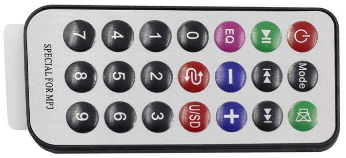
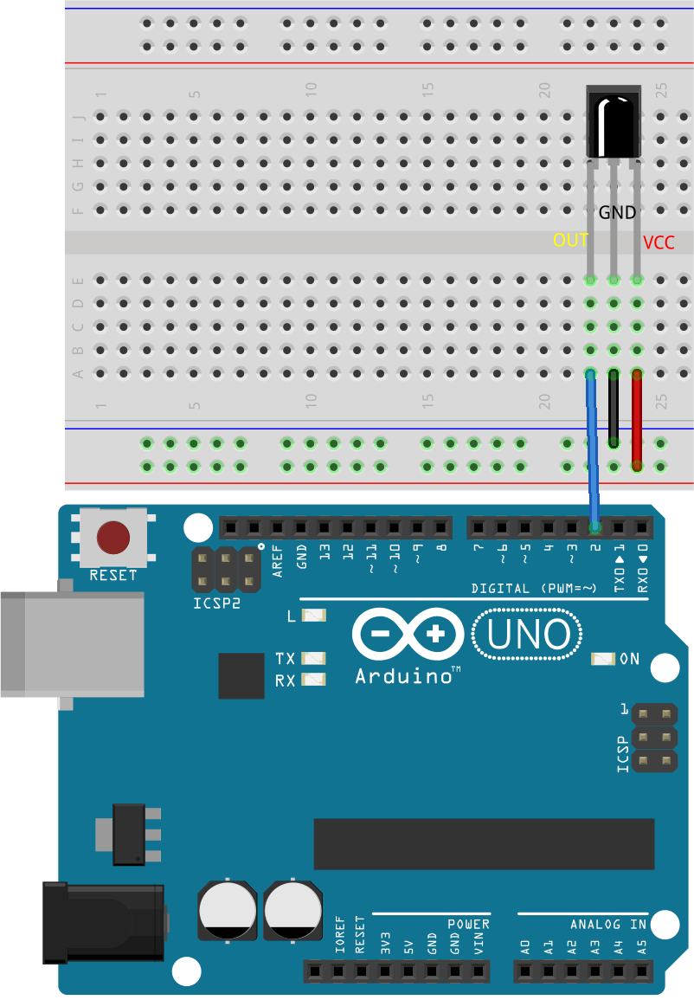

.. note::

    Hallo, willkommen in der SunFounder Raspberry Pi & Arduino & ESP32 Enthusiasten-Community auf Facebook! Tauche tiefer in die Welt von Raspberry Pi, Arduino und ESP32 mit Gleichgesinnten ein.

    **Warum mitmachen?**

    - **Expertenunterstützung**: Löse nach dem Kauf auftretende Probleme und technische Herausforderungen mit Hilfe unserer Community und unseres Teams.
    - **Lernen & Teilen**: Tausche Tipps und Tutorials aus, um deine Fähigkeiten zu verbessern.
    - **Exklusive Vorschauen**: Erhalte frühzeitigen Zugang zu neuen Produktankündigungen und Sneak Peeks.
    - **Spezielle Rabatte**: Genieße exklusive Rabatte auf unsere neuesten Produkte.
    - **Festliche Aktionen und Gewinnspiele**: Nimm an Gewinnspielen und festlichen Aktionen teil.

    👉 Bereit, mit uns zu entdecken und zu gestalten? Klicke auf [|link_sf_facebook|] und tritt noch heute bei!

.. _ar_ir_receiver:

22. Fernsteuerbares buntes Licht
===================================================

Da Weihnachten näher rückt, schmücken viele Menschen ihre Häuser mit bunten Lichtern. Stell dir vor, du könntest dein eigenes fernsteuerbares buntes Licht-Setup erstellen! In dieser Lektion verwenden wir ein Arduino, einen Infrarotempfänger und eine RGB-LED, um ein festliches, programmierbares Lichtdisplay zu erstellen.

.. raw:: html

    <video muted controls style = "max-width:90%">
        <source src="_static/video/22_ir_rgb_led.mp4" type="video/mp4">
        Your browser does not support the video tag.
    </video>

Am Ende dieser Lektion wirst du in der Lage sein:

* Verstehen, wie ein Infrarotempfänger funktioniert.
* Infrarotsignale von einer Fernbedienung dekodieren.
* Eine RGB-LED mit dekodierten Signalen steuern, um verschiedene Farben und Effekte anzuzeigen.

Schaltung aufbauen
------------------------

**Benötigte Komponenten**

.. list-table:: 
   :widths: 25 25 25 25
   :header-rows: 0

   * - 1 * Arduino Uno R3
     - 1 * RGB-LED
     - 3 * 220Ω Widerstand
     - 1 * IR-Empfänger
   * - |list_uno_r3| 
     - |list_rgb_led| 
     - |list_220ohm| 
     - |list_receiver| 
   * - 1 * Fernbedienung
     - 1 * Steckbrett
     - Jumper-Kabel
     - 1 * USB-Kabel
   * - |list_remote| 
     - |list_breadboard| 
     - |list_wire| 
     - |list_usb_cable| 

**Schritt-für-Schritt Aufbau**

Folge dem Schaltplan oder den folgenden Schritten, um deine Schaltung aufzubauen.

.. image:: img/22_receiver_gnd_5v.png
    :width: 400
    :align: center

1. Finde den Infrarotempfänger.

.. image:: img/22_receiver_pin.png
  :width: 300
  :align: center

* **OUT**: Signalausgang
* **GND**: Masse
* **VCC**: Stromversorgung, 2,5V~5V

Der SL838-Infrarotempfänger ist eine Komponente, die Infrarotsignale empfängt und eigenständig Infrarotstrahlen sowie TTL-kompatible Signale ausgibt. Er ist in der Größe einem normalen Plastik-Transistor ähnlich und eignet sich für alle Arten von Infrarot-Fernbedienungen und Infrarot-Übertragungen.

Infrarot (IR)-Kommunikation ist eine beliebte, kostengünstige und einfach zu verwendende drahtlose Kommunikationstechnologie. Infrarotlicht hat eine etwas längere Wellenlänge als sichtbares Licht, was es für das menschliche Auge unsichtbar macht – ideal für drahtlose Kommunikation. Ein gängiges Modulationsschema für Infrarotkommunikation ist die 38KHz-Modulation.

2. Der Infrarotempfänger ist mit einer 21-Tasten-Fernbedienung gekoppelt.

Diese elegante Fernbedienung verfügt über 21 Tasten für verschiedene Funktionen und bietet eine effektive Übertragungsdistanz von bis zu 8 Metern. Mit ihren kompakten Abmessungen (85x39x6mm) ist sie ideal für kleine Hände, während die 3V-Knopfbatterie eine lange Lebensdauer gewährleistet. Sie arbeitet bei einer Infrarot-Trägerfrequenz von 38KHz und ist mit einer strapazierfähigen 0,125mm PET-Oberfläche versehen, die für über 20.000 Verwendungen ausgelegt ist und somit eine zuverlässige Wahl zur Steuerung einer Vielzahl von Geräten darstellt.

3. Setze den Infrarotempfänger in das Steckbrett ein. Der Infrarotempfänger hat eine Vorder- und Rückseite, wobei die herausstehende Seite die Vorderseite ist. Die Pin-Reihenfolge von links nach rechts ist OUT, GND und VCC.

4. Verbinde den OUT-Pin des Infrarotempfängers mit Pin 2 des Arduino Uno R3, GND mit der negativen Schiene des Steckbretts und VCC mit der positiven Schiene des Steckbretts.

5. Setze die RGB-LED in das Steckbrett ein, wobei der längste Pin in der zweiten Reihe von links platziert wird.

.. image:: img/22_receiver_rgb.png
    :width: 400
    :align: center

6. Stecke einen 220-Ohm-Widerstand in dieselbe Reihe wie die R-, G- und B-Pins.

7. Verbinde diese Widerstände mit den Pins 9, 10 und 11 des Arduino Uno R3 mit Jumper-Kabeln, wie abgebildet.

.. image:: img/22_receiver_rgb_pins.png
    :width: 400
    :align: center

8. Verbinde den längsten Pin der RGB-LED mit der negativen Schiene des Steckbretts mit einem Jumper-Kabel.

9. Verbinde abschließend die GND- und 5V-Pins des Arduino Uno R3 mit der negativen und positiven Schiene des Steckbretts.

.. image:: img/22_receiver_gnd_5v.png
    :width: 400
    :align: center

Codeerstellung - Ermitteln der Tastencodes
-----------------------------------------------

Hier werden wir lernen, wie der Infrarotempfänger funktioniert und wie er verschiedene Tastencodes von der Infrarot-Fernbedienung erkennt.

1. Öffne die Arduino-IDE und starte ein neues Projekt, indem du "New Sketch" im Menü "File" auswählst.
2. Speichere deinen Sketch als ``Lesson22_Get_Key_Value`` mit ``Ctrl + S`` oder durch Klicken auf "Save".

3. Ähnlich wie bei der I2C LCD1602 kommt die Arduino IDE nicht mit einer integrierten Bibliothek für den Infrarotempfänger. Du musst sie manuell über den Library Manager herunterladen. Suche nun nach ``IRremote`` im **Library Manager** und klicke auf **INSTALL**.

.. image:: img/22_receiver_install_lib.png
  :width: 600
  :align: center
  
4. Jetzt beginnen wir mit dem Programmieren. Bevor du jede Bibliothek verwendest, ist es wichtig, sie in deinen Sketch einzubinden. Definiere dann den Pin des Infrarotempfängers.

.. code-block:: Arduino
  :emphasize-lines: 1,3

  #include <IRremote.h>

  const int receiverPin = 2;  // Definiere die Pinnummer für den IR-Sensor

  void setup() {
    // Setup-Code hier einfügen, um ihn einmal auszuführen:

  }

5. In der ``void setup()``-Funktion initialisieren wir die serielle Kommunikation mit 9600 bps und den IR-Empfänger am angegebenen Pin mit aktivierter LED-Rückmeldung.

* Der angegebene Pin bezieht sich normalerweise auf die eingebaute LED an Pin 13 des Arduino-Boards. Jedes Mal, wenn du eine Taste auf der Fernbedienung in Richtung des Infrarotempfängers drückst, blinkt die LED an Pin 13 des Arduino-Boards kurz auf, was anzeigt, dass ein IR-Signal empfangen wurde.

.. code-block:: Arduino
  :emphasize-lines: 3,5

  void setup() {
    // Serielle Kommunikation mit einer Baudrate von 9600 starten
    Serial.begin(9600);
    // Den IR-Empfänger am angegebenen Pin mit aktivierter LED-Rückmeldung initialisieren
    IrReceiver.begin(receiverPin, ENABLE_LED_FEEDBACK);
  }

6. In der ``loop()``-Funktion wird zunächst die Funktion ``IrReceiver.decode()`` verwendet, um zu prüfen, ob der Infrarotempfänger ein Signal empfangen hat. Wenn ein Signal empfangen wurde, wird true zurückgegeben.

.. code-block:: Arduino
  :emphasize-lines: 2

  void loop() {
    if (IrReceiver.decode()) {                                // Überprüfe, ob der IR-Empfänger ein Signal empfangen hat

    }
  }

7. Als Nächstes drucken wir den empfangenen Tastencode auf den seriellen Monitor. Die ``Serial.println()``-Funktion gibt Zahlen standardmäßig im Dezimalformat aus. Um den Hexadezimalwert zu erhalten, setze das Format auf ``HEX``.

.. code-block:: Arduino
  :emphasize-lines: 3-5

  void loop() {
    if (IrReceiver.decode()) {                                // Überprüfe, ob der IR-Empfänger ein Signal empfangen hat
      Serial.print("0x");                                     // drucke das "0x"
      Serial.println(IrReceiver.decodedIRData.command, HEX);  // Gib den Befehl aus den dekodierten IR-Daten aus
      delay(100);
      IrReceiver.resume();                                    // Bereite den IR-Empfänger darauf vor, das nächste Signal zu empfangen
    }
  }

8. Hier ist dein vollständiger Code. Du kannst ihn auf das Arduino Uno R3 hochladen.

.. code-block:: Arduino

  #include <IRremote.h>  // Infrarotbibliothek einbinden

  const int receiverPin = 2;  // Definiere die Pinnummer für den IR-Sensor

  void setup() {
    // Serielle Kommunikation mit einer Baudrate von 9600 starten
    Serial.begin(9600);                                  
    // Den IR-Empfänger am angegebenen Pin mit aktivierter LED-Rückmeldung initialisieren
    IrReceiver.begin(receiverPin, ENABLE_LED_FEEDBACK);  
  }

  void loop() {
    if (IrReceiver.decode()) {                                // Überprüfe, ob der IR-Empfänger ein Signal empfangen hat
      Serial.print("0x");                                     // drucke das "0x"
      Serial.println(IrReceiver.decodedIRData.command, HEX);  // Gib den Befehl aus den dekodierten IR-Daten aus
      delay(100);
      IrReceiver.resume();                                    // Bereite den IR-Empfänger darauf vor, das nächste Signal zu empfangen
    }
  }

9. Nach dem Hochladen des Codes kannst du verschiedene Tasten drücken. Du wirst sehen, wie die hexadezimalen Tastencodes im seriellen Monitor ausgegeben werden.

.. note::

  * Bevor du die Tasten drückst, musst du die Plastiklasche auf der Rückseite der Fernbedienung entfernen, um sie mit Strom zu versorgen.
  * Du wirst möglicherweise feststellen, dass die meisten Tastencodes zwei- oder dreimal ausgegeben werden. Dies geschieht, weil die Tasten prellen können, sodass der Arduino mehrere Drücke registriert, obwohl du nur einmal gedrückt hast.

.. code-block::

  0x45
  0x45
  0x43
  0x43
  0x7
  0x7

**Fragen**

1. Drücke bitte sorgfältig jede Taste der Fernbedienung und notiere die entsprechenden Tastencodes in der Tabelle in deinem Handbuch.

.. list-table::
   :widths: 20 20 20 20
   :header-rows: 1

   * - Tastenname
     - Tastencode
     - Tastenname
     - Tastencode
   * - POWER
     - *0x45*
     - 0
     - *0x16*
   * - MODE
     - 
     - 1
     - 
   * - MUTE
     - 
     - 2
     - 
   * - PLAY/PAUSE
     -
     - 3
     -  
   * - ZURÜCK
     - 
     - 4
     - 
   * - VOR
     - 
     - 5
     -
   * - EQ
     - 
     - 6
     - 
   * - \-
     - 
     - 7
     - 
   * - \+
     - 
     - 8
     - 
   * - CYCLE
     - 
     - 9
     -
   * - U/SD
     -
     -
     - 

Codeerstellung - Decodierung
------------------------------

Da wir nun den Tastencode jeder Taste kennen, kann es recht schwierig sein, sich jede Taste zu merken. Schreiben wir eine Decodierungsfunktion mit einer ``switch-case``-Anweisung, um diese Codes in einer Funktion zu kombinieren, die das Erkennen und Reagieren auf jede Tasteneingabe vereinfacht.

1. Öffne den Sketch, den du zuvor gespeichert hast, ``Lesson22_Get_Key_Value``. Wähle im Menü "Speichern unter..." und benenne ihn um in ``Lesson22_Decode_Key_Value``. Klicke auf "Speichern".

2. Erstelle nun nach der ``void loop()``-Funktion eine Decodierungsfunktion - ``decodeKeyValue()``, die einen ``long``-Integer ``result`` annimmt, welcher den vom IR-Receiver empfangenen Befehlscode enthält.

.. code-block:: Arduino
  :emphasize-lines: 6,8

  void loop() {
    ...
  }

  // Funktion zur Zuordnung empfangener IR-Signale zu den entsprechenden Tasten
  String decodeKeyValue(long result) {

  }

3. Verwende nun eine ``switch``-Anweisung, um diesen ``result`` mit vordefinierten Hexadezimalcodes (0x45, 0x47 usw.) abzugleichen. Jeder Fall in der ``switch``-Anweisung entspricht einer anderen Taste auf der Fernbedienung und gibt einen String zurück, der die Funktion dieser Taste darstellt. Wenn kein Fall zutrifft, wird ``ERROR`` zurückgegeben, was auf einen nicht erkannten Befehl hinweist.

.. code-block:: Arduino

  // Funktion zur Zuordnung empfangener IR-Signale zu den entsprechenden Tasten
  String decodeKeyValue(long result) {
    switch (result) {
      case 0x45: return "POWER";
      case 0x47: return "MUTE";
      case 0x46: return "MODE";
      case 0x44: return "PLAY/PAUSE";
      case 0x40: return "BACKWARD";
      case 0x43: return "FORWARD";
      case 0x7: return "EQ";
      case 0x15: return "-";
      case 0x9: return "+";
      case 0x19: return "CYCLE";
      case 0xD: return "U/SD";
      case 0x16: return "0";
      case 0xC: return "1";
      case 0x18: return "2";
      case 0x5E: return "3";
      case 0x8: return "4";
      case 0x1C: return "5";
      case 0x5A: return "6";
      case 0x42: return "7";
      case 0x52: return "8";
      case 0x4A: return "9";
      case 0x0: return "ERROR";
      default: return "ERROR";
    }
  }

4. Gehe nun zurück zur ``loop()``-Funktion, erstelle eine ``String``-Variable ``key``, um den decodierten String (Tastenname) zu speichern, und gib ihn dann auf dem seriellen Monitor aus.

.. code-block:: Arduino
  :emphasize-lines: 4

  void loop() {
    if (IrReceiver.decode()) {  // Überprüfe, ob der IR-Empfänger ein Signal empfangen hat
      // Konvertiere das decodierte IR-Signal in einen lesbaren Befehl.
      String key = decodeKeyValue(IrReceiver.decodedIRData.command);
      Serial.println(key);  // Gib den lesbaren Befehl aus
      delay(100);
      IrReceiver.resume();  // Bereite den IR-Empfänger darauf vor, das nächste Signal zu empfangen
    }
  }

5. Manchmal werden einige "Fehler"-Nachrichten empfangen. Verwende nun eine ``if``-Anweisung, die nur dann den Wert ausgibt, wenn ``key`` nicht gleich ``ERROR`` ist.

.. code-block:: Arduino
  :emphasize-lines: 4

  void loop() {
    if (IrReceiver.decode()) {  // Überprüfe, ob der IR-Empfänger ein Signal empfangen hat
      bool result = 0;
      String key = decodeKeyValue(IrReceiver.decodedIRData.command);
      if (key != "ERROR") {
        Serial.println(key);  // Gib den lesbaren Befehl aus
        delay(100);
      }
    IrReceiver.resume();  // Bereite den IR-Empfänger darauf vor, das nächste Signal zu empfangen
    }
  }

6. Hier ist dein vollständiger Code. Du kannst ihn auf das Arduino Uno R3 hochladen.

.. code-block:: Arduino

  #include <IRremote.h>  // Infrarotbibliothek einbinden

  const int receiverPin = 2;  // Definiere die Pinnummer für den IR-Sensor

  void setup() {
    // Serielle Kommunikation mit einer Baudrate von 9600 starten
    Serial.begin(9600);
    // Den IR-Empfänger am angegebenen Pin mit aktivierter LED-Rückmeldung initialisieren
    IrReceiver.begin(receiverPin, ENABLE_LED_FEEDBACK);
  }

  void loop() {
    if (IrReceiver.decode()) {  // Überprüfe, ob der IR-Empfänger ein Signal empfangen hat
      bool result = 0;
      String key = decodeKeyValue(IrReceiver.decodedIRData.command);
      if (key != "ERROR") {
        Serial.println(key);  // Gib den lesbaren Befehl aus
        delay(100);
      }
    IrReceiver.resume();  // Bereite den IR-Empfänger darauf vor, das nächste Signal zu empfangen
    }
  }

  // Funktion zur Zuordnung empfangener IR-Signale zu den entsprechenden Tasten
  String decodeKeyValue(long result) {
    switch (result) {
      case 0x45: return "POWER";
      case 0x47: return "MUTE";
      case 0x46: return "MODE";
      case 0x44: return "PLAY/PAUSE";
      case 0x40: return "BACKWARD";
      case 0x43: return "FORWARD";
      case 0x7: return "EQ";
      case 0x15: return "-";
      case 0x9: return "+";
      case 0x19: return "CYCLE";
      case 0xD: return "U/SD";
      case 0x16: return "0";
      case 0xC: return "1";
      case 0x18: return "2";
      case 0x5E: return "3";
      case 0x8: return "4";
      case 0x1C: return "5";
      case 0x5A: return "6";
      case 0x42: return "7";
      case 0x52: return "8";
      case 0x4A: return "9";
      case 0x0: return "ERROR";
      default: return "ERROR";
    }
  }

7. Nachdem du den Seriellen Monitor geöffnet hast, drücke die Tasten der Fernbedienung, und du wirst die Tastenbezeichnungen sehen. Es wird empfohlen, alle 21 Tasten zu drücken, um zu überprüfen, ob die Bezeichnungen den tatsächlichen Tasten entsprechen.

.. code-block:: Arduino

  POWER
  POWER
  MODE
  MODE
  MUTE
  MUTE
  FORWARD
  BACKWARD
  BACKWARD

Codeerstellung - Fernbedienung für bunte Lichter
------------------------------------------------------------
Nachdem der Infrarotempfänger und der dazugehörige Code bereit sind, können wir ihn verwenden, um die RGB-LED anzusteuern und verschiedene Farben anzuzeigen. Hier sind die Farben und Effekte, die wir erzielen wollen. Du kannst auch weitere Farben und Effekte nach deinen Wünschen anpassen.

* Drücke 1, um Rot auf der RGB-LED anzuzeigen.
* Drücke 2, um Grün auf der RGB-LED anzuzeigen.
* Drücke 3, um Blau auf der RGB-LED anzuzeigen.
* Drücke 4, um einen blinkenden Orange-Effekt auf der RGB-LED zu erzeugen.
* Drücke eine andere Taste, um die RGB-LED auszuschalten.

1. Öffne den zuvor gespeicherten Sketch, ``Lesson22_Decode_Key_Value``. Wähle "Speichern unter..." im Menü "Datei" und benenne ihn um in ``Lesson22_Remote_Colorful_Light``. Klicke auf "Speichern".

2. Erstelle drei Variablen, um die drei Pins der RGB-LED zu speichern und setze sie als OUTPUT.

.. code-block:: Arduino
  :emphasize-lines: 6-8,12-14

  #include <IRremote.h>  // Infrarotbibliothek einbinden

  const int receiverPin = 2;  // Definiere die Pinnummer für den IR-Sensor

  // Definiere die Pins der RGB-LED
  const int redPin = 11;
  const int greenPin = 10;
  const int bluePin = 9;

  void setup() {
    // Initialisiere die Pins der RGB-LED
    pinMode(redPin, OUTPUT);
    pinMode(greenPin, OUTPUT);
    pinMode(bluePin, OUTPUT);

    // Starte die serielle Kommunikation mit einer Baudrate von 9600
    Serial.begin(9600);
    // Initialisiere den IR-Empfänger am angegebenen Pin mit aktivierter LED-Rückmeldung
    IrReceiver.begin(receiverPin, ENABLE_LED_FEEDBACK);
  }

3. Nach der ``loop()``-Funktion erstelle eine Funktion ``setColor()``, um die RGB-LED zur Anzeige von Farben zu steuern.

.. code-block:: Arduino

  // Funktion zur Einstellung der Farbe der RGB-LED
  void setColor(int red, int green, int blue) {
    analogWrite(redPin, red);
    analogWrite(greenPin, green);
    analogWrite(bluePin, blue);
  }

4. Gehe zurück zur ``loop()``-Funktion, verwende ``if else if``-Anweisungen, um zu bestimmen, welche Taste gedrückt wurde, und zeige dann den entsprechenden Effekt auf der RGB-LED gemäß unserem Plan an.

* Drücke 1, um Rot auf der RGB-LED anzuzeigen.
* Drücke 2, um Grün auf der RGB-LED anzuzeigen.
* Drücke 3, um Blau auf der RGB-LED anzuzeigen.
* Drücke 4, um einen blinkenden Orange-Effekt auf der RGB-LED zu erzeugen.
* Drücke eine andere Taste, um die RGB-LED auszuschalten.

.. code-block:: Arduino
  :emphasize-lines: 8-22

  void loop() {
    if (IrReceiver.decode()) {  // Überprüfe, ob der IR-Empfänger ein Signal empfangen hat
      bool result = 0;
      String key = decodeKeyValue(IrReceiver.decodedIRData.command);
      if (key != "ERROR") {
        Serial.println(key);  // Drucke den lesbaren Befehl aus
        delay(100);
      }

      if (key == "1") {
        setColor(255, 0, 0);  // Rot
      } else if (key == "2") {
        setColor(0, 255, 0);  // Grün
      } else if (key == "3") {
        setColor(0, 0, 255);  // Blau
      } else if (key == "4") {
        setColor(255, 165, 0);  // Orange
        delay(100);
        setColor(0, 0, 0);  // RGB-LED ausschalten
        delay(100);
      } else {
        setColor(0, 0, 0);  // RGB-LED für jede andere Taste ausschalten
      }
    IrReceiver.resume();  // Bereite den IR-Empfänger darauf vor, das nächste Signal zu empfangen
    }
  }

5. Hier ist dein vollständiger Code. Du kannst ihn auf das Arduino Uno R3 hochladen. Danach drücke die Tasten auf der Fernbedienung, um zu überprüfen, ob die gewünschten Effekte erzielt werden.

.. code-block:: Arduino

  #include <IRremote.h>  // Infrarotbibliothek einbinden

  const int receiverPin = 2;  // Definiere die Pinnummer für den IR-Sensor

  // Definiere die Pins der RGB-LED
  const int redPin = 11;
  const int greenPin = 10;
  const int bluePin = 9;

  void setup() {
    // Initialisiere die Pins der RGB-LED
    pinMode(redPin, OUTPUT);
    pinMode(greenPin, OUTPUT);
    pinMode(bluePin, OUTPUT);

    // Starte die serielle Kommunikation mit einer Baudrate von 9600
    Serial.begin(9600);
    // Initialisiere den IR-Empfänger am angegebenen Pin mit aktivierter LED-Rückmeldung
    IrReceiver.begin(receiverPin, ENABLE_LED_FEEDBACK);
  }

  void loop() {
    if (IrReceiver.decode()) {  // Überprüfe, ob der IR-Empfänger ein Signal empfangen hat
      bool result = 0;
      String key = decodeKeyValue(IrReceiver.decodedIRData.command);
      if (key != "ERROR") {
        Serial.println(key);  // Drucke den lesbaren Befehl aus
        delay(100);
      }

      if (key == "1") {
        setColor(255, 0, 0);  // Rot
      } else if (key == "2") {
        setColor(0, 255, 0);  // Grün
      } else if (key == "3") {
        setColor(0, 0, 255);  // Blau
      } else if (key == "4") {
        setColor(255, 165, 0);  // Orange
        delay(100);
        setColor(0, 0, 0);  // RGB-LED ausschalten
        delay(100);
      } else {
        setColor(0, 0, 0);  // RGB-LED für jede andere Taste ausschalten
      }
    IrReceiver.resume();  // Bereite den IR-Empfänger darauf vor, das nächste Signal zu empfangen
    }
  }

  // Funktion zur Einstellung der Farbe der RGB-LED
  void setColor(int red, int green, int blue) {
    analogWrite(redPin, red);
    analogWrite(greenPin, green);
    analogWrite(bluePin, blue);
  }

  // Funktion zur Zuordnung empfangener IR-Signale zu den entsprechenden Tasten
  String decodeKeyValue(long result) {
    switch (result) {
      case 0x45: return "POWER";
      case 0x47: return "MUTE";
      case 0x46: return "MODE";
      case 0x44: return "PLAY/PAUSE";
      case 0x40: return "BACKWARD";
      case 0x43: return "FORWARD";
      case 0x7: return "EQ";
      case 0x15: return "-";
      case 0x9: return "+";
      case 0x19: return "CYCLE";
      case 0xD: return "U/SD";
      case 0x16: return "0";
      case 0xC: return "1";
      case 0x18: return "2";
      case 0x5E: return "3";
      case 0x8: return "4";
      case 0x1C: return "5";
      case 0x5A: return "6";
      case 0x42: return "7";
      case 0x52: return "8";
      case 0x4A: return "9";
      case 0x0: return "ERROR";
      default: return "ERROR";
    }
  }

6. Denke zuletzt daran, deinen Code zu speichern und deinen Arbeitsplatz aufzuräumen.

**Zusammenfassung**

In dieser Lektion haben wir gelernt, wie man einen Infrarotempfänger verwendet, um Signale von einer Fernbedienung zu decodieren und eine RGB-LED zu steuern, um verschiedene Farben und Effekte anzuzeigen. Durch die Integration der ``IRremote``-Bibliothek und das Schreiben von Funktionen zur Interpretation von Fernbedienungssignalen hast du gelernt, eine unterhaltsame und interaktive Fernbedienungs-Lichtanzeige zu erstellen. Dieses Projekt verbessert nicht nur dein Verständnis der Infrarotkommunikation, sondern zeigt auch, wie du mit einer benutzerdefinierten Lichtinstallation festliche Stimmung verbreiten kannst. Experimentiere weiter mit verschiedenen Farben und Mustern, um deine Lichter noch festlicher zu gestalten!

