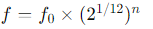
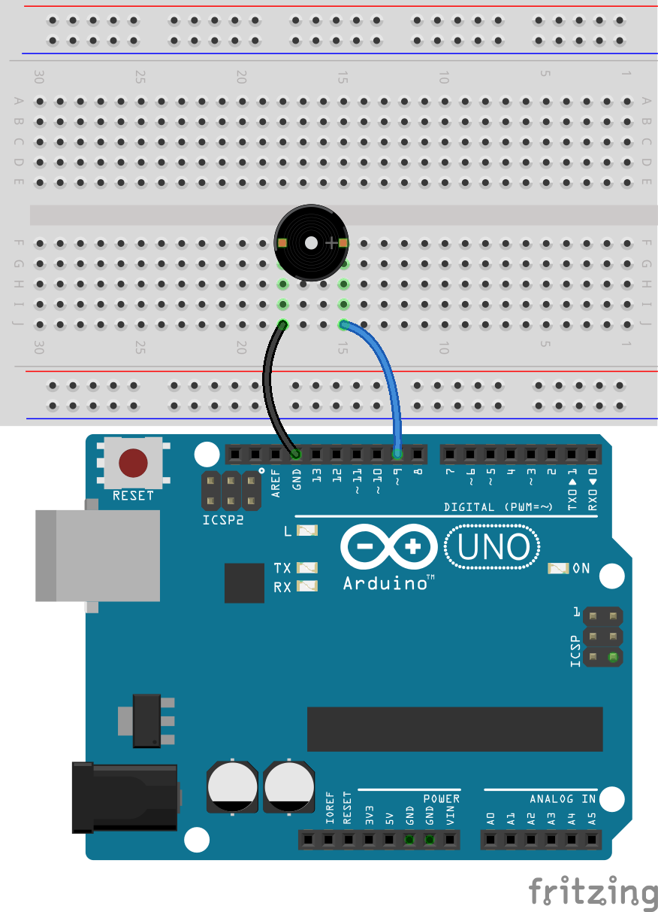

.. note::

    こんにちは！SunFounder Raspberry Pi & Arduino & ESP32 Enthusiasts Communityへようこそ。Facebookで仲間と共に、Raspberry Pi、Arduino、ESP32の世界をさらに深く探求しましょう。

    **参加する理由**

    - **専門サポート**: 購入後の問題や技術的な課題を、コミュニティやチームのサポートで解決。
    - **学びと共有**: スキルを向上させるためのヒントやチュートリアルを交換。
    - **独占プレビュー**: 新製品の発表や先行情報をいち早くゲット。
    - **特別割引**: 最新製品を対象とした限定割引を楽しめる。
    - **フェスティブプロモーションとギブアウェイ**: ギブアウェイや季節のプロモーションに参加可能。

    👉 一緒に探求し、創造する準備はできましたか？[|link_sf_facebook|]をクリックして、今すぐ参加しましょう！

23. きらきら星を演奏しよう
===========================================
このレッスンでは、音楽とテクノロジーの興味深い交差点を探求します。さまざまな音楽の音程が周波数の変化によって生成される方法、そしてこの原理をArduinoのようなマイクロコントローラを使用してブザーを制御することでどのように応用できるかを学びます。このレッスンの終わりまでに、音楽の基本的な周波数を理解し、Arduinoをプログラムして「きらきら星」の簡単なメロディを演奏できるようになります。

.. raw:: html

     <video controls style = "max-width:90%">
        <source src="_static/video/23_little_star.mp4" type="video/mp4">
        Your browser does not support the video tag.
    </video>

このレッスンの終了時には、以下のことができるようになります：

* 音楽の音程が特定の周波数に対応していることを理解する。
* 音符を配列に保存して操作することで、プログラムを簡略化する方法を学ぶ。
* Arduinoを使ってパッシブブザーを制御し、「きらきら星」を演奏するプログラムを作成し実行する。

音楽の周波数と音の生成
----------------------------------------------

さまざまな楽器は、周波数を変化させることで異なる音程を生成します。
たとえば、ピアノでは、鍵盤を叩くと対応する弦が急速に振動し、特定の音程を生み出します。
科学者や音楽家たちは、これらの振動周波数を正確に測定することで、さまざまな音楽の調律方法や音程の基準を開発してきました。

Arduinoや他のマイクロコントローラを使用してブザーに電気信号を送ると、その信号の周波数に応じてブザーの振動板が急速に振動し、
音を生成します。たとえば、440 Hzに設定された信号は、音楽の調律の基準となる「A4」という標準音程を生成します。
周波数が増減すると、生成される音程も上下し、低音から高音までの音域を達成できます。

西洋音楽では、オクターブには12の音程（半音階）が含まれており、CからBまで、そして再び高いCに戻ります。

たとえば、中音域のC（通常C4と呼ばれる）の周波数は約261.63 Hzです。音程の周波数は次の式を使用して計算できます：

ここで、f_0は基準音（通常はA4、周波数は440Hz）であり、nは基準音からターゲット音への半音階のステップ数を表します（正の数は上昇、負の数は下降を示します）。
この式を使用して、任意の音程の周波数を計算できます。

以下は周波数の一覧です：

* C (C4): 262 Hz（実際には約261.63 Hz、四捨五入して262）
* D (D4): 294 Hz
* E (E4): 330 Hz
* F (F4): 349 Hz
* G (G4): 392 Hz
* A (A4): 440 Hz
* B (B4): 494 Hz

次に、Arduinoとブザーを使用して「きらきら星」の最初の2行を演奏してみましょう。

.. note::

  「きらきら星」のメロディは、単純な音符の組み合わせに基づいており、
  フランスの作曲家ヴォルフガング・アマデウス・モーツァルトによる「Ah vous dirai-je, Maman」のバリエーションに基づいています。
  初心者が学ぶのに非常に適した曲です。

  ここに「きらきら星」の基本的な楽譜と、それぞれの音符が含まれています：

  .. code-block:: 

    C C G G A A G
    F F E E D D C
    G G F F E E D
    G G F F E E D
    C C G G A A G
    F F E E D D C

回路の構築
-----------------------

**必要なコンポーネント**

.. list-table:: 
   :widths: 25 25 25 25
   :header-rows: 0

   * - 1 * Arduino Uno R3
     - 1 * ブレッドボード
     - 1 * パッシブブザー
     - ジャンパーワイヤー
   * - |list_uno_r3| 
     - |list_breadboard| 
     - |list_passive_buzzer| 
     - |list_wire| 
   * - 1 * USBケーブル
     -
     - 
     - 
   * - |list_usb_cable| 
     -
     - 
     - 

**ステップごとの構築**

このレッスンでは、:ref:`ar_siren_sound` と同じ回路を使用します。

コード作成 - 配列
----------------------
1. Arduino IDEを開き、「ファイル」メニューから「新しいスケッチ」を選択して新しいプロジェクトを開始します。
2. ``Ctrl + S`` を押すか、「保存」をクリックして、スケッチを ``Lesson23_Array`` として保存します。

3. 次に、コードの最初に配列を作成し、「きらきら星」の音符をその配列に保存します。

.. code-block:: Arduino

  // Define the frequencies for the notes of the C major scale (octave starting from middle C)
  int c = 262;
  int d = 294;
  int e = 330;
  int f = 349;
  int g = 392;
  int a = 440;
  int b = 494;
  int C = 523;  // High C

  // Define an array containing the sequence of notes in the melody
  int melody[] = { c, c, g, g, a, a, g, f, f, e, e, d, d, c, g, g, f, f, e, e, d, g, g, f, f, e, e, d, c, c, g, g, a, a, g, f, f, e, e, d, d, c };

配列は、Arduinoプログラミングで同じタイプの複数の要素を格納するために使用されるデータ構造です。
これは非常に基本的で強力なツールであり、適切に使用すれば、プログラムの効率と性能を大幅に向上させることができます。
配列には、整数、浮動小数点数、文字などの要素を格納できます。

変数や関数を作成するのと同様に、配列を作成する際も、配列の型と配列名を指定します - ``int melody[]``。

``{}`` 内の要素は配列要素と呼ばれ、インデックス0から始まります。したがって、 ``melody[0]`` は最初の ``c(262)`` に等しく、 ``melody[13]`` も ``c(262)`` です。

4. 次に、シリアルモニタに ``melody[]`` 配列のインデックス0と13の要素を表示します。

.. code-block:: Arduino
  :emphasize-lines: 17,18

  // Define the frequencies for the notes of the C major scale (octave starting from middle C)
  int c = 262;
  int d = 294;
  int e = 330;
  int f = 349;
  int g = 392;
  int a = 440;
  int b = 494;
  int C = 523;  // High C

  // Define an array containing the sequence of notes in the melody
  int melody[] = { c, c, g, g, a, a, g, f, f, e, e, d, d, c, g, g, f, f, e, e, d, g, g, f, f, e, e, d, c, c, g, g, a, a, g, f, f, e, e, d, d, c };

  void setup() {
    // put your setup code here, to run once:
    Serial.begin(9600);  // Initialize serial communication at 9600 baud rate
    Serial.println(melody[0]);
    Serial.println(melody[13]);
  }
  
  void loop() {
    // メインコードをここに記述します（繰り返し実行されます）:
  }

5. コードをArduino Uno R3にアップロードした後、シリアルモニタを開くと、2つの「262」が表示されます。

.. code-block::

  262
  262

6. 配列 ``melody[]`` の各要素を1つずつ表示したい場合、まず配列の長さを知る必要があります。 ``sizeof()`` 関数を使用して、配列内の要素数を計算できます。

.. code-block:: Arduino
  :emphasize-lines: 4

  void setup() {
    // put your setup code here, to run once:
    Serial.begin(9600);  // Initialize serial communication at 9600 baud rate
    int notes = sizeof(melody) / sizeof(melody[0]); // Calculate the number of element
  }

  
* ``sizeof(melody)`` は、配列内の全要素が使用する合計バイト数を返します。
* ``sizeof(melody[0])`` は、配列の1要素が使用するバイト数を返します。
* 合計バイト数を要素ごとのバイト数で割ることで、配列内の要素数を得ることができます。

7. 次に、 ``for`` 文を使用して、配列 ``melody[]`` の各要素を繰り返し処理し、 ``Serial.println()`` 関数を使用してそれらを出力します。

.. code-block:: Arduino

  // Define the frequencies for the notes of the C major scale (octave starting from middle C)
  int c = 262;
  int d = 294;
  int e = 330;
  int f = 349;
  int g = 392;
  int a = 440;
  int b = 494;
  int C = 523;  // High C

  // Define an array containing the sequence of notes in the melody
  int melody[] = { c, c, g, g, a, a, g, f, f, e, e, d, d, c, g, g, f, f, e, e, d, g, g, f, f, e, e, d, c, c, g, g, a, a, g, f, f, e, e, d, d, c };

  void setup() {
    // put your setup code here, to run once:
    Serial.begin(9600);                              // Initialize serial communication at 9600 baud rate
    int notes = sizeof(melody) / sizeof(melody[0]);  // Calculate the number of element
    // Loop through each note in the melody array
    for (int i = 0; i < notes; i = i + 1) {
      // Print each note's frequency to the serial monitor
      Serial.println(melody[i]);
    }
  }

  void loop() {
    // メインコードをここに記述します（繰り返し実行されます）:
  }

8. コードをArduino Uno R3にアップロードした後、シリアルモニタを開くと、配列 ``melody[]`` 内の要素が1つずつ表示されます。

.. code-block::

  262
  262
  392
  392
  440
  440
  392
  349
  349
  330
  ...

**質問**

配列内の要素に対して、たとえば ``Serial.println(melody[i] * 1.3);`` のように演算を行うこともできます。どのようなデータが得られるでしょうか？また、その理由は何ですか？

コード作成 - きらきら星を演奏しよう
-----------------------------------

配列の作成、配列要素へのアクセス、長さの計算、および演算に関する理解が深まったところで、この知識を応用して、パッシブブザーを使い、「きらきら星」を保存された周波数と間隔で演奏するプログラムを作成しましょう。

1. 先ほど保存したスケッチ ``Lesson23_Array`` を開き、「ファイル」メニューから「名前を付けて保存」を選択し、これを ``Lesson23_Little_Star`` にリネームして「保存」をクリックします。

2. まず、ブザーピンを定義します。

.. code-block:: Arduino

  const int buzzerPin = 9;  // Assigns the pin 9 to the constant for the buzzer

3. 次に、音符の長さを格納するための別の配列を作成します。

.. code-block:: Arduino
  :emphasize-lines: 3

  // Set up the sequence of notes and their durations in milliseconds
  int melody[] = { c, c, g, g, a, a, g, f, f, e, e, d, d, c, g, g, f, f, e, e, d, g, g, f, f, e, e, d, c, c, g, g, a, a, g, f, f, e, e, d, d, c };
  int noteDurations[] = { 500, 500, 500, 500, 500, 500, 1000, 500, 500, 500, 500, 500, 500, 1000, 500, 500, 500, 500, 500, 500, 1000, 500, 500, 500, 500, 500, 500, 1000, 500, 500, 500, 500, 500, 500, 1000, 500, 500, 500, 500, 500, 500, 1000 };

4. 次に、コードの一部を ``void setup()`` から ``void loop()`` に移動します。

.. code-block:: Arduino
  :emphasize-lines: 8-13

  void setup() {
    // put your setup code here, to run once:
    Serial.begin(9600);                              // Initialize serial communication at 9600 baud rate
  }

  void loop() {
    // put your main code here, to run repeatedly:
    int notes = sizeof(melody) / sizeof(melody[0]);  // Calculate the number of element
    // Loop through each note in the melody array
    for (int i = 0; i < notes; i = i + 1) {
      // Print each note's frequency to the serial monitor
      Serial.println(melody[i]);
    }
  }

5. ``for`` 文の中で、印刷コードをコメントアウトし、 ``tone()`` 関数を使用して音符を再生します。

.. code-block:: Arduino
  :emphasize-lines: 9

  void loop() {
    // put your main code here, to run repeatedly:
    int notes = sizeof(melody) / sizeof(melody[0]);  // Calculate the number of element
    // Loop through each note in the melody array
    for (int i = 0; i < notes; i = i + 1) {
      // Print each note's frequency to the serial monitor
      // Serial.println(melody[i]);

      tone(buzzerPin, melody[i], noteDurations[i]);  // Play the note
    }
  }

6. 各音符が再生された後、メロディをより自然にするために、2つの音符の間に短い間隔を追加します。ここでは、音符の持続時間に1.30を掛けて間隔を計算し、メロディが急がないようにします。

.. code-block:: Arduino
  :emphasize-lines: 10

  void loop() {
    // put your main code here, to run repeatedly:
    int notes = sizeof(melody) / sizeof(melody[0]);  // Calculate the number of element
    // Loop through each note in the melody array
    for (int i = 0; i < notes; i = i + 1) {
      // Print each note's frequency to the serial monitor
      // Serial.println(melody[i]);

      tone(buzzerPin, melody[i], noteDurations[i]);  // 音符を再生
      delay(noteDurations[i] * 1.30);  // 音符を変更する前に待機
    }
  }

7. ``noTone()`` 関数を使用して、現在のピンからの音を停止します。これにより、各音符が明確に再生され、次の音符に混ざらないようにするための重要なステップです。

.. code-block:: Arduino
  :emphasize-lines: 11

  void loop() {
    // put your main code here, to run repeatedly:
    int notes = sizeof(melody) / sizeof(melody[0]);  // Calculate the number of element
    // Loop through each note in the melody array
    for (int i = 0; i < notes; i = i + 1) {
      // Print each note's frequency to the serial monitor
      // Serial.println(melody[i]);

      tone(buzzerPin, melody[i], noteDurations[i]);  // Play the note
      delay(noteDurations[i] * 1.30);                // Wait before changing the note
      noTone(buzzerPin);                             // Stop playing the note
    }
  }

8. 以下に完全なコードを示します。これをArduino Uno R3にアップロードすると、ブザーが「きらきら星」を演奏するのを聞くことができます。

.. code-block:: Arduino

  int buzzerPin = 9;  // ピン9をブザーの定数に割り当て

  // Cメジャースケールの音符の周波数を定義（中音域Cから始まるオクターブ）
  int c = 262;
  int d = 294;
  int e = 330;
  int f = 349;
  int g = 392;
  int a = 440;
  int b = 494;
  int C = 523;  // High C

  // Set up the sequence of notes and their durations in milliseconds
  int melody[] = { c, c, g, g, a, a, g, f, f, e, e, d, d, c, g, g, f, f, e, e, d, g, g, f, f, e, e, d, c, c, g, g, a, a, g, f, f, e, e, d, d, c };
  int noteDurations[] = { 500, 500, 500, 500, 500, 500, 1000, 500, 500, 500, 500, 500, 500, 1000, 500, 500, 500, 500, 500, 500, 1000, 500, 500, 500, 500, 500, 500, 1000, 500, 500, 500, 500, 500, 500, 1000, 500, 500, 500, 500, 500, 500, 1000 };

  void setup() {
    // put your setup code here, to run once:
    Serial.begin(9600);                              // Initialize serial communication at 9600 baud rate
  }

  void loop() {
    // put your main code here, to run repeatedly:
    int notes = sizeof(melody) / sizeof(melody[0]);  // Calculate the number of element
    // Loop through each note in the melody array
    for (int i = 0; i < notes; i = i + 1) {
      // Print each note's frequency to the serial monitor
      // Serial.println(melody[i]);

      tone(buzzerPin, melody[i], noteDurations[i]);  // Play the note
      delay(noteDurations[i] * 1.30);                // Wait before changing the note
      noTone(buzzerPin);                             // Stop playing the note
    }
  }
  
9. 最後に、コードを保存し、作業スペースを整理することを忘れないでください。

**質問**

回路内のパッシブブザーをアクティブブザーに交換した場合、「きらきら星」を正常に演奏できますか？その理由は何ですか？

**まとめ**

本授業では、配列を使用してデータを保存し、配列の長さを計算し、配列内の要素をインデックスで指定し、各要素に対して演算を行う方法を学びました。配列に音符の周波数とタイミング間隔を保存し、forループを使用してそれらを繰り返し処理することで、パッシブブザーを使って「きらきら星」を演奏するプログラムを作成しました。

さらに、 ``noTone()`` 関数を使用して音符の再生を一時停止する方法も学びました。

この授業では、配列操作や制御構造に関する理解を深めるとともに、これらの概念を電子部品を使って音楽を作るという実践的な応用に結びつけ、楽しく魅力的な方法で理論的知識を実践に移す方法を学びました。

