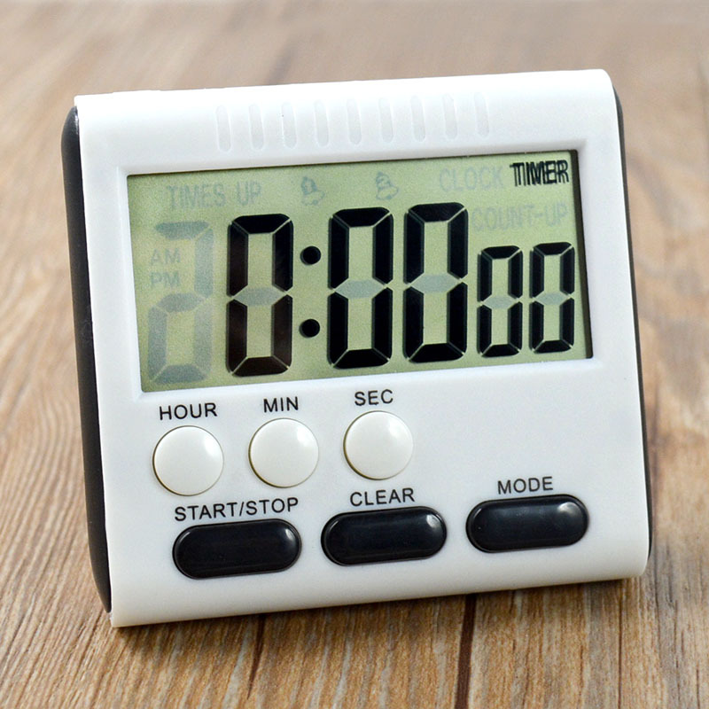

.. note::

    Hello, welcome to the SunFounder Raspberry Pi & Arduino & ESP32 Enthusiasts Community on Facebook! Dive deeper into Raspberry Pi, Arduino, and ESP32 with fellow enthusiasts.

    **Why Join?**

    - **Expert Support**: Solve post-sale issues and technical challenges with help from our community and team.
    - **Learn & Share**: Exchange tips and tutorials to enhance your skills.
    - **Exclusive Previews**: Get early access to new product announcements and sneak peeks.
    - **Special Discounts**: Enjoy exclusive discounts on our newest products.
    - **Festive Promotions and Giveaways**: Take part in giveaways and holiday promotions.

    👉 Ready to explore and create with us? Click [|link_sf_facebook|] and join today!

24. The Pomodoro Timer
===========================================

In this lesson, we'll explore the intersection of time management and technology by creating a Pomodoro Timer using an Arduino and an active buzzer. You'll learn how to utilize the Arduino's internal timing capabilities to construct a timer that segments work into 25-minute focused intervals followed by 5-minute breaks. This method, known as the Pomodoro Technique, enhances productivity and focus. Throughout the course, you'll gain a solid foundation in electronic timing and hands-on experience in programming and circuit assembly, culminating in the creation of a functional Pomodoro Timer. Join us to master your time and boost efficiency in your daily activities!

.. raw:: html

    <video width="600" loop autoplay>
        <source src="_static/video/24_beep_timer.mp4" type="video/mp4">
        Your browser does not support the video tag.
    </video>

By the end of this lesson, you will be able to:

* Understand the historical significance of sound in timekeeping.
* Identify the components required to build an electronic timer circuit.
* Program an Arduino to control a buzzer for time management using both ``delay()`` and ``millis()`` functions.
* Apply the Pomodoro Technique in a practical context by creating a timer that alternates between work and break periods.

Clocks and Sound
--------------------

In the ancient world, large-scale bell tolls were used to mark the passage of time and specific social events.
For example, medieval European cities utilized church bell tolls to mark prayer times and the start and end of workdays.
These tolls were more than just markers of time; they served as tools for social order, around which the daily life of the community revolved.

**Mechanical Clocks and Sound**

With the development of mechanical clocks, especially with the design of the Big Ben, clocks began to be equipped with more complex bells and timing mechanisms.
The sound of Big Ben is carried by its large bronze bells, enhancing both the range of sound propagation and the precision of time announcements.
In many towns and cities, the sound of Big Ben became a reference for residents to adjust their daily activities, playing a crucial role in more precise time scheduling for navigation,
railroad timetables, and more.

**Sound Timing in the Electronic Age**

Entering the electronic era, sound timers evolved anew. The introduction of electronic buzzers, especially with the aid of microcontrollers like Arduino,
allowed time marking to become independent of large mechanical devices. These small devices can produce sounds of different frequencies and pitches,
which can be used for various timing applications, from simple kitchen timers to complex industrial process control systems.
Examples include the nurse call systems in modern hospitals, school class bells, and reminders in personal electronic devices, all utilizing electronic buzzers for time management.

Building the Circuit
-----------------------

**Components Needed**

.. list-table:: 
   :widths: 25 25 25 25
   :header-rows: 0

   * - 1 * Arduino Uno R3
     - 1 * Breadboard
     - 1 * Active Buzzer
     - Jumper Wires
   * - |list_uno_r3| 
     - |list_breadboard| 
     - |list_active_buzzer| 
     - |list_wire| 
   * - 1 * USB Cable
     -
     - 
     - 
   * - |list_usb_cable| 
     -
     - 
     - 

**Building Step-by-Step**

This lesson uses the same circuit as :ref:`ar_morse_code`.

.. image:: img/16_morse_code.png
    :width: 500
    :align: center

Coding Creation - Tick Tick
----------------------------

In Arduino, ``delay()`` is the simplest and most commonly used timing function.
We often use it to pause the program for a short time, which, combined with loops, can create a blinking LED effect. Here, we use the ``delay()`` function to make the buzzer sound once every second.

1. Open the Arduino IDE and start a new project by selecting “New Sketch” from the “File” menu.
2. Save your sketch as ``Lesson24_Timer_Tick_Tick`` using ``Ctrl + S`` or by clicking “Save”.

3. Write the code as follows:

.. code-block:: Arduino

  const int buzzerPin = 9;   // Assigns the pin 9 to the constant for the buzzer  
  
  void setup() {
    // put your setup code here, to run once:
    pinMode(buzzerPin, OUTPUT);  // Set pin 9 as output
  } 

  void loop() {
    // put your main code here, to run repeatedly:
    digitalWrite(buzzerPin, HIGH);  // Turn buzzer ON
    delay(100);                     // Beep duration: 100 milliseconds
    digitalWrite(buzzerPin, LOW);   // Turn buzzer OFF
    delay(1000);                     // Interval between signals: 1000 milliseconds
  }

In this setup, the first ``delay()`` function pauses the Arduino Uno R3 for 100 milliseconds, during which the buzzer continues to sound. The second ``delay()`` function pauses the Arduino for 1000 milliseconds (1 second), during which the buzzer is silent.

4. After uploading the code to the Arduino Uno R3, you will hear the buzzer beep once every second.

Coding Creation - ``millis()``
------------------------------

Using ``delay()`` pauses your code, which can be inconvenient.

For example, imagine heating a pizza in a microwave while waiting for some important emails.
You put the pizza in the microwave and set it for 10 minutes. The analogy with using ``delay()`` is sitting in front of the microwave, watching the timer count down from 10 minutes to zero. If you receive an important email during this time, you'll miss it.

What you usually do is put the pizza in the microwave, then check your emails, perhaps even do something else, and periodically check back to see if the timer has reached zero, indicating that your pizza is done.

Arduino also has a timing tool that does not pause the program, which is ``millis()``.

``millis()`` is a very important function in Arduino programming. It returns the number of milliseconds that have passed since the Arduino board was powered up or last reset.

  * ``time = millis()``: Returns the number of milliseconds passed since the Arduino board began running the current program. This number will overflow (go back to zero), after approximately 50 days.

  **Parameters**
    None

  **Returns**
    Number of milliseconds passed since the program started. Data type: unsigned long.

Here, we similarly make the buzzer beep once every second.

1. Open the Arduino IDE and start a new project by selecting “New Sketch” from the “File” menu.
2. Save your sketch as ``Lesson24_Timer_Millis`` using ``Ctrl + S`` or by clicking “Save”.

3. First, create a constant called ``buzzerPin`` and set it equal to pin 9.

.. code-block:: Arduino
  :emphasize-lines: 1

  const int buzzerPin = 9;   // Assigns the pin 9 to the constant for the buzzer

  void setup() {
    // put your setup code here, to run once:
  }

4. Create two long-type variables, ``previousMillis`` will store the timestamp of the last time the buzzer beeped, ``interval`` sets how often the buzzer beeps, in milliseconds. Here, it’s set to beep every 1000 milliseconds (or every second).

.. code-block:: Arduino
  :emphasize-lines: 3,4

  const int buzzerPin = 9;  // Assigns the pin 9 to the constant for the buzzer

  unsigned long previousMillis = 0;  // Store the timestamp of the last time the buzzer beeped
  long interval = 1000;              // Interval at which to beep (milliseconds)

5. In the ``void setup()`` function, set the buzzer pin to output mode.

.. code-block:: Arduino
  :emphasize-lines: 8

  const int buzzerPin = 9;  // Assigns the pin 9 to the constant for the buzzer

  unsigned long previousMillis = 0;  // Store the timestamp of the last time the buzzer beeped
  long interval = 1000;              // Interval at which to beep (milliseconds)

  void setup() {
    // put your setup code here, to run once:
    pinMode(buzzerPin, OUTPUT);  // Set pin 9 as output
  }

6. In the ``void loop()`` create an ``unsigned long`` variable called ``currentMillis`` to store the current time.

.. code-block:: Arduino
  :emphasize-lines: 3

  void loop() {
    // put your main code here, to run repeatedly:
    unsigned long currentMillis = millis();
  }

7.  When the current running time minus the last update time exceeds 1000ms, trigger some functions. Also, update the ``previousMillis`` to the current time, so that the next trigger will happen in 1 second.

.. code-block:: Arduino
  :emphasize-lines: 5,6

  void loop() {
    // put your main code here, to run repeatedly:
    unsigned long currentMillis = millis();

    if (currentMillis - previousMillis >= interval) {
      previousMillis = currentMillis;  // Save the last time the buzzer beeped
    }
  }

8. Add the main functions that need to be executed periodically. In this case, make the buzzer sound.

.. code-block:: Arduino
  :emphasize-lines: 7,8,9

  void loop() {
    // put your main code here, to run repeatedly:
    unsigned long currentMillis = millis();

    if (currentMillis - previousMillis >= interval) {
      previousMillis = currentMillis;  // Save the last time the buzzer beeped
      digitalWrite(buzzerPin, HIGH);   // Make a voice
      delay(100);
      digitalWrite(buzzerPin, LOW);  // silence
    }
  }

9. Your complete code should look like this, upload it to the Arduino Uno R3, and you will find the buzzer beeps once every second.

.. code-block:: Arduino

  const int buzzerPin = 9;  // Assigns the pin 9 to the constant for the buzzer

  unsigned long previousMillis = 0;  // Store the timestamp of the last time the buzzer beeped
  long interval = 1000;              // Interval at which to beep (milliseconds)

  void setup() {
    // put your setup code here, to run once:
    pinMode(buzzerPin, OUTPUT);  // Set pin 9 as output
  }

  void loop() {
    // put your main code here, to run repeatedly:
    unsigned long currentMillis = millis();

    if (currentMillis - previousMillis >= interval) {
      previousMillis = currentMillis;  // Save the last time the buzzer beeped
      digitalWrite(buzzerPin, HIGH);   // Make a voice
      delay(100);
      digitalWrite(buzzerPin, LOW);  // silence
    }
  }

**Question**

If the ``delay(100);`` is changed to ``delay(1000);``, what will happen to the program? Why?

Coding Creation - Pomodoro Timer
-----------------------------------

The Pomodoro Technique, also known as the Tomato Technique, is a time management method developed by Francesco Cirillo in the late 1980s.
This method uses a timer to break work into 25-minute intervals, followed by short breaks.
Each work interval is called a "pomodoro," after the tomato-shaped kitchen timer Cirillo used during his university days.

The basic steps of the Pomodoro Technique include:

1. **Define the Task**: Decide on the task you need to complete before you start.
2. **Set the Pomodoro Timer**: Set a timer for 25 minutes of work time.
3. **Work Intensely**: Focus fully on the task for these 25 minutes, avoiding any form of distraction.
4. **Take a Short Break**: Once the work time is up, take a 5-minute break. During this time, you can walk around, stretch, drink water, etc., but avoid engaging in work-related activities.

The benefits of the Pomodoro Technique include enhanced focus, reduced fatigue, clear delineation of work and break times helping manage distractions, and increased motivation and satisfaction from completing tasks. Additionally, the Pomodoro Technique does not require complex tools or technology—a simple timer is sufficient.

Next, we will program a timer that will buzz every 25 minutes to signal the end of a work period followed by a reminder for a 5-minute break:

1. Open the Arduino IDE and start a new project by selecting “New Sketch” from the “File” menu.
2. Save your sketch as ``Lesson24_Timer_Millis_Pomodoro`` using ``Ctrl + S`` or by clicking “Save”.

3. Define some constants and variables before ``void setup()``.

* ``buzzerPin`` identifies which pin the buzzer is connected to.
* ``startMillis`` keeps track of when the timer started.
* ``workPeriod`` and ``breakPeriod`` define how long each period lasts.
* ``isWorkPeriod`` is a boolean variable used to track whether it's time to work or take a break.

.. code-block:: Arduino

  const int buzzerPin = 9;          // Assigns the pin 9 to the constant for the buzzer
  unsigned long startMillis;        // Stores the time when the timer starts
  const long workPeriod = 1500000;  // Work period of 25 minutes
  const long breakPeriod = 300000;  // Break period of 5 minutes
  static bool isWorkPeriod = true;  // Track whether it is a work or break period

4. Initialize the buzzer pin as an output and start the timer by recording the start time with ``millis()``.

.. code-block:: Arduino
  :emphasize-lines: 2,3
  
  void setup() {
    pinMode(buzzerPin, OUTPUT); // Initialize buzzer pin as an output
    startMillis = millis(); // Record the start time
  }

5. In the ``void loop()`` create an ``unsigned long`` variable called ``currentMillis`` to store the current time.

.. code-block:: Arduino
  :emphasize-lines: 2

  void loop() {
    unsigned long currentMillis = millis(); // Update the current time
  }

6. Use ``if else if`` conditional statements to determine if it's a work period.

.. code-block:: Arduino
  :emphasize-lines: 4-6

  void loop() {
    unsigned long currentMillis = millis(); // Update the current time

    if (isWorkPeriod){ 
    } else if (!isWorkPeriod){
    }
  }

7. If it is, check if the current time has exceeded the ``workPeriod``. If so, reset the timer, switch to break period, and trigger the buzzer to sound twice for a long duration.

.. code-block:: Arduino
  :emphasize-lines: 5-16

  void loop() {
    unsigned long currentMillis = millis();  // Update the current time

    if (isWorkPeriod) {
      if (currentMillis - startMillis >= workPeriod) {
        startMillis = currentMillis;  // Reset the timer
        isWorkPeriod = false;         // Switch to break period
        digitalWrite(buzzerPin, HIGH);  // Turn buzzer on
        delay(500);                     // Buzzer on for 500 milliseconds
        digitalWrite(buzzerPin, LOW);   // Turn buzzer off
        delay(200);                     // Buzzer off for 200 milliseconds
        digitalWrite(buzzerPin, HIGH);  // Turn buzzer on
        delay(500);                     // Buzzer on for 500 milliseconds
        digitalWrite(buzzerPin, LOW);   // Turn buzzer off
        delay(200);                     // Buzzer off for 200 milliseconds
      }
    } else if (!isWorkPeriod) {
    }
  }

8. Use ``else if`` conditional statements to determine if it's a break period, and similarly check if the current time has exceeded the ``breakPeriod``. If so, reset the timer, switch back to work period, and trigger the buzzer to sound briefly twice.

.. code-block:: Arduino

  } else if (!isWorkPeriod) {
    if (currentMillis - startMillis >= breakPeriod) {
      startMillis = currentMillis;  // Reset the timer
      isWorkPeriod = true;          // Switch to work period
      digitalWrite(buzzerPin, HIGH);  // Turn buzzer on
      delay(200);                     // Buzzer on for 200 milliseconds
      digitalWrite(buzzerPin, LOW);   // Turn buzzer off
      delay(200);                     // Buzzer off for 200 milliseconds
      digitalWrite(buzzerPin, HIGH);  // Turn buzzer on
      delay(200);                     // Buzzer on for 200 milliseconds
      digitalWrite(buzzerPin, LOW);   // Turn buzzer off
      delay(200);                     // Buzzer off for 200 milliseconds
    }
  }

9. Your complete code should look like this, and you can upload it to the Arduino Uno R3 to see the effects.

.. note::

  If you find waiting 25 minutes for a work period and 5 minutes for a break too long during debugging, 
  you can shorten ``workPeriod`` to 15000 milliseconds and ``breakPeriod`` to 3000 milliseconds. You will then hear the buzzer sound twice long every 15 seconds, followed by a short buzz twice after 3 seconds.

.. code-block:: Arduino

  const int buzzerPin = 9;          // Assigns the pin 9 to the constant for the buzzer
  unsigned long startMillis;        // Stores the time when the timer starts
  const long workPeriod = 1500000;  // Work period of 25 minutes
  const long breakPeriod = 300000;  // Break period of 5 minutes
  static bool isWorkPeriod = true;  // Track whether it is a work or break period

  void setup() {
    pinMode(buzzerPin, OUTPUT); // Initialize buzzer pin as an output
    startMillis = millis(); // Record the start time
  }

  void loop() {
    unsigned long currentMillis = millis(); // Update the current time

    if (isWorkPeriod){ 
      if(currentMillis - startMillis >= workPeriod) {
        startMillis = currentMillis; // Reset the timer
        isWorkPeriod = false; // Switch to break period
        digitalWrite(buzzerPin, HIGH);  // Turn buzzer on
        delay(500);                     // Buzzer on for 500 milliseconds
        digitalWrite(buzzerPin, LOW);   // Turn buzzer off
        delay(200);                     // Buzzer off for 200 milliseconds
        digitalWrite(buzzerPin, HIGH);  // Turn buzzer on
        delay(500);                     // Buzzer on for 500 milliseconds
        digitalWrite(buzzerPin, LOW);   // Turn buzzer off
        delay(200);                     // Buzzer off for 200 milliseconds
      }
    } else if (!isWorkPeriod) 
      if(currentMillis - startMillis >= breakPeriod) {
        startMillis = currentMillis; // Reset the timer
        isWorkPeriod = true; // Switch to work period
        digitalWrite(buzzerPin, HIGH);  // Turn buzzer on
        delay(200);                     // Buzzer on for 200 milliseconds
        digitalWrite(buzzerPin, LOW);   // Turn buzzer off
        delay(200);                     // Buzzer off for 200 milliseconds
        digitalWrite(buzzerPin, HIGH);  // Turn buzzer on
        delay(200);                     // Buzzer on for 200 milliseconds
        digitalWrite(buzzerPin, LOW);   // Turn buzzer off
        delay(200);                     // Buzzer off for 200 milliseconds
      }
    }
  }

10. Finally, remember to save your code and tidy up your workspace.

**Summary**

In today's class, we successfully built an electronic version of the Pomodoro Timer, an invaluable tool for enhancing productivity through structured work and break periods. Through this project, students learned about the utility of buzzers in time management and the practical application of the ``millis()`` function to create non-blocking timer code in Arduino. This approach enables multitasking in microcontroller applications, mirroring more complex systems in technology and industry.

**Question**

Think about other places in your life where you can 'hear' time. List a few examples and write them in your handbook!

