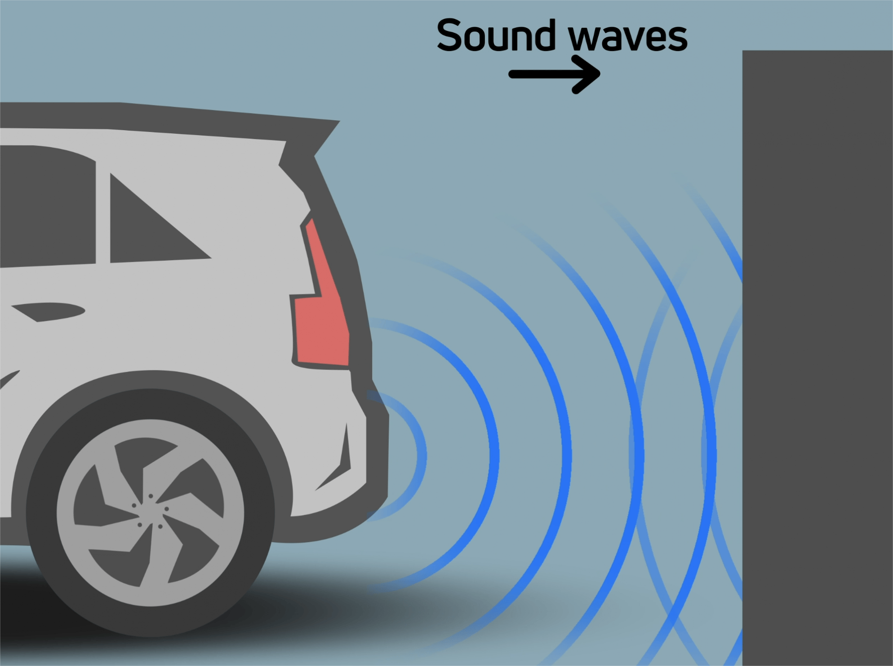
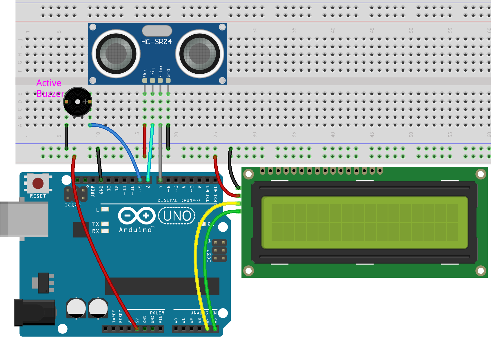
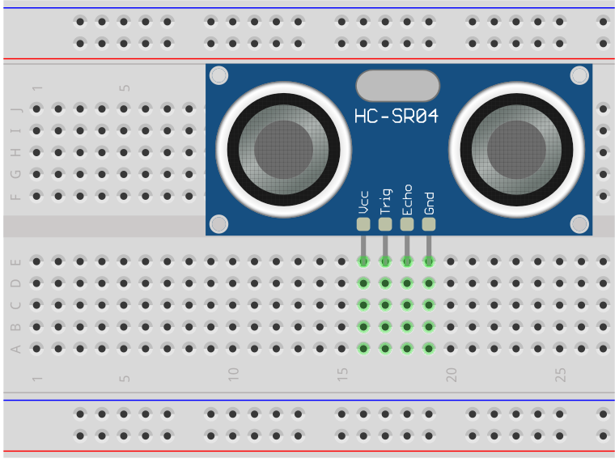
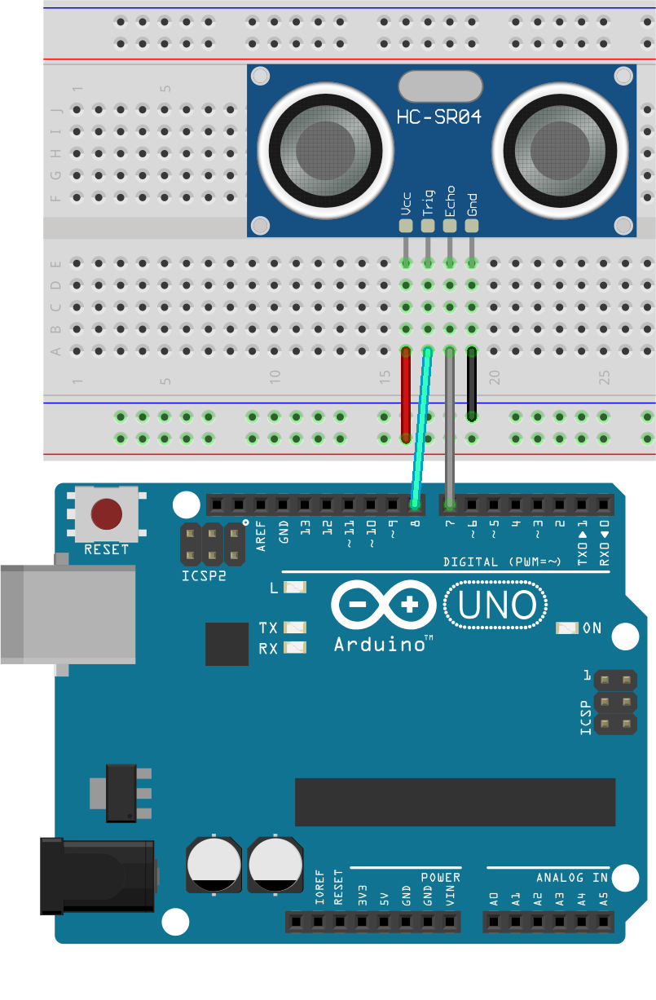
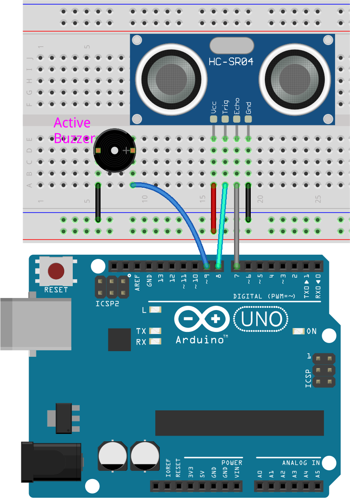
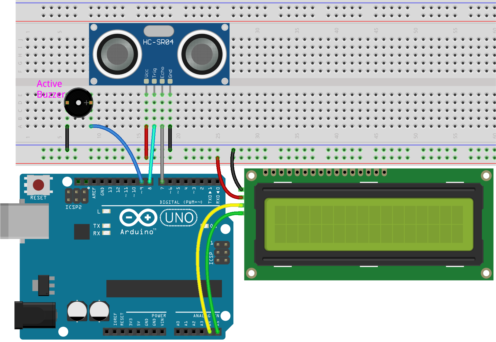

.. note::

    Hello, welcome to the SunFounder Raspberry Pi & Arduino & ESP32 Enthusiasts Community on Facebook! Dive deeper into Raspberry Pi, Arduino, and ESP32 with fellow enthusiasts.

    **Why Join?**

    - **Expert Support**: Solve post-sale issues and technical challenges with help from our community and team.
    - **Learn & Share**: Exchange tips and tutorials to enhance your skills.
    - **Exclusive Previews**: Get early access to new product announcements and sneak peeks.
    - **Special Discounts**: Enjoy exclusive discounts on our newest products.
    - **Festive Promotions and Giveaways**: Take part in giveaways and holiday promotions.

    👉 Ready to explore and create with us? Click [|link_sf_facebook|] and join today!

25. Reverse Radar System
=====================================

When reversing a car, it is crucial to be aware of obstacles behind the vehicle, especially in situations with limited visibility. 
To enhance safety, many modern vehicles are equipped with reverse radar systems. 

Today, we're going to learn how to build and program an ultrasonic radar system using Arduino. This system will use an ultrasonic sensor to measure distances and provide feedback through an LCD display and a buzzer. We'll go through each section of the code, explaining what it does and why it's important.

.. raw:: html

    <video width="600" loop autoplay muted>
        <source src="_static/video/25_reverse_alarm.mp4" type="video/mp4">
        Your browser does not support the video tag.
    </video>

Reverse Radar System Evolution
----------------------------------------

The development of reverse radar systems, also known as parking sensors, began in the late 20th century to address the need for safer vehicle parking. Initially developed in the 1970s using ultrasonic technology similar to marine sonar, these systems used sound waves to detect objects and calculate distances.

Significant advancements came in the 1990s with the introduction of microcontroller-based systems and electromagnetic sensors, which provided more precise measurements and improved vehicle integration. This period saw the incorporation of these sensors into luxury vehicles, enhancing both safety and luxury appeal.

By the early 2000s, reverse radar systems had advanced to include visual, auditory, and haptic feedback, along with digital displays and integration with vehicle navigation systems, offering drivers real-time, comprehensible information about their surroundings.

Today, the technology continues to evolve with the integration of AI and IoT, using a mix of cameras, radar, and ultrasonic sensors to provide a detailed view of the vehicle’s environment, reducing accident risks and easing parking. This technology is now a fundamental component of the autonomous driving systems poised to revolutionize the automotive industry.

Building the Circuit
--------------------------------

**Components Needed**

.. list-table:: 
   :widths: 25 25 25 25
   :header-rows: 0

   * - 1 * Arduino Uno R3
     - 1 * Ultrasonic Module
     - 1 * Active Buzzer
     - 1 * I2C LCD1602
   * - |components_uno_r3| 
     - |components_ultrasonic| 
     - |components_active_buzzer| 
     - |components_i2c_lcd1602_|
   * - 1 * USB Cable
     - 1 * Breadboard
     - Jumper Wires
     - 
   * - |components_usb_cable| 
     - |components_breadboard| 
     - |components_wire| 
     - 

**Building Step-by-Step**

Follow the wiring diagram, or the steps below to build your circuit.

1. Insert the ultrasonic module into the breadboard.

2. Connect the VCC pin of the ultrasonic module to the positive side of the breadboard, the Trig pin to pin 8 on the Arduino board, the Echo pin to pin 7, and the GND to the negative side of the breadboard.

3. Insert the active buzzer (with a white sticker) into the breadboard. Connect the "+" pin to pin 9 and the "-" pin to GND.

4. Connect the I2C LCD1602 module: GND to the negative rail on the breadboard, VCC to the positive rail on the breadboard, SDA to pin A4, and SCL to pin A5.

5. Finally, connect the GND and 5V pins of the Arduino Uno R3 to the negative and positive rails of the breadboard, respectively.

Code Creation
--------------------
In a reverse radar system, each component plays a critical role in ensuring accurate distance measurement and effective feedback:

* The ultrasonic sensor is used to detect the distance to objects in front of it.
* The I2C LCD1602 is used to display the distance detected by the ultrasonic sensor.
* The active buzzer is used to change the beeping interval based on the distance measured by the ultrasonic sensor.

Here is how the system reacts based on different distance ranges:

* **Less than 10cm**: The buzzer beeps at a rapid interval of 100 milliseconds.
* **Between 10cm and 20cm**: The beeping interval increases to 500 milliseconds.
* **Between 20cm and 50cm**: The interval extends further to 1000 milliseconds (1 second).
* **Greater than 50cm**: The buzzer beeps at a relaxed interval of 2000 milliseconds (2 seconds).

Now, let's start coding to see how we can implement the functionality described above.

.. note::

  If you are not familiar with the ultrasonic sensor, I2C LCD1602, or active buzzer, you can first learn their basic usage in the following projects:

  * :ref:`ar_i2c_lcd1602`
  * :ref:`ar_smart_trash_can`
  * :ref:`ar_morse_code`

1. Open the Arduino IDE and start a new project by selecting “New Sketch” from the “File” menu.
2. Save your sketch as ``Lesson25_Reverse_Radar_System`` using ``Ctrl + S`` or by clicking “Save”.

3. First, we include the necessary libraries for using the LCD and initialize it with the correct I2C address and size.

.. note::

  ``LiquidCrystal I2C`` library is used here, you can install it from the **Library Manager**.

.. code-block:: Arduino

  #include <Wire.h>
  #include <LiquidCrystal_I2C.h>

  // Initialize the LCD with I2C address 0x27 and size 16x2
  LiquidCrystal_I2C lcd(0x27, 16, 2);

4. Next, define the pins on the Arduino that connect to the ultrasonic sensor's trigger, echo, and the buzzer.

.. code-block:: Arduino

  #define TRIGGER_PIN 8  // Pin to trigger the ultrasonic pulse
  #define ECHO_PIN 7     // Pin to receive the echo
  #define BUZZER_PIN 9   // Pin for the buzzer

5. Set up variables to control how frequently the buzzer beeps based on the distance measured.

.. code-block:: Arduino

  // Timing variables to control the beeping frequency based on distance
  unsigned long intervals = 1000;    // Default interval for beeping
  unsigned long previousMillis = 0;  // Store last time the buzzer beeped

  // Distance measurement variable
  long distance = 0;

6. In the ``void setup()`` function, configure the pin modes and initialize the LCD and serial communication.

.. code-block:: Arduino

  void setup() {
    pinMode(TRIGGER_PIN, OUTPUT);  // Set the trigger pin as output
    pinMode(ECHO_PIN, INPUT);      // Set the echo pin as input
    pinMode(BUZZER_PIN, OUTPUT);   // Set the buzzer pin as output
    lcd.init();                    // Initialize the LCD
    lcd.backlight();               // Turn on LCD backlight
    Serial.begin(9600);            // Start serial communication at 9600 baud rate
  }

7. The main loop continuously measures the distance, adjusts the beeping interval, and updates the LCD display.

.. code-block:: Arduino

  void loop() {
    distance = measureDistance();  // Measure distance

    // Adjust intervals based on distance
    adjustBeepingInterval();

    unsigned long currentMillis = millis();  // Get current time
    // Check if it's time to beep
    if (currentMillis - previousMillis >= intervals) {
      Serial.println("Beeping!");
      beep();
      previousMillis = currentMillis;  // Update previousMillis directly here
    }

    updateLCD();  // Update the LCD display
    delay(100);   // Short delay to stabilize readings
  }

* First, we use the ``measureDistance()`` function to determine the distance using the ultrasonic sensor.

.. code-block:: Arduino

  distance = measureDistance();  // Measure distance

* Next, adjust the beeping frequency based on the newly measured distance using the ``adjustBeepingInterval()`` function. This dynamically changes how often the buzzer sounds based on how close the detected object is.

.. code-block:: Arduino

  // Adjust intervals based on distance
  adjustBeepingInterval();

* The ``millis()`` function is then called to record the current time in milliseconds since the Arduino board started running the program.

.. code-block:: Arduino

  unsigned long currentMillis = millis();

* Check if the time elapsed since the last beep is greater than or equal to the set interval. If it is, print a message to the serial monitor, activate the buzzer, and reset the ``previousMillis``. This ensures the buzzer operates at intervals adjusted to the distance, maintaining consistent alert timing.

.. code-block:: Arduino
  
  if (currentMillis - previousMillis >= intervals) {
    Serial.println("Beeping!");
    beep();
    previousMillis = currentMillis;  // Update previousMillis directly here
  }

* Finallly, call ``updateLCD()`` function to update the LCD with the current distance measurement.

.. code-block:: Arduino

  updateLCD();  // Update the LCD display

8. About ``adjustBeepingInterval()`` function: Adjust the beeping interval based on the distance measured. This function sets the ``intervals`` variable. The closer the object, the shorter the interval, making the buzzer beep more frequently as objects get closer.

.. code-block:: Arduino

  // Function to adjust intervals based on distance
  void adjustBeepingInterval() {
    if (distance <= 10) {
      intervals = 100;
    } else if (distance <= 20) {
      intervals = 500;
    } else if (distance <= 50) {
      intervals = 1000;
    } else {
      intervals = 2000;
    }
  }

9. About ``beep()`` function: Turn the buzzer on, then off after a brief pause.

.. code-block:: Arduino

  // Function to make buzzer beep
  void beep() {
    digitalWrite(BUZZER_PIN, HIGH);  // Turn buzzer ON
    delay(100);                      // Beep duration: 100 milliseconds
    digitalWrite(BUZZER_PIN, LOW);   // Turn buzzer OFF
  }

10. About ``measureDistance()`` funtion: Measure distance using the ultrasonic sensor. This function sends ultrasonic waves and measures how long it takes for the echo to return. The ``distance`` is calculated based on the travel time of these waves.

.. code-block:: Arduino

  // Function to measure distance using the ultrasonic sensor
  long measureDistance() {
    digitalWrite(TRIGGER_PIN, LOW);  // Ensure trigger pin is low
    delayMicroseconds(2);
    digitalWrite(TRIGGER_PIN, HIGH);  // Send a high pulse
    delayMicroseconds(10);            // Pulse duration
    digitalWrite(TRIGGER_PIN, LOW);   // End the pulse

    long duration = pulseIn(ECHO_PIN, HIGH);  // Measure the duration of high level on Echo pin
    long distance = duration * 0.034 / 2;     // Calculate the distance in cm
    return distance;
  }

11. About ``updateLCD()`` function: Update the LCD only if the measured distance changes, reducing unnecessary updates. It displays the current distance on the LCD.

.. code-block:: Arduino

  // Function to update the LCD display with distance
  void updateLCD() {
    static float lastDistance = -1;  // Store last distance displayed
    if (distance != lastDistance) {
      lcd.clear();          // Clear LCD display
      lcd.setCursor(0, 0);  // Set cursor at beginning
      lcd.print("Dis: ");
      lcd.print(distance);
      lcd.print(" cm");
      lastDistance = distance;  // Update last displayed distance
    }
  }

12. Now that you've written all parts of the code, upload it to your Arduino board to see if it works as expected.

.. code-block:: Arduino

  #include <Wire.h>
  #include <LiquidCrystal_I2C.h>

  // Initialize the LCD with I2C address 0x27 and size 16x2
  LiquidCrystal_I2C lcd(0x27, 16, 2);

  #define TRIGGER_PIN 8  // Pin to trigger the ultrasonic pulse
  #define ECHO_PIN 7     // Pin to receive the echo
  #define BUZZER_PIN 9   // Pin for the buzzer

  // Timing variables to control the beeping frequency based on distance
  unsigned long intervals = 1000;    // Default interval for beeping
  unsigned long previousMillis = 0;  // Store last time the buzzer beeped

  // Distance measurement variable
  long distance = 0;

  void setup() {
    pinMode(TRIGGER_PIN, OUTPUT);  // Set the trigger pin as output
    pinMode(ECHO_PIN, INPUT);      // Set the echo pin as input
    pinMode(BUZZER_PIN, OUTPUT);   // Set the buzzer pin as output
    lcd.init();                    // Initialize the LCD
    lcd.backlight();               // Turn on LCD backlight
    Serial.begin(9600);            // Start serial communication at 9600 baud rate
  }

  void loop() {
    distance = measureDistance();  // Measure distance

    // Adjust intervals based on distance
    adjustBeepingInterval();

    unsigned long currentMillis = millis();  // Get current time
    // Check if it's time to beep
    if (currentMillis - previousMillis >= intervals) {
      Serial.println("Beeping!");
      beep();
      previousMillis = currentMillis;  // Update previousMillis directly here
    }

    updateLCD();  // Update the LCD display
    delay(100);   // Short delay to stabilize readings
  }

  // Function to adjust intervals based on distance
  void adjustBeepingInterval() {
    if (distance <= 10) {
      intervals = 100;
    } else if (distance <= 20) {
      intervals = 500;
    } else if (distance <= 50) {
      intervals = 1000;
    } else {
      intervals = 2000;
    }
  }

  // Function to make buzzer beep
  void beep() {
    digitalWrite(BUZZER_PIN, HIGH);  // Turn buzzer ON
    delay(100);                      // Beep duration: 100 milliseconds
    digitalWrite(BUZZER_PIN, LOW);   // Turn buzzer OFF
  }

  // Function to measure distance using the ultrasonic sensor
  long measureDistance() {
    digitalWrite(TRIGGER_PIN, LOW);  // Ensure trigger pin is low
    delayMicroseconds(2);
    digitalWrite(TRIGGER_PIN, HIGH);  // Send a high pulse
    delayMicroseconds(10);            // Pulse duration
    digitalWrite(TRIGGER_PIN, LOW);   // End the pulse

    long duration = pulseIn(ECHO_PIN, HIGH);  // Measure the duration of high level on Echo pin
    long distance = duration * 0.034 / 2;     // Calculate the distance in cm
    return distance;
  }

  // Function to update the LCD display with distance
  void updateLCD() {
    static float lastDistance = -1;  // Store last distance displayed
    if (distance != lastDistance) {
      lcd.clear();          // Clear LCD display
      lcd.setCursor(0, 0);  // Set cursor at beginning
      lcd.print("Dis: ");
      lcd.print(distance);
      lcd.print(" cm");
      lastDistance = distance;  // Update last displayed distance
    }
  }

13. Finally, remember to save your code and tidy up your workspace.

**Summary**

Throughout this course, we embarked on a journey from conceptual understanding to practical implementation of a reverse radar system. Starting with assembling the circuit on a breadboard, we connected an ultrasonic sensor, an active buzzer, and an LCD display to an Arduino board. Following the hardware setup, we dove into the coding aspect where you learned to manipulate sensor data to trigger auditory and visual feedback based on the distance of obstacles behind a vehicle.

You've now successfully programmed your Arduino to measure distances and provide alerts through a buzzer and visual feedback via an LCD, mimicking the functionality of advanced reverse radar systems found in modern cars. This not only demonstrates your ability to integrate various electronic components but also highlights your skill in creating a system that could enhance vehicular safety.

**Question**

In this project, we used an active buzzer to serve as an alert mechanism, but a passive buzzer could also be used to achieve similar functionality. If you were to replace the active buzzer with a passive buzzer, how should the code be modified?

