.. note::

    こんにちは！SunFounderのRaspberry Pi & Arduino & ESP32愛好者コミュニティへようこそ！Facebookで仲間たちと一緒に、Raspberry Pi、Arduino、そしてESP32をさらに深く探求しましょう。

    **参加する理由は？**

    - **エキスパートサポート**: コミュニティやチームの助けを借りて、アフターセールスの問題や技術的な課題を解決しましょう。
    - **学びと共有**: スキルを向上させるためのヒントやチュートリアルを交換しましょう。
    - **限定プレビュー**: 新製品の発表やプレビューに早期アクセスできます。
    - **特別割引**: 最新の製品に対する限定割引をお楽しみください。
    - **フェスティブプロモーションとプレゼント**: プレゼント企画やホリデープロモーションに参加しましょう。

    👉 私たちと一緒に探求し、創造する準備はできていますか？今すぐ[|link_sf_facebook|]をクリックして参加しましょう！

26. サイバーダイス
=======================

このレッスンでは、デジタルエレクトロニクスとプログラミングに関する2つのプロジェクトを通じて、エキサイティングな旅を始めます。

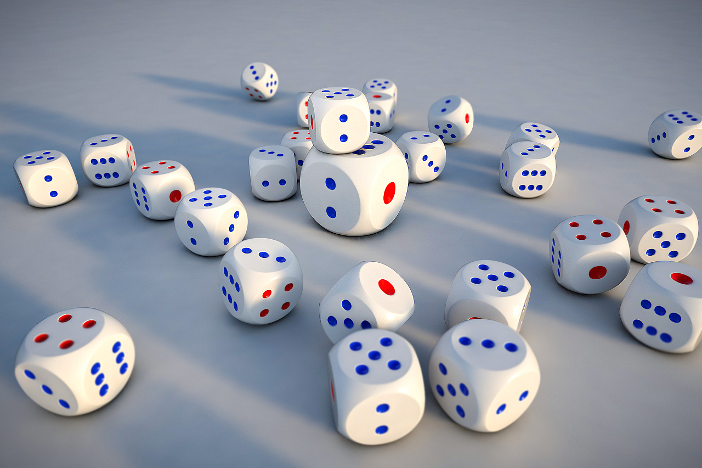

最初に、7セグメントディスプレイの操作を学び、数字をステップバイステップで表示させる方法を習得します。その後、電子ダイスを作成します！ボタンを押すだけで、7セグメントディスプレイに1から6までのランダムな数字が表示され、伝統的なダイスにデジタルのひねりを加えます。

.. raw:: html

    <video muted controls style = "max-width:90%">
        <source src="_static/video/26_cycle_dice.mp4" type="video/mp4">
        Your browser does not support the video tag.
    </video>

このレッスンでは、次のことを学びます:

* 7セグメントディスプレイの動作原理とその操作方法
* コードロジックを簡素化するためのswitch-case文の使用方法
* 状態が変わるまで現在の状態を維持するためのwhileループの利用方法
* サイバーダイスプロジェクトを構築し、シンプルな電子機器とインタラクティブなプログラミングを統合して実際の応用を行う方法

サイコロの起源
-----------------------

サイコロは、世界で最も古いギャンブルツールの一つであり、紀元前数千年に遡る歴史を持っています。サイコロは紀元前3000年頃に古代エジプトで起源を持ち、通常は骨や象牙、その他の天然素材で作られていました。これらの初期のサイコロは、形状が不規則であり、完全に対称ではないこともありました。

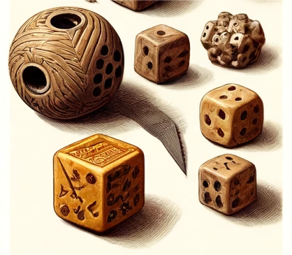

サイコロは、同時期の古代メソポタミア（現代のイラク）でも発見されています。古代の占い師や宗教指導者は、サイコロを使って決定を下したり、未来を予測したりしており、宗教的および神秘的な儀式において重要な役割を果たしていました。

時が経つにつれて、サイコロの形状や製造技術は標準化されました。紀元前1世紀までには、サイコロはローマ帝国で広く使用され、ギャンブルだけでなく、社会的および娯楽目的でも使用されていました。

アジア、特にインドでは、古代叙事詩「マハーバーラタ」にサイコロの使用が記録されており、物語の中で重要な役割を果たすサイコロゲームが描かれています。

ルネサンス期には、サイコロの生産はより洗練され、材料も木材、骨、象牙、さらには金属など多岐にわたりました。今日では、サイコロは娯楽やギャンブルの道具にとどまらず、教育や意思決定の支援、さまざまなテーブルトップゲームでも使用されています。その歴史と多様性は、人類の文化と技術の進化を反映しており、偶然と運の探求の窓を提供するものです。

.. _learn_7segment:

7セグメントディスプレイの学習
-------------------------------------------

1. 7セグメントディスプレイを見つけましょう。

7セグメントディスプレイは、7つのLEDがパッケージされた8の字型のコンポーネントです。ディスプレイ内の各LEDは、それぞれの位置に対応するセグメントとして配置されており、矩形のプラスチックパッケージからその接続ピンが引き出されています。これらのLEDピンは、「a」から「g」までラベル付けされており、各LEDを表しています。
他のLEDピンは共通のピンに接続されており、追加の8番目のLEDは同じパッケージ内で使用され、複数の7セグメントディスプレイが接続されて10以上の数字を表示できるようにすることで、小数点（DP）の表示を可能にしています。

.. image:: img/23_7_segment.png
    :width: 300
    :align: center

ディスプレイの共通ピンは、そのタイプを示しています。ピン接続には、カソードが接続されているものと、アノードが接続されているものの2種類があり、それぞれ共通カソード（CC）と共通アノード（CA）を意味します。名前の通り、CCディスプレイは7つのLEDすべてのカソードが接続されており、CAディスプレイは7セグメントすべてのアノードが接続されています。

.. note::

    通常、7セグメントディスプレイの側面にはxxxAxまたはxxxBxのラベルが付いています。一般的に、xxxAxは共通カソードを、xxxBxは共通アノードを表します。私たちのキットに含まれているディスプレイは共通カソードタイプです。

.. image:: img/23_segment_cathode_1.png
    :align: center
    :width: 600

7セグメントディスプレイが共通カソードか共通アノードかを判断するには、マルチメーターを使用することができます。また、ディスプレイの各セグメントが正常に動作しているかどうかをテストするためにも、以下のようにマルチメーターを使用できます。

1. マルチメーターをダイオードテストモードに設定します。ダイオードテストは、ダイオードや類似の半導体デバイス（LEDなど）の順方向導通をチェックするために使用されるマルチメーターの機能です。マルチメーターは、ダイオードに微小な電流を流します。ダイオードが正常であれば、電流が流れます。

.. image:: img/multimeter_diode.png
    :width: 300
    :align: center

2. 7セグメントディスプレイをブレッドボードに挿入し、小数点が右下にあることを確認し、中間のギャップをまたがるように配置します。ディスプレイのピン1と同じ行にワイヤーを挿入し、マルチメーターの赤いリードで接触させます。ディスプレイの任意の「-」ピンと同じ行にもう一方のワイヤーを挿入し、黒いリードで接触させます。

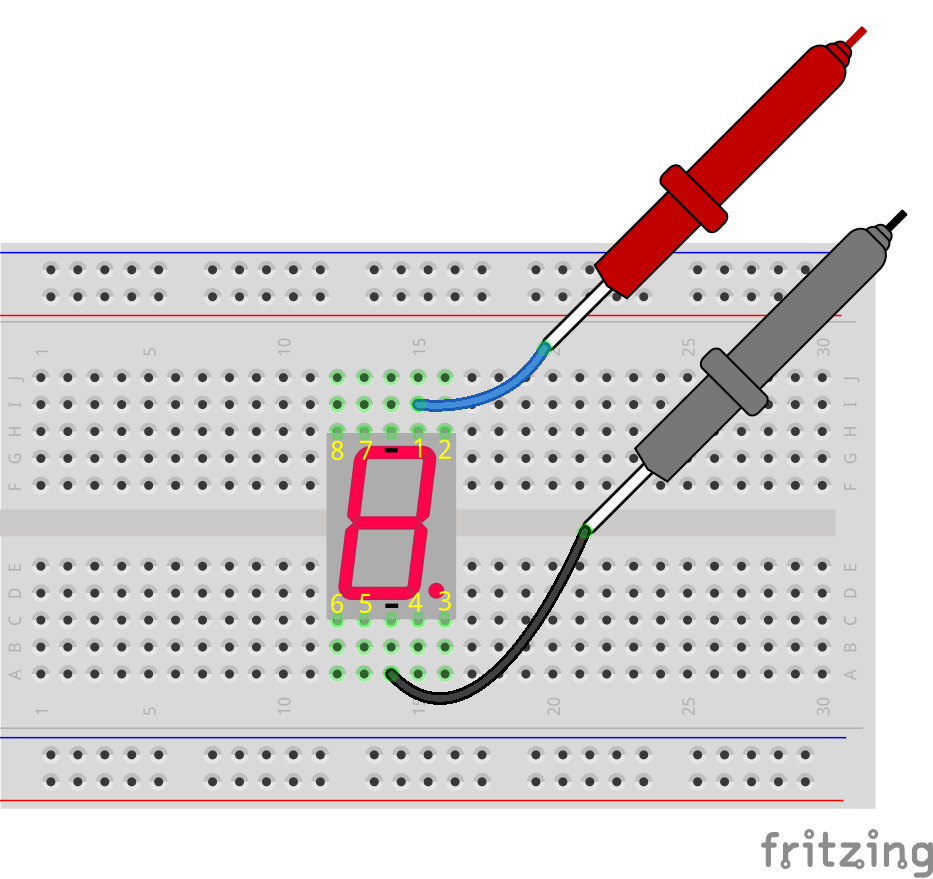

3. いずれかのLEDセグメントが点灯するかどうかを確認します。点灯すれば、そのディスプレイは共通カソードであることを示しています。点灯しない場合は、赤と黒のリードを入れ替えてください。入れ替えた後にセグメントが点灯する場合は、そのディスプレイは共通アノードであることを示しています。

4. セグメントが点灯した場合、この図を参照してセグメントのピン番号とハンドブックのテーブル内での位置を記録してください。

.. image:: img/23_segment_2.png
    :align: center

.. list-table::
    :widths: 20 20 40
    :header-rows: 1

    *   - ピン
        - セグメント番号
        - 位置
    *   - 1
        - a
        - 上部セグメント
    *   - 2
        -
        - 
    *   - 3
        -
        - 
    *   - 4
        -
        - 
    *   - 5
        -
        - 
    *   - 6
        -
        - 
    *   - 7
        -
        - 
    *   - 8
        -
        -     

5. 上記の手順を繰り返し、黒いリードを「-」ピンに保持しながら、赤いリードを他のピンに接続して、ディスプレイのLEDセグメントに対応する制御ピンを特定します。

**質問**

上記のテストから、キットに含まれているディスプレイは共通カソードであることが判明しました。つまり、共通ピンをGNDに接続し、他のピンに高電圧を供給するだけで対応するセグメントを点灯させることができます。ディスプレイに数字の2を表示させたい場合、どのピンに高電圧を供給すべきでしょうか？その理由も説明してください。

.. image:: img/23_segment_2.png
    :align: center

回路の構築
--------------------------------

**必要なコンポーネント**

.. list-table:: 
   :widths: 25 25 25 25
   :header-rows: 0

   * - 1 * Arduino Uno R3
     - 1 * 7セグメントディスプレイ
     - 1 * 220Ω抵抗
     - 1 * 10KΩ抵抗
   * - |list_uno_r3| 
     - |list_7segment| 
     - |list_220ohm| 
     - |list_10kohm| 
   * - 1 * ボタン
     - 1 * ブレッドボード
     - ジャンパーワイヤー
     - 1 * USBケーブル
   * - |list_button| 
     - |list_breadboard| 
     - |list_wire| 
     - |list_usb_cable| 
   * - 1 * マルチメーター
     - 
     - 
     - 
   * - |list_meter| 
     - 
     - 
     - 

**ステップバイステップの構築**

配線図または以下の手順に従って、回路を構築します。

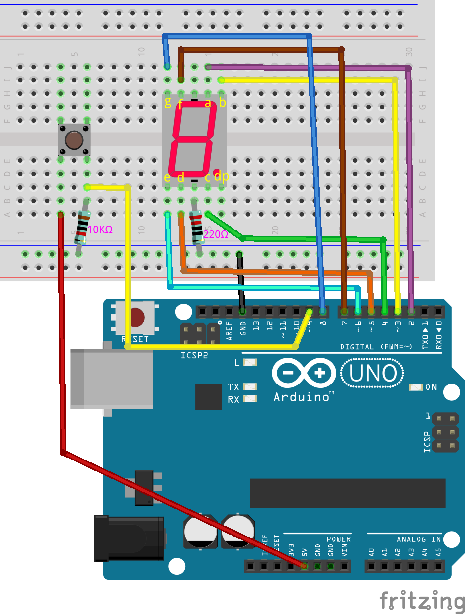

1. 7セグメントディスプレイをブレッドボードに挿入し、小数点が右下にあることを確認します。

2. 220Ωの抵抗の一端を7セグメントディスプレイの負極（「-」）端子に接続し、もう一端をブレッドボードの負電源レールに接続します。次に、ブレッドボードの負電源レールをジャンパーワイヤーでArduino Uno R3のGNDピンに接続します。

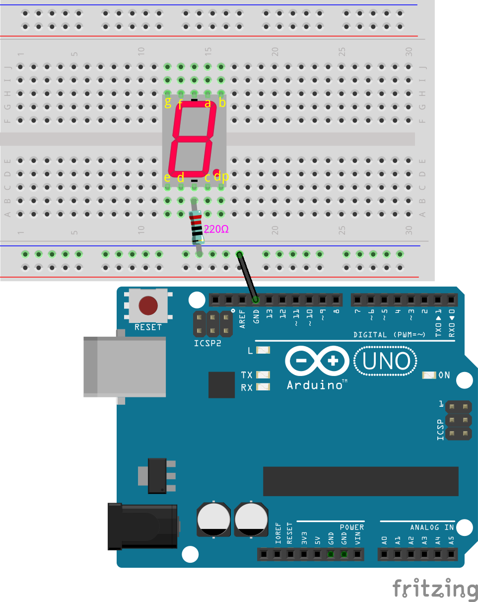

3. LEDのa、b、cセグメントを制御するピンをArduino Uno R3のピン2、3、4に接続します。

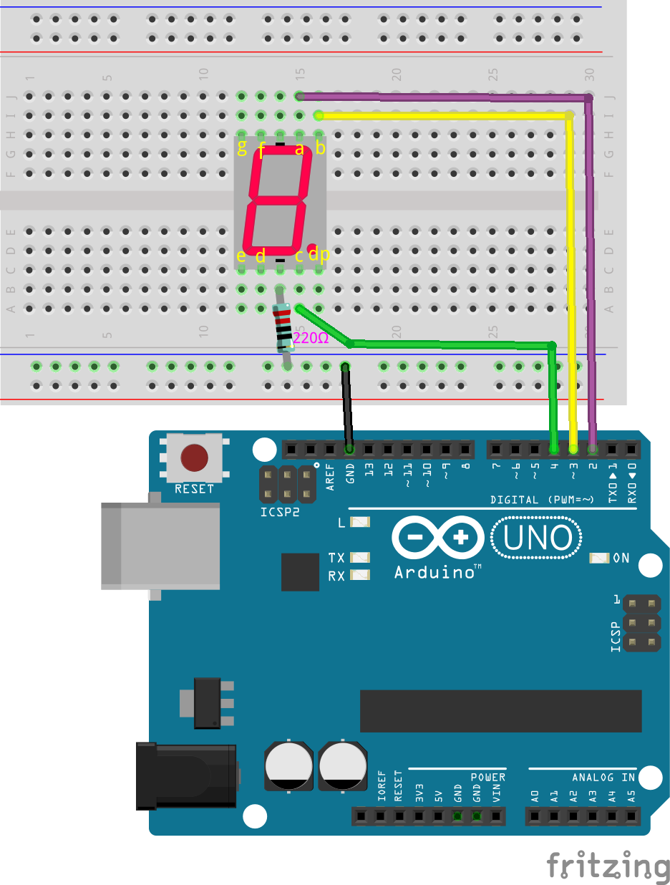

4. LEDのd、e、f、gセグメントを制御するピンをArduino Uno R3のピン5、6、7、8に接続します。

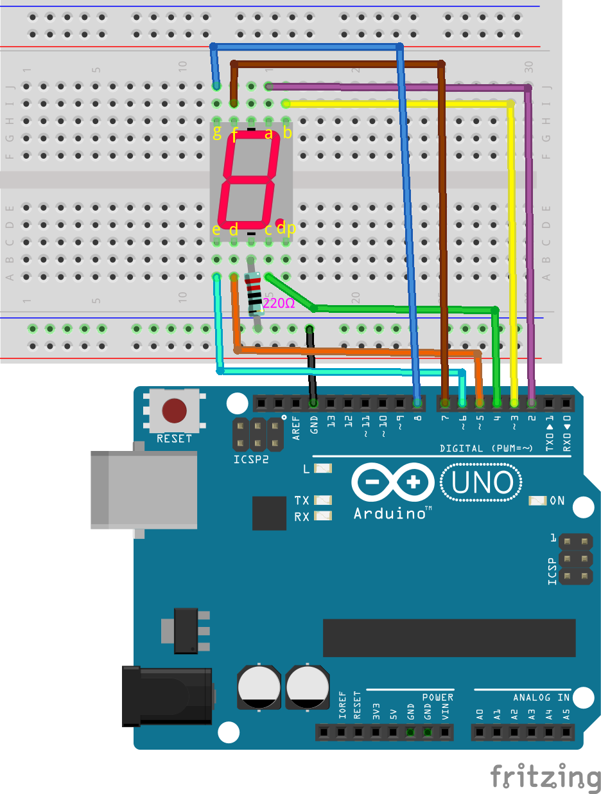

5. 次に、ブレッドボードにボタンを挿入します。

.. image:: img/23_segment_button.png
    :align: center
    :width: 500

6. ボタンの右下のピンをR3のピン9にワイヤーで接続します。

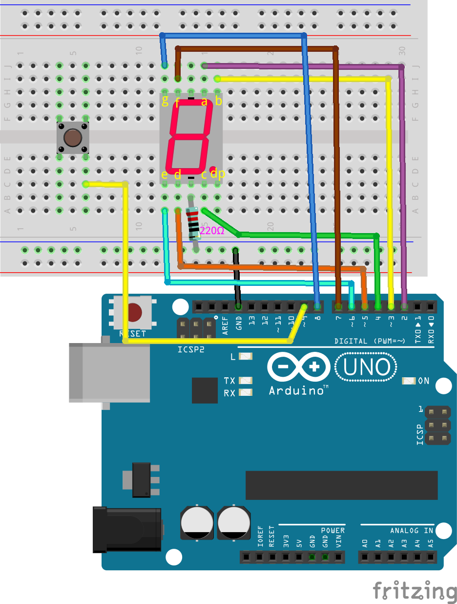

7. ボタンに10Kのプルダウン抵抗を接続し、ボタンが押されていないときにピン9が低電位を保ち、バウンスしないようにします。

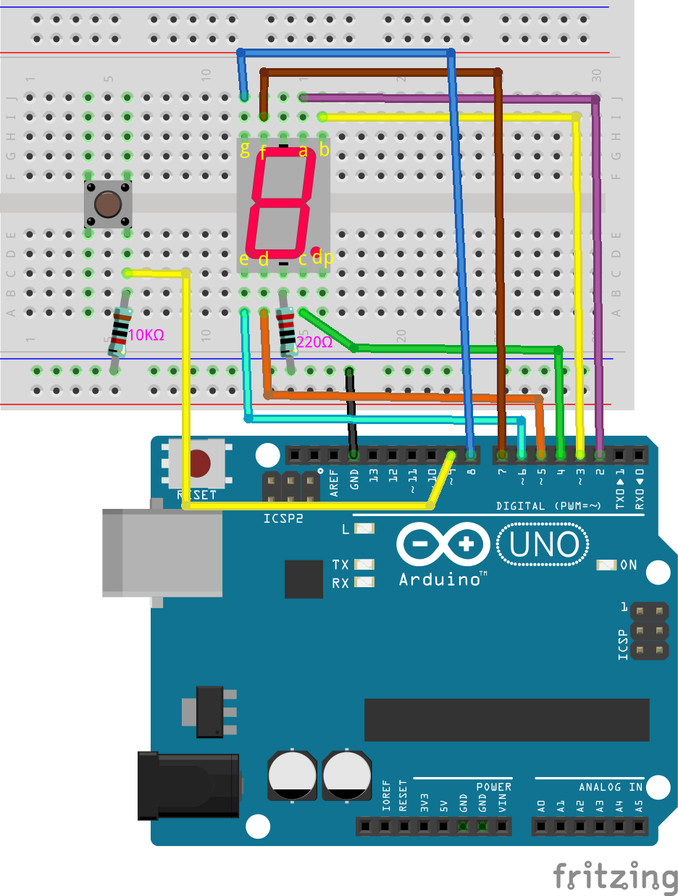

8. ボタンの左下のピンをArduino Uno R3の5Vに接続します。

.. list-table::
    :widths: 20 20
    :header-rows: 1

    *   - 7セグメントディスプレイ
        - Arduino UNO R3
    *   - a
        - 2
    *   - b
        - 3 
    *   - c
        - 4
    *   - d
        - 5
    *   - e
        - 6
    *   - f
        - 7
    *   - g
        - 8
        
コード作成 - 数字の表示
-------------------------------------
1. Arduino IDEを開き、「ファイル」メニューから「新しいスケッチ」を選択して新しいプロジェクトを開始します。
2. スケッチを ``Lesson26_Show_Number`` として保存します（ ``Ctrl + S`` または「保存」をクリック）。

3. 7セグメントディスプレイに接続されたピンを定義し、すべてのピンを出力として設定します。

.. code-block:: Arduino

    // 7セグメントディスプレイに接続されたピンを定義
    int pinA = 2;
    int pinB = 3;
    int pinC = 4;
    int pinD = 5;
    int pinE = 6;
    int pinF = 7;
    int pinG = 8;

    void setup() {
        // すべてのピンを出力として設定
        pinMode(pinA, OUTPUT);
        pinMode(pinB, OUTPUT);
        pinMode(pinC, OUTPUT);
        pinMode(pinD, OUTPUT);
        pinMode(pinE, OUTPUT);
        pinMode(pinF, OUTPUT);
        pinMode(pinG, OUTPUT);
    }

4. 次に、7セグメントディスプレイに数字「2」を表示するコードを書きます。数字「2」を表示するには、セグメントFとCをLOW（オフ）にし、他のセグメントをHIGH（オン）に設定します。

.. code-block:: Arduino
  :emphasize-lines: 22-29

    // Define pins connected to the 7-segment display
    int pinA = 2;
    int pinB = 3;
    int pinC = 4;
    int pinD = 5;
    int pinE = 6;
    int pinF = 7;
    int pinG = 8;

    void setup() {
        // Set all pins as outputs
        pinMode(pinA, OUTPUT);
        pinMode(pinB, OUTPUT);
        pinMode(pinC, OUTPUT);
        pinMode(pinD, OUTPUT);
        pinMode(pinE, OUTPUT);
        pinMode(pinF, OUTPUT);
        pinMode(pinG, OUTPUT);
    }

    void loop() {
        // Set segments F and C to LOW (off), other segments to HIGH (on)
        digitalWrite(pinA, HIGH);
        digitalWrite(pinB, HIGH);
        digitalWrite(pinC, LOW);
        digitalWrite(pinD, HIGH);
        digitalWrite(pinE, HIGH);
        digitalWrite(pinF, LOW);
        digitalWrite(pinG, HIGH);
    }

5. これでコードをArduino Uno R3にアップロードすると、7セグメントディスプレイに「2」が表示されるのを確認できます。

6. もし他の数字（例：1から6までを順に表示）を表示する場合、 ``digitalWrite()`` を使って各セグメントを設定するコードは非常に長くなり、論理が不明瞭になる可能性があります。ここでは、関数を作成する方法を使用します。

7. パラメータ付きの関数 ``displayDigit()`` を作成し、最初に7セグメントディスプレイのすべてのLEDセグメントをオフにします。

.. code-block:: Arduino

    void displayDigit(int digit) {
        // Turn off all segments
        digitalWrite(pinA, LOW);
        digitalWrite(pinB, LOW);
        digitalWrite(pinC, LOW);
        digitalWrite(pinD, LOW);
        digitalWrite(pinE, LOW);
        digitalWrite(pinF, LOW);
        digitalWrite(pinG, LOW);
    }

8. 次に、異なるLEDセグメントを制御して数字を表示します。ここでは ``if-else`` ステートメントを使用することもできますが、それでは手間がかかります。したがって、 ``switch`` ステートメントを使用することで、複数の ``if-else`` ステートメントよりも、複数の異なる動作を選択するためのより明確で整理された方法を提供します。

プログラミングにおいて、 ``switch`` ステートメントは、変数の値に基づいて異なるコードセグメントを実行するために使用される制御構造です。

``switch`` ステートメントの基本的な構文は通常次のとおりです：

.. code-block:: Arduino

    switch (expression) {
        case value1:
            // code
            break;
        case value2:
            // code
            break;
        default:
            // code
    }

* ``expression``: 通常、整数または文字を返す式であり、この結果に基づいて ``switch`` 文がどの ``case`` を実行するかを決定します。
* ``case``: ``case`` キーワードの後には、 ``expression`` の結果と一致する値が続きます。一致した場合、その地点から ``break`` 文に達するまでのコードが実行されます。
* ``break``: ``break`` 文は ``switch`` ブロックから抜け出すために使用されます。 ``break`` がないと、プログラムは一致の有無に関係なく次の ``case`` のコードを実行し続けることになり、これを「フォールスルー」と呼びます。
* ``default``: ``default`` はオプションであり、どの ``case`` も一致しなかった場合に実行されます。これは ``if-else`` 構造の ``else`` に似ています。

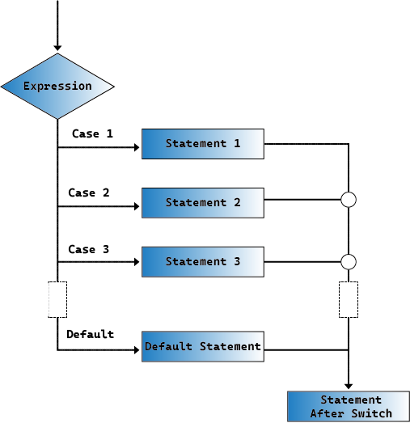

9. ``displayDigit()`` 関数内で ``switch-case`` を使用して、7セグメントディスプレイに数字を表示します。例えば、1を表示するには、BおよびCセグメントのみをHIGHにし、2を表示するにはFおよびCセグメントをLOWにし、他のセグメントをHIGHにします。

.. code-block:: Arduino

    void displayDigit(int digit) {
        // Turn off all segments
        digitalWrite(pinA, LOW);
        digitalWrite(pinB, LOW);
        digitalWrite(pinC, LOW);
        digitalWrite(pinD, LOW);
        digitalWrite(pinE, LOW);
        digitalWrite(pinF, LOW);
        digitalWrite(pinG, LOW);

        // Set to HIGH to turn on the segments needed for the desired number
        switch (digit) {
            case 1:
                digitalWrite(pinB, HIGH);
                digitalWrite(pinC, HIGH);
                break;
            case 2:
                digitalWrite(pinA, HIGH);
                digitalWrite(pinB, HIGH);
                digitalWrite(pinD, HIGH);
                digitalWrite(pinE, HIGH);
                digitalWrite(pinG, HIGH);
                break;
            case 3:
                digitalWrite(pinA, HIGH);
                digitalWrite(pinB, HIGH);
                digitalWrite(pinC, HIGH);
                digitalWrite(pinD, HIGH);
                digitalWrite(pinG, HIGH);
                break;
            case 4:
                digitalWrite(pinB, HIGH);
                digitalWrite(pinC, HIGH);
                digitalWrite(pinF, HIGH);
                digitalWrite(pinG, HIGH);
                break;
            case 5:
                digitalWrite(pinA, HIGH);
                digitalWrite(pinC, HIGH);
                digitalWrite(pinD, HIGH);
                digitalWrite(pinF, HIGH);
                digitalWrite(pinG, HIGH);
                break;
            case 6:
                digitalWrite(pinA, HIGH);
                digitalWrite(pinC, HIGH);
                digitalWrite(pinD, HIGH);
                digitalWrite(pinE, HIGH);
                digitalWrite(pinF, HIGH);
                digitalWrite(pinG, HIGH);
                break;
        }
    }

10. ``void loop()``内で ``displayDigit()`` を呼び出して特定の数字を表示します。例えば、3と6を1秒間隔で交互に表示します。

.. code-block:: Arduino

    void loop() {

        displayDigit(3);  // Display the 3 on the 7-segment display
        delay(1000);
        displayDigit(6);  // Display the 6 on the 7-segment display
        delay(1000);
    }

11. 以下が完成したコードです。これをArduino Uno R3にアップロードすると、7セグメントディスプレイが3と6を交互に表示するのを確認できます。

.. code-block:: Arduino

    // 7セグメントディスプレイに接続されたピンを定義
    int pinA = 2;
    int pinB = 3;
    int pinC = 4;
    int pinD = 5;
    int pinE = 6;
    int pinF = 7;
    int pinG = 8;

    void setup() {
        // Set all pins as outputs
        pinMode(pinA, OUTPUT);
        pinMode(pinB, OUTPUT);
        pinMode(pinC, OUTPUT);
        pinMode(pinD, OUTPUT);
        pinMode(pinE, OUTPUT);
        pinMode(pinF, OUTPUT);
        pinMode(pinG, OUTPUT);
    }

    void loop() {

        displayDigit(3);  // Display the 3 on the 7-segment display
        delay(1000);
        displayDigit(6);  // Display the 6 on the 7-segment display
        delay(1000);
    }

    void displayDigit(int digit) {
        // Turn off all segments
        digitalWrite(pinA, LOW);
        digitalWrite(pinB, LOW);
        digitalWrite(pinC, LOW);
        digitalWrite(pinD, LOW);
        digitalWrite(pinE, LOW);
        digitalWrite(pinF, LOW);
        digitalWrite(pinG, LOW);

        // Turn on the segments needed for the desired number (HIGH turns on the segments for common cathode)
        switch (digit) {
            case 1:
                digitalWrite(pinB, HIGH);
                digitalWrite(pinC, HIGH);
                break;
            case 2:
                digitalWrite(pinA, HIGH);
                digitalWrite(pinB, HIGH);
                digitalWrite(pinD, HIGH);
                digitalWrite(pinE, HIGH);
                digitalWrite(pinG, HIGH);
                break;
            case 3:
                digitalWrite(pinA, HIGH);
                digitalWrite(pinB, HIGH);
                digitalWrite(pinC, HIGH);
                digitalWrite(pinD, HIGH);
                digitalWrite(pinG, HIGH);
                break;
            case 4:
                digitalWrite(pinB, HIGH);
                digitalWrite(pinC, HIGH);
                digitalWrite(pinF, HIGH);
                digitalWrite(pinG, HIGH);
                break;
            case 5:
                digitalWrite(pinA, HIGH);
                digitalWrite(pinC, HIGH);
                digitalWrite(pinD, HIGH);
                digitalWrite(pinF, HIGH);
                digitalWrite(pinG, HIGH);
                break;
            case 6:
                digitalWrite(pinA, HIGH);
                digitalWrite(pinC, HIGH);
                digitalWrite(pinD, HIGH);
                digitalWrite(pinE, HIGH);
                digitalWrite(pinF, HIGH);
                digitalWrite(pinG, HIGH);
                break;
        }
    }

コード作成 - サイバーダイス
-------------------------------------
7セグメントディスプレイに1から6の数字を表示する方法がわかったところで、どうやってサイバーダイスの効果を実現するのでしょうか？

これには、ボタンを押してディスプレイに1から6までの数字を順番に表示させ、ボタンを離すと表示が固定されるようにする必要があります。それでは、コードでどうやって実現できるか見てみましょう。
 
1. 以前保存したスケッチ「 ``Lesson26_Show_Number`` 」を開きます。「ファイル」メニューから「名前を付けて保存」を選び、「 ``Lesson26_Cyber_Dice`` 」に名前を変更します。「保存」をクリックします。

2. ボタンのピンを定義し、それを入力として設定します。

.. code-block:: Arduino
    :emphasize-lines: 10-11,23-24

    // Define the pins connected to the segments of the 7-segment display
    int pinA = 2;
    int pinB = 3;
    int pinC = 4;
    int pinD = 5;
    int pinE = 6;
    int pinF = 7;
    int pinG = 8;

    // Define the pin connected to the button
    int buttonPin = 9;

    void setup() {
        // Set all pins as outputs
        pinMode(pinA, OUTPUT);
        pinMode(pinB, OUTPUT);
        pinMode(pinC, OUTPUT);
        pinMode(pinD, OUTPUT);
        pinMode(pinE, OUTPUT);
        pinMode(pinF, OUTPUT);
        pinMode(pinG, OUTPUT);

        // Set the button pin as an input
        pinMode(buttonPin, INPUT);
    }

3. ``void loop()`` 関数が実行されるときに、ボタンが押されているかどうかを確認します。ボタンが押されていない場合、 ``if`` ブロック内のコードはスキップされます。

.. code-block:: Arduino
    :emphasize-lines: 3,4

    void loop() {
        // Check if the button is pressed
        if (digitalRead(buttonPin) == HIGH) {
        }
    }

4. Arduinoや類似のマイクロコントローラプログラミングでは、ボタン入力を扱う際、特にイベントやコマンド（ランダム数の生成など）を生成するときに、各押下が一つのアクションを引き起こすようにすることが重要です。これを確実にするための技術として「待機解除」があります。

**待機解除**

この方法の核心は、ボタンが押されてアクションが実行された後、ボタンの状態を監視し続けて解除されるまでプログラムがループすることです。これにより、ボタンのバウンスやユーザーがボタンを押し続けることによる追加のアクションがトリガーされるのを防ぎます。

これをコード内の ``while`` ループで実装できます。

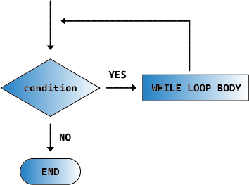

.. code-block:: Arduino
    :emphasize-lines: 4-6

    void loop() {
        // Check if the button is pressed
        if (digitalRead(buttonPin) == HIGH) {
            // Wait for the button to be released before continuing
            while (digitalRead(buttonPin) == HIGH) {
            }
        }
    }

5. 次に、 ``random()`` 関数を使って1から6の間でランダムな数値を生成し、 ``displayDigit()`` でこの数値を7セグメントディスプレイに表示します。ボタンが押されている間、ディスプレイが異なる数値を素早く切り替えて表示するのが見られます。

物理的な世界では、ランダム性は至るところにありますが、プログラミングでは「ランダム」な数値は通常、決定論的なアルゴリズムによって計算されます。このアルゴリズムには「シード」と呼ばれる開始点が必要であり、これによりこれらの数値は予測可能なものとなります。したがって、これらの数値は「擬似ランダム」と呼ばれます。「擬似」とは、これらの数値がランダムに見えるが、実際にはパターン化されていることを示しています。

興味深いことに、Arduino Uno R3では、実際の世界からの物理的測定値をシードとして使用することができます。マルチメータで測定する際、回路の電圧や電流の値がわずかに変動することに気付くかもしれません。この変動がランダム数に予測不可能性をもたらします。

Arduinoのランダム性の扱いにはいくつかの関数があります:

* ``randomSeed();`` : 乱数生成器のシード値を初期化します。この関数は、各プログラム実行時にランダム数列の開始点を変えることで、異なる数列を生成します。

    **引数**
        * ``seed`` : 乱数生成器を初期化するために使用される値。この符号なし長整数は、ランダム数列の開始点を設定します。
    **戻り値**
        なし。

* ``long random(long max);`` : 指定された範囲内でランダムな数値を生成します。

    **引数**
        ``max``: 乱数の上限（ ``max`` 自体は含まれません）。乱数は0（含む）から ``max-1`` （含む）までの範囲になります。
    
    **戻り値**
        0からmax-1までの範囲の長整数。

* ``long random(long min, long max);`` : 指定された範囲内でランダムな数値を生成します。

    **引数**
        ``min`` : 乱数の下限（含む）。
        ``max`` : 乱数の上限（ ``max`` 自体は含まれません）。乱数はmin（含む）からmax-1（含む）までの範囲になります。
    
    **戻り値**
        minからmax-1までの範囲の長整数。

.. code-block:: Arduino
    :emphasize-lines: 6-12

    void loop() {
        // Check if the button is pressed
        if (digitalRead(buttonPin) == HIGH) {
            // Wait for the button to be released before continuing
            while (digitalRead(buttonPin) == HIGH) {
                // Generate a random number between 1 and 6
                int num = random(1, 7);
                
                // Display the random number on the 7-segment display
                displayDigit(num);
                // Delay for a short period to allow visible display updates
                delay(100);
            }
        }
    }
    
6. 最後に、ボタンのデバウンス処理を追加し、複数回の急速な入力を防ぎます。

.. code-block:: Arduino
    :emphasize-lines: 15

    void loop() {
        // Check if the button is pressed
        if (digitalRead(buttonPin) == HIGH) {
            // Wait for the button to be released before continuing
            while (digitalRead(buttonPin) == HIGH) {
                // Generate a random number between 1 and 6
                int num = random(1, 7);
                
                // Display the random number on the 7-segment display
                displayDigit(num);
                // Delay for a short period to allow visible display updates
                delay(100);
            }
            // Add a delay to debounce the button and prevent multiple rapid inputs
            delay(500);
        }
    }

7. 完成したコードは以下のようになります。これをArduino Uno R3にアップロードすれば、ボタンを押している間、ディスプレイに数字が急速に変わり、ボタンを離すと数字が固定されます。

.. code-block:: Arduino

    // Define the pins connected to the segments of the 7-segment display
    int pinA = 2;
    int pinB = 3;
    int pinC = 4;
    int pinD = 5;
    int pinE = 6;
    int pinF = 7;
    int pinG = 8;

    // Define the pin connected to the button
    int buttonPin = 9;

    void setup() {
        // Set all pins as outputs
        pinMode(pinA, OUTPUT);
        pinMode(pinB, OUTPUT);
        pinMode(pinC, OUTPUT);
        pinMode(pinD, OUTPUT);
        pinMode(pinE, OUTPUT);
        pinMode(pinF, OUTPUT);
        pinMode(pinG, OUTPUT);

        // Set the button pin as an input
        pinMode(buttonPin, INPUT);
    }

    void loop() {
        // Check if the button is pressed
        if (digitalRead(buttonPin) == HIGH) {
            // Wait for the button to be released before continuing
            while (digitalRead(buttonPin) == HIGH) {
                // Generate a random number between 1 and 6
                int num = random(1, 7);

                // Display the random number on the 7-segment display
                displayDigit(num);
                // Delay for a short period to allow visible display updates
                delay(100);
            }
            // Add a delay to debounce the button and prevent multiple rapid inputs
            delay(500);
        }
    }

    void displayDigit(int digit) {
        // Turn off all segments
        digitalWrite(pinA, LOW);
        digitalWrite(pinB, LOW);
        digitalWrite(pinC, LOW);
        digitalWrite(pinD, LOW);
        digitalWrite(pinE, LOW);
        digitalWrite(pinF, LOW);
        digitalWrite(pinG, LOW);

        // Turn on the segments needed for the desired number (LOW turns on the segments for common cathode)
        switch (digit) {
            case 1:
            digitalWrite(pinB, HIGH);
            digitalWrite(pinC, HIGH);
            break;
            case 2:
            digitalWrite(pinA, HIGH);
            digitalWrite(pinB, HIGH);
            digitalWrite(pinD, HIGH);
            digitalWrite(pinE, HIGH);
            digitalWrite(pinG, HIGH);
            break;
            case 3:
            digitalWrite(pinA, HIGH);
            digitalWrite(pinB, HIGH);
            digitalWrite(pinC, HIGH);
            digitalWrite(pinD, HIGH);
            digitalWrite(pinG, HIGH);
            break;
            case 4:
            digitalWrite(pinB, HIGH);
            digitalWrite(pinC, HIGH);
            digitalWrite(pinF, HIGH);
            digitalWrite(pinG, HIGH);
            break;
            case 5:
            digitalWrite(pinA, HIGH);
            digitalWrite(pinC, HIGH);
            digitalWrite(pinD, HIGH);
            digitalWrite(pinF, HIGH);
            digitalWrite(pinG, HIGH);
            break;
            case 6:
            digitalWrite(pinA, HIGH);
            digitalWrite(pinC, HIGH);
            digitalWrite(pinD, HIGH);
            digitalWrite(pinE, HIGH);
            digitalWrite(pinF, HIGH);
            digitalWrite(pinG, HIGH);
            break;
        }
    }

8. 最後に、コードを保存し、作業スペースを整理することを忘れないでください。

**まとめ**

このレッスンでは、サイバーダイスプロジェクトを無事に完了し、友達と競って最高の数字を出す楽しさを体験できるようになりました。このレッスンを通じて、7セグメントディスプレイの動作を理解し、効率的に制御する方法を学びました。スイッチケースステートメントを使用してコードを簡略化し、可読性と効率を向上させました。

さらに、ボタンの押下状態に基づいて7セグメントディスプレイにランダムな数字を表示するロジックを実装し、プロジェクトに動的なインタラクションを追加しました。この実践的な経験により、基本的な電子部品とコーディング戦略に精通するだけでなく、これらのスキルを活用して魅力的でインタラクティブなプロジェクトを作成する方法も学びました。
