.. note::

    こんにちは、SunFounder Raspberry Pi & Arduino & ESP32 Enthusiasts Communityへようこそ！Facebookで、Raspberry Pi、Arduino、そしてESP32の愛好者たちと一緒に、より深い知識を探求しましょう。

    **なぜ参加するべきなのか？**

    - **エキスパートサポート**: コミュニティやチームの助けを借りて、販売後の問題や技術的な課題を解決しましょう。
    - **学びと共有**: スキルを向上させるためのヒントやチュートリアルを交換しましょう。
    - **限定プレビュー**: 新製品の発表や先行情報をいち早く入手しましょう。
    - **特別割引**: 最新の商品を特別割引で楽しめます。
    - **フェスティブプロモーションとギブアウェイ**: プレゼントやホリデープロモーションに参加しましょう。

    👉 私たちと一緒に探求と創造を始める準備はできましたか？[|link_sf_facebook|]をクリックして、今すぐ参加しましょう！

27. 74HC595を使った流れる光
=======================================

このレッスンでは、74HC595シフトレジスタチップの世界に踏み込みます。この強力なコンポーネントを使用することで、少数のピンで多数のLEDを制御できるため、流れる光のエフェクトを実装するのに最適です。レッスンの終わりまでに、74HC595の動作原理、バイナリデータをシフトする方法、そして実際のLED制御実験にどのように応用するかをしっかりと理解できるでしょう。

.. raw:: html

    <video muted controls style = "max-width:90%">
        <source src="_static/video/27_flowing_light.mp4" type="video/mp4">
        Your browser does not support the video tag.
    </video>

このレッスンでは、以下を学びます：

* 74HC595チップの動作原理とピンの機能を理解する
* ``shiftOut()`` 関数を使用してデータをシフトする方法を学ぶ
* 74HC595チップとArduinoを使用して流れる光の回路を構築する
* 74HC595チップとバイナリデータを使用して8つのLEDを制御し、流れる光のエフェクトを作り出す

74HC595チップを学ぶ
--------------------------
74HC595チップは、8ビットのシフトレジスタと、3状態のパラレル出力を持つストレージレジスタで構成されています。これはシリアル入力をパラレル出力に変換し、MCUのIOポートを節約することができます。

.. image:: img/24_74hc595.png
    :width: 300
    :align: center

**ピンの機能**

.. image:: img/24_74hc595_pin.png
    :width: 500
    :align: center

* **Q0-Q7**: 8ビットのパラレルデータ出力ピンで、直接8つのLEDや7セグメントディスプレイの8つのピンを制御できます。
* **Q7'**: シリーズ出力ピンで、他の74HC595のDSに接続し、複数の74HC595を直列に接続できます。
* **MR**: リセットピンで、低レベルで動作します。
* **SHcp**: シフトレジスタのタイムシーケンス入力。立ち上がりエッジで、シフトレジスタのデータが順次1ビットずつ移動します。つまり、Q1のデータがQ2に移動し、それが繰り返されます。立ち下がりエッジでは、シフトレジスタのデータは変わりません。
* **STcp**: ストレージレジスタのタイムシーケンス入力。立ち上がりエッジで、シフトレジスタのデータがメモリレジスタに移動します。
* **CE**: 出力イネーブルピンで、低レベルで動作します。
* **DS**: シリアルデータ入力ピン
* **VCC**: 正電源
* **GND**: グラウンド

**動作原理**

MR（ピン10）が高レベルで、OE（ピン13）が低レベルのとき、
データはSHcpの立ち上がりエッジで入力され、STcpの立ち上がりエッジを通じてストレージレジスタに移動します。

* シフトレジスタ

    * 例えば、74HC595のシフトレジスタに1110 1110というバイナリデータを入力したいとします。
    * データはシフトレジスタのビット0から入力されます。
    * シフトレジスタクロックが立ち上がりエッジになるたびに、シフトレジスタ内のビットが1ステップずつ移動します。たとえば、ビット7はビット6の以前の値を受け取り、ビット6はビット5の値を取得します。

.. image:: img/24_74hc595_shift.png
    :width: 600
    :align: center

* ストレージレジスタ

    * ストレージレジスタが立ち上がりエッジ状態になると、シフトレジスタのデータがストレージレジスタに転送されます。
    * ストレージレジスタは8つの出力ピンに直接接続されており、Q0〜Q7がバイトデータを受け取ることができます。
    * ストレージレジスタとは、データがこのレジスタ内に存在し、一度出力されたデータが消えないことを意味します。
    * 74HC595に電源が供給され続ける限り、データは有効で変更されることはありません。
    * 新しいデータが入ると、ストレージレジスタ内のデータが上書きされ、更新されます。

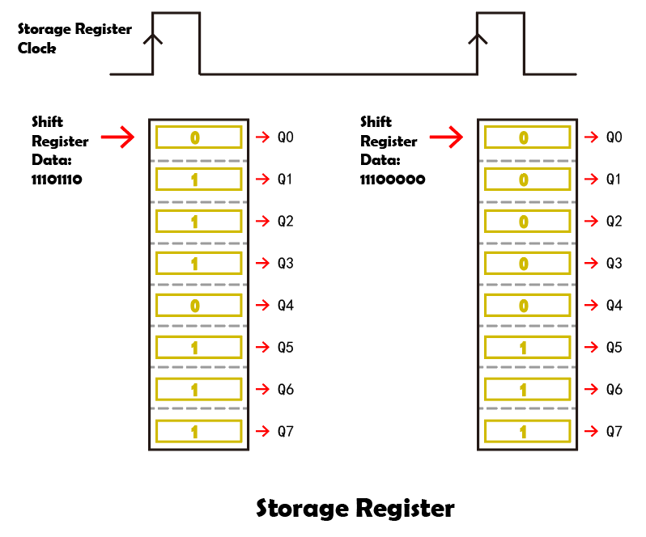

回路の構築
--------------------------------

**必要なコンポーネント**

.. list-table:: 
   :widths: 25 25 25 25
   :header-rows: 0

   * - 1 * Arduino Uno R3
     - 8 * LED
     - 8 * 220Ω抵抗
     - 1 * 74HC595
   * - |list_uno_r3| 
     - |list_red_led| 
     - |list_220ohm| 
     - |list_74hc595|  
   * - 1 * ブレッドボード
     - ジャンパーワイヤー
     - 1 * USBケーブル
     -
   * - |list_breadboard| 
     - |list_wire| 
     - |list_usb_cable| 
     -

**ステップバイステップの構築手順**

配線図に従うか、以下の手順に従って回路を構築してください。

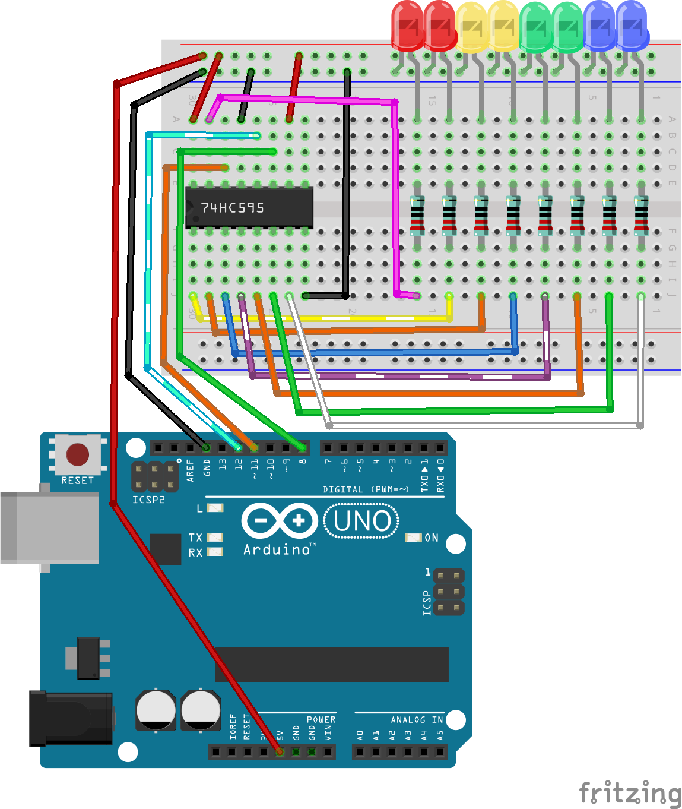

1. 8つのLEDをブレッドボードに挿入します。好きな色の構成にしてください。すべてのLEDのカソード（短い足）がブレッドボードのグランドレールに接続されていることを確認し、アノードは別々の行に接続します。

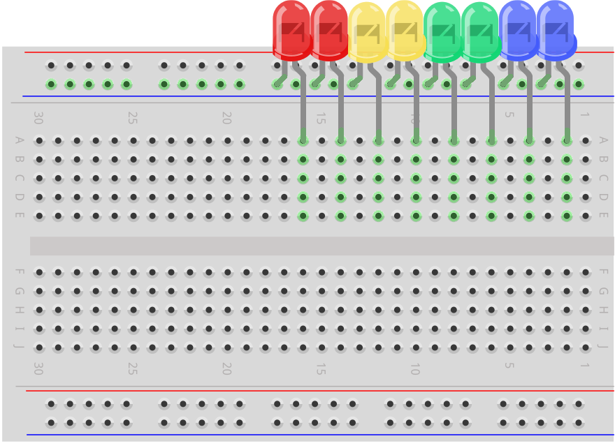

2. 各LEDのアノードに220Ω抵抗を接続します。

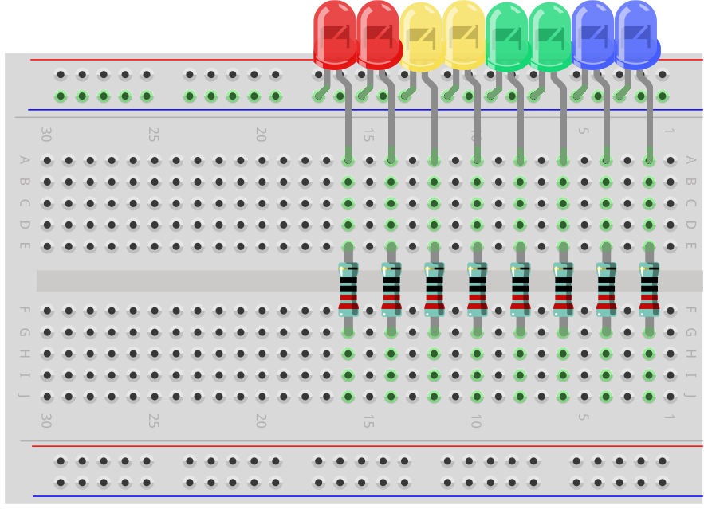

3. 74HC595チップを探し、ブレッドボードに挿入します。チップが中央のギャップを跨ぐように配置してください。

.. note::

    74HC595の向きに十分注意して、損傷を避けてください。以下の手がかりを使って正しい向きを確認できます。

    * チップのラベルが正しい向きであること。
    * チップのノッチが左側にあること。

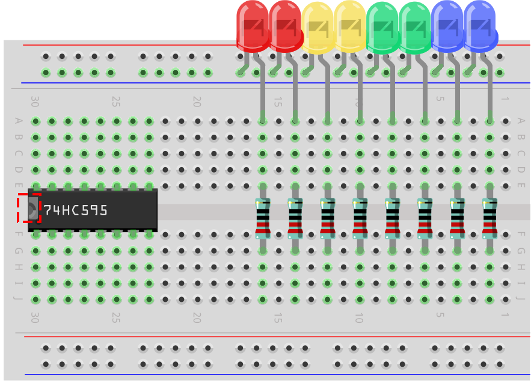

4. 74HC595のVCCとMRピンをブレッドボードの正電源レールに接続します。

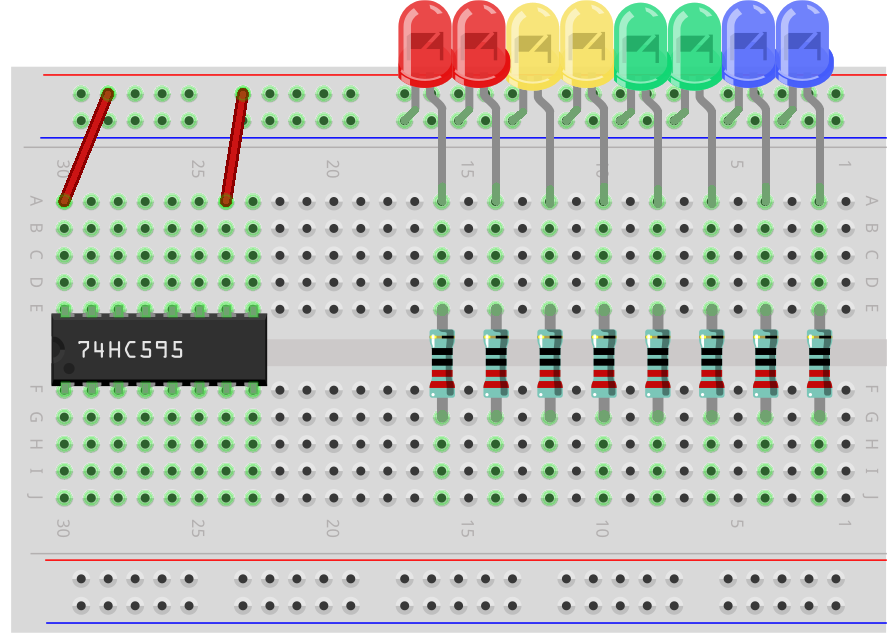

5. 74HC595のCEとGNDピンをブレッドボードの負電源レールに接続します。

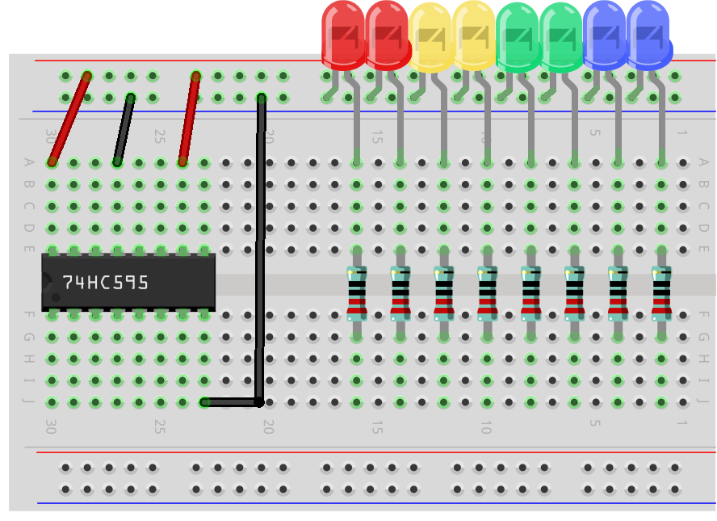

6. 74HC595のQ0-Q7ピンを、220Ω抵抗が含まれるブレッドボードの行に接続します。

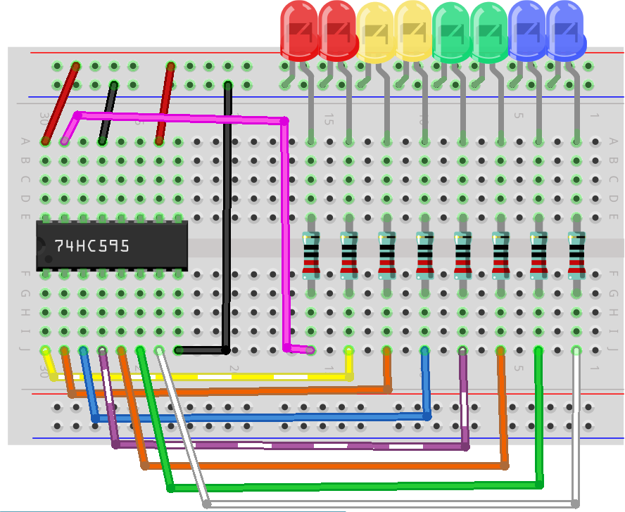

7. 74HC595のDSピンをArduino Uno R3のピン11に接続します。

.. image:: img/24_flow_light_pin11.png
    :width: 600
    :align: center

8. 74HC595のST_CPピンをArduino Uno R3のピン12に接続します。

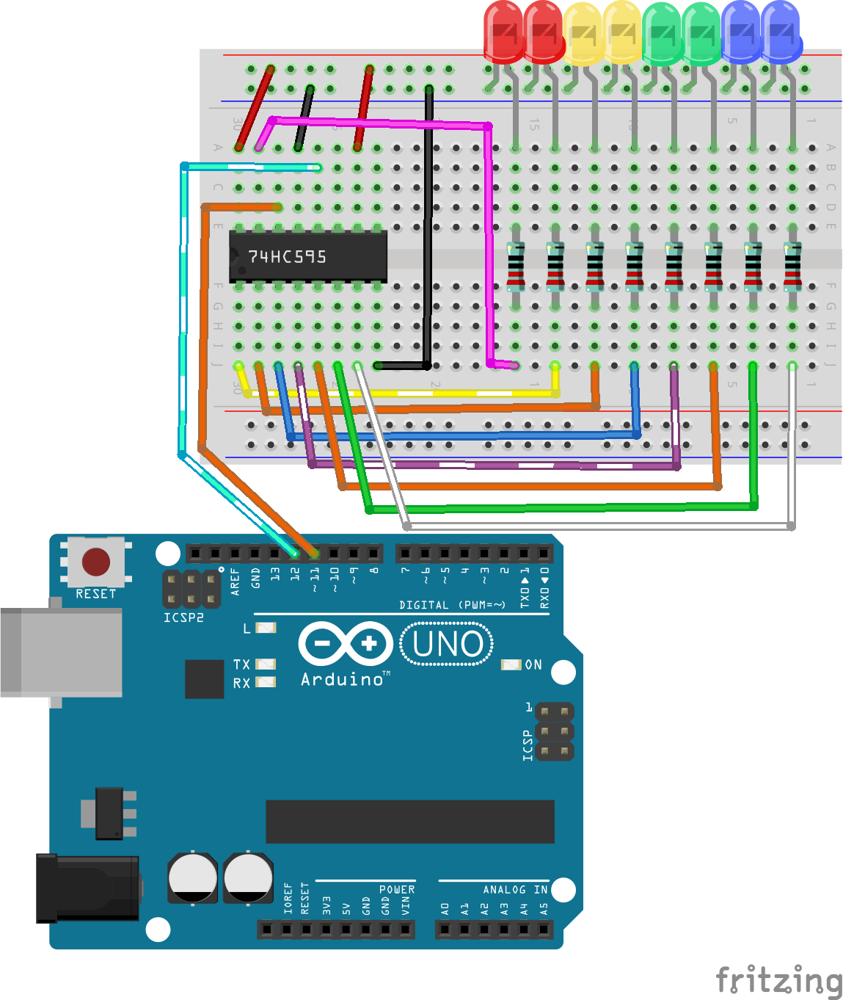

9. 74HC595のSh_CPピンをArduino Uno R3のピン8に接続します。

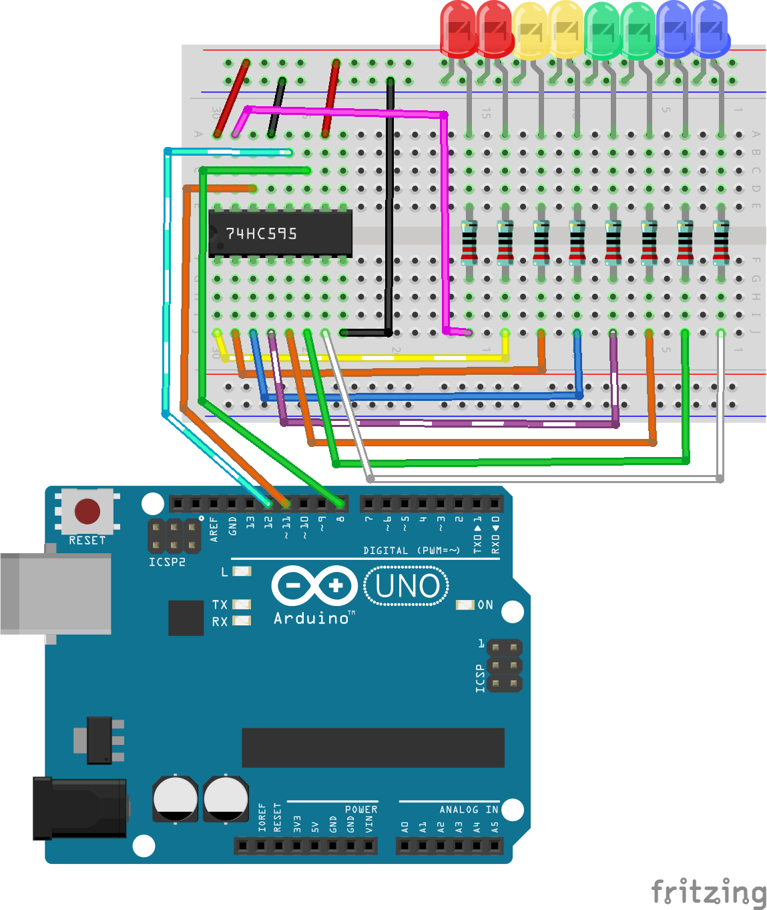

10. 最後に、Arduino Uno R3のGNDピンと5Vピンを、それぞれブレッドボードの負極と正極のレールに接続します。

11. 以下の表は、74HC595とArduino Uno R3のピン接続を示しています。

.. list-table::
    :widths: 20 20
    :header-rows: 1

    *   - 74HC595
        - Arduino UNO R3
    *   - VCC
        - 5V
    *   - Q0~Q7
        - LEDs 
    *   - DS
        - 11
    *   - CE
        - GND
    *   - ST_CP
        - 12
    *   - SH_CP
        - 8
    *   - MR
        - 5V
    *   - GND
        - GND

コード作成 - LEDを点灯させる
--------------------------------------------

Arduino Uno R3は、バイナリデータのグループを74HC595チップに送信します。
バイナリデータはコンピュータや多くの電子デバイスの中核を成しており、0と1の単純な組み合わせで複雑なデータや指示を処理します。
コンピュータサイエンスやデジタルエレクトロニクスでは、バイナリデータは情報処理や電子コンピュータでの記憶の基盤となる非常に重要なものです。
ここで、0と1はスイッチの状態として見なすことができ、0はオフ（閉じている）、1はオン（開いている）を表します。

バイナリ数について、2つの基本的な概念を理解する必要があります：

* ビット: ビットはバイナリシステムの基本単位で、各ビットは0または1で表されます。
* バイト: バイトは8ビットで構成されており、コンピュータでのデータ処理の一般的な単位です。（そして、74HC595チップは一度に1バイトのデータを受け入れることができます！）

バイナリ数は、最下位ビットから最上位ビットの順に配置され、右端のビットが最下位ビット、左端のビットが最上位ビットとなります。

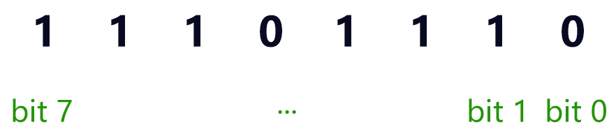

では、74HC595がどのようにしてバイナリデータを受け取り、それをLEDに出力するのかを見てみましょう！

1. Arduino IDEを開き、「ファイル」メニューから「新しいスケッチ」を選んで新しいプロジェクトを開始します。
2. スケッチを ``Lesson27_Lighting_up_LEDs`` という名前で保存し、「保存」または ``Ctrl + S`` をクリックします。

3. 74HC595を制御するには、パルス信号を提供するために3本のピンだけが必要なので、それらをOUTPUTに設定します。

.. code-block:: Arduino

    const int STcp = 12;  // Pin connected to ST_CP of 74HC595
    const int SHcp = 8;   // Pin connected to SH_CP of 74HC595
    const int DS = 11;    // Pin connected to DS of 74HC595

    void setup() {
        // Set pins to output mode
        pinMode(STcp, OUTPUT);
        pinMode(SHcp, OUTPUT);
        pinMode(DS, OUTPUT);
    }

4. コンピュータはバイナリデータを74HC595の ``DS`` （データ入力）ピンに送信し、その後 ``SH_CP`` （シフトレジスタクロック入力）ピンからのクロック信号を使用して各データビットを前方にシフトします。このデータ伝送プロセスは ``shiftOut()`` 関数を使用して実装できます。

    * ``shiftOut(dataPin, clockPin, bitOrder, value)`` : 1ビットずつデータをシフトアウトします。最も重要なビット（最左端）または最も重要でないビット（最右端）から開始します。各ビットは順にデータピンに書き込まれ、その後、クロックピンがパルス（ハイにした後ローにする）され、ビットが利用可能であることが示されます。

    **パラメータ**

        * ``dataPin`` : 各ビットを出力するピン。許容データ型: int.
        * ``clockPin`` : dataPinが正しい値に設定された後にトグルするピン。許容データ型: int.
        * ``bitOrder`` : ビットをシフトアウトする順序; ``MSBFIRST`` または ``LSBFIRST`` を指定します。（最も重要なビットを最初に、または最も重要でないビットを最初に）
        * ``value`` : シフトアウトするデータ。許容データ型: byte.

    **戻り値**
        なし

5. ここでは、 ``shiftOut()`` 関数を使用して、74HC595シフトレジスタに1バイト（8ビット）のデータを送信してみます。

.. code-block:: Arduino
    :emphasize-lines: 3

    void loop()
    {
        shiftOut(DS, SHcp, MSBFIRST, B11101110);  // Shift out the data, MSB first
    }

* これにより、 ``B11101110`` （バイナリ、Bはバイナリの略）というデータが74HC595シフトレジスタに送信され、データは最も重要なビットから送信されます。
* ``SH_CP`` ピンが立ち上がりエッジ信号を受信するたびに（電圧が低から高に変わる瞬間）、シフトレジスタ内のビットが1ステップシフトします。
* たとえば、ビット7はビット6の以前の値を受け取り、ビット6はビット5の値を取得します。

.. image:: img/24_74hc595_shift.png
    :width: 500
    :align: center

6. DSピンを通してすべてのデータビットが入力され、複数のクロック信号を使って正しい位置にシフトされた後、次のステップはシフトレジスタからストレージレジスタにこのデータをコピーすることです。

.. code-block:: Arduino
    :emphasize-lines: 2,7

    void loop() {
        digitalWrite(STcp, LOW);  // Ground ST_CP (Latch Pin) and hold low while transmitting data
        
        // Send data to the shift register using MSBFIRST (Most Significant Bit First)
        shiftOut(DS, SHcp, MSBFIRST, B11101110);
        
        digitalWrite(STcp, HIGH);  // Pull ST_CP (Latch Pin) high to save the data to output pins
        
        delay(1000);  // Wait for one second before repeating
    }

* ``ST_CP`` ピンが立ち上がりエッジ信号を受信すると、シフトレジスタ内のデータがストレージレジスタにコピーされます。
* データがストレージレジスタにコピーされると、対応する出力ピン（Q0 ~ Q7）に接続されたLEDが、データが1であれば点灯し、0であれば消灯します。

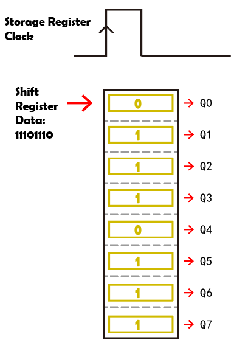

7. これが完全なコードです。このコードをArduino Uno R3にアップロードすると、Q0とQ4に接続されたLEDが消灯し、他のLEDが点灯するのが確認できます。

.. code-block:: Arduino

    const int STcp = 12;  // Pin connected to ST_CP of 74HC595
    const int SHcp = 8;   // Pin connected to SH_CP of 74HC595
    const int DS = 11;    // Pin connected to DS of 74HC595

    void setup() {
        // ピンを出力モードに設定
        pinMode(STcp, OUTPUT);
        pinMode(SHcp, OUTPUT);
        pinMode(DS, OUTPUT);
    }

    void loop() {
        digitalWrite(STcp, LOW);  // ST_CPをグランドに接続し、データ送信中はLOWを保持
        shiftOut(DS, SHcp, MSBFIRST, B11101110);  // データをシフトアウト、MSBを最初に
        digitalWrite(STcp, HIGH);  // ST_CPをHIGHにしてデータを保存
        delay(1000);  // 1秒待つ
    }

**質問**

``shiftOut(DS, SHcp, MSBFIRST, B11101110);`` の ``MSBFIRST`` を ``LSBFIRST`` に変更するとどうなりますか？その理由は何ですか？

コード作成 - 流れる光
--------------------------------

LEDが一つずつ順番に点灯する流れる光の効果を実装するにはどうすればいいでしょうか？

1. 先ほど保存したスケッチ「Lesson27_Lighting_up_LEDs」を開きます。「ファイル」メニューから「名前を付けて保存」を選択し、「Lesson27_Flowing_Light」に名前を変更します。「保存」をクリックします。

2. ここでは、LEDが一つずつ順番に点灯する流れる光を設定します。この流れる光のオン/オフ状態を配列として書き込みます。

.. code-block:: Arduino
    :emphasize-lines: 4

    const int STcp = 12;  // Pin connected to ST_CP of 74HC595
    const int SHcp = 8;   // Pin connected to SH_CP of 74HC595
    const int DS = 11;    // Pin connected to DS of 74HC595
    int datArray[] = {B00000000, B00000001, B00000011, B00000111, B00001111, B00011111, B00111111, B01111111, B11111111};

3. 次に、 ``for`` ループを使用して、この配列を順番に呼び出します。

.. code-block:: Arduino
    :emphasize-lines: 3,5

    void loop()
    {
        for (int num = 0; num <= 8; num++) {
            digitalWrite(STcp, LOW);                      // Ground ST_CP and hold low while transmitting
            shiftOut(DS, SHcp, MSBFIRST, datArray[num]);  // Shift out the data, MSB first
            digitalWrite(STcp, HIGH);                     // Pull ST_CP high to save the data
            delay(1000);                                  // Wait for a second
        }
    }

4. 以下が完全なコードです。このコードをArduino Uno R3にアップロードすると、LEDが一つずつ順番に点灯し、流れる光のように見えます。

.. code-block:: Arduino

    const int STcp = 12;  // Pin connected to ST_CP of 74HC595
    const int SHcp = 8;   // Pin connected to SH_CP of 74HC595
    const int DS = 11;    // Pin connected to DS of 74HC595
    int datArray[] = {B00000000, B00000001, B00000011, B00000111, B00001111, B00011111, B00111111, B01111111, B11111111};

    void setup ()
    {
        // Set pins to output mode
        pinMode(STcp, OUTPUT);
        pinMode(SHcp, OUTPUT);
        pinMode(DS, OUTPUT);
    }

    void loop()
    {
        for (int num = 0; num <= 8; num++) {
            digitalWrite(STcp, LOW);                      // Ground ST_CP and hold low while transmitting
            shiftOut(DS, SHcp, MSBFIRST, datArray[num]);  // Shift out the data, MSB first
            digitalWrite(STcp, HIGH);                     // Pull ST_CP high to save the data
            delay(1000);                                  // Wait for a second
        }
    }

5. 最後に、コードを保存し、作業スペースを整理することを忘れないでください。

**質問**

3つのLEDが同時に点灯し、それらが「流れる」ように見せたい場合、 ``datArray[]`` 配列の要素はどのように変更すればよいですか？

**まとめ**

このレッスンでは、74HC595チップの構造と機能について探求し、そのシフトレジスタを通じてバイナリデータをシフトし、流れる光の実験を行う方法を学びました。 ``shiftOut()`` 関数を使用してバイナリデータの送信を制御し、8つのLEDを順番に点灯させることで流れる光の効果を実現しました。この新たに得た知識を活用して、74HC595チップを使用し、自分のプロジェクトに華やかな照明機能を追加することができるでしょう。

