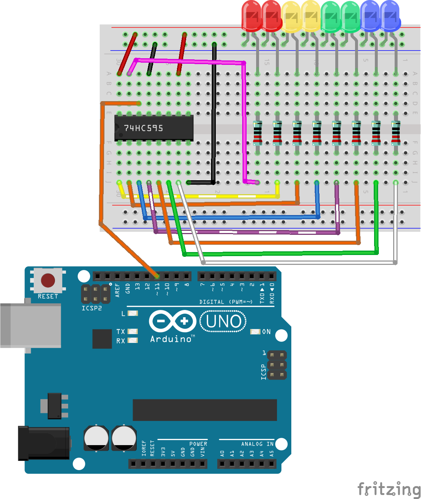

.. note::

    Hallo, willkommen in der SunFounder Raspberry Pi & Arduino & ESP32 Enthusiasten-Community auf Facebook! Tauchen Sie gemeinsam mit anderen Enthusiasten tiefer in die Welt von Raspberry Pi, Arduino und ESP32 ein.

    **Warum sollten Sie beitreten?**

    - **Expertenunterstützung**: Lösen Sie nach dem Kauf auftretende Probleme und technische Herausforderungen mit Hilfe unserer Community und unseres Teams.
    - **Lernen & Teilen**: Tauschen Sie Tipps und Tutorials aus, um Ihre Fähigkeiten zu verbessern.
    - **Exklusive Einblicke**: Erhalten Sie frühzeitig Zugriff auf neue Produktankündigungen und exklusive Vorschauen.
    - **Spezielle Rabatte**: Genießen Sie exklusive Rabatte auf unsere neuesten Produkte.
    - **Festliche Aktionen und Verlosungen**: Nehmen Sie an Verlosungen und festlichen Aktionen teil.

    👉 Bereit, mit uns zu erkunden und zu erschaffen? Klicken Sie auf [|link_sf_facebook|] und treten Sie noch heute bei!

27. Lauflicht mit dem 74HC595
=======================================

In dieser Lektion werden wir uns mit dem 74HC595-Schieberegister-Chip beschäftigen. Dieser leistungsstarke Baustein ermöglicht es uns, zahlreiche LEDs mit nur wenigen Pins zu steuern, was ihn ideal für die Implementierung von Lauflichteffekten macht. Am Ende dieser Lektion werden Sie ein solides Verständnis dafür haben, wie der 74HC595 funktioniert, wie man ihn zum Schieben von Binärdaten verwendet und wie man ihn in einem praktischen LED-Steuerungsexperiment einsetzt.

.. raw:: html

    <video muted controls style = "max-width:90%">
        <source src="_static/video/27_flowing_light.mp4" type="video/mp4">
        Your browser does not support the video tag.
    </video>

In dieser Lektion werden Sie lernen:

* Die Funktionsweise des 74HC595-Chips und seine Pinbelegungen zu verstehen.
* Lernen, wie die ``shiftOut()``-Funktion zum Verschieben von Daten verwendet wird.
* Einen Lauflicht-Schaltkreis mit dem 74HC595-Chip und Arduino zu bauen.
* 8 LEDs mit Binärdaten und dem 74HC595-Chip zu steuern, um einen Lauflichteffekt zu erzeugen.

Den 74HC595-Chip verstehen
-------------------------------
Der 74HC595-Chip besteht aus einem 8-Bit-Schieberegister und einem Speicherregister mit dreistufigen Parallelausgängen. Er wandelt serielle Eingaben in parallele Ausgaben um, sodass Sie IO-Ports eines Mikrocontrollers einsparen können.

.. image:: img/24_74hc595.png
    :width: 300
    :align: center

**Pinbelegungen**

.. image:: img/24_74hc595_pin.png
    :width: 500
    :align: center

* **Q0-Q7**: 8-Bit-Paralleldatenausgangspins, die direkt 8 LEDs oder 8 Pins eines 7-Segment-Displays steuern können.
* **Q7'**: Serieller Ausgangspin, verbunden mit dem DS eines weiteren 74HC595, um mehrere 74HC595s in Serie zu schalten.
* **MR**: Reset-Pin, aktiv bei niedrigem Pegel;
* **SHcp**: Takteingang des Schieberegisters. Bei der steigenden Flanke wird das Datenbit im Schieberegister um eine Position weitergeschoben, d.h. Daten in Q1 werden zu Q2 und so weiter. Bei der fallenden Flanke bleiben die Daten im Schieberegister unverändert.
* **STcp**: Takteingang des Speicherregisters. Bei der steigenden Flanke werden die Daten im Schieberegister in das Speicherregister übertragen.
* **CE**: Ausgangsfreigabepin, aktiv bei niedrigem Pegel.
* **DS**: Serielle Dateneingabe
* **VCC**: Positive Versorgungsspannung.
* **GND**: Masse.

**Funktionsweise**

Wenn MR (Pin 10) auf hohem Pegel und OE (Pin 13) auf niedrigem Pegel ist, 
werden die Daten bei der steigenden Flanke von SHcp eingegeben und gehen über die steigende Flanke von STcp in das Speicherregister.

* Schieberegister

    * Angenommen, wir wollen die Binärdaten 1110 1110 in das Schieberegister des 74HC595 eingeben.
    * Die Daten werden ab Bit 0 des Schieberegisters eingegeben.
    * Immer wenn das Taktsignal des Schieberegisters eine steigende Flanke ist, werden die Bits im Schieberegister um eine Position verschoben. Zum Beispiel übernimmt Bit 7 den vorherigen Wert von Bit 6, Bit 6 übernimmt den Wert von Bit 5 usw.

.. image:: img/24_74hc595_shift.png
    :width: 600
    :align: center

* Speicherregister

    * Wenn das Speicherregister im Zustand der steigenden Flanke ist, werden die Daten des Schieberegisters in das Speicherregister übertragen.
    * Das Speicherregister ist direkt mit den 8 Ausgangspins verbunden, Q0 ~ Q7 können ein Byte Daten empfangen.
    * Das sogenannte Speicherregister bedeutet, dass die Daten in diesem Register existieren und nicht mit einer Ausgabe verschwinden.
    * Die Daten bleiben gültig und unverändert, solange der 74HC595 dauerhaft mit Strom versorgt wird.
    * Wenn neue Daten eintreffen, werden die Daten im Speicherregister überschrieben und aktualisiert.

.. image:: img/24_74hc595_storage.png
    :width: 600
    :align: center

Den Schaltkreis aufbauen
--------------------------------

**Benötigte Komponenten**

.. list-table:: 
   :widths: 25 25 25 25
   :header-rows: 0

   * - 1 * Arduino Uno R3
     - 8 * LEDs
     - 8 * 220Ω Widerstand
     - 1 * 74HC595
   * - |list_uno_r3| 
     - |list_red_led| 
     - |list_220ohm| 
     - |list_74hc595|  
   * - 1 * Steckbrett
     - Jumper-Kabel
     - 1 * USB-Kabel
     -
   * - |list_breadboard| 
     - |list_wire| 
     - |list_usb_cable| 
     -

**Schritt-für-Schritt Aufbau**

Folgen Sie dem Verdrahtungsdiagramm oder den unten stehenden Schritten, um Ihre Schaltung zu erstellen.

1. Setzen Sie 8 LEDs in das Steckbrett ein, in einer Farbkonfiguration Ihrer Wahl. Achten Sie darauf, dass alle Kathoden (kurze Beine) der LEDs mit der Masseleitung auf dem Steckbrett verbunden sind, während die Anoden in separaten Reihen angeschlossen werden.

.. image:: img/24_flow_light_led.png
    :width: 500
    :align: center

2. Verbinden Sie einen 220Ω-Widerstand mit jeder Anode der LEDs.

.. image:: img/24_flow_light_resistor.png
    :width: 500
    :align: center

3. Platzieren Sie den 74HC595-Chip und stecken Sie ihn in das Steckbrett. Achten Sie darauf, dass der Chip die mittlere Lücke des Steckbretts überspannt.

.. note::

    Achten Sie sorgfältig auf die Ausrichtung des 74HC595, um Schäden zu vermeiden. Sie können die richtige Ausrichtung anhand der folgenden Merkmale erkennen:

    * Die Beschriftung auf dem Chip ist aufrecht lesbar.
    * Die Kerbe auf dem Chip befindet sich auf der linken Seite.

.. image:: img/24_flow_light_74hc595.png
    :width: 500
    :align: center

4. Verbinden Sie die VCC- und MR-Pins des 74HC595 mit der positiven Leitung auf dem Steckbrett.

.. image:: img/24_flow_light_vcc.png
    :width: 500
    :align: center

5. Verbinden Sie die CE- und GND-Pins des 74HC595 mit der negativen Leitung auf dem Steckbrett.

.. image:: img/24_flow_light_gnd.png
    :width: 500
    :align: center

6. Verbinden Sie die Q0-Q7-Pins des 74HC595 mit den Reihen auf dem Steckbrett, die die 220Ω-Widerstände enthalten.

.. image:: img/24_flow_light_q0_q7.png
    :width: 500
    :align: center

7. Verbinden Sie den DS-Pin des 74HC595 mit Pin 11 des Arduino Uno R3.

8. Verbinden Sie den ST_CP-Pin des 74HC595 mit Pin 12 des Arduino Uno R3.

.. image:: img/24_flow_light_pin12.png
    :width: 600
    :align: center

9. Verbinden Sie den Sh_CP-Pin des 74HC595 mit Pin 8 des Arduino Uno R3.

.. image:: img/24_flow_light_pin8.png
    :width: 600
    :align: center

10. Verbinden Sie abschließend die GND- und 5V-Pins des Arduino Uno R3 mit den negativen bzw. positiven Leitungen auf dem Steckbrett.

11. Die folgende Tabelle zeigt die Pinverbindungen zwischen dem 74HC595 und dem Arduino Uno R3.

.. list-table::
    :widths: 20 20
    :header-rows: 1

    *   - 74HC595
        - Arduino UNO R3
    *   - VCC
        - 5V
    *   - Q0~Q7
        - LEDs 
    *   - DS
        - 11
    *   - CE
        - GND
    *   - ST_CP
        - 12
    *   - SH_CP
        - 8
    *   - MR
        - 5V
    *   - GND
        - GND

Code-Erstellung - LEDs ansteuern
--------------------------------------------

Das Arduino Uno R3 sendet Gruppen von Binärdaten an den 74HC595-Chip.
Binärdaten bilden das Herzstück von Computern und vielen elektronischen Geräten, indem sie mit einfachen 0 und 1 komplexe Daten und Anweisungen verarbeiten.
In der Informatik und digitalen Elektronik sind Binärdaten von entscheidender Bedeutung, da sie die Grundlage für die Informationsverarbeitung und -speicherung in elektronischen Computern bilden.
Hierbei können 0 und 1 als Zustände eines Schalters betrachtet werden, wobei 0 aus (geschlossen) und 1 ein (offen) repräsentiert.

Für Binärzahlen müssen Sie zwei grundlegende Konzepte verstehen:

* Bit: Ein Bit ist die Grundeinheit im Binärsystem, und jedes Bit kann entweder 0 oder 1 sein.
* Byte: Ein Byte besteht aus 8 Bits. Es ist eine gängige Einheit der Datenverarbeitung in Computern. (Und sehen Sie, der 74HC595-Chip akzeptiert genau 1 Byte an Daten auf einmal!)

Binärzahlen werden vom niedrigstwertigen zum höchstwertigen Bit geordnet, wobei das rechte Bit das niedrigstwertige und das linke Bit das höchstwertige ist.

.. image:: img/24_binary_bit.png
    :width: 500
    :align: center

Lassen Sie uns nun sehen, wie der 74HC595 Binärdaten empfängt und diese an die LEDs weitergibt!

1. Öffnen Sie die Arduino IDE und starten Sie ein neues Projekt, indem Sie im Menü „Datei“ die Option „Neue Skizze“ auswählen.
2. Speichern Sie Ihre Skizze als ``Lesson27_Lighting_up_LEDs`` mit ``Strg + S`` oder durch Klicken auf „Speichern“.

3. Zur Steuerung des 74HC595 sind nur drei Pins erforderlich, um Pulssignale bereitzustellen, daher setzen Sie diese als OUTPUT.

.. code-block:: Arduino

    const int STcp = 12;  // Pin verbunden mit ST_CP des 74HC595
    const int SHcp = 8;   // Pin verbunden mit SH_CP des 74HC595
    const int DS = 11;    // Pin verbunden mit DS des 74HC595

    void setup() {
        // Setze die Pins in den Ausgangsmodus
        pinMode(STcp, OUTPUT);
        pinMode(SHcp, OUTPUT);
        pinMode(DS, OUTPUT);
    }

4. Ihr Computer sendet Binärdaten an den ``DS`` (Dateneingang)-Pin des 74HC595 und verwendet dann das Taktsignal vom ``SH_CP`` (Schieberegister-Takteingang)-Pin, um jedes Datenbit weiterzuschieben. Dieser Datenübertragungsprozess kann mit der Funktion ``shiftOut()`` implementiert werden.

    * ``shiftOut(dataPin, clockPin, bitOrder, value)``: Schiebt ein Byte Daten Bit für Bit heraus. Beginnt entweder mit dem höchstwertigen (d.h. dem linken) oder dem niedrigstwertigen (rechten) Bit. Jedes Bit wird nacheinander an einen Daten-Pin geschrieben, danach wird ein Takt-Pin gepulst (hoch, dann niedrig), um anzuzeigen, dass das Bit verfügbar ist.

    **Parameter**

        * ``dataPin``: Der Pin, an dem jedes Bit ausgegeben wird. Erlaubte Datentypen: int.
        * ``clockPin``: Der Pin, der getoggelt wird, sobald der Daten-Pin auf den richtigen Wert gesetzt wurde. Erlaubte Datentypen: int.
        * ``bitOrder``: In welcher Reihenfolge die Bits herausgeschoben werden sollen; entweder ``MSBFIRST`` oder ``LSBFIRST`` (Höchstwertiges Bit zuerst oder Niedrigstwertiges Bit zuerst).
        * ``value``: Die auszugebenden Daten. Erlaubte Datentypen: byte.

**Rückgabewert**
        Kein Rückgabewert

5. Hier versuchen wir, ein Byte (8 Bit) Daten mit der Funktion ``shiftOut()`` an das 74HC595-Schieberegister zu senden.

.. code-block:: Arduino
    :emphasize-lines: 3

    void loop()
    {
        shiftOut(DS, SHcp, MSBFIRST, B11101110);  // Daten ausgeben, MSB zuerst
    }

* Dies sendet die Daten ``B11101110`` (binär, B steht für binär) an das 74HC595-Schieberegister, wobei die Daten vom höchstwertigen Bit aus gesendet werden.
* Jedes Mal, wenn der ``SH_CP``-Pin ein steigendes Flankensignal empfängt (der Moment, in dem die Spannung von niedrig auf hoch geht), werden die Bits im Schieberegister um eine Position verschoben.
* Zum Beispiel übernimmt Bit 7 den vorherigen Wert von Bit 6, Bit 6 übernimmt den Wert von Bit 5 usw.

.. image:: img/24_74hc595_shift.png
    :width: 500
    :align: center

6. Nachdem alle Datenbits über den DS-Pin eingegeben und mithilfe mehrerer Taktsignale an ihre richtigen Positionen verschoben wurden, besteht der nächste Schritt darin, diese Daten vom Schieberegister in ein Speicherregister zu kopieren.

.. code-block:: Arduino
    :emphasize-lines: 2,7

    void loop() {
        digitalWrite(STcp, LOW);  // ST_CP (Latch-Pin) auf Masse setzen und niedrig halten, während Daten übertragen werden
        
        // Daten an das Schieberegister senden, MSBFIRST (höchstwertiges Bit zuerst)
        shiftOut(DS, SHcp, MSBFIRST, B11101110);
        
        digitalWrite(STcp, HIGH);  // ST_CP (Latch-Pin) auf HIGH setzen, um die Daten in das Ausgangsregister zu übernehmen
        
        delay(1000);  // Eine Sekunde warten, bevor der Vorgang wiederholt wird
    }

* Wenn der ``ST_CP``-Pin ein steigendes Flankensignal empfängt, werden die Daten im Schieberegister in das Speicherregister kopiert.
* Sobald die Daten in das Speicherregister kopiert sind, leuchten die LEDs, die mit den entsprechenden Ausgangspins (Q0 ~ Q7) verbunden sind, auf oder bleiben aus, je nachdem, ob die Daten 1 oder 0 sind.

.. image:: img/24_74hc595_storage_1data.png
    :width: 300
    :align: center

7. Hier ist Ihr vollständiger Code. Sie können diesen Code jetzt auf das Arduino Uno R3 hochladen. Danach sehen Sie, dass die LEDs, die mit Q0 und Q4 verbunden sind, ausgeschaltet sind, während die anderen LEDs leuchten.

.. code-block:: Arduino

    const int STcp = 12;  // Pin verbunden mit ST_CP des 74HC595
    const int SHcp = 8;   // Pin verbunden mit SH_CP des 74HC595
    const int DS = 11;    // Pin verbunden mit DS des 74HC595

    void setup() {
        // Pins in den Ausgangsmodus setzen
        pinMode(STcp, OUTPUT);
        pinMode(SHcp, OUTPUT);
        pinMode(DS, OUTPUT);
    }

    void loop() {
        digitalWrite(STcp, LOW);  // ST_CP auf Masse setzen und niedrig halten, während Daten übertragen werden
        shiftOut(DS, SHcp, MSBFIRST, B11101110);  // Daten ausgeben, MSB zuerst
        digitalWrite(STcp, HIGH);  // ST_CP auf HIGH setzen, um die Daten zu speichern
        delay(1000);  // Eine Sekunde warten
    }

**Frage**

Was passiert, wenn wir ``MSBFIRST`` in ``LSBFIRST`` in ``shiftOut(DS, SHcp, MSBFIRST, B11101110);`` ändern? Warum?

Code-Erstellung - Lauflicht
--------------------------------

Wie würden wir einen Lauflichteffekt implementieren, bei dem die LEDs nacheinander aufleuchten?

1. Öffnen Sie die zuvor gespeicherte Skizze ``Lesson27_Lighting_up_LEDs``. Wählen Sie „Speichern unter...“ im Menü „Datei“ und benennen Sie die Datei in ``Lesson27_Flowing_Light`` um. Klicken Sie auf "Speichern".

2. Hier möchten wir ein Lauflicht einrichten, bei dem die LEDs nacheinander aufleuchten. Wir schreiben die Ein/Aus-Zustände dieser Lauflichtsequenz als ein Array.

.. code-block:: Arduino
    :emphasize-lines: 4

    const int STcp = 12;  // Pin verbunden mit ST_CP des 74HC595
    const int SHcp = 8;   // Pin verbunden mit SH_CP des 74HC595
    const int DS = 11;    // Pin verbunden mit DS des 74HC595
    int datArray[] = {B00000000, B00000001, B00000011, B00000111, B00001111, B00011111, B00111111, B01111111, B11111111};

3. Verwenden Sie dann eine ``for``-Schleife, um dieses Array der Reihe nach aufzurufen.

.. code-block:: Arduino
    :emphasize-lines: 3,5

    void loop()
    {
        for (int num = 0; num <= 8; num++) {
            digitalWrite(STcp, LOW);                      // ST_CP auf Masse setzen und niedrig halten, während Daten übertragen werden
            shiftOut(DS, SHcp, MSBFIRST, datArray[num]);  // Daten ausgeben, MSB zuerst
            digitalWrite(STcp, HIGH);                     // ST_CP auf HIGH setzen, um die Daten zu speichern
            delay(1000);                                  // Eine Sekunde warten
        }
    }

4. Ihr vollständiger Code ist unten gezeigt. Sie können diesen Code jetzt auf das Arduino Uno R3 hochladen, und dann werden die LEDs nacheinander aufleuchten, wie bei einem Lauflicht.

.. code-block:: Arduino

    const int STcp = 12;  // Pin verbunden mit ST_CP des 74HC595
    const int SHcp = 8;   // Pin verbunden mit SH_CP des 74HC595
    const int DS = 11;    // Pin verbunden mit DS des 74HC595
    int datArray[] = {B00000000, B00000001, B00000011, B00000111, B00001111, B00011111, B00111111, B01111111, B11111111};

    void setup ()
    {
        // Pins in den Ausgangsmodus setzen
        pinMode(STcp, OUTPUT);
        pinMode(SHcp, OUTPUT);
        pinMode(DS, OUTPUT);
    }

    void loop()
    {
        for (int num = 0; num <= 8; num++) {
            digitalWrite(STcp, LOW);                      // ST_CP auf Masse setzen und niedrig halten, während Daten übertragen werden
            shiftOut(DS, SHcp, MSBFIRST, datArray[num]);  // Daten ausgeben, MSB zuerst
            digitalWrite(STcp, HIGH);                     // ST_CP auf HIGH setzen, um die Daten zu speichern
            delay(1000);                                  // Eine Sekunde warten
        }
    }

5. Speichern Sie abschließend Ihren Code und räumen Sie Ihren Arbeitsplatz auf.

**Frage**

Wenn wir drei LEDs gleichzeitig leuchten lassen wollen und sie "fließen" sollen, wie sollten die Elemente des ``datArray[]``-Arrays geändert werden?

**Zusammenfassung**

In dieser Lektion haben wir die Struktur und Funktionalität des 74HC595-Chips untersucht und gelernt, wie man Binärdaten durch sein Schieberegister schiebt und ein Lauflichtexperiment aufbaut. Mit der ``shiftOut()``-Funktion zur Steuerung der Binärdatenübertragung haben wir es erfolgreich geschafft, das sequentielle Aufleuchten von 8 LEDs zu steuern, um einen Lauflichteffekt zu erzielen. Mit diesem neu erworbenen Wissen sollten Sie nun in der Lage sein, den 74HC595-Chip effektiv zu nutzen, um Ihren eigenen Projekten beeindruckende Lichteffekte hinzuzufügen.

