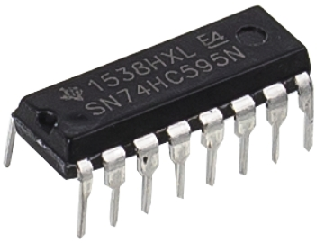

.. note::

    Hello, welcome to the SunFounder Raspberry Pi & Arduino & ESP32 Enthusiasts Community on Facebook! Dive deeper into Raspberry Pi, Arduino, and ESP32 with fellow enthusiasts.

    **Why Join?**

    - **Expert Support**: Solve post-sale issues and technical challenges with help from our community and team.
    - **Learn & Share**: Exchange tips and tutorials to enhance your skills.
    - **Exclusive Previews**: Get early access to new product announcements and sneak peeks.
    - **Special Discounts**: Enjoy exclusive discounts on our newest products.
    - **Festive Promotions and Giveaways**: Take part in giveaways and holiday promotions.

    👉 Ready to explore and create with us? Click [|link_sf_facebook|] and join today!

27. Flowing Light with 74HC595
=======================================

In this lesson, we will delve into the world of the 74HC595 shift register chip. This powerful component allows us to control numerous LEDs with just a few pins, making it perfect for implementing flowing light effects. By the end of this lesson, you'll have a solid understanding of how the 74HC595 works, how to use it to shift binary data, and how to apply it in a practical LED control experiment.

.. raw:: html

    <video width="600" loop autoplay muted>
        <source src="_static/video/27_flowing_light.mp4" type="video/mp4">
        Your browser does not support the video tag.
    </video>

In this lesson, you will learn:

* Understand the working principles of the 74HC595 chip and its pin functions.
* Learn how to use the ``shiftOut()`` function to shift data.
* Build a flowing light circuit using the 74HC595 chip and Arduino.
* Control 8 LEDs using binary data and the 74HC595 chip to create a flowing light effect.

Learn the 74HC595 Chip
--------------------------
The 74HC595 chip consists of an 8-bit shift register and a storage register with three-state parallel outputs. It converts serial input into parallel output so you can save IO ports of an MCU. 

**Pins Functions**

.. image:: img/24_74hc595_pin.png
    :width: 500
    :align: center

* **Q0-Q7**: 8-bit parallel data output pins, able to control 8 LEDs or 8 pins of 7-segment display directly.
* **Q7'**: Series output pin, connected to DS of another 74HC595 to connect multiple 74HC595s in series
* **MR**: Reset pin, active at low level;
* **SHcp**: Time sequence input of shift register. On the rising edge, the data in shift register moves successively one bit, i.e. data in Q1 moves to Q2, and so forth. While on the falling edge, the data in shift register remain unchanged.
* **STcp**: Time sequence input of storage register. On the rising edge, data in the shift register moves into memory register.
* **CE**: Output enable pin, active at low level.
* **DS**: Serial data input pin
* **VCC**: Positive supply voltage.
* **GND**: Ground.

**Working Principle**

When MR (pin10) is high level and OE (pin13) is low level, 
data is input in the rising edge of SHcp and goes to the storage register through the rising edge of STcp. 

* Shift Register

    * Suppose, we want to input the binary data 1110 1110 into the shift register of the 74hc595.
    * The data is input from bit 0 of the shift register.
    * Whenever the shift register clock is a rising edge, the bits in the shift register are shifted one step. For example, bit 7 accepts the previous value in bit 6, bit 6 gets the value of bit 5, etc.

.. image:: img/24_74hc595_shift.png
    :width: 600
    :align: center

* Storage Register

    * When the storage register is in the rising edge state, the data of the shift register will be transferred to the storage register.
    * The storage register is directly connected to the 8 output pins, Q0 ~ Q7 will be able to receive a byte of data. 
    * The so-called storage register means that the data can exist in this register and will not disappear with one output. 
    * The data will remain valid and unchanged as long as the 74HC595 is powered on continuously. 
    * When new data comes, the data in the storage register will be overwritten and updated.

.. image:: img/24_74hc595_storage.png
    :width: 600
    :align: center

Building the Circuit
--------------------------------

**Components Needed**

.. list-table:: 
   :widths: 25 25 25 25
   :header-rows: 0

   * - 1 * Arduino Uno R3
     - 8 * LEDs
     - 8 * 220Ω Resistor
     - 1 * 74HC595
   * - |list_uno_r3| 
     - |list_red_led| 
     - |list_220ohm| 
     - |list_74hc595|  
   * - 1 * Breadboard
     - Jumper Wires
     - 1 * USB Cable
     -
   * - |list_breadboard| 
     - |list_wire| 
     - |list_usb_cable| 
     -

**Building Step-by-Step**

Follow the wiring diagram, or the steps below to build your circuit.

.. image:: img/24_flow_light.png
    :width: 600
    :align: center

1. Insert 8 LEDs into the breadboard, in any color configuration you like. Ensure that all the cathodes (short legs) of the LEDs are connected to the ground rail on the breadboard, while the anodes are connected to separate rows.

.. image:: img/24_flow_light_led.png
    :width: 500
    :align: center

2. Connect a 220Ω resistor to each anode of the LEDs.

.. image:: img/24_flow_light_resistor.png
    :width: 500
    :align: center

3. Locate the 74HC595 chip and insert it into the breadboard. Ensure that the chip spans the middle gap.

.. note::

    Pay careful attention to the orientation of the 74HC595 to avoid damage. You can identify the correct orientation using the following clues:

    * The label on the chip is upright.
    * The notch on the chip is to the left.

4. Connect the VCC and MR pins of the 74HC595 to the positive rail on the breadboard.

5. Connect the CE and GND pins of the 74HC595 to the negative rail on the breadboard.

.. image:: img/24_flow_light_gnd.png
    :width: 500
    :align: center

6. Connect the Q0-Q7 pins of the 74HC595 to the rows on the breadboard containing the 220Ω resistors.

.. image:: img/24_flow_light_q0_q7.png
    :width: 500
    :align: center

7. Connect the DS pin of the 74HC595 to pin 11 of the Arduino Uno R3.

.. image:: img/24_flow_light_pin11.png
    :width: 600
    :align: center

8. Connect the ST_CP pin of the 74HC595 to pin 12 of the Arduino Uno R3.

.. image:: img/24_flow_light_pin12.png
    :width: 600
    :align: center

9. Connect the Sh_CP pin of the 74HC595 to pin 8 of the Arduino Uno R3.

10. Finally, connect the GND and 5V pins of the Arduino Uno R3 to the negative and positive rails on the breadboard, respectively.

.. image:: img/24_flow_light.png
    :width: 600
    :align: center

11. The following table shows the pin connections between the 74HC595 and the Arduino Uno R3.

.. list-table::
    :widths: 20 20
    :header-rows: 1

    *   - 74HC595
        - Arduino UNO R3
    *   - VCC
        - 5V
    *   - Q0~Q7
        - LEDs 
    *   - DS
        - 11
    *   - CE
        - GND
    *   - ST_CP
        - 12
    *   - SH_CP
        - 8
    *   - MR
        - 5V
    *   - GND
        - GND

Code Creation - Lighting Up LEDs
--------------------------------------------

The Arduino Uno R3 sends groups of binary data to the 74HC595 chip.
Binary data forms the core of computers and many electronic devices, using simple 0s and 1s to process complex data and instructions.
In computer science and digital electronics, binary data is vital as it forms the foundation for information processing and storage in electronic computers.
Here, 0 and 1 can be seen as states of a switch, where 0 represents off (closed), and 1 represents on (open).

For binary numbers, you need to understand two basic concepts:

* Bit: A bit is the basic unit in the binary system, and each bit can be either 0 or 1.
* Byte: A byte is made up of 8 bits. It is a common unit of data processing in computers. (And look, the 74HC595 chip accepts exactly 1 byte of data at a time!)

Binary numbers are ordered from least significant to most significant bit, with the rightmost bit being the least significant and the leftmost bit being the most significant.

.. image:: img/24_binary_bit.png
    :width: 500
    :align: center

Let's now see how the 74HC595 receives binary data and outputs it to the LEDs!

1. Open the Arduino IDE and start a new project by selecting “New Sketch” from the “File” menu.
2. Save your sketch as ``Lesson27_Lighting_up_LEDs`` using ``Ctrl + S`` or by clicking “Save”.

3. Controlling the 74HC595 only requires three pins to provide pulse signals, so set them as OUTPUT.

.. code-block:: Arduino

    const int STcp = 12;  // Pin connected to ST_CP of 74HC595
    const int SHcp = 8;   // Pin connected to SH_CP of 74HC595
    const int DS = 11;    // Pin connected to DS of 74HC595

    void setup() {
        // Set pins to output mode
        pinMode(STcp, OUTPUT);
        pinMode(SHcp, OUTPUT);
        pinMode(DS, OUTPUT);
    }

4. Your computer sends binary data to the ``DS`` (Data Input) pin of the 74HC595, then uses the clock signal from the ``SH_CP`` (Shift Register Clock Input) pin to shift each data bit forward. This data transmission process can be implemented using the ``shiftOut()`` function.

    * ``shiftOut(dataPin, clockPin, bitOrder, value)``: Shifts out a byte of data one bit at a time. Starts from either the most (i.e., the leftmost) or least (rightmost) significant bit. Each bit is written in turn to a data pin, after which a clock pin is pulsed (taken high, then low) to indicate that the bit is available.

    **Parameters**

        * ``dataPin``: the pin on which to output each bit. Allowed data types: int.
        * ``clockPin``: the pin to toggle once the dataPin has been set to the correct value. Allowed data types: int.
        * ``bitOrder``: which order to shift out the bits; either ``MSBFIRST`` or ``LSBFIRST``. (Most Significant Bit First, or Least Significant Bit First).
        * ``value``: the data to shift out. Allowed data types: byte.

    **Returns**
        Nothing

5. Here, we attempt to send a byte (8 bits) of data to the 74HC595 shift register using the ``shiftOut()`` function.

.. code-block:: Arduino
    :emphasize-lines: 3

    void loop()
    {
        shiftOut(DS, SHcp, MSBFIRST, B11101110);  // Shift out the data, MSB first
    }

* This sends the data ``B11101110`` (binary, B is short for binary) to the 74HC595 shift register, with data sent starting from the most significant bit.
* Each time the ``SH_CP`` pin receives a rising edge signal (the moment voltage goes from low to high), the bits in the shift register are shifted one step.
* For example, bit 7 accepts the previous value in bit 6, bit 6 gets the value of bit 5, etc.

.. image:: img/24_74hc595_shift.png
    :width: 500
    :align: center

6. After all the data bits have been input through the DS pin and shifted to their correct positions using multiple clock signals, the next step is to copy this data from the shift register to a storage register.

.. code-block:: Arduino
    :emphasize-lines: 2,7

    void loop() {
        digitalWrite(STcp, LOW);  // Ground ST_CP (Latch Pin) and hold low while transmitting data
        
        // Send data to the shift register using MSBFIRST (Most Significant Bit First)
        shiftOut(DS, SHcp, MSBFIRST, B11101110);
        
        digitalWrite(STcp, HIGH);  // Pull ST_CP (Latch Pin) high to save the data to output pins
        
        delay(1000);  // Wait for one second before repeating
    }

* When the ``ST_CP`` pin receives a rising edge signal, the data in the shift register is copied to the storage register.
* Once the data is copied to the storage register, the LEDs connected to the corresponding output pins(Q0 ~ Q7) will light up or remain off according to whether the data is 1 or 0.

.. image:: img/24_74hc595_storage_1data.png
    :width: 300
    :align: center

7. Here's your complete code. You can now upload this code to the Arduino Uno R3. After that, you will see the LEDs connected to Q0 and Q4 turned off while other LEDs are lit.

.. code-block:: Arduino

    const int STcp = 12;  // Pin connected to ST_CP of 74HC595
    const int SHcp = 8;   // Pin connected to SH_CP of 74HC595
    const int DS = 11;    // Pin connected to DS of 74HC595

    void setup() {
        // Set pins to output mode
        pinMode(STcp, OUTPUT);
        pinMode(SHcp, OUTPUT);
        pinMode(DS, OUTPUT);
    }

    void loop() {
        digitalWrite(STcp, LOW);  // Ground ST_CP and hold low while transmitting
        shiftOut(DS, SHcp, MSBFIRST, B11101110);  // Shift out the data, MSB first
        digitalWrite(STcp, HIGH);  // Pull ST_CP high to save the data
        delay(1000);  // Wait for a second
    }

**Question**

What happens if we change ``MSBFIRST`` to ``LSBFIRST`` in ``shiftOut(DS, SHcp, MSBFIRST, B11101110);``? Why?

Code Creation - Flowing Light
--------------------------------

How would we implement a flowing light effect, where the LEDs light up one by one?

1. Open the sketch you saved earlier, ``Lesson27_Lighting_up_LEDs``. Hit “Save As...” from the “File” menu, and rename it to ``Lesson27_Flowing_Light``. Click "Save".

2. Here, we want to set up a flowing light, where the LEDs light up one by one. We will write the on/off states of this flowing light sequence as an array.

.. code-block:: Arduino
    :emphasize-lines: 4

    const int STcp = 12;  // Pin connected to ST_CP of 74HC595
    const int SHcp = 8;   // Pin connected to SH_CP of 74HC595
    const int DS = 11;    // Pin connected to DS of 74HC595
    int datArray[] = {B00000000, B00000001, B00000011, B00000111, B00001111, B00011111, B00111111, B01111111, B11111111};

3. Then, use a ``for`` loop to sequentially call this array.

.. code-block:: Arduino
    :emphasize-lines: 3,5

    void loop()
    {
        for (int num = 0; num <= 8; num++) {
            digitalWrite(STcp, LOW);                      // Ground ST_CP and hold low while transmitting
            shiftOut(DS, SHcp, MSBFIRST, datArray[num]);  // Shift out the data, MSB first
            digitalWrite(STcp, HIGH);                     // Pull ST_CP high to save the data
            delay(1000);                                  // Wait for a second
        }
    }

4. Your complete code is shown below. You can now upload this code to the Arduino Uno R3, and then you'll see the LEDs light up one by one, like a flowing light.

.. code-block:: Arduino

    const int STcp = 12;  // Pin connected to ST_CP of 74HC595
    const int SHcp = 8;   // Pin connected to SH_CP of 74HC595
    const int DS = 11;    // Pin connected to DS of 74HC595
    int datArray[] = {B00000000, B00000001, B00000011, B00000111, B00001111, B00011111, B00111111, B01111111, B11111111};

    void setup ()
    {
        // Set pins to output mode
        pinMode(STcp, OUTPUT);
        pinMode(SHcp, OUTPUT);
        pinMode(DS, OUTPUT);
    }

    void loop()
    {
        for (int num = 0; num <= 8; num++) {
            digitalWrite(STcp, LOW);                      // Ground ST_CP and hold low while transmitting
            shiftOut(DS, SHcp, MSBFIRST, datArray[num]);  // Shift out the data, MSB first
            digitalWrite(STcp, HIGH);                     // Pull ST_CP high to save the data
            delay(1000);                                  // Wait for a second
        }
    }

5. Finally, remember to save your code and tidy up your workspace.

**Question**

If we want to have three LEDs lit at a time and have them appear to "flow," how should the elements of the ``datArray[]`` array be modified?

**Summary**

In this lesson, we explored the structure and functionality of the 74HC595 chip, learning how to shift binary data through its shift register and build a flowing light experiment. Using the ``shiftOut()`` function to control binary data transmission, we successfully managed the sequential lighting of 8 LEDs to achieve a flowing light effect. With this newfound knowledge, you should now be able to effectively use the 74HC595 chip to add dazzling lighting features to your own projects.

