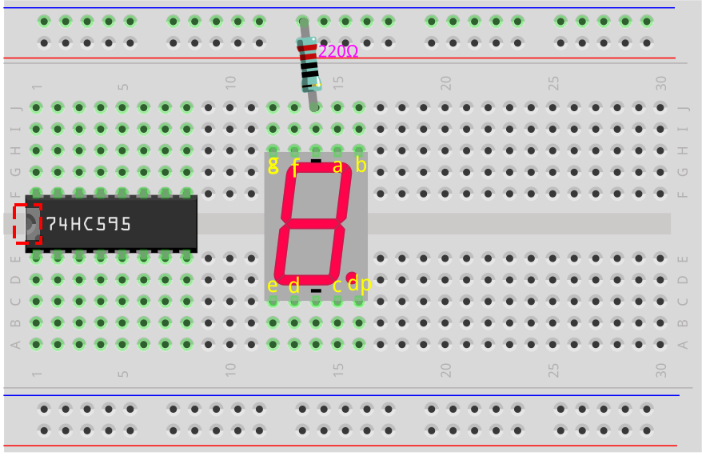

.. note::

    Hello, welcome to the SunFounder Raspberry Pi & Arduino & ESP32 Enthusiasts Community on Facebook! Dive deeper into Raspberry Pi, Arduino, and ESP32 with fellow enthusiasts.

    **Why Join?**

    - **Expert Support**: Solve post-sale issues and technical challenges with help from our community and team.
    - **Learn & Share**: Exchange tips and tutorials to enhance your skills.
    - **Exclusive Previews**: Get early access to new product announcements and sneak peeks.
    - **Special Discounts**: Enjoy exclusive discounts on our newest products.
    - **Festive Promotions and Giveaways**: Take part in giveaways and holiday promotions.

    👉 Ready to explore and create with us? Click [|link_sf_facebook|] and join today!

28. Show Number with 74hc595
==================================

In the previous lesson, you may have noticed that the 74HC595 and the 7-segment display make a perfect pair. The 74HC595 can simultaneously output 8-bit signals, while the 7-segment display is controlled by 8 electrical signals (including the decimal point LED segment, i.e., the dp segment).

So, can the 74HC595 be used to control the 7-segment display? The answer is yes.

In this lesson, we will use the 74HC595 to control the 7-segment display and make it show different numbers.

.. raw:: html

    <video width="600" loop autoplay muted>
        <source src="_static/video/28_show_number.mp4" type="video/mp4">
        Your browser does not support the video tag.
    </video>

In this lesson, you will able to:

* Understand how to use the 74HC595 shift register to drive a 7-segment display.
* Learn the binary representations of digits 0 to 9 and how to convert them to decimal and hexadecimal formats.
* Understand how to use the Serial Monitor to input data and display it on the 7-segment display.

Building the Circuit
--------------------------------

**Components Needed**

.. list-table:: 
   :widths: 25 25 25 25
   :header-rows: 0

   * - 1 * Arduino Uno R3
     - 1 * 7-segment Display
     - 1 * 220Ω Resistor
     - 1 * 74HC595
   * - |list_uno_r3| 
     - |list_7segment| 
     - |list_220ohm| 
     - |list_74hc595| 
   * - 1 * Breadboard
     - Jumper Wires
     - 1 * USB Cable
     -
   * - |list_breadboard| 
     - |list_wire| 
     - |list_usb_cable| 
     -

**Building Step-by-Step**

Follow the wiring diagram, or the steps below to build your circuit.

.. image:: img/25_show_number.png
    :width: 500
    :align: center

1. Insert the 7-segment display into the breadboard with the decimal point at the bottom right corner.

2. Connect the negative (-) terminal of the 7-segment display to the ground rail of the breadboard using a jumper wire.

.. image:: img/25_show_number_resistor.png
    :width: 500
    :align: center

3. Locate the 74HC595 chip and insert it into the breadboard. Ensure that the chip spans the middle gap.

4. Connect the VCC and MR pins of the 74HC595 to the positive rail on the breadboard.

.. image:: img/25_show_number_vcc.png
    :width: 500
    :align: center

5. Connect the CE and GND pins of the 74HC595 to the negative rail on the breadboard.

.. image:: img/25_show_number_gnd.png
    :width: 500
    :align: center

6. Connect Q0 of the 74HC595 to the 'a' pin of the 7-segment display, Q1 to the 'b' pin, Q2 to the 'c' pin, Q3 to the 'd' pin, and Q4 to the 'e' pin.

.. image:: img/25_show_number_q0_q4.png
    :width: 500
    :align: center

7. Connect Q5 of the 74HC595 to the 'f' pin of the 7-segment display, Q6 to the 'g' pin, and Q7 to the 'dp' pin.

.. image:: img/25_show_number_q5_q7.png
    :width: 500
    :align: center

8. Connect the DS pin of the 74HC595 to pin 11 of the Arduino Uno R3.

.. image:: img/25_show_number_pin11.png
    :width: 500
    :align: center

9. Connect the ST_CP pin of the 74HC595 to pin 12 of the Arduino Uno R3.

.. image:: img/25_show_number_pin12.png
    :width: 500
    :align: center

10. Connect the SH_CP pin of the 74HC595 to pin 8 of the Arduino Uno R3.

.. image:: img/25_show_number_pin8.png
    :width: 500
    :align: center

11. Finally, connect the GND and 5V pins of the Arduino Uno R3 to the negative and positive rails on the breadboard, respectively.

.. image:: img/25_show_number.png
    :width: 500
    :align: center

12. The following tables shows the pin connections between the 74HC595, the Arduino Uno R3, the 7-segment Display.

.. list-table::
    :widths: 20 20
    :header-rows: 1

    *   - 74HC595
        - Arduino UNO R3
    *   - VCC
        - 5V
    *   - DS
        - 11
    *   - CE
        - GND
    *   - ST_CP
        - 12
    *   - SH_CP
        - 8
    *   - MR
        - 5V
    *   - GND
        - GND

.. list-table::
    :widths: 20 20
    :header-rows: 1

    *   - 74HC595
        - 7-segment Display
    *   - Q0
        - a
    *   - Q1
        - b 
    *   - Q2
        - c
    *   - Q3
        - d
    *   - Q4
        - e
    *   - Q5
        - f
    *   - Q6
        - g
    *   - Q7
        - dp

Binary Numbers for Digits 0 to 9
------------------------------------

In this project, we use the 74HC595 shift register to drive the 7-segment display to show different numbers. However, the 74HC595 receives binary numbers, so before programming, we need to know the corresponding binary numbers for digits 0 to 9.

Assuming we want to display a digit 2 on the 7-segment display, we need to turn off segments f and c and turn on the remaining segments.

.. image:: img/23_segment_2.png
    :align: center
    :width: 200

According to the wiring diagram, the output pins Q0 to Q7 of the 74HC595 correspond to the respective pins of the 7-segment display, as shown in the diagram. In binary, 0 represents off (closed), and 1 represents on (open). To display the digit 2, dp, f, and c should be 0, while the other segments should be 1, resulting in the binary number ``B01011011``.

.. image:: img/25_display_2_binary.png
    :align: center
    :width: 600

.. note::

    When you only have one 7-segment display, the DP pin is always set to 0. When you have multiple 7-segment displays in a daisy-chain configuration, you can use the DP pin to indicate the decimal point.

To display the digit 0, dp and g should be 0, and all other segments should be 1, giving the binary number ``B00111111``.

**Question**

Now that we know the binary representations for digits 0 and 2, please fill in the binary numbers for the remaining digits in the table below.

.. list-table::
    :widths: 20 20
    :header-rows: 1

    *   - Number
        - Binary
    *   - 0
        - B00111111
    *   - 1
        -
    *   - 2
        - B01011011
    *   - 3
        -
    *   - 4
        -
    *   - 5
        -
    *   - 6
        -
    *   - 7
        -
    *   - 8
        -
    *   - 9
        -        

Code Creation - Displaying Numbers
------------------------------------------

1. Open the sketch you saved earlier, ``Lesson28_Flowing_Light``. Hit “Save As...” from the “File” menu, and rename it to ``Lesson28_Show_Number_Binary``. Click "Save".

2. Change the ``datArray[]`` to display the binary numbers corresponding to digits 0 to 9.

.. code-block:: Arduino
    :emphasize-lines: 5

    const int STcp = 12;  //Pin connected to ST_CP of 74HC595
    const int SHcp = 8;   //Pin connected to SH_CP of 74HC595
    const int DS = 11;    //Pin connected to DS of 74HC595
    //display 0,1,2,3,4,5,6,7,8,9
    int datArray[] = { B00111111, B00000110, B01011011, B01001111, B01100110, B01101101, B01111101, B00000111, B01111111, B01101111 };

3. Since the ``datArray[]`` array contains 10 elements, modify the range of the variable ``num`` to ``num <= 9``.

.. code-block:: Arduino
    :emphasize-lines: 2

    void loop() {
        for (int num = 0; num <= 9; num++) {
            digitalWrite(STcp, LOW);                      // Ground ST_CP and hold low while transmitting
            shiftOut(DS, SHcp, MSBFIRST, datArray[num]);  // Shift out the data, MSB first
            digitalWrite(STcp, HIGH);                     // Pull ST_CP high to save the data
            delay(1000);                                  // Wait for a second
        }
    }

4. Your complete code should look like the following. At this point, you can upload the code to the Arduino Uno R3, and you'll see the 7-segment display scrolling through digits 0 to 9.

.. code-block:: Arduino

    const int STcp = 12;  //Pin connected to ST_CP of 74HC595
    const int SHcp = 8;   //Pin connected to SH_CP of 74HC595
    const int DS = 11;    //Pin connected to DS of 74HC595
    //display 0,1,2,3,4,5,6,7,8,9
    int datArray[] = { B00111111, B00000110, B01011011, B01001111, B01100110, B01101101, B01111101, B00000111, B01111111, B01101111 };

    void setup() {
        //set pins to output
        pinMode(STcp, OUTPUT);
        pinMode(SHcp, OUTPUT);
        pinMode(DS, OUTPUT);
    }

    void loop() {
        for (int num = 0; num <= 9; num++) {
            digitalWrite(STcp, LOW);                      // Ground ST_CP and hold low while transmitting
            shiftOut(DS, SHcp, MSBFIRST, datArray[num]);  // Shift out the data, MSB first
            digitalWrite(STcp, HIGH);                     // Pull ST_CP high to save the data
            delay(1000);                                  // Wait for a second
        }
    }

Binary Conversion
------------------

In practical applications, writing binary numbers can more clearly express the state of each bit in the data. However, for general numerical representation, writing decimal numbers is more convenient.

.. note::

    Writing binary, decimal, or even hexadecimal numbers does not affect the program's result but only the code's readability. For example, writing the decimal number ``91`` will be internally converted to binary form ``B01011011``.

Let's see how to convert binary numbers to decimal.

**Conversion to Decimal**

In the binary system, each bit represents a corresponding place value. The place value is a power of 2, such as 2^0, 2^1, 2^2…, etc. By multiplying each bit by its corresponding place value and adding all the results together, we get the decimal number.

For example, the binary number ``B01011011`` converts to the decimal number 91.

 
**Using a Calculator**

In practical applications, you can use the calculator on your computer. Switch to Programmer mode, and you can easily convert between binary, decimal, and hexadecimal.

1. Search for "Calculator" on your computer, then switch to **Programmer** mode.

.. image:: img/25_calculator_programmer.png
    :align: center

2. If you already know the binary number and want to convert it to another base, select **BIN**.

.. image:: img/25_calculator_binary.png
    :align: center

3. Now, you can start entering the binary number.

* The effective bits in binary refer to the range from the most significant bit (leftmost non-zero bit) to the least significant bit (rightmost non-zero bit).
* So for the binary number ``B00111111``, the effective bits are ``111111``. 
* Now, enter ``111111`` into the calculator to get the corresponding decimal and hexadecimal numbers.

.. image:: img/25_calculator_binary_0.png
    :align: center
    :width: 300

**Question**

Please convert the binary numbers representing digits 0 to 9 into decimal and hexadecimal numbers using a calculator, and fill in the table. This will give you a quick reference guide for base conversions.

.. list-table::
    :widths: 20 40 30 30
    :header-rows: 1

    *   - Number
        - Binary
        - Decimal
        - Hexadecimal
    *   - 0
        - B00111111
        - 63
        - 0x3F
    *   - 1
        - B00000110
        -
        -
    *   - 2
        - B01011011
        -
        -
    *   - 3
        - B01001111
        -
        -
    *   - 4
        - B01100110
        -
        -
    *   - 5
        - B01101101
        -
        -
    *   - 6
        - B01111101
        -
        -
    *   - 7
        - B00000111
        -
        -
    *   - 8
        - B01111111
        -
        -
    *   - 9
        - B01101111
        -
        -

**Modify the Sketch**

Now, open your ``Lesson28_Show_Number_Binary`` sketch in the Arduino IDE. Click "File" -> "Save As...", name the file ``Lesson28_Show_Number_Decimal``. Click "Save".

Change all the elements of ``datArray[]`` to decimal, as shown in the code. Once modified, you can upload the code to the Arduino Uno R3 to see the effect.

.. code-block:: Arduino

    const int STcp = 12;  //Pin connected to ST_CP of 74HC595
    const int SHcp = 8;   //Pin connected to SH_CP of 74HC595
    const int DS = 11;    //Pin connected to DS of 74HC595
    //display 0,1,2,3,4,5,6,7,8,9
    int datArray[] = { 63, 6, 91, 79, 102, 109, 125, 7, 127, 111 };

    void setup() {
        //set pins to output
        pinMode(STcp, OUTPUT);
        pinMode(SHcp, OUTPUT);
        pinMode(DS, OUTPUT);
    }

    void loop() {
        for (int num = 0; num <= 9; num++) {
            digitalWrite(STcp, LOW);                      // Ground ST_CP and hold low while transmitting
            shiftOut(DS, SHcp, MSBFIRST, datArray[num]);  // Shift out the data, MSB first
            digitalWrite(STcp, HIGH);                     // Pull ST_CP high to save the data
            delay(1000);                                  // Wait for a second
        }
    }

Code Creation - Serial Input
---------------------------------

The Serial Monitor is a powerful tool provided by the Arduino IDE for communication with the Arduino board. We have used it to monitor data output from the Arduino, such as reading analog values from a photoresistor. It can also be used to send data to the Arduino, allowing it to perform actions based on received data.

In this activity, we will write a number between 0 and 9 into the Serial Monitor to display it on the 7-segment display.

1.  Open your ``Lesson28_Show_Number_Decimal`` sketch in the Arduino IDE. Click "File" -> "Save As...", name the file ``Lesson28_Show_Number_Serial``. Click "Save".

2. In ``void setup()``, start the serial monitor and set its baud rate to 9600.

.. code-block:: Arduino
    :emphasize-lines: 6

    void setup() {
        //set pins to output
        pinMode(STcp, OUTPUT);
        pinMode(SHcp, OUTPUT);
        pinMode(DS, OUTPUT);
        Serial.begin(9600);  // Serial communication setup at 9600 baud
    }

3.  When using the Serial Monitor, you can read data entered into it through Arduino code. Here, you need to understand two functions:

* ``Serial.available()``: Get the number of bytes (characters) available for reading from the serial port. This is data that's already arrived and stored in the serial receive buffer (which holds 64 bytes).
* ``Serial.read()``: Returns the ASCII code of the character received via the serial input.

Now, use an ``if`` statement in void ``loop()`` to check if data has been read from the port, then print it.

.. note::

    Temporarily comment out the for statement in ``void loop()`` that displays characters on the 7-segment display to avoid affecting the printing process.

.. code-block:: Arduino
    :emphasize-lines: 2-5

    void loop() {
        if (Serial.available() > 0) {
            //Print the character received from the serial port
            Serial.println(Serial.read());
        }

        // for (int num = 0; num <= 9; num++) {
        //   digitalWrite(STcp, LOW);                      // Ground ST_CP and hold low while transmitting
        //   shiftOut(DS, SHcp, MSBFIRST, datArray[num]);  // Shift out the data, MSB first
        //   digitalWrite(STcp, HIGH);                     // Pull ST_CP high to save the data
        //   delay(1000);                                  // Wait for a second
        // }
    }

4. Your complete code is shown below. At this point, you can upload the code to the Arduino Uno R3.

.. code-block:: Arduino

    const int STcp = 12;  //Pin connected to ST_CP of 74HC595
    const int SHcp = 8;   //Pin connected to SH_CP of 74HC595
    const int DS = 11;    //Pin connected to DS of 74HC595
    //display 0,1,2,3,4,5,6,7,8,9
    int datArray[] = { 63, 6, 91, 79, 102, 109, 125, 7, 127, 111 };

    void setup() {
        //set pins to output
        pinMode(STcp, OUTPUT);
        pinMode(SHcp, OUTPUT);
        pinMode(DS, OUTPUT);
        Serial.begin(9600);  // Serial communication setup at 9600 baud
    }

    void loop() {
        if (Serial.available() > 0) {
            //Print the character received from the serial port
            Serial.println(Serial.read());
        }

        // for (int num = 0; num <= 9; num++) {
        //   digitalWrite(STcp, LOW);                      // Ground ST_CP and hold low while transmitting
        //   shiftOut(DS, SHcp, MSBFIRST, datArray[num]);  // Shift out the data, MSB first
        //   digitalWrite(STcp, HIGH);                     // Pull ST_CP high to save the data
        //   delay(1000);                                  // Wait for a second
        // }
    }

5. After uploading, open the Serial Monitor. In the input box, enter the number ``0`` (or any digit between 0-9) and press enter. At this moment, you will find that the Serial outputs a number ``48``.

.. note::

    * If "Newline" is selected in the line ending option of the serial monitor, you can also see a ``10``. 
    * ``10`` is the ASCII code for a newline character (also called LF - Line Feed).

.. image:: img/25_serial_read.png
    :align: center
    :width: 600

So, where did our input of ``0`` go? Where did that ``48`` come from? Is it possible that ``0`` is ``48``?

This is because the ``0`` we input in the Serial Monitor is considered a "character," not a "number."

The character transfer follows a coding standard known as ASCII (American Standard Code for Information Interchange).

ASCII includes common characters like uppercase letters (A-Z), lowercase letters (a-z), digits (0-9), and punctuation marks (such as periods, commas, exclamation marks, etc.). It also defines some control characters used to control devices and communication protocols. These control characters typically do not display on the screen but are used to control the behavior of devices like printers, terminals, etc., such as line feed, backspace, carriage return, etc.

Here is an ASCII table:

.. image:: img/25_ascii_table.png
    :align: center
    :width: 800

When you type the character ``0`` in the Serial Monitor, the ASCII code for the character ``0`` is sent to the Arduino.
In ASCII, the code for the character ``0`` is ``48`` in decimal.

6. Before you continue coding, you need to comment out the previous code that prints the ASCII code to avoid conflicts with the following code.

.. code-block:: Arduino
    :emphasize-lines: 4

    void loop() {
        if (Serial.available() > 0) {
            // Print the character received from the serial port
            // Serial.println(Serial.read());
        }

        // for (int num = 0; num <= 9; num++) {
        //   digitalWrite(STcp, LOW);                      // Ground ST_CP and hold low while transmitting
        //   shiftOut(DS, SHcp, MSBFIRST, datArray[num]);  // Shift out the data, MSB first
        //   digitalWrite(STcp, HIGH);                     // Pull ST_CP high to save the data
        //   delay(1000);                                  // Wait for a second
        // }
    }

7. You need to create a new ``char`` variable to store the character read from the Serial Monitor. 

.. code-block:: Arduino
    :emphasize-lines: 6,7

    void loop() {
        if (Serial.available() > 0) {
            // Print the character received from the serial port
            // Serial.println(Serial.read());

            // Read the character received from the serial port
            char receivedChar = Serial.read();
        }
    }

8. Now, convert the character to a number. In ASCII, the value for the character ``'0'`` is ``48``, ``'1'`` is ``49``, and so on. Therefore, by subtracting the ASCII code for ``'0'``, we can get the corresponding numeric value.

.. code-block:: Arduino
    :emphasize-lines: 8,9

    void loop() {
        if (Serial.available() > 0) {
            //Print the character received from the serial port
            Serial.println(Serial.read());

            // Read the character received from the serial port
            char receivedChar = Serial.read();
            // Convert the character to a digit
            int digit = receivedChar - '0';
        }
    }

9. In this example, we assume the input is numeric characters ``'0'`` to ``'9'``. Therefore, we only care if the input character is within this range. Hence, you need to check if the number is within the valid range:

* Select the previously commented-out ``for`` loop statement and press ``Ctrl + /`` to uncomment it.
* Then modify the ``for`` statement to an ``if`` statement to check if the input character is within the range of ``'0'`` to ``'9'``. If it is, let the 7-segment display show the corresponding number.

.. code-block:: Arduino
    :emphasize-lines: 9

    void loop() {
        if (Serial.available() > 0) {
            // Print the character received from the serial port
            // Serial.println(Serial.read());

            // Read the character received from the serial port
            char receivedChar = Serial.read();
            // Convert the character to a digit
            int digit = receivedChar - '0';

            if (digit >= 0 && digit <= 9) {
                digitalWrite(STcp, LOW);                        // Ground ST_CP and hold low while transmitting
                shiftOut(DS, SHcp, MSBFIRST, datArray[digit]);  // Shift out the data, MSB first
                digitalWrite(STcp, HIGH);                       // Pull ST_CP high to save the data
                delay(1000);                                    // Wait for a second
            }
        }
    }

10. Your complete code should be as follows. You can now upload the code to the Arduino Uno R3 and open the Serial Monitor. Enter any number between 0 and 9 to see if the 7-segment display shows the corresponding number.

.. code-block:: Arduino

    const int STcp = 12;  //Pin connected to ST_CP of 74HC595
    const int SHcp = 8;   //Pin connected to SH_CP of 74HC595
    const int DS = 11;    //Pin connected to DS of 74HC595
    //display 0,1,2,3,4,5,6,7,8,9
    int datArray[] = { 63, 6, 91, 79, 102, 109, 125, 7, 127, 111 };

    void setup() {
        //set pins to output
        pinMode(STcp, OUTPUT);
        pinMode(SHcp, OUTPUT);
        pinMode(DS, OUTPUT);
        Serial.begin(9600);  // Serial communication setup at 9600 baud
    }   

    void loop() {
        if (Serial.available() > 0) {
            // Print the character received from the serial port
            // Serial.println(Serial.read());

            // Read the character received from the serial port
            char receivedChar = Serial.read();
            // Convert the character to a digit
            int digit = receivedChar - '0';

            if (digit >= 0 && digit <= 9) {
                digitalWrite(STcp, LOW);                        // Ground ST_CP and hold low while transmitting
                shiftOut(DS, SHcp, MSBFIRST, datArray[digit]);  // Shift out the data, MSB first
                digitalWrite(STcp, HIGH);                       // Pull ST_CP high to save the data
                delay(1000);                                    // Wait for a second
            }
        }
    }

11. Finally, remember to save your code and tidy up your workspace.

**Summary**

In this lesson, you learned how to use the 74HC595 shift register to drive a 7-segment display and reduce the number of pins required on the Arduino Uno R3. You also explored the binary representations for digits to be displayed and understood how to convert binary numbers to decimal and hexadecimal formats, making the code more readable.

Additionally, you learned how to use the Serial Monitor for serial input and how the input characters are internally converted to ASCII codes. By understanding this conversion, you could map characters to their numeric equivalents, enabling accurate display on the 7-segment display.

Overall, this lesson provided a comprehensive understanding of using shift registers, controlling 7-segment displays, and handling serial communication for interactive projects.

