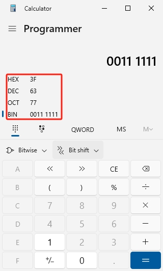

.. note::

    こんにちは、SunFounder Raspberry Pi & Arduino & ESP32 Enthusiasts Community on Facebookへようこそ！このコミュニティで、Raspberry Pi、Arduino、ESP32に関する知識を深め、他の愛好者とともに学びましょう。

    **なぜ参加するべきか？**

    - **専門サポート**: 購入後の問題や技術的な課題を、コミュニティやチームのサポートを受けながら解決できます。
    - **学びと共有**: スキル向上のためのヒントやチュートリアルを交換できます。
    - **限定プレビュー**: 新製品の発表やプレビューに早期アクセスできます。
    - **特別割引**: 最新製品に対する特別割引をお楽しみいただけます。
    - **お祭りプロモーションとプレゼント企画**: プレゼント企画や季節ごとのプロモーションに参加できます。

    👉 私たちと一緒に探求し、創造を楽しむ準備ができましたか？今すぐ[|link_sf_facebook|]をクリックして参加しましょう！

28. 74HC595を使用して数字を表示する
=====================================

前回のレッスンで、74HC595と7セグメントディスプレイが完璧にペアを組むことに気づいたかもしれません。74HC595は同時に8ビットの信号を出力でき、7セグメントディスプレイは8つの電気信号（小数点LEDセグメントを含む）で制御されます。

では、74HC595を使用して7セグメントディスプレイを制御できるでしょうか？答えはイエスです。

このレッスンでは、74HC595を使用して7セグメントディスプレイを制御し、異なる数字を表示させる方法を学びます。

.. raw:: html

    <video muted controls style = "max-width:90%">
        <source src="_static/video/28_show_number.mp4" type="video/mp4">
        Your browser does not support the video tag.
    </video>

このレッスンで学べること:

* 74HC595シフトレジスタを使用して7セグメントディスプレイを駆動する方法を理解する。
* 数字0から9のバイナリ表現を学び、それを10進数と16進数形式に変換する方法を習得する。
* シリアルモニタを使用してデータを入力し、それを7セグメントディスプレイに表示する方法を理解する。

回路の構築
----------------------------

**必要な部品**

.. list-table:: 
   :widths: 25 25 25 25
   :header-rows: 0

   * - 1 * Arduino Uno R3
     - 1 * 7セグメントディスプレイ
     - 1 * 220Ω抵抗
     - 1 * 74HC595
   * - |list_uno_r3| 
     - |list_7segment| 
     - |list_220ohm| 
     - |list_74hc595| 
   * - 1 * ブレッドボード
     - ジャンパーワイヤー
     - 1 * USBケーブル
     -
   * - |list_breadboard| 
     - |list_wire| 
     - |list_usb_cable| 
     -

**ステップバイステップの構築**

配線図に従うか、以下のステップに従って回路を構築してください。

.. image:: img/25_show_number.png
    :width: 500
    :align: center

1. 小数点が右下に来るように7セグメントディスプレイをブレッドボードに挿入します。

.. image:: img/25_show_number_7segment.png
    :width: 500
    :align: center

2. 7セグメントディスプレイの負極（-）端子をジャンパーワイヤーを使用してブレッドボードのグランドレールに接続します。

3. 74HC595チップを見つけ、ブレッドボードに挿入します。チップが中央のギャップをまたぐように配置してください。

.. image:: img/25_show_number_74hc595.png
    :width: 500
    :align: center

4. 74HC595のVCCピンとMRピンをブレッドボードの正のレールに接続します。

.. image:: img/25_show_number_vcc.png
    :width: 500
    :align: center

5. 74HC595のCEピンとGNDピンをブレッドボードの負のレールに接続します。

.. image:: img/25_show_number_gnd.png
    :width: 500
    :align: center

6. 74HC595のQ0を7セグメントディスプレイの'a'ピンに、Q1を'b'ピンに、Q2を'c'ピンに、Q3を'd'ピンに、Q4を'e'ピンに接続します。

7. 74HC595のQ5を7セグメントディスプレイの'f'ピンに、Q6を'g'ピンに、Q7を'dp'ピンに接続します。

.. image:: img/25_show_number_q5_q7.png
    :width: 500
    :align: center

8. 74HC595のDSピンをArduino Uno R3のピン11に接続します。

.. image:: img/25_show_number_pin11.png
    :width: 500
    :align: center

9. 74HC595のST_CPピンをArduino Uno R3のピン12に接続します。

.. image:: img/25_show_number_pin12.png
    :width: 500
    :align: center

10. 74HC595のSH_CPピンをArduino Uno R3のピン8に接続します。

.. image:: img/25_show_number_pin8.png
    :width: 500
    :align: center

11. 最後に、Arduino Uno R3のGNDピンと5Vピンを、それぞれブレッドボードの負のレールと正のレールに接続します。

.. image:: img/25_show_number.png
    :width: 500
    :align: center

12. 以下の表は、74HC595とArduino Uno R3、および7セグメントディスプレイのピン接続を示しています。

.. list-table::
    :widths: 20 20
    :header-rows: 1

    *   - 74HC595
        - Arduino UNO R3
    *   - VCC
        - 5V
    *   - DS
        - 11
    *   - CE
        - GND
    *   - ST_CP
        - 12
    *   - SH_CP
        - 8
    *   - MR
        - 5V
    *   - GND
        - GND

.. list-table::
    :widths: 20 20
    :header-rows: 1

    *   - 74HC595
        - 7-segment Display
    *   - Q0
        - a
    *   - Q1
        - b 
    *   - Q2
        - c
    *   - Q3
        - d
    *   - Q4
        - e
    *   - Q5
        - f
    *   - Q6
        - g
    *   - Q7
        - dp

数字0から9のバイナリ表現
------------------------------------

このプロジェクトでは、74HC595シフトレジスタを使用して7セグメントディスプレイを駆動し、異なる数字を表示します。しかし、74HC595はバイナリ数を受け取るため、プログラムを作成する前に、数字0から9に対応するバイナリ数を知る必要があります。

たとえば、7セグメントディスプレイに数字2を表示したい場合、セグメントfとcをオフにし、他のセグメントをオンにする必要があります。

.. image:: img/23_segment_2.png
    :align: center
    :width: 200

配線図に従うと、74HC595の出力ピンQ0からQ7がそれぞれ7セグメントディスプレイの対応するピンに接続されていることがわかります。バイナリでは、0がオフ（閉）を、1がオン（開）を表します。数字2を表示するために、dp、f、cが0で、他のセグメントが1になるようにし、バイナリ数は``B01011011``となります。

.. note::

    7セグメントディスプレイが1つしかない場合、DPピンは常に0に設定されます。複数の7セグメントディスプレイをデイジーチェーン接続している場合、DPピンを使用して小数点を示すことができます。

数字0を表示するために、dpとgが0で、他のセグメントがすべて1になるようにし、バイナリ数は ``B00111111`` となります。

**質問**

数字0と2のバイナリ表現がわかったので、以下の表に残りの数字のバイナリ数を記入してください。

.. list-table::
    :widths: 20 20
    :header-rows: 1

    *   - 数字
        - バイナリ
    *   - 0
        - B00111111
    *   - 1
        -
    *   - 2
        - B01011011
    *   - 3
        -
    *   - 4
        -
    *   - 5
        -
    *   - 6
        -
    *   - 7
        -
    *   - 8
        -
    *   - 9
        -

コード作成 - 数字の表示
------------------------------------------

1. 先ほど保存したスケッチ「 ``Lesson28_Flowing_Light`` 」を開きます。「ファイル」メニューから「名前を付けて保存」を選択し、「 ``Lesson28_Show_Number_Binary`` 」に名前を変更して「保存」をクリックします。

2. ``datArray[]`` を変更して、数字0から9に対応するバイナリ数を表示します。

.. code-block:: Arduino
    :emphasize-lines: 5

    const int STcp = 12;  // 74HC595のST_CPに接続されたピン
    const int SHcp = 8;   // 74HC595のSH_CPに接続されたピン
    const int DS = 11;    // 74HC595のDSに接続されたピン
    // 数字0,1,2,3,4,5,6,7,8,9を表示
    int datArray[] = { B00111111, B00000110, B01011011, B01001111, B01100110, B01101101, B01111101, B00000111, B01111111, B01101111 };

3. ``datArray[]`` 配列には10個の要素が含まれているため、変数 ``num`` の範囲を ``num <= 9`` に変更します。

.. code-block:: Arduino
    :emphasize-lines: 2

    void loop() {
        for (int num = 0; num <= 9; num++) {
            digitalWrite(STcp, LOW);                      // Ground ST_CP and hold low while transmitting
            shiftOut(DS, SHcp, MSBFIRST, datArray[num]);  // Shift out the data, MSB first
            digitalWrite(STcp, HIGH);                     // Pull ST_CP high to save the data
            delay(1000);                                  // Wait for a second
        }
    }

4. 完全なコードは以下のようになります。これでコードをArduino Uno R3にアップロードすると、7セグメントディスプレイに数字0から9が順番に表示されます。

.. code-block:: Arduino

    const int STcp = 12;  //Pin connected to ST_CP of 74HC595
    const int SHcp = 8;   //Pin connected to SH_CP of 74HC595
    const int DS = 11;    //Pin connected to DS of 74HC595
    //display 0,1,2,3,4,5,6,7,8,9
    int datArray[] = { B00111111, B00000110, B01011011, B01001111, B01100110, B01101101, B01111101, B00000111, B01111111, B01101111 };

    void setup() {
        //set pins to output
        pinMode(STcp, OUTPUT);
        pinMode(SHcp, OUTPUT);
        pinMode(DS, OUTPUT);
    }

    void loop() {
        for (int num = 0; num <= 9; num++) {
            digitalWrite(STcp, LOW);                      // Ground ST_CP and hold low while transmitting
            shiftOut(DS, SHcp, MSBFIRST, datArray[num]);  // Shift out the data, MSB first
            digitalWrite(STcp, HIGH);                     // Pull ST_CP high to save the data
            delay(1000);                                  // Wait for a second
        }
    }

バイナリ変換
------------------

実際のアプリケーションでは、バイナリ数を書くことでデータの各ビットの状態をより明確に表現できます。しかし、一般的な数値表現には、10進数を使う方が便利です。

.. note::

    バイナリ、10進数、または16進数で数値を書くことは、プログラムの結果には影響しませんが、コードの読みやすさには影響します。たとえば、10進数の ``91`` を書くと、それは内部的にバイナリ形式の ``B01011011`` に変換されます。

バイナリ数を10進数に変換する方法を見てみましょう。

**10進数への変換**

バイナリシステムでは、各ビットが対応する位の値を表します。位の値は2の累乗であり、2^0、2^1、2^2…などです。各ビットをその対応する位の値で掛け合わせ、それらの結果をすべて合計することで、10進数が得られます。

たとえば、バイナリ数 ``B01011011`` は10進数では91に変換されます。

.. image:: img/25_binary_dec.png
    :align: center
    :width: 600
 
**電卓の使用**

実際のアプリケーションでは、コンピュータの電卓を使用することができます。電卓をプログラマーモードに切り替えれば、バイナリ、10進数、16進数間の変換が簡単に行えます。

1. コンピュータで「電卓」を検索し、「プログラマー」モードに切り替えます。

.. image:: img/25_calculator_programmer.png
    :align: center

2. すでにバイナリ数がわかっている場合は、「BIN」を選択します。

.. image:: img/25_calculator_binary.png
    :align: center

3. これで、バイナリ数の入力を開始できます。

* バイナリの有効ビットとは、最上位ビット（左端の0以外のビット）から最下位ビット（右端の0以外のビット）までの範囲を指します。
* たとえば、バイナリ数 ``B00111111`` の有効ビットは ``111111`` です。
* これで、電卓に ``111111`` を入力して、対応する10進数と16進数を取得できます。

**質問**

バイナリ数で表される数字0から9を、電卓を使用して10進数および16進数に変換し、表に記入してください。これにより、基数変換のクイックリファレンスガイドが得られます。

.. list-table::
    :widths: 20 40 30 30
    :header-rows: 1

    *   - 数字
        - バイナリ
        - 10進数
        - 16進数
    *   - 0
        - B00111111
        - 63
        - 0x3F
    *   - 1
        - B00000110
        -
        -
    *   - 2
        - B01011011
        -
        -
    *   - 3
        - B01001111
        -
        -
    *   - 4
        - B01100110
        -
        -
    *   - 5
        - B01101101
        -
        -
    *   - 6
        - B01111101
        -
        -
    *   - 7
        - B00000111
        -
        -
    *   - 8
        - B01111111
        -
        -
    *   - 9
        - B01101111
        -
        -

**スケッチの修正**

まず、Arduino IDEで「 ``Lesson28_Show_Number_Binary`` 」スケッチを開きます。「ファイル」 -> 「名前を付けて保存」をクリックし、ファイル名を「 ``Lesson28_Show_Number_Decimal`` 」に変更して「保存」をクリックします。

次に、 ``datArray[]`` のすべての要素を10進数に変更します。修正後、このコードをArduino Uno R3にアップロードして、その効果を確認してください。

.. code-block:: Arduino

    const int STcp = 12;  //Pin connected to ST_CP of 74HC595
    const int SHcp = 8;   //Pin connected to SH_CP of 74HC595
    const int DS = 11;    //Pin connected to DS of 74HC595
    //display 0,1,2,3,4,5,6,7,8,9
    int datArray[] = { 63, 6, 91, 79, 102, 109, 125, 7, 127, 111 };

    void setup() {
        //set pins to output
        pinMode(STcp, OUTPUT);
        pinMode(SHcp, OUTPUT);
        pinMode(DS, OUTPUT);
    }

    void loop() {
        for (int num = 0; num <= 9; num++) {
            digitalWrite(STcp, LOW);                      // Ground ST_CP and hold low while transmitting
            shiftOut(DS, SHcp, MSBFIRST, datArray[num]);  // Shift out the data, MSB first
            digitalWrite(STcp, HIGH);                     // Pull ST_CP high to save the data
            delay(1000);                                  // Wait for a second
        }
    }

コード作成 - シリアル入力
---------------------------------

シリアルモニタは、Arduino IDEが提供する強力なツールで、Arduinoボードとの通信を行うために使用されます。これを使用して、Arduinoからのデータ出力を監視することができます。例えば、フォトレジスタからのアナログ値を読み取る場合です。また、データをArduinoに送信し、受信したデータに基づいて動作を実行させることも可能です。

このアクティビティでは、シリアルモニタに0から9の数字を入力し、それを7セグメントディスプレイに表示します。

1. Arduino IDEで「 ``Lesson28_Show_Number_Decimal`` 」スケッチを開きます。「ファイル」 -> 「名前を付けて保存」をクリックし、ファイル名を「 ``Lesson28_Show_Number_Serial`` 」に変更して「保存」をクリックします。

2. ``void setup()`` で、シリアルモニタを開始し、ボーレートを9600に設定します。

.. code-block:: Arduino
    :emphasize-lines: 6

    void setup() {
        //set pins to output
        pinMode(STcp, OUTPUT);
        pinMode(SHcp, OUTPUT);
        pinMode(DS, OUTPUT);
        Serial.begin(9600);  // Serial communication setup at 9600 baud
    }

3. シリアルモニタを使用すると、Arduinoコードを通じて入力されたデータを読み取ることができます。ここで、2つの関数について理解しておく必要があります。

* ``Serial.available()`` : シリアルポートから読み取ることができるバイト（文字）の数を取得します。これは、すでに到着し、シリアル受信バッファに保存されたデータです（64バイトまで保持できます）。
* ``Serial.read()`` : シリアル入力を通じて受信された文字のASCIIコードを返します。

次に、 ``void loop()`` 内で ``if`` ステートメントを使用して、ポートからデータが読み取られたかどうかを確認し、それを表示します。

.. note::

    7セグメントディスプレイに文字を表示するための ``void loop()`` 内のforステートメントを一時的にコメントアウトし、印刷プロセスに影響を与えないようにします。

.. code-block:: Arduino
    :emphasize-lines: 2-5

    void loop() {
        if (Serial.available() > 0) {
            //Print the character received from the serial port
            Serial.println(Serial.read());
        }

        // for (int num = 0; num <= 9; num++) {
        //   digitalWrite(STcp, LOW);                      // Ground ST_CP and hold low while transmitting
        //   shiftOut(DS, SHcp, MSBFIRST, datArray[num]);  // Shift out the data, MSB first
        //   digitalWrite(STcp, HIGH);                     // Pull ST_CP high to save the data
        //   delay(1000);                                  // Wait for a second
        // }
    }

4. 完全なコードは以下のようになります。これでコードをArduino Uno R3にアップロードできます。

.. code-block:: Arduino

    const int STcp = 12;  //Pin connected to ST_CP of 74HC595
    const int SHcp = 8;   //Pin connected to SH_CP of 74HC595
    const int DS = 11;    //Pin connected to DS of 74HC595
    //display 0,1,2,3,4,5,6,7,8,9
    int datArray[] = { 63, 6, 91, 79, 102, 109, 125, 7, 127, 111 };

    void setup() {
        //set pins to output
        pinMode(STcp, OUTPUT);
        pinMode(SHcp, OUTPUT);
        pinMode(DS, OUTPUT);
        Serial.begin(9600);  // Serial communication setup at 9600 baud
    }

    void loop() {
        if (Serial.available() > 0) {
            //Print the character received from the serial port
            Serial.println(Serial.read());
        }

        // for (int num = 0; num <= 9; num++) {
        //   digitalWrite(STcp, LOW);                      // Ground ST_CP and hold low while transmitting
        //   shiftOut(DS, SHcp, MSBFIRST, datArray[num]);  // Shift out the data, MSB first
        //   digitalWrite(STcp, HIGH);                     // Pull ST_CP high to save the data
        //   delay(1000);                                  // Wait for a second
        // }
    }

5. アップロード後、シリアルモニタを開きます。入力ボックスに「 ``0`` 」を（または0-9の任意の数字）入力してEnterキーを押します。このとき、シリアルモニタには「 ``48`` 」という数字が表示されるはずです。

.. note::

    * シリアルモニタの行末設定で「Newline」を選択している場合、 ``10`` も表示されます。
    * ``10`` は、改行文字（LF - Line Feedとも呼ばれる）のASCIIコードです。

.. image:: img/25_serial_read.png
    :align: center
    :width: 600

では、入力した「 ``0`` 」はどこに行ったのでしょうか？そして「 ``48`` 」はどこから来たのでしょうか？「 ``0`` 」が「 ``48`` 」になる可能性があるのでしょうか？

これは、シリアルモニタで入力した「 ``0`` 」が「数字」ではなく「文字」として認識されるためです。

文字の転送は、ASCII（American Standard Code for Information Interchange）という標準に従っています。

ASCIIには、大文字（A-Z）、小文字（a-z）、数字（0-9）、句読点（ピリオド、コンマ、感嘆符など）が含まれます。また、デバイスや通信プロトコルを制御するための制御文字も定義されています。これらの制御文字は通常画面に表示されませんが、プリンターや端末などのデバイスの動作を制御するために使用されます。例えば、改行、バックスペース、キャリッジリターンなどです。

以下は、ASCII表です。

.. image:: img/25_ascii_table.png
    :align: center
    :width: 800

シリアルモニタで「 ``0`` 」を入力すると、「 ``0`` 」のASCIIコードがArduinoに送信されます。
ASCIIでは、「 ``0`` 」のコードは10進数で「 ``48`` 」です。

6. コーディングを続ける前に、以下のコードと競合しないように、ASCIIコードを出力する前のコードをコメントアウトする必要があります。

.. code-block:: Arduino
    :emphasize-lines: 4

    void loop() {
        if (Serial.available() > 0) {
            // Print the character received from the serial port
            // Serial.println(Serial.read());
        }

        // for (int num = 0; num <= 9; num++) {
        //   digitalWrite(STcp, LOW);                      // Ground ST_CP and hold low while transmitting
        //   shiftOut(DS, SHcp, MSBFIRST, datArray[num]);  // Shift out the data, MSB first
        //   digitalWrite(STcp, HIGH);                     // Pull ST_CP high to save the data
        //   delay(1000);                                  // Wait for a second
        // }
    }

7. シリアルモニタから読み取った文字を格納するために、新しい ``char`` 変数を作成する必要があります。

.. code-block:: Arduino
    :emphasize-lines: 6,7

    void loop() {
        if (Serial.available() > 0) {
            // Print the character received from the serial port
            // Serial.println(Serial.read());

            // Read the character received from the serial port
            char receivedChar = Serial.read();
        }
    }

8. 次に、その文字を数値に変換します。ASCIIでは、文字 ``'0'`` の値は ``48`` 、 ``'1'`` は ``49`` などとなっています。そのため、ASCIIコードから ``'0'`` を引くことで対応する数値を得ることができます。

.. code-block:: Arduino
    :emphasize-lines: 8,9

    void loop() {
        if (Serial.available() > 0) {
            //Print the character received from the serial port
            Serial.println(Serial.read());

            // Read the character received from the serial port
            char receivedChar = Serial.read();
            // Convert the character to a digit
            int digit = receivedChar - '0';
        }
    }

9. この例では、入力が ``'0'`` から ``'9'`` の数字文字であると仮定しています。したがって、入力文字がこの範囲内であるかどうかだけを気にする必要があります。そのため、数字が有効範囲内かどうかを確認する必要があります。

* 先にコメントアウトした ``for`` ループステートメントを選択し、 ``Ctrl + /`` を押してコメントを解除します。
* 次に、 ``for`` ステートメントを ``if`` ステートメントに変更して、入力文字が ``'0'`` から ``'9'`` の範囲内であるかどうかを確認します。もしそうであれば、7セグメントディスプレイに対応する数字を表示させます。

.. code-block:: Arduino
    :emphasize-lines: 9

    void loop() {
        if (Serial.available() > 0) {
            // Print the character received from the serial port
            // Serial.println(Serial.read());

            // Read the character received from the serial port
            char receivedChar = Serial.read();
            // Convert the character to a digit
            int digit = receivedChar - '0';

            if (digit >= 0 && digit <= 9) {
                digitalWrite(STcp, LOW);                        // Ground ST_CP and hold low while transmitting
                shiftOut(DS, SHcp, MSBFIRST, datArray[digit]);  // Shift out the data, MSB first
                digitalWrite(STcp, HIGH);                       // Pull ST_CP high to save the data
                delay(1000);                                    // Wait for a second
            }
        }
    }

10. 完全なコードは以下のようになります。これでコードをArduino Uno R3にアップロードし、シリアルモニタを開いて、0から9の任意の数字を入力すると、7セグメントディスプレイに対応する数字が表示されるかどうかを確認してください。

.. code-block:: Arduino

    const int STcp = 12;  //Pin connected to ST_CP of 74HC595
    const int SHcp = 8;   //Pin connected to SH_CP of 74HC595
    const int DS = 11;    //Pin connected to DS of 74HC595
    //display 0,1,2,3,4,5,6,7,8,9
    int datArray[] = { 63, 6, 91, 79, 102, 109, 125, 7, 127, 111 };

    void setup() {
        //set pins to output
        pinMode(STcp, OUTPUT);
        pinMode(SHcp, OUTPUT);
        pinMode(DS, OUTPUT);
        Serial.begin(9600);  // Serial communication setup at 9600 baud
    }   

    void loop() {
        if (Serial.available() > 0) {
            // Print the character received from the serial port
            // Serial.println(Serial.read());

            // Read the character received from the serial port
            char receivedChar = Serial.read();
            // Convert the character to a digit
            int digit = receivedChar - '0';

            if (digit >= 0 && digit <= 9) {
                digitalWrite(STcp, LOW);                        // Ground ST_CP and hold low while transmitting
                shiftOut(DS, SHcp, MSBFIRST, datArray[digit]);  // Shift out the data, MSB first
                digitalWrite(STcp, HIGH);                       // Pull ST_CP high to save the data
                delay(1000);                                    // Wait for a second
            }
        }
    }

11. 最後に、コードを保存し、作業環境を整頓することを忘れないでください。

**まとめ**

このレッスンでは、74HC595シフトレジスタを使用して7セグメントディスプレイを駆動し、Arduino Uno R3のピン数を減らす方法を学びました。また、表示する数字のための2進数の表現を探り、2進数を10進数や16進数に変換する方法を理解し、コードをより読みやすくする方法について学びました。

さらに、シリアルモニタを使用してシリアル入力を行い、入力された文字が内部でASCIIコードに変換される仕組みを学びました。この変換を理解することで、文字を対応する数字にマッピングし、7セグメントディスプレイに正確に表示させることができるようになりました。

総じて、このレッスンでは、シフトレジスタの使用、7セグメントディスプレイの制御、およびインタラクティブなプロジェクトのためのシリアル通信の処理に関する包括的な理解を提供しました。

