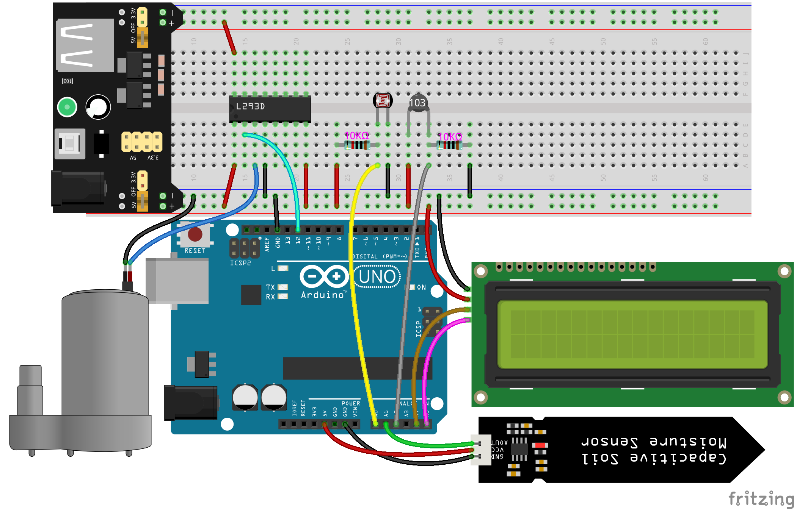
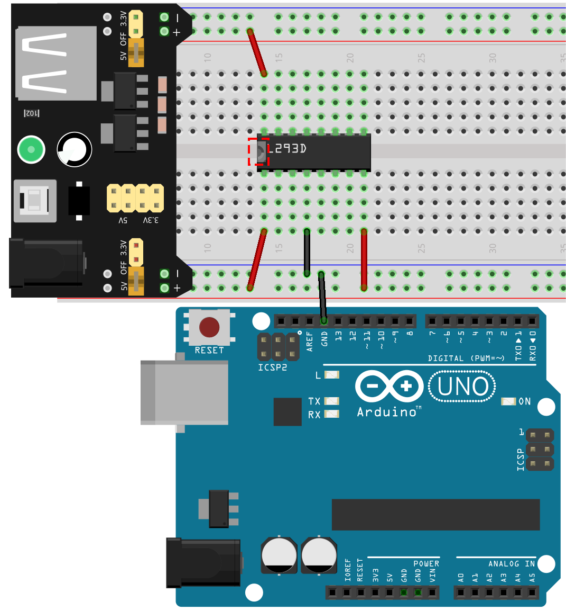
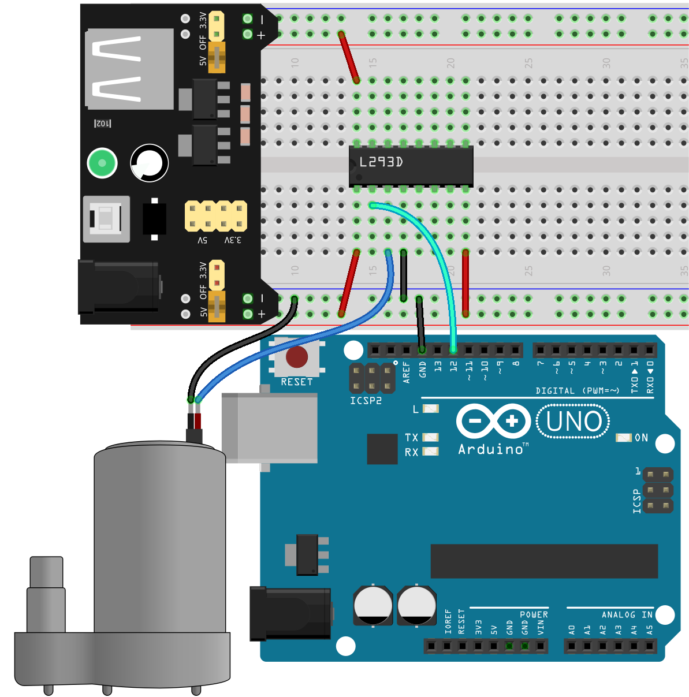
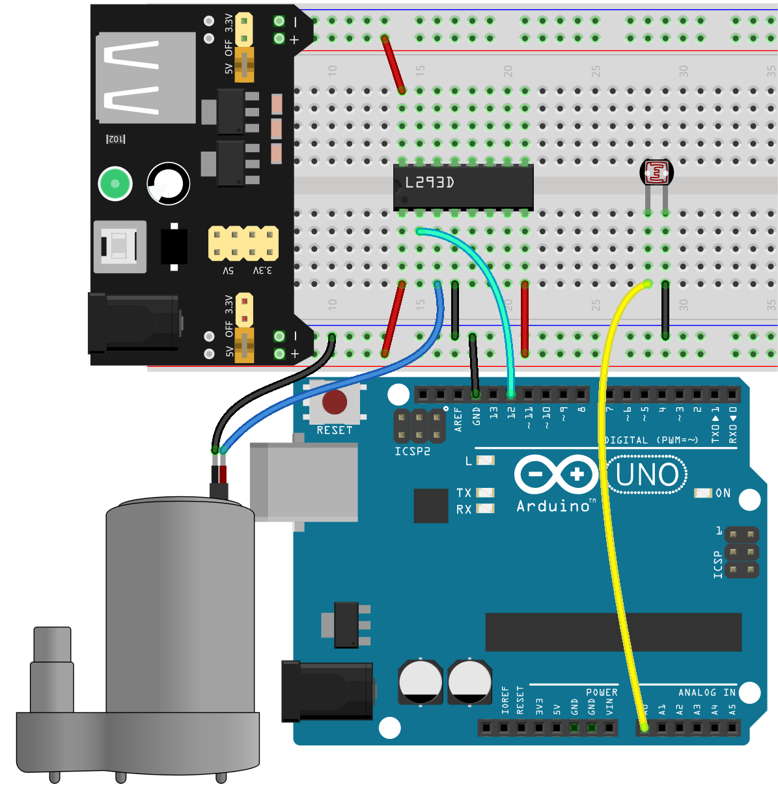
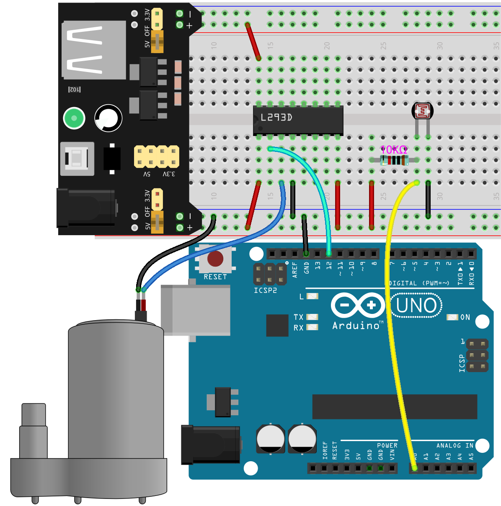
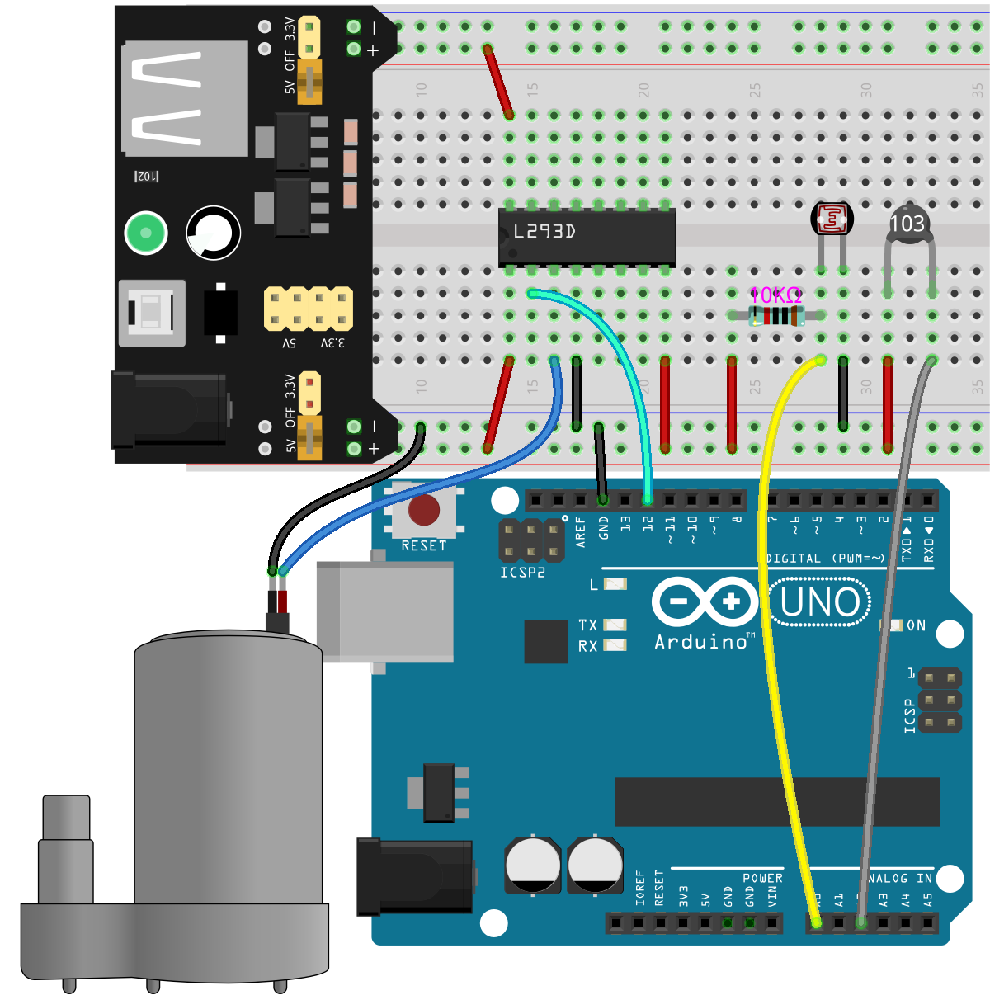
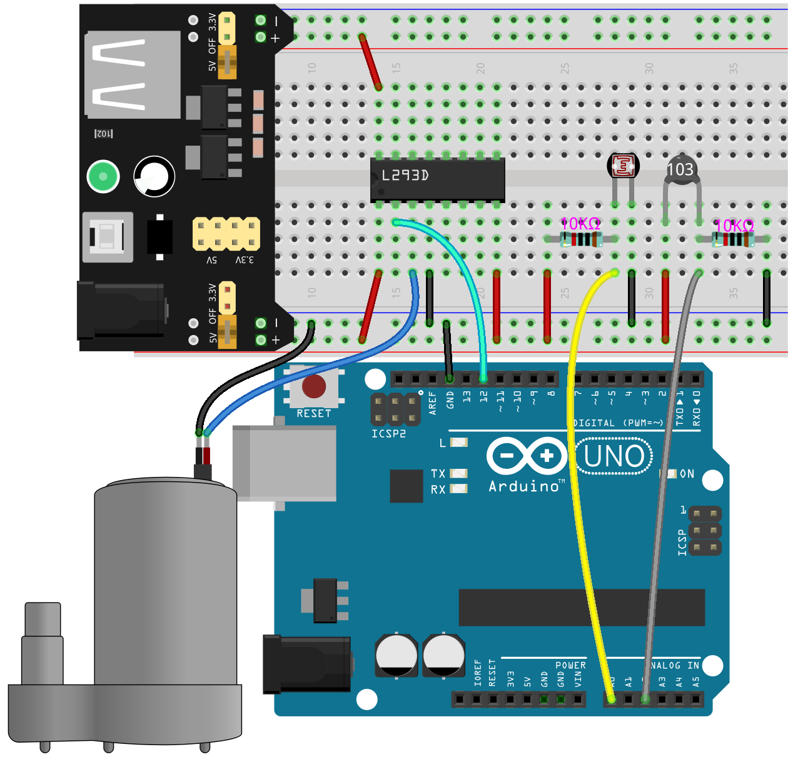

.. note::

    Hallo und willkommen in der SunFounder Raspberry Pi & Arduino & ESP32 Enthusiasten-Community auf Facebook! Tauche tiefer in die Welt von Raspberry Pi, Arduino und ESP32 zusammen mit anderen Enthusiasten ein.

    **Warum beitreten?**

    - **Expertenunterstützung**: Löse nach dem Kauf auftretende Probleme und technische Herausforderungen mit Hilfe unserer Community und unseres Teams.
    - **Lernen & Teilen**: Tausche Tipps und Tutorials aus, um deine Fähigkeiten zu verbessern.
    - **Exklusive Vorschauen**: Erhalte frühzeitigen Zugang zu neuen Produktankündigungen und exklusiven Einblicken.
    - **Spezielle Rabatte**: Profitiere von exklusiven Rabatten auf unsere neuesten Produkte.
    - **Festliche Aktionen und Verlosungen**: Nimm an Verlosungen und Feiertagsaktionen teil.

    👉 Bereit, mit uns zu erkunden und zu kreieren? Klicke auf [|link_sf_facebook|] und tritt noch heute bei!

29. Pflanzenmonitor
=========================

Willkommen zu unserer interaktiven Lektion zum Bau eines Pflanzenmonitors mit Arduino! In dieser Lektion tauchst du in die Welt der elektronischen Komponenten ein und lernst, wie du ein Pflanzenüberwachungssystem von Grund auf zusammenstellst.

Dieses Projekt bewässert Pflanzen automatisch, indem es eine Wasserpumpe aktiviert, wenn die Bodenfeuchtigkeit unter einen bestimmten Schwellenwert fällt. Zusätzlich werden Temperatur, Lichtwert und Bodenfeuchtigkeit auf einem LCD-Bildschirm angezeigt, sodass Nutzer Einblicke in die Wachstumsumgebung der Pflanze erhalten.

.. raw:: html

     <video controls style = "max-width:90%">
        <source src="_static/video/29_plant_monitor.mp4" type="video/mp4">
        Your browser does not support the video tag.
    </video>

In dieser Lektion wirst du lernen:

* Verstehen, wie das Bodenfeuchtigkeitsmodul funktioniert.
* Erlernen, wie man diese Sensoren mit Arduino integriert, um Umweltvariablen zu überwachen, die die Pflanzengesundheit beeinflussen.

Schaltung aufbauen
-----------------------

**Benötigte Komponenten**

.. list-table:: 
   :widths: 25 25 25 25
   :header-rows: 0

   * - 1 * Arduino Uno R3
     - 1 * I2C LCD1602
     - 1 * Thermistor
     - 1 * Fotowiderstand
   * - |list_uno_r3| 
     - |list_i2c_lcd1602|
     - |list_thermistor|
     - |list_photoresistor|
   * - Bodenfeuchtigkeitsmodul
     - 1 * Pumpe
     - 2 * 10KΩ Widerstand
     - 1 * L293D Chip
   * - |list_moisture_module|
     - |list_pump|
     - |list_10kohm|
     - |list_l293d|
   * - Jumperkabel
     - 1 * USB-Kabel
     - 1 * Breadboard
     - 1 * Breadboard-Powermodul
   * - |list_wire|
     - |list_usb_cable|
     - |list_breadboard|
     - |list_power_module|
   * - 1 * 9V Batterie
     - 1 * Batteriekabel
     - 
     -  
   * - |list_battery| 
     - |list_bat_cable| 
     -
     -

**Schritt-für-Schritt-Aufbau**

Folge dem Schaltplan oder den folgenden Schritten, um deine Schaltung aufzubauen.

1. Zuerst das Breadboard-Powermodul in das Breadboard einstecken, dann mit einem Jumperkabel die negative Schiene des Breadboards mit dem GND des Arduino Uno R3 verbinden, um eine gemeinsame Masse zu erreichen.

.. image:: img/14_dinosaur_power_module.png
    :width: 400
    :align: center

.. note::

    Die Reihenfolge der positiven und negativen Anschlüsse auf dem Breadboard im Verdrahtungsdiagramm ist im Vergleich zum im Kit enthaltenen Breadboard umgekehrt.

    Beim tatsächlichen Verdrahten musst du das Breadboard-Powermodul von der höheren Nummerierungsseite (60-65) einstecken, damit das "-" des Powermoduls in die negative Schiene "-" des Breadboards und das "+" in die positive Schiene "+" geht.

    .. raw:: html

        <video controls style = "max-width:100%">
            <source src="_static/video/about_power_module.mp4" type="video/mp4">
            Your browser does not support the video tag.
        </video>

2. Verbinde die Pins des L293D-Chips wie folgt:

* **1(1,2EN)**: Mit der positiven Schiene des Breadboards verbinden, um den Chip zu aktivieren.
* **4(GND)**: Mit der negativen Schiene des Breadboards verbinden, um den Chip zu erden.
* **8(VCC2)**: Mit der positiven Schiene des Breadboards verbinden, um den Motor mit Strom zu versorgen.
* **16(VCC1)**: Mit der positiven Schiene des Breadboards verbinden, um den Chip mit Strom zu versorgen.

3. Im Gegensatz zu Motoren haben Wasserpumpen keine Drehrichtung. Sie benötigen lediglich einen Spannungsunterschied zwischen zwei Pins, um Wasser zu pumpen. Daher verbinde Pin 2 (1A) des L293D mit Pin 12 des Arduino Uno R3 und Pin 3 (1Y) mit der Wasserpumpe, wobei der andere Pin der Wasserpumpe mit GND verbunden wird.

* Durch einfaches Setzen von Pin 12 auf HIGH beginnt die Wasserpumpe, Wasser zu pumpen.

4. Setze den Aufbau der Schaltung fort. Verbinde einen Pin des Fotowiderstands mit dem negativen Anschluss des Breadboards und den anderen Pin mit dem A0-Pin des Arduino Uno R3.

5. Stecke einen 10K-Widerstand in denselben Pin, an dem der Fotowiderstand mit A0 verbunden ist.

    
6. Verbinde das andere Ende des 10K-Widerstands mit der positiven Schiene des Breadboards.

7. Schließe den Thermistor ähnlich wie den Fotowiderstand an. Stecke den Thermistor in das Breadboard, verbinde einen Pin mit der positiven Schiene des Breadboards und den anderen mit dem A0-Pin.

8. Stecke einen 10K-Widerstand in den gleichen Pin, an dem der Thermistor mit A2 verbunden ist.

.. image:: img/29_plant_connect_thr_mistor.png
    :width: 500
    :align: center

9. Verbinde das andere Ende des 10K-Widerstands mit der negativen Schiene des Breadboards.

10. Verbinde das I2C LCD1602 Modul: GND mit der negativen Schiene des Breadboards, VCC mit der positiven Schiene des Breadboards, SDA mit Pin A4 und SCL mit Pin A5.

    .. image:: img/29_plant_connect_lcd.png
        :width: 800
        :align: center

11. Finde das Bodenfeuchtigkeitsmodul, ein Modul, das bisher noch nicht verwendet wurde und zur Erkennung der Bodenfeuchtigkeit dient.

.. image:: img/29_plant_soil_mositure.png
  :width: 500
  :align: center

* **GND**: Masse
* **VCC**: Stromversorgung, 3,3 V ~ 5 V
* **AOUT**: Gibt den Bodenfeuchtigkeitswert aus, je feuchter der Boden, desto kleiner der Wert.

Dieser kapazitive Bodenfeuchtigkeitssensor unterscheidet sich von den meisten resistiven Sensoren auf dem Markt, da er das Prinzip der kapazitiven Induktion zur Erkennung der Bodenfeuchtigkeit verwendet. Dadurch wird das Problem der Korrosionsanfälligkeit resistiver Sensoren vermieden und die Lebensdauer erheblich verlängert.

Er besteht aus korrosionsbeständigen Materialien und hat eine ausgezeichnete Lebensdauer. Setze ihn in die Erde rund um die Pflanzen ein und überwache die Bodenfeuchtigkeit in Echtzeit. Je höher die Bodenfeuchtigkeit, desto höher die Kapazität des Sensors, was die Spannung an der Signalleitung reduziert und den Wert des analogen Eingangs durch den Mikrocontroller verringert. Das Modul verfügt über einen integrierten Spannungsregler, der einen Betrieb im Spannungsbereich von 3,3 ~ 5,5 V ermöglicht.

12. Schließe ihn nun an die Schaltung an. Idealerweise verbindest du VCC und GND mit den positiven und negativen Anschlüssen des Breadboards. Um jedoch Kabel über das Arduino-Board zu vermeiden und Interferenzen zu vermeiden, verbinde VCC und GND mit den 5V- und GND-Pins des Arduino-Boards.

Codeerstellung - Bodenfeuchtigkeit auslesen
---------------------------------------------
Nun beginnen wir mit dem Schreiben des Codes, um die Werte vom Bodenfeuchtigkeitssensor auszulesen.

1. Öffne die Arduino IDE und starte ein neues Projekt, indem du "Neue Skizze" aus dem Menü "Datei" auswählst.
2. Speichere deine Skizze unter dem Namen ``Lesson29_Read_Soil_Moisture`` mit ``Ctrl + S`` oder durch Klicken auf "Speichern".

3. Beginne jetzt mit dem Schreiben des Codes, um die Werte vom Bodenfeuchtigkeitsmodul auszulesen.

.. code-block:: Arduino

  const int moisturePin = A1;  // Definiert den Pin, an dem der Bodenfeuchtigkeitssensor angeschlossen ist

  void setup() {
    Serial.begin(9600);  // Initialisiert die serielle Kommunikation mit einer Baudrate von 9600
  }

  void loop() {
    int moistureValue = analogRead(moisturePin);  // Liest den analogen Wert vom Feuchtigkeitssensor aus
    Serial.print("Moisture Value: ");
    Serial.println(moistureValue);  // Gibt den Rohwert des Sensors zur Beobachtung auf dem seriellen Monitor aus

    delay(1000);  // Verzögert die nächste Messung um eine Sekunde, um Datenflut zu vermeiden
  }

4. Nach dem Ausführen des Codes musst du das Bodenfeuchtigkeitsmodul in den Boden einsetzen. Wenn du den Boden bewässerst, wirst du feststellen, dass die angezeigten Werte sinken. Zudem verändert sich die Bodenfeuchtigkeit nicht linear, sondern allmählich.

.. code-block:: Arduino

  Moisture Value: 438
  Moisture Value: 438
  Moisture Value: 378
  Moisture Value: 354
  Moisture Value: 323
  Moisture Value: 210

**Frage**

Im bereitgestellten Code verstehen wir, dass ein höherer Feuchtigkeitsgehalt zu einem niedrigeren Sensorwert führt und dass Feuchtigkeit typischerweise als Prozentsatz ausgedrückt wird. Wie können wir den Code modifizieren, um den Bodenfeuchtigkeitsgehalt als Prozentsatz anzuzeigen?

Codeerstellung - Pflanzenmonitor
---------------------------------------------
Aus dem vorherigen Projekt haben wir die Datenänderungen des Bodenfeuchtigkeitsmoduls verstanden. Jetzt verwenden wir das Bodenfeuchtigkeitsmodul, den Fotowiderstand, den Thermistor, die Wasserpumpe und das I2C LCD1602, um ein Pflanzenüberwachungssystem zu erstellen.

* Der Thermistor wird zur Temperaturerfassung verwendet und zeigt sowohl Celsius als auch Fahrenheit auf dem LCD an.
* Der Fotowiderstand wird zur Erfassung der Lichtverhältnisse verwendet und auf dem LCD angezeigt.
* Das Bodenfeuchtigkeitsmodul wird verwendet, um den Prozentsatz der Bodenfeuchtigkeit zu erfassen und auf dem LCD anzuzeigen.
* Wenn die erfasste Bodenfeuchtigkeit unter 35% liegt, arbeitet die Wasserpumpe für 3 Sekunden, und wenn die nächste Überprüfung immer noch unter 35% anzeigt, arbeitet sie erneut für 3 Sekunden. Mehrere kurze Bewässerungsvorgänge werden verwendet, um den eingestellten Bodenfeuchtigkeitswert zu erreichen.

Nun lassen Sie uns den Code schreiben, um die gewünschten Effekte zu erzielen.

.. note::

  Wenn du mit dem Thermistor, Fotowiderstand, der Pumpe oder dem I2C LCD1602 nicht vertraut bist, kannst du deren Grundfunktionen zuerst in den folgenden Projekten erlernen:

  * :ref:`ar_temperature`
  * :ref:`ar_photoresistor`
  * :ref:`automatic_soap_dispenser` 
  * :ref:`ar_i2c_lcd1602`

  Hier wird die ``LiquidCrystal I2C``-Bibliothek verwendet, die du im **Bibliotheks-Manager** installieren kannst.

1. Öffne die Arduino IDE und starte ein neues Projekt, indem du "Neue Skizze" aus dem Menü "Datei" auswählst.
2. Speichere deine Skizze unter dem Namen ``Lesson29_plant_monitor`` mit ``Ctrl + S`` oder durch Klicken auf "Speichern".

3. Nun, lass uns mit dem Codieren beginnen. Inkludiere die Bibliothek, die für das I2C LCD1602 benötigt wird, initialisiere dann dessen Adresse und Anzeige und definiere als Nächstes die Pins für jeden Sensor.

.. code-block:: Arduino

  #include <Wire.h>               // Inkludiert die I2C-Kommunikationsbibliothek
  #include <LiquidCrystal_I2C.h>  // Inkludiert die Bibliothek zur Steuerung des I2C LCD

  LiquidCrystal_I2C lcd(0x27, 16, 2);  // Initialisiert das LCD mit der Adresse 0x27 für ein 16x2 Display

  const int lightSensorPin = A0;  // Lichtsensor
  const int moisturePin = A1;     // Bodenfeuchtigkeitssensor
  const int tempSensorPin = A2;   // NTC-Thermistor
  const int pumpPin = 12;         // Pumpe

4. Als nächstes definieren wir die benötigten Parameter für den Thermistor.

.. code-block:: Arduino
  :emphasize-lines: 13

  #include <Wire.h>               // Inkludiert die I2C-Kommunikationsbibliothek
  #include <LiquidCrystal_I2C.h>  // Inkludiert die Bibliothek zur Steuerung des I2C LCD

  LiquidCrystal_I2C lcd(0x27, 16, 2);  // Initialisiert das LCD mit der Adresse 0x27 für ein 16x2 Display

  const int lightSensorPin = A0;  // Lichtsensor
  const int moisturePin = A1;     // Bodenfeuchtigkeitssensor
  const int tempSensorPin = A2;   // NTC-Thermistor
  const int pumpPin = 12;         // Pumpe

  // Konstanten für die Temperaturberechnung
  const float beta = 3950.0;               // Beta-Wert des NTC-Thermistors
  const float seriesResistor = 10000;      // Wert des Serienwiderstands (Ohm)
  const float roomTempResistance = 10000;  // Widerstand des NTC bei 25°C
  const float roomTemp = 25 + 273.15;      // Raumtemperatur in Kelvin

5. In der Funktion ``void setup()``, setze den Pin für die Wasserpumpe auf Ausgang und initialisiere das LCD-Display. Die analogen Pins sind standardmäßig im Eingangsmodus, daher musst du den Ein-/Ausgangsmodus nicht manuell einstellen.

.. code-block:: Arduino

  void setup() {
    pinMode(pumpPin, OUTPUT);  // Setzt den Pumpenpin auf Ausgang
    lcd.init();                // Initialisiert das LCD-Display
    lcd.backlight();           // Schaltet die Hintergrundbeleuchtung des LCD für bessere Sichtbarkeit ein
  }

6. In der Funktion ``loop()`` die Werte des Fotowiderstands, des Thermistors und des Bodenfeuchtigkeitsmoduls auslesen und in den entsprechenden Variablen speichern. Verwende die Funktion ``map()``, um die Bodenfeuchtigkeit in einen Prozentsatz umzuwandeln.

.. code-block:: Arduino
  :emphasize-lines: 3-5,8

  void loop() {
    // Sensoren auslesen
    int tempValue = analogRead(tempSensorPin);
    int lightValue = analogRead(lightSensorPin);
    int moistureValue = analogRead(moisturePin);

    // Bodenfeuchtigkeitsprozentsatz berechnen
    float moisturePercent = map(moistureValue, 0, 1023, 100, 0);
  }

7. Als Nächstes den Wert des Thermistors in Celsius- und Fahrenheit-Temperaturen umrechnen.

.. code-block:: Arduino
  :emphasize-lines: 11-14

  void loop() {
    // Sensoren auslesen
    int tempValue = analogRead(tempSensorPin);
    int lightValue = analogRead(lightSensorPin);
    int moistureValue = analogRead(moisturePin);

    // Bodenfeuchtigkeitsprozentsatz berechnen
    float moisturePercent = map(moistureValue, 0, 1023, 100, 0);

    // Temperatur in Celsius berechnen
    float resistance = (1023.0 / tempValue - 1) * seriesResistor;
    float tempK = 1 / (log(resistance / roomTempResistance) / beta + 1 / roomTemp);
    float tempC = tempK - 273.15;
    float tempF = tempC * 9.0 / 5.0 + 32.0;
  }

8. Nun die Daten auf dem I2C-LCD anzeigen. Zuerst mit der Funktion ``lcd.clear()`` die Daten auf dem LCD löschen, dann die Celsius-Temperatur in der ersten Zeile und die Fahrenheit-Temperatur in der zweiten Zeile für 2 Sekunden anzeigen.

.. code-block:: Arduino
  :emphasize-lines: 8-15

  // Temperatur in Celsius berechnen
  float resistance = (1023.0 / tempValue - 1) * seriesResistor;
  float tempK = 1 / (log(resistance / roomTempResistance) / beta + 1 / roomTemp);
  float tempC = tempK - 273.15;
  float tempF = tempC * 9.0 / 5.0 + 32.0;

  // Temperatur anzeigen
  lcd.clear();
  lcd.setCursor(0, 0);
  lcd.print("Temp C: ");
  lcd.print(tempC);
  lcd.setCursor(0, 1);
  lcd.print("Temp F: ");
  lcd.print(tempF);
  delay(2000);

9. Als Nächstes die Lichtdaten in der ersten Zeile und den Feuchtigkeitsprozentsatz in der zweiten Zeile ebenfalls für 2 Sekunden anzeigen.

.. code-block:: Arduino
  :emphasize-lines: 12-20

  // Temperatur anzeigen
  lcd.clear();
  lcd.setCursor(0, 0);
  lcd.print("Temp C: ");
  lcd.print(tempC);
  lcd.setCursor(0, 1);
  lcd.print("Temp F: ");
  lcd.print(tempF);
  delay(2000);

  // Licht und Bodenfeuchtigkeit anzeigen
  lcd.clear();
  lcd.setCursor(0, 0);
  lcd.print("Light: ");
  lcd.print(lightValue);
  lcd.setCursor(0, 1);
  lcd.print("Soil: ");
  lcd.print(moisturePercent);
  lcd.print("%");
  delay(2000);

10. Verwende anschließend eine ``if``-Anweisung, um den Betrieb der Wasserpumpe zu steuern. Sie soll das Wasser für 3 Sekunden pumpen, wenn die Feuchtigkeit unter 35 % liegt. Du kannst diesen Schwellenwert jedoch an die tatsächlichen Bedingungen anpassen. Nachdem die Pumpe stoppt, rufe ``lcd.init()`` auf, um das LCD neu zu initialisieren und Anzeigefehler zu vermeiden.

.. code-block:: Arduino
  :emphasize-lines: 2-7

  // Pumpe steuern, wenn die Bodenfeuchtigkeit unter 35 % liegt
  if (moisturePercent < 35) {
    digitalWrite(pumpPin, HIGH);  // Pumpe einschalten
    delay(3000);
    digitalWrite(pumpPin, LOW);  // Pumpe ausschalten
    lcd.init(); // LCD neu initialisieren, um Anzeigefehler zu vermeiden
  }

11. Dein vollständiger Code wird unten angezeigt. Du kannst ihn auf das Arduino-Board hochladen und überprüfen, ob die gewünschten Effekte erzielt werden.

.. code-block:: Arduino

  #include <Wire.h>               // I2C-Kommunikationsbibliothek einbinden
  #include <LiquidCrystal_I2C.h>  // Bibliothek zur Steuerung des I2C-LCDs einbinden

  LiquidCrystal_I2C lcd(0x27, 16, 2);  // Initialisiert das LCD mit der Adresse 0x27 für ein 16x2 Display

  const int lightSensorPin = A0;  // Lichtsensor
  const int moisturePin = A1;     // Bodenfeuchtigkeitssensor
  const int tempSensorPin = A2;   // NTC-Thermistor
  const int pumpPin = 12;         // Pumpe

  // Konstanten zur Temperaturberechnung
  const float beta = 3950.0;               // Beta-Wert des NTC-Thermistors
  const float seriesResistor = 10000;      // Serienwiderstand (Ohm)
  const float roomTempResistance = 10000;  // Widerstand des NTC bei 25°C
  const float roomTemp = 25 + 273.15;      // Raumtemperatur in Kelvin

  void setup() {
    pinMode(pumpPin, OUTPUT);  // Setzt den Pumpen-Pin auf Ausgang
    lcd.init();                // Initialisiert das LCD-Display
    lcd.backlight();           // Schaltet die Hintergrundbeleuchtung des LCDs für bessere Sichtbarkeit ein
  }

  void loop() {
    // Sensoren auslesen
    int tempValue = analogRead(tempSensorPin);
    int lightValue = analogRead(lightSensorPin);
    int moistureValue = analogRead(moisturePin);

    // Bodenfeuchtigkeitsprozentsatz berechnen
    float moisturePercent = map(moistureValue, 0, 1023, 100, 0);

    // Temperatur in Celsius berechnen
    float resistance = (1023.0 / tempValue - 1) * seriesResistor;
    float tempK = 1 / (log(resistance / roomTempResistance) / beta + 1 / roomTemp);
    float tempC = tempK - 273.15;
    float tempF = tempC * 9.0 / 5.0 + 32.0;

    // Temperatur anzeigen
    lcd.clear();
    lcd.setCursor(0, 0);
    lcd.print("Temp C: ");
    lcd.print(tempC);
    lcd.setCursor(0, 1);
    lcd.print("Temp F: ");
    lcd.print(tempF);
    delay(2000);

    // Licht und Bodenfeuchtigkeit anzeigen
    lcd.clear();
    lcd.setCursor(0, 0);
    lcd.print("Light: ");
    lcd.print(lightValue);
    lcd.setCursor(0, 1);
    lcd.print("Soil: ");
    lcd.print(moisturePercent);
    lcd.print("%");
    delay(2000);

    // Pumpe steuern, wenn die Bodenfeuchtigkeit unter 35 % liegt
    if (moisturePercent < 35) {
      digitalWrite(pumpPin, HIGH);  // Pumpe einschalten
      delay(3000);
      digitalWrite(pumpPin, LOW);  // Pumpe ausschalten
      lcd.init(); // LCD neu initialisieren, um Anzeigefehler zu vermeiden
    }
  }

12. Vergiss nicht, deinen Code zu speichern und deinen Arbeitsplatz aufzuräumen.

**Frage**

Wie könntest du das System verbessern oder anpassen, wenn die Sensoren langsamer oder zu schnell auf Umweltveränderungen reagieren?

**Zusammenfassung**

In der heutigen Lektion hast du erfolgreich einen Pflanzenmonitor mit Arduino gebaut und programmiert. Dieses Projekt hat dich nicht nur mit einer Vielzahl von Sensoren und Komponenten vertraut gemacht, sondern auch gezeigt, wie diese Elemente integriert werden können, um ein praktisches Gerät zu erstellen. Durch praxisnahes Lernen hast du beobachtet, wie Daten aus der realen Welt gesammelt und genutzt werden können, um fundierte Entscheidungen zur Pflanzenpflege zu treffen. Indem du die Umgebung deiner Pflanzen aktiv kontrollierst, hast du einen großen Schritt in Richtung Automatisierung ihrer Pflege gemacht und sicherstellst, dass sie unter optimalen Bedingungen wachsen.
