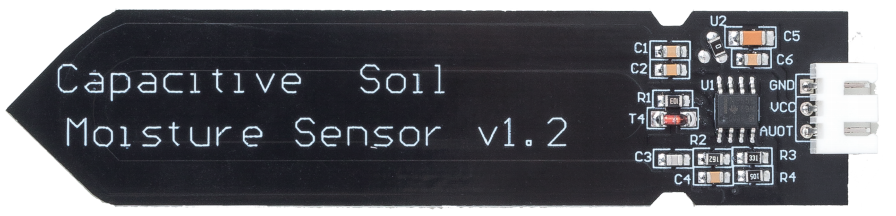

.. note::

    Hello, welcome to the SunFounder Raspberry Pi & Arduino & ESP32 Enthusiasts Community on Facebook! Dive deeper into Raspberry Pi, Arduino, and ESP32 with fellow enthusiasts.

    **Why Join?**

    - **Expert Support**: Solve post-sale issues and technical challenges with help from our community and team.
    - **Learn & Share**: Exchange tips and tutorials to enhance your skills.
    - **Exclusive Previews**: Get early access to new product announcements and sneak peeks.
    - **Special Discounts**: Enjoy exclusive discounts on our newest products.
    - **Festive Promotions and Giveaways**: Take part in giveaways and holiday promotions.

    👉 Ready to explore and create with us? Click [|link_sf_facebook|] and join today!

29. Plant Monitor
=========================

Welcome to our interactive lesson on building a Plant Monitor using Arduino! In this lesson, you'll dive into the world of electronic components and learn how to assemble a plant monitoring system from scratch.

This project automatically waters plants by activating a water pump when the soil moisture falls below a specific threshold. Additionally, it displays temperature, light value, and soil moisture on an LCD screen, providing users with insights into the plant's growth environment.

.. raw:: html

     <video controls style = "max-width:90%">
        <source src="_static/video/29_plant_monitor.mp4" type="video/mp4">
        Your browser does not support the video tag.
    </video>

In this lesson, you will able to:

* Understand the workings of the soil moisture module.
* Learn to integrate these sensors with Arduino to monitor environmental variables affecting plant health.

Building the Circuit
-----------------------

**Components Needed**

.. list-table:: 
   :widths: 25 25 25 25
   :header-rows: 0

   * - 1 * Arduino Uno R3
     - 1 * I2C LCD1602
     - 1 * Thermistor
     - 1 * Photoresistor
   * - |list_uno_r3| 
     - |list_i2c_lcd1602|
     - |list_thermistor|
     - |list_photoresistor|
   * - Soil Moisture Module
     - 1 * Pump
     - 2 * 10KΩ Resistor
     - 1 * L293D Chip
   * - |list_moisture_module|
     - |list_pump|
     - |list_10kohm|
     - |list_l293d|
   * - Jumper Wires
     - 1 * USB Cable
     - 1 * Breadboard
     - 1 * Breadboard Power Module
   * - |list_wire|
     - |list_usb_cable|
     - |list_breadboard|
     - |list_power_module|
   * - 1 * 9V Battery
     - 1 * Battery Cable
     - 
     -  
   * - |list_battery| 
     - |list_bat_cable| 
     -
     -

**Building Step-by-Step**

Follow the wiring diagram, or the steps below to build your circuit.

.. image:: img/29_plant_connect_mositure.png
  :width: 800
  :align: center

1. First, insert the breadboard power module into the breadboard, then use a jumper wire to connect the negative rail of the breadboard to the GND of the Arduino Uno R3 to achieve a common ground.

.. image:: img/14_dinosaur_power_module.png
    :width: 400
    :align: center

.. note::

    The order of the positive and negative terminals on the breadboard in the wiring diagram is reversed compared to the breadboard provided in the kit.

    In actual wiring, you need to insert the breadboard power module from the higher number side (60-65) so that the "-" of the power module goes into the negative rail "-" of the breadboard, and the "+" into the positive rail "+".

    .. raw:: html

        <video controls style = "max-width:100%">
            <source src="_static/video/about_power_module.mp4" type="video/mp4">
            Your browser does not support the video tag.
        </video>

2. Connect the pins of the L293D chip as follows.

* **1(1,2EN)**: Connect to the positive rail of the breadboard to enable the chip.
* **4(GND)**: Connect to the negative rail of the breadboard to ground the chip.
* **8(VCC2)**: Connect to the positive rail of the breadboard to provide power to the motor.
* **16(VCC1)**: Connect to the positive rail of the breadboard to power the chip.

3. Unlike motors, water pumps do not have a direction of rotation to distinguish. They just need a voltage difference across two pins to start pumping water. Therefore, connect pin 2 (1A) of the L293D to pin 12 on the Arduino Uno R3, and pin 3 (1Y) to the water pump, with the other pin of the water pump going to GND.

* By simply setting pin 12 to high, the water pump will start pumping water.

.. image:: img/29_plant_connect_pump.png
  :width: 500
  :align: center

4. Continue building the circuit. Connect one pin of the photoresistor to the negative terminal of the breadboard and the other pin to the A0 pin on the Arduino Uno R3.

.. image:: img/29_plant_phr.png
    :width: 500
    :align: center

5. Insert a 10K resistor in the same pin as the photoresistor's connection to A0.

.. image:: img/29_plant_phr_resistor.png
    :width: 500
    :align: center

6. Connect the other pin of the 10K resistor to the positive terminal of the breadboard.

.. image:: img/29_plant_phr_vcc.png
    :width: 500
    :align: center

7. Involves connecting a thermistor similarly to a photoresistor. Insert the thermistor into the breadboard, connect one pin to the positive rail of the breadboard and another to the A0 pin.

8. Insert a 10K resistor in the same pin as the thermistor's connection to A2.

.. image:: img/29_plant_connect_thr_mistor.png
    :width: 500
    :align: center

9. Connect the other pin of the 10K resistor to the negative terminal of the breadboard.

10. Connect the I2C LCD1602 module: GND to the negative rail on the breadboard, VCC to the positive rail on the breadboard, SDA to pin A4, and SCL to pin A5.

    .. image:: img/29_plant_connect_lcd.png
        :width: 800
        :align: center

11. Find the soil moisture module, which is a module that hasn't been used before, designed for detecting soil moisture.

* **GND**: Ground
* **VCC**: Power supply, 3.3v~5V
* **AOUT**: Outputs the soil moisture value, the wetter the soil, the smaller its value.

This capacitive soil moisture sensor is different from most of the resistive sensors on the market, using the principle of capacitive induction to detect soil moisture. It avoids the problem that resistive sensors are highly susceptible to corrosion and greatly extends its working life.

It is made of corrosion-resistant materials and has an excellent service life. Insert it into the soil around plants and monitor real-time soil moisture data, the higher the soil moisture, the higher the capacitance of the sensor, which reduces the voltage on the signal line, and the smaller the value of the analog input through the microcontroller. The module includes an on-board voltage regulator that allows it to operate over a voltage range of 3.3 ~ 5.5 V.

12. Now connect it to the circuit. Ideally, connect its VCC and GND to the positive and negative terminals of the breadboard respectively. But to avoid crossing wires over the Arduino board and causing interference, connect its VCC and GND to the Arduino board's 5V and GND pins.

.. image:: img/29_plant_connect_mositure.png
  :width: 800
  :align: center

Code Creation - Read Soil Moisture
---------------------------------------------
Now start writing the code to read the values from the soil moisture sensor.

1. Open the Arduino IDE and start a new project by selecting “New Sketch” from the “File” menu.
2. Save your sketch as ``Lesson29_Read_Soil_Noisture`` using ``Ctrl + S`` or by clicking “Save”.

3. Now start writing the code to read the values from the soil moisture module.

.. code-block:: Arduino

  const int moisturePin = A1;  // Define the pin where the soil moisture sensor is connected

  void setup() {
    Serial.begin(9600);  // Initialize serial communication at 9600 baud rate
  }

  void loop() {
    int moistureValue = analogRead(moisturePin);  // Read the analog value from the moisture sensor
    Serial.print("Moisture Value: ");
    Serial.println(moistureValue);  // Output the raw sensor value to the serial monitor for observation

    delay(1000);  // Delay for one second before the next reading to reduce data flooding
  }

4. After running the code, you need to insert the soil moisture module into the soil. When you water the soil, you will notice that the displayed readings decrease. Moreover, the change in soil moisture is not linear and happens slowly.

.. code-block:: Arduino

  Moisture Value: 438
  Moisture Value: 438
  Moisture Value: 378
  Moisture Value: 354
  Moisture Value: 323
  Moisture Value: 210

**Question**

In the code provided, we understand that higher moisture content results in a lower sensor value, and moisture is typically expressed as a percentage. How can we modify the code to display the soil moisture level as a percentage?

Code Creation - Plant Monitor
---------------------------------------------
From the previous project, we have understood the data changes of the soil moisture module, now let's use the soil moisture module, photoresistor, thermistor, water pump, and I2C LCD1602 to create a plant monitoring system.

* The thermistor is used to detect temperature and displays both Celsius and Fahrenheit on the LCD.
* The photoresistor is used to detect light conditions and display it on the LCD.
* The soil moisture module is used to detect the percentage of soil moisture and display it on the LCD.
* When the detected soil moisture is below 35%, the water pump operates for 3 seconds, and if the next check still shows below 35%, it operates again for 3 seconds. Multiple short watering sessions are used to reach the set soil moisture threshold.

Now, let's write the code to see how to implement the desired effects.

.. note::

  If you are not familiar with the Thermistor, Photoresistor, Pump or I2C LCD1602, you can first learn their basic usage through the following projects:

  * :ref:`ar_temperature`
  * :ref:`ar_photoresistor`
  * :ref:`automatic_soap_dispenser` 
  * :ref:`ar_i2c_lcd1602`

  ``LiquidCrystal I2C`` library is used here, you can install it from the **Library Manager**.

1. Open the Arduino IDE and start a new project by selecting “New Sketch” from the “File” menu.
2. Save your sketch as ``Lesson29_plant_monitor`` using ``Ctrl + S`` or by clicking “Save”.

3. Now, let's start coding. Include the library needed for the I2C LCD1602 and then initialize its address and display, next define the pins for each sensor.

.. code-block:: Arduino

  #include <Wire.h>               // Includes I2C communication library
  #include <LiquidCrystal_I2C.h>  // Includes library for controlling the I2C LCD

  LiquidCrystal_I2C lcd(0x27, 16, 2);  // Initializes LCD at address 0x27 for a 16x2 display

  const int lightSensorPin = A0;  // Light sensor
  const int moisturePin = A1;     // Soil moisture sensor
  const int tempSensorPin = A2;   // NTC thermistor
  const int pumpPin = 12;         // Pump

4. Next, define the parameters needed for the thermistor.

.. code-block:: Arduino
  :emphasize-lines: 13

  #include <Wire.h>               // Includes I2C communication library
  #include <LiquidCrystal_I2C.h>  // Includes library for controlling the I2C LCD

  LiquidCrystal_I2C lcd(0x27, 16, 2);  // Initializes LCD at address 0x27 for a 16x2 display

  const int lightSensorPin = A0;  // Light sensor
  const int moisturePin = A1;     // Soil moisture sensor
  const int tempSensorPin = A2;   // NTC thermistor
  const int pumpPin = 12;         // Pump

  // Constants for temperature calculation
  const float beta = 3950.0;               // NTC thermistor's Beta value
  const float seriesResistor = 10000;      // Series resistor value (ohms)
  const float roomTempResistance = 10000;  // NTC resistance at 25°C
  const float roomTemp = 25 + 273.15;      // Room temperature in Kelvin

5. In the ``void setup()`` function, set the water pump pin to output and initialize the LCD display. The analog pins are by default in input mode, so you don't need to manually set the input/output mode.

.. code-block:: Arduino

  void setup() {
    pinMode(pumpPin, OUTPUT);  // Sets the pump pin as output
    lcd.init();                // Initializes LCD display
    lcd.backlight();           // Turns on LCD backlight for visibility
  }

6. In the ``loop()`` function, read the values from the photoresistor, thermistor, and soil moisture module, and store them in corresponding variables. Convert the soil moisture into a percentage using the ``map()`` function.

.. code-block:: Arduino
  :emphasize-lines: 3-5,8

  void loop() {
    // Read sensors
    int tempValue = analogRead(tempSensorPin);
    int lightValue = analogRead(lightSensorPin);
    int moistureValue = analogRead(moisturePin);

    // Calculate soil moisture percentage
    float moisturePercent = map(moistureValue, 0, 1023, 100, 0);
  }

7. Next, based on the thermistor's value, convert it into Celsius and Fahrenheit temperatures.

.. code-block:: Arduino
  :emphasize-lines: 11-14

  void loop() {
    // Read sensors
    int tempValue = analogRead(tempSensorPin);
    int lightValue = analogRead(lightSensorPin);
    int moistureValue = analogRead(moisturePin);

    // Calculate soil moisture percentage
    float moisturePercent = map(moistureValue, 0, 1023, 100, 0);

    // Calculate temperature in Celsius
    float resistance = (1023.0 / tempValue - 1) * seriesResistor;
    float tempK = 1 / (log(resistance / roomTempResistance) / beta + 1 / roomTemp);
    float tempC = tempK - 273.15;
    float tempF = tempC * 9.0 / 5.0 + 32.0;
  }

8. Now, display the data on the I2C LCD. First, use the ``lcd.clear()`` function to clear the data on the LCD, then display the Celsius temperature on the first line and the Fahrenheit temperature on the second line for 2 seconds.

.. code-block:: Arduino
  :emphasize-lines: 8-15

  // Calculate temperature in Celsius
  float resistance = (1023.0 / tempValue - 1) * seriesResistor;
  float tempK = 1 / (log(resistance / roomTempResistance) / beta + 1 / roomTemp);
  float tempC = tempK - 273.15;
  float tempF = tempC * 9.0 / 5.0 + 32.0;

  // Display Temperature
  lcd.clear();
  lcd.setCursor(0, 0);
  lcd.print("Temp C: ");
  lcd.print(tempC);
  lcd.setCursor(0, 1);
  lcd.print("Temp F: ");
  lcd.print(tempF);
  delay(2000);

9. Next, display the light data on the first line and the moisture percentage on the second line, also for 2 seconds.

.. code-block:: Arduino
  :emphasize-lines: 12-20

  // Display Temperature
  lcd.clear();
  lcd.setCursor(0, 0);
  lcd.print("Temp C: ");
  lcd.print(tempC);
  lcd.setCursor(0, 1);
  lcd.print("Temp F: ");
  lcd.print(tempF);
  delay(2000);

  // Display light and soil moisture
  lcd.clear();
  lcd.setCursor(0, 0);
  lcd.print("Light: ");
  lcd.print(lightValue);
  lcd.setCursor(0, 1);
  lcd.print("Soil: ");
  lcd.print(moisturePercent);
  lcd.print("%");
  delay(2000);

10. Then, use an ``if`` statement to control the water pump operation, set to start pumping water for 3 seconds when the moisture is below 35%, but you can adjust this threshold based on actual conditions. After the pump stops, call ``lcd.init()`` to reinitialize the LCD to prevent display corruption.

.. code-block:: Arduino
  :emphasize-lines: 2-7

  // Control pump if soil moisture is below 35%
  if (moisturePercent < 35) {
    digitalWrite(pumpPin, HIGH);  // Turn on pump
    delay(3000);
    digitalWrite(pumpPin, LOW);  // Turn off pump
    lcd.init(); // Reinitialize LCD to prevent display corruption
  }

11. Your complete code is shown below, you can upload it to the Arduino board and see if it achieves the set effects.

.. code-block:: Arduino

  #include <Wire.h>               // Includes I2C communication library
  #include <LiquidCrystal_I2C.h>  // Includes library for controlling the I2C LCD

  LiquidCrystal_I2C lcd(0x27, 16, 2);  // Initializes LCD at address 0x27 for a 16x2 display

  const int lightSensorPin = A0;  // Light sensor
  const int moisturePin = A1;     // Soil moisture sensor
  const int tempSensorPin = A2;   // NTC thermistor
  const int pumpPin = 12;         // Pump

  // Constants for temperature calculation
  const float beta = 3950.0;               // NTC thermistor's Beta value
  const float seriesResistor = 10000;      // Series resistor value (ohms)
  const float roomTempResistance = 10000;  // NTC resistance at 25°C
  const float roomTemp = 25 + 273.15;      // Room temperature in Kelvin

  void setup() {
    pinMode(pumpPin, OUTPUT);  // Sets the pump pin as output
    lcd.init();                // Initializes LCD display
    lcd.backlight();           // Turns on LCD backlight for visibility
  }

  void loop() {
    // Read sensors
    int tempValue = analogRead(tempSensorPin);
    int lightValue = analogRead(lightSensorPin);
    int moistureValue = analogRead(moisturePin);

    // Calculate soil moisture percentage
    float moisturePercent = map(moistureValue, 0, 1023, 100, 0);

    // Calculate temperature in Celsius
    float resistance = (1023.0 / tempValue - 1) * seriesResistor;
    float tempK = 1 / (log(resistance / roomTempResistance) / beta + 1 / roomTemp);
    float tempC = tempK - 273.15;
    float tempF = tempC * 9.0 / 5.0 + 32.0;

    // Display Temperature
    lcd.clear();
    lcd.setCursor(0, 0);
    lcd.print("Temp C: ");
    lcd.print(tempC);
    lcd.setCursor(0, 1);
    lcd.print("Temp F: ");
    lcd.print(tempF);
    delay(2000);

    // Display light and soil moisture
    lcd.clear();
    lcd.setCursor(0, 0);
    lcd.print("Light: ");
    lcd.print(lightValue);
    lcd.setCursor(0, 1);
    lcd.print("Soil: ");
    lcd.print(moisturePercent);
    lcd.print("%");
    delay(2000);

    // Control pump if soil moisture is below 35%
    if (moisturePercent < 35) {
      digitalWrite(pumpPin, HIGH);  // Turn on pump
      delay(3000);
      digitalWrite(pumpPin, LOW);  // Turn off pump
      lcd.init(); // Reinitialize LCD to prevent display corruption
    }
  }

12. Finally, remember to save your code and tidy up your workspace.

**Question**

How you might improve or adjust the system if the sensors responded more slowly or too quickly to environmental changes.

**Summary**

In today's lesson, you've successfully built and programmed a Plant Monitor using Arduino. This project not only introduced you to a variety of sensors and components but also demonstrated how these elements can be integrated to create a practical device. Through hands-on learning, you've observed how data from the real world can be collected and utilized to make informed decisions about plant care. By controlling the environment of your plants actively, you've taken a big step toward automating their care and ensuring they grow in optimal conditions.

