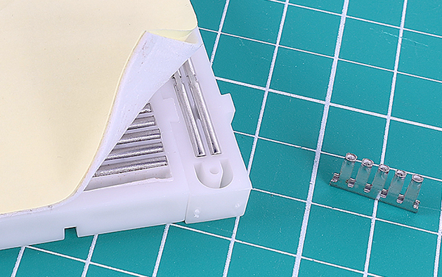
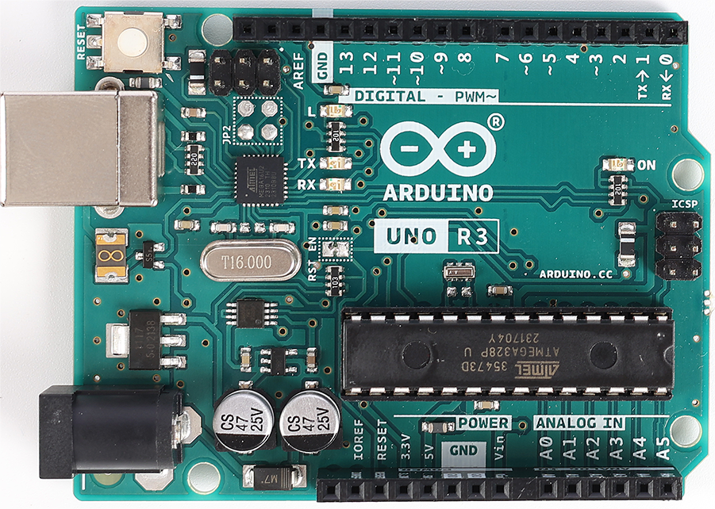
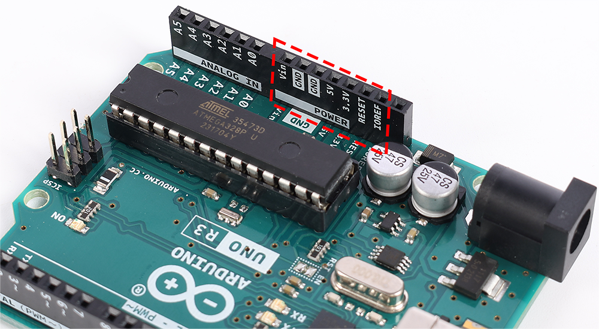

.. note::

    Hello, welcome to the SunFounder Raspberry Pi & Arduino & ESP32 Enthusiasts Community on Facebook! Dive deeper into Raspberry Pi, Arduino, and ESP32 with fellow enthusiasts.

    **Why Join?**

    - **Expert Support**: Solve post-sale issues and technical challenges with help from our community and team.
    - **Learn & Share**: Exchange tips and tutorials to enhance your skills.
    - **Exclusive Previews**: Get early access to new product announcements and sneak peeks.
    - **Special Discounts**: Enjoy exclusive discounts on our newest products.
    - **Festive Promotions and Giveaways**: Take part in giveaways and holiday promotions.

    👉 Ready to explore and create with us? Click [|link_sf_facebook|] and join today!

.. _2_first_circuit:

2. Your First Circuit
=========================

Welcome to the electrifying world of your first circuit, where a simple switch can light up your surroundings, and a single click can bring gadgets to life. This lesson is your gateway to understanding the unseen force of electricity that powers the devices we use every day. Ever curious about how your favorite gadgets operate or what makes lights glow? It's time to embark on a hands-on exploration of circuit building.

As we begin this adventure, we'll explore the origins of electricity and trace the pathways of electrons as they flow through circuits. This lesson serves as a practical introduction to the components of a circuit and how they interact to perform various functions. You'll also play the role of an electrical detective, discovering how to effectively harness and measure this lively force.

Get ready for some electrifying experiments! Here's what you'll achieve:

* Use a breadboard for easy circuit construction.
* Read resistor color codes to manage electrical flow.
* Understand how LEDs control the direction of current.
* Learn about voltage from Arduino Uno R3.
* Discover how electrons flow through a circuit.
* Recognize different types of circuits and their functions.

Are you ready to dive into your first circuit-building experience? Let's get charged up and begin this enlightening journey!

Components Needed
----------------------

.. list-table:: 
   :widths: 25 25 25 25
   :header-rows: 0

   * - 1 * Arduino Uno R3
     - 1 * Red LED
     - 1 * 220Ω Resistor
     - Jumper Wires
   * - |components_uno_r3| 
     - |components_red_led| 
     - |components_220ohm| 
     - |components_wire| 
   * - 1 * USB Cable
     - 1 * Breadboard
     -
     -   
   * - |components_usb_cable| 
     - |components_breadboard| 
     -
     - 

Breadboard
-------------

1. Locate your breadboard. 

The breadboard you'll be using is called a solderless breadboard. Each hole on the breadboard contains a metal connector that grips the wire when inserted. This helps to prevent the wire from being pulled out, ensuring a secure connection in your circuit.

.. image:: img/2_breadboard_half.png
    :width: 500
    :align: center

Ever wonder why the essential electronic tool in your hand shares a name with the kitchen board used for slicing bread? It's quite a story! Back in the days before the 1970s, electronics were assembled on literal wooden boards, sometimes repurposed kitchen breadboards, by nailing or gluing components onto them and making connections with wires.

.. image:: img/2_breadboard_circuit.jpg
    :width: 500
    :align: center

From the 1960s to the 1980s, engineers experimented with wire wrapping for more complex circuits, which was semi-permanent and required specific tools but was eventually deemed too cumbersome and not suited for repeated use.

.. image:: img/2_breadboard_wire_wrap.jpg
    :width: 500
    :align: center

Then, in the early 1970s, Ronald J. Portugal revolutionized prototyping with the invention of the "solderless breadboard," making circuit assembly faster, easier, and requiring no soldering. This innovative tool quickly outshined wire wrapping, leading to the breadboards we know today, named for their historical predecessors but designed for the modern maker.

.. image:: img/2_breadboard_half.png
    :width: 500
    :align: center

Ever curious about what lies beneath the surface of a breadboard? Hidden behind its plastic facade and a layer of sticky foam, covered by yellow protective paper, lies the heart of the breadboard's functionality: dozens of metal strips.

.. note::
    It's best not to peel away this protective layer. We've done it here just to show you what's inside.

.. image:: img/2_breadboard_internal0.jpg
    :width: 500
    :align: center

If you were to (though we strongly advise against it) pull out these metal parts with pliers, you'd discover that each piece is a metal clip with small teeth. Each strip features five teeth, correlating with the five holes on the breadboard's surface for each row. The power rails have longer strips with fifty teeth.

These tiny teeth are perfect for gripping onto the legs of electronic components. When a component is inserted into the breadboard, the clip opens slightly to snugly grasp the metal leg. Any other component inserted into the same row of teeth will be electrically connected.

.. image:: img/2_breadboard_internal2.jpg
    :width: 500
    :align: center

This clever design allows for easy and flexible prototyping without the need for soldering, making breadboards an essential tool for electronics enthusiasts and professionals alike.

Most breadboards have some numbers, letters and plus and minus signs on them. Although the labels will vary from breadboard to breadboard, the function is basically the same. These labels allow you to find the corresponding holes more quickly when building your circuit. The row numbers and column letters help you to precisely locate the holes on the breadboard, for example, hole "C15" is where column C intersects row 15.

.. image:: img/2_breadboard_letter_number.jpg
    :width: 500
    :align: center

The sides of the breadboard are usually distinguished by red and blue (or other colors), as well as plus and minus signs, and are usually used to connect to the power supply, known as the power bus.
When building a circuit, it is common to connect the negative terminal to the blue (-) column and the positive terminal to the red (+) column.

.. image:: img/2_breadboard_plus_minus.jpg
    :width: 500
    :align: center

Resistor
---------------------

2. Locate a 220-ohm resistor.

.. image:: img/2_220_resistor.png
    :align: center

Resistors help manage the flow of electricity in a circuit by converting electrical energy into heat. Each resistor has two wires, one on each end, allowing electricity to pass in either direction, which means they can be placed in any direction on the circuit.

A resistor's ohm value tells us the amount of resistance it adds. A higher ohm value means more resistance. For instance, a 220-ohm resistor adds 220 ohms of resistance, and a 10 kiloohm resistor adds 10 kilo ohms.

To read a resistor's value, check the color bands. This chart explains the meaning behind each color band on a resistor. The multiplier is represented in scientific notation, where the exponent indicates the number of zeros added to the number represented by the color bands. For instance, a 4-band resistor shown at the top of the chart starts with a green band. Green stands for the number 5, so the resistance value begins with 5. The second band is brown, so the next number is 1. The multiplier band is red, valued at 2, meaning we add two zeros. This results in a total resistance of 5100 ohms, or 5.1 kilohms (5.1kΩ).

The chart shown here represents all the resistors included in your kit. For this lesson, we'll be using a 220-ohm resistor.

.. image:: img/2_all_resistor.png
    :width: 500
    :align: center

3. Bend the leads of the resistor so they face the same direction.

.. image:: img/2_220_resistor_pin.png
    :width: 200
    :align: center

4. Insert one lead into the top hole of the breadboard's negative side, connecting the resistor to the power source. Insert the other lead of the 220 ohm resistor into hole 1b of the breadboard.

    .. note::
        
        Resistors are considered non-polarized components, meaning the direction they face in a circuit doesn't matter.

.. image:: img/2_connect_resistor.png
    :width: 300
    :align: center

LED
-----------------

5. Find the red LED.

.. image:: img/2_red_led.png
    :align: center

LEDs, or Light Emitting Diodes, are specialized electronic components that emit light when an electric current flows through them in a specific direction.

.. image:: img/2_led_polarity.jpg
    :width: 200
    :align: center

The most common LED colors are red, yellow, blue, green, and white, with the emitted light typically matching the color of the LED itself.

.. image:: img/2_led_color.png
    :width: 600
    :align: center

These devices are designed with two leads: a longer one known as the anode and a shorter one called the cathode. To function properly, the anode should be connected to the positive terminal of the power source, and the cathode should be connected to the negative terminal or ground. Some LEDs feature a flat edge on the side of the cathode to aid in correct placement. 

.. image:: img/2_led_pin.jpg
    :width: 100
    :align: center

6. Insert the cathode of the LED (the short lead) into hole 1e on the breadboard. This connects the LED to the 1KΩ resistor. Remember, holes 1a and 1e are connected underneath the breadboard.

.. note::

    LEDs are considered to be polarized components, meaning that current can only flow through them in one direction. If you find that the LED does not light up, try swapping the connections.

.. image:: img/2_connect_led.png
    :width: 300
    :align: center

Jumper Wire
----------------------

7. Find a jumper wire.

Your kit includes jumper wires of different colors and lengths, all functioning the same. Use varying colors for easy circuit identification and shorter wires for a tidy setup. Each wire consists of a conductive core and an insulated coating to prevent unintended contacts.

.. image:: img/2_wire_color.jpg
    :width: 500
    :align: center

8. Insert one end of the jumper wire into hole 1j on the breadboard. This connects the jumper wire to the LED, as holes 1f and 1j are linked underneath the breadboard. Insert the other end of the jumper wire into the top hole of the breadboard's positive rail. Now, the jumper wire connects the LED and the ground wire together.

.. image:: img/2_connect_wire.png
    :width: 300
    :align: center

Arduino Uno R3
--------------

9. Find your Arduino Uno R3.

In this lesson, we're using the Arduino Uno R3 as a power supply. Its 5V pin serves as the positive terminal and the GND pin as the negative terminal, supplying a steady 5V to the circuit.

However, connecting the power supply's terminals directly without a load can cause a short circuit, generating heat and potentially causing damage or fire. Always include a load, like an LED or resistor, to prevent short circuits.

.. image:: img/2_short_circuit.png
    :width: 500
    :align: center

10. Connect a wire from the positive rail on the right side of the breadboard to the 5V pin on the Arduino Uno R3. It is recommended to use a red or orange wire to represent the positive terminal, which can be particularly helpful for quickly identifying connections in complex projects.

.. image:: img/2_uno_5v.png
    :width: 600
    :align: center

11. Finally, connect a wire from the negative rail on the left side of the breadboard to the GND pin on the Arduino Uno R3. A black or green wire is suggested for consistency, using the same color to represent the negative terminal across all circuits.

.. image:: img/2_uno_gnd.png
    :width: 600
    :align: center

12. Finally, power the Arduino Uno R3 by connecting it to a computer or a power socket using the USB cable provided in the kit, and the LED should light up.

    .. image:: img/1_connect_uno_pc.jpg
        :width: 600
        :align: center

After connecting your Arduino Uno R3 and witnessing the LED light up, you're not just looking at a simple circuit — you're observing the fundamentals of electricity at work. Let's delve into what makes your circuit come to life.

Understanding Electricity in Circuits
----------------------------------------

**Electricity Essentials**

The flow of electrons from the negative to the positive is what we understand as the current. Initially, scientists like Ben Franklin believed that the current was a movement of positive charges, which is why traditional current flows from positive to negative.

However, in reality, electrons, which carry a negative charge, move from the negative terminal to the positive terminal. Most countries today still use the traditional flow model. Thus, in diagrams and when designing electronic components, current is depicted as flowing from the positive to the negative terminal, even though electrons actually flow in the opposite direction.

.. image:: img/2_uno_electron.png
    :width: 600
    :align: center

* **A** Traditional current direction
* **B** Actual electron flow direction
* **C** Electrons (not to scale)
* **D** Wire

There are two types of current generated by a power source: alternating current (AC) and direct current (DC). A battery or a Microcontroller like Arduino Uno R3 provides DC, where the current flows in one direction—from the positive to the negative terminal.

With AC, however, the current changes direction periodically. The voltage in the circuit reverses as the current changes direction, compelling it to flow the other way. Most homes and buildings are powered by AC circuits, such as the 120 volts at 60 Hz from wall outlets in American homes or 220 volts at 50 Hz in many European homes.

**Safety in Circuitry**

When connecting a power source, a prudent approach is to attach the positive end to the circuit first, followed by the negative. Conversely, when disconnecting, you should remove the negative end first to prevent short circuits. This course utilizes low voltage and current, so there's no risk of electric shock or injury. But good safety practices can prevent harm when working with higher voltages and currents, like replacing car batteries or repairing outlets.

**Closed and Open Circuits**

As electricity flows through the LED, resistor, jumper wires, and back into the breadboard's negative rail, it forms what is known as a closed circuit. If you were to remove a wire from the breadboard, the LED would go out because the current has stopped — the circuit is now open.

.. image:: img/2_open_circuit.png
    :width: 600
    :align: center

By mastering these basics, you're on your way to understanding and creating more complex electronics that power our world.

**Questions:**

1. Remove the red wire from the breadboard and experiment by placing it in different holes on the breadboard. Observe any changes in the LED. Sketch the hole positions that allow the LED to light up.

.. image:: img/2_uno_gnd.png
    :width: 600
    :align: center

2. What happens if you reverse the pins of the LED? Will it light up? Why or why not?
