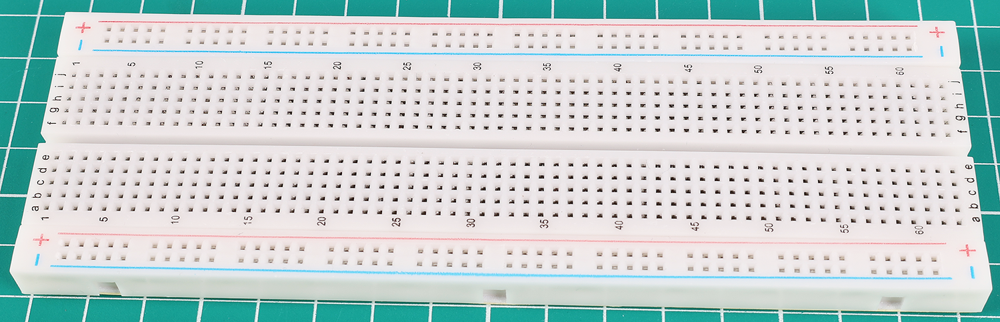
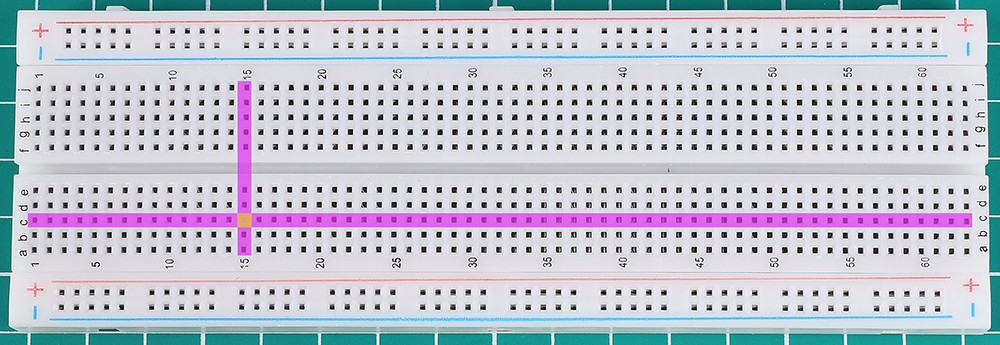
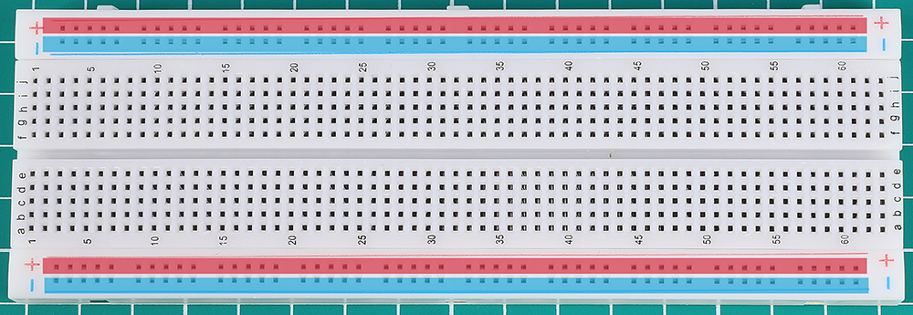
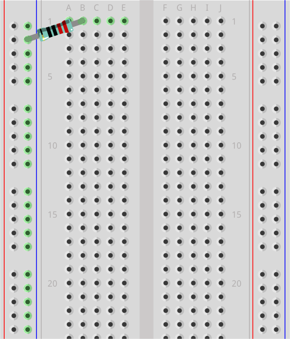
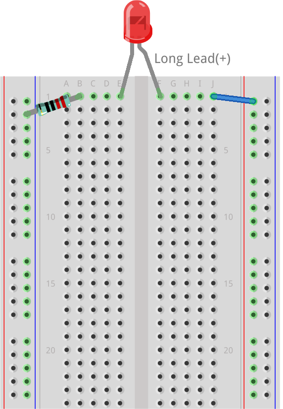
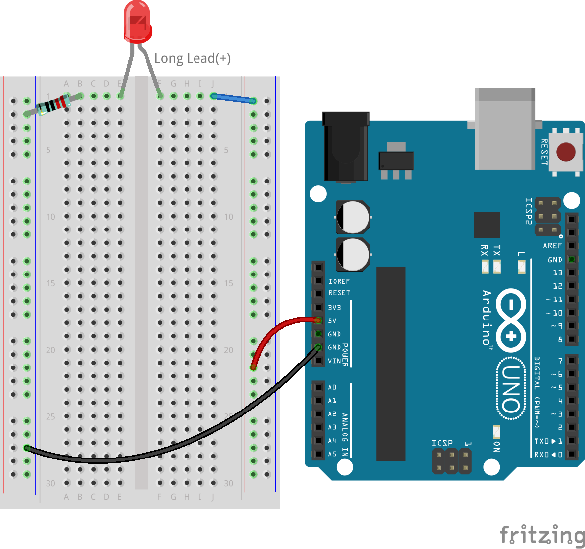

.. note::

    こんにちは！SunFounderのRaspberry Pi & Arduino & ESP32 Enthusiasts Communityへようこそ！FacebookでRaspberry Pi、Arduino、ESP32についてさらに深く学び、仲間たちと交流しましょう。

    **なぜ参加するのか？**

    - **専門サポート**: 購入後の問題や技術的な課題を、コミュニティやチームの助けを借りて解決しましょう。
    - **学びと共有**: スキルを向上させるためのヒントやチュートリアルを交換しましょう。
    - **限定プレビュー**: 新製品の発表や先行情報にいち早くアクセスできます。
    - **特別割引**: 最新製品に対する特別割引をお楽しみください。
    - **季節のプロモーションとギブアウェイ**: プレゼントや季節限定のプロモーションに参加しましょう。

    👉 一緒に探求し、創造しませんか？[|link_sf_facebook|]をクリックして、今すぐ参加しましょう！

.. _2_first_circuit:

2. 初めての回路
=========================

初めての回路の世界へようこそ！スイッチ一つで周りを照らし、一つのクリックでガジェットを動かすことができるこの世界は、私たちが毎日使用するデバイスに電力を供給する目に見えない力である電気を理解するための入り口です。お気に入りのガジェットがどのように動作するのか、またはライトがどのように光るのかに興味がありませんか？さあ、回路を組み立てる実践的な探検に出かけましょう。

この冒険の始まりとして、電気の起源を探り、電子が回路を流れる経路をたどります。このレッスンは、回路の構成要素とそれらがどのように相互作用してさまざまな機能を果たすかを実践的に紹介します。また、電気の流れを効果的に活用し、測定する方法を発見する電気探偵の役割も果たします。

さあ、エキサイティングな実験の準備をしましょう！以下のことが達成できます：

* ブレッドボードを使って簡単に回路を構築する。
* 抵抗の色コードを読み取って電気の流れを管理する。
* LEDが電流の方向をどのように制御するかを理解する。
* Arduino Uno R3から電圧について学ぶ。
* 電子が回路を通る流れを発見する。
* さまざまな回路の種類とその機能を認識する。

さあ、初めての回路作りの体験に飛び込む準備はできましたか？電気に満ちたこの旅を始めましょう！

必要な部品
----------------------

.. list-table:: 
   :widths: 25 25 25 25
   :header-rows: 0

   * - 1 * Arduino Uno R3
     - 1 * 赤色LED
     - 1 * 220Ω抵抗
     - ジャンパーワイヤー
   * - |list_uno_r3| 
     - |list_red_led| 
     - |list_220ohm| 
     - |list_wire| 
   * - 1 * USBケーブル
     - 1 * ブレッドボード
     -
     -   
   * - |list_usb_cable| 
     - |list_breadboard| 
     -
     - 

ブレッドボード
------------------

1. ブレッドボードを見つけましょう。

あなたが使用するブレッドボードは、「はんだ付け不要のブレッドボード」と呼ばれます。ブレッドボードの各穴には金属コネクタが入っており、挿入されたワイヤーをしっかりと保持します。これにより、ワイヤーが引き抜かれにくくなり、回路内での確実な接続が保証されます。

.. image:: img/2_breadboard_half.png
    :width: 500
    :align: center

手にしているこの基本的な電子ツールが、なぜ「パンを切るためのキッチンボード」と同じ名前を持っているのか、疑問に思ったことはありませんか？それには興味深い歴史があります！1970年代以前、電子機器は実際の木製ボード、時にはキッチンのまな板を再利用して組み立てられ、部品がそれに釘打ちされたり、接着されたりしていました。

.. image:: img/2_breadboard_circuit.jpg
    :width: 500
    :align: center

1960年代から1980年代にかけて、エンジニアたちはより複雑な回路のためにワイヤラッピングを試みましたが、これは半永久的なものであり、特定の工具が必要で、結局はあまりにも手間がかかり、繰り返し使用には向いていませんでした。

その後、1970年代初頭に、ロナルド・J・ポルトガルが「はんだ付け不要のブレッドボード」を発明し、回路の組み立てがより迅速かつ簡単に行えるようになり、はんだ付けが不要となりました。この革新的なツールは、ワイヤラッピングをすぐに凌駕し、今日私たちが知っているブレッドボードに進化しました。それは、歴史的な前身の名前を引き継いでいますが、現代のメイカーに向けて設計されています。

.. note::
    この保護層を剥がすのはおすすめしません。ここでは中身を見せるために剥がしています。

.. image:: img/2_breadboard_internal0.jpg
    :width: 500
    :align: center

もし仮に（お勧めはしませんが）これらの金属部分をペンチで引き抜くと、各ピースは小さな歯が付いた金属クリップであることがわかるでしょう。各ストリップには5つの歯があり、それぞれがブレッドボードの表面の5つの穴に対応しています。電源レールには、50本の歯がある長いストリップが使われています。

.. image:: img/2_breadboard_internal1.jpg
    :width: 500
    :align: center

これらの小さな歯は、電子部品の足をしっかりと固定するのに最適です。部品をブレッドボードに挿入すると、クリップが少し開いて金属の足をしっかりと掴みます。同じ列に挿入された他の部品は、電気的に接続されます。

.. image:: img/2_breadboard_internal2.jpg
    :width: 500
    :align: center

この巧妙な設計により、はんだ付けを必要とせずに簡単で柔軟なプロトタイピングが可能になり、ブレッドボードは電子工学の愛好者や専門家にとって不可欠なツールとなっています。

ほとんどのブレッドボードには、数字、文字、プラスマイナス記号などが付いています。ラベルはブレッドボードによって異なることがありますが、基本的な機能は同じです。これらのラベルは、回路を組むときに対応する穴を素早く見つけるのに役立ちます。列番号と行のアルファベットは、たとえば「C15」の穴が列Cと行15の交点にあることを正確に指し示すのに役立ちます。

ブレッドボードの側面は通常、赤と青（または他の色）で区別されており、
プラスとマイナス記号があり、通常は電源に接続される部分として使用されます。
回路を組み立てる際、負極を青（-）の列に、正極を赤（+）の列に接続するのが一般的です。

抵抗
---------------------

2. 220Ωの抵抗を見つけましょう。

.. image:: img/2_220_resistor.png
    :align: center

抵抗器は、回路内の電気の流れを管理し、電気エネルギーを熱に変換する役割を果たします。各抵抗器には両端に2本のワイヤーがあり、どちらの方向にも電気を通すことができるため、回路上のどちらの方向にも配置することができます。

抵抗器のオーム値は、抵抗器が追加する抵抗の量を示しています。オーム値が高いほど、抵抗が大きくなります。たとえば、220Ωの抵抗器は220オームの抵抗を追加し、10キロオームの抵抗器は10キロオームの抵抗を追加します。

抵抗器の値を読み取るには、色帯を確認します。このチャートは、抵抗器の色帯が何を意味しているのかを説明しています。乗数は科学的記法で表されており、指数は色帯によって表される数字に追加されるゼロの数を示します。たとえば、チャートの一番上に示されている4バンドの抵抗器は、緑の帯から始まります。緑は数字の5を表しているため、抵抗値は5から始まります。次の帯は茶色で、次の数字は1です。乗数帯は赤であり、値は2なので、2つのゼロを追加します。これにより、抵抗値は5100オーム、つまり5.1キロオーム（5.1kΩ）となります。

.. image:: img/2_resistor_card.png

ここに示されているチャートは、キットに含まれるすべての抵抗器を表しています。このレッスンでは、220Ωの抵抗器を使用します。

.. image:: img/2_all_resistor.png
    :width: 500
    :align: center

3. 抵抗器のリードを同じ方向に曲げます。

.. image:: img/2_220_resistor_pin.png
    :width: 200
    :align: center

4. 抵抗器の片方のリードをブレッドボードの負側の最上部の穴に挿入し、抵抗器を電源に接続します。もう一方の220Ωのリードをブレッドボードの1bの穴に挿入します。

    .. note::
        
        抵抗器は非極性部品と見なされているため、回路内での向きは問題になりません。

LED
-----------------

5. 赤色LEDを見つけます。

.. image:: img/2_red_led.png
    :align: center

LED（発光ダイオード）は、特定の方向に電流が流れると光を放つ特殊な電子部品です。

.. image:: img/2_led_polarity.jpg
    :width: 200
    :align: center

最も一般的なLEDの色は、赤、黄、青、緑、白で、放射される光は通常、LED自体の色と一致しています。

.. image:: img/2_led_color.png
    :width: 600
    :align: center

これらのデバイスには2本のリードがあり、長い方はアノード、短い方はカソードと呼ばれます。正しく動作させるには、アノードを電源の正極に、カソードを負極またはグランドに接続する必要があります。いくつかのLEDには、正しい配置を補助するためにカソード側に平らなエッジがあるものもあります。

.. image:: img/2_led_pin.jpg
    :width: 100
    :align: center

6. LEDのカソード（短いリード）をブレッドボードの1eの穴に挿入します。これでLEDが220Ωの抵抗器に接続されます。ブレッドボードの下で1bと1eの穴が接続されていることを覚えておいてください。

.. note::

    LEDは極性のあるコンポーネントであり、電流は一方向にしか流れません。LEDが点灯しない場合は、接続を逆にしてみてください。

.. image:: img/2_connect_led.png
    :width: 300
    :align: center

ジャンパーワイヤー
----------------------

7. ジャンパーワイヤーを見つけます。

キットには、さまざまな色や長さのジャンパーワイヤーが含まれていますが、すべて同じ機能を持っています。回路の識別を容易にするために色分けされたワイヤーを使用し、整然としたセットアップには短いワイヤーを使用します。各ワイヤーは導電性の芯と、意図しない接触を防ぐための絶縁コーティングで構成されています。

.. image:: img/2_wire_color.jpg
    :width: 500
    :align: center

8. ジャンパーワイヤーの片方の端をブレッドボードの1jの穴に挿入します。これにより、ジャンパーワイヤーがLEDに接続されます。1fと1jの穴はブレッドボードの下で繋がっています。ジャンパーワイヤーのもう一方の端を、ブレッドボードの正極レールの最上部の穴に挿入します。これで、ジャンパーワイヤーがLEDとグランドワイヤーを接続します。

Arduino Uno R3
-------------------

9. Arduino Uno R3を見つけます。

.. image:: img/1_uno_board.png
    :width: 400
    :align: center

このレッスンでは、Arduino Uno R3を電源として使用します。その5Vピンは正極として、GNDピンは負極として機能し、回路に安定した5Vを供給します。

.. image:: img/1_uno_power_pin.png
    :width: 500
    :align: center

ただし、負荷がない状態で電源端子を直接接続すると、ショート回路が発生し、熱を生じ、損傷や火災の原因となることがあります。LEDや抵抗器のような負荷を含めることで、ショート回路を防ぐことができます。

10. ブレッドボードの右側の正極レールからArduino Uno R3の5Vピンまでワイヤーを接続します。正極端子を表すために、赤またはオレンジ色のワイヤーを使用することをお勧めします。これは、複雑なプロジェクトで接続を迅速に識別するのに特に役立ちます。

.. image:: img/2_uno_5v.png
    :width: 600
    :align: center

11. 最後に、ブレッドボードの左側の負極レールからArduino Uno R3のGNDピンまでワイヤーを接続します。負極端子を表すために黒または緑のワイヤーを使用することが推奨されます。

12. 最後に、Arduino Uno R3をコンピュータや電源コンセントにUSBケーブルで接続して電源を供給すると、LEDが点灯するはずです。

    .. image:: img/2_first_circuit.png
        :width: 600
        :align: center

Arduino Uno R3を接続し、LEDが点灯するのを確認したら、単純な回路を見るだけでなく、電気の基本的な仕組みを観察しています。あなたの回路がどのようにして動き出すのかを詳しく見ていきましょう。

回路における電気の理解
----------------------------------------

**電気の基本**

電子が負極から正極に流れることが、私たちが理解している「実際の電子の流れ」です。最初の頃、ベンジャミン・フランクリンのような科学者は、電流は正の電荷の移動であると信じていました。これが、従来の電流が正極から負極へ流れると定義されている理由です。

.. image:: img/2_uno_current.png
    :width: 600
    :align: center

しかし実際には、負の電荷を持つ電子が負極から正極へ移動します。今日でも、多くの国が従来の電流の流れのモデルを使用しています。そのため、図や電子部品の設計では、電流は正極から負極へ流れると表示されますが、実際には電子は反対方向に流れます。

.. image:: img/2_uno_electron.png
    :width: 600
    :align: center

* **A** 伝統的な電流の方向
* **B** 実際の電子の流れの方向
* **C** 電子（スケール外）
* **D** ワイヤー

電源から生成される電流には、交流（AC）と直流（DC）の2種類があります。バッテリーやArduino Uno R3のようなマイクロコントローラはDCを提供し、電流は一方向に流れます（正極から負極へ）。

一方、ACでは電流の方向が周期的に変わります。電圧が逆転することで、電流も逆方向に流れることを強制されます。ほとんどの家庭や建物はAC回路で電力を供給されており、たとえば、アメリカの家庭では120ボルト60Hz、ヨーロッパの多くの家庭では220ボルト50Hzです。

**回路における安全性**

電源を接続する際は、まず正極端子を回路に接続し、次に負極端子を接続するのが賢明です。逆に、切断する際は、最初に負極端子を外してショート回路を防ぐことができます。このコースでは低電圧と低電流を使用しているため、感電や怪我のリスクはありません。しかし、車のバッテリーの交換やコンセントの修理など、高い電圧や電流を扱う際には、適切な安全対策を講じることが重要です。

**閉回路と開回路**

電気がLED、抵抗器、ジャンパーワイヤーを通り、ブレッドボードの負極レールに戻ると、それは「閉回路」として知られる状態になります。ブレッドボードからワイヤーを取り外すと、LEDが消灯します。これは、電流が停止し、回路が「開回路」となったためです。

.. image:: img/2_open_circuit.png
    :width: 600
    :align: center

これらの基本をマスターすることで、私たちの世界を動かしている、より複雑な電子機器の理解と構築への第一歩を踏み出しています。

**質問:**

1. ブレッドボードから赤いワイヤーを取り外し、他の穴に挿して実験してみてください。LEDに何か変化があるか観察してください。LEDが点灯する穴の位置をスケッチしてみましょう。

2. LEDのピンを逆にした場合、どうなりますか？LEDは点灯しますか？その理由を考えてみましょう。
