30. Arduino Radar System
===========================

In this engaging lesson, you will construct a dynamic Arduino radar system that combines a servo and an ultrasonic module to detect and display the positions of nearby objects on an animated interface created with Processing PDE. 

.. raw:: html

    <video width="600" loop autoplay muted>
        <source src="_static/video/30_servo_radar.mp4" type="video/mp4">
        Your browser does not support the video tag.
    </video>

By the end of this lesson, you will be able to:

* Build a scanning radar using a servo and an ultrasonic module.
* Transmit data from the Arduino IDE to the Processing PDE via serial communication.
* Explore the basics of the Processing PDE, a tool that can be used to create simple animations and visualize data effectively.
* Develop skills in real-time data visualization using the Processing PDE, enhancing your understanding of data flows and sensor dynamics.

1. Components Needed
-----------------------

.. list-table:: 
   :widths: 25 25 25 25
   :header-rows: 0

   * - 1 * Arduino Uno R3
     - 1 * Servo
     - 1 * Ultrasonic Module
     - 
   * - |list_uno_r3|
     - |list_servo| 
     - |list_ultrasonic|
     - 
   * - 1 * USB Cable
     - 1 * Breadboard
     - Jumper Wires
     - 1 * Breadboard Power Module
   * - |list_usb_cable|
     - |list_breadboard|
     - |list_wire|
     - |list_power_module|
   * - 1 * 9V Battery
     - 1 * Battery Cable
     - 
     -  
   * - |list_battery| 
     - |list_bat_cable| 
     -
     -

2. Prepare the Servo
-------------------------------

.. note::

  If you are not familiar with the Servo, you can first learn its basic usage through the following project:

  * :ref:`ar_servo_usage`

**1. Building the Circuit**

Now let's start building the circuit. 

* First, insert the breadboard power module into the breadboard, then use a jumper wire to connect the negative rail of the breadboard to the GND of the Arduino Uno R3 to achieve a common ground.

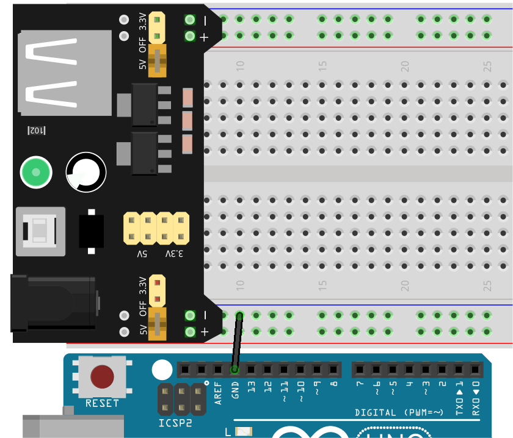

.. note::

    The order of the positive and negative terminals on the breadboard in the wiring diagram is reversed compared to the breadboard provided in the kit.

    In actual wiring, you need to insert the breadboard power module from the higher number side (60~65) so that the "-" of the power module goes into the negative rail "-" of the breadboard, and the "+" into the positive rail "+".

    .. raw:: html

        <video width="600" loop muted>
            <source src="_static/video/about_power_module.mp4" type="video/mp4">
            Your browser does not support the video tag.
        </video>

* Use three short jumper wires to extend the three wires of your servo: connect the yellow wire to pin 12 of the Arduino Uno R3, the red wire to the positive rail of the breadboard, and the brown wire to the negative rail of the breadboard.

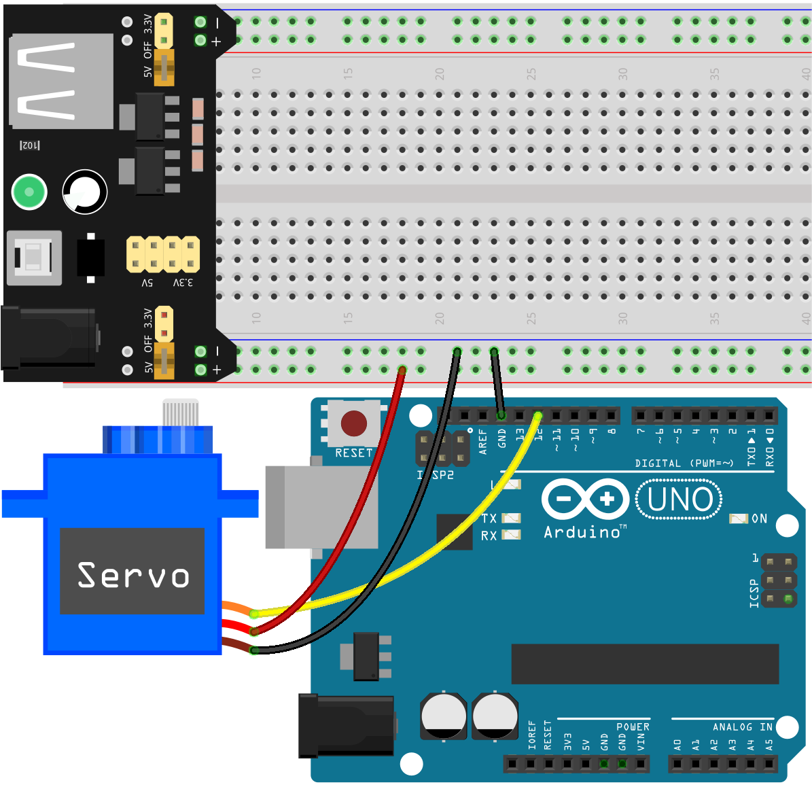

**2. Writing the Code**

In our Arduino radar system, the servo sweeps back and forth from 0 to 180 degrees. Now, we need to set its initial angle to 90 degrees.

1. Open the Arduino IDE and start a new project by selecting “New Sketch” from the “File” menu.
2. Save your sketch as ``Lesson30_Sero_Angle`` using ``Ctrl + S`` or by clicking “Save”.

3. Making the servo work is quite simple. Just include the ``Servo`` library in your code, then create a ``Servo`` object and attach the servo object to the specified pin. After that, you can use the ``write()`` function to set the servo to a specific angle, as shown below:

.. code-block:: Arduino

  #include <Servo.h>

  Servo myServo;  // Create a Servo object

  const int servoPin = 12;  // servo connected to digital pin 12

  void setup() {
    myServo.attach(servoPin);  // Attach the Servo object to the specified pin
    myServo.write(90);         // Initial position set to 90 degrees
  }

  void loop() {
    // put your main code here, to run repeatedly:
  }

4. Then, upload the code to your Arduino board. You will hear a sound from the servo, indicating that it has moved to the 90-degree position.

5. Now, attach the one-side servo arm to the servo at the specified angle. Try to keep the servo arm parallel to the servo body; a slight tilt won't affect its performance.

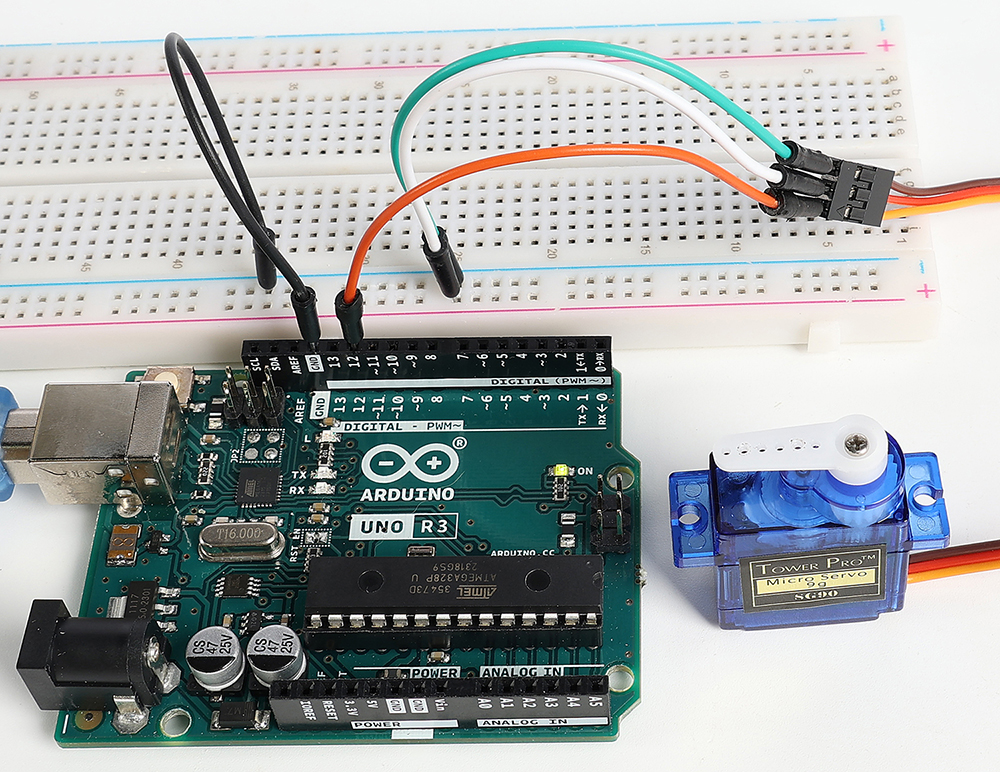

3. Preparing the Ultrasonic Module
-----------------------------------------

.. note::

  If you are not familiar with the Ultrasonic module, you can first learn its basic usage through the following project:

  * :ref:`ar_smart_trash_can`

**1. Building the Circuit**

1. Find or manually create a mount for the ultrasonic module so that it can be attached to the servo.

.. note::
  The kit does not include this mount, so you will need to purchase or create one yourself.

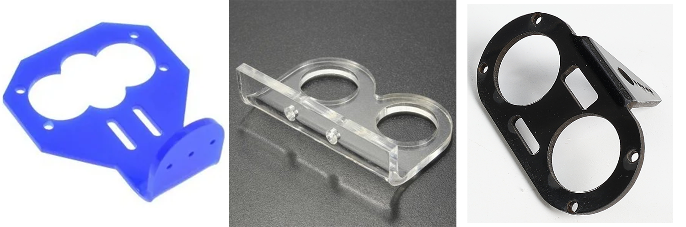

2. Now, secure the ultrasonic module to the mount, typically using M2x4 screws and M2 nuts.

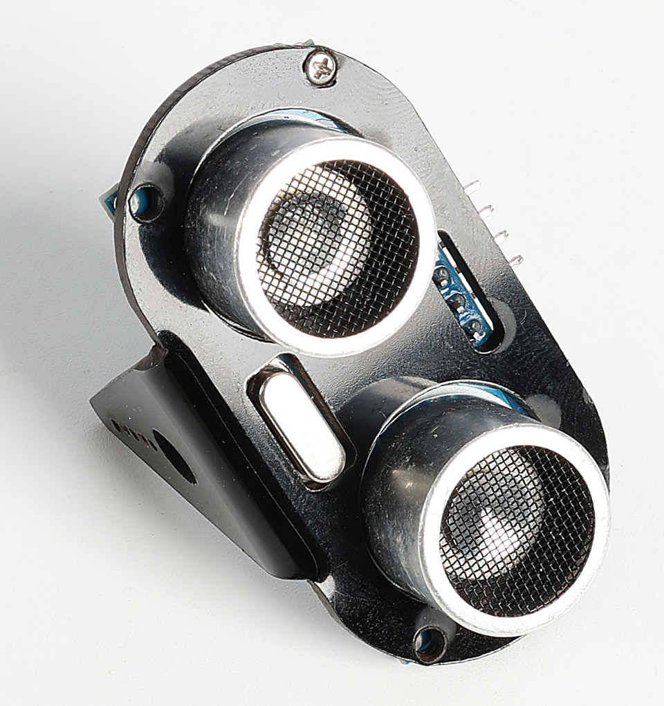

3. Attach the ultrasonic mount to the servo arm. Ensure that when the Arduino board is powered on, the ultrasonic module is facing forward.

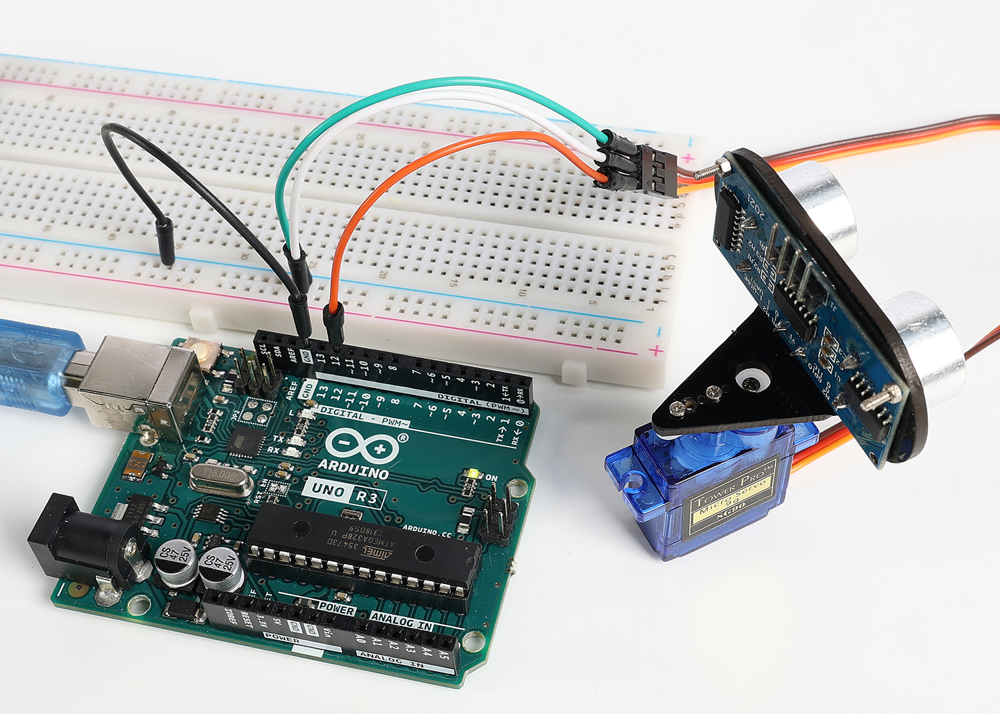

4. Now, use jumper wires to connect the ultrasonic module: VCC to the positive rail on the breadboard, Trig pin to pin 10 on the Arduino board, Echo pin to pin 11, and GND to the negative rail on the breadboard.

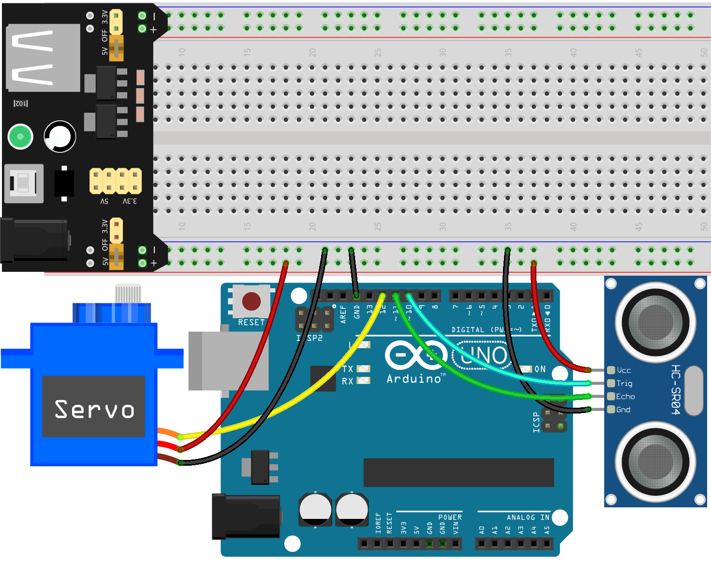

**2. Writing the Code**

1. Open the sketch you saved earlier, ``Lesson30_Sero_Angle``. Hit "Save As..." from the "File" menu, and rename it to ``Lesson30_Arduino_Radar``. Click "Save".

2. Now, define the pins for the ultrasonic module and set their modes to ``OUTPUT`` and ``INPUT`` respectively. In this code, we need to use the serial monitor to communicate with the Processing PDE, so start serial communication at 9600 bps.

.. code-block:: Arduino
  :emphasize-lines: 7,8,11-13

  #include <Servo.h>

  Servo myServo;  // Create a Servo object

  const int servoPin = 12;  // servo connected to digital pin 12

  #define TRIGGER_PIN 10  // Pin to trigger the ultrasonic pulse
  #define ECHO_PIN 11     // Pin to receive the echo

  void setup() {
    pinMode(TRIGGER_PIN, OUTPUT);  // Set the Trig pin as output
    pinMode(ECHO_PIN, INPUT);      // Set the Echo pin as input
    Serial.begin(9600);            // Start serial communication for debugging
    myServo.attach(servoPin);      // Defines on which pin is the servo attached
    myServo.write(90);             // Initial position set to 90 degrees
  }

3. You will need a specific function to retrieve the distance measured by the ultrasonic module. You can see how this function is implemented by referring to :ref:`ar_read_distance`.

.. code-block:: Arduino
  :emphasize-lines: 7-17
  
  void loop() {
    // put your main code here, to run repeatedly:

  }

  // Function to read the sensor data and calculate the distance
  long measureDistance() {
    digitalWrite(TRIGGER_PIN, LOW);  // Ensure Trig pin is low before a pulse
    delayMicroseconds(2);
    digitalWrite(TRIGGER_PIN, HIGH);  // Send a high pulse
    delayMicroseconds(10);            // Pulse duration of 10 microseconds
    digitalWrite(TRIGGER_PIN, LOW);   // End the high pulse

    long duration = pulseIn(ECHO_PIN, HIGH);  // Measure the duration of high level on Echo pin
    long distance = duration * 0.034 / 2;     // Calculate the distance (in cm)
    return distance;
  }

4. Use a ``for`` loop to limit the servo's rotation angle between 15 and 165 degrees. This range can be adjusted based on your setup; the servo can rotate from 0 to 180 degrees.

.. code-block:: Arduino
  :emphasize-lines: 3-6

  void loop() {
    // rotates the servo from 15 to 165 degrees
    for (int i = 15; i <= 165; i++) {
      myServo.write(i);
      delay(30);
    }
  }

5. As the servo rotates, let the ultrasonic sensor detect the distance to surrounding objects and print the readings to the serial monitor. These data will then be transmitted to the Processing PDE via the serial port.

.. note::

  * Do not modify the following 4 lines of the ``Serial.print()`` function. The data printed to the serial monitor needs to be transmitted to the Processing PDE in the specified format.
  * In the Processing code, the character ``,`` is used to determine the servo angle and store it in a designated variable.
  * In the Processing code, the character ``.`` is used to determine the detected distance and store it in a designated variable.

.. code-block:: Arduino
  :emphasize-lines: 6-10

  void loop() {
    // rotates the servo from 15 to 165 degrees
    for (int i = 15; i <= 165; i++) {
      myServo.write(i);
      delay(30);
      long distance = measureDistance();  // Call the function to measure distance
      Serial.print(i);                    // Sends the current degree into the Serial Port
      Serial.print(",");                  // Sends addition character right next to the previous value needed later in the Processing PDE for indexing
      Serial.print(distance);             // Sends the distance value into the Serial Port
      Serial.print(".");                  // Sends addition character right next to the previous value needed later in the Processing PDE for indexing
    }
  }

6. Let the servo rotate back from 165 degrees to 15 degrees, printing the angle and distance values to the serial port as before. These data will be transmitted to the Processing PDE via the serial port.

.. code-block:: Arduino
  :emphasize-lines: 13-21

  void loop() {
    // rotates the servo from 15 to 165 degrees
    for (int i = 15; i <= 165; i++) {
      myServo.write(i);
      delay(30);
      long distance = measureDistance();  // Call the function to measure distance
      Serial.print(i);                    // Sends the current degree into the Serial Port
      Serial.print(",");                  // Sends addition character right next to the previous value needed later in the Processing PDE for indexing
      Serial.print(distance);             // Sends the distance value into the Serial Port
      Serial.print(".");                  // Sends addition character right next to the previous value needed later in the Processing PDE for indexing
    }
    // rotates the servo from 165 to 15 degrees
    for (int i = 165; i > 15; i--) {
      myServo.write(i);
      delay(30);
      long distance = measureDistance();  // Call the function to measure distance
      Serial.print(i);                    // Sends the current degree into the Serial Port
      Serial.print(",");                  // Sends addition character right next to the previous value needed later in the Processing PDE for indexing
      Serial.print(distance);             // Sends the distance value into the Serial Port
      Serial.print(".");                  // Sends addition character right next to the previous value needed later in the Processing PDE for indexing
    }
  }

7. The complete code is shown below. Now, you can upload it to your Arduino board. You will see the servo with the ultrasonic module moving from left to right and back again, continuously. The data will be printed in one-line format in the serial monitor.

.. code-block:: Arduino

  #include <Servo.h>

  Servo myServo;  // Create a Servo object

  const int servoPin = 12;  // servo connected to digital pin 12

  #define TRIGGER_PIN 10  // Pin to trigger the ultrasonic pulse
  #define ECHO_PIN 11     // Pin to receive the echo

  void setup() {
    pinMode(TRIGGER_PIN, OUTPUT);  // Set the Trig pin as output
    pinMode(ECHO_PIN, INPUT);      // Set the Echo pin as input
    Serial.begin(9600);            // Start serial communication for debugging
    myServo.attach(servoPin);      // Defines on which pin is the servo attached
    myServo.write(90);             // Initial position set to 90 degrees
  }

  void loop() {
    // rotates the servo from 15 to 165 degrees
    for (int i = 15; i <= 165; i++) {
      myServo.write(i);
      delay(30);
      long distance = measureDistance();  // Call the function to measure distance
      Serial.print(i);                    // Sends the current degree into the Serial Port
      Serial.print(",");                  // Sends addition character right next to the previous value needed later in the Processing PDE for indexing
      Serial.print(distance);             // Sends the distance value into the Serial Port
      Serial.print(".");                  // Sends addition character right next to the previous value needed later in the Processing PDE for indexing
    }
    // Repeats the previous lines from 165 to 15 degrees
    for (int i = 165; i > 15; i--) {
      myServo.write(i);
      delay(30);
      long distance = measureDistance();  // Call the function to measure distance
      Serial.print(i);                    // Sends the current degree into the Serial Port
      Serial.print(",");                  // Sends addition character right next to the previous value needed later in the Processing PDE for indexing
      Serial.print(distance);             // Sends the distance value into the Serial Port
      Serial.print(".");                  // Sends addition character right next to the previous value needed later in the Processing PDE for indexing
    }
  }

  // Function to read the sensor data and calculate the distance
  long measureDistance() {
    digitalWrite(TRIGGER_PIN, LOW);  // Ensure Trig pin is low before a pulse
    delayMicroseconds(2);
    digitalWrite(TRIGGER_PIN, HIGH);  // Send a high pulse
    delayMicroseconds(10);            // Pulse duration of 10 microseconds
    digitalWrite(TRIGGER_PIN, LOW);   // End the high pulse

    long duration = pulseIn(ECHO_PIN, HIGH);  // Measure the duration of high level on Echo pin
    long distance = duration * 0.034 / 2;     // Calculate the distance (in cm)
    return distance;
  }

8. Finally, remember to save your code and tidy up your workspace.

**Question**

In the above code, the ultrasonic module takes a reading every degree. If you feel that the readings are too frequent and want to take a reading every 5 degrees, how should the code be modified?

4. Preparing the Processing PDE
-------------------------------------------

With the servo and ultrasonic module ready, we now need to use the Processing PDE to write and run code that will generate a radar interface to display the radar's rotation angle and detected targets.

**1. Download and Install the Processing PDE**

1. Visit the Processing official download page: |link_processing_download|.

2. Choose the download according to your operating system.

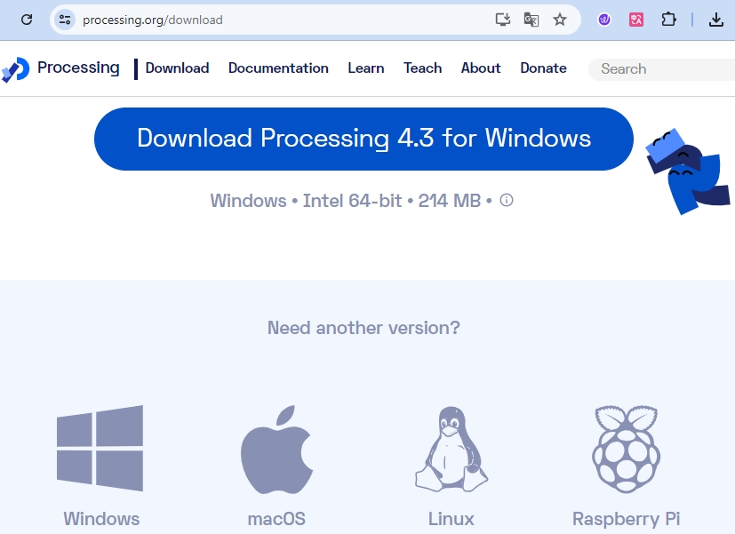

3. Installation on each machine is straightforward.

* On Windows, you'll have a ``.zip`` file. Double-click it, and drag the folder inside to a location on your hard disk. It could be Program Files or simply the desktop, but the important thing is for the processing folder to be pulled out of that ``.zip`` file. Then double-click ``processing.exe`` to start.

* The Mac OS X version is also a ``.zip`` file. Double-click it and drag the **Processing** icon to the **Applications** folder. If you're using someone else's machine and can't modify the **Applications** folder, just drag the application to the desktop. Then double-click the **Processing** icon to start.

* The Linux version is a ``.tar.gz`` file, which should be familiar to most Linux users. Download the file to your home directory, then open a terminal window, and type:

.. code-block:: Shell

  tar xvfz processing-xxxx.tgz

(Replace xxxx with the rest of the file's name, which is the version number.) This will create a folder named processing-2.0 or something similar. Then change to that directory:

.. code-block:: Shell

  cd processing-xxxx

and run it:

.. code-block:: Shell

  ./processing

4. With any luck, the main Processing window will now be visible. 

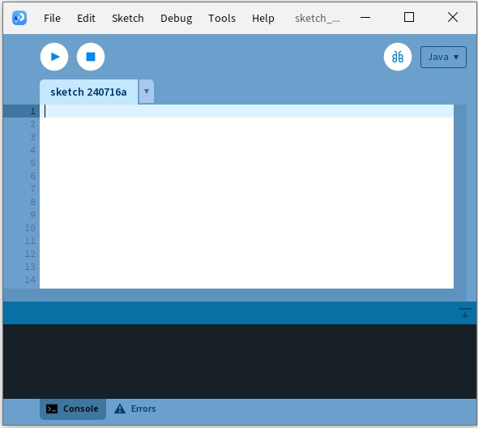

**2. Modify and Run the Code**

1. Download the code that needs to be run in the Processing PDE and then extract it.

* :download:`ArduinoRadarGUI </_static/zip/ArduinoRadarGUI.zip>`

2. Click **File** -> **Open**.

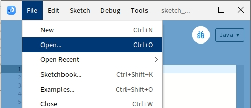

3. Navigate to the folder where you just extracted the code, select **ArduinoRadarGUI.pde**, and then click **Open**.

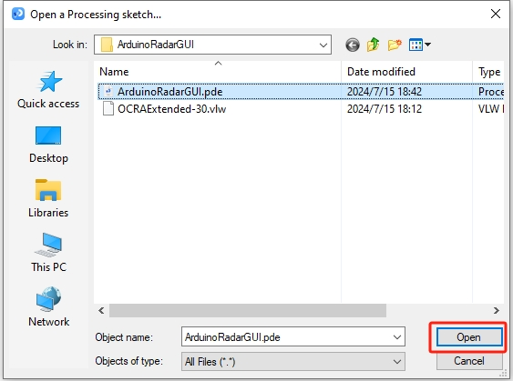

4. Next, you need to modify the serial port in the code to match the one you set in the Arduino IDE.

.. code-block:: Arduino
  :emphasize-lines: 6

  void setup() {
    //fullScreen(); // comment out this line if you do not want full-screen display.
    size (1680, 945); // ***CHANGE THIS TO YOUR SCREEN RESOLUTION***

    smooth();
    myPort = new Serial(this, "COM39", 9600); // starts the serial communication
    myPort.bufferUntil('.'); // reads the data from the serial port up to the character '.'. So actually it reads this: angle,distance.
    orcFont = loadFont("OCRAExtended-30.vlw");
  }

5. After changing the serial port, run the code. Before running the code, ensure that your Arduino Uno R3 is connected to the computer and the port is the one you set.

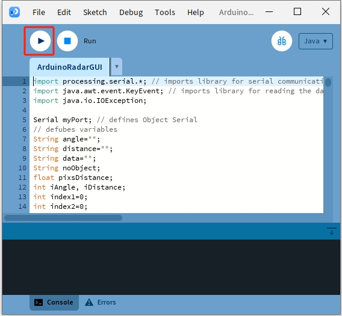

6. You will see the servo scanning left and right with the ultrasonic module, displaying the angles of detected objects within 40 cm on the Processing interface.

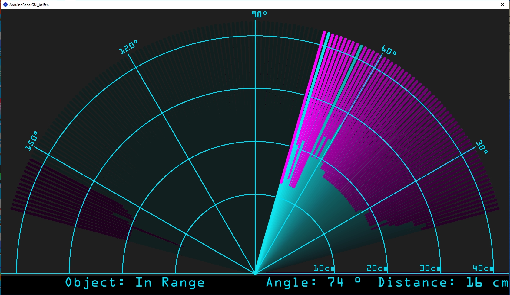

7. If the display is not fully visible, you can adjust the resolution according to your screen, which should be in a 16:9 ratio. Additionally, you can uncomment ``fullScreen();``, which will make the Processing display fullscreen; press ``ESC`` to exit.

.. note::

  You can also adjust the entire interface to your liking. For detailed information on the functions in the code, please refer to: |link_processing_reference|.

.. code-block:: Arduino
  :emphasize-lines: 3,4

  void setup() {

    //fullScreen(); // comment out this line if you do not want full-screen display.
    size (1680, 945); // ***CHANGE THIS TO YOUR SCREEN RESOLUTION***

    smooth();
    myPort = new Serial(this, "COM39", 9600); // starts the serial communication
    myPort.bufferUntil('.'); // reads the data from the serial port up to the character '.'. So actually it reads this: angle,distance.
    orcFont = loadFont("OCRAExtended-30.vlw");
  }

8. Finally, remember to save your code and tidy up your workspace.

**Summary**

In this lesson, we built a Arduino radar system using a servo and an ultrasonic module, which sweeps back and forth from 0 to 180 degrees. We then displayed the detected objects and their corresponding angles on an animated interface created with Processing PDE, simulating a real-life radar system.

We learned how to transmit data from the Arduino IDE to the Processing PDE via serial communication, enabling data exchange between the two programming platforms. Additionally, we explored the basics of the Processing programming environment, a tool that can be used to create simple animations and visualize data effectively.

Processing, while based on Java, has a very straightforward and simple set of programming elements, making it accessible even for beginners. You are encouraged to continue exploring Processing to fully leverage its capabilities for creative and visual projects. For more insights and tutorials, you can visit this Getting Started with Processing tutorial.