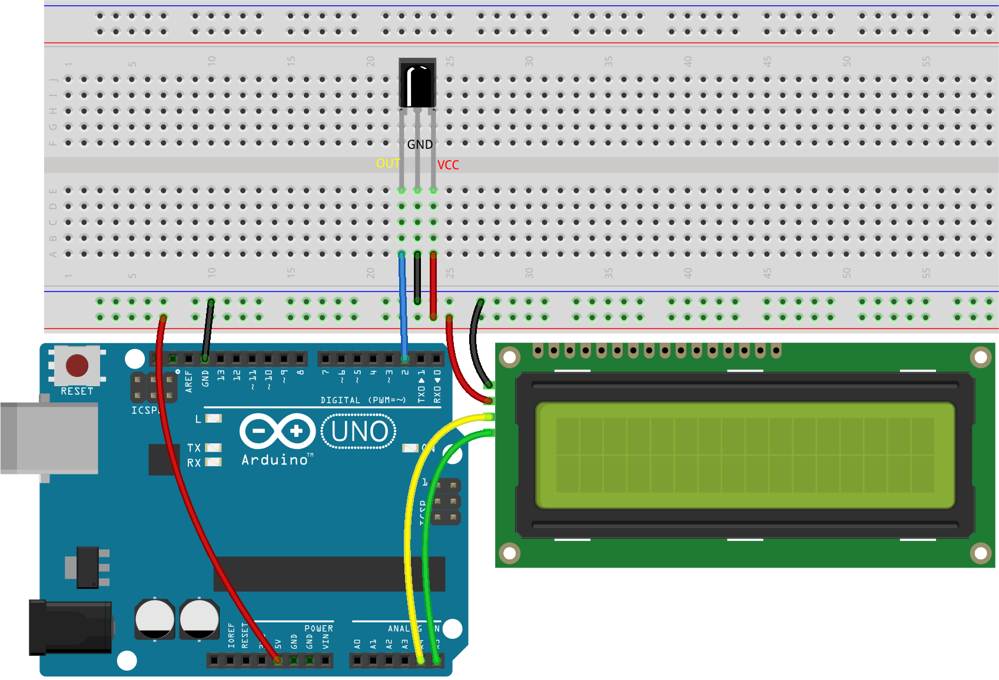
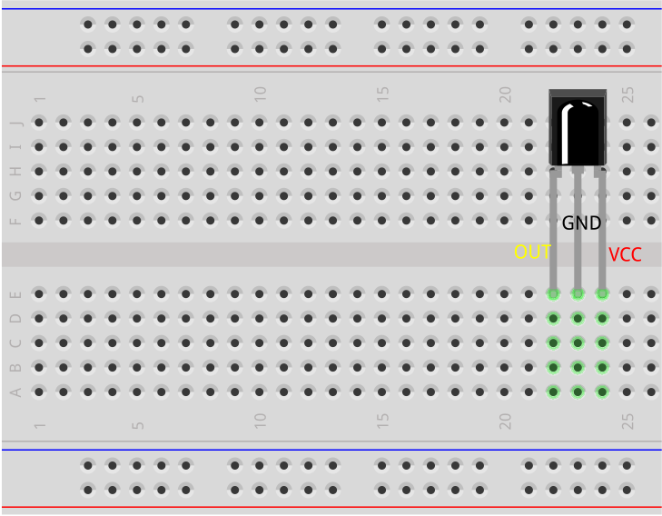
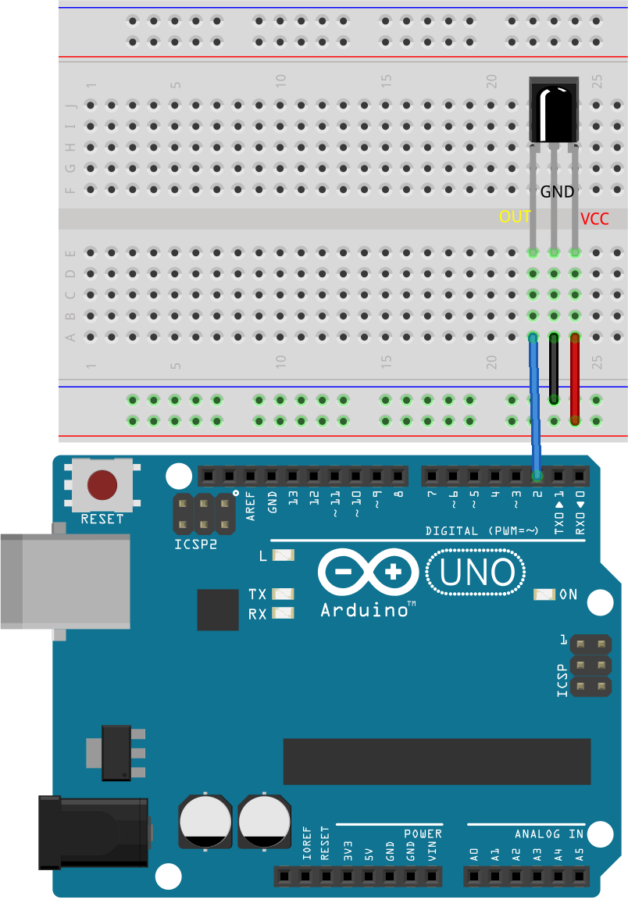
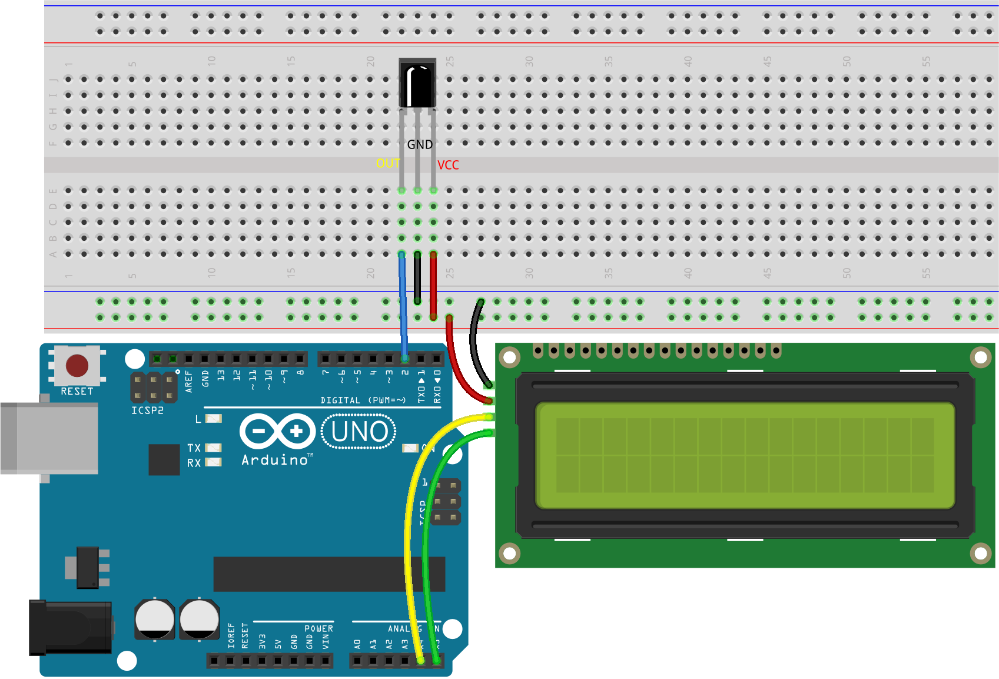

.. note::

    Hallo, willkommen in der SunFounder Raspberry Pi & Arduino & ESP32 Enthusiasten-Community auf Facebook! Tauche tiefer in die Welt von Raspberry Pi, Arduino und ESP32 mit gleichgesinnten Enthusiasten ein.

    **Warum beitreten?**

    - **Expertenunterstützung**: Lösen Sie nach dem Kauf auftretende Probleme und technische Herausforderungen mit Hilfe unserer Community und unseres Teams.
    - **Lernen & Teilen**: Tauschen Sie Tipps und Tutorials aus, um Ihre Fähigkeiten zu verbessern.
    - **Exklusive Vorschauen**: Erhalten Sie frühzeitigen Zugang zu neuen Produktankündigungen und exklusiven Einblicken.
    - **Spezielle Rabatte**: Genießen Sie exklusive Rabatte auf unsere neuesten Produkte.
    - **Festliche Aktionen und Gewinnspiele**: Nehmen Sie an Gewinnspielen und festlichen Aktionen teil.

    👉 Bereit, mit uns zu entdecken und zu kreieren? Klicken Sie auf [|link_sf_facebook|] und treten Sie noch heute bei!

31. Zahlenraten
==========================
Willkommen zur heutigen Lektion! In dieser interaktiven Lektion kombinieren wir Spaß mit Lernen, indem wir die Integration eines IR-Fernbedieners und eines LCD-Displays erforschen, um ein Spiel zu erstellen, das Sie herausfordert, eine versteckte Zahl zu erraten.

Zahlenraten ist ein unterhaltsames Partyspiel, bei dem Sie und Ihre Freunde abwechselnd eine Zahl (0~99) eingeben. Der Bereich wird mit jeder Eingabe kleiner, bis ein Spieler das Rätsel richtig beantwortet. Dann ist der Spieler besiegt und wird bestraft. Zum Beispiel, wenn die Glückszahl 51 ist, die Spieler jedoch nicht sehen können, und Spieler 1 die Zahl 50 eingibt, ändert sich der Bereich auf 50~99; gibt Spieler 2 70 ein, kann der Bereich 50~70 sein; wenn Spieler 3 51 eingibt, ist er oder sie der Unglückliche. Hier verwenden wir einen IR-Fernbediener, um Zahlen einzugeben, und ein LCD, um die Ergebnisse anzuzeigen.

.. raw:: html

    <video muted controls style = "max-width:90%">
        <source src="_static/video/31_guess_number.mp4" type="video/mp4">
        Your browser does not support the video tag.
    </video>

In dieser Lektion werden Sie in der Lage sein:

* Lernen, wie man Zufallszahlen generiert, die als geheimes Ziel im Spiel dienen.
* Benutzereingaben mithilfe einer Infrarotfernbedienung implementieren, um Zahlen zu erraten.
* Ein LCD verwenden, um sofortiges Feedback zu den Vermutungen zu geben, ob sie zu hoch, zu niedrig oder korrekt sind.
* Bedingungs- und Schleifenstrukturen nutzen, um die Spiellogik und den Ablauf zu steuern.

Aufbau der Schaltung
--------------------------------
**Benötigte Komponenten**

.. list-table:: 
   :widths: 25 25 25 25
   :header-rows: 0

   * - 1 * Arduino Uno R3
     - 1 * I2C LCD1602
     - 1 * IR-Empfänger
     - 1 * Fernbedienung
   * - |list_uno_r3| 
     - |list_i2c_lcd1602| 
     - |list_receiver| 
     - |list_remote| 
   * - 1 * USB-Kabel
     - 1 * Steckbrett
     - Jumper-Kabel
     - 
   * - |list_usb_cable| 
     - |list_breadboard| 
     - |list_wire| 
     - 

**Schritt-für-Schritt Aufbau**

Folgen Sie dem Schaltplan oder den folgenden Schritten, um Ihre Schaltung aufzubauen.

1. Setzen Sie den Infrarotempfänger in das Steckbrett ein. Der Infrarotempfänger hat eine Vorder- und Rückseite, wobei die hervorstehende Seite die Vorderseite ist. Die Reihenfolge der Pins von links nach rechts ist OUT, GND und VCC.

2. Verbinden Sie den OUT-Pin des Infrarotempfängers mit Pin 2 des Arduino Uno R3, GND mit der Minus-Schiene des Steckbretts und VCC mit der Plus-Schiene des Steckbretts.

3. Verbinden Sie das I2C LCD1602-Modul: GND mit der Minus-Schiene des Steckbretts, VCC mit der Plus-Schiene des Steckbretts, SDA mit Pin A4 und SCL mit Pin A5.

4. Schließen Sie schließlich die GND- und 5V-Pins des Arduino Uno R3 an die Minus- und Plus-Schienen des Steckbretts an.

Codeerstellung
-------------------
Um ein Zahlenratenspiel zu implementieren, müssen Sie die folgenden Aspekte sorgfältig berücksichtigen:

* **Zufallszahl**: Implementieren Sie eine Methode zur Generierung einer zufälligen Zielzahl.
* **Benutzereingabe**: Entscheiden Sie, wie die Spieler ihre Vermutungen eingeben (z.B. Tastatur, IR-Fernbedienung).
* **Feedback**: Bestimmen Sie, wie Sie die Spieler darüber informieren, ob ihre Vermutung zu hoch, zu niedrig oder korrekt ist.
* **Spielgrenzen**: Setzen Sie Grenzen für die Vermutungen, um das Spiel zu strukturieren und die Schwierigkeit anzupassen.

Nun beginnen wir mit dem Schreiben des Codes, um das Zahlenratenspiel zu implementieren.

.. note::

  Wenn Sie mit dem IR-Empfänger und dem I2C LCD1602 noch nicht vertraut sind, können Sie deren grundlegende Verwendung in den folgenden Projekten erlernen:

  * :ref:`ar_ir_receiver`
  * :ref:`ar_i2c_lcd1602`

  Hier werden die Bibliotheken ``LiquidCrystal I2C`` und ``IRremote`` verwendet, die Sie über den **Bibliotheks-Manager** installieren können.

1. Öffnen Sie die zuvor gespeicherte Skizze ``Lesson22_Decode_Key_Value``. Klicken Sie auf "Speichern unter..." im Menü "Datei" und benennen Sie die Datei in ``Lesson31_Guess_Number`` um. Klicken Sie auf "Speichern".

.. code-block:: Arduino

  #include <IRremote.h>  // IRremote-Bibliothek einbinden

  const int receiverPin = 2;  // Definieren Sie die Pinnummer für den IR-Sensor

  void setup() {
    // Starten Sie die serielle Kommunikation mit einer Baudrate von 9600
    Serial.begin(9600);
    // Initialisieren Sie den IR-Empfänger am angegebenen Pin mit LED-Rückmeldung aktiviert
    IrReceiver.begin(receiverPin, ENABLE_LED_FEEDBACK);
  }

  void loop() {
    if (IrReceiver.decode()) {  // Prüfen, ob der IR-Empfänger ein Signal empfangen hat
      bool result = 0;
      String key = decodeKeyValue(IrReceiver.decodedIRData.command);
      if (key != "ERROR") {
        Serial.println(key);  // Den lesbaren Befehl ausgeben
        delay(100);
      }
    IrReceiver.resume();  // Empfang des nächsten Werts ermöglichen
    }
  }

  // Funktion zur Zuordnung der empfangenen IR-Signale zu den entsprechenden Tasten
  String decodeKeyValue(long result) {
    switch (result) {
      case 0x45: return "POWER";
      case 0x47: return "MUTE";
      case 0x46: return "MODE";
      case 0x44: return "PLAY/PAUSE";
      case 0x40: return "BACKWARD";
      case 0x43: return "FORWARD";
      case 0x7: return "EQ";
      case 0x15: return "-";
      case 0x9: return "+";
      case 0x19: return "CYCLE";
      case 0xD: return "U/SD";
      case 0x16: return "0";
      case 0xC: return "1";
      case 0x18: return "2";
      case 0x5E: return "3";
      case 0x8: return "4";
      case 0x1C: return "5";
      case 0x5A: return "6";
      case 0x42: return "7";
      case 0x52: return "8";
      case 0x4A: return "9";
      case 0x0: return "ERROR";
      default: return "ERROR";
    }
  }

2. Binden Sie die notwendigen Bibliotheken für die Verwendung des LCD ein und initialisieren Sie es mit der richtigen I2C-Adresse und -Größe.

.. code-block:: Arduino
  :emphasize-lines: 2,3,5

  #include <IRremote.h>           // Einbinden der IR-Fernbedienungs-Bibliothek
  #include <Wire.h>               // Einbinden der Wire-Bibliothek für I2C-Kommunikation
  #include <LiquidCrystal_I2C.h>  // Einbinden der LCD-Bibliothek für I2C

  LiquidCrystal_I2C lcd(0x27, 16, 2);  // Initialisieren des LCD (Adresse 0x27, 16 Spalten, 2 Zeilen)

  const int receiverPin = 2;  // Pin des IR-Sensors

3. Erstellen Sie nun vier Variablen, um die eingegebene Zahl, die zufällig generierte Zielzahl, das obere Limit des Ratebereichs (99) und das untere Limit (0) zu speichern.

.. code-block:: Arduino
  :emphasize-lines: 9-12

  #include <IRremote.h>           // Einbinden der IR-Fernbedienungs-Bibliothek
  #include <Wire.h>               // Einbinden der Wire-Bibliothek für I2C-Kommunikation
  #include <LiquidCrystal_I2C.h>  // Einbinden der LCD-Bibliothek für I2C

  LiquidCrystal_I2C lcd(0x27, 16, 2);  // Initialisieren des LCD (Adresse 0x27, 16 Spalten, 2 Zeilen)

  const int receiverPin = 2;  // Pin des IR-Sensors

  int guessedNumber = 0;  // Vom Benutzer eingegebene Zahl
  int targetNumber = 0;   // Zufällig generierte Zielzahl
  int upper = 99;         // Oberes Limit des Ratebereichs
  int lower = 0;          // Unteres Limit des Ratebereichs

4. Fügen Sie im ``setup()``-Abschnitt Code hinzu, um das LCD zu initialisieren und eine neue Zielzahl zu generieren.

.. code-block:: Arduino
  :emphasize-lines: 4-6

  void setup() {
    Serial.begin(9600);                                  // Initialisieren der seriellen Kommunikation mit 9600 bps
    IrReceiver.begin(receiverPin, ENABLE_LED_FEEDBACK);  // Initialisieren des IR-Empfängers mit LED-Rückmeldung
    lcd.init();                                          // Initialisieren des LCD
    lcd.backlight();                                     // Einschalten der Hintergrundbeleuchtung
    NewTargetNumber();                                   // Initialisieren der Spielwerte
  }

5. Erstellen Sie im ``loop()``-Abschnitt zunächst eine boolesche Variable ``result`` und prüfen Sie dann, ob die gedrückte Taste "POWER" ist. Falls ja, rufen Sie die Funktion ``NewTargetNumber()`` auf, um eine neue Zielzahl zu generieren.

.. code-block:: Arduino
  :emphasize-lines: 9, 12-14

  void loop() {
    if (IrReceiver.decode()) {           // Überprüfen, ob eine IR-Nachricht empfangen wurde
      String key = decodeKeyValue(IrReceiver.decodedIRData.command);
      if (key != "ERROR") {
        Serial.println(key);  // Den lesbaren Befehl ausgeben
        delay(100);
      }

      bool result = false;

      // Überprüfen der empfangenen Taste und entsprechende Aktion ausführen
      if (key == "POWER") {
        NewTargetNumber();  // Zurücksetzen der Spielwerte
      }
    IrReceiver.resume();  // Ermöglichen des Empfangs des nächsten Werts
    }
  }

6. Wenn eine Ziffer zwischen 0 und 9 gedrückt wird, speichern Sie die eingegebene Zahl in der Variablen ``guessedNumber``.

* Wenn die kumulierte Zahl größer oder gleich 10 ist, rufen Sie die Funktion ``checkGuess()`` auf, um zu überprüfen, ob die geratene Zahl der Zielzahl entspricht. Das Ergebnis (true oder false) wird in der Variable ``result`` gespeichert.
* Wenn eine einzelne Ziffer eingegeben wird, rufen Sie direkt die Funktion ``displayResult()`` auf, um diese auf dem LCD anzuzeigen.
* ``guessedNumber = guessedNumber * 10 + key.toInt();``: Diese Zeile dient dazu, die vom Benutzer eingegebenen Ziffern zu einer vollständigen Zahl zu kumulieren. Zum Beispiel wird guessedNumber zuerst 3, wenn der Benutzer '3' drückt, und dann zu 35, wenn er '5' drückt. ``key.toInt()`` konvertiert die String-Darstellung der Zahl in eine Ganzzahl.

.. code-block:: Arduino
  :emphasize-lines: 4-11

  // Überprüfen der empfangenen Taste und entsprechende Aktion ausführen
  if (key == "POWER") {
    NewTargetNumber();  // Zurücksetzen der Spielwerte
  } else if (key >= "0" && key <= "9") {
    guessedNumber = guessedNumber * 10;
    guessedNumber += key.toInt();  // Akkumulierte Eingabe
    if (guessedNumber >= 10) {
      result = checkGuess();  // Überprüfen, ob die geratene Zahl korrekt ist
    }
    displayResult(result);  // Eingabe und Ergebnis auf dem LCD anzeigen
  }

7. Wenn die "CYCLE"-Taste gedrückt wird, rufen Sie die Funktion ``checkGuess()`` auf, um zu überprüfen, ob die eingegebene geratene Zahl korrekt ist. Wenn sie korrekt ist, wird ``true`` zurückgegeben; andernfalls wird ``false`` zurückgegeben, und der zurückgegebene Wert in der Variablen ``result`` gespeichert. Anschließend wird die Funktion ``displayResult()`` aufgerufen, um Informationen auf dem LCD anzuzeigen.

.. note::

  Im vorherigen ``else if``-Statement wird die Zahl nur dann mit der Zielzahl verglichen, wenn sie größer oder gleich 10 ist. Bei Zahlen kleiner als 10 werden sie lediglich auf dem LCD angezeigt.

  Daher wird hier eine "CYCLE"-Taste hinzugefügt. Wenn Sie eine einzelne Ziffer eingeben möchten, können Sie nach der Eingabe der Ziffer die "CYCLE"-Taste drücken, um sie mit der Zielzahl zu vergleichen.

.. code-block:: Arduino
  :emphasize-lines: 8-11

      } else if (key >= "0" && key <= "9") {
        guessedNumber = guessedNumber * 10;
        guessedNumber += key.toInt();  // Akkumulierte Eingabe
        if (guessedNumber >= 10) {
          result = checkGuess();  // Überprüfen, ob die geratene Zahl korrekt ist
        }
        displayResult(result);  // Ergebnis auf dem LCD anzeigen
      } else if (key == "CYCLE") {
        result = checkGuess();  // Überprüfen, ob die geratene Zahl korrekt ist
        displayResult(result);  // Ergebnis auf dem LCD anzeigen
      }
      IrReceiver.resume();  // Ermöglichen des Empfangs des nächsten Werts
    }
  }

8. Die Funktion ``NewTargetNumber()`` initialisiert das Spiel, indem sie eine neue Zielzahl generiert, die der Benutzer erraten soll. 

* Sie setzt die Grenzen des Ratebereichs auf ihre Anfangswerte zurück, löscht den LCD-Bildschirm und zeigt eine Willkommensnachricht sowie Anweisungen an.
* Sie setzt auch die geratene Zahl zurück und druckt die Zielzahl zur Fehlerbehebung auf den seriellen Monitor.

.. code-block:: Arduino

  void NewTargetNumber() {
    randomSeed(analogRead(A0));    // Initialisieren des Zufallszahlengenerators
    targetNumber = random(99);     // Neue Zielzahl generieren
    upper = 99;                    // Oberes Limit zurücksetzen
    lower = 0;                     // Unteres Limit zurücksetzen
    lcd.clear();                   // LCD löschen
    lcd.print("    Welcome!");  // Willkommensnachricht
    lcd.setCursor(0, 1);           // Cursor auf die zweite Zeile setzen
    lcd.print(" Guess Number!");   // Anweisungsnachricht
    guessedNumber = 0;             // Geratene Zahl zurücksetzen
    Serial.print("point is ");
    Serial.println(targetNumber);  // Zielzahl im seriellen Monitor zur Fehlerbehebung ausgeben
  }

9. Die Funktion ``checkGuess()`` überprüft die vom Benutzer eingegebene Zahl im Vergleich zur Zielzahl.

* Wenn die Eingabe höher als die Zielzahl ist, wird das obere Limit aktualisiert.
* Wenn die Eingabe niedriger ist, wird das untere Limit aktualisiert.
* Wenn die Eingabe korrekt ist, wird die geratene Zahl zurückgesetzt und ``true`` zurückgegeben.
* Andernfalls wird die geratene Zahl zurückgesetzt und ``false`` zurückgegeben.

.. code-block:: Arduino

  bool checkGuess() {
    if (guessedNumber > targetNumber) {
      if (guessedNumber < upper) upper = guessedNumber;  // Oberes Limit aktualisieren
    } else if (guessedNumber < targetNumber) {
      if (guessedNumber > lower) lower = guessedNumber;  // Unteres Limit aktualisieren
    } else if (guessedNumber == targetNumber) {
      guessedNumber = 0;
      return true;  // Richtige Zahl
    }
    guessedNumber = 0;
    return false;  // Falsche Zahl
  }

10. Die Funktion ``displayResult()`` aktualisiert das LCD-Display basierend darauf, ob die Eingabe des Benutzers korrekt ist oder nicht.

* Wenn die Zahl korrekt ist, zeigt das LCD eine Erfolgsmeldung an, pausiert für 5 Sekunden und generiert dann eine neue Zielzahl, um das Spiel zurückzusetzen.
* Wenn die Zahl falsch ist, zeigt das LCD die aktuelle geratene Zahl und den aktualisierten Ratebereich an.

.. code-block:: Arduino

  void displayResult(bool result) {
    lcd.clear();  // LCD löschen
    if (result) {
      lcd.setCursor(0, 1);
      lcd.print(" You've got it! ");  // Erfolgsmeldung anzeigen
      delay(5000);                    // Pause vor dem Zurücksetzen
      NewTargetNumber();              // Spielwerte zurücksetzen
    } else {
      lcd.print("Enter number:");
      lcd.print(guessedNumber);  // Aktuelle geratene Zahl anzeigen
      lcd.setCursor(0, 1);
      lcd.print(lower);
      lcd.print(" < Point < ");
      lcd.print(upper);  // Aktuellen Ratebereich anzeigen
    }
  }

11. Der komplette Code sieht wie folgt aus und kann auf das Arduino-Board hochgeladen werden.

.. code-block:: Arduino

  #include <IRremote.h>           // Einbinden der IR-Fernbedienungs-Bibliothek
  #include <Wire.h>               // Einbinden der Wire-Bibliothek für I2C-Kommunikation
  #include <LiquidCrystal_I2C.h>  // Einbinden der LCD-Bibliothek für I2C

  LiquidCrystal_I2C lcd(0x27, 16, 2);  // Initialisieren des LCD (Adresse 0x27, 16 Spalten, 2 Zeilen)

  const int receiverPin = 2;  // Pin des IR-Sensors

  int guessedNumber = 0;  // Vom Benutzer eingegebene Zahl
  int targetNumber = 0;   // Zufällig generierte Zielzahl
  int upper = 99;         // Oberes Limit des Ratebereichs
  int lower = 0;          // Unteres Limit des Ratebereichs

  void setup() {
    Serial.begin(9600);                                  // Initialisieren der seriellen Kommunikation mit 9600 bps
    IrReceiver.begin(receiverPin, ENABLE_LED_FEEDBACK);  // Initialisieren des IR-Empfängers mit LED-Rückmeldung
    lcd.init();                                          // Initialisieren des LCD
    lcd.backlight();                                     // Einschalten der Hintergrundbeleuchtung
    NewTargetNumber();                                   // Initialisieren der Spielwerte
  }

  void loop() {
    if (IrReceiver.decode()) {  // Überprüfen, ob der IR-Empfänger ein Signal erhalten hat
      String key = decodeKeyValue(IrReceiver.decodedIRData.command);
      if (key != "ERROR") {
        Serial.println(key);  // Lesbares Kommando ausgeben
        delay(100);
      }

      bool result = false;

      // Überprüfen des empfangenen Befehls und entsprechende Aktion ausführen
      if (key == "POWER") {
        NewTargetNumber();  // Spielwerte zurücksetzen
      } else if (key >= "0" && key <= "9") {
        guessedNumber = guessedNumber * 10;
        guessedNumber += key.toInt();  // Eingegebene Ziffern akkumulieren
        if (guessedNumber >= 10) {
          result = checkGuess();  // Überprüfen, ob die geratene Zahl korrekt ist
        }
        displayResult(result);  // Eingabe und Ergebnis auf dem LCD anzeigen
      } else if (key == "CYCLE") {
        result = checkGuess();  // Überprüfen, ob die geratene Zahl korrekt ist
        displayResult(result);  // Ergebnis auf dem LCD anzeigen
      }
      IrReceiver.resume();  // Empfang des nächsten Werts ermöglichen
    }
  }

  void NewTargetNumber() {
    randomSeed(analogRead(A0));    // Zufallszahlengenerator initialisieren
    targetNumber = random(99);     // Neue Zielzahl generieren
    upper = 99;                    // Oberes Limit zurücksetzen
    lower = 0;                     // Unteres Limit zurücksetzen
    lcd.clear();                   // LCD löschen
    lcd.print("    Willkommen!");  // Willkommensnachricht
    lcd.setCursor(0, 1);           // Cursor auf die zweite Zeile setzen
    lcd.print(" Zahl erraten!");   // Anweisungsnachricht
    guessedNumber = 0;             // Geratene Zahl zurücksetzen
    Serial.print("Ziel ist ");
    Serial.println(targetNumber);  // Zielzahl im seriellen Monitor zur Fehlerbehebung ausgeben
  }

  bool checkGuess() {
    if (guessedNumber > targetNumber) {
      if (guessedNumber < upper) upper = guessedNumber;  // Oberes Limit aktualisieren
    } else if (guessedNumber < targetNumber) {
      if (guessedNumber > lower) lower = guessedNumber;  // Unteres Limit aktualisieren
    } else if (guessedNumber == targetNumber) {
      guessedNumber = 0;
      return true;  // Richtige Zahl
    }
    guessedNumber = 0;
    return false;  // Falsche Zahl
  }

  void displayResult(bool result) {
    lcd.clear();  // LCD löschen
    if (result) {
      lcd.setCursor(0, 1);
      lcd.print(" You've got it! ");  // Erfolgsmeldung anzeigen
      delay(5000);                    // Pause vor dem Zurücksetzen
      NewTargetNumber();              // Spielwerte zurücksetzen
    } else {
      lcd.print("Enter number:");
      lcd.print(guessedNumber);  // Aktuelle geratene Zahl anzeigen
      lcd.setCursor(0, 1);
      lcd.print(lower);
      lcd.print(" < Point < ");
      lcd.print(upper);  // Aktuellen Ratebereich anzeigen
    }
  }

  // Funktion zur Zuordnung empfangener IR-Signale zu den entsprechenden Tasten
  String decodeKeyValue(long result) {
    switch (result) {
      case 0x45: return "POWER";
      case 0x47: return "MUTE";
      case 0x46: return "MODE";
      case 0x44: return "PLAY/PAUSE";
      case 0x40: return "BACKWARD";
      case 0x43: return "FORWARD";
      case 0x7: return "EQ";
      case 0x15: return "-";
      case 0x9: return "+";
      case 0x19: return "CYCLE";
      case 0xD: return "U/SD";
      case 0x16: return "0";
      case 0xC: return "1";
      case 0x18: return "2";
      case 0x5E: return "3";
      case 0x8: return "4";
      case 0x1C: return "5";
      case 0x5A: return "6";
      case 0x42: return "7";
      case 0x52: return "8";
      case 0x4A: return "9";
      case 0x0: return "ERROR";
      default: return "ERROR";
    }
  }

12. Jetzt können Sie eine beliebige Zifferntaste drücken und dann Zahlen gemäß dem angezeigten Zahlenbereich eingeben.

* Wenn Sie zwei Ziffern eingeben, wird nach der Eingabe der zweiten Ziffer direkt mit der Zielzahl verglichen.
* Wenn Sie eine einzelne Ziffer eingeben, müssen Sie die "CYCLE"-Taste erneut drücken, um den Vergleich mit der Zielzahl zu starten.
* Wenn die Eingabe höher als die Zielzahl ist, wird das obere Limit aktualisiert.
* Wenn die Eingabe niedriger ist, wird das untere Limit aktualisiert.
* Wenn die Eingabe korrekt ist, zeigt das LCD eine Erfolgsmeldung an, pausiert für 5 Sekunden und generiert dann eine neue Zielzahl, um das Spiel zurückzusetzen.

.. raw:: html

    <video muted controls style = "max-width:90%">
        <source src="_static/video/31_guess_number.mp4" type="video/mp4">
        Your browser does not support the video tag.
    </video>

13. Zum Schluss denken Sie daran, Ihren Code zu speichern und Ihren Arbeitsplatz aufzuräumen.

**Frage**

Welche zusätzlichen Komponenten könnten hinzugefügt werden, um das Spiel zu erweitern? Welche Rolle würden sie im Spiel spielen?

**Zusammenfassung**

In der heutigen Lektion haben wir erfolgreich ein Zahlenratespiel mit einem Arduino-Board erstellt, das Komponenten wie einen IR-Empfänger und ein LCD für dynamische Interaktionen integriert. Wir haben verschiedene Programmierkonzepte wie Zufallszahlengenerierung, Eingabeverarbeitung und bedingte Logik erforscht.
