.. note::

    Hallo, willkommen in der SunFounder Raspberry Pi & Arduino & ESP32 Enthusiasten-Community auf Facebook! Tauche tiefer in die Welt von Raspberry Pi, Arduino und ESP32 ein, gemeinsam mit anderen Enthusiasten.

    **Warum beitreten?**

    - **Expertenunterstützung**: Löse Probleme nach dem Kauf und technische Herausforderungen mit Hilfe unserer Community und unseres Teams.
    - **Lernen & Teilen**: Tausche Tipps und Tutorials aus, um deine Fähigkeiten zu erweitern.
    - **Exklusive Vorschauen**: Erhalte frühzeitigen Zugang zu neuen Produktankündigungen und ersten Einblicken.
    - **Spezielle Rabatte**: Profitiere von exklusiven Rabatten auf unsere neuesten Produkte.
    - **Festliche Aktionen und Gewinnspiele**: Nimm an Gewinnspielen und festlichen Aktionen teil.

    👉 Bereit, mit uns zu erkunden und zu kreieren? Klicke auf [|link_sf_facebook|] und tritt noch heute bei!

32. Stoppuhr
===================
In diesem spannenden Projekt lernen wir, wie man ein 4-stelliges 7-Segment-Display verwendet, um eine funktionsfähige Stoppuhr zu erstellen. Am Ende dieser Lektion wirst du verstehen, wie man ein mehrstelliges 7-Segment-Display steuert, und in der Lage sein, eine einfache Stoppuhr zu bauen, die die Zeit in Minuten und Sekunden misst. Mach dich bereit, in die Welt der digitalen Anzeigen einzutauchen und deine Arduino-Fähigkeiten zu erweitern!

.. raw:: html

    <video muted controls style = "max-width:90%">
        <source src="_static/video/32.stopwatch.mp4" type="video/mp4">
        Your browser does not support the video tag.
    </video>

Am Ende dieser Lektion wirst du:

* Lernen, wie man ein 4-stelliges 7-Segment-Display multiplexiert.
* Code schreiben, um Zahlen auf einer einzelnen Ziffer anzuzeigen.
* Eine scrollende Zahlenanzeige erstellen.
* Eine Stoppuhr implementieren, die ein 4-stelliges 7-Segment-Display verwendet, um Minuten und Sekunden zu verfolgen.
* Den ``AND``-Operator und den ``>>``-Operator kennenlernen.

Lerne das 4-stellige 7-Segment-Display kennen
--------------------------------------------------

**Einführung**

1. Finde das 4-stellige 7-Segment-Display.

.. image:: img/32_stopwatch_4_digit.png
  :align: center

Ein 7-Segment-Display ist eine 8-förmige Komponente, die 7 LEDs enthält. Jede der LEDs im Display ist einem Positionssegment zugeordnet, dessen Anschlussstift aus dem rechteckigen Kunststoffgehäuse herausgeführt wird. Diese LED-Anschlüsse sind von "a" bis "g" beschriftet, wobei jeder Buchstabe ein individuelles LED-Segment darstellt.

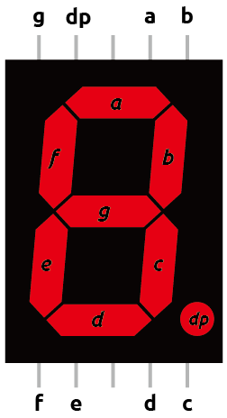

* :ref:`learn_7segment`

Ein 4-stelliges Display kombiniert vier 7-Segment-Anzeigen, wobei jede einzelne Ziffer darstellt. Um die Anzahl der benötigten Pins zu reduzieren, werden die Segmente jedes Displays multiplexiert, d.h., jeder Segmentpin ist mit den entsprechenden Segmentpins der anderen Displays verbunden.

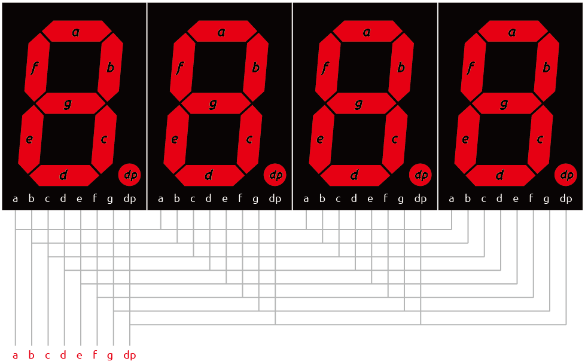

Dies reduziert die Anzahl der Pins, erhöht jedoch die Steuerungskomplexität. Zum Beispiel leuchtet das "a"-Segment bei Spannung an Pin "a" in allen Ziffern auf. Um zu steuern, welche Ziffer das Segment anzeigt, hat jede Ziffer einen separaten Steuerungspin (d1 ~ d4).

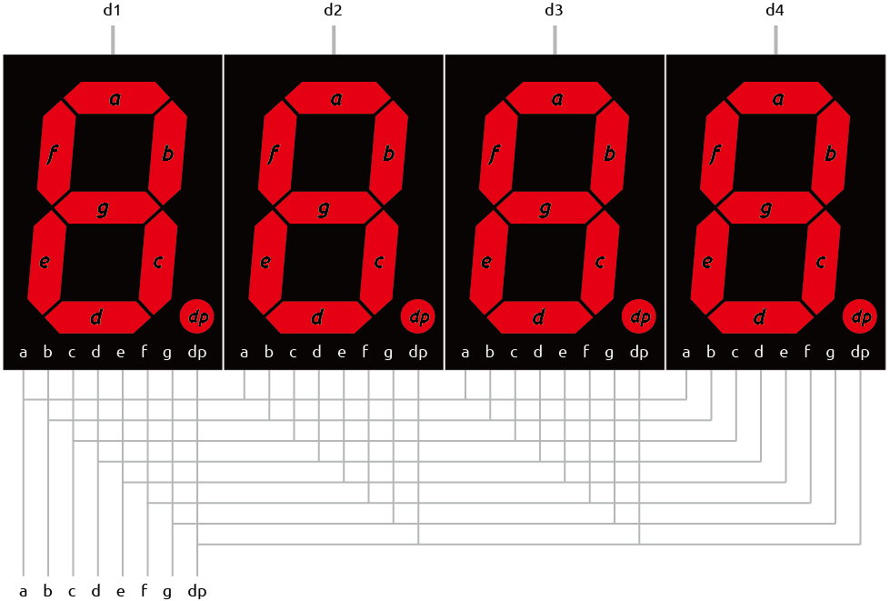

Wenn wir also die Zahl 2222 anzeigen wollen, müssen wir Spannung an die Pins d1, d2, d3 und d4 anlegen, da alle Anzeigen eine Ziffer anzeigen. Außerdem müssen wir Spannung an die Eingänge a, b, d, e, g und dp anlegen, wie unten gezeigt:

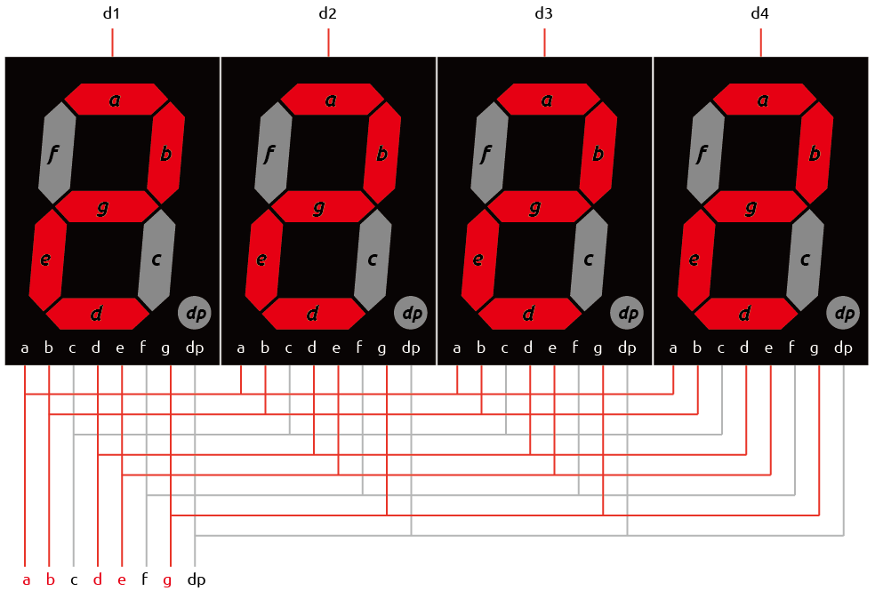

**Pinbelegung**

Ein typisches 4-stelliges 7-Segment-Display hat 12 Pins, sechs auf jeder Seite.

Vier Pins (d1, d2, d3 und d4) steuern die einzelnen Ziffern. Die verbleibenden Pins entsprechen den Segmenten.

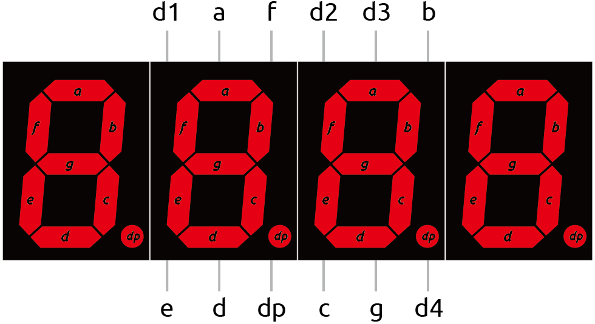

**Gemeinsame Kathode oder gemeinsame Anode**

Um festzustellen, ob ein 4-stelliges 7-Segment-Display eine gemeinsame Kathode oder eine gemeinsame Anode hat, kannst du ein Multimeter verwenden. Mit dem Multimeter kannst du auch testen, ob jedes Segment des Displays ordnungsgemäß funktioniert:

1. Stelle das Multimeter auf Diodentestmodus ein. Der Diodentest ist eine Funktion des Multimeters, die zur Überprüfung der Durchlassrichtung von Dioden oder ähnlichen Halbleiterbauelementen (wie LEDs) verwendet wird. Das Multimeter lässt einen kleinen Strom durch die Diode fließen. Wenn die Diode intakt ist, lässt sie den Strom durch.

.. image:: img/multimeter_diode.png
    :width: 300
    :align: center

2. Setze das 4-stellige 7-Segment-Display in ein Steckbrett ein. Führe ein Kabel in dieselbe Reihe wie Pin **d1** des Displays ein und berühre es mit der schwarzen Messleitung des Multimeters. Führe ein weiteres Kabel in dieselbe Reihe wie Pin **e** des Displays ein und berühre es mit der roten Messleitung.

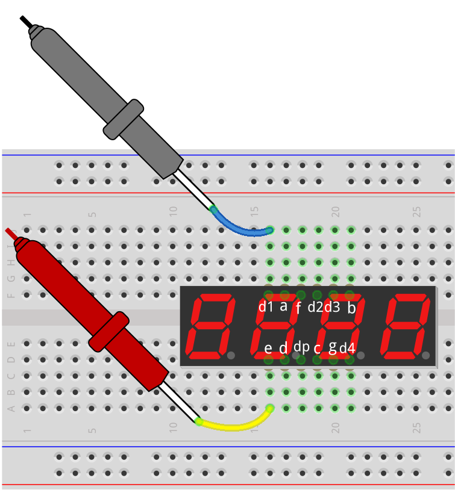

3. Beobachte, ob ein LED-Segment aufleuchtet. Wenn ja, zeigt dies an, dass das Display eine gemeinsame Kathode hat. Wenn nicht, vertausche die rote und schwarze Messleitung; wenn ein Segment nach dem Vertauschen aufleuchtet, zeigt dies an, dass das Display eine gemeinsame Anode hat.

.. note::

  Unser Kit enthält ein 4-stelliges 7-Segment-Display mit gemeinsamer Kathode. Setze die Steuerpins d1-d4 auf LOW und die Segmentpins a-g auf HIGH, damit es funktioniert.

**Frage**

Wenn du möchtest, dass die linke Ziffer (d1) des 4-stelligen 7-Segment-Displays "2" anzeigt, welche Pegel sollten die Pins d1~d4 und a~g haben?

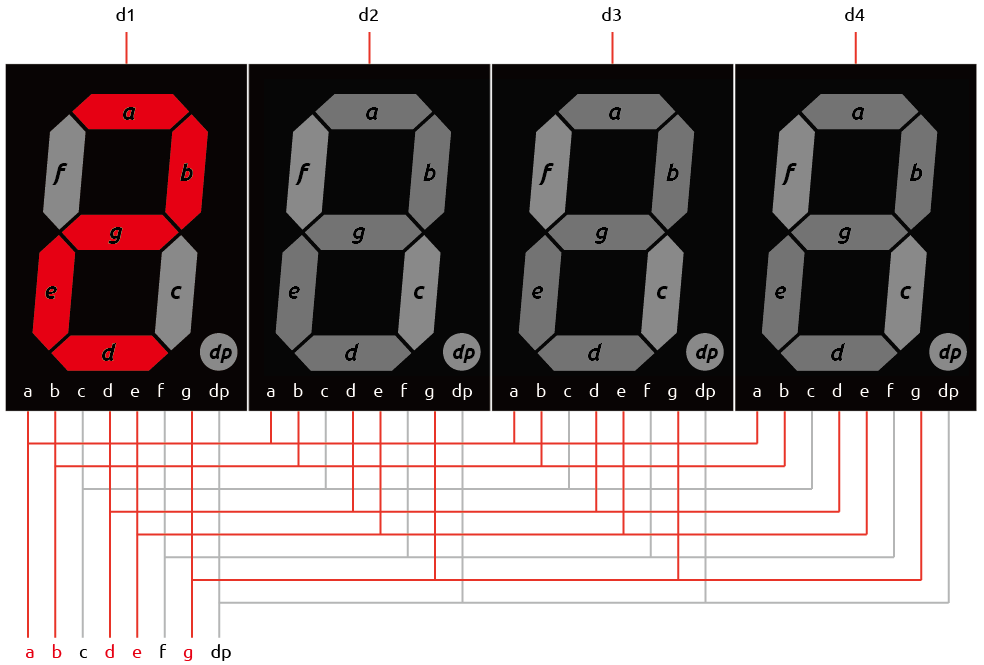

.. list-table::
    :widths: 20 20 20 20
    :header-rows: 1

    *   - 7-Segment-Anzeige
        - HIGH oder LOW
        - 7-Segment-Anzeige
        - HIGH oder LOW
    *   - d1
        - 
        - a
        -  
    *   - d2
        - 
        - b
        - 
    *   - d3
        - 
        - c
        -   
    *   - d4
        - 
        - d
        - 
    *   - 
        - 
        - e
        - 
    *   - 
        - 
        - f
        - 
    *   - 
        - 
        - g
        - 
    *   - 
        - 
        - dp
        - 

Den Schaltkreis aufbauen
------------------------------------

**Benötigte Komponenten**

.. list-table:: 
   :widths: 25 25 25 25
   :header-rows: 0

   * - 1 * Arduino Uno R3
     - 1 * 4-stelliges 7-Segment-Display
     - 4 * 220Ω Widerstand
     - 1 * Multimeter
   * - |list_uno_r3|
     - |list_4digit| 
     - |list_220ohm|
     - |list_meter|
   * - 1 * USB-Kabel
     - 1 * Steckbrett
     - 
     -   
   * - |list_usb_cable| 
     - |list_breadboard| 
     - 
     - 
    
**Aufbauschritte**

Folge dem Schaltplan oder den unten stehenden Schritten, um deinen Schaltkreis aufzubauen.

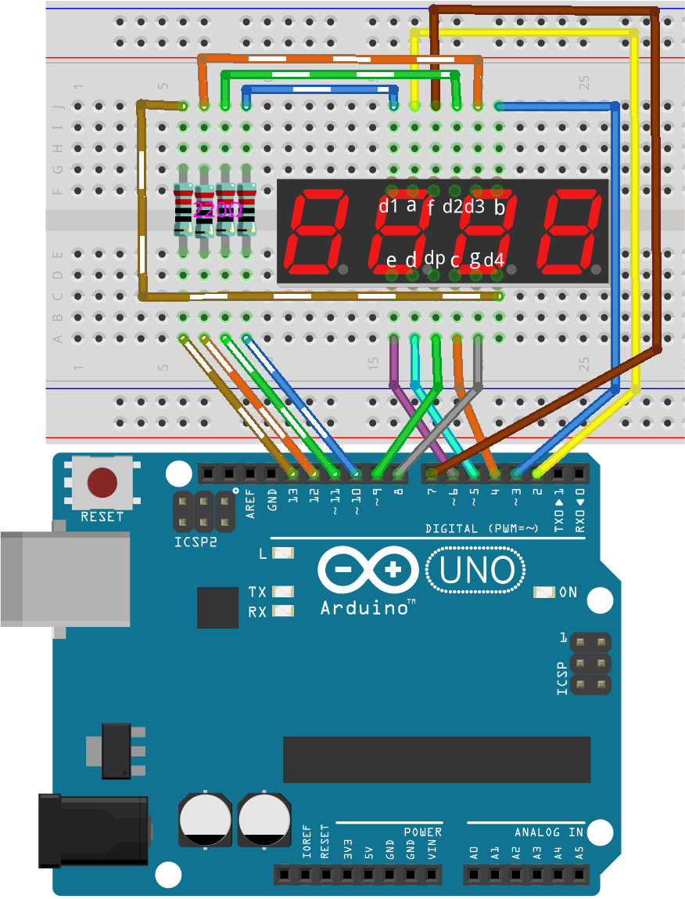

1. Setze das 4-stellige 7-Segment-Display in das Steckbrett ein.

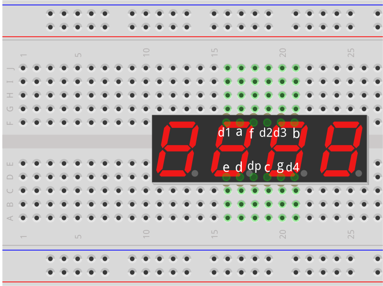

2. Setze vier 220Ω Widerstände in das Steckbrett ein.

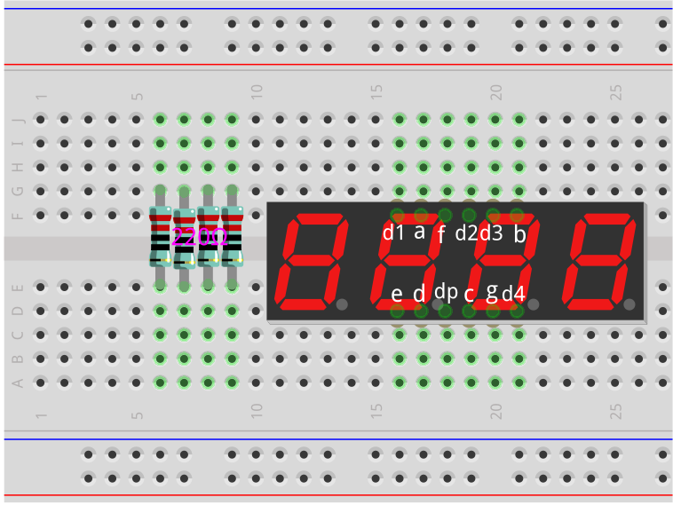

3. Verbinde den Steuerpin d1 mit einer Seite des ersten Widerstands. Verbinde die andere Seite des Widerstands mit Pin 10 des Arduino Uno R3. Dies verbindet den Steuerpin d1 über den Widerstand mit Pin 10.

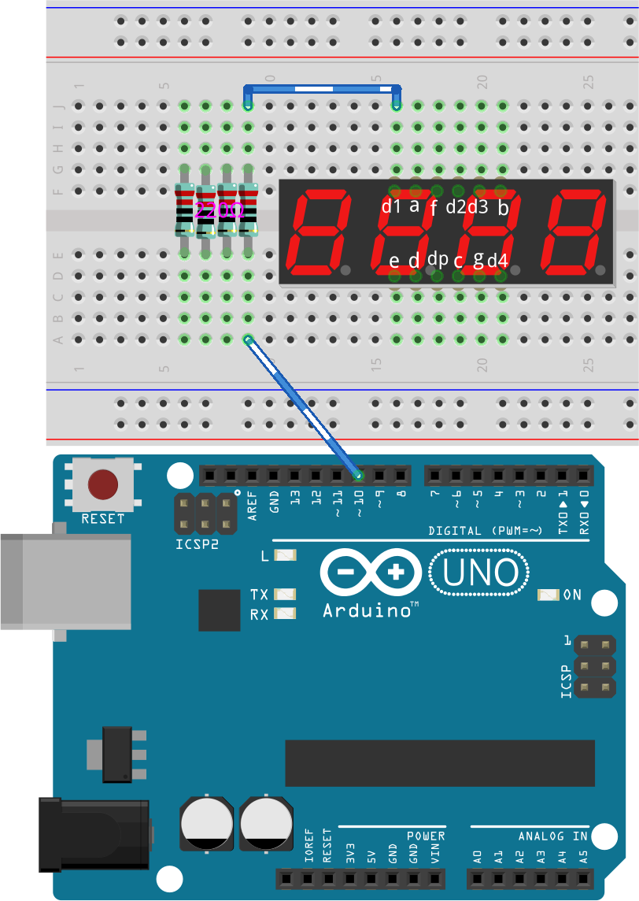

4. Verbinde auf ähnliche Weise d2 mit Pin 11, d3 mit Pin 12 und d4 mit Pin 13.

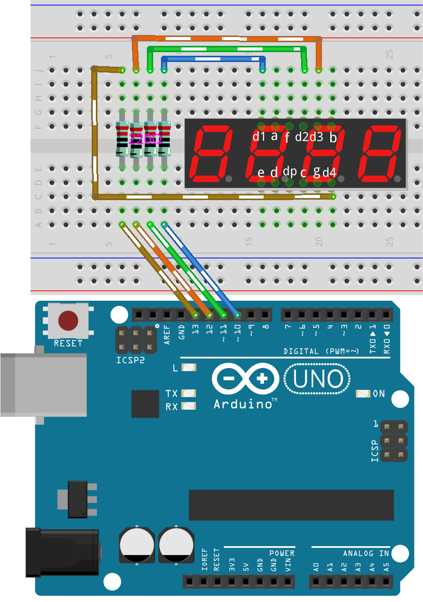
  
5. Verbinde nun die adp-Pins gemäß der Verdrahtungstabelle mit den Pins 2~9 des Arduino.

.. list-table::
    :widths: 20 20
    :header-rows: 1

    *   - 7-Segment-Anzeige
        - Arduino Uno R3
    *   - a
        - 2
    *   - b
        - 3 
    *   - c
        - 4
    *   - d
        - 5
    *   - e
        - 6
    *   - f
        - 7
    *   - g
        - 8
    *   - dp
        - 9

Codeerstellung - Anzeige der Zahl 2 auf einer Ziffer
--------------------------------------------------------

Nun lass uns den Code schreiben, um eine Zahl auf einer Ziffer des 4-stelligen 7-Segment-Displays anzuzeigen.

1. Öffne die Arduino IDE und starte ein neues Projekt, indem du im Menü „Datei“ auf „Neuer Sketch“ klickst.
2. Speichere deinen Sketch unter dem Namen ``Lesson32_Show_2_One_Digit`` mit ``Ctrl + S`` oder durch Klicken auf „Speichern“.

3. Erstelle zuerst zwei Arrays, um die Segment- und Ziffernpins des 4-stelligen 7-Segment-Displays zu speichern.

.. code-block:: Arduino

  // Definiere die Pins der Segmente und Ziffern des 4-stelligen 7-Segment-Displays
  int segmentPins[] = { 2, 3, 4, 5, 6, 7, 8, 9 };  // Segmente a~g und dp (Dezimalpunkt)
  int digitPins[] = { 10, 11, 12, 13 };            // Ziffern d1-d4

4. Setze in der Funktion ``void setup()`` alle Pins als Ausgänge. Da dies ein 4-stelliges 7-Segment-Display mit gemeinsamer Kathode ist, setze alle Segmentpins auf ``LOW`` und alle Ziffernpins auf ``HIGH``, um das Display initial auszuschalten.

.. code-block:: Arduino

  void setup() {
    // Setze alle Segmentpins als Ausgang
    for (int i = 0; i < 8; i++) {
      pinMode(segmentPins[i], OUTPUT);
      digitalWrite(segmentPins[i], LOW);  // Stelle sicher, dass alle Segmente initial ausgeschaltet sind
    }

    // Setze alle Ziffernpins als Ausgang und schalte sie aus (gemeinsame Kathode, daher ist HIGH aus)
    for (int i = 0; i < 4; i++) {
      pinMode(digitPins[i], OUTPUT);
      digitalWrite(digitPins[i], HIGH);
    }
  }

5. Um in der Funktion ``loop()`` die erste Ziffer links (d1) zu aktivieren, setze ihren Zustand auf ``LOW``. Wenn du die erste Ziffer rechts (d4) aktivieren möchtest, ändere ``0`` in ``3``.

.. code-block:: Arduino

  void loop() {
    digitalWrite(digitPins[0], LOW);     // Schalte die erste Ziffer ein
  }

6. Um eine Zahl, wie zum Beispiel 2, anzuzeigen, müssen die Segmente a, b, d, e und g auf HIGH gesetzt werden. Dadurch wird die Zahl 2 angezeigt.

.. code-block:: Arduino
  :emphasize-lines: 4-8

  void loop() {
    digitalWrite(digitPins[1], LOW);     // Erste Ziffer einschalten
    
    digitalWrite(segmentPins[0], HIGH);  // Segment a einschalten
    digitalWrite(segmentPins[1], HIGH);  // Segment b einschalten
    digitalWrite(segmentPins[3], HIGH);  // Segment d einschalten
    digitalWrite(segmentPins[4], HIGH);  // Segment e einschalten
    digitalWrite(segmentPins[6], HIGH);  // Segment g einschalten
  }

7. Lade den Code auf das Arduino Uno R3 Board hoch, und du solltest sehen, dass die erste Ziffer links die Zahl 2 anzeigt.

.. code-block:: Arduino

  // Definiere die Pins der Segmente und der Ziffern des 4-stelligen 7-Segment-Displays
  int segmentPins[] = { 2, 3, 4, 5, 6, 7, 8, 9 };  // Segmente a~g und dp (Dezimalpunkt)
  int digitPins[] = { 10, 11, 12, 13 };            // Ziffern d1-d4

  void setup() {
    // Setze alle Segmentpins als Ausgang
    for (int i = 0; i < 8; i++) {
      pinMode(segmentPins[i], OUTPUT);
      digitalWrite(segmentPins[i], LOW);  // Stelle sicher, dass alle Segmente initial ausgeschaltet sind
    }

    // Setze alle Ziffernpins als Ausgang und schalte sie aus (gemeinsame Kathode, daher ist HIGH aus)
    for (int i = 0; i < 4; i++) {
      pinMode(digitPins[i], OUTPUT);
      digitalWrite(digitPins[i], HIGH);
    }
  }

  void loop() {
    digitalWrite(digitPins[1], LOW);     // Erste Ziffer einschalten
    
    digitalWrite(segmentPins[0], HIGH);  // Segment a einschalten
    digitalWrite(segmentPins[1], HIGH);  // Segment b einschalten
    digitalWrite(segmentPins[3], HIGH);  // Segment d einschalten
    digitalWrite(segmentPins[4], HIGH);  // Segment e einschalten
    digitalWrite(segmentPins[6], HIGH);  // Segment g einschalten
  }

Codeerstellung - Zahlen auf einer Ziffer scrollen lassen
--------------------------------------------------------------
Im vorherigen Projekt haben wir gelernt, wie man eine einzelne Zahl, wie zum Beispiel die 2, auf einer Ziffer anzeigt. Aber was ist, wenn wir die Zahlen von 0~9 scrollen möchten? Die Verwendung derselben Methode wäre sehr langwierig.

In Lektion 28 haben wir die binären, dezimalen und hexadezimalen Codes für die Zahlen 0-9 auf einem Display mit gemeinsamer Kathode gelernt.

.. list-table::
    :widths: 20 40 30 30
    :header-rows: 1

    *   - Zahl
        - Binär
        - Dezimal
        - Hexadezimal
    *   - 0
        - B00111111
        - 63
        - 0x3F
    *   - 1
        - B00000110
        - 6
        - 0x06
    *   - 2
        - B01011011
        - 91
        - 0x5B
    *   - 3
        - B01001111
        - 79
        - 0x4F
    *   - 4
        - B01100110
        - 102
        - 0x66
    *   - 5
        - B01101101
        - 109
        - 0x6D
    *   - 6
        - B01111101
        - 125
        - 0x7D
    *   - 7
        - B00000111
        - 7
        - 0x07
    *   - 8
        - B01111111
        - 127
        - 0x7F
    *   - 9
        - B01101111
        - 111
        - 0x6F

Hier ist, wie man dies verwenden kann, um die Zahlen von 0~9 auf einer Ziffer scrollen zu lassen.

1. Öffne den Sketch, den du zuvor gespeichert hast, ``Lesson32_Show_2_One_Digit``. Wähle im Menü „Datei“ die Option „Speichern unter...“, und benenne ihn in ``Lesson32_Scroll_Numbers_One_Digit`` um. Klicke auf "Speichern".

2. Speichere die Binärcodes für die Zahlen 0~9 im Array ``numArray[]``.

.. code-block:: Arduino
  :emphasize-lines: 6

  // Definiere die Pins der Segmente und der Ziffern des 4-stelligen 7-Segment-Displays
  int segmentPins[] = { 2, 3, 4, 5, 6, 7, 8, 9 };  // Segmente a~g und dp (Dezimalpunkt)
  int digitPins[] = { 10, 11, 12, 13 };            // Ziffern d1-d4

  //Anzeige 0,1,2,3,4,5,6,7,8,9
  int numArray[] = { B00111111, B00000110, B01011011, B01001111, B01100110, B01101101, B01111101, B00000111, B01111111, B01101111 };

3. Erstelle nun eine Funktion, um die ausgewählte Zahl auf der gewünschten Ziffer anzuzeigen.

.. code-block:: Arduino

  void displayNumberOnDigit(int number, int digit) {
    // Schalte alle Ziffern aus, um Geisterbilder beim Wechsel der Zahlen zu vermeiden
    for (int i = 0; i < 4; i++) {
      // Ziffer ausschalten (gemeinsame Kathode -> HIGH ist aus)
      digitalWrite(digitPins[i], HIGH);
    }

    // Setze die Segmente für die aktuelle Zahl
    int value = numArray[number];
    for (int i = 0; i < 8; i++) {
      digitalWrite(segmentPins[i], (value >> i) & 1);  // Setze jedes Segment
    }

    // Schalte die ausgewählte Ziffer ein (gemeinsame Kathode -> LOW ist an)
    digitalWrite(digitPins[digit], LOW);
  }

* Schaltet alle Ziffern aus, um Geisterbilder zu vermeiden, insbesondere beim Ändern der angezeigten Zahl.

.. code-block:: Arduino
  
    // Schalte alle Ziffern aus, um Geisterbilder beim Wechsel der Zahlen zu vermeiden
    for (int i = 0; i < 4; i++) {
      // Ziffer ausschalten (gemeinsame Kathode -> HIGH ist aus)
      digitalWrite(digitPins[i], HIGH);
    }

* Verwendet eine bitweise Operation, um zu bestimmen, welche Segmente für jede Zahl aufleuchten sollen. 
  
  .. code-block:: Arduino
    :emphasize-lines: 4
    
    // Setze die Segmente für die aktuelle Zahl
    int value = numArray[number];
    for (int i = 0; i < 8; i++) {
      digitalWrite(segmentPins[i], (value >> i) & 1);  // Setze jedes Segment
    }
  
  * Hier wird das Element aus dem Array ``numArray[]`` der Variablen ``value`` zugewiesen. Wenn ``number`` 2 ist, wird das dritte Element (``B01011011``) aus ``numArray[]`` ``value`` zugewiesen.
  * Dann schreibt eine ``for``-Schleife jedes der 8 Bits von ``B01011011`` (ohne das B) in das Array ``segmentPins[i]`` mithilfe von ``digitalWrite()``. Das bedeutet, dass die Segmente a, b, d, e und g auf 1 gesetzt werden, und c, f und dp auf 0, was die Zahl 2 anzeigt.
  * ``&`` ist der ``AND``-Operator, der eine bitweise ``AND``-Operation auf die Zahlen durchführt. ``1&1`` ergibt 1, ``1&0`` ergibt 0.

  .. image:: img/32_stopwatch_and.png
    :width: 300
    :align: center
  
  * ``>>`` ist der Rechtsverschiebeoperator, der die Bits der Zahl um die angegebene Anzahl von Positionen nach rechts verschiebt. Zum Beispiel, wenn ``i`` 1 ist, verschiebt ``B01011011`` nach rechts um ein Bit, wobei das rechteste Bit entfernt wird und eine 0 links hinzugefügt wird. Wenn ``i`` 2 ist, verschiebt ``B01011011`` nach rechts um zwei Bits, wobei die zwei rechtesten Bits entfernt werden und zwei 0en links hinzugefügt werden.
  * Das Ergebnis der Rechtsverschiebung wird dann bitweise mit 1 verundet, um entweder 1 oder 0 zu erhalten.

  .. image:: img/32_stopwatch_shift_right.png
    :width: 500
    :align: center

* Aktiviert nur die Ziffer, auf der die Zahl angezeigt werden soll.

.. code-block:: Arduino
  
    // Schalte die ausgewählte Ziffer ein (gemeinsame Kathode -> LOW ist an)
    digitalWrite(digitPins[digit], LOW);

4. Im Hauptprogramm ``void loop`` verwende eine ``for``-Schleife, um die erste Ziffer von links durch die Zahlen 0 bis 9 scrollen zu lassen.

.. code-block:: Arduino
  :emphasize-lines: 4

  void loop() {
    // Zeige nacheinander die Zahlen 0 bis 9 auf der ersten Ziffer (D1) an
    for (int num = 0; num < 10; num++) {
      displayNumberOnDigit(num, 0);  // Zeige die Zahl auf der Ziffer 1 (Index 0) an
      delay(1000);                   // Zeige jede Zahl für 1 Sekunde an
    }
  }

5. Der vollständige Code ist unten aufgeführt. Du kannst ihn auf das Arduino Uno R3 hochladen, und du wirst sehen, wie die erste Ziffer von links durch die Zahlen 0 bis 9 scrollt.

.. code-block:: Arduino

  // Definiere die Pins der Segmente und der Ziffern des 4-stelligen 7-Segment-Displays
  int segmentPins[] = { 2, 3, 4, 5, 6, 7, 8, 9 };  // Segmente A-G und DP (Dezimalpunkt)
  int digitPins[] = { 10, 11, 12, 13 };            // Ziffern D1-D4

  // Anzeige 0,1,2,3,4,5,6,7,8,9
  int numArray[] = { B00111111, B00000110, B01011011, B01001111, B01100110, B01101101, B01111101, B00000111, B01111111, B01101111 };

  void setup() {
    // Setze alle Segmentpins als Ausgang
    for (int i = 0; i < 8; i++) {
      pinMode(segmentPins[i], OUTPUT);
      digitalWrite(segmentPins[i], LOW);  // Stelle sicher, dass alle Segmente initial ausgeschaltet sind
    }

    // Setze alle Ziffernpins als Ausgang und schalte sie aus (gemeinsame Kathode, daher ist HIGH aus)
    for (int i = 0; i < 4; i++) {
      pinMode(digitPins[i], OUTPUT);
      digitalWrite(digitPins[i], HIGH);
    }
  }

  void loop() {
    // Zeige nacheinander die Zahlen 0 bis 9 auf der ersten Ziffer (D1) an
    for (int num = 0; num < 10; num++) {
      displayNumberOnDigit(num, 0);  // Zeige die Zahl auf der Ziffer 1 (Index 0) an
      delay(1000);                   // Zeige jede Zahl für 1 Sekunde an
    }
  }

  void displayNumberOnDigit(int number, int digit) {
    // Schalte alle Ziffern aus, um Geisterbilder beim Wechsel der Zahlen zu vermeiden
    for (int i = 0; i < 4; i++) {
      // Ziffer ausschalten (gemeinsame Kathode -> HIGH ist aus)
      digitalWrite(digitPins[i], HIGH);
    }

    // Setze die Segmente für die aktuelle Zahl
    int value = numArray[number];
    for (int i = 0; i < 8; i++) {
      digitalWrite(segmentPins[i], (value >> i) & 1);  // Setze jedes Segment
    }

    // Schalte die ausgewählte Ziffer ein (gemeinsame Kathode -> LOW ist an)
    digitalWrite(digitPins[digit], LOW);
  }

**Frage**

In der Programmierung sind bitweise Operationen wie ``AND`` und ``OR`` entscheidend, um einzelne Bits von Daten zu manipulieren. Die bitweise ``AND``-Operation (&) vergleicht jedes Bit ihrer Operanden, wobei das Ergebnis 1 ist, wenn beide Bits 1 sind, und 0, wenn eines der Bits 0 ist. Umgekehrt ergibt die bitweise ``OR``-Operation (``|``) 1, wenn mindestens eines der Bits 1 ist, und 0 nur dann, wenn beide Bits 0 sind. 

Angesichts dieser Informationen, betrachte den Ausdruck ``(B01011011 >> 2) | 1``. Nachdem die Binärzahl ``B01011011`` um 2 Positionen nach rechts verschoben wurde, was ist das Ergebnis der Anwendung des bitweisen OR mit 1?

Code-Erstellung - Stoppuhr
-----------------------------

Zuvor haben wir gelernt, wie man eine einzelne Ziffer anzeigt und durch Zahlen auf einer Ziffer scrollt. Jetzt lernen wir, wie man das 4-stellige 7-Segment-Display verwendet, um eine Stoppuhr zu erstellen.

* Um eine Stoppuhr zu erstellen, müssen die linken beiden Ziffern Minuten und die rechten beiden Ziffern Sekunden anzeigen.
* Wenn die Sekundenanzeige 59 erreicht, wird sie auf 0 zurückgesetzt und die Minutenanzeige erhöht sich um 1.
* Wenn die Minutenanzeige 99 erreicht, wird sie auf 0 zurückgesetzt.

1. Öffne den zuvor gespeicherten Sketch, ``Lesson32_Show_2_One_Digit``. Wähle im Menü „Datei“ die Option „Speichern unter...“, und benenne ihn in ``Lesson32_Stopwatch`` um. Klicke auf "Speichern".

2. Erstelle nun 3 Variablen, um die Zeitkomponenten zu speichern. ``previousMillis`` wird verwendet, um die Zeit seit dem letzten Update zu verfolgen, ``seconds`` und ``minutes`` speichern die Zeit der Stoppuhr.

.. code-block:: Arduino
  :emphasize-lines: 9-11

  // Definiere die Pins der Segmente und der Ziffern des 4-stelligen 7-Segment-Displays
  int segmentPins[] = {2, 3, 4, 5, 6, 7, 8, 9};  // Segmente A-G und DP (Dezimalpunkt)
  int digitPins[] = {10, 11, 12, 13};            // Ziffern D1-D4

  // Anzeige 0,1,2,3,4,5,6,7,8,9
  int numArray[] = { B00111111, B00000110, B01011011, B01001111, B01100110, B01101101, B01111101, B00000111, B01111111, B01101111 };

  // Variablen zur Speicherung der Zeitkomponenten
  unsigned long previousMillis = 0;  // Speichert die letzte Zeit, zu der die Anzeige aktualisiert wurde
  int seconds = 0;  // Speichert die Sekunden
  int minutes = 0;  // Speichert die Minuten

3. In der Funktion ``void loop()``:

* Verwende die Funktion ``millis()``, um die Anzahl der Millisekunden seit dem Start des aktuellen Programms auf dem Arduino-Board zurückzugeben.
* Erhöhe dann die Sekundenanzeige einmal alle 1000 Millisekunden (eine Sekunde). Wenn die Sekundenanzeige 60 erreicht, wird sie auf 0 zurückgesetzt und die Minutenanzeige erhöht. Wenn die Minutenanzeige 100 erreicht, wird sie auf 0 zurückgesetzt, wodurch die Zählung erneut beginnt.
* Die Funktion ``updateDisplay()`` wird in jeder Schleifeniteration aufgerufen, um die Anzeige basierend auf den aktuellen Sekunden und Minuten aktiv zu multiplexen.

.. code-block:: Arduino

  void loop() {
    unsigned long currentMillis = millis();        // Aktuelle Zeit in Millisekunden abrufen
    if (currentMillis - previousMillis >= 1000) {  // Überprüfen, ob eine Sekunde vergangen ist
      previousMillis = currentMillis;              // Timer zurücksetzen
      seconds++;                                   // Sekunden erhöhen
      if (seconds >= 60) {                         // Überprüfen, ob 60 Sekunden vergangen sind
        seconds = 0;                               // Sekunden zurücksetzen
        minutes++;                                 // Minuten erhöhen
        if (minutes > 99) {                        // Überprüfen, ob 100 Minuten vergangen sind
          minutes = 0;                             // Minuten zurücksetzen
        }
      }
    }
    updateDisplay();  // Anzeige aktualisieren, um die aktuelle Zeit anzuzeigen
  }

4. Zur Funktion ``updateDisplay()``: Anstatt die Anzeige einmal pro Sekunde zu setzen, wird ``updateDisplay()`` kontinuierlich in der Hauptschleife aufgerufen. Es durchläuft jede Ziffer, schaltet sie für kurze Zeit mit den richtigen Segmenten ein und schaltet sie dann wieder aus. Dieser Vorgang wiederholt sich schnell, um den Eindruck einer stabilen Anzeige zu erzeugen.

.. code-block:: Arduino

  void updateDisplay() {
    for (int digit = 0; digit < 4; digit++) {
      setDigitValues(minutes, seconds, digit);
      digitalWrite(digitPins[digit], LOW); // Schalte die aktuelle Ziffer ein
      delay(5); // Verzögerung, um die Ziffer sichtbar zu halten
      digitalWrite(digitPins[digit], HIGH); // Ziffer ausschalten
    }
  }

5. Zur Funktion ``setDigitValues()``: ``setDigitValues()`` kümmert sich darum, die Segmente für jede Ziffer basierend auf der aktuellen Zeit (Minuten und Sekunden) zu setzen. Diese Funktion wird jedes Mal aufgerufen, wenn eine Ziffer aktiviert wird, um sicherzustellen, dass sie den richtigen Wert anzeigt.

.. code-block:: Arduino

  void setDigitValues(int mins, int secs, int digit) {
    int values[] = {
      mins / 10, // Zehner der Minuten
      mins % 10, // Einer der Minuten
      secs / 10, // Zehner der Sekunden
      secs % 10  // Einer der Sekunden
    };

    int value = numArray[values[digit]];

    for (int segment = 0; segment < 8; segment++) {
      digitalWrite(segmentPins[segment], (value >> segment) & 1);
    }
  }

6. Der vollständige Code ist unten aufgeführt. Du kannst ihn jetzt auf das Arduino-Board hochladen, um den Stoppuhr-Effekt auf dem 4-stelligen 7-Segment-Display zu sehen.

.. code-block:: Arduino

  // Definiere die Pins der Segmente und der Ziffern des 4-stelligen 7-Segment-Displays
  int segmentPins[] = { 2, 3, 4, 5, 6, 7, 8, 9 };  // Segmente A-G und DP (Dezimalpunkt)
  int digitPins[] = { 10, 11, 12, 13 };            // Ziffern D1-D4

  // Anzeige 0,1,2,3,4,5,6,7,8,9
  int numArray[] = { B00111111, B00000110, B01011011, B01001111, B01100110, B01101101, B01111101, B00000111, B01111111, B01101111 };

  // Variablen zur Speicherung der Zeitkomponenten
  unsigned long previousMillis = 0;  // Speichert die letzte Zeit, zu der die Anzeige aktualisiert wurde
  int seconds = 0;                   // Speichert die Sekunden
  int minutes = 0;                   // Speichert die Minuten

  void setup() {
    // Setze alle Segmentpins als Ausgang
    for (int i = 0; i < 8; i++) {
      pinMode(segmentPins[i], OUTPUT);
      digitalWrite(segmentPins[i], LOW);  // Stelle sicher, dass alle Segmente initial ausgeschaltet sind
    }

    // Setze alle Ziffernpins als Ausgang und schalte sie aus (gemeinsame Kathode, daher ist HIGH aus)
    for (int i = 0; i < 4; i++) {
      pinMode(digitPins[i], OUTPUT);
      digitalWrite(digitPins[i], HIGH);
    }
  }

  void loop() {
    unsigned long currentMillis = millis();        // Aktuelle Zeit in Millisekunden abrufen
    if (currentMillis - previousMillis >= 1000) {  // Überprüfen, ob eine Sekunde vergangen ist
      previousMillis = currentMillis;              // Timer zurücksetzen
      seconds++;                                   // Sekunden erhöhen
      if (seconds >= 60) {                         // Überprüfen, ob 60 Sekunden vergangen sind
        seconds = 0;                               // Sekunden zurücksetzen
        minutes++;                                 // Minuten erhöhen
        if (minutes > 99) {                        // Überprüfen, ob 100 Minuten vergangen sind
          minutes = 0;                             // Minuten zurücksetzen
        }
      }
    }
    updateDisplay();  // Anzeige aktualisieren, um die aktuelle Zeit anzuzeigen
  }

  void updateDisplay() {
    for (int digit = 0; digit < 4; digit++) {
      setDigitValues(minutes, seconds, digit);
      digitalWrite(digitPins[digit], LOW);   // Schalte die aktuelle Ziffer ein
      delay(5);                              // Verzögerung, um die Ziffer sichtbar zu halten
      digitalWrite(digitPins[digit], HIGH);  // Ziffer ausschalten
    }
  }

  void setDigitValues(int mins, int secs, int digit) {
    int values[] = {
      mins / 10,  // Zehner der Minuten
      mins % 10,  // Einer der Minuten
      secs / 10,  // Zehner der Sekunden
      secs % 10   // Einer der Sekunden
    };

    int value = numArray[values[digit]];

    for (int segment = 0; segment < 8; segment++) {
      digitalWrite(segmentPins[segment], (value >> segment) & 1);
    }
  }

7. Speichere abschließend deinen Code und räume deinen Arbeitsplatz auf.

**Zusammenfassung**

In dieser Lektion haben wir die Funktionalität des 4-stelligen 7-Segment-Displays erkundet und gelernt, wie man es mit einem Arduino steuert. Wir begannen damit, eine einzelne Zahl auf einer Ziffer anzuzeigen, und gingen dann dazu über, durch Zahlen zu scrollen. Schließlich haben wir diese Fähigkeiten kombiniert, um eine einfache Stoppuhr zu erstellen, die Minuten und Sekunden anzeigt. Dieses Projekt hat uns nicht nur die Arbeit mit digitalen Anzeigen nähergebracht, sondern auch unsere Programmierfähigkeiten mit dem Arduino verbessert. Gut gemacht, dass du diese Lektion abgeschlossen hast, und mach weiter mit dem Experimentieren, um noch erstaunlichere Projekte zu erstellen!
