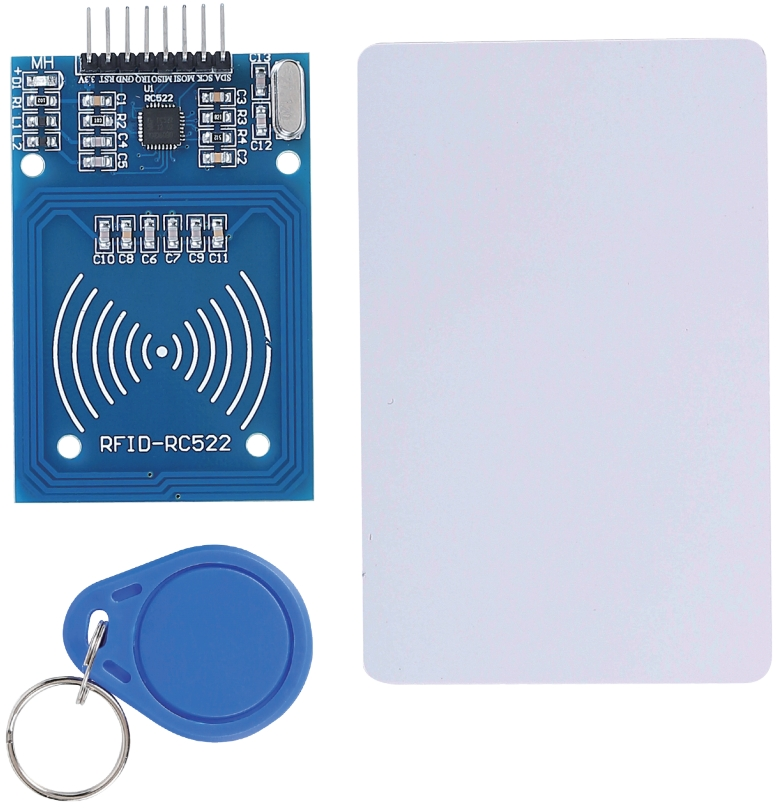
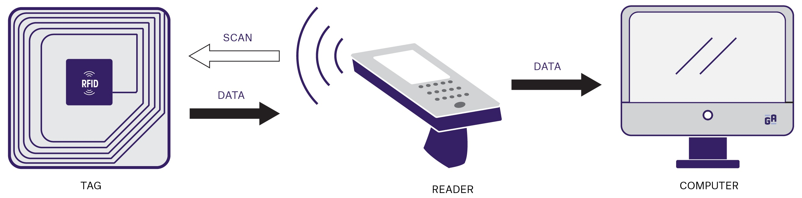
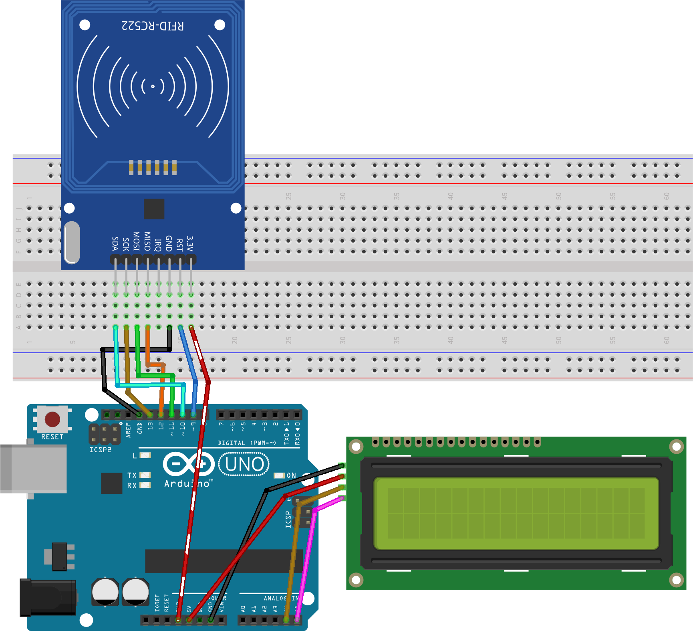
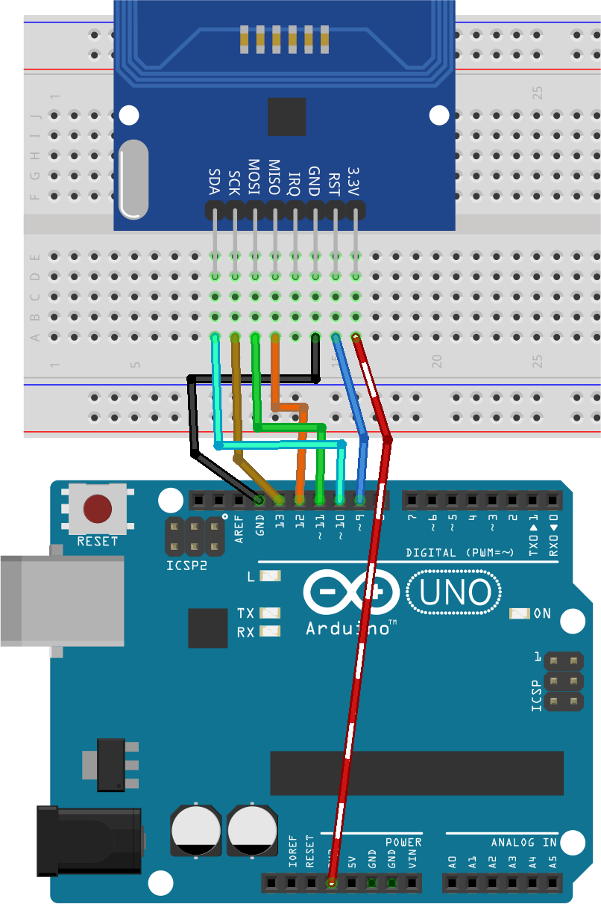
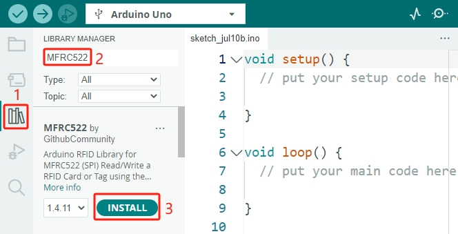
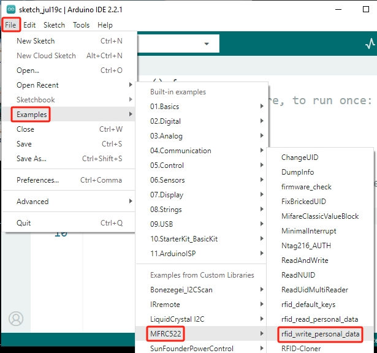
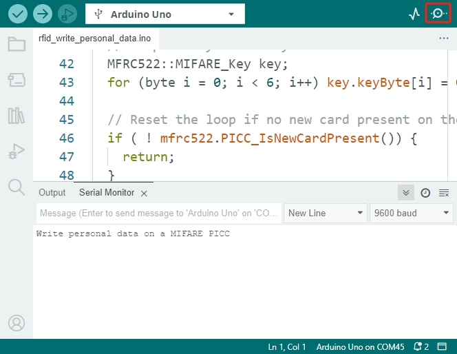
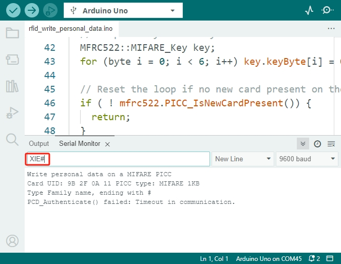
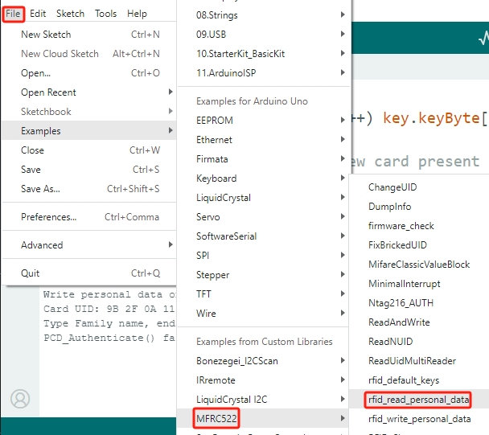

.. note::

    Hello, welcome to the SunFounder Raspberry Pi & Arduino & ESP32 Enthusiasts Community on Facebook! Dive deeper into Raspberry Pi, Arduino, and ESP32 with fellow enthusiasts.

    **Why Join?**

    - **Expert Support**: Solve post-sale issues and technical challenges with help from our community and team.
    - **Learn & Share**: Exchange tips and tutorials to enhance your skills.
    - **Exclusive Previews**: Get early access to new product announcements and sneak peeks.
    - **Special Discounts**: Enjoy exclusive discounts on our newest products.
    - **Festive Promotions and Giveaways**: Take part in giveaways and holiday promotions.

    👉 Ready to explore and create with us? Click [|link_sf_facebook|] and join today!

.. _ar_rfid_module:

33. Exploring the RF522-RFID Module
================================================
Gone are the days of waiting in long checkout lines at the grocery store, thanks to RFID technology! Imagine an RFID-based automatic checkout system where you can simply fill up your cart and walk out the door. Each item, tagged with an RFID label, will be instantly detected and recorded. No more waiting for each item to be scanned one by one!

In this exciting lesson, we dive into the world of RFID technology using the RC522 RFID reader/writer module. This module is a favorite among hobbyists due to its low power consumption, affordability, durability, ease of interface, and widespread popularity.

.. raw:: html

    <video muted controls style = "max-width:90%">
        <source src="_static/video/33_rfid_lcd.mp4" type="video/mp4">
        Your browser does not support the video tag.
    </video>

In this lesson, you will able to:

* Understand the basics of RFID technology and its applications.
* Learn how to interface the RC522 RFID reader module with an Arduino.
* Write personal data to an RFID tag using the RC522 module.
* Read and verify the written data from the RFID tag.
* Display the RFID tag information on an I2C LCD.

What is RC522 Module and RFID technology?
-------------------------------------------------
**RC522 Module**

The RC522 RFID reader module, operating at a frequency of 13.56MHz, is designed to communicate with RFID tags adhering to the ISO 14443A standard. This compact and versatile device is ideal for applications in access control, inventory tracking, and contactless payment systems due to its ability to interface with microcontrollers via a 4-pin SPI connection, supporting data rates up to 10 Mbps, and additional I2C and UART communication protocols.

Operating between 2.5 and 3.3V, its 5V tolerant logic pins facilitate easy integration with Arduino and other 5V logic microcontrollers, eliminating the need for a logic level converter.

* **VCC**: Powers the module (2.5 to 3.3V). Connect to Arduino's 3.3V output. Do not connect to 5V as it can damage the module.
* **RST**: Resets and powers down the module. Goes into power-down mode when low and resets on the rising edge.
* **GND**: Ground pin, connect to Arduino's GND.
* **IRQ**: Interrupt pin, alerts the microcontroller when an RFID tag is nearby.
* **MISO / SCL / Tx**: Acts as master-in-slave-out for SPI, serial clock for I2C, and serial data output for UART.
* **MOSI**: SPI input to the module.
* **SCK**: Serial clock input from the SPI bus master (Arduino).
* **SS / SDA / Rx**: Signal input for SPI, serial data for I2C, and serial data input for UART. Often marked with a square.

**RFID Technology**

An RFID system, or radio frequency identification system, comprises two key components: a tag attached to the object to be identified and a reader that reads this tag.

The reader contains an RF module and an antenna that creates a high-frequency electromagnetic field. Tags are typically passive, meaning they lack a battery. They consist of a microchip for storing and processing information and an antenna for receiving and transmitting signals.

When the tag is placed near the reader, the reader's electromagnetic field powers the tag's chip by inducing electron flow through its antenna.

The chip then transmits its stored data back to the reader via a radio signal, a process known as backscattering. The reader captures and decodes this signal, sending the information to a computer or microcontroller for further processing.

Build the Circuit
------------------------------------
Now that we know everything about the module, let's start connecting it to our Arduino!

**Components Needed**

.. list-table:: 
   :widths: 25 25 25
   :header-rows: 0

   * - 1 * Arduino Uno R3
     - 1 * RFID Module and Tag
     - 1 * I2C LCD1602
   * - |list_uno_r3|
     - |list_rc522_module| 
     - |list_i2c_lcd1602|
   * - Jumper Wires
     - 1 * Breadboard
     - 1 * USB Cable
   * - |list_wire|
     - |list_breadboard|
     - |list_usb_cable|

**Building Steps**

Follow the wiring diagram, or the steps below to build your circuit.

1. First, insert RC522-RFID module into the breadboard.

.. image:: img/33_rfid_plug_rc522.png
    :width: 400
    :align: center

2. Then, connect the RC522-RFID module and the Arduino Uno R3.

.. list-table::
    :widths: 20 20
    :header-rows: 1

    *   - RC522-RFID
        - Arduino UNO R3
    *   - 3.3V
        - 3.3V
    *   - RST
        - 9
    *   - GND
        - GND
    *   - IRQ
        -
    *   - MISO
        - 12
    *   - MOSI
        - 11
    *   - SCK
        - 13
    *   - SDA
        - 10
  

3. Finally, connect the I2C LCD1602 module: GND to the GND on the Arduino Uno R3, VCC to the pin 5V, SDA to pin A4, and SCL to pin A5.

  

Code Creation - Write and Read
---------------------------------------
In this section, we will install the libraries required for using the MFRC522 RFID module, and then open example code to write information to a tag and read information from the tag.

**Writing Information**

1. To use the MFRC522 RFID module, you need to include the appropriate library. Now, search for ``MFRC522`` in the **Library Manager**, then click **INSTALL**.

2. Now, by clicking **File** -> **Examples** -> **MFRC522**, you will see multiple example codes demonstrating different functionalities. Open the ``rfid_write_personal_data`` example code.

3. Click **Upload** to upload the code to your Arduino board. Then open the serial monitor, and you will see a prompt message.

4. Now place the provided white card or tag near the MFRC522 module. You will see the tag's UID, PICC type, and a prompt to enter the Family name, followed by a #.

.. code-block::

  Write personal data on a MIFARE PICC 
  Card UID: 9B 2F 0A 11 PICC type: MIFARE 1KB
  Type Family name, ending with #

5. Now start typing, for example, I enter ``XIE#``. Press ``Enter`` to send your input to the Arduino board, which will then transfer it to the RFID module.

.. note::

  While entering data, ensure that your card or tag remains near the RFID module's antenna, or else an error will occur.

6. You will see a success message for writing the data, followed by a prompt to enter the first name.

.. code-block::

  Write personal data on a MIFARE PICC 
  Card UID: 9B 2F 0A 11 PICC type: MIFARE 1KB
  Type Family name, ending with #
  PCD_Authenticate() success: 
  MIFARE_Write() success: 
  MIFARE_Write() success: 
  Type First name, ending with #

7. Next, enter the first name, for example, ``Daisy#``. You will see another success message for writing the data.

.. code-block::

  Write personal data on a MIFARE PICC 
  Card UID: 9B 2F 0A 11 PICC type: MIFARE 1KB
  Type Family name, ending with #
  PCD_Authenticate() success: 
  MIFARE_Write() success: 
  MIFARE_Write() success: 
  Type First name, ending with #
  MIFARE_Write() success: 
  MIFARE_Write() success: 

**Reading Information**

We have just written our name to the card or tag. Now, let's open another example code to read the information from this card and check if the data was written correctly.

1. Similarly, by clicking **File** -> **Examples** -> **MFRC522**, open the ``rfid_read_personal_data`` example code.

2. Once opened, upload the code to your Arduino board. Then place your card near the RFID module's antenna. You will see your UID and the previously written name information.

.. code-block::

  **Card Detected:**
  Card UID: 9B 2F 0A 11
  Card SAK: 08
  PICC type: MIFARE 1KB
  Name: 
  Daisy XIE             
  **End Reading**

Code Creation - Display on LCD
---------------------------------------

Here, we will learn how to display the card's name and UID on an I2C LCD.

.. note::

  If you are not familiar with the I2C LCD1602, you can first learn its basic usage through the following projects:

  * :ref:`ar_i2c_lcd1602`

  ``LiquidCrystal I2C`` library is used here, you can install it from the **Library Manager**.

1. Open the Arduino IDE and start a new project by selecting “New Sketch” from the “File” menu.
2. Save your sketch as ``Lesson33_RFID_LCD`` using ``Ctrl + S`` or by clicking “Save”.

3. Libraries for SPI and I2C communication are included to interact with the RFID and LCD modules, respectively. The reset (``RST_PIN``) and slave select (``SS_PIN``) pins for the RFID reader are defined.

.. code-block:: Arduino

  #include <SPI.h>                // Include the SPI library for SPI communication
  #include <MFRC522.h>            // Include the library for the RFID module
  #include <Wire.h>               // Include the Wire library for I2C communication
  #include <LiquidCrystal_I2C.h>  // Include the library for the I2C LCD

  #define RST_PIN 9  // Reset pin for the RFID module
  #define SS_PIN 10  // Slave select pin for the RFID module

4. This initializes the RFID reader and the LCD display with specified pin connections and LCD dimensions/configuration (address 0x27, 16 columns, 2 rows).

.. code-block:: Arduino

  // Create an instance of the MFRC522 class to interface with the RFID module
  MFRC522 mfrc522(SS_PIN, RST_PIN);
  // Create an instance of the LiquidCrystal_I2C class for the LCD
  LiquidCrystal_I2C lcd(0x27, 16, 2);

5. The ``setup()`` function initializes serial communication, the SPI bus, the RFID reader, and the LCD. It sets up the LCD backlight and sends a readiness message to the serial monitor.

.. code-block:: Arduino

  void setup() {
    Serial.begin(9600);                         // Start serial communication at 9600bps
    SPI.begin();                                // Initialize the SPI bus
    mfrc522.PCD_Init();                         // Initialize the RFID reader
    lcd.init();                                 // Initialize the LCD display
    lcd.backlight();                            // Turn on the backlight of the LCD
    Serial.println(F("Ready to read a card"));  // Print a message to start read
  }

6. The ``loop()`` function  continuously checks  for new RFID cards. If a card is detected, it reads and displays the UID, reads data from block 4, and then pauses for a moment before clearing the LCD.

.. code-block:: Arduino

  void loop() {
    // Check if a new RFID card is present and can be read
    if (!mfrc522.PICC_IsNewCardPresent() || !mfrc522.PICC_ReadCardSerial()) {
      return;  // If no new card is present, exit the loop
    }

    displayCardUID();           // Function to display the UID of the card
    readAndDisplayBlock(4);     // Function to read and display block4 of the RFID card
    mfrc522.PICC_HaltA();       // Halt the RFID card to stop reading
    mfrc522.PCD_StopCrypto1();  // Stop encryption on the communication
    delay(5000);                // Delay for 5 seconds
    lcd.clear();                // Clear the LCD display
  }

7. ``displayCardUID()`` function: Handles the display of the card's UID on both the serial monitor and the LCD. It formats the UID as hexadecimal values.

.. code-block:: Arduino

  // Function to display the UID of the RFID card
  void displayCardUID() {
    Serial.print(F("Card UID:"));                  // Print the text "Card UID:"
    lcd.clear();                                   // Clear the LCD display
    lcd.setCursor(0, 0);                           // Set the LCD cursor to the top-left
    lcd.print("UID:");                             // Print "UID:" on the LCD
    for (byte i = 0; i < mfrc522.uid.size; i++) {  // Loop through each byte of the UID
      Serial.print(mfrc522.uid.uidByte[i] < 0x10 ? " 0" : " ");
      Serial.print(mfrc522.uid.uidByte[i], HEX);  // Print UID byte in hexadecimal
      lcd.print(mfrc522.uid.uidByte[i] < 0x10 ? " 0" : " ");
      lcd.print(mfrc522.uid.uidByte[i], HEX);  // Print UID byte on the LCD in hexadecimal
    }
    Serial.println();  // Print a newline on the serial monitor
  }

8. ``authenticateBlock`` function: Handles reading a specific block from the RFID card, authenticating access to the block, and then displaying the retrieved data on the LCD.

.. code-block:: Arduino

  // Function to authenticate and read a block from the RFID card
  bool authenticateBlock(byte block, byte *buffer, byte &size) {
    MFRC522::StatusCode status;  // Variable to hold the status of RFID operations
    MFRC522::MIFARE_Key key;     // Variable to hold the authentication key
    // Set the key to the default key known as FFFFFFFFFFFFh
    for (byte i = 0; i < 6; i++) key.keyByte[i] = 0xFF;  // Default key A for authentication

    // Authenticate the desired block with the key
    status = mfrc522.PCD_Authenticate(MFRC522::PICC_CMD_MF_AUTH_KEY_A, block, &key, &(mfrc522.uid));
    if (status != MFRC522::STATUS_OK) {
      Serial.print(F("Authentication failed: "));
      Serial.println(mfrc522.GetStatusCodeName(status));
      return false;  // If authentication failed, return false
    }

    // Read the block after successful authentication
    status = mfrc522.MIFARE_Read(block, buffer, &size);
    if (status != MFRC522::STATUS_OK) {
      Serial.print(F("Reading failed: "));
      Serial.println(mfrc522.GetStatusCodeName(status));
      return false;  // If reading failed, return false
    }
    buffer[size - 1] = '\0';  // Ensure the string is null-terminated
    return true;              // Return true if reading is successful
  }

9. ``readAndDisplayBlock`` function: This function attempts to authenticate a specific block on the RFID card using a predefined key. It reads the data if authentication is successful.

.. code-block:: Arduino

  // Function to read a block and display its contents
  void readAndDisplayBlock(byte block) {
    byte buffer[18];                               // Buffer to store the data read from the RFID card
    byte size = sizeof(buffer);                    // Variable to store the size of the data read
    if (authenticateBlock(block, buffer, size)) {  // If authentication and reading are successful
      lcd.setCursor(0, 1);                         // Set the cursor to the second line of the LCD
      lcd.print("Name: ");                         // Print "Name:"
      // Print the name starting from the second character to skip the size byte
      lcd.print((char *)buffer + 1);
      Serial.print("Name: ");
      Serial.println((char *)buffer + 1);  // Print the name on the serial monitor
    }
  }

10. The code is as follows. You can upload it to the Arduino Uno R3. Afterward, bring your card or tag close to the RFID module's antenna, and you will see the name and ID displayed on both the LCD and the serial monitor.

.. code-block:: Arduino

  #include <SPI.h>                // Include the SPI library for SPI communication
  #include <MFRC522.h>            // Include the library for the RFID module
  #include <Wire.h>               // Include the Wire library for I2C communication
  #include <LiquidCrystal_I2C.h>  // Include the library for the I2C LCD

  #define RST_PIN 9  // Reset pin for the RFID module
  #define SS_PIN 10  // Slave select pin for the RFID module

  // Create an instance of the MFRC522 class to interface with the RFID module
  MFRC522 mfrc522(SS_PIN, RST_PIN);
  // Create an instance of the LiquidCrystal_I2C class for the LCD
  LiquidCrystal_I2C lcd(0x27, 16, 2);

  void setup() {
    Serial.begin(9600);                         // Start serial communication at 9600bps
    SPI.begin();                                // Initialize the SPI bus
    mfrc522.PCD_Init();                         // Initialize the RFID reader
    lcd.init();                                 // Initialize the LCD display
    lcd.backlight();                            // Turn on the backlight of the LCD
    Serial.println(F("Ready to read a card"));  // Print a message to start read
  }

  void loop() {
    // Check if a new RFID card is present and can be read
    if (!mfrc522.PICC_IsNewCardPresent() || !mfrc522.PICC_ReadCardSerial()) {
      return;  // If no new card is present, exit the loop
    }

    displayCardUID();           // Function to display the UID of the card
    readAndDisplayBlock(4);     // Function to read and display block4 of the RFID card
    mfrc522.PICC_HaltA();       // Halt the RFID card to stop reading
    mfrc522.PCD_StopCrypto1();  // Stop encryption on the communication
    delay(5000);                // Delay for 5 seconds
    lcd.clear();                // Clear the LCD display
  }

  // Function to display the UID of the RFID card
  void displayCardUID() {
    Serial.print(F("Card UID:"));                  // Print the text "Card UID:"
    lcd.clear();                                   // Clear the LCD display
    lcd.setCursor(0, 0);                           // Set the LCD cursor to the top-left
    lcd.print("UID:");                             // Print "UID:" on the LCD
    for (byte i = 0; i < mfrc522.uid.size; i++) {  // Loop through each byte of the UID
      Serial.print(mfrc522.uid.uidByte[i] < 0x10 ? " 0" : " ");
      Serial.print(mfrc522.uid.uidByte[i], HEX);  // Print UID byte in hexadecimal
      lcd.print(mfrc522.uid.uidByte[i] < 0x10 ? " 0" : " ");
      lcd.print(mfrc522.uid.uidByte[i], HEX);  // Print UID byte on the LCD in hexadecimal
    }
    Serial.println();  // Print a newline on the serial monitor
  }

  // Function to authenticate and read a block from the RFID card
  bool authenticateBlock(byte block, byte *buffer, byte &size) {
    MFRC522::StatusCode status;  // Variable to hold the status of RFID operations
    MFRC522::MIFARE_Key key;     // Variable to hold the authentication key
    // Set the key to the default key known as FFFFFFFFFFFFh
    for (byte i = 0; i < 6; i++) key.keyByte[i] = 0xFF;  // Default key A for authentication

    // Authenticate the desired block with the key
    status = mfrc522.PCD_Authenticate(MFRC522::PICC_CMD_MF_AUTH_KEY_A, block, &key, &(mfrc522.uid));
    if (status != MFRC522::STATUS_OK) {
      Serial.print(F("Authentication failed: "));
      Serial.println(mfrc522.GetStatusCodeName(status));
      return false;  // If authentication failed, return false
    }

    // Read the block after successful authentication
    status = mfrc522.MIFARE_Read(block, buffer, &size);
    if (status != MFRC522::STATUS_OK) {
      Serial.print(F("Reading failed: "));
      Serial.println(mfrc522.GetStatusCodeName(status));
      return false;  // If reading failed, return false
    }
    buffer[size - 1] = '\0';  // Ensure the string is null-terminated
    return true;              // Return true if reading is successful
  }

  // Function to read a block and display its contents
  void readAndDisplayBlock(byte block) {
    byte buffer[18];                               // Buffer to store the data read from the RFID card
    byte size = sizeof(buffer);                    // Variable to store the size of the data read
    if (authenticateBlock(block, buffer, size)) {  // If authentication and reading are successful
      lcd.setCursor(0, 1);                         // Set the cursor to the second line of the LCD
      lcd.print("Name: ");                         // Print "Name:"
      // Print the name starting from the second character to skip the size byte
      lcd.print((char *)buffer + 1);
      Serial.print("Name: ");
      Serial.println((char *)buffer + 1);  // Print the name on the serial monitor
    }
  }

**Question**

Now that you understand how to use the RC522-RFID module for reading or writing card or tag information and displaying it on an LCD, how would you design a common access control system for everyday use? Describe your design approach.

**Summary**

In this lesson, we learned how to harness the power of RFID technology using the RC522 module. We explored the fundamental concepts, built the necessary circuits, wrote and read personal data to and from RFID tags, and displayed the information on an LCD. By the end of this lesson, you should be well-equipped to integrate RFID technology into your own projects, making your systems more efficient and user-friendly.