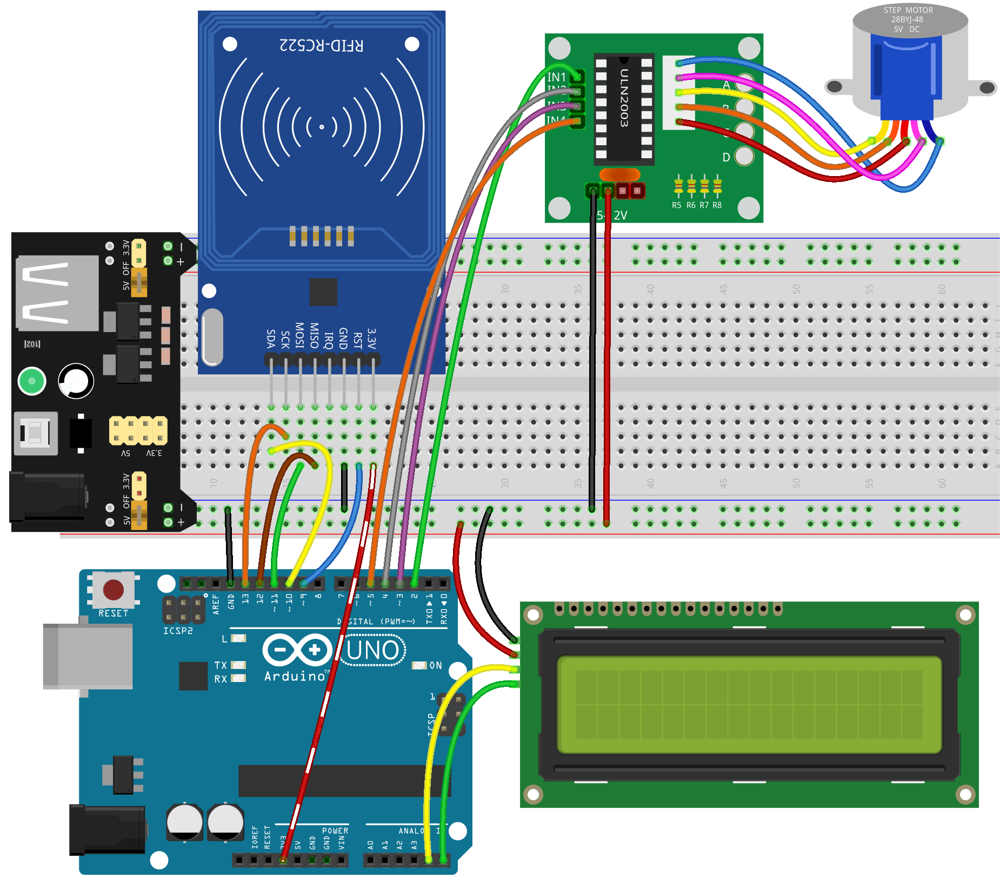
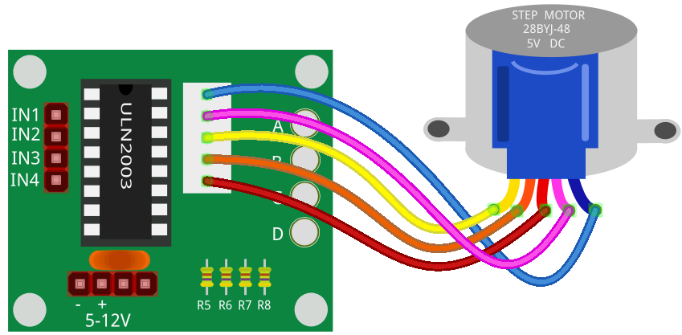
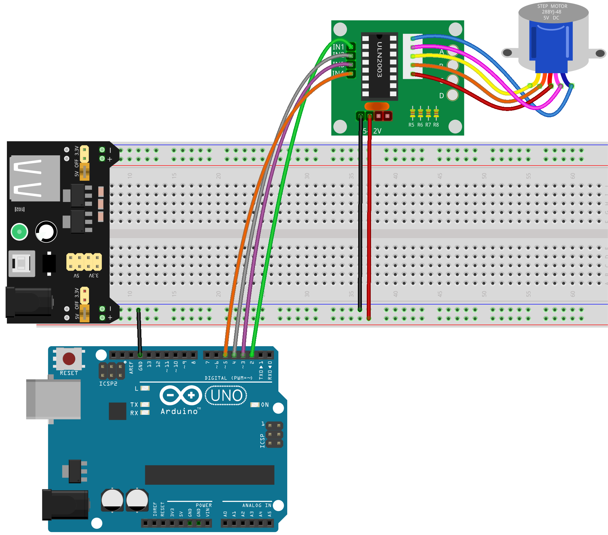
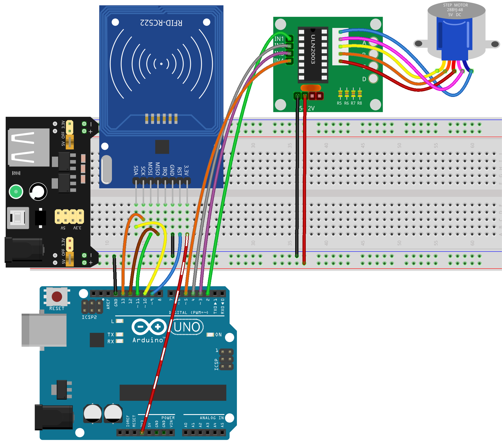
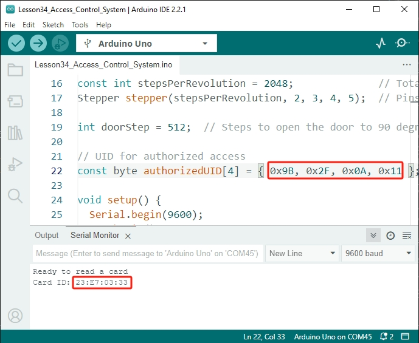

.. note::

    Hello, welcome to the SunFounder Raspberry Pi & Arduino & ESP32 Enthusiasts Community on Facebook! Dive deeper into Raspberry Pi, Arduino, and ESP32 with fellow enthusiasts.

    **Why Join?**

    - **Expert Support**: Solve post-sale issues and technical challenges with help from our community and team.
    - **Learn & Share**: Exchange tips and tutorials to enhance your skills.
    - **Exclusive Previews**: Get early access to new product announcements and sneak peeks.
    - **Special Discounts**: Enjoy exclusive discounts on our newest products.
    - **Festive Promotions and Giveaways**: Take part in giveaways and holiday promotions.

    👉 Ready to explore and create with us? Click [|link_sf_facebook|] and join today!

34. Access Control System
===============================
Welcome to our interactive workshop on building an Access Control System using Arduino! This course is designed for enthusiasts looking to delve into the world of electronics, robotics, and programming. You'll get hands-on experience with stepper motors, RFID technology, and LCD displays, creating a practical project that you can deploy in real-world scenarios. Whether you're looking to enhance your home security or just curious about electronic systems, this course offers a comprehensive guide to understanding and implementing basic automation and control systems.

.. raw:: html

    <video muted controls style = "max-width:90%">
        <source src="_static/video/34_access_control_system.mp4" type="video/mp4">
        Your browser does not support the video tag.
    </video>

By the end of this course, you will be able to:

* Understand the principles and operations of stepper motors and how they can be used to create mechanical movement.
* Explore the functionality of RFID technology and how it can be integrated into projects for secure access control.
* Program and connect an I2C LCD display to Arduino to provide user feedback and system status updates.
* Design and implement a simple access control system that uses RFID technology to grant or deny access based on programmed criteria.

About the Stepper Motor and ULN2003 Module
----------------------------------------------

**Stepper Motor**

The 28BYJ-48 is a 5-wire unipolar stepper motor that operates at 5V. Stepper motors are precision motors that can be controlled very accurately without needing feedback from sensors. This is because the motor's shaft is equipped with magnets and controlled by electromagnetic coils that turn on and off in a specific sequence, moving the shaft in precise small steps.

.. image:: img/34_step_stepper.png
  :align: center

The stator of Stepper Motor we use has 32 magnetic poles, so a circle needs 32 steps. The output shaft of the Stepper Motor is connected with a reduction gear set, and the reduction ratio is 1/64. So the final output shaft rotates a circle requiring a 32*64=2048 step.

**How a Unipolar Stepper Motor Works**

A unipolar stepper motor typically has four phases and operates on DC power. By correctly timing the electrical current to the motor's phases, you can make the motor rotate step by step. Imagine the motor's center containing a gear-shaped magnet (the rotor) surrounded by several teeth numbered 0 to 5. Around these teeth are eight magnetic poles arranged in pairs (A to D), connected by coils.

.. image:: img/34_step_interal.png
  :align: center

When you power on different switches connected to these coils (labeled SA, SB, SC, and SD), you control which magnetic poles are activated. For example, if switch SB is on (and the others are off), magnetic poles B align with certain teeth on the rotor, causing it to move. When you turn on switch SC next, the rotor turns to align with magnetic poles C, and so on. By cycling through switches A, B, C, and D, the rotor spins continuously.

**ULN2003 Module**

.. image:: img/34_step_uln2003.png
    :align: center

The ULN2003 stepper motor driver module is vital for integrating the stepper motor into circuits. It works as a 7-channel inverter, meaning it converts input signals into the needed output actions for the motor. For example, if a high signal is sent to IN1 and low signals to IN2, IN3, and IN4, then OUT1 turns low, and the other outputs stay high, making the motor rotate a step. By providing specific sequences like this, the motor can rotate smoothly step by step. The ULN2003 simplifies controlling the timing sequences necessary for the motor's operation.

Build the Circuit
------------------------------------

**Components Needed**

.. list-table:: 
   :widths: 25 25 25 25
   :header-rows: 0

   * - 1 * Arduino Uno R3
     - 1 * RFID Module and Tag
     - 1 * I2C LCD1602
     - 1 * Stepper Motor
   * - |list_uno_r3|
     - |list_rc522_module| 
     - |list_i2c_lcd1602|
     - |list_stepper|
   * - 1 * ULN2003 Module
     - Jumper Wires
     - 1 * Breadboard
     - 1 * USB Cable
   * - |list_uln2003_module|
     - |list_wire|
     - |list_breadboard|
     - |list_usb_cable|
   * - 1 * Breadboard Power Module
     - 1 * 9V Battery
     - 1 * Battery Cable
     - 
   * - |list_power_module| 
     - |list_battery| 
     - |list_bat_cable| 
     -

**Building Steps**

Follow the wiring diagram, or the steps below to build your circuit.

1. Insert the stepper motor into the ULN2003 driver board.

2. When using motors, servos, and other actuators, it's recommended to use an external power supply to avoid damaging the main board. Insert the breadboard power module into the breadboard, then use a jumper wire to connect the negative rail of the breadboard to the GND of the Arduino Uno R3 to achieve a common ground.

.. image:: img/14_dinosaur_power_module.png
    :width: 400
    :align: center

.. note::

    The order of the positive and negative terminals on the breadboard in the wiring diagram is reversed compared to the breadboard provided in the kit.

    In actual wiring, you need to insert the breadboard power module from the higher number side (60~65) so that the "-" of the power module goes into the negative rail "-" of the breadboard, and the "+" into the positive rail "+".

  .. raw:: html

      <video controls style = "max-width:100%">
          <source src="_static/video/about_power_module.mp4" type="video/mp4">
          Your browser does not support the video tag.
      </video>

3. Connect ULN2003's IN1 to Arduino Uno R3 pin 2, IN2 to pin 4, IN3 to pin 3, and IN4 to pin 5.

.. image:: img/34_step_connect_uln2003.png
  :width: 700
  :align: center

4. Now, connect the "-" of the ULN2003 module to the negative terminal of the breadboard, and "+" to the positive terminal.

5. Then, connect the RC522-RFID module and the Arduino Uno R3.

.. list-table::
    :widths: 20 20
    :header-rows: 1

    *   - RC522-RFID
        - Arduino UNO R3
    *   - 3.3V
        - 3.3V
    *   - RST
        - 9
    *   - GND
        - Negative rail on the breadboard
    *   - IRQ
        -
    *   - MISO
        - 12
    *   - MOSI
        - 11
    *   - SCK
        - 13
    *   - SDA
        - 10

6. Finally, connect the I2C LCD1602 module: GND to the GND on the Arduino Uno R3, VCC to the pin 5V, SDA to pin A4, and SCL to pin A5.

Code Creation - Making the Stepper Motor Rotate
------------------------------------------------------------
Now, let's use code to drive the stepper motor to rotate.

1. Open the Arduino IDE and start a new project by selecting “New Sketch” from the “File” menu.
2. Save your sketch as ``Lesson34_Stepper_Motor`` using ``Ctrl + S`` or by clicking “Save”.

3. Add the necessary library for the Stepper motor.

.. code-block:: Arduino
  :emphasize-lines: 1

  #include <Stepper.h>  // Include the Stepper library

  void setup() {
    // put your setup code here, to run once:

  }

4. Define the number of steps per revolution for the motor and initialize stepper object and set pin connections (IN1, IN3, IN2, IN4).

.. code-block:: Arduino
  :emphasize-lines: 4,7

  #include <Stepper.h>  // Include the Stepper library

  // Define the number of steps per revolution for the motor
  #define STEPS 2048

  // Initialize stepper object and set pin connections (IN1, IN3, IN2, IN4)
  Stepper stepper(STEPS, 2, 3, 4, 5);

  void setup() {
    // put your setup code here, to run once:

  }

5. There's no need to initialize anything in the ``setup()`` function, so leave it empty. In the ``loop()`` function, set the stepper motor's rotation speed to 5 RPM, rotate it 512 steps, pause for one second, then continue rotating at 5 RPM for 512 steps, and repeat.

.. note::

  From the previous discussion, we know the stepper motor takes 2048 steps to make one full revolution, setting the step count to 512 corresponds to a 1/4 turn. Thus, it will complete one full revolution in four seconds.

.. code-block:: Arduino
  :emphasize-lines: 7-9

  void setup() {
    // put your setup code here, to run once:
  }

  void loop() {
    // Rotate clockwise at 5 RPM
    stepper.setSpeed(5);
    stepper.step(512);  // Rotate 1/4 revolution
    delay(1000);        // Wait for 1 second
  }

* ``setSpeed(rpms)``: Sets the motor speed in rotations per minute (RPMs). This function doesn't make the motor turn, just sets the speed at which it will when you call ``step()``.

  * ``rpms``: the speed at which the motor should turn in rotations per minute - a positive number (long)

* ``step(steps)``: This function rotates the motor by a specified number of steps, using the speed set in the most recent call to ``setSpeed()``. It is important to note that this function operates in a blocking manner, meaning it will wait until the motor has completed its movement before allowing control to proceed to the next line in your sketch. For instance, if you were to set the speed at 1 RPM and called ``step(2048)`` on a motor with 2048 steps, it would take one full minute for this function to execute. To achieve more precise control, it is recommended to maintain a higher speed and only move a few steps with each call to ``step()``.

  * ``steps``: the number of steps to turn the motor - positive to turn one direction, negative to turn the other (int).

6. Here is your complete code, which you can upload to the Arduino board. Afterwards, you will see the stepper motor rotate 1/4 turn every second, completing a full revolution in four seconds.

.. code-block:: Arduino

  #include <Stepper.h>  // Include the Stepper library

  // Define the number of steps per revolution for the motor
  #define STEPS 2048

  // Initialize stepper object and set pin connections (IN1, IN3, IN2, IN4)
  Stepper stepper(STEPS, 2, 3, 4, 5);

  void setup() {
    // put your setup code here, to run once:
  }

  void loop() {
    // Rotate clockwise at 5 RPM
    stepper.setSpeed(5);
    stepper.step(512);  // Rotate 1/4 revolution
    delay(1000);        // Wait for 1 second
  }

**Question**

If you want to achieve a full rotation in one direction and then a full rotation in the opposite direction, continuing in this cycle, how should the code be modified?

Code Creation - Access Control System
------------------------------------------
From the previous project, we have learned how to drive a stepper motor using code. Now, let's use a stepper motor, I2C LCD1602, and RC522-RFID module to create an access control system.

* The stepper motor is used to simulate the opening and closing of a door.
* The RC522-RFID module is used to scan the cards or tags of visitors. If the ID matches the predefined one, the stepper motor is activated.
* The I2C LCD1602 module displays the results of the card scan.

Let's now write the code to see how to implement this access control system.

.. note::

  If you are not familiar with the MCRF522 Module and I2C LCD1602, you can first learn their basic usage through the following projects:

  * :ref:`ar_rfid_module`
  * :ref:`ar_i2c_lcd1602`

  ``LiquidCrystal I2C`` and ``MFRC522`` libraries are used here, you can install them from the **Library Manager**.

1. Open the Arduino IDE and start a new project by selecting “New Sketch” from the “File” menu.
2. Save your sketch as ``Lesson34_Stepper_Motor`` using ``Ctrl + S`` or by clicking “Save”.

3. Include the necessary libraries for I2C and SPI communication, then include the libraries for the RFID module, I2C LCD, and stepper motor.

.. code-block:: Arduino

  #include <SPI.h>                // Include the SPI library for SPI communication
  #include <MFRC522.h>            // Include the library for the RFID module
  #include <Wire.h>               // Include the Wire library for I2C communication
  #include <LiquidCrystal_I2C.h>  // Include the library for the I2C LCD
  #include <Stepper.h>            // Include the library for the Stepper Motor

4. This initializes the RFID reader and the LCD display with specified pin connections and LCD dimensions/configuration (address 0x27, 16 columns, 2 rows). Define the number of steps per revolution for the motor and initialize stepper object and set pin connections (IN1, IN3, IN2, IN4).

.. code-block:: Arduino
  :emphasize-lines: 7-17

  #include <SPI.h>                // Include the SPI library for SPI communication
  #include <MFRC522.h>            // Include the library for the RFID module
  #include <Wire.h>               // Include the Wire library for I2C communication
  #include <LiquidCrystal_I2C.h>  // Include the library for the I2C LCD
  #include <Stepper.h>            // Include the library for the Stepper Motor

  #define RST_PIN 9  // Reset pin for the RFID module
  #define SS_PIN 10  // Slave select pin for the RFID module

  // Create an instance of the MFRC522 class to interface with the RFID module
  MFRC522 mfrc522(SS_PIN, RST_PIN);
  // Create an instance of the LiquidCrystal_I2C class for the LCD
  LiquidCrystal_I2C lcd(0x27, 16, 2);

  // Define stepper motor configuration
  const int stepsPerRevolution = 2048;              // Total number of steps per revolution
  Stepper stepper(stepsPerRevolution, 2, 3, 4, 5);  // Pins for the stepper motor (IN1, IN2, IN3, IN4)

5. Set the number of steps for the stepper motor and the UID for authorized access.

.. code-block:: Arduino
  :emphasize-lines: 1,4

  int doorStep = 512;  // Steps to open the door to 90 degrees

  // UID for authorized access
  const byte authorizedUID[4] = { 0x9B, 0x2F, 0x0A, 0x11 };

  void setup() {
    // put your setup code here, to run once:

  }

6. The ``setup()`` function initializes serial communication, the SPI bus, the RFID reader, the stepper motor and the LCD. It sets up the LCD backlight and sends a readiness message to the serial monitor.
 
.. code-block:: Arduino

  void setup() {
    Serial.begin(9600);
    SPI.begin();
    mfrc522.PCD_Init();    // Initialize the RFID reader
    stepper.setSpeed(15);  // Set the stepper motor speed to 15 RPM

    // Initialize the LCD display
    lcd.init();
    lcd.backlight();
    lcd.clear();
    lcd.setCursor(0, 0);
    lcd.print("Scan your card");
    Serial.println("Ready to read a card");
  }

7. In the ``loop()`` function:

* Continuously checks for new RFID cards, reads their UID, and validates them against an authorized list. 
* If the card's ID matches the set one, then call ``grantAccess()`` to display relevant information on the LCD and to open the door with the stepper motor. The door closes after 5 seconds.
* If the card's ID does not match the set one, then call ``denyAccess()`` to display a message of access denial.
* Finally, the card communication is halted, and encryption is stopped. A delay allows the displayed information to be read before the LCD is cleared, readying it for the next card.

.. code-block:: Arduino

  void loop() {
    // Check for the presence of a new card
    if (!mfrc522.PICC_IsNewCardPresent() || !mfrc522.PICC_ReadCardSerial()) {
      return;  // Exit loop if no new card is present
    }

    // Build and display the card UID
    String uidStr = buildUIDString();
    Serial.print("Card ID: ");
    Serial.println(uidStr);

    // Check card authorization and react accordingly
    if (isAuthorized(mfrc522.uid.uidByte)) {
      grantAccess();
    } else {
      denyAccess();
    }

    delay(3000);  // Delay before next card read
    lcd.clear();
    lcd.print("Scan your card");

    // Halt PICC and stop encryption on PCD
    mfrc522.PICC_HaltA();
    mfrc522.PCD_StopCrypto1();
  }

8. ``buildUIDString()`` Function:

* Constructs a formatted string of the RFID card's UID for easy reading and display.
* Each byte of the UID is converted to hexadecimal and separated by colons.

.. code-block:: Arduino

  String buildUIDString() {
    String uidStr = "";  // Store UID as String for display
    for (byte i = 0; i < mfrc522.uid.size; i++) {
      char buff[3];
      sprintf(buff, "%02X", mfrc522.uid.uidByte[i]);
      uidStr += buff;
      if (i < mfrc522.uid.size - 1) uidStr += ":";
    }
    return uidStr;
  }

9. ``grantAccess()`` Function: 

* Operates the stepper motor to open and later close the door.
* Displays welcoming messages on the LCD.
* Manages power efficiently by disabling the motor when not in use.

.. code-block:: Arduino

  void grantAccess() {
    lcd.clear();
    lcd.print("Welcome!");
    lcd.setCursor(0, 1);
    lcd.print("Door Opening...");
    stepper.step(doorStep);   // Open door
    savePower();              // Power saving function after motor activity
    delay(5000);              // Simulate door being open for a while
    stepper.step(-doorStep);  // Close door
    savePower();              // Power saving function after motor activity
  }

10. ``denyAccess()`` Function: Informs the user via the LCD that access has been denied due to an unrecognized or unauthorized RFID card.

.. code-block:: Arduino

  void denyAccess() {
    lcd.clear();
    lcd.print("Access Denied");
    lcd.setCursor(0, 1);
    lcd.print("Invalid Card");
  }

11. ``savePower()`` Function: Turns off all pins connected to the stepper motor to reduce power consumption when the motor is not active.

.. code-block:: Arduino

  void savePower() {
    // Disable all stepper motor pins to save power
    digitalWrite(2, LOW);
    digitalWrite(3, LOW);
    digitalWrite(4, LOW);
    digitalWrite(5, LOW);
  }

12. ``isAuthorized(byte *uid)`` Function:

* Compares the scanned UID with a predefined list of authorized UIDs.
* Determines whether to grant or deny access based on this comparison.

.. code-block:: Arduino

  bool isAuthorized(byte *uid) {
    // Check if the scanned UID matches the authorized UID
    for (byte i = 0; i < 4; i++) {
      if (uid[i] != authorizedUID[i]) {
        return false;  // Return false if any byte does not match
      }
    }
    return true;  // Return true if all bytes match
  }

13. Here is your complete code, which you can upload to the Arduino board.

.. code-block:: Arduino

  #include <SPI.h>                // Include the SPI library for SPI communication
  #include <MFRC522.h>            // Include the library for the RFID module
  #include <Wire.h>               // Include the Wire library for I2C communication
  #include <LiquidCrystal_I2C.h>  // Include the library for the I2C LCD
  #include <Stepper.h>            // Include the library for the Stepper Motor

  #define RST_PIN 9  // Reset pin for the RFID module
  #define SS_PIN 10  // Slave select pin for the RFID module

  // Create an instance of the MFRC522 class to interface with the RFID module
  MFRC522 mfrc522(SS_PIN, RST_PIN);
  // Create an instance of the LiquidCrystal_I2C class for the LCD
  LiquidCrystal_I2C lcd(0x27, 16, 2);

  // Define stepper motor configuration
  const int stepsPerRevolution = 2048;              // Total number of steps per revolution
  Stepper stepper(stepsPerRevolution, 2, 3, 4, 5);  // Pins for the stepper motor (IN1, IN2, IN3, IN4)

  int doorStep = 512;  // Steps to open the door to 90 degrees

  // UID for authorized access
  const byte authorizedUID[4] = { 0x9B, 0x2F, 0x0A, 0x11 };

  void setup() {
    Serial.begin(9600);
    SPI.begin();
    mfrc522.PCD_Init();    // Initialize the RFID reader
    stepper.setSpeed(15);  // Set the stepper motor speed to 15 RPM

    // Initialize the LCD display
    lcd.init();
    lcd.backlight();
    lcd.clear();
    lcd.setCursor(0, 0);
    lcd.print("Scan your card");
    Serial.println("Ready to read a card");
  }

  void loop() {
    // Check for the presence of a new card
    if (!mfrc522.PICC_IsNewCardPresent() || !mfrc522.PICC_ReadCardSerial()) {
      return;  // Exit loop if no new card is present
    }

    // Build and display the card UID
    String uidStr = buildUIDString();
    Serial.print("Card ID: ");
    Serial.println(uidStr);

    // Check card authorization and react accordingly
    if (isAuthorized(mfrc522.uid.uidByte)) {
      grantAccess();
    } else {
      denyAccess();
    }

    delay(3000);  // Delay before next card read
    lcd.clear();
    lcd.print("Scan your card");

    // Halt PICC and stop encryption on PCD
    mfrc522.PICC_HaltA();
    mfrc522.PCD_StopCrypto1();
  }

  String buildUIDString() {
    String uidStr = "";  // Store UID as String for display
    for (byte i = 0; i < mfrc522.uid.size; i++) {
      char buff[3];
      sprintf(buff, "%02X", mfrc522.uid.uidByte[i]);
      uidStr += buff;
      if (i < mfrc522.uid.size - 1) uidStr += ":";
    }
    return uidStr;
  }

  void grantAccess() {
    lcd.clear();
    lcd.print("Welcome!");
    lcd.setCursor(0, 1);
    lcd.print("Door Opening...");
    stepper.step(doorStep);   // Open door
    savePower();              // Power saving function after motor activity
    delay(5000);              // Simulate door being open for a while
    stepper.step(-doorStep);  // Close door
    savePower();              // Power saving function after motor activity
  }

  void denyAccess() {
    lcd.clear();
    lcd.print("Access Denied");
    lcd.setCursor(0, 1);
    lcd.print("Invalid Card");
  }

  void savePower() {
    // Disable all stepper motor pins to save power
    digitalWrite(2, LOW);
    digitalWrite(3, LOW);
    digitalWrite(4, LOW);
    digitalWrite(5, LOW);
  }

  bool isAuthorized(byte *uid) {
    // Check if the scanned UID matches the authorized UID
    for (byte i = 0; i < 4; i++) {
      if (uid[i] != authorizedUID[i]) {
        return false;  // Return false if any byte does not match
      }
    }
    return true;  // Return true if all bytes match
  }

14. Each card or tag's ID is unique, and you may encounter access denial messages the first time you scan your card. At this point, you can open the serial monitor to check your card's ID. Then replace your ID in the array ``authorizedUID[]``.

For instance, if I read ``Card ID: 23:E7:03:33``, then I replace it with ``const byte authorizedUID[4] = { 0x23, 0xE7, 0x03, 0x33 };``

15. Re-upload the code, and when you bring your card close to the RFID module's antenna area, you will see a welcome message and the stepper motor rotate 512 steps (90 degrees) to simulate opening the door. After 5 seconds, it will return to its original position to close the door.

.. raw:: html

    <video muted controls style = "max-width:90%">
        <source src="_static/video/31_access_control_system.mp4" type="video/mp4">
        Your browser does not support the video tag.
    </video>

16. Finally, remember to save your code and tidy up your workspace.

**Question**

Now that a basic access control system has been set up, what additional components could be added to enhance its functionality and flexibility?

**Summary**

Throughout this course, we've taken a deep dive into the functionalities of stepper motors, RFID modules, and I2C LCD displays, culminating in the creation of a fully functional Access Control System. You have learned to integrate various components to develop a system that reads RFID tags, controls door mechanisms via stepper motors, and displays system statuses and messages on an LCD. 
