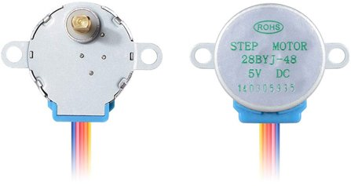
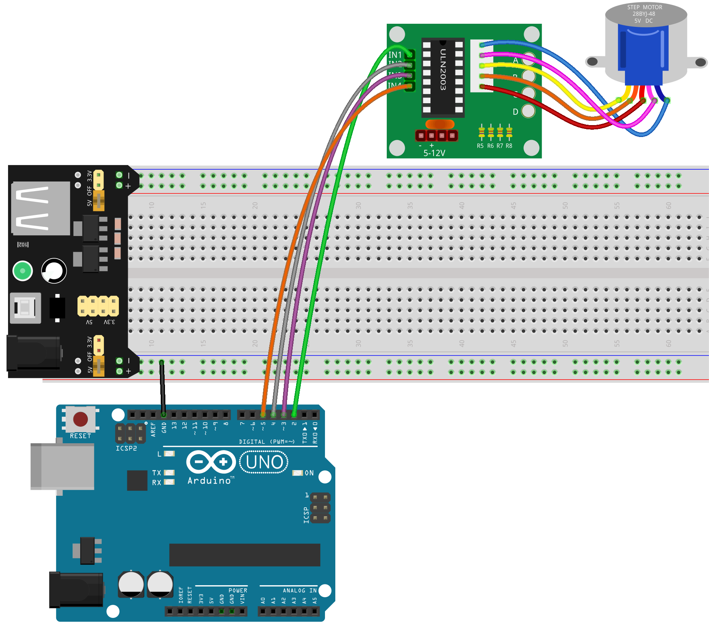

.. note::

    こんにちは！SunFounderのRaspberry Pi、Arduino、ESP32愛好者コミュニティへようこそ！Facebookで、Raspberry Pi、Arduino、ESP32の世界をさらに深く探求しましょう。

    **参加する理由**

    - **専門サポート**: コミュニティやチームからのサポートで、購入後の問題や技術的な課題を解決しましょう。
    - **学びと共有**: スキルを向上させるためのヒントやチュートリアルを交換できます。
    - **限定プレビュー**: 新製品の発表やプレビューを早期に入手可能です。
    - **特別割引**: 最新製品の専用割引を楽しめます。
    - **フェスティブプロモーションとプレゼント**: プレゼント企画やホリデープロモーションに参加できます。

    👉 私たちと一緒に探求し、創造する準備はできましたか？今すぐ[|link_sf_facebook|]をクリックして参加しましょう！

34. アクセス制御システム
===============================
Arduinoを使ったアクセス制御システム構築に関するインタラクティブワークショップへようこそ！このコースは、エレクトロニクス、ロボティクス、プログラミングの世界に興味を持つ愛好者向けに設計されています。ステッピングモーター、RFID技術、LCDディスプレイを使用して、実際のシナリオで展開できる実践的なプロジェクトを体験できます。家庭のセキュリティを強化したい方や、電子システムに興味がある方にとって、このコースは基本的なオートメーションおよび制御システムの理解と実装に関する包括的なガイドを提供します。

.. raw:: html

    <video muted controls style = "max-width:90%">
        <source src="_static/video/34_access_control_system.mp4" type="video/mp4">
        Your browser does not support the video tag.
    </video>

このコースの終了時には、以下のことができるようになります：

* ステッピングモーターの原理と動作を理解し、それを利用して機械的な動きを作り出す方法を学びます。
* RFID技術の機能を探求し、セキュアなアクセス制御のためにプロジェクトに統合する方法を学びます。
* ユーザーフィードバックやシステム状態の更新を提供するために、I2C LCDディスプレイをArduinoに接続し、プログラムする方法を学びます。
* プログラムされた基準に基づいてアクセスを許可または拒否するRFID技術を使用したシンプルなアクセス制御システムを設計および実装します。

ステッピングモーターとULN2003モジュールについて
------------------------------------------------

**ステッピングモーター**

28BYJ-48は、5Vで動作する5線式のユニポーラステッピングモーターです。ステッピングモーターは、センサーからのフィードバックを必要とせずに非常に正確に制御できる精密モーターです。これは、モーターのシャフトが磁石を備え、特定の順序で電磁コイルがオンオフされることで、シャフトが正確な小さなステップで回転するためです。

私たちが使用するステッピングモーターのステータには32の磁極があり、1周には32ステップが必要です。ステッピングモーターの出力シャフトは減速ギアセットに接続されており、減速比は1/64です。そのため、最終的な出力シャフトが1周するには32*64=2048ステップが必要です。

**ユニポーラステッピングモーターの動作原理**

ユニポーラステッピングモーターは通常、4つのフェーズを持ち、DC電源で動作します。モーターのフェーズに電流を適切なタイミングで供給することで、モーターをステップごとに回転させることができます。モーターの中心に歯車状の磁石（ローター）があり、その周りに0から5までの番号が付いた歯があると想像してください。この歯の周りには、コイルで接続された8つの磁極がAからDまでのペアで配置されています。

.. image:: img/34_step_interal.png
  :align: center

これらのコイルに接続されたスイッチ（SA、SB、SC、SD）をオンにすることで、どの磁極がアクティブになるかを制御できます。例えば、スイッチSBがオン（他のスイッチがオフ）であれば、磁極Bがローターの特定の歯に合わせて動きます。次にスイッチSCをオンにすると、ローターは磁極Cに合わせて回転します。このように、スイッチA、B、C、Dを順番にサイクルさせることで、ローターは連続して回転します。

**ULN2003モジュール**

.. image:: img/34_step_uln2003.png
    :align: center

ULN2003ステッピングモータードライバーモジュールは、ステッピングモーターを回路に統合するために不可欠です。これは7チャンネルのインバーターとして機能し、入力信号をモーターに必要な出力動作に変換します。例えば、IN1に高信号が送られ、IN2、IN3、IN4に低信号が送られると、OUT1が低になり、他の出力が高のままで、モーターが1ステップ回転します。このような特定のシーケンスを提供することで、モーターはスムーズにステップごとに回転できます。ULN2003は、モーターの動作に必要なタイミングシーケンスの制御を簡素化します。

回路の構築
------------------------------------

**必要なコンポーネント**

.. list-table:: 
   :widths: 25 25 25 25
   :header-rows: 0

   * - 1 * Arduino Uno R3
     - 1 * RFIDモジュールとタグ
     - 1 * I2C LCD1602
     - 1 * ステッピングモーター
   * - |list_uno_r3|
     - |list_rc522_module| 
     - |list_i2c_lcd1602|
     - |list_stepper|
   * - 1 * ULN2003モジュール
     - ジャンパーワイヤー
     - 1 * ブレッドボード
     - 1 * USBケーブル
   * - |list_uln2003_module|
     - |list_wire|
     - |list_breadboard|
     - |list_usb_cable|
   * - 1 * ブレッドボードパワーモジュール
     - 1 * 9V電池
     - 1 * 電池ケーブル
     - 
   * - |list_power_module| 
     - |list_battery| 
     - |list_bat_cable| 
     -

**構築手順**

回路図または以下の手順に従って回路を構築してください。

.. image:: img/34_step_connect_lcd.png
    :width: 700
    :align: center

1. ステッピングモーターをULN2003ドライバーボードに接続します。

2. モーター、サーボ、その他のアクチュエーターを使用する際は、メインボードを損傷しないように外部電源を使用することをお勧めします。ブレッドボードにブレッドボードパワーモジュールを差し込み、ジャンパーワイヤーを使用して、ブレッドボードの負のレールをArduino Uno R3のGNDに接続し、共通のグランドを実現します。

.. image:: img/14_dinosaur_power_module.png
    :width: 400
    :align: center

.. note::

    回路図では、ブレッドボードの正負端子の順序が、キットに提供されているブレッドボードと逆になっています。

    実際の配線では、ブレッドボードのパワーモジュールを番号が大きい側（60~65）から差し込み、パワーモジュールの「-」がブレッドボードの負のレール「-」に、「+」が正のレール「+」に入るようにしてください。

  .. raw:: html

      <video controls style = "max-width:100%">
          <source src="_static/video/about_power_module.mp4" type="video/mp4">
          Your browser does not support the video tag.
      </video>

3. ULN2003のIN1をArduino Uno R3のピン2に、IN2をピン4に、IN3をピン3に、IN4をピン5に接続します。

4. 次に、ULN2003モジュールの「-」をブレッドボードの負端子に、「+」を正端子に接続します。

.. image:: img/34_step_connect_power.png
  :width: 700
  :align: center

5. 続いて、RC522-RFIDモジュールとArduino Uno R3を接続します。

.. list-table::
    :widths: 20 20
    :header-rows: 1

    *   - RC522-RFID
        - Arduino UNO R3
    *   - 3.3V
        - 3.3V
    *   - RST
        - 9
    *   - GND
        - ブレッドボードの負レール
    *   - IRQ
        -
    *   - MISO
        - 12
    *   - MOSI
        - 11
    *   - SCK
        - 13
    *   - SDA
        - 10

.. image:: img/34_step_connect_rfid.png
  :width: 700
  :align: center

6. 最後に、I2C LCD1602モジュールを接続します。GNDをArduino Uno R3のGNDに、VCCをピン5Vに、SDAをピンA4に、SCLをピンA5に接続します。

.. image:: img/34_step_connect_lcd.png
    :width: 700
    :align: center

コード作成 - ステッピングモーターの回転
------------------------------------------------------------
それでは、コードを使ってステッピングモーターを回転させましょう。

1. Arduino IDEを開き、「ファイル」メニューから「新規スケッチ」を選んで新しいプロジェクトを開始します。
2. 「名前を付けて保存」をクリックし、スケッチを ``Lesson34_Stepper_Motor`` として保存します。

3. ステッピングモーター用の必要なライブラリを追加します。

.. code-block:: Arduino
  :emphasize-lines: 1

  #include <Stepper.h>  // ステッピングモーターライブラリをインクルード

  void setup() {
    // 初回実行時に設定するコードをここに記述します。

  }

4. モーターの1回転あたりのステップ数を定義し、ステッピングモーターオブジェクトを初期化し、ピン接続（IN1、IN3、IN2、IN4）を設定します。

.. code-block:: Arduino
  :emphasize-lines: 4,7

  #include <Stepper.h>  // ステッピングモーターライブラリをインクルード

  // モーターの1回転あたりのステップ数を定義
  #define STEPS 2048

  // ステッピングモーターオブジェクトを初期化し、ピン接続を設定（IN1、IN3、IN2、IN4）
  Stepper stepper(STEPS, 2, 3, 4, 5);

  void setup() {
    // 初回実行時に設定するコードをここに記述します。

  }

5. ``setup()`` 関数には初期設定は不要なので、空のままにしておきます。次に、 ``loop()`` 関数でステッピングモーターの回転速度を5RPMに設定し、512ステップ回転させて1秒間待機、そしてまた5RPMで512ステップ回転させ、これを繰り返します。

.. note::

  前回の説明から、ステッピングモーターは1回転するのに2048ステップが必要であり、512ステップは1/4回転に相当することが分かっています。したがって、モーターは4秒で1回転します。

.. code-block:: Arduino
  :emphasize-lines: 7-9

  void setup() {
    // put your setup code here, to run once:
  }

  void loop() {
    // Rotate clockwise at 5 RPM
    stepper.setSpeed(5);
    stepper.step(512);  // Rotate 1/4 revolution
    delay(1000);        // Wait for 1 second
  }

* ``setSpeed(rpms)``: モーターの回転速度を毎分回転数（RPM）で設定します。この関数は、モーターを回転させるのではなく、 ``step()`` が呼ばれた際の回転速度を設定します。

  * ``rpms``: モーターが回転する速度を毎分回転数で設定します - 正の数値（long）

* ``step(steps)``: 指定されたステップ数だけモーターを回転させます。直前に呼ばれた ``setSpeed()`` で設定された速度を使用します。この関数はブロッキング動作を行い、モーターが動きを完了するまでスケッチの次の行に進むことを許しません。例えば、速度を1RPMに設定し、 ``step(2048)`` を呼び出すと、モーターが1回転するのに1分かかります。より精密な制御を行うには、高速に設定し、各呼び出しで数ステップずつ動かすことが推奨されます。

  * ``steps``: モーターを回転させるステップ数 - 正の数で一方向に、負の数で逆方向に回転（int）。

6. これでコードが完成しました。Arduinoボードにアップロードすると、ステッピングモーターが毎秒1/4回転し、4秒で1回転する様子が見られます。

.. code-block:: Arduino

  #include <Stepper.h>  // Include the Stepper library

  // Define the number of steps per revolution for the motor
  #define STEPS 2048

  // Initialize stepper object and set pin connections (IN1, IN3, IN2, IN4)
  Stepper stepper(STEPS, 2, 3, 4, 5);

  void setup() {
    // put your setup code here, to run once:
  }

  void loop() {
    // Rotate clockwise at 5 RPM
    stepper.setSpeed(5);
    stepper.step(512);  // Rotate 1/4 revolution
    delay(1000);        // Wait for 1 second
  }

**質問**

モーターを一方向に完全回転させ、その後逆方向に完全回転させるサイクルを続けるには、コードをどのように変更すればよいですか？

コード作成 - アクセス制御システム
------------------------------------------
前のプロジェクトで、コードを使用してステッピングモーターを駆動する方法を学びました。次に、ステッピングモーター、I2C LCD1602、およびRC522-RFIDモジュールを使用してアクセス制御システムを作成しましょう。

* ステッピングモーターは、ドアの開閉をシミュレートするために使用します。
* RC522-RFIDモジュールは、訪問者のカードやタグをスキャンし、IDが事前に定義されたものと一致する場合、ステッピングモーターを作動させます。
* I2C LCD1602モジュールは、カードのスキャン結果を表示します。

それでは、このアクセス制御システムを実装するためのコードを書いてみましょう。

.. note::

  MCRF522モジュールおよびI2C LCD1602に慣れていない場合は、以下のプロジェクトを通じて基本的な使用方法を学ぶことができます。

  * :ref:`ar_rfid_module`
  * :ref:`ar_i2c_lcd1602`

  ``LiquidCrystal I2C`` および ``MFRC522`` ライブラリをここで使用します。これらは **ライブラリマネージャ** からインストールできます。

1. Arduino IDEを開き、「ファイル」メニューから「新規スケッチ」を選んで新しいプロジェクトを開始します。
2. 「名前を付けて保存」をクリックし、スケッチを ``Lesson34_Stepper_Motor`` として保存します。

3. I2CおよびSPI通信用の必要なライブラリをインクルードし、その後、RFIDモジュール、I2C LCD、およびステッピングモーター用のライブラリをインクルードします。

.. code-block:: Arduino

  #include <SPI.h>                // Include the SPI library for SPI communication
  #include <MFRC522.h>            // Include the library for the RFID module
  #include <Wire.h>               // Include the Wire library for I2C communication
  #include <LiquidCrystal_I2C.h>  // Include the library for the I2C LCD
  #include <Stepper.h>            // Include the library for the Stepper Motor

4. RFIDリーダーとLCDディスプレイを指定されたピン接続とLCDのアドレス0x27、16列、2行の設定で初期化します。モーターの1回転あたりのステップ数を定義し、ステッピングモーターオブジェクトを初期化し、ピン接続（IN1、IN3、IN2、IN4）を設定します。

.. code-block:: Arduino
  :emphasize-lines: 7-17

  #include <SPI.h>                // Include the SPI library for SPI communication
  #include <MFRC522.h>            // Include the library for the RFID module
  #include <Wire.h>               // Include the Wire library for I2C communication
  #include <LiquidCrystal_I2C.h>  // Include the library for the I2C LCD
  #include <Stepper.h>            // Include the library for the Stepper Motor

  #define RST_PIN 9  // Reset pin for the RFID module
  #define SS_PIN 10  // Slave select pin for the RFID module

  // Create an instance of the MFRC522 class to interface with the RFID module
  MFRC522 mfrc522(SS_PIN, RST_PIN);
  // Create an instance of the LiquidCrystal_I2C class for the LCD
  LiquidCrystal_I2C lcd(0x27, 16, 2);

  // Define stepper motor configuration
  const int stepsPerRevolution = 2048;              // Total number of steps per revolution
  Stepper stepper(stepsPerRevolution, 2, 3, 4, 5);  // Pins for the stepper motor (IN1, IN2, IN3, IN4)

5. ステッピングモーターのステップ数と認証されたアクセス用のUIDを設定します。

.. code-block:: Arduino
  :emphasize-lines: 1,4

  int doorStep = 512;  // Steps to open the door to 90 degrees

  // UID for authorized access
  const byte authorizedUID[4] = { 0x9B, 0x2F, 0x0A, 0x11 };

  void setup() {
    // put your setup code here, to run once:

  }

6. ``setup()`` 関数は、シリアル通信、SPIバス、RFIDリーダー、ステッピングモーター、およびLCDを初期化します。LCDのバックライトを設定し、シリアルモニターに準備メッセージを送信します。
 
.. code-block:: Arduino

  void setup() {
    Serial.begin(9600);
    SPI.begin();
    mfrc522.PCD_Init();    // Initialize the RFID reader
    stepper.setSpeed(15);  // Set the stepper motor speed to 15 RPM

    // Initialize the LCD display
    lcd.init();
    lcd.backlight();
    lcd.clear();
    lcd.setCursor(0, 0);
    lcd.print("Scan your card");
    Serial.println("Ready to read a card");
  }

7. ``loop()`` 関数では：

* 新しいRFIDカードを継続的にチェックし、そのUIDを読み取り、認証リストと照合します。
* カードのIDが設定されたものと一致する場合、 ``grantAccess()`` を呼び出してLCDに関連情報を表示し、ステッピングモーターでドアを開けます。ドアは5秒後に閉じます。
* カードのIDが設定されたものと一致しない場合は、 ``denyAccess()`` を呼び出してアクセス拒否のメッセージを表示します。
* 最後に、カード通信が停止され、暗号化が解除されます。表示された情報を読むための遅延を挟み、次のカードの準備ができるようにLCDをクリアします。

.. code-block:: Arduino

  void loop() {
    // Check for the presence of a new card
    if (!mfrc522.PICC_IsNewCardPresent() || !mfrc522.PICC_ReadCardSerial()) {
      return;  // Exit loop if no new card is present
    }

    // Build and display the card UID
    String uidStr = buildUIDString();
    Serial.print("Card ID: ");
    Serial.println(uidStr);

    // Check card authorization and react accordingly
    if (isAuthorized(mfrc522.uid.uidByte)) {
      grantAccess();
    } else {
      denyAccess();
    }

    delay(3000);  // Delay before next card read
    lcd.clear();
    lcd.print("Scan your card");

    // Halt PICC and stop encryption on PCD
    mfrc522.PICC_HaltA();
    mfrc522.PCD_StopCrypto1();
  }

8. ``buildUIDString()`` 関数:

* RFIDカードのUIDを読み取りやすく表示するためにフォーマットされた文字列を構築します。
* UIDの各バイトは16進数に変換され、コロンで区切られます。

.. code-block:: Arduino

  String buildUIDString() {
    String uidStr = "";  // Store UID as String for display
    for (byte i = 0; i < mfrc522.uid.size; i++) {
      char buff[3];
      sprintf(buff, "%02X", mfrc522.uid.uidByte[i]);
      uidStr += buff;
      if (i < mfrc522.uid.size - 1) uidStr += ":";
    }
    return uidStr;
  }

9. ``grantAccess()`` 関数:

* ステッピングモーターを操作してドアを開閉します。
* LCDにウェルカムメッセージを表示します。
* モーターが使用されていないときに電力を効率的に管理するため、モーターの電源をオフにします。

.. code-block:: Arduino

  void grantAccess() {
    lcd.clear();
    lcd.print("Welcome!");
    lcd.setCursor(0, 1);
    lcd.print("Door Opening...");
    stepper.step(doorStep);   // Open door
    savePower();              // Power saving function after motor activity
    delay(5000);              // Simulate door being open for a while
    stepper.step(-doorStep);  // Close door
    savePower();              // Power saving function after motor activity
  }

10. ``denyAccess()`` 関数: 認識されない、または未承認のRFIDカードによりアクセスが拒否されたことをLCDでユーザーに通知します。

.. code-block:: Arduino

  void denyAccess() {
    lcd.clear();
    lcd.print("Access Denied");
    lcd.setCursor(0, 1);
    lcd.print("Invalid Card");
  }

11. ``savePower()`` 関数: モーターが作動していないときに電力消費を抑えるために、ステッピングモーターに接続されているすべてのピンをオフにします。

.. code-block:: Arduino

  void savePower() {
    // Disable all stepper motor pins to save power
    digitalWrite(2, LOW);
    digitalWrite(3, LOW);
    digitalWrite(4, LOW);
    digitalWrite(5, LOW);
  }

12. ``isAuthorized(byte *uid)`` 関数:

* 読み取ったUIDを、事前に定義された認証済みUIDのリストと比較します。
* この比較に基づいてアクセスを許可するか拒否するかを決定します。

.. code-block:: Arduino

  bool isAuthorized(byte *uid) {
    // Check if the scanned UID matches the authorized UID
    for (byte i = 0; i < 4; i++) {
      if (uid[i] != authorizedUID[i]) {
        return false;  // Return false if any byte does not match
      }
    }
    return true;  // Return true if all bytes match
  }

13. こちらが、Arduinoボードにアップロードするための完全なコードです。

.. code-block:: Arduino

  #include <SPI.h>                // Include the SPI library for SPI communication
  #include <MFRC522.h>            // Include the library for the RFID module
  #include <Wire.h>               // Include the Wire library for I2C communication
  #include <LiquidCrystal_I2C.h>  // Include the library for the I2C LCD
  #include <Stepper.h>            // Include the library for the Stepper Motor

  #define RST_PIN 9  // Reset pin for the RFID module
  #define SS_PIN 10  // Slave select pin for the RFID module

  // Create an instance of the MFRC522 class to interface with the RFID module
  MFRC522 mfrc522(SS_PIN, RST_PIN);
  // Create an instance of the LiquidCrystal_I2C class for the LCD
  LiquidCrystal_I2C lcd(0x27, 16, 2);

  // Define stepper motor configuration
  const int stepsPerRevolution = 2048;              // Total number of steps per revolution
  Stepper stepper(stepsPerRevolution, 2, 3, 4, 5);  // Pins for the stepper motor (IN1, IN2, IN3, IN4)

  int doorStep = 512;  // Steps to open the door to 90 degrees

  // UID for authorized access
  const byte authorizedUID[4] = { 0x9B, 0x2F, 0x0A, 0x11 };

  void setup() {
    Serial.begin(9600);
    SPI.begin();
    mfrc522.PCD_Init();    // Initialize the RFID reader
    stepper.setSpeed(15);  // Set the stepper motor speed to 15 RPM

    // Initialize the LCD display
    lcd.init();
    lcd.backlight();
    lcd.clear();
    lcd.setCursor(0, 0);
    lcd.print("Scan your card");
    Serial.println("Ready to read a card");
  }

  void loop() {
    // Check for the presence of a new card
    if (!mfrc522.PICC_IsNewCardPresent() || !mfrc522.PICC_ReadCardSerial()) {
      return;  // Exit loop if no new card is present
    }

    // Build and display the card UID
    String uidStr = buildUIDString();
    Serial.print("Card ID: ");
    Serial.println(uidStr);

    // Check card authorization and react accordingly
    if (isAuthorized(mfrc522.uid.uidByte)) {
      grantAccess();
    } else {
      denyAccess();
    }

    delay(3000);  // Delay before next card read
    lcd.clear();
    lcd.print("Scan your card");

    // Halt PICC and stop encryption on PCD
    mfrc522.PICC_HaltA();
    mfrc522.PCD_StopCrypto1();
  }

  String buildUIDString() {
    String uidStr = "";  // Store UID as String for display
    for (byte i = 0; i < mfrc522.uid.size; i++) {
      char buff[3];
      sprintf(buff, "%02X", mfrc522.uid.uidByte[i]);
      uidStr += buff;
      if (i < mfrc522.uid.size - 1) uidStr += ":";
    }
    return uidStr;
  }

  void grantAccess() {
    lcd.clear();
    lcd.print("Welcome!");
    lcd.setCursor(0, 1);
    lcd.print("Door Opening...");
    stepper.step(doorStep);   // Open door
    savePower();              // Power saving function after motor activity
    delay(5000);              // Simulate door being open for a while
    stepper.step(-doorStep);  // Close door
    savePower();              // Power saving function after motor activity
  }

  void denyAccess() {
    lcd.clear();
    lcd.print("Access Denied");
    lcd.setCursor(0, 1);
    lcd.print("Invalid Card");
  }

  void savePower() {
    // Disable all stepper motor pins to save power
    digitalWrite(2, LOW);
    digitalWrite(3, LOW);
    digitalWrite(4, LOW);
    digitalWrite(5, LOW);
  }

  bool isAuthorized(byte *uid) {
    // Check if the scanned UID matches the authorized UID
    for (byte i = 0; i < 4; i++) {
      if (uid[i] != authorizedUID[i]) {
        return false;  // Return false if any byte does not match
      }
    }
    return true;  // Return true if all bytes match
  }

14. 各カードやタグのIDはユニークであり、初めてカードをスキャンしたときにアクセス拒否メッセージが表示される場合があります。この時点で、シリアルモニターを開いてカードのIDを確認できます。そして、配列 ``authorizedUID[]`` にそのIDを置き換えてください。

例えば、 ``Card ID: 23:E7:03:33`` を読み取った場合、次のように置き換えます。 ``const byte authorizedUID[4] = { 0x23, 0xE7, 0x03, 0x33 };``

.. image:: img/34_step_print_id.png
  :width: 600
  :align: center

15. コードを再アップロードし、カードをRFIDモジュールのアンテナ部分に近づけると、ウェルカムメッセージが表示され、ステッピングモーターが512ステップ（90度）回転してドアを開ける動作をシミュレートします。5秒後、ドアが閉じるように元の位置に戻ります。

.. raw:: html

    <video muted controls style = "max-width:90%">
        <source src="_static/video/31_access_control_system.mp4" type="video/mp4">
        Your browser does not support the video tag.
    </video>

16. 最後に、コードを保存し、作業スペースを整理することを忘れないでください。

**質問**

基本的なアクセス制御システムが設定された今、その機能と柔軟性を高めるために追加できるコンポーネントは何がありますか？

**まとめ**

このコースを通じて、ステッピングモーター、RFIDモジュール、およびI2C LCDディスプレイの機能について詳しく学び、完全に機能するアクセス制御システムの作成に至りました。さまざまなコンポーネントを統合して、RFIDタグを読み取り、ステッピングモーターでドアメカニズムを制御し、LCDにシステムの状態やメッセージを表示するシステムを開発する方法を学びました。
