.. note::

    Hello, welcome to the SunFounder Raspberry Pi & Arduino & ESP32 Enthusiasts Community on Facebook! Dive deeper into Raspberry Pi, Arduino, and ESP32 with fellow enthusiasts.

    **Why Join?**

    - **Expert Support**: Solve post-sale issues and technical challenges with help from our community and team.
    - **Learn & Share**: Exchange tips and tutorials to enhance your skills.
    - **Exclusive Previews**: Get early access to new product announcements and sneak peeks.
    - **Special Discounts**: Enjoy exclusive discounts on our newest products.
    - **Festive Promotions and Giveaways**: Take part in giveaways and holiday promotions.

    👉 Ready to explore and create with us? Click [|link_sf_facebook|] and join today!

3. Measure with Multimeter
==========================================
Welcome to our exploration of the multimeter, an essential tool in electronics. This lesson will guide you through the functionality and application of the multimeter, teaching you how to measure various electrical properties effectively. Starting from the basics of setting up your multimeter with a battery and test leads, we'll delve into adjusting settings and utilizing its numerous functions. This hands-on experience will not only impart theoretical knowledge but also equip you with the skills to perform accurate measurements on any circuit.

Here's what you'll achieve:

* Understand the Components and Functions of a Multimeter
* Master Measuring Voltage, Current, and Resistance.
* Enhance your understanding of electronic fundamentals through hands-on practice

This lesson will not only boost your technical skills but also provide practical knowledge that lays a strong foundation for your future electronics learning and projects.

Know More about Multimeter
-----------------------------

A multimeter is a device used to measure various electrical properties. Most multimeters can measure voltage, current, resistance, and continuity (whether electricity can flow). 

The dial on the multimeter allows you to select the type of electrical measurement and the range you wish to measure in. Now, let's explore the various functions available on the dial.

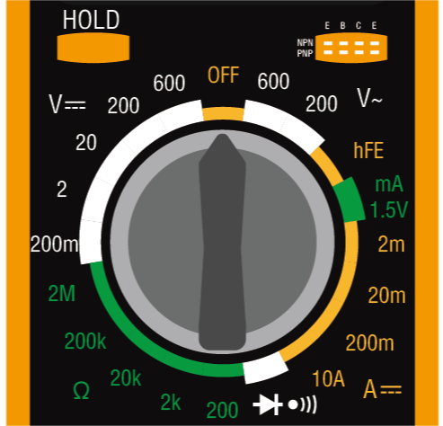

**DC Voltage**
 
In this image, the selected position is used for measuring direct current (DC) voltage.Voltage is represented by a capital V. DC is denoted by three dashed lines with a straight line above them.

Your multimeter has five different DC voltage ranges — 200m (millivolts), 2V (volts), 20V (volts), 200V (volts), and 600V (volts). These numbers represent the maximum voltage that can be measured in each setting.

.. note::

    Here's the conversion between Volts:

    * 1 volt (V) = 1 volt (V)
    * 1 millivolt (mV) = 0.001 volt (V)

    For example, if you have a voltage of 500 millivolts (mV), it can also be expressed as 0.5 volts (V).

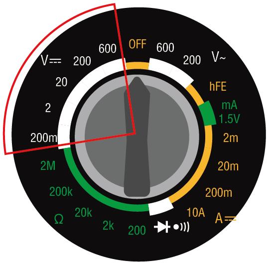

**Measuring Method**: Before measuring voltage, you need to select an appropriate measuring range. In all of our courses, the circuit voltage will not exceed 5V, so you can simply select the 20V position. When the circuit is functioning normally, you can test the voltage by placing the red and black test leads on either side of the device.

**AC Voltage**

This image shows the setting for measuring alternating current (AC) voltage. AC is represented by a wavy line.

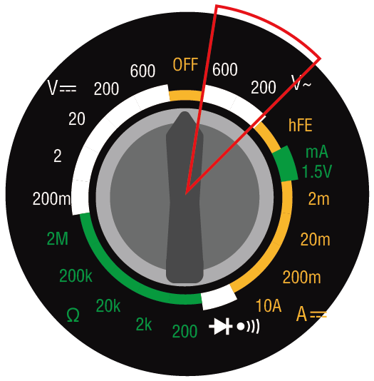

**Transistors**

The hFE NPN PNP setting is for measuring transistors. You will not use this setting in this course.

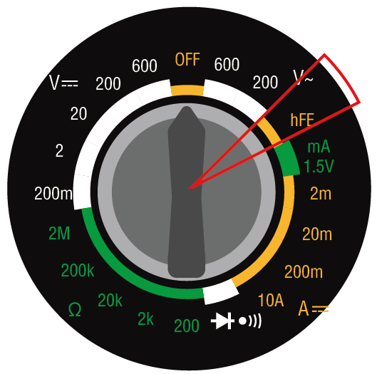

**1.5V mA**

The "1.5V mA" setting on a meter is used to measure the current at a 1.5V voltage level, typically for testing how much current a circuit or device draws at this voltage

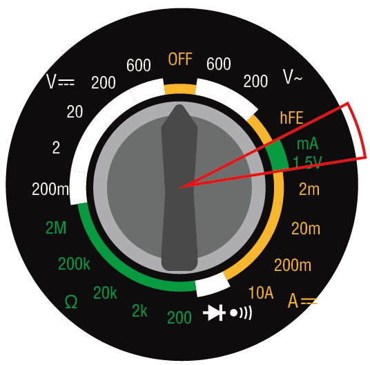

**Current**

For measuring current, the multimeter has settings for 200μ (200 microamp), 2m (2 milliamp), 20m (20 milliamp), 200m (200 milliamp), and 10A (10 amp).

.. note::

    Here's the conversion between amperes:

    * 1 ampere (A) = 1 ampere (A)
    * 1 milliampere (mA) = 0.001 ampere (A)
    * 1 microampere (μA) = 0.000001 ampere (A)

    For example, if you have a current of 50 milliamperes (mA), it can also be expressed as 0.05 amperes (A).

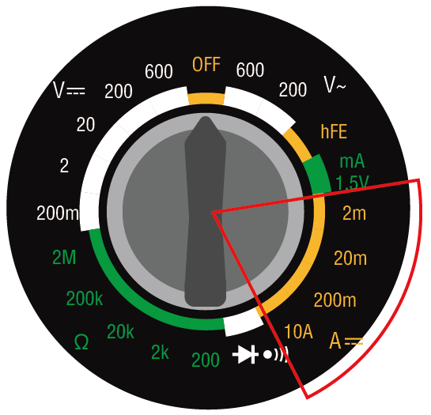

To measure currents less than 200 milliamps, you can insert the red test lead into the VΩmA port. Then, turn the dial to one of the milliamp settings. The circuits you build in this course and project will always have currents less than 200 mA.

For measuring currents up to 10 amperes, you must insert the red test lead into the 10ADC port. Then, turn the dial to the 10A setting.

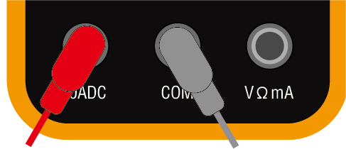

**Measuring Method**: To measure the current in a circuit, the multimeter must be inserted into the circuit. In other words, it must become part of the circuit. This is different from measuring voltage or resistance, which can be done by across a component in the circuit. You will have the opportunity to make these measurements later when you start building circuits.

**Continuity**

The setting with a diode symbol and a sound icon is used for measuring continuity. When measuring continuity, if there can be current flow between the test leads, the multimeter will emit a "beep" sound.

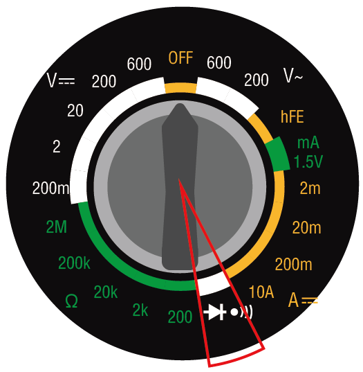

**Resistance**

The final set of options on the multimeter is designated for assessing resistance, symbolized by the Greek letter omega (Ω). Typically, multimeters offer a variety of ranges for resistance measurements. This particular multimeter is equipped with five ranges: 200 ohms, 2k (2,000 ohms), 20k (20,000 ohms), 200k (200,000 ohms), and 2M (2,000,000 ohms). Each range specifies the highest resistance value it can accurately measure. To achieve the most precise readings, select a range that can measure the resistance without surpassing its upper limit.

.. note::

    Here's the conversion between ohms:

    * 1 ohm (Ω) = 1 ohm (Ω)
    * 1 kilohm (kΩ) = 1000 ohms (Ω)
    * 1 megohm (MΩ) = 1000000 ohms (Ω)

For example, if you have a resistance of 1000 ohms (Ω), it can also be expressed as 1 kilohm (kΩ).

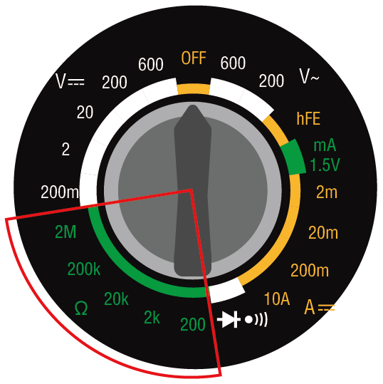

**Tips**

During the measurement of resistance, voltage, or current, you might notice that the values on the display tend to vary. To stabilize and capture a specific reading, you can utilize the HOLD feature. This action freezes the current value on the display, where it stays until the HOLD button is pressed once more.

If you're uncertain about the appropriate range to choose for measuring voltage, current, or resistance, it's advisable to begin with the maximum range available. This approach provides an initial estimate of the values you're working with, allowing you to subsequently narrow down to a more accurate range for precise measurements.

**Question**

Now that you have a detailed understanding of how to use a multimeter, consider which multimeter setting you would use to measure the following electrical values?

.. list-table::
  :widths: 25 25
  :header-rows: 1

  * - Measurement Object
    - Multimeter Setting
  * - 9V volts DC
    -
  * - 1K ohms
    -
  * - 40 milliamps
    - 
  * - 110 volts AC
    -

Measuring with a Multimeter
--------------------------------

In the previous lesson, you set up a simple circuit to light an LED. Now, we will use a multimeter to measure the voltage, current, and resistance in this circuit. Let's see how to do it now!

**Preparing the Multimeter**

Before using the multimeter, you need to install the battery and connect the two test leads, so it's ready to use at any time.

1. Follow the video below to connect the battery to your multimeter.

  .. raw:: html

      <video width="600" loop autoplay muted>
          <source src="_static/video/3_multimeter_battery.mp4" type="video/mp4">
          Your browser does not support the video tag.
      </video>

2. Find your multimeter and the red and black test leads. Ensure the multimeter is in the "off" position. Insert the black test lead into the COM port of the multimeter. Insert the red test lead into the voltage-ohm-milliamp (VΩmA) port.

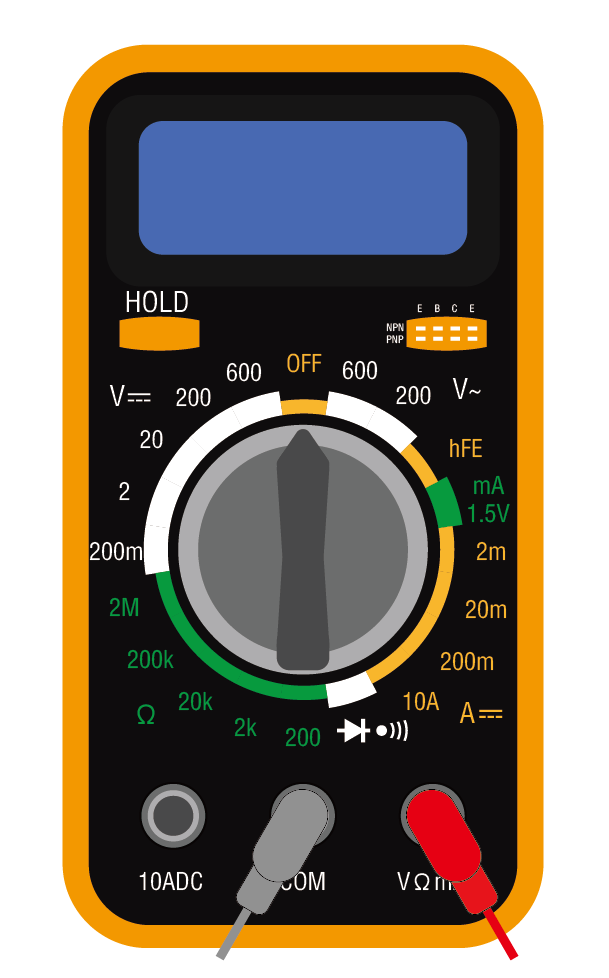

**Measuring Voltage**

1. Turn the multimeter to the DC 20 volts setting.

.. image:: img/multimeter_dc_20v.png
  :width: 300
  :align: center

2. Slightly pull apart the positive and negative wires on the breadboard to expose the metal ends without fully detaching them.

3. Then, touch the exposed metal ends with the multimeter's red and black test leads to measure the voltage.

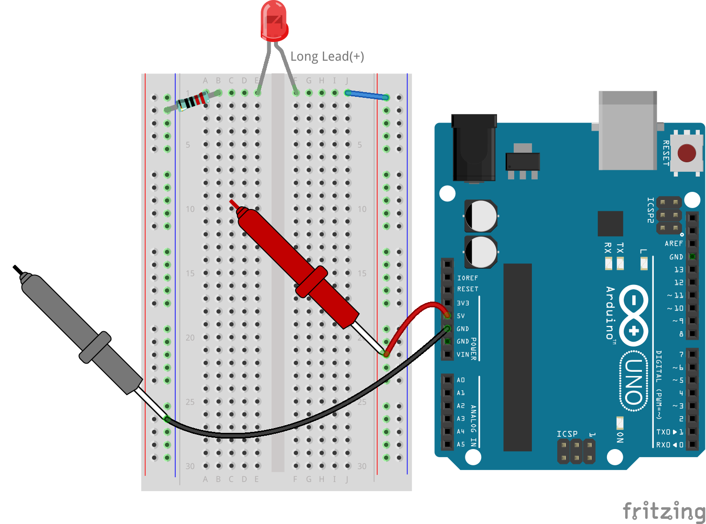

4. Record the voltage, you can also record the observed phenomena in the Notes column.

.. note::

    * Mine was 5.13 volts, fill in according to your measurement.

    * Due to wiring issues and instability of your hand, you may see the voltage fluctuate. Keep your hand steady, observe a few times, and you will get a fairly stable voltage reading.

.. list-table::
   :widths: 25 25 50 25
   :header-rows: 1

   * - Type
     - Units
     - Measurement Results
     - Notes
   * - Voltage
     - Volts
     - *≈5.13 volts*
     - 
   * - Current
     - Milliamps
     - 
     - 
   * - Resistance
     - Ohms
     - 
     -

5. Finally, reinsert all the jumper wires into the breadboard to prevent them from being pulled out while you conduct other measurements.

**Measuring Current**

You have measured the voltage in the circuit. Next, you will measure the current in the circuit.

1. For current measurement, the multimeter needs to be integrated into the circuit's flow path, essentially becoming a segment of the circuit's conductive route. A straightforward method involves adjusting the LED's placement: keep the LED's anode in hole 1F while shifting its cathode (the shorter leg) from hole 1E to hole 3E.

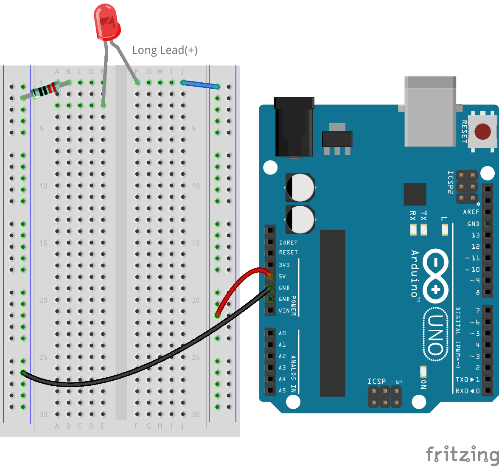

2. Set the multimeter to the 200 milliamps position.

.. image:: img/multimeter_200ma.png
  :width: 300
  :align: center

3. Place the black test lead on the wire connected to hole 1B and the red test lead on the LED's cathode in hole 3E. Completing this setup, the red LED should begin to blink.

  .. note::

    When measuring voltage across the resistor and LED, ensuring a solid connection with the multimeter test leads can be tricky. To get a better grip, attach the test leads where the component legs enter the breadboard. This way, you can press down harder without dislodging anything.

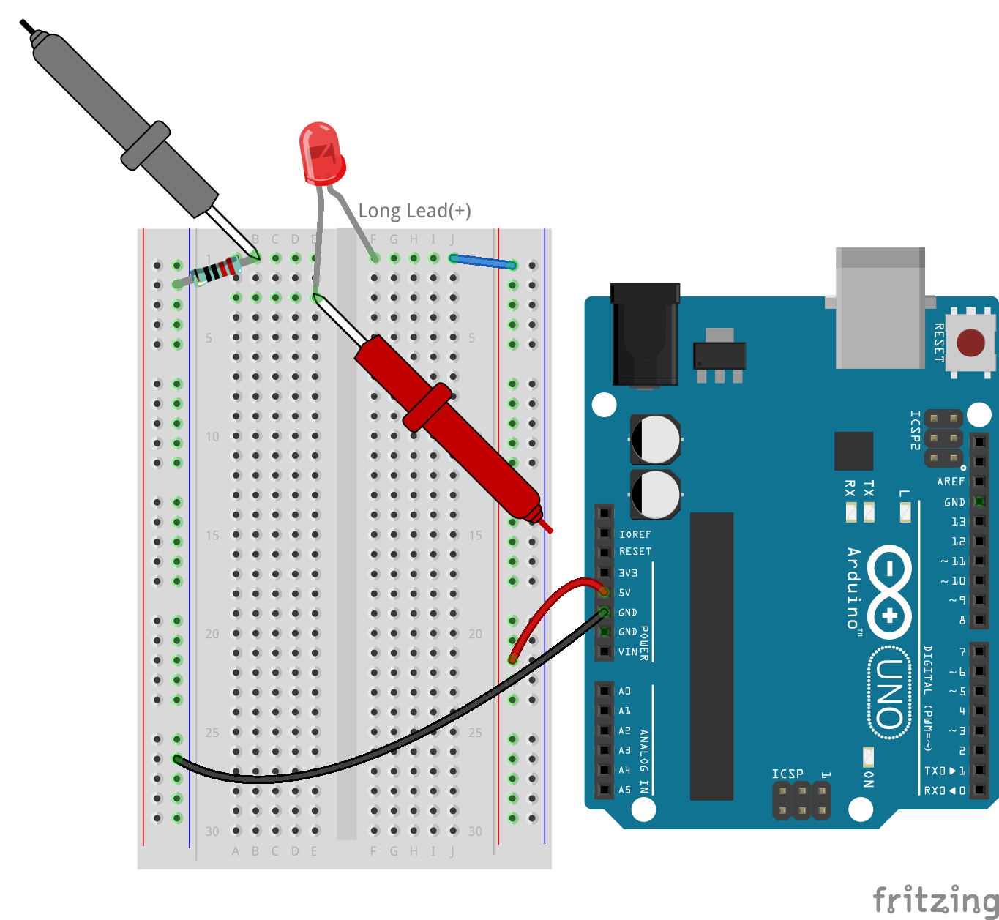

4. You will find the read current is less than 20mA, so we can switch to the 20mA position to get a more accurate reading.

.. image:: img/multimeter_20a.png
  :width: 300
  :align: center

5. Measure and record the current in the circuit, in milliamps.

.. note::

  Please be aware that fluctuations in the measured current are normal due to various factors such as contact stability, power supply variations, and temperature effects. We recommend simply recording the current value you measure at any given moment. If the value is within theoretical expectations, it should be considered acceptable.

  
.. list-table::
   :widths: 25 25 50 25
   :header-rows: 1

   * - Type
     - Units
     - Measurement Results
     - Notes
   * - Voltage
     - Volts
     - *≈5.13 volts*
     - 
   * - Current
     - Milliamps
     - *≈13.54 milliamps*
     - 
   * - Resistance
     - Ohms
     - 
     -

6. Put the LED back in its original position, with the anode in hole 1F and the cathode in hole 1E.

**Calculating Total Resistance**

Measuring resistance in a circuit with a multimeter gets tricky when LEDs are involved, because LEDs need a specific amount of voltage to turn on, called the forward voltage. If the voltage isn't high enough, the LED won't light up, and the circuit stays open, which complicates measuring resistance. Moreover, you can't have any voltage in the circuit other than what's coming from the multimeter when you're trying to measure resistance.

So, directly measuring the circuit's resistance with a multimeter isn't straightforward. What should we do then?

Here, we will use the formula shown below to calculate resistance from voltage and current, which is Ohm's Law. We will provide a detailed introduction to this in the next lesson.

.. code-block::

    Voltage = Current x Resistance

    Or

    V = I • R

When rearranged, the equation becomes:

.. code-block::

    Resistance = Voltage / Current

    Or

    R = V / I

Using the formula above, with the voltage and current you measured, you can calculate the total resistance in the circuit and fill it into the table.

.. note::

    Voltage is in volts, resistance is in ohms, and current in the table is in milliamps, you need to convert milliamps to amperes:

    1 Amps = 1000 Milliamps

    Meaning you need to divide the measured current by 1000 before using the formula to calculate total resistance. The final calculated result may not be a whole number, please round to two decimal places. For example, my calculated value is 378.8774002954, which I round to 378.88.

    R = 5.13 / (13.54 / 1000) = 378.88 ohms

.. list-table::
   :widths: 25 25 50 25
   :header-rows: 1

   * - Type
     - Units
     - Measurement Results
     - Notes
   * - Voltage
     - Volts
     - *≈5.13 volts*
     - 
   * - Current
     - Milliamps
     - *≈13.54 milliamps*
     - 
   * - Resistance
     - Ohms
     - *≈378.88 ohms*
     -

**Measuring the Resistance Value**

Now that we've figured out the circuit's total resistance, it's time to see how much of it is because of the resistor and how much is due to the LED. Our resistor is marked as 220 ohms, but with a 5% tolerance, it could actually be anywhere from 209 to 231 ohms. Let's use the multimeter to find out its exact value.

1. When measuring resistance, your multimeter has to act as the only source of voltage; make sure there are no other power sources connected to the circuit. So, unplug any jumper wires from the Arduino Uno R3 to ensure the breadboard is isolated.

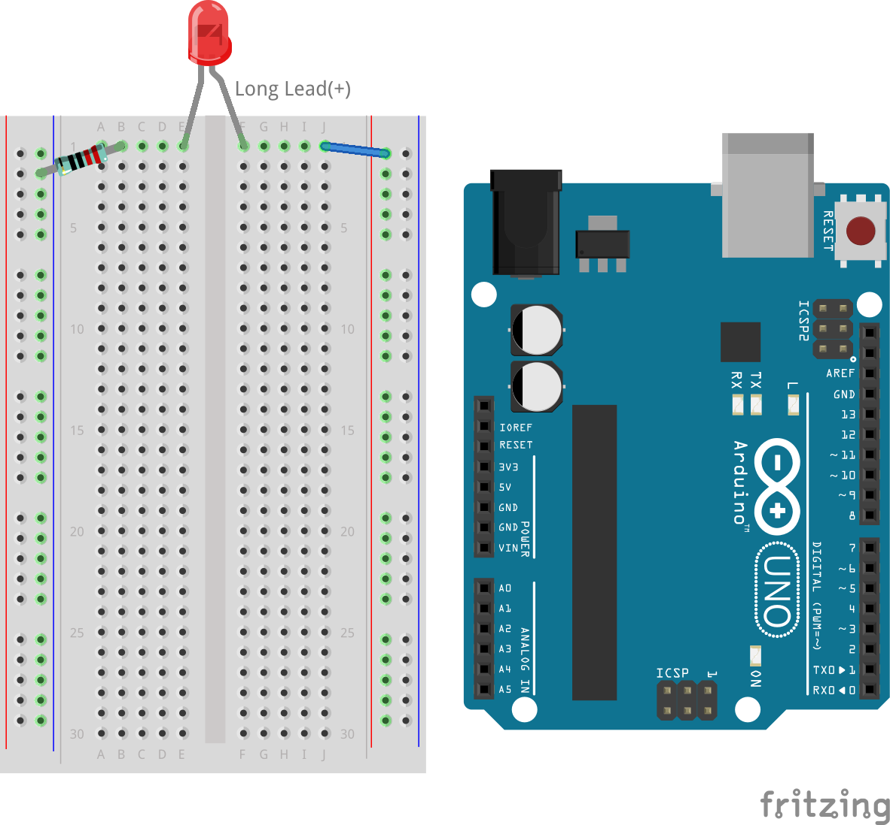

2. For an accurate measure of the resistor's resistance, dial your multimeter to the 2K (2000 ohms) resistance mode.

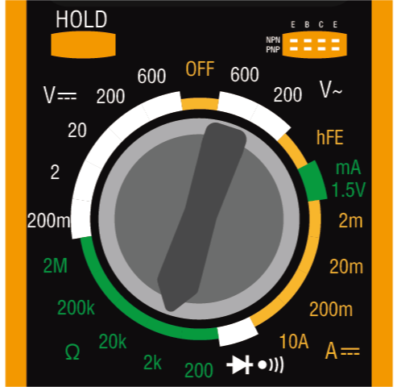

3. Place the multimeter's red and black test leads on either side of the resistor, and record the reading from the multimeter.

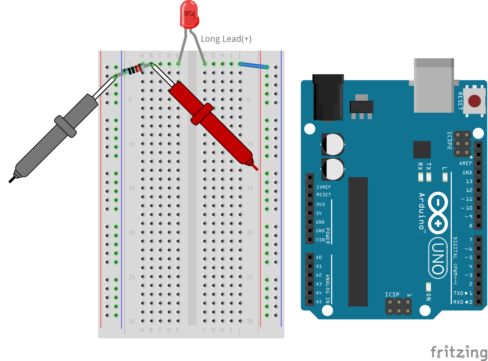

4. After measuring, remember to turn the multimeter off by setting it to the "OFF" position.

**Calculating the LED's Resistance**

To determine the LED's resistance, subtract the resistor's resistance from the total resistance in the circuit.

.. code-block::

    LED Resistance = Total Resistance - Resistor's Resistance

So, according to my measurements, the LED's resistance should be: 378.88 - 215 = 163.88 ohms.

We've taken a hands-on journey through the essentials of using a multimeter to measure voltage, current, and resistance in a circuit. From building a simple LED circuit to delving into the nuances of measuring resistance in circuits with LEDs, we've explored how to practically apply Ohm's Law and understand the dynamics of series and parallel circuits. As we move forward, remember that these foundational skills lay the groundwork for more complex projects and deeper understanding of electronics. Keep experimenting, keep learning, and let's continue to illuminate the path of electronic exploration together.
