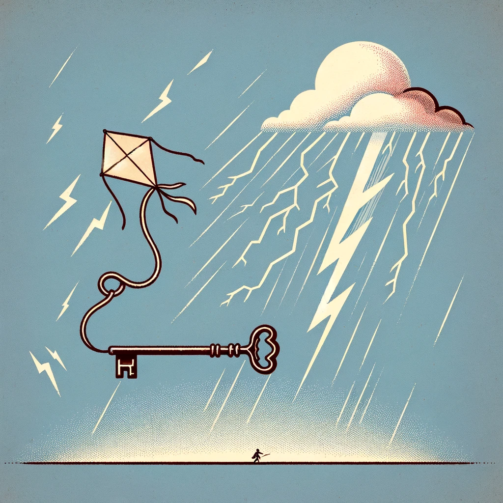
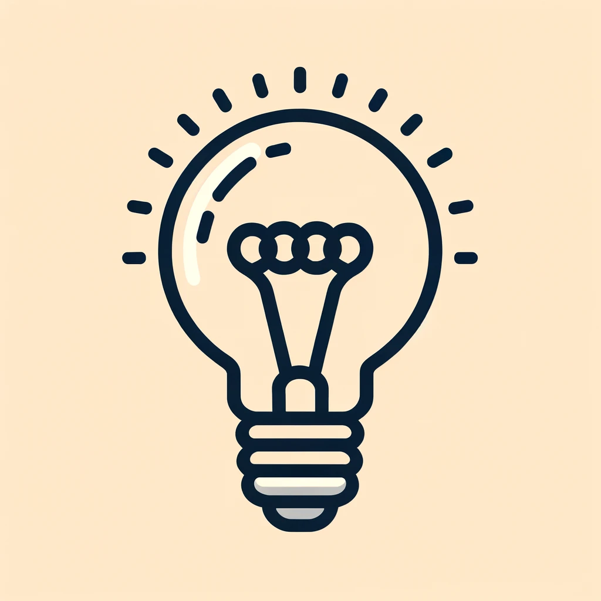
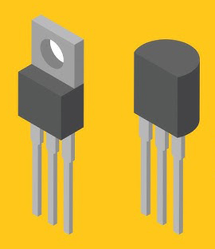
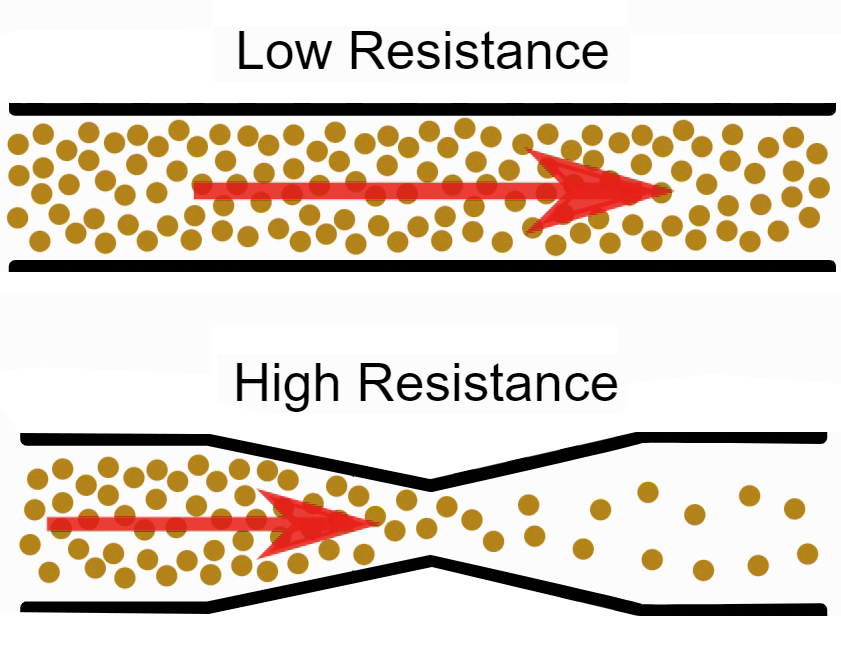

.. note::

    Hello, welcome to the SunFounder Raspberry Pi & Arduino & ESP32 Enthusiasts Community on Facebook! Dive deeper into Raspberry Pi, Arduino, and ESP32 with fellow enthusiasts.

    **Why Join?**

    - **Expert Support**: Solve post-sale issues and technical challenges with help from our community and team.
    - **Learn & Share**: Exchange tips and tutorials to enhance your skills.
    - **Exclusive Previews**: Get early access to new product announcements and sneak peeks.
    - **Special Discounts**: Enjoy exclusive discounts on our newest products.
    - **Festive Promotions and Giveaways**: Take part in giveaways and holiday promotions.

    👉 Ready to explore and create with us? Click [|link_sf_facebook|] and join today!

4. Ohm's Law: A Journey Through the Essentials of Electrical Circuits
=======================================================================

Every electronic device operates on principles governed by circuits and circuit boards. To ensure these devices function correctly, electrical engineers must deeply understand and control electricity's flow. One crucial concept in this realm is Ohm's Law, which provides a fundamental relationship between voltage, current, and resistance within electrical circuits. This lesson dives into Ohm's Law, exploring its implications and applications.

This lesson explores the fundamental principles underlying every electronic device we use today. Understanding these principles, particularly Ohm's Law, is crucial for electrical engineers to control and predict the behavior of circuits effectively.

The Spark of Electricity
-------------------------------

The story of electricity begins with early experiments and profound insights. Benjamin Franklin, with his kite experiment, though not discovering electricity, ignited curiosity and spurred further exploration into electrical charges and their powers.

His experiments laid the groundwork for understanding that electricity involves the movement of positive and negative charges, analogous to the natural phenomena of lightning. Inspired by Franklin, French scientist Thomas-François Dalibard demonstrated practical examples of how electrical currents could naturally occur.

This era also witnessed the rivalry and collective achievements of Nikola Tesla and Thomas Edison, whose efforts helped sculpt our modern electrical infrastructure. Tesla's development of alternating current (AC) and Edison's introduction of the light bulb exemplified the rapid advancements in electrical engineering.

Advancements continued with the invention of the transistor in 1947, a component foundational to all modern electronics. This tiny yet powerful device enabled the creation of microchips and electronic switches, pivotal in today's technology-driven world.

    

Georg Ohm and His Law
------------------------------

In the midst of these technological strides, Georg Ohm, a German physicist, embarked on experiments that would define the core principles of electrical circuits. At a time when electricity was still a novel scientific field, Ohm explored how electrical currents behaved under different conditions using basic yet effective experimental setups involving wires, batteries, and homemade resistors.

Ohm's meticulous experiments revealed a consistent proportional relationship between voltage, current, and resistance, encapsulated in the formula V=IR—now celebrated as Ohm's Law. This discovery not only provided a mathematical description of electricity but also facilitated the predictable design and operation of electrical devices.

.. code-block::

    Voltage = Current x Resistance
    Or
    V = I • R

Ohm's perseverance through skepticism highlighted the significance of his findings, which laid the groundwork for future technological advances and ushered in a new era of electrical engineering.

Understanding Current, Voltage, and Resistance
----------------------------------------------------

To fully understand and apply Ohm's Law, it is essential to grasp the basic concepts of current, voltage, and resistance. These components are indispensable elements of any circuit, analogous to the elements of a flowing river.

- **Current (I)**: The flow of electrons through a conductor, measured in amperes (amps).
- **Voltage (V)**: The electrical force or pressure that drives electrons through a conductor.
- **Resistance (R)**: Provides opposition to the flow of electrons, measured in ohms (Ω), and typically represented by the Greek letter omega.

Using a garden hose analogy helps clarify these concepts:

- **Current** is comparable to the flow of water, indicating the speed at which electrons move through a conductor.
- **Voltage** is like the tap control, regulating the force that propels the water.
- **Resistance** is similar to any knots or bends in the hose, which obstruct the water's path and slow down the flow.

This explanation helps us connect the theoretical knowledge of Ohm's Law with the behavior of actual circuits, laying the foundation for further learning and application.

Exploring Ohm's Law with Practical Experiments
-----------------------------------------------------

Now, let's apply Ohm's Law in a hands-on manner by using a simple LED circuit to observe the effects of changing resistance and voltage.

**Experiment Setup**

1. You will start with a basic circuit that includes an LED and a 220-ohm resistor.
   
   .. image:: img/2_uno_gnd.png
     :width: 600
     :align: center

2. Substitute the 220-ohm resistor with other resistors of different values as listed below. Record the LED's brightness changes with each substitution to observe how resistance affects the current and, consequently, the light output.

   .. list-table::
      :widths: 25 100
      :header-rows: 1

      * - Resistor
        - Observations
      * - 100Ω
        - 
      * - 1KΩ
        - 
      * - 10KΩ
        - 
      * - 1MΩ
        - 

  
  You will notice that only with the 100Ω resistor is the LED brighter than with the previous 220Ω resistor. With higher resistances, the brightness of the LED diminishes until it completely turns off at 1MΩ. Why is this the case?

  According to Ohm's Law (I = V/R), as resistance increases while the voltage is held constant, the current through the LED decreases, thus dimming the LED. At 1MΩ, the current is too small to light up the LED.

3. After observing the effects of changing resistance, maintain the resistor at 220 ohms and change the circuit's voltage supply from 5V to 3.3V. Record any changes in the LED's brightness.

  You will find that the LED is slightly dimmer at 3.3V than at 5V. Why is this?

  With Ohm's Law, knowing the resistance and the new voltage, the current should be I = V/R. With a decrease in voltage while resistance stays the same, the current decreases, dimming the LED.

**Summary**

By conducting these experiments, you have directly observed how Ohm's Law is fundamental in understanding and designing electrical circuits. This practical application helps cement the theoretical concepts discussed earlier and demonstrates the real-world implications of voltage, current, and resistance in electrical engineering.
