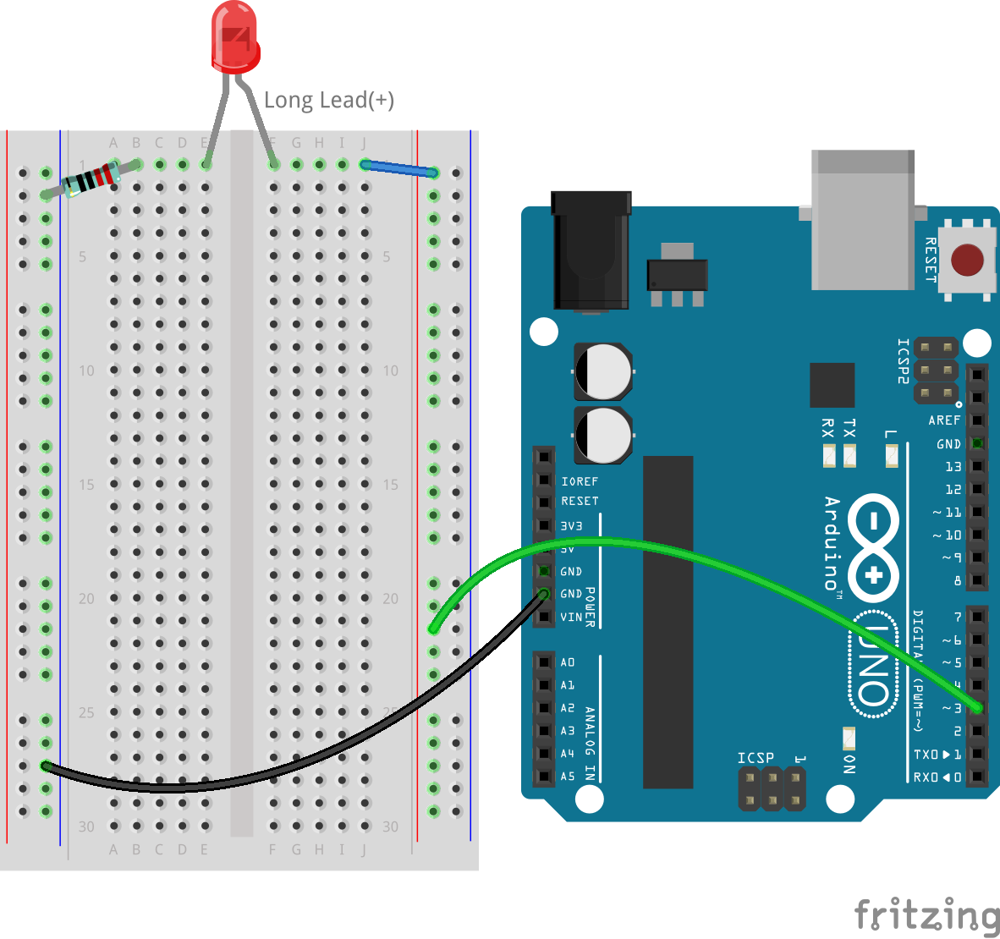
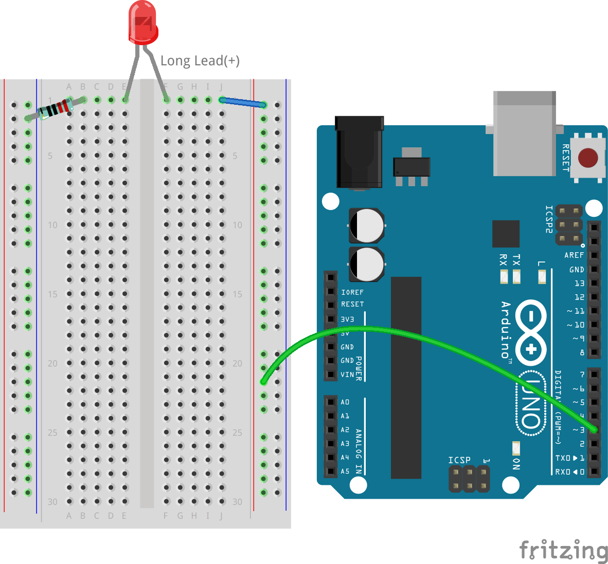
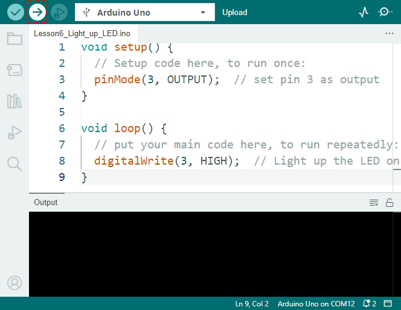
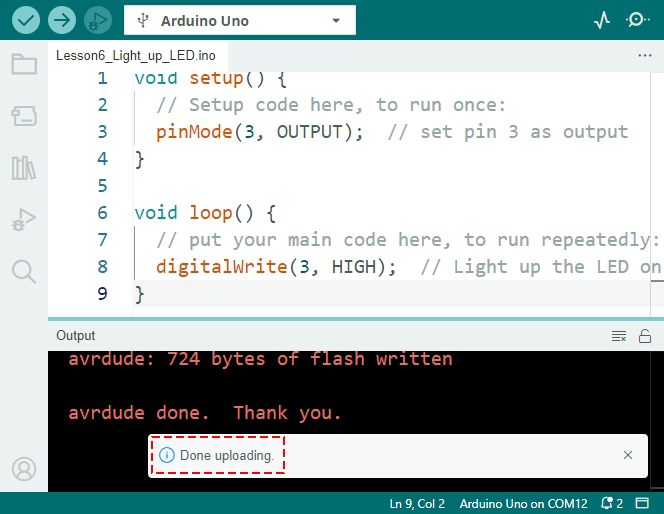
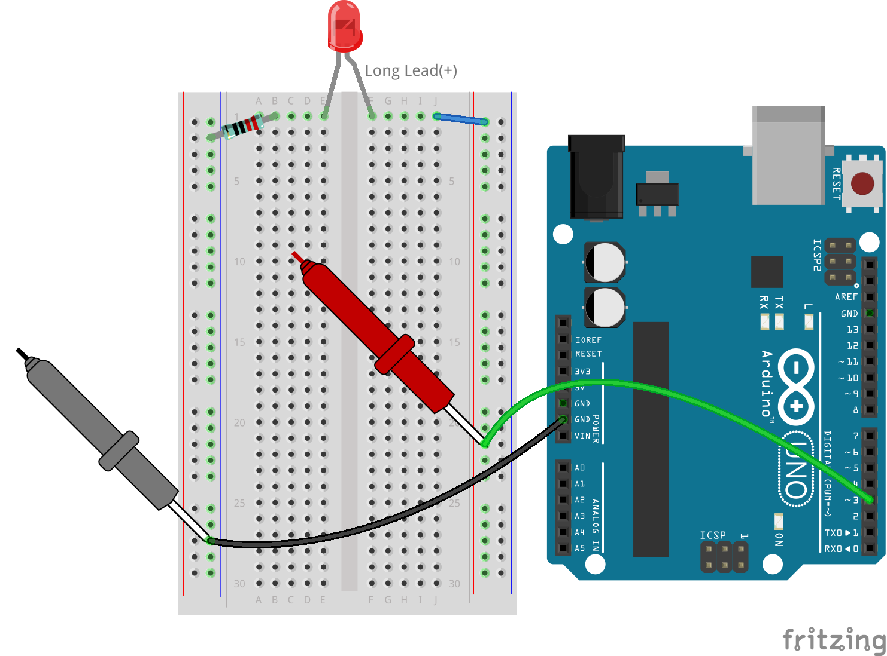

.. note::

    こんにちは、SunFounderのRaspberry Pi & Arduino & ESP32エンスージアストコミュニティへようこそ！Facebookで仲間と一緒にRaspberry Pi、Arduino、ESP32についてさらに深く学びましょう。

    **参加する理由**

    - **専門家のサポート**: コミュニティやチームのサポートで、購入後の問題や技術的な課題を解決。
    - **学びと共有**: スキルを向上させるためのヒントやチュートリアルを交換。
    - **限定プレビュー**: 新製品発表や先行情報に早期アクセス。
    - **特別割引**: 最新製品に対する限定割引を享受。
    - **イベントプロモーションとギブアウェイ**: ギブアウェイやホリデープロモーションに参加。

    👉 探求と創造の旅に出る準備はできましたか？[|link_sf_facebook|]をクリックして、今すぐ参加しましょう！

6. LEDを点滅させる
======================
このレッスンへようこそ。このレッスンでは、Arduino Uno R3のデジタルピンを操作し、LEDをプログラムで制御して手動操作なしで点灯および消灯する方法を学びます。これは家庭や産業用電子機器の応用において基本的なスキルです。

.. raw:: html

    <video muted controls style = "max-width:90%">
        <source src="_static/video/6_blink_led.mp4" type="video/mp4">
        Your browser does not support the video tag.
    </video>

このレッスンで学べること:

* Arduino IDEを使用してスケッチを作成および保存する方法。
* ``pinMode()`` および ``digitalWrite()`` 関数を使用して回路要素を制御する方法。
* スケッチをArduino Uno R3にアップロードし、そのリアルタイムの効果を理解する方法。
*  ``delay()`` をスケッチに実装して回路動作を管理する方法。

レッスンの終わりまでに、LEDを点灯させるだけでなく、設定した間隔で点滅させる回路を構築するスキルを身につけ、ソフトウェアがハードウェアとどのように連携するかの基本的な理解を深めることができます。

回路の構築
--------------------------------

**必要なコンポーネント**

.. list-table:: 
   :widths: 25 25 25 25
   :header-rows: 0

   * - 1 * Arduino Uno R3
     - 1 * 赤色LED
     - 1 * 220Ω抵抗
     - ジャンパーワイヤー
   * - |list_uno_r3| 
     - |list_red_led| 
     - |list_220ohm| 
     - |list_wire| 
   * - 1 * USBケーブル
     - 1 * ブレッドボード
     - 1 * マルチメーター
     -   
   * - |list_usb_cable| 
     - |list_breadboard| 
     - |list_meter|
     - 

**ステップバイステップでの構築**

:ref:`2_first_circuit` で構築した回路を取り出し、ワイヤーを5Vからピン3に切り替えます。以下の画像のように行います。

前の回路を解体した場合は、以下の手順に従って再構築できます:

1. 220Ω抵抗をブレッドボードに接続します。一方のワイヤーは負極端子に、もう一方のワイヤーは1Bの穴に差し込みます。

.. image:: img/2_connect_resistor.png
    :width: 300
    :align: center

2. 赤色LEDをブレッドボードに追加します。LEDのアノード（長い足）は1Fの穴に、カソード（短い足）は1Eの穴に差し込みます。足の長さでアノードとカソードを区別するのが難しい場合がありますが、カソード側にはカラーレンズに平らなエッジがあり、アノード側には丸いエッジがあります。

.. image:: img/2_connect_led.png
    :width: 300
    :align: center

3. 短いジャンパーワイヤーを使って、LEDと電源を接続します。ジャンパーワイヤーの一端を1Jの穴に、もう一端を正極端子に差し込みます。

.. image:: img/2_connect_wire.png
    :width: 300
    :align: center

4. ブレッドボードの正極端子をArduino Uno R3のピン3に接続します。

5. ブレッドボードの負極端子をArduino Uno R3のGNDピンの一つに接続します。GNDピンは「GND」とマークされています。

LEDを点灯させる
-----------------------------

さあ、LEDを点灯させる時が来ました！前回のArduinoのBlink例に飛び込むのではなく、一から新しいスケッチを作成しましょう。早速始めましょう！

**1. スケッチの作成と保存**

1. Arduino IDEを起動します。「ファイル」メニューから「新しいスケッチ」を選択し、最初から新しいスケッチを開始します。開いている他のスケッチウィンドウは閉じても構いません。

    .. image:: img/6_blink_ide_new.png
        :align: center

2. Arduino IDEのウィンドウを、このオンラインチュートリアルと並べて配置し、両方を同時に表示できるようにします。少し小さく見えるかもしれませんが、ウィンドウを行き来する手間が省けます。

    .. image:: img/6_blink_ide_tutorials.png

3. スケッチを保存します。「ファイル」メニューから「保存」を選択するか、 ``Ctrl + S`` を押します。

    .. image:: img/6_blink_ide_save.png

4. スケッチをデフォルトの場所または他の場所に保存できます。スケッチに ``Lesson6_Light_up_LED`` のような意味のある名前を付けて、「保存」をクリックします。

    * 後で簡単に見つけられるように、スケッチにその機能に関連する名前を付けます。
    * Arduinoスケッチのファイル名にはスペースを含めることができません。
    * 重要な変更を保存する際には、新しいバージョン（例: V1）として保存してバックアップすることを検討してください。
    
    .. image:: img/6_blink_ide_name.png

5. 新しいスケッチは、 ``void setup()`` と ``void loop()`` という2つのメイン部分で構成されています。これらはすべてのArduinoスケッチで使用される関数です。

    * ``void setup()`` はプログラムが開始されたときに一度だけ実行され、初期条件を設定します。
    * ``void loop()`` は繰り返し実行され、連続的なアクションを実行します。
    * 各関数の命令は、波括弧 ``{}`` 内に記述します。
    * ``//`` で始まる行はコメントです。これらはメモとして役立ち、コードの実行には影響しません。

    .. code-block:: Arduino

        void setup() {
        // ここにセットアップコードを記述し、一度だけ実行されます。

        }

        void loop() {
        // ここにメインコードを記述し、繰り返し実行されます。

        }

**2. ボードとポートの選択**

1. Arduino Uno R3をUSBケーブルでコンピュータに接続します。Arduinoの電源ライトが点灯します。

    .. image:: img/1_connect_uno_pc.jpg
        :width: 600
        :align: center

2. IDEに **Arduino Uno** を使用していることを知らせます。 **ツール**  -> **ボード** -> **Arduino AVR Boards** -> **Arduino Uno** に進みます。

    .. image:: img/6_blink_ide_board.png
        :width: 600
        :align: center

3. 次に、Arduino IDEでArduinoが接続されているポートを選択します。

    .. note::

        * 一度ポートが選択されると、Arduino IDEはUSB経由でArduinoが接続されるたびにそれをデフォルトにするはずです。
        * 別のArduinoボードが接続された場合、新しいポートを選択する必要があるかもしれません。
        * 接続に問題がある場合、まずポートを確認してください。

    .. image:: img/6_blink_ide_port.png
        :width: 600
        :align: center

**3. コードの記述**

1. このプロジェクトでは、ボードのデジタルピン3を使用してLEDを制御します。各ピンは出力として5ボルトを送り出すか、入力として電圧を読み取ることができます。LEDを設定するには、 ``pinMode(pin, mode)`` 関数を使用してピンを出力として設定します。
    
    ``pinMode()`` の構文を見てみましょう。

    * ``pinMode(pin, mode)`` : 特定のピンを ``INPUT`` または ``OUTPUT`` に設定します。

    **パラメータ**
        - ``pin``: モードを設定したいピンの番号。
        - ``mode``: ``INPUT``、 ``OUTPUT`` 、または ``INPUT_PULLUP`` 。

    **戻り値**
        なし
    
2. 次に、 ``void setup()`` 関数に最初のコード行を追加します。
        
    .. note::

        - Arduinoのコーディングは大文字小文字を区別します。関数は正確に記述する必要があります。
        - コマンドの最後にセミコロンを付ける必要があります。Arduino IDEでは、すべてのコマンドはセミコロンで終わる必要があります。
        - コードコメントは、コードの行やセクションが何をしているのかを思い出すのに役立ちます。

    .. code-block:: Arduino
        :emphasize-lines: 3

        void setup() {
            // ここにセットアップコードを記述し、一度だけ実行されます。
            pinMode(3,OUTPUT); // ピン3を出力として設定
        }
    
        void loop() {
        // ここにメインコードを記述し、繰り返し実行されます。

        }

**4. コードの検証**

トラフィックライトを作動させる前に、コードを検証しましょう。これは、Arduino IDEがあなたのコマンドを理解し、機械言語にコンパイルできるかどうかを確認するためです。

1. コードを検証するには、ウィンドウの左上隅にある**チェックマーク**ボタンをクリックします。

    .. image:: img/6_blink_ide_verify.png
        :width: 600
        :align: center

2. コードが機械で読み取れる場合、ウィンドウの下部にコードが正常にコンパイルされたことを示すメッセージが表示されます。このエリアには、プログラムが使用するストレージ容量も表示されます。

    .. image:: img/6_blink_ide_verify_done.png
        :width: 600
        :align: center

3. コードにエラーがある場合、オレンジ色のエラーメッセージが表示されます。通常、IDEは問題がある場所を強調表示します。たとえば、セミコロンが欠落している場合、その直後の行がハイライトされます。

    .. image:: img/6_blink_ide_verify_error.png
        :width: 600
        :align: center

4. エラーが発生した場合は、デバッグが必要です。コードの間違いを見つけて修正します。次のような一般的な問題をチェックしてください：

    - ``pinMode`` の ``M`` は大文字ですか？
    - ``OUTPUT`` はすべて大文字で入力しましたか？
    - ``pinMode`` 関数には、開き括弧と閉じ括弧の両方が含まれていますか？
    - ``pinMode`` 関数の最後にセミコロンを付けましたか？
    - すべてのスペルは正しいですか？エラーが見つかったら修正し、もう一度コードを検証してください。エラーがなくなるまでデバッグを続けます。

Arduino IDEは最初のエラーでコンパイルを停止するため、複数のエラーがある場合は複数回検証する必要があるかもしれません。定期的にコードを検証することは良い習慣です。

デバッグはプログラミングの大部分を占めます。プロのプログラマーは、しばしば新しいコードを書くよりもデバッグに多くの時間を費やします。エラーは普通のことなので、落胆しないでください。優れた問題解決者になることが、優れたプログラマーになる鍵です。

**5. スケッチの続きを書く**

1. いよいよ ``void loop()`` 関数に進む準備が整いました。ここでは、スケッチやプログラムの主なアクションが実行されます。Arduino Uno R3に接続されたLEDを点灯させるためには、 ``digitalWrite()`` を使用して回路に電圧を供給する必要があります。

    * ``digitalWrite(pin, value)`` : デジタルピンに ``HIGH`` （5V）または ``LOW`` （0V）の信号を送り、コンポーネントの動作状態を変更します。

    **パラメータ**
        - ``pin`` : Arduinoのピン番号。
        - ``value`` : ``HIGH`` または ``LOW`` 。
    
    **戻り値**
        なし

5. ``void loop()`` 関数内のコメントの下に、ピン3に接続されたLEDを点灯させるコマンドを書きます。コマンドの最後にセミコロンを忘れないようにしてください。必要に応じてコードを検証してデバッグします。

    .. code-block:: Arduino
        :emphasize-lines: 8

        void setup() {
            // ここにセットアップコードを記述し、一度だけ実行されます:
            pinMode(3, OUTPUT);  // ピン3を出力として設定
        }

        void loop() {
            // ここにメインコードを記述し、繰り返し実行されます:
            digitalWrite(3, HIGH);
        }

6. ``digitalWrite()`` コマンドの後に、この行が何をしているのか説明するコードコメントを追加します。例えば：

    .. code-block:: Arduino
        :emphasize-lines: 8

        void setup() {
            // ここにセットアップコードを記述し、一度だけ実行されます: 
            pinMode(3, OUTPUT);  // ピン3を出力として設定
        }

        void loop() {
            // ここにメインコードを記述し、繰り返し実行されます:
            digitalWrite(3, HIGH);  // ピン3に接続されたLEDを点灯
        }

**6. コードのアップロード**

コードがエラーなしで検証されたら、Arduino Uno R3にアップロードして、トラフィックライトを点灯させましょう。

1. IDEで「アップロード」ボタンをクリックします。コンピュータはコードをコンパイルし、それをArduino Uno R3に転送します。転送中にボード上のライトが点滅し、コンピュータとの通信が行われていることを示します。

2. 「アップロード完了」のメッセージが表示されたら、コードに問題がなく、正しいボードとポートが選択されていることを意味します。

3. 転送が完了すると、コードが実行され、ブレッドボード上のLEDが点灯するはずです。

**7. LEDの電圧を測定する**

マルチメータを使用して、ピン3の電圧を測定し、コード内の ``HIGH`` 状態が実際に何を意味するのかを理解しましょう。

1. マルチメータをDC 20ボルト設定に調整します。

.. image:: img/multimeter_dc_20v.png
    :width: 300
    :align: center

2. まず、ピン3の電圧を測定します。マルチメータの赤いテストリードをピン3に、黒いテストリードをGNDに触れさせます。

3. 測定した電圧を表に記録します。「HIGH」とラベル付けされた行の下にピン3の電圧を記録してください。

.. list-table::
   :widths: 25 25
   :header-rows: 1

   * - 状態
     - ピン3の電圧
   * - HIGH
     - *≈4.95 volts*
   * - LOW
     - 

4. 測定後、マルチメータを「OFF」位置にして電源を切ることを忘れないでください。

測定結果によると、すべてのピンの電圧は5Vに近いことが分かります。これにより、コード内でピンを ``HIGH`` に設定すると、そのピンの出力電圧が約5Vになることが確認されます。

R3のピン電圧は5Vであり、 ``HIGH`` に設定すると約5Vに達します。ただし、3.3Vで動作するボードもあり、それらの ``HIGH`` 状態は約3.3Vになります。

LEDを点滅させる
------------------------------

LEDが点灯したら、次はそれを点滅させましょう。

1. 先ほど保存したスケッチ「 ``Lesson6_Light_up_LED`` 」を開き、「ファイル」メニューから「名前を付けて保存」を選択して、「 ``Lesson6_Blink_LED`` 」に名前を変更します。そして、「保存」をクリックします。

2. スケッチの ``void loop()`` 関数で、 ``digitalWrite()`` コマンドをコピーし、元のコマンドの後に貼り付けます。LEDを点滅させるために、まずLEDを点灯させ、その後に ``LOW`` を設定してLEDを消灯させます。

    .. note::
       * コピーペーストはプログラマーの強い味方です。きれいに書かれたコードを複製し、新しい場所に貼り付けてパラメータを調整することで、迅速かつ効率的な実行が可能です。
       * コメントを更新して、実行されるアクションに適したものにしましょう。
       *  ``Ctrl+T`` を使って、コードを一クリックできれいにフォーマットし、読みやすくしましょう。

    .. code-block:: Arduino
       :emphasize-lines: 8,9

       void setup() {
            // セットアップコードをここに記述し、初回のみ実行されます:
            pinMode(3, OUTPUT);  // ピン3を出力に設定
       }

       void loop() {
            // メインコードをここに記述し、繰り返し実行されます:
            digitalWrite(3, HIGH);  // ピン3のLEDを点灯   
            digitalWrite(3, LOW);  // ピン3のLEDを消灯
       }

3. 「アップロード」ボタンを押して、スケッチをArduino Uno R3に転送します。転送後、LEDが点滅しないか、点滅が速すぎて目に見えないかもしれません。

4. 点滅を視覚的に確認するには、 ``delay()`` コマンドを使用して、Arduino Uno R3に指定した時間（ミリ秒単位）だけ待機させます。

    * ``delay(ms)`` : プログラムを指定された時間（ミリ秒単位）だけ一時停止させます。（1秒は1000ミリ秒です）

    **パラメータ**
        - ``ms``: 一時停止するミリ秒数。許容されるデータ型: unsigned long。

    **戻り値**
        なし

5. LEDのONとOFFの各コマンドの後に ``delay(time)`` コマンドを追加し、遅延時間を3000ミリ秒（3秒）に設定します。LEDが速く点滅するか、ゆっくり点滅するように調整することができます。

    .. note::

        この遅延中、Arduino Uno R3は他のタスクやコマンドを実行できません。遅延が終了するまで待機します。
        
    .. code-block:: Arduino
       :emphasize-lines: 10,11

       void setup() {
            // セットアップコードをここに記述し、初回のみ実行されます:
            pinMode(3, OUTPUT);  // ピン3を出力に設定
       }

       void loop() {
            // メインコードをここに記述し、繰り返し実行されます:
            digitalWrite(3, HIGH);  // ピン3のLEDを点灯
            delay(3000); // 3秒間待機   
            digitalWrite(3, LOW);  // ピン3のLEDを消灯
            delay(3000); // 3秒間待機
       }

6. スケッチをArduino Uno R3にアップロードします。完了すると、LEDは3秒間隔で点滅するはずです。

7. すべてが期待通りに動作していることを確認し、スケッチを保存します。

8. マルチメータを使用して、3つのピンの電圧を測定し、コード内の ``LOW`` 状態が何を意味するかを理解しましょう。マルチメータをDC 20ボルト設定に調整します。

.. image:: img/multimeter_dc_20v.png
    :width: 300
    :align: center

9. まず、ピン3の電圧を測定します。マルチメータの赤いテストリードをピン3に、黒いテストリードをGNDに触れさせます。

10. すべてのLEDが消灯している状態で、ピン3の電圧を表の「LOW」行に記録します。

.. list-table::
   :widths: 25 25
   :header-rows: 1

   * - 状態
     - ピン3の電圧 
   * - HIGH
     - *≈4.95 volts*
   * - LOW
     - *0.00 volts*

測定を通じて、LEDが消灯しているとき、ピン3の電圧が0Vに下がることがわかりました。これは、コード内でピンを``LOW``に設定すると、そのピンの出力電圧が0Vになり、接続されたLEDが消灯することを示しています。この原理により、LEDの点灯と消灯を正確なタイミングで制御し、信号機の動作を模倣することができます。

**質問**

上記のコードをアップロードすると、LEDは3秒間隔で繰り返し点滅します。もし、LEDを一度だけ点灯させて消灯させたい場合、どうすればよいでしょうか？

**まとめ**

このレッスンを完了し、Arduino Uno R3を使用してLEDを点滅させるプログラムを作成することができました。このレッスンでは、Arduinoスケッチの作成とアップロード、ピンモードの設定、および出力の操作を学び、希望する電気的な応答を得る方法を紹介しました。回路の構築とArduino Uno R3のプログラミングを通じて、ソフトウェアコマンドとハードウェアの動作との相互作用について貴重な洞察を得ることができました。

LEDを制御する能力は、始まりにすぎません。これらの基本を拡張することで、さらに多くのことを達成できるでしょう！
