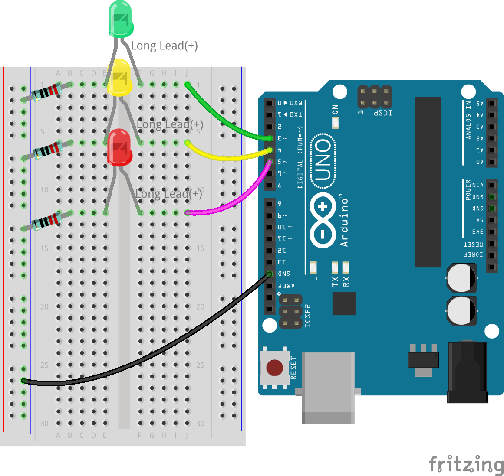
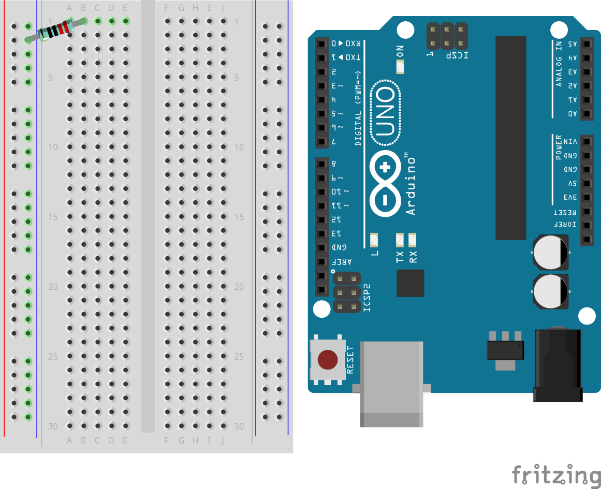
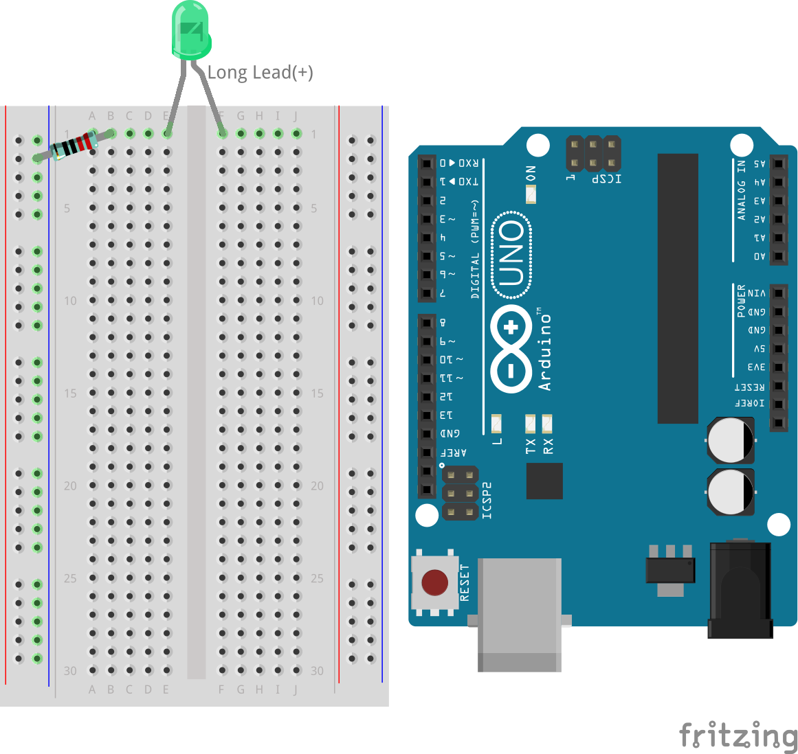
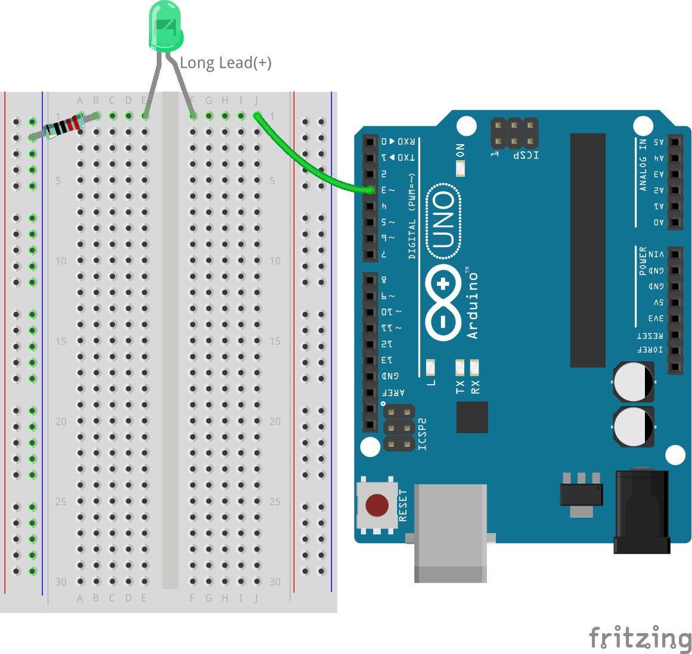
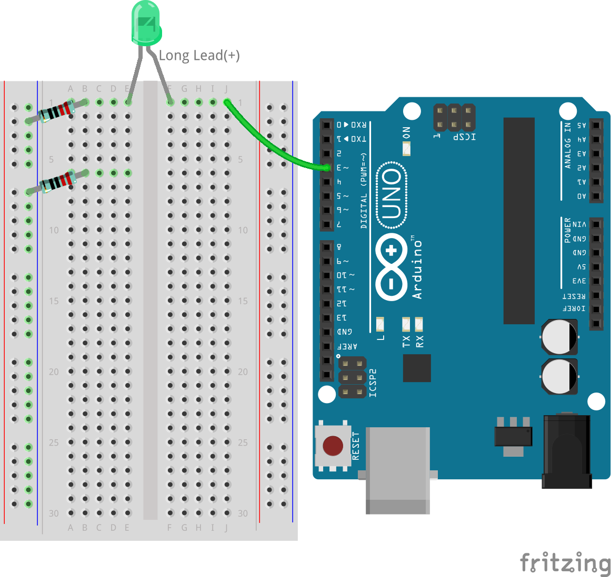
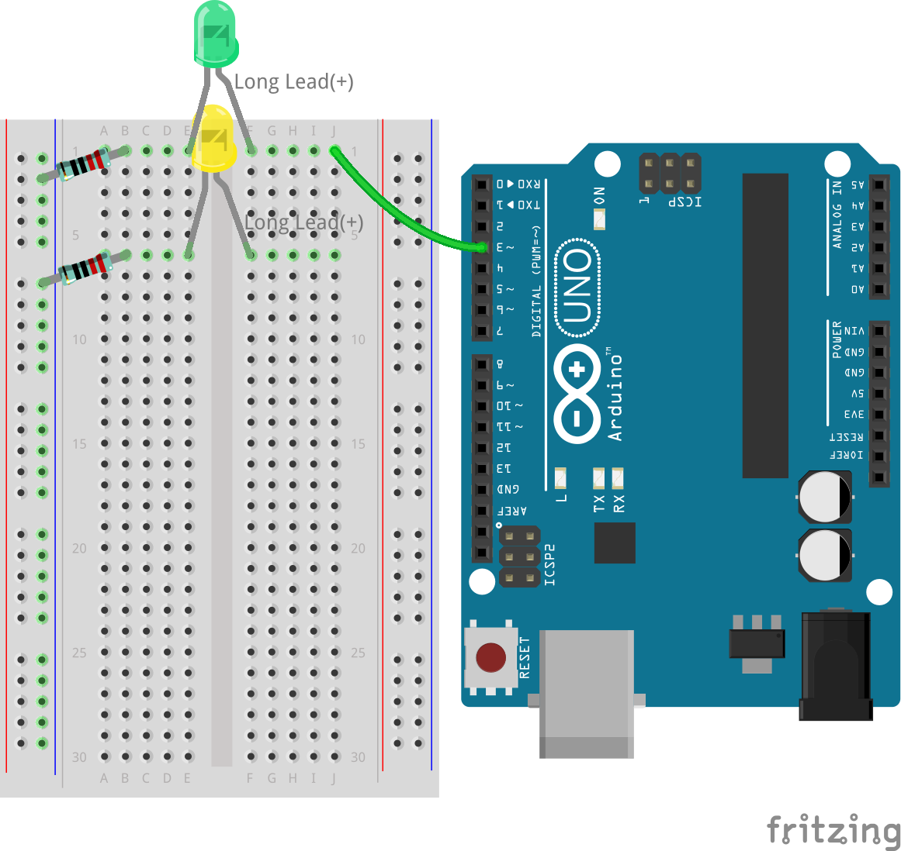
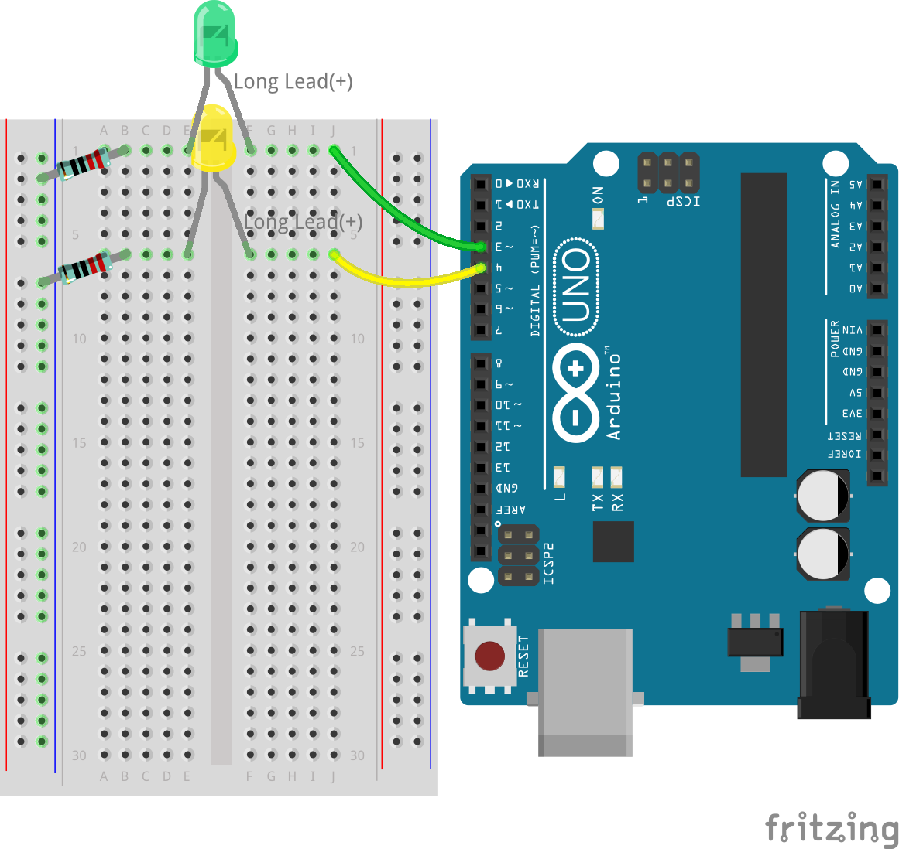
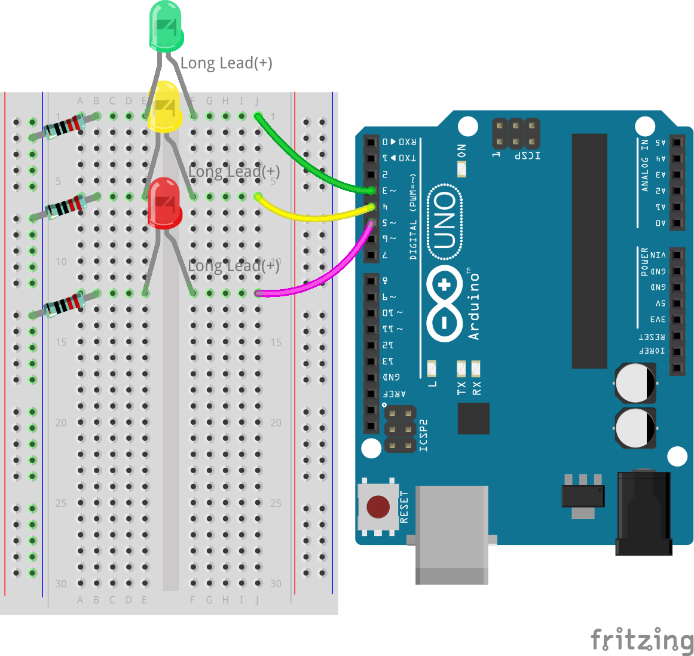

.. note::

    Hello, welcome to the SunFounder Raspberry Pi & Arduino & ESP32 Enthusiasts Community on Facebook! Dive deeper into Raspberry Pi, Arduino, and ESP32 with fellow enthusiasts.

    **Why Join?**

    - **Expert Support**: Solve post-sale issues and technical challenges with help from our community and team.
    - **Learn & Share**: Exchange tips and tutorials to enhance your skills.
    - **Exclusive Previews**: Get early access to new product announcements and sneak peeks.
    - **Special Discounts**: Enjoy exclusive discounts on our newest products.
    - **Festive Promotions and Giveaways**: Take part in giveaways and holiday promotions.

    👉 Ready to explore and create with us? Click [|link_sf_facebook|] and join today!

7. Let's Make Traffic Lights!
==============================

.. .. image:: img/5_traffic_light_pic.png
..     :width: 400
..     :align: center

Welcome to this lesson, this engaging lesson bridges the gap between theoretical concepts and practical application in electronics and programming. We will delve into the process of converting pseudo-code—a simplified form of programming language—into functional Arduino sketches. This exercise will simulate the operations of traffic lights, offering you hands-on experience in programming and circuit design. As you learn to interpret and implement pseudo-code, you will gain deeper insights into the logic behind controlling electronic devices with code.

.. raw:: html

    <video width="600" loop autoplay muted>
        <source src="_static/video/7_traffic_light.mp4" type="video/mp4">
        Your browser does not support the video tag.
    </video>

In this lesson, you will learn to:

* Learn to write and interpret pseudo-code for planning electronic circuit functionality.
* Convert pseudo-code into Arduino sketches to control traffic light simulations.
* Build and program a traffic light system using LEDs and an Arduino board.

By mastering these skills, you'll be equipped to design, program, and troubleshoot basic electronic systems, paving the way for more complex projects.

Getting Traffic Lights Ready
------------------------------------------
Hey there! Ready to create your very own traffic light with an Arduino? Here's what we need:

**Components Needed**

.. list-table:: 
   :widths: 25 25 25 25
   :header-rows: 0

   * - 1 * Arduino Uno R3
     - 1 * Red LED
     - 1 * Yellow LED
     - 1 * Green LED
   * - |components_uno_r3| 
     - |components_red_led| 
     - |components_yellow_led| 
     - |components_green_led| 
   * - 1 * USB Cable
     - 1 * Breadboard
     - 3 * 220Ω Resistor
     - Jumper Wires
   * - |components_usb_cable| 
     - |components_breadboard| 
     - |components_220ohm| 
     - |components_wire| 

**Building Step-by-Step**

Let's put everything together, just like building a LEGO set!

1. Connect a 220Ω resistor to the breadboard. One end should be in the negative terminal, and the other end should be in hole 1B.

2. Add a Green LED to the breadboard. The LED's anode (long lead) should be in hole 1F. The cathode (short leg) should be in hole 1E.

3. Connect the green LED to pin 3 of the Arduino Uno R3 with a wire. Insert a jumper wire in hole 1J and the other end of the jumper wire into pin 3 of the Arduino Uno R3.

4. Take another 220Ω resistor, connect one end to the negative terminal and the other end to hole 6B.

5. Take a Yellow LED. The LED's anode (long Lead) should be in hole 6F. The cathode (short lead) should be in hole 6E.

6. Connect the yellow LED to pin 4 of the Arduino Uno R3.

7. Connect the red LED in the same way, the red LED is connected to pin 5 of the Arduino Uno R3.

8. Oops! We almost forgot to ground the circuit. Connect the breadboard's negative side to a GND pin on the Arduino Uno R3 with a black wire. Now, it's all set!

.. note::

    There are three GND pins on the Arduino Uno R3. You can use any of them; they all work the same way.

And just like that, you've got a complete traffic light setup! Each colored light is controlled by its own switch on the R3, ready to tell cars when to stop, wait, or go. Isn't it awesome to build something that works like real traffic lights? Great job!

Writing Pseudo-code for a Traffic Light
-------------------------------------------

It's time to give your LEDs a purpose. In this activity, you will program them to act as a traffic light, controlling the flow of traffic at a busy intersection.

Traffic lights require precise control to switch between three colors in a strict sequence, making it an ideal project for diving into Arduino programming. To perfect our traffic light, we must clearly instruct the Arduino on its tasks.

Communication between humans involves listening, speaking, reading, writing, gesturing, or making facial expressions. Communicating with microcontrollers (like the one on your Arduino board) involves writing code.

We can't simply tell the Arduino to "make a traffic light" in natural language. However, we can use natural language to write a "pseudo-code" to aid in the actual Arduino code development.

.. note::
    
    There are no right or wrong answers in pseudo-code writing. The more detailed your pseudo-code, the easier it will be to translate it into a functional program.

Think about what needs to happen for your circuit to act like a traffic light. In the space provided in your log, write down the pseudo-code describing how your traffic light will function. Use plain English.

Here are some guiding questions for your pseudo-code:

* Should two or more lights be on at the same time?
* What's the order of the lights?
* What happens to the other lights when one is on?
* What happens after the third light turns off?
* How long should each light stay on?

Here are a couple of pseudo-code examples:

.. code-block::

    1) Set all LED pins to output.
    2) Start main loop.
    a) Turn off all lights.
    b) Turn on green light for 10 seconds.
    c) Turn off all lights.
    d) Turn on yellow light for 3 seconds.
    e) Turn off all lights.
    f) Turn on red light for 10 seconds.
    3) Return to the start of the loop.

.. code-block::

    Setup:
        Define all LED pins as output
    Main Loop:
        Turn on green light
        Turn off red and yellow lights
        Wait 10 seconds
        Turn on yellow light
        Turn off red and green lights
        Wait 3 seconds
        Turn on red light
        Turn off green and yellow lights
        Wait 10 seconds

Pseudo-code doesn't have a strict format, allowing you to clarify your thoughts and organize them logically. This logical order is called an algorithm.
You use algorithms every day, perhaps without realizing it. Think of an algorithm like a recipe; in programming, the ingredients are keywords and commands, and the cooking steps are the algorithm.
An algorithm is a set of steps or instructions. When an algorithm is translated from pseudo-code into Arduino programming language, it precisely instructs the Arduino board on what to do and when.

.. note::
    
    Using sticky notes or index cards can be helpful when writing pseudo-code. Place each step of your algorithm on a separate note. This way, you can easily rearrange, insert, or remove steps from your algorithm.

Transform Pseudo-code into an Arduino Sketch
----------------------------------------------

It's time to refine the code you've written and add additional ``digitalWrite()`` and ``delay()`` commands as needed. Here's a guide to structuring your code: Your ``void loop()`` function should encapsulate separate segments for the green, yellow, and red LEDs, each followed by a unique delay period. Not all delays need to be of equal duration. Update your code comments for clarity on what each line achieves.

1. Open the sketch you saved earlier, ``Lesson6_Blink_LED``. Hit “Save As...” from the “File” menu, and rename it to ``Lesson7_Traffic_Light``. Click "Save".

2. Now, according to our pseudo-code, set all three pins to output in the ``void setup()``. Copy the ``pinMode()`` command twice, paste it below, and adjust the pin numbers for each.

    .. code-block:: Arduino
        :emphasize-lines: 4,5

        void setup() {
            // Setup code here, to run once:
            pinMode(3, OUTPUT); // set pin 3 as output
            pinMode(4, OUTPUT); // set pin 4 as output
            pinMode(5, OUTPUT); // set pin 5 as output
        }

3. In ``void loop()``, first turn on the green LED and turn off the other two LEDs. So, copy the ``digitalWrite()`` commands twice and modify the pin numbers to 4 and 5, changing ``HIGH`` to ``LOW`` for the LEDs you want to turn off, and update the comments to suit the current scenario. Modified code is as follows:

    .. code-block:: Arduino
        :emphasize-lines: 4,5

        void loop() {
            // put your main code here, to run repeatedly:
            digitalWrite(3, HIGH);  // Light up the LED on pin 3
            digitalWrite(4, LOW);   // Switch off the LED on pin 4
            digitalWrite(5, LOW);   // Switch off the LED on pin 5
            delay(3000);           // Wait for 3 seconds
        }

4. You might want the green LED to be on longer. In our traffic system, it might be about a minute, but here we'll simulate it with 10 seconds.

    .. code-block:: Arduino
        :emphasize-lines: 6

        void loop() {
            // put your main code here, to run repeatedly:
            digitalWrite(3, HIGH);  // Light up the LED on pin 3
            digitalWrite(4, LOW);   // Switch off the LED on pin 4
            digitalWrite(5, LOW);   // Switch off the LED on pin 5
            delay(10000);           // Wait for 10 seconds
        }

5. Now let the yellow LED light up, and turn off the other two LEDs. Again, copy and paste the 4 lines from ``void loop()``, setting pin 4 to HIGH and the others to LOW. Change the delay for the yellow LED to 3 seconds.

    .. code-block:: Arduino
        :emphasize-lines: 7-10

        void loop() {
            // put your main code here, to run repeatedly:
            digitalWrite(3, HIGH);  // Light up the LED on pin 3
            digitalWrite(4, LOW);   // Switch off the LED on pin 4
            digitalWrite(5, LOW);   // Switch off the LED on pin 5
            delay(10000);           // Wait for 10 seconds
            digitalWrite(3, LOW);   // Switch off the LED on pin 3
            digitalWrite(4, HIGH);  // Light up the LED on pin 4
            digitalWrite(5, LOW);   // Switch off the LED on pin 5
            delay(3000);            // Wait for 3 seconds
        }

6. Finally, let the red LED light up for 10 seconds, turning the other two LEDs off. Your complete code is as follows:

    .. code-block:: Arduino

        void setup() {
            // Setup code here, to run once:
            pinMode(3, OUTPUT); // set pin 3 as output
            pinMode(4, OUTPUT); // set pin 4 as output
            pinMode(5, OUTPUT); // set pin 5 as output
        }
        
        void loop() {
            // put your main code here, to run repeatedly:
            digitalWrite(3, HIGH);  // Light up the LED on pin 3
            digitalWrite(4, LOW);   // Switch off the LED on pin 4
            digitalWrite(5, LOW);   // Switch off the LED on pin 5
            delay(10000);           // Wait for 10 seconds
            digitalWrite(3, LOW);   // Switch off the LED on pin 3
            digitalWrite(4, HIGH);  // Light up the LED on pin 4
            digitalWrite(5, LOW);   // Switch off LED on pin 5
            delay(3000);            // Wait for 3 seconds
            digitalWrite(3, LOW);   // Switch off the LED on pin 3
            digitalWrite(4, LOW);   // Switch off the LED on pin 4
            digitalWrite(5, HIGH);  // Light up LED on pin 5
            delay(10000);           // Wait for 10 seconds
        }

**Summary**

Congratulations on completing Lesson 7! You've successfully translated pseudo-code into a fully functional Arduino-controlled traffic light system. Here's a brief recap of what you achieved:

* Pseudo-code Mastery: You've mastered the use of pseudo-code to outline electronic system operations, enhancing your logical thinking and planning skills.
* From Pseudo-code to Real Code: You experienced how a structured approach in pseudo-code leads to effective and accurate Arduino programming.
* Practical Application: By assembling and programming a traffic light system, you demonstrated practical application of your knowledge, showing how software directly controls hardware.

This lesson has sharpened both your technical abilities and analytical thinking, equipping you for more complex projects in electronics and programming. Keep building on these skills to unlock further possibilities in technology integration!

**Question**

Take a look at the intersections around your home. How many traffic lights are there usually? How do they coordinate with each other?