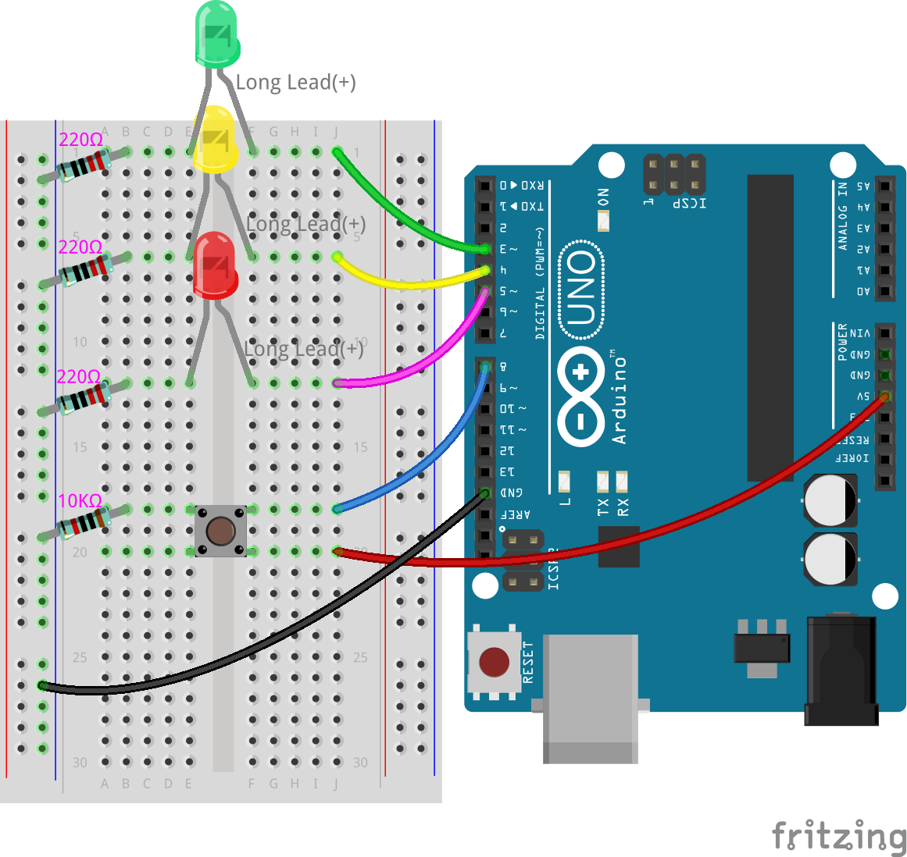
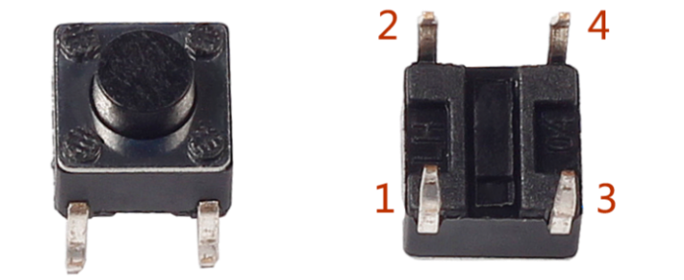
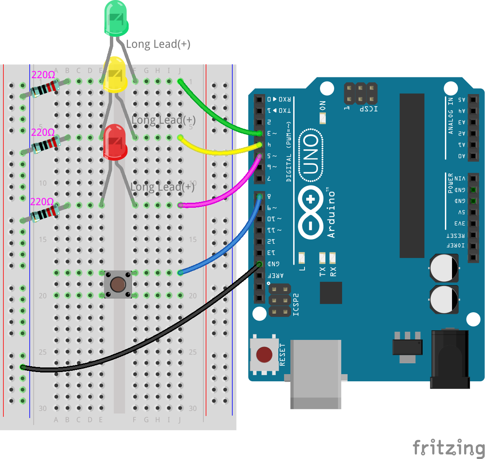
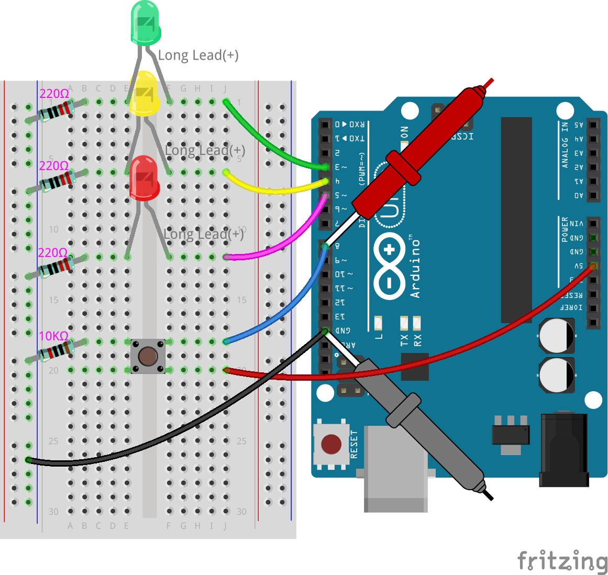
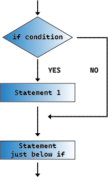

.. note::

    Hello, welcome to the SunFounder Raspberry Pi & Arduino & ESP32 Enthusiasts Community on Facebook! Dive deeper into Raspberry Pi, Arduino, and ESP32 with fellow enthusiasts.

    **Why Join?**

    - **Expert Support**: Solve post-sale issues and technical challenges with help from our community and team.
    - **Learn & Share**: Exchange tips and tutorials to enhance your skills.
    - **Exclusive Previews**: Get early access to new product announcements and sneak peeks.
    - **Special Discounts**: Enjoy exclusive discounts on our newest products.
    - **Festive Promotions and Giveaways**: Take part in giveaways and holiday promotions.

    👉 Ready to explore and create with us? Click [|link_sf_facebook|] and join today!

8. Traffic Light with Pedestrian Button
===============================================

Welcome to the next phase of our Arduino journey. In the previous lesson, we built a foundational traffic light system, a staple of our roads, controlling the flow with red, yellow, and green lights. Now, we're adding a layer of interaction that reflects real-world complexities: a pedestrian button. This feature introduces a human element to our electronic crossroads, allowing for a dynamic interplay between the walkways and roadways at our busy intersections. 

.. raw:: html

    <video width="600" loop autoplay muted>
        <source src="_static/video/8_traffic_light_button.mp4" type="video/mp4">
        Your browser does not support the video tag.
    </video>

In this lesson, you will learn to:

* Understand how button work and their role in circuits.
* Learn to use ``digitalRead()`` to detect pin input levels.
* Implement ``if`` statements to create conditional behaviors in traffic light systems.

As we delve into this project, we'll explore not just the technical setup but also the logic and programming that make such systems both possible and efficient in managing pedestrian and vehicle traffic.

Building the Circuit
-----------------------------

**Components Needed**

.. list-table:: 
   :widths: 25 25 25 25
   :header-rows: 0

   * - 1 * Arduino Uno R3
     - 1 * Red LED
     - 1 * Yellow LED
     - 1 * Green LED
   * - |list_uno_r3| 
     - |list_red_led| 
     - |list_yellow_led| 
     - |list_green_led| 
   * - 1 * Push Button
     - 1 * Breadboard
     - 3 * 220Ω Resistor
     - 1 * 10K Ohm Resistor
   * - |list_button| 
     - |list_breadboard| 
     - |list_220ohm| 
     - |list_10kohm| 
   * - 1 * USB Cable
     - Jumper Wires
     - 1 * Multimeter
     - 
   * - |list_usb_cable| 
     - |list_wire| 
     - |list_meter|
     - 

**Building Step-by-Step**

Follow the wiring diagram, or the steps below to build your circuit.

1. Start with the traffic light circuit from the previous lesson.

.. image:: img/7_traffic_light.png
    :width: 600
    :align: center

2. Find a push button. 

Buttons are ubiquitous components in electronics, acting as switches to make or break circuits. Below is the internal structure of a button, with its common symbol used in circuit diagrams.

.. image:: img/8_traffic_button_symbol.png
    :width: 500
    :align: center

Though buttons have four pins, pins 1 and 2 are connected, as are pins 3 and 4. Pressing the button connects all four pins, closing the circuit.

3. Insert the button into the breadboard across the middle notch, with pins in holes 18e, 18f, 20e, and 20f. 

.. note::

    If you're unsure how to insert the button, try both orientations. One way, the pin spacing will be slightly too narrow to fit.

.. image:: img/8_traffic_light_button_button.png
    :width: 600
    :align: center

4. Connect the button's top-right pin to digital pin 8 on the Arduino Uno R3 with a long jumper wire, inserting one end into hole 18j and the other into pin 8.

5. Place a 10K Ohm resistor between the button's top-left pin and ground, connecting one end to hole 18a and the other to the breadboard's negative rail. This resistor pulls pin 8 to ground, stabilizing it at LOW when the button is not pressed.

    .. image:: img/8_traffic_light_button_10k.png
        :width: 600
        :align: center

Pin 8 serves as an input to read the button's state. Arduino boards read voltages between 0 and approximately 5 volts at input pins, interpreting them as either LOW or HIGH based on a threshold voltage. For a pin to read as HIGH, it must have over 3 volts. To read as LOW, it must have less than 1.5 volts.

If without the 10K resistor, pin 8 connects only to the button, floating between 0 and 5V, causing its state to fluctuate randomly between HIGH and LOW.

The 10K resistor connected from pin 8 to ground pulls the pin's voltage down to ground level, ensuring it reads as LOW when the button is unpressed.

6. Lastly, power the button by connecting the breadboard's positive rail to the Arduino Uno R3's 5V pin with a red power wire.

**Question:**

Your traffic light is a mix of series and parallel circuits. Discuss which parts of your circuit are in series and why. Then, explain which parts are in parallel and why.

Code Creation
----------------

**Initializing Pins**

So far, you've programmed the traffic lights to sequentially flash green, yellow, and red LEDs. In this lesson, you'll program your pedestrian button so that when pressed, the red and yellow LEDs turn off while the green LED flashes, indicating it's safe for pedestrians to cross.

1. Open the sketch you saved earlier, ``Lesson7_Traffic_Light``. Hit "Save As..." from the "File" menu, and rename it to ``Lesson8_Traffic_Light_Button``. Click "Save".

2. In the ``void setup()`` function, add another ``pinMode()`` command to declare pin 8 as input (``INPUT``). Then, add a code comment to explain your new command.

.. code-block:: Arduino
    :emphasize-lines: 6

    void setup() {
        // Setup code here, to run once:
        pinMode(3, OUTPUT); // Set pin 3 as output
        pinMode(4, OUTPUT); // Set pin 4 as output
        pinMode(5, OUTPUT); // Set pin 5 as output
        pinMode(8, INPUT);  // Declare pin 8 (button) as input
    }
    
    void loop() {
        // put your main code here, to run repeatedly:
        digitalWrite(3, HIGH);  // Light up the LED on pin 3
        digitalWrite(4, LOW);   // Switch off the LED on pin 4
        digitalWrite(5, LOW);   // Switch off the LED on pin 5
        delay(10000);           // Wait for 10 seconds
        digitalWrite(3, LOW);   // Switch off the LED on pin 3
        digitalWrite(4, HIGH);  // Light up the LED on pin 4
        digitalWrite(5, LOW);   // Switch off LED on pin 5
        delay(3000);            // Wait for 3 seconds
        digitalWrite(3, LOW);   // Switch off the LED on pin 3
        digitalWrite(4, LOW);   // Switch off the LED on pin 4
        digitalWrite(5, HIGH);  // Light up LED on pin 5
        delay(10000);           // Wait for 10 seconds
    }

3. After coding, verify your sketch and upload the code to the Arduino Uno R3.

**Measuring Voltage at Pin 8**

We already know how the LEDs section of our circuit works from the previous lesson. Each LED, acting as an output, is controlled by different pins on the Arduino Uno R3.

However, the button connected to pin 8 on the board is different. It's an input device. Pin 8 will read incoming voltage instead of sending voltage out.

Let's use a multimeter to test the voltage at pin 8 when the button is pressed and released. You might need a friend to help press the button for this measurement.

1. Adjust the multimeter to the 20 volts DC setting.

.. image:: img/multimeter_dc_20v.png
    :width: 300
    :align: center

2. When the button is not pressed, measure the voltage at pin 8. Touch the red test lead of the multimeter to pin 8 and the black test lead to GND.

3. Record the measured voltage in the table.

.. list-table::
   :widths: 25 25 25
   :header-rows: 1

   * - Button State
     - Pin 8 Voltage
     - State
   * - Release
     - *0.00 volts*
     - 
   * - Press
     -
     - 

4. Have your friend help you press the button, then continue measuring the voltage at pin 8.

5. When the button is pressed, record the voltage at pin 8 in the table.

.. list-table::
   :widths: 25 25 25
   :header-rows: 1

   * - Button State
     - Pin 8 Voltage
     - State
   * - Release
     - *0.00 volts*
     - 
   * - Press
     - *≈4.97 volts*
     - 

6. Arduino boards read voltages between 0 and approximately 5 volts at input pins, interpreting them as either ``LOW`` or ``HIGH`` based on a threshold voltage. For a pin to read as ``HIGH``, it must have over 3 volts. To read as ``LOW``, it must have less than 1.5 volts.

   Based on the measured voltage, fill in the state for pin 8.

.. list-table::
   :widths: 25 25 25
   :header-rows: 1

   * - Button State
     - Pin 8 Voltage
     - Pin 8 State
   * - Release
     - *0.00 volts*
     - *LOW*
   * - Press
     - *≈4.97 volts*
     - *HIGH*

**Conditional Statements**

The traffic light should display two different behaviors depending on whether the button is pressed:

* When the button is pressed, the code for the pedestrian crossing should run, and the green LED should blink.
* When the button is not pressed, the traffic light should operate normally as you've programmed.

To program these behaviors, you'll use a new coding function known as conditional statements.

Conditional statements are sometimes called ``if-then`` statements, or simply, an ``if`` statement.
Conditional statements allow you to run certain lines of code when a specific condition or scenario is true.

.. note::

    You often use conditional statements in everyday life to make decisions, such as:

    .. code-block:: Arduino

        start;
        if cold;
        then wear a coat;
        end;
        
In the Arduino IDE, a conditional statement looks like this:

    .. code-block:: Arduino

        if (condition) {
            commands to run when the condition is true 
        }

The ``condition`` is within parentheses, using comparison operators to compare two or more values. These values can be numbers, variables, or inputs coming into the Arduino Uno R3.

Here's a list of comparison operators and how they're used in the condition part of an if statement:

.. list-table::
    :widths: 20 20 60
    :header-rows: 1

    *   - Comparison Operator
        - Meaning
        - Example
    *   - ==
        - Equals
        - if (digitalRead(8) == HIGH) {do something}
    *   - !=
        - Not equal
        - if (digitalRead(5) != LOW) {do something}
    *   - <
        - Less than
        - if (distance < 100) {do something}
    *   - >
        - Greater than
        - if (count > 5) {do something}
    *   - <=
        - Less than or equal to
        - if (number <= minValue) {do something}
    *   - >=
        - Greater than or equal to
        - if (number >= maxValue) {do something}

.. note::

    The equality comparison uses two equals signs(``==``). A single equals sign (``=``) is used for assigning a value to a variable (explained in later sections), while double equals are used for comparing two values.

When comparing two values in a condition, the result can be ``True`` or ``False``. If the condition is ``True``, then the commands within the curly brackets are executed. If the condition is ``False``, then the commands within the curly brackets are skipped.

In coding, conditional statements can be simple or involve complex logical arguments with multiple conditions and scenarios. You'll be using the basic form of ``if`` statements next.

**Button Not Pressed**

Building on our understanding of conditional statements, let's apply this concept to enhance our traffic light sketch. Given that a button's press alters the flow of traffic, we'll incorporate a condition to monitor the button's state. 

1. From our earlier measurements of pin 8's voltage, we know that when the button is not pressed, pin 8 is ``LOW``. So, if the state of pin 8 read is ``LOW``, it means it's not pressed. Now, at the beginning of the ``void loop()`` function in your previous code, enter the following statement:

    .. code-block:: Arduino
        :emphasize-lines: 11,13

        void setup() {
            // Setup code here, to run once:
            pinMode(3, OUTPUT); // Set pin 3 as output
            pinMode(4, OUTPUT); // Set pin 4 as output
            pinMode(5, OUTPUT); // Set pin 5 as output
            pinMode(8, INPUT);  // Declare pin 8 (button) as input
        }

        void loop() {
            // put your main code here, to run repeatedly:
            if (digitalRead(8) == LOW) {
                
            }

            digitalWrite(3, HIGH);  // Light up the LED on pin 3
            digitalWrite(4, LOW);   // Switch off the LED on pin 4
            digitalWrite(5, LOW);   // Switch off the LED on pin 5

            ...

Just like the ``digitalWrite()`` command is used for output pins, the ``digitalRead()`` command is used for input pins. ``digitalRead(pin)`` is the command to read if a digital pin is ``HIGH`` or ``LOW``.

Here is its syntax:

    * ``digitalRead(pin)``: Reads the value from a specified digital pin, either ``HIGH`` or ``LOW``.

        **Parameters**
            - ``pin``: the Arduino pin number you want to read
        
        **Returns**
            ``HIGH`` or ``LOW``

2. Next, add the commands to run when the button is not pressed. These commands are the ones you've already created for running the normal traffic light.

    * You can cut and paste these commands inside the curly brackets of the ``if`` statement,
    * Or, you could simply move the right curly bracket of the ``if`` statement to after the last delay.
    * Use whichever method suits you. After doing so, your ``void loop()`` function should look something like this:

.. code-block:: Arduino
    :emphasize-lines: 11,24

    void setup() {
        // Setup code here, to run once:
        pinMode(3, OUTPUT); // Set pin 3 as output
        pinMode(4, OUTPUT); // Set pin 4 as output
        pinMode(5, OUTPUT); // Set pin 5 as output
        pinMode(8, INPUT);  // Declare pin 8 (button) as input
    }

    void loop() {
        // put your main code here, to run repeatedly:
        if (digitalRead(8) == LOW) {
            digitalWrite(3, HIGH);  // Light up the LED on pin 3
            digitalWrite(4, LOW);   // Switch off the LED on pin 4
            digitalWrite(5, LOW);   // Switch off the LED on pin 5
            delay(10000);           // Wait for 10 seconds
            digitalWrite(3, LOW);   // Switch off the LED on pin 3
            digitalWrite(4, HIGH);  // Light up the LED on pin 4
            digitalWrite(5, LOW);   // Switch off LED on pin 5
            delay(3000);            // Wait for 3 seconds
            digitalWrite(3, LOW);   // Switch off the LED on pin 3
            digitalWrite(4, LOW);   // Switch off the LED on pin 4
            digitalWrite(5, HIGH);  // Light up LED on pin 5
            delay(10000);           // Wait for 10 seconds
        }
    }

Notice how the commands within the ``if`` statement are indented. Using indentation helps keep your code tidy and clarifies the commands being executed within a function. Although it might take a few extra seconds, using indentation, line breaks, and code comments can maintain the aesthetics of your code, which will be beneficial in the long run.

A common syntax error is forgetting the required number of curly brackets. Sometimes, the right bracket is missed in a function, or too many right brackets are added. In your sketch, every left bracket needs a right bracket. Proper indentation also helps you troubleshoot mismatched brackets.

**When the Button Is Pressed**

Now it's time to write the code that allows pedestrians to cross the street when the button is pressed.

This will require a second conditional statement. However, this time you'll need to compare the ``digitalRead()`` value of pin 8 to ``HIGH`` instead of ``LOW``.

When the button is pressed, the traffic light needs to stop all vehicles and signal that it's safe for pedestrians to cross. To achieve this, you'll turn off the red and yellow LEDs and make the green LED blink. Within the curly brackets of your second conditional statement, add three ``digitalWrite()`` commands:

* Turn on the green LED connected to pin 3.
* Turn off the yellow LED connected to pin 4.
* Turn off the red LED connected to pin 5.

Then, make the green LED blink. Remember, the blinking frequency is determined by your ``delay()`` statements.

Your sketch should look something like this:

.. code-block:: Arduino
    :emphasize-lines: 24-31

    void setup() {
        pinMode(3, OUTPUT);  // declare pin 3 (green LED) as output
        pinMode(4, OUTPUT);  // declare pin 4 (yellow LED) as output
        pinMode(5, OUTPUT);  // declare pin 5 (red LED) as output
        pinMode(8, INPUT);   // declare pin 8 (button) as input
    }

    void loop() {
        // Main code to run repeatedly:
        if (digitalRead(8) == LOW) {
            digitalWrite(3, HIGH);  // Light up the LED on pin 3
            digitalWrite(4, LOW);   // Switch off the LED on pin 4
            digitalWrite(5, LOW);   // Switch off the LED on pin 5
            delay(10000);           // Wait for 10 seconds
            digitalWrite(3, LOW);   // Switch off the LED on pin 3
            digitalWrite(4, HIGH);  // Light up the LED on pin 4
            digitalWrite(5, LOW);   // Switch off LED on pin 5
            delay(3000);            // Wait for 3 seconds
            digitalWrite(3, LOW);   // Switch off the LED on pin 3
            digitalWrite(4, LOW);   // Switch off the LED on pin 4
            digitalWrite(5, HIGH);  // Light up LED on pin 5
            delay(10000);           // Wait for 10 seconds
        }
        if (digitalRead(8) == HIGH) {  //if the button is pressed:
            digitalWrite(3, HIGH);       // Light up the LED on pin 3
            digitalWrite(4, LOW);        // Switch off the LED on pin 4
            digitalWrite(5, LOW);        // Switch off the LED on pin 5
            delay(500);                  // Wait half a second
            digitalWrite(3, LOW);        // Switch off the LED on pin 3
            delay(500);                  // Wait half a second
        }
    }

Upload your code to the Arduino Uno R3. Once the sketch is fully transferred, the code will execute.

Observe the behavior of your traffic light. Press the button and wait for the traffic light to complete its cycle. Does the pedestrian green light blink? When the button is released, does the traffic light return to its normal operation mode? If not, make adjustments to your sketch and re-upload it to the R3.

Once completed, save your sketch.

**Summary**

In this lesson, we've delved into integrating a pedestrian button into a traffic light system, simulating a real-world scenario that balances the flow of both pedestrian and vehicular traffic. We explored the workings of a button in an electronic circuit and utilized the ``digitalRead()`` function to monitor input from the button. By implementing conditional statements with ``if`` structures, we programmed the traffic lights to respond dynamically to pedestrian input, enhancing our understanding of interactive systems. This lesson not only reinforced our skills in Arduino programming but also highlighted the practical application of these technologies in managing everyday situations efficiently.

**Question:**

During testing, you may notice that the green LED only blinks while the pedestrian button is kept pressed, 
but pedestrians can’t cross the road while continuously pressing the button. How can you modify the code to ensure that once the pedestrian button is pressed, 
the green LED lights up long enough for a safe crossing without requiring continuous pressing? Please write down the pseudo-code solution in your handbook.