.. note::

    Hello, welcome to the SunFounder Raspberry Pi & Arduino & ESP32 Enthusiasts Community on Facebook! Dive deeper into Raspberry Pi, Arduino, and ESP32 with fellow enthusiasts.

    **Why Join?**

    - **Expert Support**: Solve post-sale issues and technical challenges with help from our community and team.
    - **Learn & Share**: Exchange tips and tutorials to enhance your skills.
    - **Exclusive Previews**: Get early access to new product announcements and sneak peeks.
    - **Special Discounts**: Enjoy exclusive discounts on our newest products.
    - **Festive Promotions and Giveaways**: Take part in giveaways and holiday promotions.

    👉 Ready to explore and create with us? Click [|link_sf_facebook|] and join today!

9. Dimmable Desk Lamp
=============================================

Imagine every desk lamp at home, gently casting light over your evening reads or late-night projects. Have you ever wondered how these lamps manage to adjust their brightness so seamlessly? In this lesson, we dive into the mechanics and electronics behind a desk lamp, transforming curiosity into knowledge as we build one from scratch using Arduino.

.. .. image:: img/9_desk_lamp_pot.jpg
..     :width: 500
..     :align: center

.. raw:: html

    <video width="600" loop autoplay muted>
        <source src="_static/video/9_dimmble_led.mp4" type="video/mp4">
        Your browser does not support the video tag.
    </video>
    
Get ready to:

* Decode the role of variables in storing and manipulating data within Arduino sketches.
* Master reading analog signals with ``analogRead()``.
* Explore PWM through ``analogWrite()`` to fine-tune LED brightness.

By the end of this lesson, not only will you have crafted a fully functional electronic desk lamp, but you'll also have deepened your understanding of how software interacts with hardware to bring everyday objects to life. Let’s illuminate our knowledge by building a desk lamp that responds to your touch.

Build the Circuit
------------------------------------

**Components Needed**

.. list-table:: 
   :widths: 25 25 25 25
   :header-rows: 0

   * - 1 * Arduino Uno R3
     - 1 * Red LED
     - 1 * 220Ω Resistor
     - 1 * Potentiometer
   * - |components_uno_r3| 
     - |components_red_led| 
     - |components_220ohm| 
     - |components_potentiometer| 
   * - 1 * USB Cable
     - 1 * Breadboard
     - Jumper Wires
     - 1 * Multimeter
   * - |components_usb_cable| 
     - |components_breadboard| 
     - |components_wire| 
     - |components_meter|

**Building Steps**

1. Find a Potentiometer.

A potentiometer, often called a pot, serves as a variable resistor, meaning it can adjust its resistance from nearly zero to its maximum limit. Most potentiometers are marked with their range. The one included in your kit is designated as a 103 (10K) potentiometer, which equates to 10 kilo-ohms or 10,000 ohms.

.. image:: img/9_dimmer_pot.png
    :width: 200
    :align: center

Inside the potentiometer is a strip of resistive material with a slider that moves along it. Each end of the resistive material is connected to a terminal or pin, shown below as pins A and B. The resistance between pins A and B is fixed and represents the maximum resistance the potentiometer can offer. For the ones in your kit, the maximum resistance is 10 kilo-ohms.

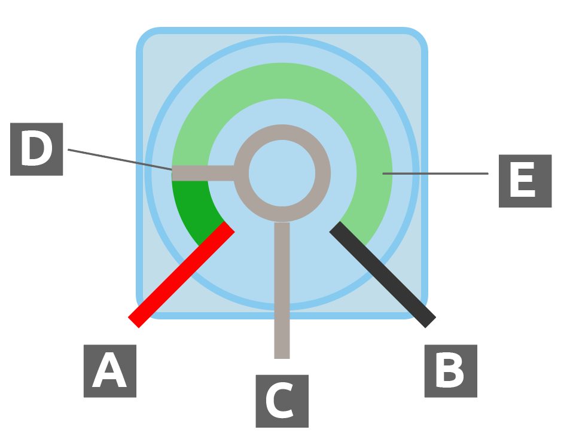

* **A**: Connect to power
* **B**: Connect to ground
* **C**: Connect to analog pin
* **D**: Slider
* **E**: Resistive strip

The Pin C connects to the slider. The resistance through the slider, or Pin C, depends on the slider's position along the resistive material.

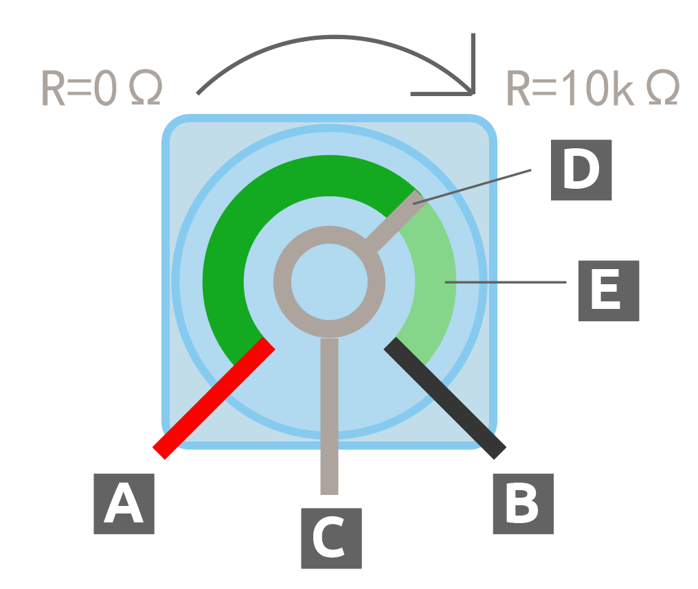

In schematic diagrams, the symbol for a potentiometer typically looks like a resistor with an arrow through the middle.

.. image:: img/9_dimmer_pot_4.png
    :width: 200
    :align: center

Now let's explore how the potentiometer adjusts resistance in a circuit.

2. Connect a potentiometer to the breadboard. Insert its three pins into holes 30G, 29F, 28G.

.. note::
    The potentiometer has a label "P 103", indicating its resistance range. Please insert the potentiometer into the breadboard as shown, with the labeled side facing you.

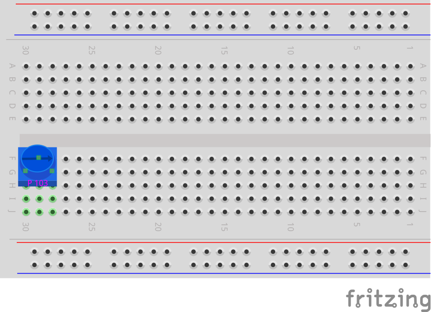

3. To measure the resistance of the potentiometer, you need to insert a wire into 29J and then touch it with the red test lead, and insert another wire into 28J and touch it with the black lead.

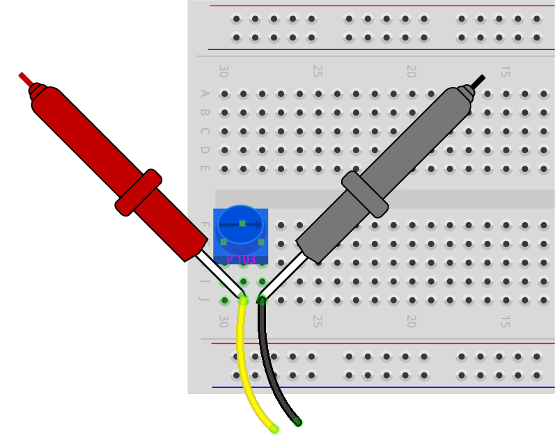

4. Set the multimeter to measure resistance in the 20 kilo-ohm (20K) range.

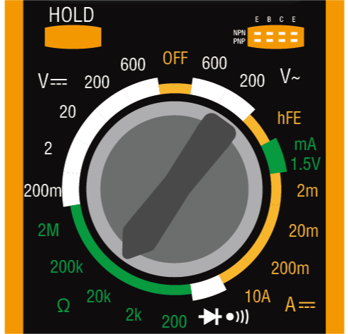

5. Rotate the potentiometer to the "1" position indicated in the diagram.

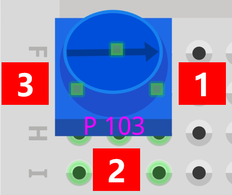
    
6. Record the measured resistance values in the table.

.. note::
    The values in the table are my measurements; your results may vary. Fill them out according to your actual findings.

.. list-table::
   :widths: 20 20
   :header-rows: 1

   * - Measurement Point
     - Resistance (kilohm)
   * - 1
     - *1.52*
   * - 2
     -
   * - 3
     -

7. Rotate the potentiometer clockwise to positions 2 and 3 to measure the resistance at each point, and record the results in the table.

.. list-table::
   :widths: 20 20
   :header-rows: 1

   * - Measurement Point
     - Resistance (kilohm)
   * - 1
     - *1.52*
   * - 2
     - *5.48*
   * - 3
     - *9.01*

From the measurement results:

* As you rotate the potentiometer **clockwise** from position 1 to 3, the resistance between the position 2 and position 1 increases.
* Conversely, rotating **counterclockwise** from position 3 to 1 will decrease the resistance between the position 2 and position 1.

8. Insert the other end of the jumper wire from 28J into the negative terminal of the breadboard.

.. image:: img/9_dimmer_led1_pot_gnd.png
    :width: 500
    :align: center

9. Then, insert the other end of the jumper wire from 29J into the A0 pin of the Arduino Uno R3.

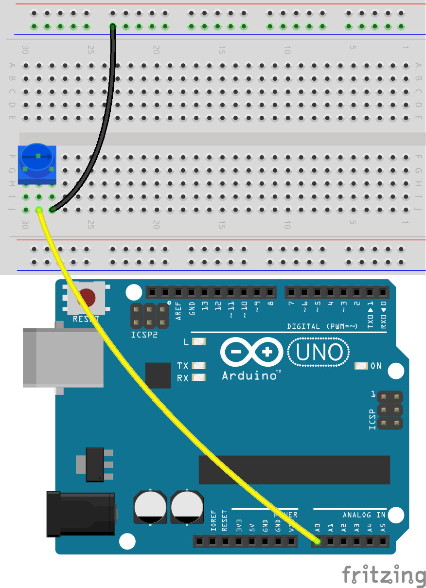

10. Finally, connect the potentiometer to 5V by inserting a jumper wire between hole 30J on the breadboard and the 5V pin on the Arduino Uno R3.

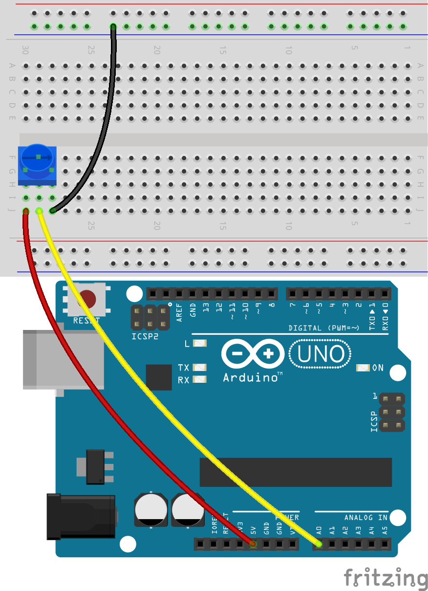

11. Connect the GND pin of the Arduino Uno R3 to the negative terminal of the breadboard using a long jumper wire.

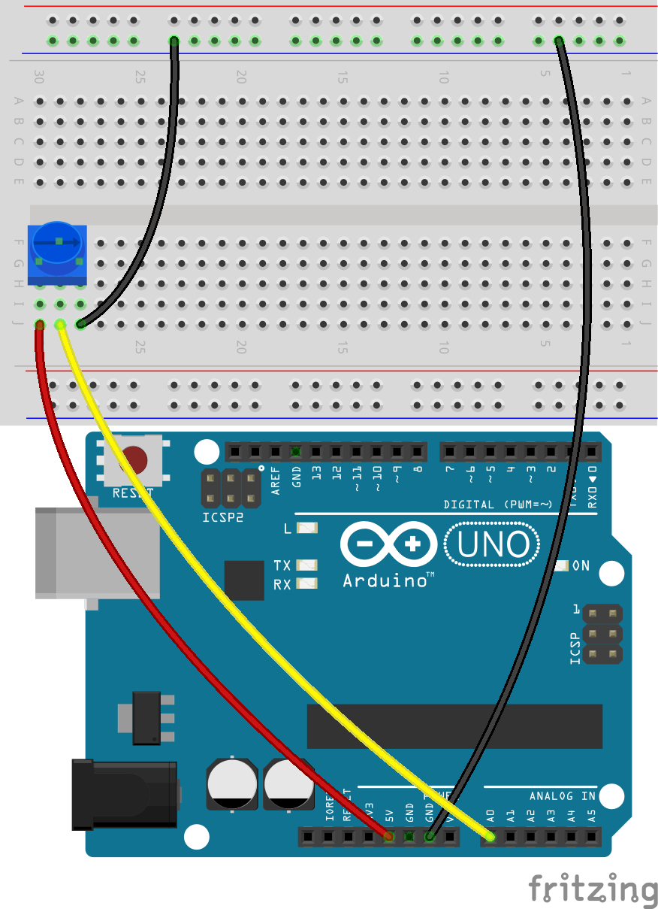

12. Take out an LED. Insert its anode (longer pin) into hole 13A, and its cathode (shorter pin) into the negative terminal of the breadboard.

13. Place a 220 ohms resistor between holes 13E and 13G.

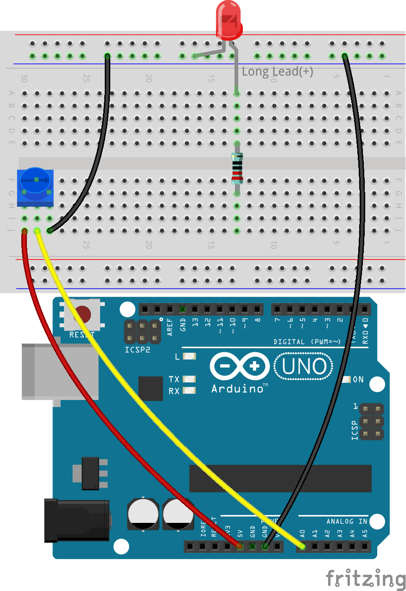

14. Connect the hole 13J on the breadboard to pin 9 on the Arduino Uno R3 with a wire.

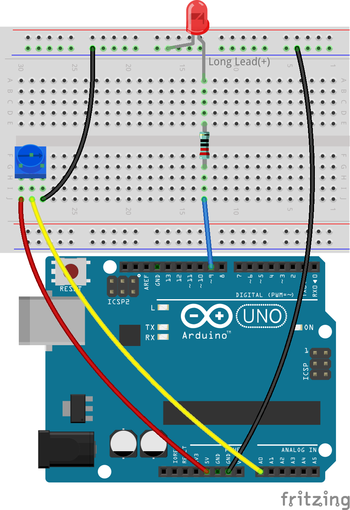

**Question**

How do you think the voltage at A0 would change when the potentiometer is turned clockwise and counterclockwise?

Code Creation
-------------------------------------

In this lesson, we aim to adjust the brightness of the LED based on the rotation of the potentiometer.

Here's what the pseudocode might look like:

.. code-block::

    Create variable to store input information.
    Set a pin as output.
    Begin main loop:
        Store the potentiometer value in a variable.
        Set the LED brightness based on the potentiometer variable.
    End main loop.

**Pin Initialization**

1. Open the Arduino IDE and start a new project by selecting “New Sketch” from the “File” menu.
2. Save your sketch as ``Lesson9_Desk_Lamp`` using ``Ctrl + S`` or by clicking “Save”.

3. The LED in your circuit is connected to digital pin on the Arduino Uno R3, set as output. Remember to add a comment.

.. note::

    The potentiometer is an analog input device connected to the analog pin A0. All analog pins on Arduino are input pins, which means they do not need to be declared as INPUT like digital pins.
    
.. code-block:: Arduino
    :emphasize-lines: 3

    void setup() {
        // put your setup code here, to run once:
        pinMode(9, OUTPUT);  // Set pin 9 as output
    }

    void loop() {
        // put your main code here, to run repeatedly:
    }

**Variable Declaration**

To control the fading of LED using a potentiometer, you need a **variable** to store the value from the potentiometer.

Let's dive into the concept of variables in programming. A variable acts like a container in your program, allowing you to store and later retrieve information.

Before using a variable, it must be declared, which is known as variable declaration.

To declare a variable, you must define its type and name. It is not necessary to assign a value to the variable at the moment of declaration—you can assign it later in your sketch. Here is how you can declare a variable:

.. code-block:: Arduino

    int var;

Here, ``int`` is the data type used for integers, capable of storing values from -32768 to 32767. Variables can store various types of data, including ``float``, ``byte``, ``boolean``, ``char``, and ``string``.

Variable names can be anything you choose, such as ``i``, ``apple``, ``Bruce``, ``R2D2``, or ``Sectumsempra``. However, there are rules for naming:

* Names can include letters, digits, and underscores, but not spaces or special characters like !, #, %, etc.

  .. image:: img/9_variable_name1.png
    :width: 400
    :align: center

* Names must start with a letter or an underscore (_). They cannot begin with a number.

  .. image:: img/9_variable_name2.png
    :width: 400
    :align: center

* Names are case sensitive. ``myCat`` and ``mycat`` would be considered different variables.

* Avoid using keywords that the Arduino IDE recognizes and highlights, like ``int``, which it colors to indicate special significance. If the name turns a color like orange or blue, it's a keyword and should be avoided as a variable name.

The scope of a variable determines where it can be used in your sketch, based on where it is declared. 

* A variable declared outside all functions (i.e., outside any braces) is a global variable and can be used anywhere in your sketch. 
* A variable declared within a function (within a set of braces) is a local variable and can only be used within that function.

.. code-block:: Arduino
    :emphasize-lines: 1,4,9

    int global_variable = 0; // This is a global variable

    void setup() {
        int variable = 0; // This is a local variable
    }

    void loop() {
        int variable = 0; // This is another local variable
    }

.. note::

    Local variables can only be used within the functions where they are declared, meaning you can declare variables with the same name in different functions without issue. However, avoid using the same name for local and global variables to prevent confusion.

Typically, an Arduino sketch should follow a consistent pattern: declare global variables first, then define the ``void setup()`` function, and finally, the ``void loop()`` function.

4. Go to the very start of your sketch, before the ``void setup()`` function. Here you will declare your variable to store value from the potentiometer.

.. code-block:: Arduino
    :emphasize-lines: 1

    int potValue = 0;

    void setup() {
        // put your setup code here, to run once:
        pinMode(9, OUTPUT);  // Set pin 9 as output
    }

    void loop() {
        // put your main code here, to run repeatedly:
    }

You have just declared an integer variable named ``potValue`` and set it to zero. This variable will be used later in your sketch to store the potentiometer's output.

**Reading Analog Values**

You're now ready to enter the main loop of the program. The first thing you'll do in the ``void loop()`` function is determine the value of the potentiometer.

The potentiometer is connected to a 5-volt power pin, allowing the voltage at pin A0 to range from 0 to 5 volts. This voltage is then converted by the Arduino Uno R3's microprocessor into an analog value ranging from 0 to 1023, thanks to the microprocessor's 10-bit resolution.

Once converted, these analog values can be utilized within your program.

To fetch the analog value from the potentiometer, use the ``analogRead(pin)`` command. This command reads the voltage entering an analog pin and maps it to a value between 0 and 1023:

- If there is no voltage, the analog value is 0.
- If the voltage is a full 5 volts, the analog value will be 1023.

Here is how to use it:

    * ``analogRead(pin)``: Reads the value from the specified analog pin. 

    **Parameters**
        - ``pin``: the name of the analog input pin to read from.

    **Returns**
        The analog reading on the pin. Although it is limited to the resolution of the analog to digital converter (0-1023 for 10 bits or 0-4095 for 12 bits). Data type: int.

5. Place the following command inside the void ``loop()`` function to store the analog value from the potentiometer into the ``potValue`` variable declared at the top of your sketch:

.. code-block:: Arduino
    :emphasize-lines: 10

    int potValue = 0;

    void setup() {
        // put your setup code here, to run once:
        pinMode(9, OUTPUT);  // Set pin 9 as output
    }

    void loop() {
        // put your main code here, to run repeatedly:
        potValue = analogRead(A0);        // Read value from potentiometer
    }

Make sure to save and verify your code to correct any errors.

**Writing Analog Values**

The digital pins on the Arduino Uno R3 are capable of either ON or OFF states, meaning they can't output true analog values. To simulate analog behavior for applications like controlling LED brightness, we use a technique called Pulse Width Modulation (PWM). PWM pins, which are marked with a tilde (~) on the board, can vary the perceived output by adjusting the duty cycle of the signal.

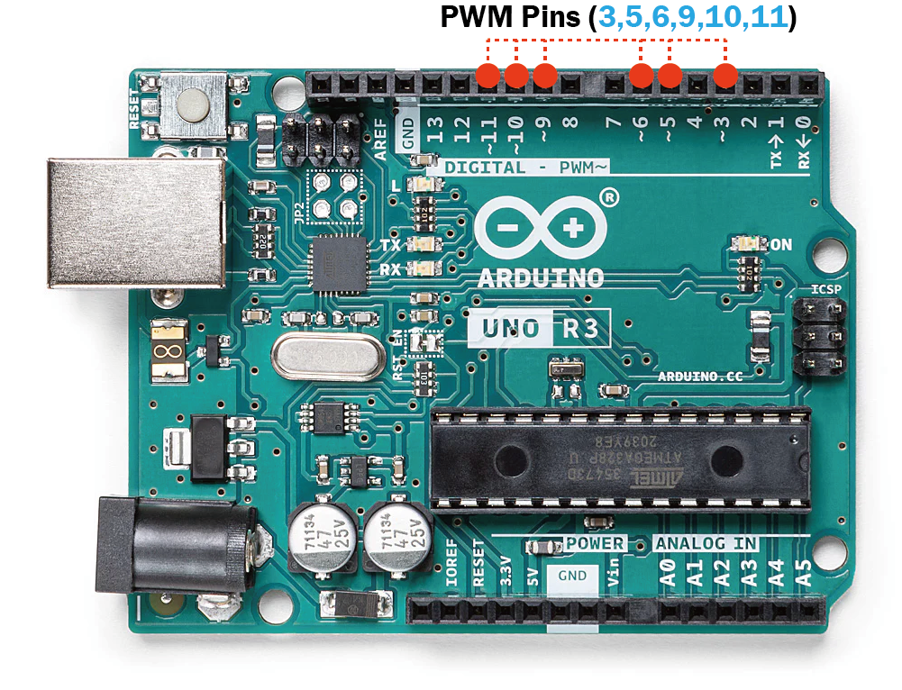

To control an LED's brightness, we use the ``analogWrite(pin, value)`` command. This adjusts the LED's brightness by changing the duty cycle of the PWM signal sent to the pin.

    * ``analogWrite(pin, value)``: Writes an analog value (PWM wave) to a pin. Can be used to light a LED at varying brightnesses or drive a motor at various speeds. 

    **Parameters**
        - ``pin``: the Arduino pin to write to. Allowed data types: int.
        - ``value``: the duty cycle: between 0 (always off) and 255 (always on). Allowed data types: int.
    
    **Returns**
        Nothing

Think of the duty cycle like a faucet's on and off pattern that controls water flow into a bucket, which represents LED brightness. Here's a simple breakdown:

* ``analogWrite(255)`` means the faucet is fully open all the time, making the bucket full and the LED brightest.
* ``analogWrite(191)`` means the faucet is open 75% of the time, making the bucket less full and the LED dimmer.
* ``analogWrite(0)`` means the faucet is completely closed, leaving the bucket empty and the LED off.

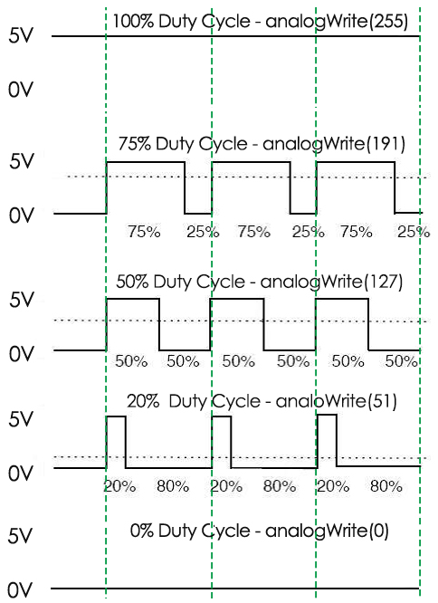

6. Add an ``analogWrite()`` command in the ``void loop()`` function and comment each line for clarity:

.. note::

    * Because the input range from the potentiometer is 0 to 1023, but the range for output to the LEDs is 0 to 255. To bridge this gap, you can scale down the potentiometer value by dividing it by 4:

    * Although the division result might not always be an integer, only the integer part is stored because the variables are declared as integers (int).

.. code-block:: Arduino
    :emphasize-lines: 11

    int potValue = 0;

    void setup() {
        // put your setup code here, to run once:
        pinMode(9, OUTPUT);  // Set pin 9 as output
    }

    void loop() {
        // put your main code here, to run repeatedly:
        potValue = analogRead(A0);        // Read value from potentiometer
        analogWrite(9, potValue / 4);       // Apply brightness to LED on pin 9
    }

7. Once the code is uploaded to the Arduino Uno R3, turning the potentiometer will change the brightness of the LEDs. According to our setup, turning the potentiometer clockwise should increase the brightness, while turning it counterclockwise should decrease it.

.. note::

    Debugging often requires checking both the code and the circuit for errors. If the code compiles correctly or seems correct but the LED do not change as expected, the issue may lie within the circuitry. Check all connections and components on the breadboard for good contact.

8. Finally, remember to save your code and tidy up your workspace.

**Summary**

In this lesson, we explored how to work with analog signals in Arduino projects. We learned how to read analog values from a potentiometer, how to process these values in the Arduino sketch, and how to control the brightness of LED using Pulse Width Modulation (PWM). We also delved into the use of variable to store and manipulate data within our sketches. By integrating these elements, we demonstrated the dynamic control of electronic components, bridging the gap between simple digital outputs and more nuanced control of hardware through analog input readings.

**Question**:

If you connect the LED to a different pin, such as pin 8, and rotate the potentiometer, will the brightness of the LED still change? Why or why not?
